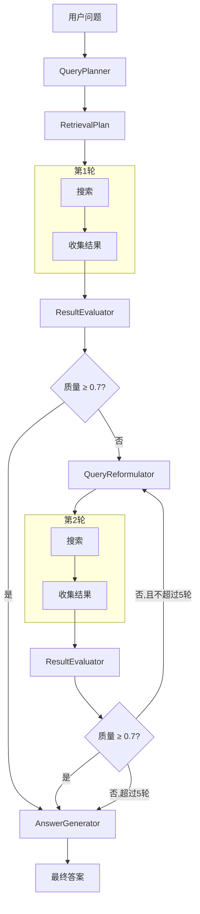
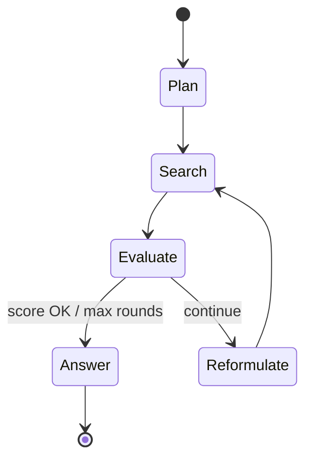

# 第七章：多轮检索引擎

> MultiRoundEngine — AgenticDB 的核心编排器。

## 前置知识

> 📎 **参考**: [检索策略](../ch06_strategy/06_检索策略_zh.md) | [LLM集成层](../ch04_llm/04_LLM集成层_zh.md)

---

## 学习目标

- 理解多轮检索的完整流程
- 掌握质量评估机制
- 学会查询重构的设计模式

---

## 7.1 完整流程



---

## 7.2 核心引擎代码

```python
class MultiRoundEngine:
    async def retrieve(self, question: str) -> RetrievalResult:
        plan = await self.planner.plan(question)
        all_results = []
        all_queries = []

        for round_num in range(1, self.config.max_rounds + 1):
            # 1. 执行搜索
            round_results = await self._execute_search(current_query)

            # 2. 去重
            for r in round_results:
                if r["id"] not in seen:
                    all_results.append(r)

            # 3. 质量评估
            eval_result = await self.evaluator.evaluate(question, all_results)
            
            if not eval_result.should_continue:
                break  # 质量达标

            # 4. 查询重构 (下一轮用)
            current_queries = await self.reformulator.reformulate(
                question, all_queries, eval_result.feedback
            )

        # 5. 生成答案
        answer = await self._generate_answer(question, all_results)
        return RetrievalResult(answer=answer, ...)
```

---

## 7.3 质量评估

LLM 从三个维度打分：

| 维度 | 含义 | 评分标准 |
|------|------|----------|
| Relevance | 结果是否相关 | 0.0-1.0 |
| Coverage | 是否覆盖问题所有方面 | 0.0-1.0 |
| Sufficiency | 信息是否足够回答 | 0.0-1.0 |

综合分数 `score` = 三个维度的加权平均。默认阈值 0.7。

评分后做了什么:

```python
# ResultEvaluator 的决策逻辑
score < 0.7  → 继续检索 (should_continue = True)
score ≥ 0.7  → 停止检索 (should_continue = False)
```

---

## 7.4 查询重构

当结果不足时，如何生成更好的查询？

```python
# QueryReformulator 的改进策略
1. 同义词替换: "深度学习" → "神经网络"
2. 添加限定: "RAG" → "RAG 架构 性能"
3. 换角度: "什么是HNSW" → "HNSW vs IVF"
4. 精化: "数据库" → "向量数据库 性能优化"
```

---

## 思考题

1. 如果第一轮搜索到的结果质量很高 (0.9)，但第二轮的新结果质量很低 (0.3)，综合评分应该怎么算？
2. `all_results` 不断增长，token 消耗也会不断增加。如何控制？
3. 查询重构可能陷入"换词但意思不变"的无效循环。如何检测？

## 动手练习

1. 在 `MultiRoundEngine` 中添加 `max_tokens_per_query` 限制
2. 实现一个 `DiversityEvaluator`：如果新结果和已有结果高度重复，提前停止
3. 为 RetrievalResult 添加序列化到 JSON 的方法，保存每次检索的详细日志

---

## 点 → 线 → 面（本章定位）

| 层级 | 内容 |
|------|------|
| **点** | `async/await`、状态机循环、`EvalResult.should_continue` |
| **线** | Planner → Embedding → `POST /search` → Evaluator → Reformulator |
| **面** | 用户 `/ask` 到最终答案的完整 Agentic RAG |



## 真实面试题

见 [`INTERVIEW_BANK.md`](../INTERVIEW_BANK.md) **Q-H1, Q-H2**。

## 参考文档 / References

1. 本仓库：`agent/engine/multi_round.py`, `result_evaluator.py`, `query_reformulator.py`  
2. FastAPI lifespan / Pydantic v2 docs  
3. Hello-Agents — Agent 规划与工具调用章节精神  
4. Anthropic MCP spec（若启用 MCP 轨）  
5. [`ARCHITECTURE.md`](../../ARCHITECTURE.md) Agent↔DB 序列  
6. [`docs/openapi.yaml`](../../docs/openapi.yaml) 搜索契约

---

## 附录：本章与面试题库映射

请完成本章后练习 [INTERVIEW_BANK.md](../INTERVIEW_BANK.md) 中对应分区题目，并阅读 [_CHAPTER_TEMPLATE.md](../_CHAPTER_TEMPLATE.md) 自检是否覆盖「点/线/面/动手/反思/参考」。

**全局架构：** [ARCHITECTURE.md](../../ARCHITECTURE.md) · **选型：** [TECH.md](../../../TECH.md) · **运行：** [RUN.md](../../../RUN.md)
