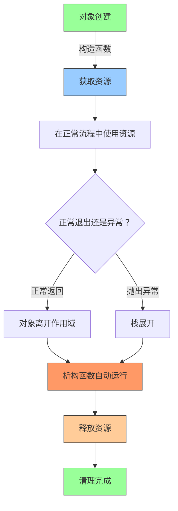
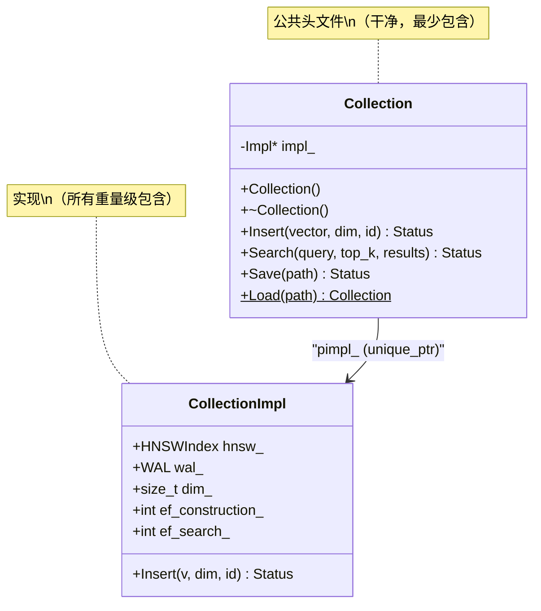
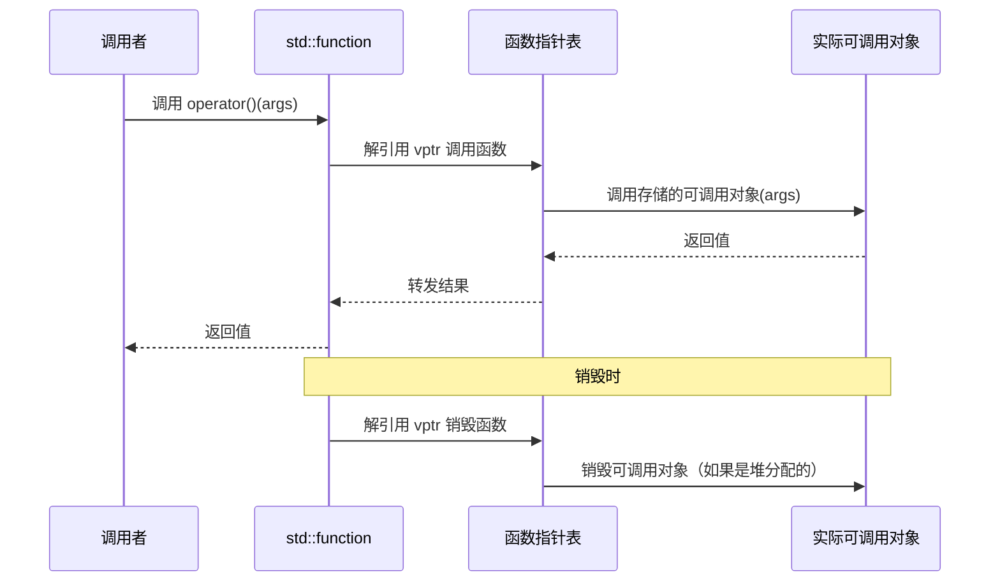

# 第8章 — DeepVector 中的 C++ 设计模式

## 前置知识

> 📎 **参考**: [SIMD与硬件优化](../prerequisites/06_SIMD与硬件优化.md) — SIMD 指令集（SSE/AVX/AVX512/NEON）和硬件内部函数。
> 📎 **参考**: [测试框架](../prerequisites/04_测试框架.md)
> 📎 **参考**: [构建环境配置](../prerequisites/01_构建环境配置.md)

---

## 为什么设计模式在 C++ 中更重要

每种语言都有模式，但 C++ 使它们在 Java、Python 或 Go 所不具备的方式上变得*至关重要*。原因是控制力。C++ 给你直接的内存管理、零成本抽象、编译时计算和硬件内部函数访问。这些是强大的工具——但也是陷阱。在垃圾回收语言中，你可以忘记释放资源，运行时会清理。在 C++ 中，你会得到泄漏、悬空指针或未定义行为。在托管语言中，你不会意外地在没有同步的情况下读取另一个线程的内存。在 C++ 中，你可以，这个 bug 会在几天后在不同的机器上显现。

C++ 中的设计模式不是装饰品。它们是生存策略。RAII 的存在是因为 C++ 没有垃圾回收器，异常可以在任何时刻抛出。PIMPL 的存在是因为 C++ 在头文件中暴露了实现细节，构建系统为每个 include 付出代价。类型擦除的存在是因为 C++ 模板为每个具体类型生成一个单独的函数体，你需要一种方式说"我不关心你是什么类型，只要调用我"。

本章涵盖 DeepVector 实际使用的模式。每个模式都呈现为：它解决的问题、它的历史、它如何工作、权衡，以及它在 DeepVector 中出现的位置。我们从基础概念开始，逐步构建到并发。

---

## 8.1 什么是设计模式？

**设计模式**是对软件设计中常见问题的有名字的、有文档的、可重用的解决方案。这个术语由"四人帮"——Erich Gamma、Richard Helm、Ralph Johnson 和 John Vlissides——在他们 1994 年的书《Design Patterns: Elements of Reusable Object-Oriented Software》中推广。但模式本身早于这本书。它们是被发现的，而不是发明的。这本书只是命名和编目了有经验的程序员已经知道的东西。

为什么要费心命名它们？因为共享的词汇很强大。说"在这里使用 PIMPL"比解释"将你的私有成员隐藏在不透明指针后面，这样对实现的更改不会强制重新编译所有依赖的翻译单元"更快。一个好的模式名用两个词捕获了问题、解决方案和权衡。

本章涵盖 DeepVector 实际使用的模式——不是一个全面的目录，而是那些在真实 C++ 代码库中解决真实问题的模式。

---

## 8.2 RAII — 资源获取即初始化

### 问题

资源必须释放。文件描述符必须关闭。内存必须释放。互斥锁必须解锁。如果你获取资源后忘记释放它，你就有了泄漏。如果你释放两次，你就有了双重释放。如果在获取和释放之间抛出异常，你就有了泄漏*并且可能*状态损坏。

C 在这里帮不了你。`malloc` 和 `free` 完全是程序员的责任。每个 C 程序员都花过数小时追踪因 `fopen` 和 `fclose` 之间的提前返回导致的泄漏。

### 历史

**RAII** — **资源获取即初始化** — 可以说是 C++ 中最重要的习语。这个术语由 C++ 的创造者 Bjarne Stroustrup 在他 1984 年的论文"Data Abstraction in C"中创造，后来在《The C++ Programming Language》（1985 年第 1 版）中正式确立。Stroustrup 需要一种在没有垃圾回收器的情况下管理资源的方法。他的洞察：C++ 语言已经保证析构函数在对象离开作用域时运行。如果你在构造函数中获取资源，在析构函数中释放它，你就得到了自动清理——没有运行时开销，没有 GC 停顿，不需要程序员纪律。

这对 C++ 是独特的，原因很微妙：C++ 具有确定性析构。在 Java 中，当你调用 `close()` 关闭文件时，运行时*最终*运行终结器，但你不知道什么时候。在 C++ 中，当对象离开作用域时，析构函数*立即*运行，在同一个栈帧上。这种确定性使得 RAII 在异常下是安全的——栈展开机制按构造的逆序调用析构函数，保证清理。

没有其他主流语言在相同程度上具有这种特性。Rust 借用了这个概念（它的 `Drop` trait），但 Rust 没有 C++ 的构造函数/析构函数对称性。Python 有 `__del__`，但它由垃圾回收器调用，可能在任何时候运行或根本不运行。

### 解决方案

将资源生命周期绑定到对象生命周期：在构造函数中获取资源，在析构函数中释放它。当对象离开作用域——无论是正常返回、提前返回还是异常——析构函数自动运行并释放资源。

### RAII 生命周期



把 RAII 想象成自动门关闭器。你把门推开（构造函数），关闭器机制（析构函数）在你身后把门关上。你不需要记住关门。你不会忘记。即使你绊倒了（异常），门仍然会关闭。

### C++ 中的关键 RAII 类型

| 类型 | 管理的资源 | 构造函数获取 | 析构函数释放 |
|------|-----------------|---------------------|---------------------|
| `std::unique_ptr<T>` | 堆内存 | `new T` | `delete ptr` |
| `std::lock_guard<M>` | 互斥锁所有权 | `mutex.lock()` | `mutex.unlock()` |
| `std::ifstream` | 文件句柄 | `open()` | `close()` |
| `std::vector<T>` | 堆缓冲区 | `allocate()` | `deallocate()` |
| `FILE*` wrapper | C 文件描述符 | `fopen()` | `fclose()` |

### DeepVector 中的 RAII

```cpp
class MMapFile {
public:
    MMapFile(const std::string& path, bool read_only = true)
        : fd_(-1), data_(nullptr), size_(0) {
        int flags = read_only ? O_RDONLY : O_RDWR | O_CREAT;
        fd_ = open(path.c_str(), flags, 0644);
        if (fd_ < 0) throw std::runtime_error("open failed: " + path);

        struct stat st;
        fstat(fd_, &st);
        size_ = st.st_size;
        if (size_ == 0 && !read_only) size_ = 4096;

        int prot = read_only ? PROT_READ : PROT_READ | PROT_WRITE;
        data_ = static_cast<char*>(mmap(nullptr, size_, prot, MAP_SHARED, fd_, 0));
        if (data_ == MAP_FAILED) {
            close(fd_);
            throw std::runtime_error("mmap failed");
        }
    }

    ~MMapFile() {
        if (data_ && data_ != MAP_FAILED) munmap(data_, size_);
        if (fd_ >= 0) close(fd_);
    }

    MMapFile(const MMapFile&) = delete;
    MMapFile& operator=(const MMapFile&) = delete;
    MMapFile(MMapFile&& other) noexcept
        : fd_(other.fd_), data_(other.data_), size_(other.size_) {
        other.fd_ = -1;
        other.data_ = nullptr;
        other.size_ = 0;
    }

    const char* Data() const { return data_; }
    size_t Size() const { return size_; }

private:
    int fd_;
    char* data_;
    size_t size_;
};
```

DeepVector 中的每个资源都遵循此模式：
- `HNSWIndex` 构造函数分配图的邻接表；析构函数删除它们。
- `VectorStore` 构造函数内存映射数据文件；析构函数 munmap 它。
- `Collection` 析构函数刷新 MemTable 并同步 WAL。

**析构函数永远不应抛出。** C++ 委员会的指导（ISO C++ Core Guidelines C.36）：如果析构函数在栈展开期间抛出（即你已经在处理异常），则调用 `std::terminate`。DeepVector 在析构函数中记录错误但从不传播它们。

### 前后对比

没有 RAII（C 风格）：
```cpp
void ProcessFile(const char* path) {
    FILE* f = fopen(path, "rb");
    if (!f) return;
    char* buf = (char*)malloc(4096);
    if (!buf) { fclose(f); return; }
    // ... use buf and f ...
    // Early return here leaks both buf and f
    if (error_condition) return;  // LEAK: fclose(f) and free(buf) never called
    free(buf);
    fclose(f);
}
```

使用 RAII（C++ 风格）：
```cpp
void ProcessFile(const std::string& path) {
    std::ifstream f(path, std::ios::binary);  // acquires file handle
    std::vector<char> buf(4096);              // acquires heap buffer
    // ... use buf and f ...
    if (error_condition) return;  // safe: destructors run automatically
    // buf and f released here when scope ends
}
```

---

## 8.3 PIMPL — 指向实现的指针

### 问题

在 C++ 中，头文件中的类定义必须声明*所有东西*——公共方法、私有方法、私有成员变量。没有办法说"这些细节是私有的，相信我。"编译器需要知道每个对象的大小来分配它，而没有看到所有成员，它无法计算大小。

这意味着如果你在 `collection.h` 中更改一个私有字段，每个包含 `collection.h` 的 `.cpp` 文件都必须重新编译。在一个大项目中，这可能是数百个文件。一个 30 秒的编辑变成了一个 10 分钟的重建。

更糟的是，私有字段拖入了自己的头文件。如果 `Collection` 有一个类型为 `HNSWIndex` 的私有成员，那么 `collection.h` 必须包含 `hnsw_index.h`，它包含 `distance.h`，它包含 SIMD 内部函数头文件...现在你改变任何东西时整个代码库都会重新编译。

### 历史

PIMPL 习语——**指向实现的指针**，也称为**"柴郡猫"**习语（以《爱丽丝梦游仙境》中咧嘴笑的猫命名，它消失了，只留下笑容）——由 David Reed 于 1992 年首次描述，由 John Torjo 在早期 C++ GUI 框架中推广。名称"编译器防火墙"后来出现，强调它作为公共头文件和私有实现之间的屏障的作用。

随着 C++ 代码库的增长，这个习语变得至关重要。在 1990 年代，大型项目的编译时间超过 30 分钟很常见。PIMPL 是最早的"构建时间优化"模式之一。它还为库供应商解决了一个实际问题：**二进制兼容性**（也称为 **ABI 稳定性**）。如果库供应商发布一个更改私有成员的新版本，所有客户端都必须重新链接。使用 PIMPL，更改 `Impl` 类不会改变公共头文件的布局，因此客户端不需要重新编译或重新链接。

### 关键术语定义

- **编译防火墙（Compilation firewall）**：一种技术，防止一个翻译单元（`.cpp` 文件）中的更改强制重新编译其他翻译单元。PIMPL 是 C++ 中的主要编译防火墙。
- **二进制兼容性（ABI 稳定性）**：在不重新编译或重新链接使用它的程序的情况下替换共享库（`.dll`、`.so`）的能力。PIMPL 保留 ABI 稳定性，因为公共类的大小和布局永远不会改变。
- **翻译单元（Translation unit）**：编译器在预处理 `.cpp` 文件及其包含的所有头文件后看到的内容。每个 `.cpp` 文件编译成一个翻译单元。
- **前向声明（Forward declaration）**：声明一个名称（类、函数）而不定义它。`class Impl;` 告诉编译器"Impl 存在，但其细节在别处。"这让你可以使用 `Impl*` 而不需要包含其定义。

### 解决方案

PIMPL 将所有内容隐藏在不透明指针后面。公共头文件只声明公共 API 和一个前向声明的指向实现类的指针。所有私有细节都在 `.cpp` 文件中，对包含者不可见。

### PIMPL 类图



把它想象成一个外交使馆。公共头文件是使馆的前台——任何人都可以看到它、与之交互。实现文件是安全的内部——只有使馆工作人员（`.cpp` 文件）知道里面是什么。改变内部布局不影响访问者在前台看到的内容。

### 前后对比

之前：`bad_widget.h` 包含 `expensive_dep.h`（它拉入 50+ 个头文件），在其声明中暴露 `std::unordered_map`。对 map 类型或依赖的任何更改都强制全局重建。

```cpp
// BEFORE: all dependents pay for expensive_dep.h
class BadWidget {
    ExpensiveDep dep_;                                // pulls in 50 headers
    std::unordered_map<std::string, int> data_;       // exposes implementation
public:
    void Set(const std::string& k, int v) { /* inline */ }
};
```

使用 PIMPL 之后：

```cpp
// collection.h — PUBLIC HEADER (clean, minimal includes)
#include <memory>
#include <vector>

class Collection {
public:
    Collection();
    ~Collection();                      // must be defined in .cpp

    Collection(Collection&&) noexcept;
    Collection& operator=(Collection&&) noexcept;

    Collection(const Collection&) = delete;
    Collection& operator=(const Collection&) = delete;

    Status Insert(const float* vector, int dim, int64_t id);
    Status Search(const float* query, int top_k,
                  std::vector<std::pair<float, int64_t>>* results) const;
    Status Save(const std::string& path) const;
    static Collection Load(const std::string& path);

private:
    class Impl;
    std::unique_ptr<Impl> impl_;
};

// collection.cpp — IMPLEMENTATION (all the heavy includes live here)
#include "hnsw_index.h"
#include "wal.h"
#include "bloom_filter.h"

class Collection::Impl {
public:
    HNSWIndex  hnsw_;
    WAL        wal_;
    size_t     dim_;
    int        ef_construction_ = 200;
    int        ef_search_       = 64;

    Status Insert(const float* v, int dim, int64_t id) { /* ... */ }
};

Collection::Collection() : impl_(std::make_unique<Impl>()) {}
Collection::~Collection() = default;
```

### PIMPL 如何减少构建时间

考虑一个有 200 个包含 `collection.h` 的 `.cpp` 文件的项目：

| 场景 | 私有字段更改时需要重新编译的文件数 |
|----------|----------------------------------------------|
| 不使用 PIMPL | 200 个文件（所有包含者） |
| 使用 PIMPL | 1 个文件（`collection.cpp`） |

节省是乘法的：这 200 个文件中的每一个都可能包含其他头文件，每个头文件又包含其他头文件。PIMPL 在根部消除了这种级联。

### 何时使用 PIMPL

**是：**
- 具有许多依赖的公共 API 类（`Collection`、`Database`、`Snapshot`）。
- 私有成员拉入昂贵头文件的类。
- 当你需要 ABI 稳定性（更改 `Impl` 不改变虚表布局）时。

**否：**
- 创建数百万次的值类型。PIMPL 需要堆分配——100 万个 PIMPL 对象 = 100 万次堆分配。
- 依赖很少的内部类（一两个 `.cpp` 文件包含它们）。
- 已经在接口后面的类（虚基类）——虚表已经提供了间接层。

### PIMPL 的成本

- **每个对象一次堆分配**：`std::make_unique<Impl>()`。对于长期存在的对象（Collection 在进程生命周期内存在），这可以忽略不计。
- **每次调用一次指针间接**：`impl_->Search(...)`。CPU 分支预测器对非平凡函数处理得很好。
- **没有内联方法**：实现位于 `.cpp` 文件中，因此编译器不能跨 PIMPL 边界内联。对于热路径方法，DeepVector 暴露返回内部指针的 `getRaw()` 方法，绕过 PIMPL。

---

## 8.4 类型擦除

### 问题

你想让用户提供自己的距离函数。它可以是自由函数、lambda、仿函数（带有 `operator()` 的结构体）、`std::bind` 表达式，甚至是成员函数指针。所有都有不同的类型。你如何将"任何具有签名 `float(const float*, const float*, int)` 的可调用对象"存储在单个变量中？

在没有类型擦除的 C++ 中，你需要一个虚基类：

```cpp
class DistanceMetric {
    virtual float Compute(const float* a, const float* b, int dim) const = 0;
    virtual ~DistanceMetric() = default;
};
```

这迫使用户派生子类，阻止内联 lambda，并为每个度量对象添加一个虚表指针。对于本应简单的事情，这是重型机械。

### 历史

**类型擦除**作为一个概念早于 C++。这个想法：将不同具体类型的对象存储在统一接口后面，其中具体类型被"擦除"——持有者只知道接口。在 C++ 中，该技术由 Kevlin Henney 在 2000 年左右正式确立，是 `std::function`（C++11 引入，2011 年标准化）、`std::any`（C++17）和 `std::packaged_task` 背后的机制。

关键洞察：如果你可以通过存储在对象旁边的函数指针进行调度，你就不需要继承。"虚表"不是类的虚表——它是存储在类型擦除包装器中的一对函数指针（一个用于操作，一个用于销毁）。

### `std::function` 内部工作原理

底层上，`std::function<float(const float*, const float*, int)>` 包含：

1. **函数指针表**（像手动虚表）：指向 `invoke`、`destroy` 和 `clone` 操作的指针。
2. **存储缓冲区**：要么在栈上（**小缓冲区优化**，SBO），要么在堆上。

### 类型擦除内部结构



```
std::function 签名:
┌─────────────────────────────────┐
│  函数指针表 (vptr)              │  ← 指向类型特定的 invoke/destroy/clone
├─────────────────────────────────┤
│  存储缓冲区 (SBO 或堆)         │  ← 持有实际的可调用对象
└─────────────────────────────────┘
```

**小缓冲区优化（SBO）**：大多数实现在 `std::function` 对象本身内保留约 16-32 字节。如果可调用对象适合（没有捕获的简单 lambda、函数指针），它被内联存储——没有堆分配。如果它更大（捕获了 vector 的 lambda），它在堆上分配，缓冲区持有指针。

你可以在你的平台上测量这个：
```cpp
#include <iostream>
#include <functional>

int main() {
    std::cout << "sizeof(std::function<void()>) = "
              << sizeof(std::function<void()>) << "\n";
}
```

典型结果：libstdc++（GCC）上 32 字节，libc++（Clang）上 32 字节，MSVC 上 64 字节。

### DeepVector 中的类型擦除

```cpp
// Without type erasure: every distance metric must subclass
class DistanceMetric {
    virtual float Compute(const float* a, const float* b, int dim) const = 0;
};

// With type erasure: std::function accepts any callable (lambda, functor, free function)
class Index {
    using DistanceFn = std::function<float(const float*, const float*, int)>;
    DistanceFn dist_;
public:
    template <typename F>
    void SetDistance(F&& fn) { dist_ = std::forward<F>(fn); }

    void Search(const float* q, const float** base, int N, int dim) {
        for (int i = 0; i < N; i++)
            float d = dist_(q, base[i], dim);
    }
};
```

### 何时使用每种策略

- **`std::function`**（类型擦除）：不经常更改的回调，小捕获（SBO 适合）。虚调用开销被繁重的工作分摊。
- **虚函数 + 继承**：多个相关方法，层次结构中的共享状态。经典 OOP 多态。
- **`template <typename F>`**：零成本（单态化）。在类型在编译时已知的热路径中使用。DeepVector 的 SIMD 层使用此方法。

DeepVector 在 `Index` 中使用 `std::function` 作为距离度量：在构造时设置一次，调用数百万次。SBO（在 libstdc++ 上通常 32 字节）适合大多数简单 lambda。

### 类型擦除 vs. 继承：比较

| 方面 | `std::function`（类型擦除） | 虚继承 |
|--------|-------------------------------|---------------------|
| 用户工作量 | 传递任何可调用对象 | 必须派生子类 |
| 堆分配 | 仅在 SBO 失败时 | 总是（虚表指针） |
| 内联 | 否（函数指针调用） | 否（虚调用） |
| 多个方法 | 仅一个签名 | 多个虚方法 |
| 编译时类型已知 | 可以在调用点优化 | 永远不 |

---

## 8.5 shared_mutex — 读写锁

### 为什么不用 `std::mutex`？

**`std::mutex`**（互斥锁）序列化所有访问。如果 8 个线程尝试同时读取 HNSW 图，只有一个可以持有互斥锁。其他 7 个旋转或休眠，浪费 CPU 核心。在处理每秒 100 个查询的 32 核服务器上，这是灾难——31 个核心空闲，一个工作。

**互斥锁（Mutex）**（来自"mutual exclusion"，互斥）是一种同步原语，确保一次只有一个线程可以访问临界区。它是最简单的并发工具，但它对所有操作一视同仁——读和写获得相同的锁。

### 读写模式

**读写锁**（也称为**读写锁**）区分两种操作：

- **读**：观察数据而不修改它。多个读取器可以同时进行，因为它们不冲突。
- **写**：修改数据。一次只能有一个写入器进行，写入期间没有读取器可以活跃。

关键洞察：读是交换的（多个读不干扰），但写是排他的。读写锁利用了这种不对称性。

**`std::shared_mutex`**（C++17）实现了此模式：
- **共享（读）锁**（`std::shared_lock`）：多个线程可以同时持有它。当你只需要读取数据——没有修改——时使用。
- **排他（写）锁**（`std::unique_lock`）：只有一个线程可以持有它。所有其他读取器和写入器都被阻塞。

这非常适合 HNSW 索引：搜索是读取器（检查邻接表、计算距离），插入是写入器（添加节点、更新边）。100 个并发搜索都持有共享锁并行运行。当插入到来时，它等待所有正在进行的搜索完成，获取排他锁，修改图，然后释放。

### 关键术语定义

- **`std::shared_mutex`**：C++17 标准库类，实现读写锁。支持 `std::shared_lock`（读）和 `std::unique_lock`（写）。
- **自旋锁（Spinlock）**：一种忙等待（旋转）而不是休眠的锁。对于非常短的临界区（纳秒）更快，因为它避免了将线程休眠和唤醒的开销。对于长等待更差，因为它烧 CPU 周期。Linux 的 `spinlock_t` 是一个例子。
- **无锁（Lock-free）**：一种数据结构或算法，保证至少一个线程在有限步骤内取得进展，即使其他线程被挂起。无锁不意味着"没有锁"——它意味着算法不使用传统锁（互斥锁）。它通常使用原子操作代替。
- **并发数据结构（Concurrent data structure）**：一种设计为由多个线程同时访问而无需外部同步，或仅需最小细粒度同步的数据结构。示例：并发哈希映射、无锁队列、跳表。

### 代码

```cpp
#include <shared_mutex>

class ThreadSafeCache {
public:
    std::optional<Value> Get(const Key& key) const {
        std::shared_lock lock(mutex_);  // multiple readers OK
        auto it = cache_.find(key);
        if (it != cache_.end()) return it->second;
        return std::nullopt;
    }

    void Put(const Key& key, const Value& val) {
        std::unique_lock lock(mutex_);  // exclusive — blocks everyone
        cache_[key] = val;
    }

private:
    mutable std::shared_mutex mutex_;
    std::unordered_map<Key, Value> cache_;
};
```

### 写入器饥饿

有一个问题：如果读取器不断到来，写入器可能无限期等待。C++ 标准没有指定 `std::shared_mutex` 的公平性保证。一些实现（MSVC）优先考虑写入器；其他（libstdc++）可能允许写入器饥饿——读取器流阻止写入器获取锁。

DeepVector 使用自定义的**公平读写锁**来防止饥饿：

```cpp
class FairRWLock {
    std::mutex m_;
    std::condition_variable cv_read_, cv_write_;
    int readers_ = 0, waiting_writers_ = 0;
    bool writing_ = false;

public:
    void LockRead() {
        std::unique_lock lk(m_);
        cv_read_.wait(lk, [this] { return !writing_ && waiting_writers_ == 0; });
        readers_++;
    }
    void UnlockRead() {
        std::unique_lock lk(m_);
        if (--readers_ == 0 && waiting_writers_ > 0) cv_write_.notify_one();
    }
    void LockWrite() {
        std::unique_lock lk(m_);
        waiting_writers_++;
        cv_write_.wait(lk, [this] { return readers_ == 0 && !writing_; });
        waiting_writers_--;
        writing_ = true;
    }
    void UnlockWrite() {
        std::unique_lock lk(m_);
        writing_ = false;
        waiting_writers_ > 0 ? cv_write_.notify_one() : cv_read_.notify_all();
    }
};
```

当写入器到来时，它递增 `waiting_writers_`。新的读取器看到这个并阻塞——为等待的写入器"把门"。当写入器完成时，它通知下一个写入器（FIFO）或唤醒所有读取器。

---

## 8.6 Const 正确性与 `mutable`

### 哲学

**Const 正确性**是用 `const` 标记变量、参数和成员函数的做法，只要它们不打算被修改。它向人类读者和编译器传达意图。编译器强制执行它：如果你将成员函数声明为 `const` 然后尝试修改成员，编译器会阻止你。

为什么这是一个"模式"而不仅仅是一个关键字？因为 const 渗透整个代码库——你不能"有点 const"。要么每个读取数据的函数都是 const，要么系统不工作。这是一个全有或全无的纪律。

### `mutable` — 逃生舱口

有时一个方法在逻辑上是 const（它不改变可观察状态），但在物理上需要修改某些东西（缓存、互斥锁、延迟初始化标志）。`mutable` 是说"这个字段即使在 const 方法中也允许更改"的关键词。

`mutable` 的有效用法：
- **缓存**：缓存昂贵查找的 `block_offset_cache_`。
- **互斥锁**：`mutable std::shared_mutex` — 锁定互斥锁会改变其状态，但它是对调用者不可见的实现细节。
- **延迟初始化**：在首次访问时设置的标志 `index_parsed_`。

```cpp
class SSTableReader {
public:
    Status Get(const Slice& key, std::string* value) const;
private:
    MMapFile file_;

    mutable std::shared_mutex cache_mutex_;
    mutable std::unordered_map<uint64_t, uint32_t> block_offset_cache_;
    mutable std::unique_ptr<BloomFilter> bloom_;
    mutable bool bloom_parsed_ = false;

    const BloomFilter& GetBloomFilter() const {
        std::shared_lock lock(cache_mutex_);
        if (!bloom_parsed_) {
            lock.unlock();
            std::unique_lock ulock(cache_mutex_);
            if (!bloom_parsed_) {           // double-checked locking
                bloom_ = ParseBloomFilter(file_);
                bloom_parsed_ = true;
            }
        }
        return *bloom_;
    }
};
```

**规则**：`mutable` 用于缓存、互斥锁和延迟初始化标志。永远不要用它来改变可观察行为的字段。如果一个 const `Get()` 修改了存储的值，它不应该是 const。

---

## 8.7 SFINAE 与 SIMD 分发

### 什么是 SFINAE？

**SFINAE** 代表**替换失败不是错误（Substitution Failure Is Not An Error）**。当编译器尝试将模板参数替换到函数签名中时，如果替换产生无效代码，它不会发出错误——它只是从考虑中删除该重载并继续。

这是 `std::enable_if`、`if constexpr` 和 concepts（C++20）背后的机制。它允许基于类型属性的条件编译，而无需预处理器宏。

这个术语由 Dave Abrahams 在 2003 年的 C++ 委员会会议上创造。这个概念在此之前就存在（编译器已经在这样做），但命名它使其可教授。

### 使用 `if constexpr` 进行 SIMD 分发

DeepVector 的距离函数是单一最热的代码路径——每个查询批次被调用数十亿次。标量（每次操作 1 个浮点数）、SSE（4 个浮点数）和 AVX2（8 个浮点数）之间的性能差异是 4-8 倍。我们想编译一个使用目标 CPU 上最佳可用 SIMD 指令集的二进制文件。

> 📎 **参考**: [SIMD与硬件优化](../prerequisites/06_SIMD与硬件优化.md) — SIMD 指令集（SSE/AVX/AVX512/NEON）的详细说明、内部函数和性能特性。

旧方法（`#ifdef`）：编译器运行前的文本替换。只有匹配的分支存活——其他分支从不进行类型检查，因此非匹配分支中的 bug 直到有人用不同标志编译时才会被发现。`#ifdef` 还迫使你为每个 CPU 发布单独的二进制文件（或最低公分母构建）。

现代方法（`if constexpr`）：

```cpp
enum class SIMDLevel { None, SSE, AVX2, AVX512, NEON };

#ifdef __AVX512F__
constexpr SIMDLevel kBestSIMD = SIMDLevel::AVX512;
#elif defined(__AVX2__)
constexpr SIMDLevel kBestSIMD = SIMDLevel::AVX2;
#elif defined(__SSE2__)
constexpr SIMDLevel kBestSIMD = SIMDLevel::SSE;
#elif defined(__ARM_NEON)
constexpr SIMDLevel kBestSIMD = SIMDLevel::NEON;
#else
constexpr SIMDLevel kBestSIMD = SIMDLevel::None;
#endif

template <SIMDLevel L>
float L2Distance(const float* a, const float* b, size_t dim) {
    if constexpr (L == SIMDLevel::AVX2) {
        __m256 sum = _mm256_setzero_ps();
        size_t i = 0;
        for (; i + 8 <= dim; i += 8) {
            __m256 va = _mm256_loadu_ps(a + i);
            __m256 vb = _mm256_loadu_ps(b + i);
            __m256 diff = _mm256_sub_ps(va, vb);
            sum = _mm256_fmadd_ps(diff, diff, sum);
        }
        float result = horizontal_sum_avx(sum);
        for (; i < dim; i++) { float d = a[i] - b[i]; result += d * d; }
        return std::sqrt(result);
    } else if constexpr (L == SIMDLevel::SSE) {
        // SSE: 4 floats per register
        // ...
    } else {
        // Scalar fallback
        float sum = 0;
        for (size_t i = 0; i < dim; i++) { float d = a[i] - b[i]; sum += d * d; }
        return std::sqrt(sum);
    }
}

// Dispatch at the API boundary
float L2Distance(const float* a, const float* b, size_t dim) {
    return L2Distance<kBestSIMD>(a, b, dim);
}
```

`if constexpr` 在编译时求值条件。每个模板实例化只编译一个分支。但关键是：**所有分支都被解析并检查语法正确性**，即使是死分支。这意味着如果你破坏了 SSE 分支，编译器会告诉你——即使你正在用 AVX2 编译。这是相对于 `#ifdef` 的关键优势。

---

## 8.8 错误处理：Status、Exception 和 optional

没有一种万能的错误处理策略。DeepVector 使用四种机制，每种适合不同的上下文：

| 机制 | 何时使用 | DeepVector 中的示例 |
|-----------|-------------|---------------------|
| `Status` | I/O 操作、网络调用、面向用户的 API | `Status s = db.Open(path);` |
| `std::optional<T>` | 可能找不到结果的查找（不是错误） | `auto v = cache.Get(key);` |
| Exception | 不变量违规、程序员 bug、OOM | `throw std::invalid_argument("dim mismatch");` |
| `assert()` | 仅调试检查、前置/后置条件 | `assert(dim > 0 && dim % 8 == 0);` |

### Status 模式

```cpp
enum class StatusCode { OK, NotFound, IOError, CorruptData, InvalidArg, OOM };

class Status {
public:
    static Status OK() { return Status(StatusCode::OK); }
    static Status NotFound(const std::string& msg) { return Status(StatusCode::NotFound, msg); }
    static Status IOError(const std::string& msg) { return Status(StatusCode::IOError, msg); }

    bool ok() const { return code_ == StatusCode::OK; }
    StatusCode code() const { return code_; }
    const std::string& message() const { return msg_; }

    explicit operator bool() const { return ok(); }

private:
    StatusCode code_;
    std::string msg_;
};
```

**为什么不用异常？** 异常需要栈展开，在 100K-QPS 搜索循环中会破坏吞吐量。`Status` 是简单的值返回——没有展开，没有分配（对于 OK），容易检查。调用者决定是否传播、记录或重试。

**为什么不用 `std::expected<T, E>`（C++23）？** 它是一个有效的替代方案——比 out 参数更清晰的成功值。但在 DeepVector 设计时，`expected` 不可用。带 out 参数的 `Status` 是务实的选择。

### 工厂模式：Create vs Load

`Collection` 可以来自两个路径——新创建或从磁盘加载。这些有不同的语义和失败模式。DeepVector 将它们分离：

```cpp
class Collection {
    class Impl;
    std::unique_ptr<Impl> impl_;
    Collection() = default;  // private

public:
    static Collection Create(const CollectionConfig& config) {
        Collection c;
        c.impl_ = std::make_unique<Impl>();
        c.impl_->InitEmpty(config);
        return c;
    }

    static Collection Load(const std::string& path) {
        Collection c;
        c.impl_ = std::make_unique<Impl>();
        c.impl_->LoadFromDisk(path);  // may return Status on failure
        return c;
    }
};
```

私有构造函数 + 静态工厂方法使意图明确。`Collection c;` 不会编译——你必须说明你是创建还是加载。这是"命名构造函数"习语的温和形式，优于仅参数类型不同的重载构造函数。

---

## 8.9 并发模式：线程池、ABA 问题、内存排序

这些模式出现在 DeepVector 的后台压缩和 WAL 刷新线程中。它们更高级——在掌握前面的模式后学习它们。

### 线程池

**线程池**维护固定数量的线程，等待工作项。你不是为每个任务生成新线程（昂贵：线程创建成本约 10 微秒，加上 1MB 栈），而是将工作提交给池并重用现有线程。

```
┌─────────┐  ┌─────────┐  ┌─────────┐  ┌─────────┐
│ Thread 1 │  │ Thread 2 │  │ Thread 3 │  │ Thread 4 │
└────┬─────┘  └────┬─────┘  └────┬─────┘  └────┬─────┘
     │              │              │              │
     └──────────────┴──────────────┴──────────────┘
                          │
                   ┌──────┴──────┐
                   │  工作队列    │
                   └─────────────┘
```

**工作窃取**：当线程的本地队列为空时，它从另一个线程的队列"窃取"工作。这在没有中心锁的情况下平衡负载。Intel 的 TBB（线程构建模块）和 Folly（Facebook 的 C++ 库）实现了工作窃取线程池。

**死信队列**：一个队列，保存未能处理的工作项（例如遇到损坏 SSTable 的压缩任务）。你不是无限重试或丢弃工作，而是将其移动到死信队列以进行手动检查或以后重试。

### ABA 问题

**ABA 问题**出现在使用比较和交换（CAS）的无锁算法中。考虑一个线程从共享指针读取值 A，被抢占，另一个线程将指针从 A 改为 B 再改回 A。当第一个线程恢复并执行 CAS(expected=A, new=C) 时，CAS 成功——但地址 A 处的对象可能与第一个线程最初读取的对象*不同*。

```
Thread 1: reads ptr = A (object at address 0x1000)
Thread 1: preempted
Thread 2: ptr = B (object at address 0x2000)
Thread 2: ptr = A (new object at address 0x3000, but value is "A")
Thread 1: resumes, CAS(ptr, A, C) succeeds — but ptr points to a different object!
```

**解决方案**：标记指针（在指针上附加计数器，每次更改递增）、危险指针（跟踪每个线程正在读取的指针），或基于纪元的回收（延迟删除直到没有线程可能持有引用）。

### 内存排序

当线程 A 写 `x = 1; y = 2;`，线程 B 读 `if (y == 2) assert(x == 1);` 时，断言保证通过吗？**不一定。** 现代 CPU 和编译器可以重新排序指令以提高性能。

**内存排序**定义了读写何时对其他线程可见的规则。C++11 引入了 `<atomic>`，具有五种内存排序：

| 排序 | 保证 | 用例 |
|----------|-----------|----------|
| `memory_order_relaxed` | 仅原子性，无排序 | 计数器、统计 |
| `memory_order_acquire` | 此之后的读看到释放写之前的所有写 | 锁获取、加载指针 |
| `memory_order_release` | 此之前的所有写对获取的线程可见 | 锁释放、存储指针 |
| `memory_order_acq_rel` | 同时获取和释放 | 读-修改-写操作 |
| `memory_order_seq_cst` | 所有线程的总序（默认） | 不确定时使用 |

**获取/释放语义**：**释放**存储使所有前面的写可见。**获取**加载看到释放之前发生的所有写。它们一起创建了一个发生在前关系：如果线程 A 执行释放存储，线程 B 执行获取加载读取存储的值，则线程 A 的所有写保证对线程 B 可见。

这是无锁数据结构的基础。无锁队列可能在入队时使用 `memory_order_release`，在出队时使用 `memory_order_acquire`，确保生产者写入的数据对消费者可见。

---

## 代码练习

### 第 A 部分 — 重构为 PIMPL

获取这个类（内联方法、昂贵的头文件依赖）并使用 PIMPL 重构为干净的 `widget.h` + `widget.cpp`：

```cpp
// BEFORE: bad_widget.h
#include <unordered_map>
#include <shared_mutex>
#include "expensive_dep.h"

class BadWidget {
public:
    void Set(const std::string& k, int v) {
        std::unique_lock lock(mutex_);
        data_[k] = v;
    }
    std::optional<int> Get(const std::string& k) const {
        std::shared_lock lock(mutex_);
        auto it = data_.find(k);
        if (it != data_.end()) return it->second;
        return std::nullopt;
    }
private:
    mutable std::shared_mutex mutex_;
    std::unordered_map<std::string, int> data_;
    ExpensiveDep dep_;
};
```

```cpp
// AFTER: widget.h — clean public header
class Widget {
public:
    Widget(); ~Widget();
    Widget(Widget&&) noexcept;
    Widget& operator=(Widget&&) noexcept;
    Widget(const Widget&) = delete;
    Widget& operator=(const Widget&) = delete;

    void Set(const std::string& k, int v);
    std::optional<int> Get(const std::string& k) const;
private:
    class Impl;
    std::unique_ptr<Impl> impl_;
};
```

**验证**：从另一个文件包含 `widget.h` ——`ExpensiveDep` 没有被包含。

### 第 B 部分 — 类型擦除回调

向 `Widget` 添加类型擦除回调：

```cpp
// In Widget::Impl:
using ChangeCallback = std::function<void(const std::string& key, int old_val, int new_val)>;
std::vector<ChangeCallback> callbacks_;
```

添加公共方法：
```cpp
void Widget::OnChange(ChangeCallback cb);   // register callback
void Widget::Set(const std::string& k, int v);  // now fires callbacks
```

用三种不同的回调类型测试：
1. 自由函数 `void log_change(const std::string& k, int old_v, int new_v) { ... }`
2. 捕获计数器的 lambda：`[&count](auto...) { count++; }`
3. 写入文件的仿函数（带有 `operator()` 的结构体）。

验证所有三个都与相同的 `OnChange` 注册一起工作。

### 第 C 部分 — 使用 shared_mutex 的线程安全 LRU 缓存

实现线程安全的 LRU 缓存：

```cpp
template <typename K, typename V>
class LRUCache {
public:
    explicit LRUCache(size_t capacity) : capacity_(capacity) {}

    std::optional<V> Get(const K& key) {
        std::shared_lock lock(mutex_);
        auto it = map_.find(key);
        if (it == map_.end()) return std::nullopt;
        return it->second->second;
    }

    void Put(const K& key, const V& value) {
        std::unique_lock lock(mutex_);
        auto it = map_.find(key);
        if (it != map_.end()) {
            it->second->second = value;
            list_.splice(list_.begin(), list_, it->second);
            return;
        }
        if (list_.size() >= capacity_) {
            auto last = list_.back();
            map_.erase(last.first);
            list_.pop_back();
        }
        list_.emplace_front(key, value);
        map_[key] = list_.begin();
    }

private:
    size_t capacity_;
    mutable std::shared_mutex mutex_;
    std::list<std::pair<K, V>> list_;
    std::unordered_map<K, typename std::list<std::pair<K, V>>::iterator> map_;
};
```

**编写多线程测试**：生成 4 个写入线程和 16 个读取线程。读取器查询随机键，写入器插入随机键。使用 `std::atomic<size_t>` 计数缓存命中/未命中。运行 5 秒并打印命中率。

**思考**：为什么在 shared_lock 下更新 LRU 顺序有问题？`list_.splice` 调用修改列表，这是一个写操作。共享锁不允许写。真正的高性能缓存（如 Facebook 的 `ConcurrentLRUCache`）用每分片锁或无锁数据结构解决这个问题。

---

## 思考题

1. **PIMPL 需要堆分配。如果 `Collection` 被创建数百万次（每个文档一个），PIMPL 还合适吗？** 对于小的、频繁创建的对象有什么替代方案？

2. **`std::function` 使用小缓冲区优化。你的平台上典型的 SBO 大小是多少？** 用 `sizeof(std::function<void()>)` 测量。当 lambda 捕获的数据超过 SBO 缓冲区时会怎样？

3. **在 SIMD 分发示例中，为什么使用 `if constexpr` 而不是 `#ifdef` 块？** 思考当有人重构代码并意外在死分支中引入语法错误时会发生什么。

4. **`FairRWLock` 给予写入器优先于新读取器，但不优先于现有读取器。这严格公平吗？** 设计一个真正公平的锁，按到达顺序服务读取器和写入器。权衡是什么？

5. **什么时候使用 `Status` vs `std::expected<T,E>`（C++23）vs 异常？** 考虑调用图深度——错误是否需要传播 10 个栈帧，还是只需要一个？

6. **ABA 问题：为什么你不能用简单的 `std::atomic<T*>` 解决它？** 需要什么额外信息，标记指针或危险指针如何提供它？

---

## 参考文献

- Stroustrup, Bjarne. *The C++ Programming Language*（第4版）。关于 RAII、模板和异常安全的章节。
- Stroustrup, Bjarne. "Data Abstraction in C." *Bell Labs Technical Journal*, 1984.（RAII 的起源。）
- Gamma, Erich, Richard Helm, Ralph Johnson, and John Vlissides. *Design Patterns: Elements of Reusable Object-Oriented Software*. Addison-Wesley, 1994.
- Meyers, Scott. *Effective Modern C++*. 关于 `std::unique_ptr` 和 `std::function` 的第 18、20 条。
- Henney, Kevlin. "Curiously Recurring C++ Problems at C++ and Beyond." 2000.（类型擦除正式化。）
- ISO C++ Core Guidelines: [PIMPL](https://isocpp.github.io/CppCoreGuidelines/CppCoreGuidelines#pimpl), [RAII](https://isocpp.github.io/CppCoreGuidelines/CppCoreGuidelines#Rr-raii).
- Intel Intrinsics Guide: https://www.intel.com/content/www/us/en/docs/intrinsics-guide/index.html
- Facebook Folly `SharedMutex`: https://github.com/facebook/folly/blob/main/folly/SharedMutex.h
- Williams, Anthony. *C++ Concurrency in Action*（第2版）。关于内存排序和无锁数据结构的章节。
