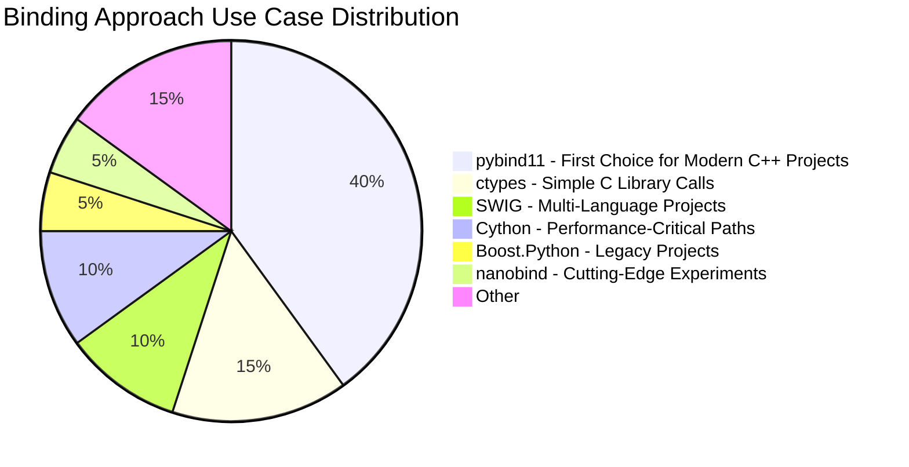
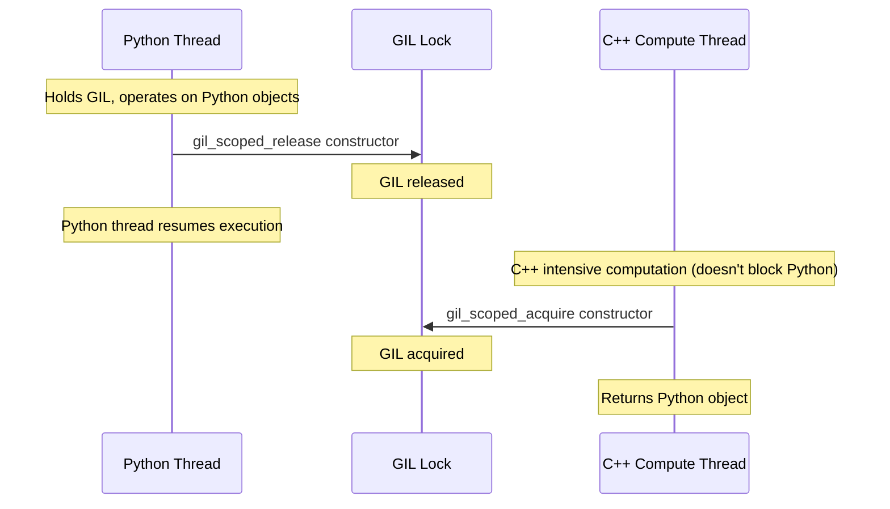

# Chapter 9: Python Bindings (pybind11)

## Prerequisites

This chapter assumes familiarity with the following concepts. Review these shared documents before proceeding:

> 📎 **Reference**: [Build Environment Configuration](../prerequisites/01_构建环境配置_en.md) — CMake fundamentals and build setup
> 📎 **Reference**: [Python Environment](../prerequisites/03_Python环境_en.md) — Virtual environments and pip
> 📎 **Reference**: [Vector Distance Metrics](../prerequisites/05_向量距离度量_en.md) — Distance functions exposed via bindings

---

## Table of Contents
1. [Why Python Bindings Matter](#1-why-python-bindings-matter)
2. [pybind11 Basics](#2-pybind11-basics)
3. [Zero-Copy NumPy Interaction](#3-zero-copy-numpy-interaction)
4. [GIL Management](#4-gil-management)
5. [Type Conversions](#5-type-conversions)
6. [CMake + scikit-build-core Build](#6-cmake--scikit-build-core-build)
7. [LangChain Integration Example](#7-langchain-integration-example)
8. [Discussion Questions](#8-discussion-questions)
9. [Hands-On Exercises](#9-hands-on-exercises)

---

## 1. Why Python Bindings Matter

### 1.1 The Core Problem: Python Rules AI, but C++ Is the Engine

First, a fact you may already know: **Python is the lingua franca of the AI/ML world.** Not because it's fast—it isn't—but because its ecosystem is massive.

Python has the world's densest AI toolchain:
- **NumPy** — The multi-dimensional array computation library that underpins PyTorch and TensorFlow. NumPy's core is written in C and Fortran; Python is just a thin glue layer.
- **pandas** — The de facto standard for data cleaning and analysis.
- **LangChain** and **LlamaIndex** — The mainstream frameworks for building LLM (Large Language Model) applications. LangChain's core concept is the "Chain": stitching document loading, vectorization, retrieval, and generation into a pipeline.
- **OpenAI SDK** — Calling GPT-4 as easily as calling a local function.
- **Jupyter Notebook** — The interactive workbench for data scientists.

**A C++ vector database without Python support is abandoning this ecosystem.** You built the fastest engine in the world, but nobody can put it in their car.

**Python Bindings** are the bridge connecting these two worlds—exposing the high-performance core written in C++ (HNSW graph search, SIMD-accelerated vector computation, mmap zero-copy storage) as modules that Python can directly `import` and call.

```mermaid
flowchart TD
    subgraph Python["Python Layer (Workbench)"]
        A[LangChain Integration / FastAPI Routes]
        B[Parameter Validation / Logging / Jupyter Visualization]
    end

    subgraph Pybind11["pybind11 Layer (Transmission)"]
        C[Type Conversion: list ↔ vector&lt;float&gt;]
        D[GIL Management / Exception Translation]
        E[Buffer Protocol Zero-Copy Channel]
    end

    subgraph CPP["C++ Layer (Engine)"]
        F[HNSW Graph Index Search (SIMD Accelerated)]
        G[mmap Zero-Copy Storage]
        H[L2/Cosine Distance Computation]
    end

    A --> C
    B --> C
    C --> D
    D --> E
    E --> F
    E --> G
    E --> H

    style Python fill:#e1f5fe,stroke:#0288d1
    style Pybind11 fill:#fff3e0,stroke:#f57c00
    style CPP fill:#fce4ec,stroke:#c62828
```

Using an analogy: C++ is the engine—roaring with 0-100 km/h in 3 seconds, hauling 20 tons of cargo. But the cockpit has only two seats, no air conditioning, no navigation. Python is a luxury tour bus—with AC, Wi-Fi, touchscreen navigation, and 200 passengers helping you move cargo—but when you step on the gas, the engine wheezes like an old cow. **pybind11 is the transmission, letting each do what it does best.**

### 1.2 What Is pybind11?

**pybind11** is a **header-only** C++ library. "Header-only" means you only need to `#include` its headers—no extra `.cpp` to compile, no `.a` static library, no `.so` dynamic library. All code is expanded directly when your project compiles.

pybind11's core function: **making C++ classes, functions, and enums look and behave like native Python objects in Python.**

It's not magic—it's based on two C++11 features:

- **Variadic Templates**: A template mechanism introduced in C++11 that allows templates to accept any number of arguments—similar to Python's `*args`, but happening at compile time. pybind11 uses this to implement parameter naming syntax like `py::arg("a"), py::arg("b")`. The compiler generates specialized code for each different number and type of argument.

- **Type Traits**: A set of compile-time "type interrogation tools." For example, `std::is_same<T, float>::value` returns `true` or `false` at compile time. pybind11 uses them to automatically determine: is this C++ type an integer? Floating point? STL container? Then it selects the correct conversion logic.

Because everything happens at compile time, pybind11 can achieve:
- **Compile-time type checking** — If Python passes a `str` where a `float*` is expected, it's a compile-time error
- **Automatic STL ↔ Python conversion** — `std::vector<float>` automatically becomes a Python `list`, no manual conversion code needed
- **Near-zero overhead** — Generated code is as fast as hand-written Python C API

### 1.3 What Is the Python C API?

Under pybind11's comfortable surface, the real work is done by the **Python C API** — also called the **CPython API**.

**CPython** is the official implementation of Python—the Python you download from python.org, or the `python3` that ships with macOS/Linux, is CPython. It's written in C. Inside CPython there is an **Interpreter** that reads Python source code, compiles it to **Bytecode**, and then executes bytecode instruction by instruction. Bytecode is the intermediate representation of Python source—it's what's stored in `.pyc` files.

The Python C API is the internal interface that CPython exposes to C/C++ programmers. It defines a set of functions and types that let you manipulate Python objects with C code.

Core concepts:

- **PyObject\***: The base class pointer for **all objects** in CPython (int, str, list, custom classes, modules...). Any Python object in memory is a `PyObject` struct containing at least a reference count field `ob_refcnt` and a pointer to the type object `ob_type`. All CPython API functions start with `Py` (e.g., `Py_INCREF`, `PyErr_SetString`).

- **Reference Counting**: CPython's memory management mechanism—not garbage collection (GC), but counting references for each object. `Py_INCREF` increments by one, `Py_DECREF` decrements by one. When the count reaches zero, CPython immediately calls the object's destructor to free memory. Forgot to call `Py_INCREF`? The object may be freed prematurely, creating a dangling pointer. Forgot to call `Py_DECREF`? Memory leak. Called `Py_DECREF` one extra time? Double-free crash. Reference counting is the most error-prone part of the Python C API and one of the biggest reasons pybind11 exists.

- **C Extension**: A Python module written in C or C++. When you write `import numpy`, what loads is a C extension—a compiled `.so` (Linux/macOS) or `.pyd` (Windows) file. C extensions are much faster than pure Python because they directly manipulate CPython's internal `PyObject*` structures.

- **Module Init**: When Python executes `import foo`, CPython looks for a C function named `PyInit_foo`. This function is responsible for creating the module object and registering all functions and classes on it. pybind11's `PYBIND11_MODULE` macro generates this function for you.

pybind11's value: **It encapsulates all the dirty work of `PyObject*`, reference counting, and GIL operations.** You write one line `py::class_<Vec3>(m, "Vec3")`, and pybind11 generates hundreds of lines of CPython API calls behind the scenes.

### 1.4 pybind11 vs Other Approaches: Why Choose It?

| Approach | Mechanism | Pros | Cons |
|----------|-----------|------|------|
| **pybind11** | C++11 template metaprogramming, compile-time binding generation | Header-only, modern C++, NumPy native support, type-safe | Requires C++11+, slower compilation (many template instantiations) |
| **ctypes** | Python standard library, loads `.so`/`.dll` via `cdll.LoadLibrary` | No compilation needed, pure Python | No type safety (no one reminds you if you forget `c_float`), manual memory management, no STL conversion, can only call C, not bind C++ classes |
| **cffi** | Similar to ctypes but supports C declaration parsing (can auto-extract function signatures from `.h` files) | More modern than ctypes, supports C declaration parsing | Still requires manual management of everything, cannot bind C++ classes (no concept of classes, virtual functions, templates) |
| **SWIG** | Generates multi-language bindings (C++/Python/Java/Ruby/...) via interface files (`.i` files) | Supports 20+ languages, suitable for multi-language projects | Complex configuration, verbose generated code hard to read, difficult debugging, limited modern C++ support |
| **Boost.Python** | Part of Boost library, predecessor to pybind11 | Mature and stable (20+ years of history) | **Heavyweight** — depends on entire Boost library (>100MB headers), extremely slow compilation, old-style C++ |
| **Cython** | A standalone language mixing Python + C (`.pyx` files) | Extremely flexible, can manually control performance-critical paths | Requires learning **another language**'s syntax, difficult debugging, not standard C++ |
| **nanobind** | Modern replacement for pybind11 (created in 2022 by pybind11 author Wenzel Jakob) | ~80% smaller compiled size, ~4x faster compile, ~10x lower runtime overhead; adopted by Google IREE, Apple MLX | Relatively new, community and documentation far behind pybind11, ecosystem compatibility unproven |

**In one sentence: pybind11 is the "sweet spot" for C++ bindings—safer than ctypes, lighter than Boost, simpler than Cython, more modern than SWIG.** For most C++/Python hybrid projects, it offers the best value.



---

## 2. pybind11 Basics

### 2.1 First Module: From C++ to Python

Let's start with "Hello World"—exposing a simple C++ addition function to Python.

```cpp
// bindings.cpp
#include <pybind11/pybind11.h>

namespace py = pybind11;

int add(int a, int b) {
    return a + b;
}

// PYBIND11_MODULE is a macro that expands to generate the CPython module init function
// (i.e., the PyInit_mymath function)
// First parameter "mymath" is the module name—the name used in Python import
// Second parameter m is the py::module_ object, representing the module itself
PYBIND11_MODULE(mymath, m) {
    m.doc() = "My math module in C++";  // Value of mymath.__doc__ in Python

    // def: bind a function
    //   Parameter 1: function name in Python
    //   Parameter 2: C++ function pointer
    //   Parameter 3: docstring
    //   Subsequent: py::arg names parameters (enables keyword arguments in Python)
    m.def("add", &add, "A function that adds two numbers",
          py::arg("a"), py::arg("b"));
}
```

After compilation, use directly in Python:

```python
import mymath
print(mymath.add(3, 5))       # 8
print(mymath.add(a=10, b=7))  # 17 — supports keyword arguments
print(mymath.__doc__)         # "My math module in C++"
```

### 2.2 Binding Classes: Making C++ Classes "Come Home" in Python

```cpp
class Vec3 {
public:
    float x, y, z;
    Vec3(float x_, float y_, float z_) : x(x_), y(y_), z(z_) {}

    float dot(const Vec3& other) const {
        return x * other.x + y * other.y + z * other.z;
    }
    float length() const {
        return std::sqrt(x*x + y*y + z*z);
    }
};

PYBIND11_MODULE(vecmath, m) {
    // py::class_<T> template: Parameter 1 = C++ type to bind, Parameter 2 = name shown in Python
    py::class_<Vec3>(m, "Vec3")
        // init binds the constructor, py::arg names each parameter
        .def(py::init<float, float, float>(),
             py::arg("x"), py::arg("y"), py::arg("z"))
        // def_readwrite: exposes public member variables as Python properties (read/write)
        .def_readwrite("x", &Vec3::x)
        .def_readwrite("y", &Vec3::y)
        .def_readwrite("z", &Vec3::z)
        // def: exposes member functions as Python methods
        .def("dot", &Vec3::dot)
        .def("length", &Vec3::length)
        // Override __repr__ so Python's print(v) outputs a friendly string
        .def("__repr__", [](const Vec3& v) {
            return "<Vec3 (" + std::to_string(v.x) + ", "
                   + std::to_string(v.y) + ", "
                   + std::to_string(v.z) + ")>";
        });
}
```

Python-side usage experience:

```python
v = Vec3(1, 2, 3)
print(v.x)           # 1.0 — like a native Python property
print(v.length())    # 3.741657...
print(v)             # <Vec3 (1.000000, 2.000000, 3.000000)>
```

### 2.3 Binding Enums: Bringing C++ Constants into Python's Namespace

```cpp
enum class SearchMode {
    EXACT = 0,        // Brute-force search
    APPROXIMATE = 1   // HNSW approximate search
};

PYBIND11_MODULE(mymod, m) {
    py::enum_<SearchMode>(m, "SearchMode")
        .value("EXACT", SearchMode::EXACT)
        .value("APPROXIMATE", SearchMode::APPROXIMATE)
        .export_values();  // Makes SearchMode.EXACT directly usable in Python
}
```

### 2.4 STL Container Automatic Conversion

```cpp
#include <pybind11/stl.h>  // Enable STL ↔ Python automatic conversion

// Once you #include <pybind11/stl.h>,
// std::vector ↔ list, std::map ↔ dict conversions are fully automatic
std::vector<float> scale_vector(const std::vector<float>& vec, float factor) {
    std::vector<float> result;
    result.reserve(vec.size());
    for (float v : vec) result.push_back(v * factor);
    return result;
}

m.def("scale_vector", &scale_vector);  // That's all it takes
```

**`py::object`** is the C++ type representing any Python object in pybind11—it's an RAII wrapper around `PyObject*`. When you need to operate on a Python object in C++ (e.g., passing arguments, returning values, calling Python methods), use `py::object`. pybind11 automatically manages reference counting (`Py_INCREF`/`Py_DECREF`), avoiding errors from manual operations.

### 2.5 Object Lifetime Management: return_value_policy

This is where things最容易出问题的地方——**谁负责释放内存？**

C++ and Python have completely different memory management models: C++ uses `delete`/destructors (RAII), Python uses reference counting/GC. When a pointer to a C++ object is passed to the Python side, pybind11 must know which "passport" to use:

```cpp
// 1. reference: Python only "borrows" this object, C++ side is responsible for freeing
//    Use case: returning references to member variables
//    Danger: if the parent object destructs first, the Python side gets a dangling pointer
.def("get_vector", &DB::get_vector,
     py::return_value_policy::reference)

// 2. take_ownership: Python takes ownership, GC is responsible for delete
//    Use case: new objects created by factory functions
.def("create_index", &DB::create_index,
     py::return_value_policy::take_ownership)

// 3. copy: makes a copy for Python (default behavior, safest but slowest)
.def("get_copy", &DB::get_copy)

// 4. reference_internal: the object held by the Python side references the parent object
//    Guarantees the parent object won't be GC'd while the child is alive
//    Use case: iterators, views
.def("get_child", &Parent::get_child,
     py::return_value_policy::reference_internal)
```

---

## 3. Zero-Copy NumPy Interaction

### 3.1 What Is the Buffer Protocol?

In Python, `bytes` objects, `bytearray`, `memoryview`, and most importantly the **NumPy `ndarray`** all implement an interface called the **Buffer Protocol**.

The **Buffer Protocol** can be thought of as a "memory sharing contract": any object implementing this protocol exposes a pointer and layout information (dimensions, strides, data type) of its underlying raw memory to the outside. Other libraries can directly read and write that memory after obtaining the pointer—**without copying any bytes.**

```
C++ vector<float>                     NumPy ndarray
     data ►──────── shared memory region ───────► .data
     size                               .shape[0]
```

pybind11 interacts with the Buffer Protocol through the **`py::array_t<T>`** type. `py::array_t<T>` is pybind11's C++ wrapper for NumPy's `ndarray`—`T` is the element type (e.g., `float`, `int32`). When you use `py::array_t<float>` as a function parameter, pybind11 checks at runtime whether the passed Python object implements the Buffer Protocol, and if so, directly obtains its memory pointer.

```cpp
#include <pybind11/numpy.h>

// Receive numpy arrays, zero-copy
float l2_distance(py::array_t<float> a, py::array_t<float> b) {
    // .request() returns py::buffer_info, containing:
    //   .ptr     — raw pointer to underlying memory (void*)
    //   .ndim    — number of array dimensions (1D = 1, 2D = 2, ...)
    //   .shape   — size of each dimension (e.g., {1024} means a 1D array of length 1024)
    //   .strides — byte stride of each dimension (e.g., {4} means each float is 4 bytes)
    //   .itemsize— bytes per element (float = 4, double = 8)
    py::buffer_info a_info = a.request();
    py::buffer_info b_info = b.request();

    if (a_info.ndim != 1 || b_info.ndim != 1)
        throw std::runtime_error("Expected 1D arrays");
    if (a_info.shape[0] != b_info.shape[0])
        throw std::runtime_error("Dimension mismatch");

    float* a_ptr = static_cast<float*>(a_info.ptr);
    float* b_ptr = static_cast<float*>(b_info.ptr);
    ssize_t dim = a_info.shape[0];

    float sum = 0.0f;
    for (ssize_t i = 0; i < dim; i++) {
        float diff = a_ptr[i] - b_ptr[i];
        sum += diff * diff;
    }
    return std::sqrt(sum);
}
```

### 3.2 Is It Really Zero-Copy?

**Yes, but with one prerequisite: the numpy array must be C-contiguous (memory laid out contiguously, matching C's array memory layout).**

NumPy supports multiple memory layouts:
- **C-contiguous** (row-major): the last dimension changes fastest—`arr[i][j]` has `j` as contiguous in memory
- **Fortran-contiguous** (column-major): the first dimension changes fastest
- **Non-contiguous**: sliced views (`arr[::2]`), transposes (`arr.T`), etc.

If the numpy array is C-contiguous and `dtype=float32`, `a_info.ptr` directly points to numpy's underlying memory—zero-copy. If non-contiguous or non-float32, pybind11 copies first, incurring overhead. You can check with `a.flags['C_CONTIGUOUS']`.

### 3.3 Performance Comparison: The Numbers Speak

> **Note:** The following numbers are for conceptual illustration only. Actual performance depends heavily on hardware, compiler, vector dimension, batch size, and implementation quality. Always run your own benchmarks on your target platform before drawing conclusions.

```
Operation: Vector addition, dimension=1024, 10000 calls

Pure Python (list comprehension):  450 ms   ← interpreter loop + boxing/unboxing
NumPy (vectorized, a + b):         8 ms   ← optimized C loops
pybind11 (STL vector copy):       25 ms   ← copy 4KB every call
pybind11 (numpy zero-copy):        4 ms   ← pure C++ speed, no copy
```

### 3.4 Advanced: Custom Buffer Provider

If you want a C++ class to be **directly** treated as a memory source by numpy (zero-copy), you need to implement a custom type_caster:

```cpp
struct VectorStorage {
    float* data;
    size_t dim;
    VectorStorage(size_t d) : dim(d) { data = new float[dim]; }
    ~VectorStorage() { delete[] data; }
};

namespace pybind11 { namespace detail {
template<> struct type_caster<VectorStorage> {
    static constexpr auto name = _("VectorStorage");

    static handle cast(VectorStorage src, return_value_policy, handle parent) {
        // capsule: a Python object carrying a destructor
        // When the numpy array is no longer referenced, the capsule's destructor deletes VectorStorage
        return array_t<float>(
            {src.dim},          // shape
            {sizeof(float)},    // strides
            src.data,           // raw pointer
            capsule(new VectorStorage(std::move(src)),
                    [](void* p) { delete (VectorStorage*)p; })
        ).release();
    }
};
}}
```

---

## 4. GIL Management

### 4.1 What Is the GIL?

**GIL (Global Interpreter Lock)** is a **mutex** inside CPython. Its rule is simple, but the consequences are profound:

> **At any given moment, only one thread can execute Python bytecode.**

The GIL exists for historical reasons. CPython's memory management is based on **Reference Counting**—every `PyObject` has an internal `ob_refcnt` integer field. When you write `x = []`, the empty list's reference count is 1. When `x` is reassigned or leaves scope, the reference count decrements by one. When it reaches zero, CPython calls the object's destructor to free memory.

**The problem: reference counting is not thread-safe.** `ob_refcnt++` and `ob_refcnt--` are not atomic operations. If two threads simultaneously `++count` and `--count`, you get a **Data Race**—two machine instructions interleaving, corrupting the reference count. The result could be:
- Reference count never reaches zero → memory leak
- Reference count reaches zero prematurely → object freed early → subsequent access triggers a segmentation fault

GIL is the simple solution CPython chose: **add a global lock, ensuring only one thread executes Python code at a time.** This way reference counts can't be modified concurrently.

The cost of GIL is harsh:

```python
import threading
def compute():
    for i in range(50_000_000): _ = i * i

# These two threads can never truly run in parallel
t1 = threading.Thread(target=compute)
t2 = threading.Thread(target=compute)
```

For **I/O-bound** programs (network requests, file I/O), GIL doesn't matter much—threads spend most of their time waiting for I/O, releasing the GIL. But for **CPU-bound** programs (vector search, matrix computation), GIL is a disaster—multithreading becomes "taking turns running."

> **Note:** Python 3.12 introduced Free-threaded CPython (PEP 703), experimentally removing the GIL. But in 2025, the GIL is still the default and the reality you must face when writing pybind11 code.

### 4.2 When to Release the GIL: Core Principle

**Rule: Release the GIL whenever you don't touch any Python objects.**

```cpp
// Wrong: holding GIL during intensive computation — all Python threads frozen for 200ms
py::array_t<float> search_bad(py::array_t<float> query, Database& db) {
    // Python thread blocked for 200ms
    return db.heavy_search(query);  // Takes 200ms
}

// Correct: three-step approach — unpack, release lock, re-pack
py::array_t<float> search_good(py::array_t<float> query, Database& db) {
    // Step 1: Hold GIL, read numpy data to C++ stack
    auto query_vec = numpy_to_vector(query);  // < 1ms

    // Step 2: Release GIL, let other Python threads run
    py::gil_scoped_release release;

    auto result_vec = db.heavy_search(query_vec);  // 200ms, blocks nobody

    // Step 3: Re-acquire GIL, return Python object
    py::gil_scoped_acquire acquire;

    return vector_to_numpy(result_vec);
}
```

### 4.3 How pybind11::gil_scoped_release Works

`gil_scoped_release` is an **RAII (Resource Acquisition Is Initialization)** object—the classic C++ pattern for managing resource lifetimes: acquire in constructor, release in destructor, guaranteeing exception safety.

- **Constructor** calls `PyEval_SaveThread()` — releases GIL, saves current thread state
- **Destructor** calls `PyEval_RestoreThread()` — re-acquires GIL, restores thread state

Why RAII? Because if `heavy_search` in the middle throws a C++ exception, stack unwinding will **automatically** call `gil_scoped_release`'s destructor, and the GIL is safely re-acquired—no "lock never recovered" deadlock.

### 4.4 GIL State Diagram



### 4.5 Real-World Example: Multithreaded Vector Search

```cpp
class ParallelSearcher {
public:
    std::vector<Result> batch_search(
        const std::vector<std::vector<float>>& queries, int top_k) {
        std::vector<Result> results(queries.size());
        std::vector<std::thread> threads;

        for (size_t i = 0; i < queries.size(); i++) {
            threads.emplace_back([&, i]() {
                // Each thread only operates on C++ objects—no GIL needed
                // If the outer layer (pybind11) has already released GIL, this is true multi-core parallelism
                results[i] = index_->search(queries[i], top_k);
            });
        }
        for (auto& t : threads) t.join();
        return results;
    }
};

// pybind11 layer: GIL management concentrated in one place
PYBIND11_MODULE(db, m) {
    py::class_<ParallelSearcher>(m, "ParallelSearcher")
        .def("batch_search", [](ParallelSearcher& self,
                                 py::array_t<float> queries) {
            // 1. Hold GIL: numpy → C++ (must operate on Python objects)
            auto qvecs = numpy_to_batch(queries);

            // 2. Release GIL: multithreaded C++ search (doesn't touch Python at all)
            py::gil_scoped_release release;
            auto results = self.batch_search(qvecs, 10);

            // 3. Re-acquire GIL: C++ → numpy
            py::gil_scoped_acquire acq;
            return batch_to_numpy(results);
        });
}
```

---

## 5. Type Conversions

### 5.1 STL ↔ Python Built-in Types

```cpp
#include <pybind11/stl.h>       // vector ↔ list, map ↔ dict, pair ↔ tuple
#include <pybind11/stl_bind.h>  // Two-way binding, O(1) access, avoids intermediate copies

// Automatic conversion table:
//   std::vector<int>    ↔  Python list
//   std::vector<float>  ↔  Python list
//   std::map<K,V>       ↔  Python dict
//   std::pair<A,B>      ↔  Python tuple
//   std::set<T>         ↔  Python set
//   std::optional<T>    ↔  T or None

// Two-way binding (better performance, C++ modifications visible in Python):
PYBIND11_MAKE_OPAQUE(std::vector<float>);
```

### 5.2 Exception Translation: C++ Exceptions → Python Exceptions

Without exception translation, a `std::runtime_error` thrown in C++ appears as a vague `RuntimeError` in Python. Exception translation gives you precise control:

```cpp
PYBIND11_MODULE(db, m) {
    // Register custom exception class
    static py::exception<DatabaseError> exc(m, "DatabaseError");

    // Register translator: catch all C++ exceptions, map to corresponding Python exceptions
    py::register_exception_translator([](std::exception_ptr p) {
        try {
            if (p) std::rethrow_exception(p);
        } catch (const std::invalid_argument& e) {
            PyErr_SetString(PyExc_ValueError, e.what());     // Invalid argument
        } catch (const std::runtime_error& e) {
            PyErr_SetString(PyExc_RuntimeError, e.what());   // Runtime error
        } catch (const std::bad_alloc& e) {
            PyErr_SetString(PyExc_MemoryError, e.what());    // Out of memory
        } catch (const DatabaseError& e) {
            exc(e.what());  // Custom exception
        }
    });
}
```

---

## 6. CMake + scikit-build-core Build

> 📎 **Reference**: For CMake fundamentals and build environment setup, see [Build Environment Configuration](../prerequisites/01_构建环境配置_en.md).

### 6.1 What Is scikit-build-core?

**scikit-build-core** is a modern **Python Build Backend** that calls CMake behind the scenes to build C++ code, then automatically packages it into a wheel. It replaces the old `setup.py` approach with standardized `pyproject.toml` configuration (PEP 517/518).

### 6.2 Complete Build Configuration

**CMakeLists.txt**:

```cmake
cmake_minimum_required(VERSION 3.16)
project(DeepVector-py VERSION 0.1.0 LANGUAGES CXX)

find_package(pybind11 REQUIRED)
find_package(Python COMPONENTS Interpreter Development NumPy REQUIRED)

pybind11_add_module(_lumen_core
    src/bindings.cpp
    src/hnsw_index.cpp
    src/vector_storage.cpp
)

target_include_directories(_lumen_core PRIVATE include)
target_compile_features(_lumen_core PRIVATE cxx_std_17)

if(CMAKE_SYSTEM_PROCESSOR MATCHES "x86_64")
    target_compile_options(_lumen_core PRIVATE -mavx2 -mfma)
endif()
```

**pyproject.toml** (scikit-build-core):

```toml
[build-system]
requires = ["scikit-build-core>=0.5", "pybind11>=2.11"]
build-backend = "scikit_build_core.build"

[project]
name = "lumen-db"
version = "0.1.0"
description = "DeepVector Python bindings"
requires-python = ">=3.8"

[tool.scikit-build]
cmake.minimum-version = "3.16"
```

Build process:

```bash
pip install build scikit-build-core pybind11
python -m build --wheel
pip install dist/lumen_db-0.1.0-cp310-cp310-linux_x86_64.whl
```

---

## 7. LangChain Integration Example

### 7.1 What Is LangChain?

**LangChain** is currently the most popular LLM (Large Language Model) application development framework. Its core philosophy is "composition"—stitching together various AI components like LEGO blocks.

LangChain's core abstractions:
- **Document Loaders**: Load documents from PDFs, web pages, databases
- **Text Splitters**: Split long documents into semantically related paragraphs
- **Embeddings**: Convert text to vectors (calling OpenAI/local models)
- **VectorStores**: Store and retrieve vectors—this is DeepVector's entry point
- **Chains**: Connect multiple components into a pipeline

### 7.2 VectorStore Interface Pattern

LangChain's `VectorStore` is an **Abstract Base Class (ABC)** that defines what a vector database should do. This pattern is called **Interface Isolation**—LangChain doesn't care whether your vector database is written in C++ or Python; as long as you implement this interface, it can seamlessly integrate into any LangChain **RAG (Retrieval-Augmented Generation)** pipeline.

```python
from abc import ABC, abstractmethod
from typing import List

class VectorStore(ABC):
    @abstractmethod
    def add_texts(self, texts: List[str], embeddings: List[List[float]]) -> List[str]:
        """Store document text and their vector representations, return document ID list"""

    @abstractmethod
    def similarity_search(self, query_embedding: List[float], k: int = 4) -> List[Document]:
        """Return the k documents most similar to the query vector"""
```

### 7.3 C++ Side Implementation

```cpp
class DeepVectorRetriever {
    HNSWIndex index_;
    std::unordered_map<int64_t, std::string> texts_;

public:
    void add_texts(const std::vector<std::string>& texts,
                   const std::vector<std::vector<float>>& embeddings) {
        for (size_t i = 0; i < texts.size(); i++) {
            int64_t id = index_.insert(embeddings[i].data(), embeddings[i].size());
            texts_[id] = texts[i];
        }
    }

    std::vector<std::pair<std::string, float>> similarity_search(
        const std::vector<float>& query_embedding, int k) {
        auto results = index_.search(query_embedding.data(),
                                      query_embedding.size(), k);
        std::vector<std::pair<std::string, float>> output;
        for (auto& r : results) {
            output.emplace_back(texts_[r.id], r.distance);
        }
        return output;
    }
};
```

### 7.4 Python Side LangChain Wrapper

```python
from langchain_core.retrievers import BaseRetriever
from langchain_core.documents import Document
from typing import List
import _lumen_retriever

class DeepVectorLangChainRetriever(BaseRetriever):
    db: _lumen_retriever.DeepVectorRetriever
    embedder: any  # External Embedding model (e.g., sentence-transformers)

    class Config:
        arbitrary_types_allowed = True

    def _get_relevant_documents(self, query: str) -> List[Document]:
        """LangChain framework calls this method to retrieve documents"""
        # 1. Use LangChain's embedder to convert natural language query to vector
        query_vec = self.embedder.embed_query(query)

        # 2. Use C++ index for vector search (zero-copy, blazing fast)
        results = self.db.similarity_search(query_vec, k=4)

        # 3. Assemble LangChain-standard Document objects
        return [
            Document(page_content=text, metadata={"score": score})
            for text, score in results
        ]
```

---

## 8. Discussion Questions

1. How does pybind11's `py::array_t<T>` achieve zero-copy? Draw a numpy ndarray memory layout diagram marking the physical positions of `ptr`, `shape`, and `strides`.
2. What happens if the C++ side frees memory referenced by numpy? How can `py::capsule` prevent this? Write out the complete lifecycle of a capsule.
3. Explain the implementation principles of `gil_scoped_release` and `gil_scoped_acquire` (hint: `PyGILState_Ensure`/`PyGILState_Release` internally maintain a GIL state counter).
4. Why can't you create `py::object` inside a `gil_scoped_release` region? What exactly happens at runtime (from the CPython source code perspective)?
5. What is the difference in memory models between `py::return_value_policy::reference_internal` and `take_ownership`? Give an example of each where misuse would cause a bug.
6. What advantages does scikit-build-core have over the old setup.py? When the target platform has no pre-built wheel (e.g., ARM SBC), what does the build process look like?
7. If a matrix is too large (>1GB), how does `py::array_t` zero-copy ensure safety when the Python side calls `resize`? How does the C++ side detect this situation?
8. Design an approach: how to expose C++ mmap memory directly as a numpy array, achieving true bidirectional zero-copy between C++ and Python? Consider mmap's `MAP_SHARED` flag.

---

## 9. Hands-On Exercises

### Exercise 1: Basic Bindings (20 min)
Create a C++ math library `libfastmath`, bind the following functions, and install into Python via `pip install -e .`:
- `float vector_dot(const std::vector<float>& a, const std::vector<float>& b)`
- `std::vector<float> vector_add(const std::vector<float>& a, const std::vector<float>& b)`
- `float vector_norm(const std::vector<float>& v)`

### Exercise 2: NumPy Zero-Copy (25 min)
Modify Exercise 1 to use `py::array_t<float>`, ensuring zero-copy. Use `numpy.ndarray.nbytes` to verify no extra copies occur. Write a script comparing the performance of `vector_add` across pure Python, NumPy, and pybind11 implementations.

### Exercise 3: GIL Experiment (20 min)
In a bound function, simulate a 500ms computation (`std::this_thread::sleep_for`). Compare total execution time of 5 Python `threading.Thread` instances with and without GIL release. Explain the difference.

### Exercise 4: Build a .whl (20 min)
Write `CMakeLists.txt` and `pyproject.toml` for `libfastmath`, use scikit-build-core to build a `.whl`. Install in a clean venv and verify.

### Exercise 5: LangChain Integration (Optional, 30 min)
Write pybind11 bindings for the HNSW index, wrap it as a `BaseRetriever` subclass. Combine with `sentence-transformers` for embedding to implement a simple RAG system—input a natural language question, retrieve relevant paragraphs from a local document store.

---

## Chapter Summary

| Key Point | Description |
|-----------|-------------|
| **pybind11 Positioning** | C++ engine + Python workbench — the bridge connecting two ecosystems |
| **Core API** | `PYBIND11_MODULE`, `class_`, `def`, `enum_`, `py::array_t<T>` |
| **Zero-Copy** | Buffer Protocol + `py::array_t<T>` directly access numpy memory, performance approaches native C++ |
| **GIL Management** | Three-step approach: unpack → `gil_scoped_release` → compute → `gil_scoped_acquire` → re-pack |
| **Lifetime Management** | `return_value_policy` controls ownership transfer across the C++↔Python boundary |
| **Build System** | scikit-build-core + CMake + pyproject.toml → one-click .whl generation |
| **Ecosystem Integration** | Implement LangChain VectorStore interface → integrate into any RAG pipeline |

> Next chapter: [Chapter 10: HTTP Server Design](../ch10_http_server/README.md)
