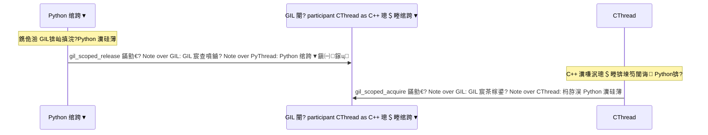

# 绗?9 绔狅細Python 缁戝畾 (pybind11)

## 鍓嶇疆鐭ヨ瘑

> 馃搸 **鍙傝€?*: [鏋勫缓鐜閰嶇疆](../prerequisites/01_鏋勫缓鐜閰嶇疆.md) 鈥?CMake 鏋勫缓绯荤粺鍩虹
> 馃搸 **鍙傝€?*: [Python鐜](../prerequisites/03_Python鐜.md) 鈥?Python 寮€鍙戠幆澧冮厤缃?
---

## 鐩綍
1. [涓轰粈涔?Python 缁戝畾寰堥噸瑕乚(#1-涓轰粈涔?python-缁戝畾寰堥噸瑕?
2. [pybind11 鍩虹](#2-pybind11-鍩虹)
3. [闆舵嫹璐?NumPy 浜や簰](#3-闆舵嫹璐?numpy-浜や簰)
4. [GIL 绠＄悊](#4-gil-绠＄悊)
5. [绫诲瀷杞崲](#5-绫诲瀷杞崲)
6. [CMake + scikit-build-core 鏋勫缓](#6-cmake--scikit-build-core-鏋勫缓)
7. [LangChain 闆嗘垚绀轰緥](#7-langchain-闆嗘垚绀轰緥)
8. [鎬濊€冮](#8-鎬濊€冮)
9. [鍔ㄦ墜缁冧範](#9-鍔ㄦ墜缁冧範)

---

## 1. 涓轰粈涔?Python 缁戝畾寰堥噸瑕?
### 1.1 鏍稿績闂锛歅ython 缁熸不 AI锛屼絾 C++ 鎵嶆槸寮曟搸

鍏堣涓€涓綘鍙兘宸茬粡鐭ラ亾鐨勪簨瀹烇細**Python 鏄?AI/ML 涓栫晫鐨勯€氱敤璇█銆?* 涓嶆槸鍥犱负瀹冨揩鈥斺€斿畠涓€鐐逛篃涓嶅揩鈥斺€旇€屾槸鍥犱负瀹冪殑鐢熸€佺郴缁熷お搴炲ぇ浜嗐€?
Python 鎷ユ湁鍏ㄧ悆鏈€瀵嗛泦鐨?AI 宸ュ叿閾撅細
- **NumPy** 鈥斺€?澶氱淮鏁扮粍杩愮畻搴擄紝PyTorch銆乀ensorFlow 鐨勫簳灞傚熀鐭炽€侼umPy 鐨勬牳蹇冪敤 C 鍜?Fortran 鍐欐垚锛孭ython 鍙槸涓€灞傝杽钖勭殑鑳舵按銆?- **pandas** 鈥斺€?鏁版嵁娓呮礂鍜屽垎鏋愮殑浜嬪疄鏍囧噯銆?- **LangChain** 鍜?**LlamaIndex** 鈥斺€?鏋勫缓 LLM锛堝ぇ璇█妯″瀷锛夊簲鐢ㄧ殑涓绘祦妗嗘灦銆侺angChain 鐨勬牳蹇冩蹇垫槸"閾?锛圕hain锛夛細鎶婃枃妗ｅ姞杞姐€佸悜閲忓寲銆佹绱€佺敓鎴愪覆鑱旀垚娴佹按绾裤€?- **OpenAI SDK** 鈥斺€?璋冪敤 GPT-4 鍍忚皟鐢ㄦ湰鍦板嚱鏁颁竴鏍风畝鍗曘€?- **Jupyter Notebook** 鈥斺€?鏁版嵁绉戝瀹剁殑浜や簰寮忓疄楠屽彴銆?
**C++ 鍚戦噺鏁版嵁搴撳鏋滀笉鏀寔 Python锛屽氨绛変簬鏀惧純杩欎釜鐢熸€併€?* 浣犻€犱簡涓€鍙板叏涓栫晫鏈€蹇殑寮曟搸锛屼絾娌′汉鑳芥妸瀹冭杩涜嚜宸辩殑杞︺€?
**Python 缁戝畾锛圥ython Bindings锛?* 灏辨槸杩炴帴杩欎袱涓笘鐣岀殑妗ユ鈥斺€旇 C++ 鍐欑殑楂樻€ц兘鏍稿績锛圚NSW 鍥炬悳绱€丼IMD 鍔犻€熺殑鍚戦噺璁＄畻銆乵map 闆舵嫹璐濆瓨鍌級鏆撮湶涓?Python 鍙互鐩存帴 `import` 鍜岃皟鐢ㄧ殑妯″潡銆?
```mermaid
flowchart TD
    subgraph Python["Python 灞傦紙鎿嶄綔鍙帮級"]
        A[LangChain 闆嗘垚 / FastAPI 璺敱]
        B[鍙傛暟鏍￠獙 / 鏃ュ織 / Jupyter 鍙鍖朷
    end

    subgraph Pybind11["pybind11 灞傦紙鍙橀€熺锛?]
        C[绫诲瀷杞崲: list 鈫?vector&lt;float&gt;]
        D[GIL 绠＄悊 / 寮傚父缈昏瘧]
        E[Buffer Protocol 闆舵嫹璐濋€氶亾]
    end

    subgraph CPP["C++ 灞傦紙寮曟搸锛?]
        F[HNSW 鍥剧储寮曟悳绱?(SIMD 鍔犻€?]
        G[mmap 闆舵嫹璐濆瓨鍌╙
        H[L2/Cosine 璺濈璁＄畻]
    end

    A --> C
    B --> C
    C --> D
    D --> E
    E --> F
    E --> G
    E --> H

    style Python fill:#e1f5fe,stroke:#0288d1
    style Pybind11 fill:#fff3e0,stroke:#f57c00
    style CPP fill:#fce4ec,stroke:#c62828
```

鐢ㄤ竴涓瘮鍠伙細C++ 鏄彂鍔ㄦ満锛岃桨楦ｇ潃璺戠櫨鍏噷鍔犻€?3 绉掞紝鑳芥媺 20 鍚ㄨ揣鐗┿€備絾椹鹃┒鑸卞彧鏈変袱涓骇浣嶏紝娌℃湁绌鸿皟锛屾病鏈夊鑸€侾ython 鏄豹鍗庢梾琛屽ぇ宸粹€斺€旀湁绌鸿皟銆乄i-Fi銆佽Е灞忓鑸€?00 涓箻瀹㈠府浣犳惉璐э紝浣嗚俯涓嬫补闂ㄥ彂鍔ㄦ満鍍忚€佺墰鍠樻皵銆?*pybind11 灏辨槸鍙橀€熺锛岃涓よ€呭悇鍙稿叾鑱屻€?*

### 1.2 浠€涔堟槸 pybind11锛?
**pybind11** 鏄竴涓?**header-only**锛堢函澶存枃浠讹級C++ 搴撱€?Header-only" 鎰忓懗鐫€浣犲彧闇€瑕?`#include` 瀹冪殑澶存枃浠讹紝涓嶉渶瑕佺紪璇戜换浣曢澶栫殑 `.cpp`鈥斺€旀病鏈?`.a` 闈欐€佸簱锛屾病鏈?`.so` 鍔ㄦ€佸簱锛屾墍鏈変唬鐮佸湪浣犵殑椤圭洰缂栬瘧鏃剁洿鎺ュ睍寮€銆?
pybind11 鐨勬牳蹇冨姛鑳斤細**璁?C++ 鐨勭被銆佸嚱鏁般€佹灇涓惧湪 Python 涓湅璧锋潵鍜岀敤璧锋潵閮藉儚鍘熺敓 Python 瀵硅薄銆?*

瀹冧笉鏄瓟娉曪紝鑰屾槸鍩轰簬涓や釜 C++11 鐗规€э細

- **Variadic Templates锛堝彲鍙樺弬鏁版ā鏉匡級**锛欳++11 寮曞叆鐨勬ā鏉挎満鍒讹紝鍏佽妯℃澘鎺ュ彈浠绘剰鏁伴噺鐨勫弬鏁扳€斺€旂被浼?Python 鐨?`*args`锛屼絾鍙戠敓鍦ㄧ紪璇戞湡銆俻ybind11 鐢ㄥ畠瀹炵幇 `py::arg("a"), py::arg("b")` 杩欐牱鐨勫弬鏁板懡鍚嶈娉曘€傜紪璇戝櫒浼氫负姣忎釜涓嶅悓鐨勫弬鏁版暟閲忓拰绫诲瀷鐢熸垚涓€浠戒笓闂ㄧ殑浠ｇ爜銆?
- **Type Traits锛堢被鍨嬭悆鍙?绫诲瀷鐗瑰緛锛?*锛氫竴缁勭紪璇戞湡鐨?绫诲瀷闂宸ュ叿"銆傛瘮濡?`std::is_same<T, float>::value` 浼氬湪缂栬瘧鏈熻繑鍥?`true` 鎴?`false`銆俻ybind11 鐢ㄥ畠浠嚜鍔ㄥ垽鏂細杩欎釜 C++ 绫诲瀷鏄暣鏁帮紵娴偣锛烻TL 瀹瑰櫒锛熺劧鍚庨€夋嫨姝ｇ‘鐨勮浆鎹㈤€昏緫銆?
鍥犱负涓€鍒囧彂鐢熷湪缂栬瘧鏈燂紝pybind11 鑳藉仛鍒帮細
- **缂栬瘧鏈熺被鍨嬫鏌?* 鈥斺€?濡傛灉 Python 浼犱簡涓?`str` 缁欐湡鏈?`float*` 鐨勫弬鏁帮紝缂栬瘧鏈熷氨鎶ラ敊
- **鑷姩 STL 鈫?Python 杞崲** 鈥斺€?`std::vector<float>` 鑷姩鍙樻垚 Python `list`锛屼笉闇€瑕佹墜鍐欒浆鎹唬鐮?- **杩戜箮闆跺紑閿€** 鈥斺€?鐢熸垚鐨勪唬鐮佸拰鎵嬪啓 Python C API 涓€鏍峰揩

### 1.3 浠€涔堟槸 Python C API锛?
鍦?pybind11 鐨勮垝閫傝〃闈笅锛岀湡姝ｅ共娲荤殑鏄?**Python C API** 鈥斺€?涔熷彨 **CPython API**銆?
**CPython** 鏄?Python 鐨勫畼鏂瑰疄鐜扳€斺€斾綘浠?python.org 涓嬭浇鐨?Python锛屾垨鑰?macOS/Linux 鑷甫鐨?`python3`锛岄兘鏄?CPython銆傚畠鐢?C 璇█鍐欐垚銆侰Python 鍐呴儴鏈変竴涓?**瑙ｉ噴鍣紙Interpreter锛?*锛岃礋璐ｈ鍙?Python 婧愪唬鐮併€佸皢鍏剁紪璇戜负 **瀛楄妭鐮侊紙Bytecode锛?*銆佺劧鍚庨€愭潯鎵ц瀛楄妭鐮併€傚瓧鑺傜爜鏄?Python 婧愮爜鐨勪腑闂磋〃绀衡€斺€擿.pyc` 鏂囦欢閲屽瓨鐨勫氨鏄畠銆?
Python C API 灏辨槸 CPython 鏆撮湶缁?C/C++ 绋嬪簭鍛樼殑鍐呴儴鎺ュ彛銆傚畠瀹氫箟浜嗕竴绯诲垪鍑芥暟鍜岀被鍨嬶紝璁╀綘鑳界敤 C 浠ｇ爜鎿嶄綔 Python 瀵硅薄銆?
鏍稿績姒傚康锛?
- **PyObject\***锛欳Python 涓?*鎵€鏈夊璞?*锛坕nt銆乻tr銆乴ist銆佽嚜瀹氫箟绫汇€佹ā鍧椻€︹€︼級鐨勫熀绫绘寚閽堛€備换浣?Python 瀵硅薄鍦ㄥ唴瀛樹腑閮芥槸涓€涓?`PyObject` 缁撴瀯浣擄紝閲岄潰鑷冲皯鍖呭惈涓€涓紩鐢ㄨ鏁板瓧娈?`ob_refcnt` 鍜屼竴涓寚鍚戠被鍨嬪璞＄殑鎸囬拡 `ob_type`銆傛墍鏈?CPython API 鍑芥暟閮戒互 `Py` 寮€澶达紙濡?`Py_INCREF`銆乣PyErr_SetString`锛夈€?
- **寮曠敤璁℃暟锛圧eference Counting锛?*锛欳Python 鐢ㄦ潵绠＄悊鍐呭瓨鐨勬満鍒垛€斺€斾笉鏄瀮鍦惧洖鏀讹紙GC锛夛紝鑰屾槸缁欐瘡涓璞¤鏁般€俙Py_INCREF` 鍔犱竴锛宍Py_DECREF` 鍑忎竴銆傝鏁板綊闆舵椂锛孋Python 绔嬪嵆璋冪敤璇ュ璞＄殑鏋愭瀯鍑芥暟閲婃斁鍐呭瓨銆傚繕浜嗚皟 `Py_INCREF`锛熷璞″彲鑳借鎻愬墠閲婃斁锛屼骇鐢熸偓鍨傛寚閽堬紙dangling pointer锛夈€傚繕浜嗚皟 `Py_DECREF`锛熷唴瀛樻硠婕忋€傚璋冧竴娆?`Py_DECREF`锛焏ouble-free 宕╂簝銆傚紩鐢ㄨ鏁版槸 Python C API 鏈€瀹规槗鍑洪敊鐨勫湴鏂癸紝涔熸槸 pybind11 瀛樺湪鐨勬渶澶х悊鐢变箣涓€銆?
- **C Extension锛圕 鎵╁睍锛?*锛氱敤 C 鎴?C++ 缂栧啓鐨?Python 妯″潡銆傚綋浣犲啓 `import numpy` 鏃讹紝鍔犺浇鐨勫氨鏄竴涓?C 鎵╁睍鈥斺€斾竴涓紪璇戝ソ鐨?`.so`锛圠inux/macOS锛夋垨 `.pyd`锛圵indows锛夋枃浠躲€侰 鎵╁睍姣旂函 Python 蹇緱澶氾紝鍥犱负瀹冧滑鐩存帴鎿嶄綔 CPython 鍐呴儴鐨?`PyObject*` 缁撴瀯銆?
- **Module Init锛堟ā鍧楀垵濮嬪寲锛?*锛氬綋 Python 鎵ц `import foo` 鏃讹紝CPython 浼氬鎵句竴涓悕涓?`PyInit_foo` 鐨?C 鍑芥暟銆傝繖涓嚱鏁拌礋璐ｅ垱寤烘ā鍧楀璞°€佹敞鍐屾墍鏈夊嚱鏁板拰绫诲埌妯″潡涓娿€俻ybind11 鐨?`PYBIND11_MODULE` 瀹忓氨鏄湪甯綘鐢熸垚杩欎釜鍑芥暟銆?
pybind11 鐨勪环鍊硷細**瀹冩妸鎵€鏈?`PyObject*`銆佸紩鐢ㄨ鏁般€丟IL 鎿嶄綔鐨勮剰娲婚兘灏佽璧锋潵浜嗐€?* 浣犲啓涓€琛?`py::class_<Vec3>(m, "Vec3")`锛宲ybind11 鍦ㄨ儗鍚庣敓鎴愭暟鐧捐 CPython API 璋冪敤銆?
### 1.4 pybind11 vs 鍏朵粬鏂规锛氫负浠€涔堥€夊畠锛?
| 鏂规 | 鍘熺悊 | 浼樼偣 | 缂虹偣 |
|------|------|------|------|
| **pybind11** | C++11 妯℃澘鍏冪紪绋嬶紝缂栬瘧鏈熺敓鎴愮粦瀹氫唬鐮?| header-only锛岀幇浠?C++锛孨umPy 鍘熺敓鏀寔锛岀被鍨嬪畨鍏?| 闇€瑕?C++11+锛岀紪璇戣緝鎱紙妯℃澘瀹炰緥鍖栧锛?|
| **ctypes** | Python 鏍囧噯搴擄紝閫氳繃 `cdll.LoadLibrary` 鍔犺浇 `.so`/`.dll` | 鏃犻渶浠讳綍缂栬瘧锛岀函 Python | 鏃犵被鍨嬪畨鍏紙`c_float` 蹇樺啓浜嗘病浜烘彁閱掞級锛屾墜鍔ㄧ鐞嗗唴瀛橈紝娌℃湁 STL 杞崲锛屽彧鑳借皟 C 涓嶈兘缁?C++ 绫?|
| **cffi** | 绫讳技 ctypes锛屼絾鏀寔 C 澹版槑瑙ｆ瀽锛堝彲浠ヤ粠 `.h` 澶存枃浠惰嚜鍔ㄦ彁鍙栧嚱鏁扮鍚嶏級 | 姣?ctypes 鏇寸幇浠ｏ紝鏀寔 C 澹版槑瑙ｆ瀽 | 浠嶇劧闇€瑕佹墜鍔ㄧ鐞嗕竴鍒囷紝鏃犳硶缁戝畾 C++ 绫伙紙娌℃湁绫汇€佽櫄鍑芥暟銆佹ā鏉跨殑姒傚康锛?|
| **SWIG** | 閫氳繃鎺ュ彛鏂囦欢锛坄.i` 鏂囦欢锛夌敓鎴愬璇█缁戝畾锛圕++/Python/Java/Ruby/...锛?| 鏀寔 20+ 璇█锛岄€傚悎澶氳瑷€椤圭洰 | 閰嶇疆澶嶆潅锛岀敓鎴愮殑浠ｇ爜搴炲ぇ闅捐锛岃皟璇曞洶闅撅紝瀵圭幇浠?C++ 鏀寔鏈夐檺 |
| **Boost.Python** | Boost 搴撶殑涓€閮ㄥ垎锛宲ybind11 鐨勫墠韬?| 鎴愮啛绋冲畾锛?0+ 骞村巻鍙诧級 | **閲嶉噺绾?* 鈥斺€?渚濊禆鏁翠釜 Boost 搴擄紙>100MB 澶存枃浠讹級锛岀紪璇戞瀬鎱紝鑰佸紡 C++ 椋庢牸 |
| **Cython** | 娣峰悎 Python + C 鐨勭嫭绔嬭瑷€锛坄.pyx` 鏂囦欢锛?| 鏋佺伒娲伙紝鍙墜鍔ㄦ帶鍒舵€ц兘鍏抽敭璺緞 | 闇€瑕佸涔?*鍙︿竴闂ㄨ瑷€**鐨勮娉曪紝璋冭瘯鍥伴毦锛屼笉鏄爣鍑?C++ |
| **nanobind** | pybind11 鐨勭幇浠ｆ浛浠ｅ搧锛?022 骞寸敱 pybind11 浣滆€?Wenzel Jakob 鍒涘缓锛?| 姣?pybind11 蹇緱澶氾紙缂栬瘧鍚庝綋绉噺灏戠害 80%锛岀紪璇戦€熷害绾?4 鍊嶏紝杩愯鏃跺紑閿€绾?10 鍊嶏級銆傚凡琚?Google IREE銆丄pple MLX 绛夐」鐩噰鐢ㄣ€?| 杈冩柊锛岀ぞ鍖哄拰鏂囨。杩滀笉濡?pybind11锛岀敓鎬佸吋瀹规€у緟楠岃瘉 |

**涓€鍙ヨ瘽鎬荤粨锛歱ybind11 鏄?C++ 缁戝畾鐨?鐢滅偣"鈥斺€旀瘮 ctypes 瀹夊叏锛屾瘮 Boost 杞婚噺锛屾瘮 Cython 绠€鍗曪紝姣?SWIG 鐜颁唬銆?* 瀵逛簬澶у鏁?C++/Python 娣峰悎椤圭洰锛屽畠鏄€т环姣旀渶楂樼殑閫夋嫨銆?


---

## 2. pybind11 鍩虹

### 2.1 绗竴涓ā鍧楋細浠?C++ 鍒?Python

璁╂垜浠粠"Hello World"寮€濮嬧€斺€旀妸涓€涓畝鍗曠殑 C++ 鍔犳硶鍑芥暟鏆撮湶缁?Python銆?
```cpp
// bindings.cpp
#include <pybind11/pybind11.h>

namespace py = pybind11;

int add(int a, int b) {
    return a + b;
}

// PYBIND11_MODULE 鏄竴涓畯锛屽睍寮€鍚庝細鐢熸垚 CPython 闇€瑕佺殑妯″潡鍒濆鍖栧嚱鏁?// 锛堝嵆 PyInit_mymath 鍑芥暟锛?// 绗竴涓弬鏁?"mymath" 鏄ā鍧楀悕鈥斺€擯ython 涓?import 鐨勫悕瀛?// 绗簩涓弬鏁?m 鏄?py::module_ 瀵硅薄锛屼唬琛ㄨ繖涓ā鍧楁湰韬?PYBIND11_MODULE(mymath, m) {
    m.doc() = "My math module in C++";  // Python 涓?mymath.__doc__ 鐨勫€?
    // def: 缁戝畾鍑芥暟
    //   鍙傛暟1: Python 涓殑鍑芥暟鍚?    //   鍙傛暟2: C++ 鍑芥暟鎸囬拡
    //   鍙傛暟3: 鏂囨。瀛楃涓?    //   鍚庣画: py::arg 涓哄弬鏁板懡鍚嶏紙Python 涓彲鐢ㄥ叧閿瓧鍙傛暟锛?    m.def("add", &add, "A function that adds two numbers",
          py::arg("a"), py::arg("b"));
}
```

缂栬瘧鍚庡湪 Python 涓洿鎺ヤ娇鐢細

```python
import mymath
print(mymath.add(3, 5))       # 8
print(mymath.add(a=10, b=7))  # 17 鈥?鏀寔鍏抽敭瀛楀弬鏁?print(mymath.__doc__)         # "My math module in C++"
```

### 2.2 缁戝畾绫伙細璁?C++ 绫诲湪 Python 涓?鍥炲"

```cpp
class Vec3 {
public:
    float x, y, z;
    Vec3(float x_, float y_, float z_) : x(x_), y(y_), z(z_) {}

    float dot(const Vec3& other) const {
        return x * other.x + y * other.y + z * other.z;
    }
    float length() const {
        return std::sqrt(x*x + y*y + z*z);
    }
};

PYBIND11_MODULE(vecmath, m) {
    // py::class_<T> 妯℃澘锛氬弬鏁? = 瑕佺粦瀹氱殑 C++ 绫诲瀷锛屽弬鏁? = 鍦?Python 涓樉绀虹殑鍚嶅瓧
    py::class_<Vec3>(m, "Vec3")
        // init 缁戝畾鏋勯€犲嚱鏁帮紝py::arg 缁欐瘡涓弬鏁板懡鍚?        .def(py::init<float, float, float>(),
             py::arg("x"), py::arg("y"), py::arg("z"))
        // def_readwrite: 鏆撮湶鍏湁鎴愬憳鍙橀噺涓?Python 灞炴€э紙鍙鍙啓锛?        .def_readwrite("x", &Vec3::x)
        .def_readwrite("y", &Vec3::y)
        .def_readwrite("z", &Vec3::z)
        // def: 鏆撮湶鎴愬憳鍑芥暟涓?Python 鏂规硶
        .def("dot", &Vec3::dot)
        .def("length", &Vec3::length)
        // 閲嶅啓 __repr__锛岃 Python 鐨?print(v) 杈撳嚭鍙嬪ソ鐨勫瓧绗︿覆
        .def("__repr__", [](const Vec3& v) {
            return "<Vec3 (" + std::to_string(v.x) + ", "
                   + std::to_string(v.y) + ", "
                   + std::to_string(v.z) + ")>";
        });
}
```

Python 绔娇鐢ㄤ綋楠岋細

```python
v = Vec3(1, 2, 3)
print(v.x)           # 1.0 鈥?鍍忓師鐢熺殑 Python 灞炴€?print(v.length())    # 3.741657...
print(v)             # <Vec3 (1.000000, 2.000000, 3.000000)>
```

### 2.3 缁戝畾鏋氫妇锛氳 C++ 甯搁噺杩涘叆 Python 鍛藉悕绌洪棿

```cpp
enum class SearchMode {
    EXACT = 0,        // 鏆村姏鎼滅储
    APPROXIMATE = 1   // HNSW 杩戜技鎼滅储
};

PYBIND11_MODULE(mymod, m) {
    py::enum_<SearchMode>(m, "SearchMode")
        .value("EXACT", SearchMode::EXACT)
        .value("APPROXIMATE", SearchMode::APPROXIMATE)
        .export_values();  // 浣?Python 涓彲鐩存帴浣跨敤 SearchMode.EXACT
}
```

### 2.4 STL 瀹瑰櫒鑷姩杞崲

```cpp
#include <pybind11/stl.h>  // 寮曞叆 STL 鈫?Python 鑷姩杞崲

// 鍙 #include 浜?<pybind11/stl.h>锛?// std::vector 鈫?list, std::map 鈫?dict 鐨勮浆鎹㈠畬鍏ㄨ嚜鍔?std::vector<float> scale_vector(const std::vector<float>& vec, float factor) {
    std::vector<float> result;
    result.reserve(vec.size());
    for (float v : vec) result.push_back(v * factor);
    return result;
}

m.def("scale_vector", &scale_vector);  // 灏辫繖涔堢畝鍗?```

**`py::object`** 鏄?pybind11 涓〃绀轰换鎰?Python 瀵硅薄鐨?C++ 绫诲瀷鈥斺€斿畠鏄?`PyObject*` 鐨?RAII 灏佽銆傚綋浣犲湪 C++ 涓渶瑕佹搷浣滀竴涓?Python 瀵硅薄锛堟瘮濡備紶閫掑弬鏁般€佽繑鍥炲€笺€佽皟鐢?Python 鏂规硶锛夋椂锛屽氨鐢?`py::object`銆俻ybind11 浼氳嚜鍔ㄧ鐞嗗紩鐢ㄨ鏁帮紙`Py_INCREF`/`Py_DECREF`锛夛紝閬垮厤鎵嬪姩鎿嶄綔鐨勯敊璇€?
### 2.5 瀵硅薄鐢熷懡鍛ㄦ湡绠＄悊锛歳eturn_value_policy

杩欐槸 C++/Python 杈圭晫涓婃渶瀹规槗鍑洪棶棰樼殑鍦版柟鈥斺€?*璋佽礋璐ｉ噴鏀惧唴瀛橈紵**

C++ 鍜?Python 鐨勫唴瀛樼鐞嗘ā鍨嬫埅鐒朵笉鍚岋細C++ 鐢?`delete`/鏋愭瀯鍑芥暟锛圧AII锛夛紝Python 鐢ㄥ紩鐢ㄨ鏁?GC銆傚綋涓€涓?C++ 瀵硅薄鐨勬寚閽堜紶鍒?Python 渚ф椂锛宲ybind11 蹇呴』鐭ラ亾閲囩敤鍝"鎶ょ収"锛?
```cpp
// 1. reference: Python 鍙?鍊熺敤"杩欎釜瀵硅薄锛孋++ 绔礋璐ｉ噴鏀?//    閫傜敤鍦烘櫙锛氳繑鍥炴垚鍛樺彉閲忕殑寮曠敤
//    鍗遍櫓锛氬鏋滄瘝瀵硅薄鍏堟瀽鏋勶紝Python 绔幏寰楃殑鏄偓鍨傛寚閽?.def("get_vector", &DB::get_vector,
     py::return_value_policy::reference)

// 2. take_ownership: Python 鑾峰緱鎵€鏈夋潈锛孏C 璐熻矗 delete
//    閫傜敤鍦烘櫙锛氬伐鍘傚嚱鏁板垱寤虹殑鏂板璞?.def("create_index", &DB::create_index,
     py::return_value_policy::take_ownership)

// 3. copy: 鎷疯礉涓€浠界粰 Python锛堥粯璁よ涓猴紝鏈€瀹夊叏浣嗘渶鎱級
.def("get_copy", &DB::get_copy)

// 4. reference_internal: Python 绔寔鏈夌殑瀵硅薄寮曠敤浜嗘瘝瀵硅薄
//    淇濊瘉姣嶅璞″湪瀛愬璞″瓨娲绘湡闂翠笉琚?GC 鍥炴敹
//    閫傜敤鍦烘櫙锛氳凯浠ｅ櫒銆佽鍥?.def("get_child", &Parent::get_child,
     py::return_value_policy::reference_internal)
```

---

## 3. 闆舵嫹璐?NumPy 浜や簰

### 3.1 浠€涔堟槸 Buffer Protocol锛?
鍦?Python 涓紝`bytes` 瀵硅薄銆乣bytearray`銆乣memoryview`銆佷互鍙婃渶閲嶈鐨?**NumPy `ndarray`** 閮藉疄鐜颁簡涓€涓彨鍋?**Buffer Protocol锛堢紦鍐插尯鍗忚锛?* 鐨勬帴鍙ｃ€?
**Buffer Protocol** 鍙互鐞嗚В涓轰竴涓?鍐呭瓨鍏变韩鍚堢害"锛氫换浣曞疄鐜颁簡杩欎釜鍗忚鐨勫璞★紝閮藉悜澶栭儴鏆撮湶鍏跺簳灞傚師濮嬪唴瀛樼殑鎸囬拡鍜屽竷灞€淇℃伅锛堢淮搴︺€佹闀裤€佹暟鎹被鍨嬶級銆傚叾浠栧簱鎷垮埌杩欎釜鎸囬拡鍚庯紝鍙互鐩存帴璇诲啓閭ｅ潡鍐呭瓨鈥斺€?*涓嶉渶瑕佹嫹璐濅换浣曞瓧鑺傘€?*

```
C++ vector<float>                     NumPy ndarray
     data 鈻衡攢鈹€鈹€鈹€鈹€鈹€鈹€鈹€ 鍏变韩鍐呭瓨鍖哄煙 鈹€鈹€鈹€鈹€鈹€鈹€鈹€鈻?.data
     size                               .shape[0]
```

pybind11 閫氳繃 **`py::array_t<T>`** 绫诲瀷涓?Buffer Protocol 浜や簰銆俙py::array_t<T>` 鏄?pybind11 瀵?NumPy `ndarray` 鐨?C++ 灏佽鈥斺€擿T` 鏄厓绱犵被鍨嬶紙濡?`float`銆乣int32`锛夈€傚綋浣犵敤 `py::array_t<float>` 浣滀负鍑芥暟鍙傛暟鏃讹紝pybind11 浼氬湪杩愯鏃舵鏌ヤ紶鍏ョ殑 Python 瀵硅薄鏄惁瀹炵幇浜?Buffer Protocol锛屽鏋滄槸锛屽氨鐩存帴鑾峰彇鍏跺唴瀛樻寚閽堛€?
```cpp
#include <pybind11/numpy.h>

// 鎺ユ敹 numpy 鏁扮粍锛岄浂鎷疯礉
float l2_distance(py::array_t<float> a, py::array_t<float> b) {
    // .request() 杩斿洖 py::buffer_info锛屽寘鍚細
    //   .ptr     鈥?鎸囧悜搴曞眰鍐呭瓨鐨勫師濮嬫寚閽?(void*)
    //   .ndim    鈥?鏁扮粍缁村害鏁帮紙1D = 1, 2D = 2, ...锛?    //   .shape   鈥?姣忎釜缁村害鐨勫ぇ灏忥紙濡?{1024} 琛ㄧず闀垮害 1024 鐨勪竴缁存暟缁勶級
    //   .strides 鈥?姣忎釜缁村害鐨勫瓧鑺傝法搴︼紙濡?{4} 琛ㄧず姣忎釜 float 鍗?4 瀛楄妭锛?    //   .itemsize鈥?鍗曚釜鍏冪礌鐨勫瓧鑺傛暟锛坒loat = 4, double = 8锛?    py::buffer_info a_info = a.request();
    py::buffer_info b_info = b.request();

    if (a_info.ndim != 1 || b_info.ndim != 1)
        throw std::runtime_error("Expected 1D arrays");
    if (a_info.shape[0] != b_info.shape[0])
        throw std::runtime_error("Dimension mismatch");

    float* a_ptr = static_cast<float*>(a_info.ptr);
    float* b_ptr = static_cast<float*>(b_info.ptr);
    ssize_t dim = a_info.shape[0];

    float sum = 0.0f;
    for (ssize_t i = 0; i < dim; i++) {
        float diff = a_ptr[i] - b_ptr[i];
        sum += diff * diff;
    }
    return std::sqrt(sum);
}
```

### 3.2 鐪熺殑闆舵嫹璐濆悧锛?
**鏄紝浣嗘湁涓€涓墠鎻愶細numpy 鏁扮粍蹇呴』鏄?C-contiguous 鐨勶紙鍐呭瓨杩炵画鎺掑垪锛屼笌 C 璇█鐨勬暟缁勫唴瀛樺竷灞€涓€鑷达級銆?*

NumPy 鏀寔澶氱鍐呭瓨甯冨眬锛?- **C-contiguous**锛堣浼樺厛锛夛細鏈€鍚庨潰鐨勭淮搴﹀彉鍖栨渶蹇€斺€擿arr[i][j]` 涓?`j` 鏄揣閭诲唴瀛樼殑
- **Fortran-contiguous**锛堝垪浼樺厛锛夛細鏈€鍓嶉潰鐨勭淮搴﹀彉鍖栨渶蹇?- **涓嶈繛缁殑**锛氬垏鐗囧悗鐨勮鍥撅紙`arr[::2]`锛夈€佽浆缃紙`arr.T`锛夌瓑

濡傛灉 numpy 鏁扮粍鏄?C-contiguous 涓?`dtype=float32`锛宍a_info.ptr` 鐩存帴鎸囧悜 numpy 鐨勫簳灞傚唴瀛樷€斺€旈浂鎷疯礉銆傚鏋滄槸涓嶈繛缁垨闈?float32锛宲ybind11 浼氬厛鎷疯礉涓€浠斤紝浜х敓寮€閿€銆傚彲浠ョ敤 `a.flags['C_CONTIGUOUS']` 妫€鏌ャ€?
### 3.3 鎬ц兘瀵规瘮锛氭暟瀛椾細璇磋瘽

```
鎿嶄綔: 鍚戦噺鍔犳硶, 缁村害=1024, 10000 娆¤皟鐢?
浠ヤ笅涓哄吀鍨嬮噺绾т及绠楋紝瀹為檯鎬ц兘鍙栧喅浜庣‖浠跺拰 Python 鐗堟湰锛?绾?Python (list comprehension):  450 ms   鈫?瑙ｉ噴鍣ㄥ惊鐜?+ 瑁呯鎷嗙
NumPy (vectorized, a + b):         8 ms   鈫?宸蹭紭鍖栫殑 C 寰幆
pybind11 (STL vector 鎷疯礉):       25 ms   鈫?姣忔璋冪敤閮借鎷疯礉 4KB
pybind11 (numpy 闆舵嫹璐?:           4 ms   鈫?绾?C++ 閫熷害锛屾棤鎷疯礉
```

### 3.4 楂樼骇锛氳嚜瀹氫箟 Buffer Provider

濡傛灉浣犳兂璁╀竴涓?C++ 绫?*鐩存帴**琚?numpy 瑙嗕负鍐呭瓨婧愶紙闆舵嫹璐濓級锛岄渶瑕佸疄鐜拌嚜瀹氫箟鐨?type_caster锛?
```cpp
struct VectorStorage {
    float* data;
    size_t dim;
    VectorStorage(size_t d) : dim(d) { data = new float[dim]; }
    ~VectorStorage() { delete[] data; }
};

namespace pybind11 { namespace detail {
template<> struct type_caster<VectorStorage> {
    static constexpr auto name = _("VectorStorage");

    static handle cast(VectorStorage src, return_value_policy, handle parent) {
        // capsule: 涓€涓惡甯︽瀽鏋勫嚱鏁扮殑 Python 瀵硅薄
        // 褰?numpy 鏁扮粍涓嶅啀琚紩鐢ㄦ椂锛宑apsule 鐨勬瀽鏋勫嚱鏁颁細 delete VectorStorage
        return array_t<float>(
            {src.dim},          // shape
            {sizeof(float)},    // strides
            src.data,           // 鍘熷鎸囬拡
            capsule(new VectorStorage(std::move(src)),
                    [](void* p) { delete (VectorStorage*)p; })
        ).release();
    }
};
}}
```

---

## 4. GIL 绠＄悊

### 4.1 浠€涔堟槸 GIL锛?
**GIL锛圙lobal Interpreter Lock锛屽叏灞€瑙ｉ噴鍣ㄩ攣锛?* 鏄?CPython 鍐呴儴鐨勪竴涓?**浜掓枼閿侊紙Mutex锛?*銆傚畠鐨勮鍒欏緢绠€鍗曪紝浣嗗悗鏋滄繁杩滐細

> **鍚屼竴鏃跺埢锛屽彧鏈変竴涓嚎绋嬭兘鎵ц Python 瀛楄妭鐮併€?*

GIL 瀛樺湪浜庡巻鍙插師鍥犮€侰Python 鐨勫唴瀛樼鐞嗗熀浜?**寮曠敤璁℃暟锛圧eference Counting锛?* 鈥斺€?姣忎釜 `PyObject` 鍐呴儴閮芥湁涓€涓?`ob_refcnt` 鏁存暟瀛楁銆傚綋浣犲啓 `x = []` 鏃讹紝绌哄垪琛ㄥ璞＄殑寮曠敤璁℃暟涓?1銆傚綋 `x` 琚噸鏂拌祴鍊兼垨绂诲紑浣滅敤鍩熸椂锛屽紩鐢ㄨ鏁板噺涓€銆傚綊闆舵椂锛孋Python 璋冪敤璇ュ璞＄殑鏋愭瀯鍑芥暟閲婃斁鍐呭瓨銆?
**闂鍦ㄤ簬锛氬紩鐢ㄨ鏁颁笉鏄嚎绋嬪畨鍏ㄧ殑銆?* `ob_refcnt++` 鍜?`ob_refcnt--` 涓嶆槸鍘熷瓙鎿嶄綔銆傚鏋滀袱涓嚎绋嬪悓鏃?`++count` 鍜?`--count`锛屽氨浼氫骇鐢?**鏁版嵁绔炰簤锛圖ata Race锛?* 鈥斺€?涓や釜鎿嶄綔鐨勬満鍣ㄦ寚浠や氦鍙犳墽琛岋紝瀵艰嚧寮曠敤璁℃暟閿欎贡銆傜粨鏋滃彲鑳芥槸锛?- 寮曠敤璁℃暟姘歌繙涓嶅綊闆?鈫?鍐呭瓨娉勬紡
- 寮曞紩鐢ㄨ鏁拌繃鏃╁綊闆?鈫?瀵硅薄琚彁鍓嶉噴鏀?鈫?鍚庣画璁块棶瑙﹀彂娈甸敊璇紙Segmentation Fault锛?
GIL 鏄?CPython 閫夋嫨鐨勪竴涓畝鍗曟柟妗堬細**鍔犱竴鎶婂叏灞€閿侊紝淇濊瘉鍚屼竴鏃跺埢鍙湁涓€涓嚎绋嬪湪鎵ц Python 浠ｇ爜銆?* 杩欐牱寮曠敤璁℃暟灏变笉浼氳骞跺彂淇敼銆?
GIL 鐨勪唬浠锋槸娈嬮叿鐨勶細

```python
import threading
def compute():
    for i in range(50_000_000): _ = i * i

# 杩欎袱涓嚎绋嬫案杩滄棤娉曠湡姝ｅ苟琛岃繍琛?t1 = threading.Thread(target=compute)
t2 = threading.Thread(target=compute)
```

瀵逛簬 **I/O 瀵嗛泦鍨?* 绋嬪簭锛堢綉缁滆姹傘€佹枃浠惰鍐欙級锛孏IL 褰卞搷涓嶅ぇ鈥斺€旂嚎绋嬪ぇ閮ㄥ垎鏃堕棿鍦ㄧ瓑 I/O锛岄噴鏀剧潃 GIL銆備絾瀵逛簬 **CPU 瀵嗛泦鍨?* 绋嬪簭锛堝悜閲忔悳绱€佺煩闃佃繍绠楋級锛孏IL 鏄伨闅锯€斺€斿绾跨▼鍙樻垚浜?鎺掗槦杞祦璺?銆?
> **娉ㄦ剰锛?* Python 3.13锛?024骞?0鏈堬級瀹為獙鎬у湴寮曞叆浜?Free-threaded CPython锛圥EP 703锛夛紝Python 3.14锛?025骞?0鏈堬級灏嗗叾姝ｅ紡绋冲畾鍖栥€備絾鍦?2025 骞达紝GIL 浠嶇劧鏄粯璁よ涓猴紝涔熸槸浣犲湪鍐?pybind11 浠ｇ爜鏃跺繀椤婚潰瀵圭殑鐜板疄銆?
### 4.2 浣曟椂閲婃斁 GIL锛氭牳蹇冨師鍒?
**瑙勫垯锛氬彧瑕佷笉瑙︾浠讳綍 Python 瀵硅薄锛屽氨搴旇閲婃斁 GIL銆?*

```cpp
// 閿欒锛氭寔鏈?GIL 鍋氬瘑闆嗚绠?鈥斺€?200ms 鍐呮墍鏈?Python 绾跨▼琚喕缁?py::array_t<float> search_bad(py::array_t<float> query, Database& db) {
    // Python 绾跨▼琚樆濉?200ms
    return db.heavy_search(query);  // 鑰楁椂 200ms
}

// 姝ｇ‘锛氫笁姝ユ硶 鈥斺€?鎷嗗寘銆佹斁閿併€佹墦鍖?py::array_t<float> search_good(py::array_t<float> query, Database& db) {
    // 绗?1 姝ワ細鎸佹湁 GIL锛屾妸 numpy 鏁版嵁璇诲埌 C++ 鏍堜笂
    auto query_vec = numpy_to_vector(query);  // < 1ms

    // 绗?2 姝ワ細閲婃斁 GIL锛岃鍏朵粬 Python 绾跨▼鑳借窇
    py::gil_scoped_release release;

    auto result_vec = db.heavy_search(query_vec);  // 200ms锛屼笉闃诲浠讳綍浜?
    // 绗?3 姝ワ細閲嶆柊鑾峰彇 GIL锛岃繑鍥?Python 瀵硅薄
    py::gil_scoped_acquire acquire;

    return vector_to_numpy(result_vec);
}
```

### 4.3 pybind11::gil_scoped_release 鐨勫師鐞?
`gil_scoped_release` 鏄竴涓?**RAII锛圧esource Acquisition Is Initialization锛岃祫婧愯幏鍙栧嵆鍒濆鍖栵級** 瀵硅薄鈥斺€擟++ 涓鐞嗚祫婧愮敓鍛藉懆鏈熺殑缁忓吀妯″紡锛氭瀯閫犳椂鑾峰彇璧勬簮锛屾瀽鏋勬椂閲婃斁璧勬簮锛屼繚璇佸紓甯稿畨鍏ㄣ€?
- **鏋勯€犲嚱鏁?* 涓皟鐢?`PyEval_SaveThread()` 鈥斺€?閲婃斁 GIL锛屼繚瀛樺綋鍓嶇嚎绋嬬姸鎬?- **鏋愭瀯鍑芥暟** 涓皟鐢?`PyEval_RestoreThread()` 鈥斺€?閲嶆柊鑾峰彇 GIL锛屾仮澶嶇嚎绋嬬姸鎬?
涓轰粈涔堢敤 RAII锛熷洜涓哄鏋滀腑闂寸殑 `heavy_search` 鎶涘嚭涓€涓?C++ 寮傚父锛屾爤灞曞紑锛坰tack unwinding锛変細**鑷姩**璋冪敤 `gil_scoped_release` 鐨勬瀽鏋勫嚱鏁帮紝GIL 琚畨鍏ㄥ湴閲嶆柊鑾峰彇鈥斺€斾笉浼氬嚭鐜?閿佸啀涔熸嬁涓嶅洖鏉?鐨勬閿併€?
### 4.4 GIL 鐘舵€佸浘



### 4.5 瀹為檯妗堜緥锛氬绾跨▼鍚戦噺鎼滅储

```cpp
class ParallelSearcher {
public:
    std::vector<Result> batch_search(
        const std::vector<std::vector<float>>& queries, int top_k) {
        std::vector<Result> results(queries.size());
        std::vector<std::thread> threads;

        for (size_t i = 0; i < queries.size(); i++) {
            threads.emplace_back([&, i]() {
                // 姣忎釜绾跨▼鍐呴儴鍙搷浣?C++ 瀵硅薄鈥斺€斾笉闇€瑕?GIL
                // 濡傛灉澶栧眰锛坧ybind11 灞傦級宸查噴鏀?GIL锛岃繖閲屽氨鏄湡姝ｇ殑澶氭牳骞惰
                results[i] = index_->search(queries[i], top_k);
            });
        }
        for (auto& t : threads) t.join();
        return results;
    }
};

// pybind11 灞傦細GIL 绠＄悊闆嗕腑鍦ㄤ竴澶?PYBIND11_MODULE(db, m) {
    py::class_<ParallelSearcher>(m, "ParallelSearcher")
        .def("batch_search", [](ParallelSearcher& self,
                                 py::array_t<float> queries) {
            // 1. 鎸佹湁 GIL: numpy 鈫?C++ (蹇呴』鎿嶄綔 Python 瀵硅薄)
            auto qvecs = numpy_to_batch(queries);

            // 2. 閲婃斁 GIL: 澶氱嚎绋?C++ 鎼滅储 (瀹屽叏涓嶇 Python)
            py::gil_scoped_release release;
            auto results = self.batch_search(qvecs, 10);

            // 3. 閲嶆柊鑾峰彇 GIL: C++ 鈫?numpy
            py::gil_scoped_acquire acq;
            return batch_to_numpy(results);
        });
}
```

---

## 5. 绫诲瀷杞崲

### 5.1 STL 鈫?Python 鍐呯疆绫诲瀷

```cpp
#include <pybind11/stl.h>       // vector 鈫?list, map 鈫?dict, pair 鈫?tuple
#include <pybind11/stl_bind.h>  // 鍙屽悜缁戝畾锛孫(1) 璁块棶锛岄伩鍏嶄腑闂存嫹璐?
// 鑷姩杞崲琛?
//   std::vector<int>    鈫? Python list
//   std::vector<float>  鈫? Python list
//   std::map<K,V>       鈫? Python dict
//   std::pair<A,B>      鈫? Python tuple
//   std::set<T>         鈫? Python set
//   std::optional<T>    鈫? T or None

// 鍙屽悜缁戝畾锛堟€ц兘鏇村ソ锛孋++ 绔慨鏀瑰湪 Python 绔彲瑙侊級锛?PYBIND11_MAKE_OPAQUE(std::vector<float>);
```

### 5.2 寮傚父缈昏瘧锛欳++ 寮傚父 鈫?Python 寮傚父

娌℃湁寮傚父缈昏瘧鏃讹紝C++ 鎶涘嚭鐨?`std::runtime_error` 鍦?Python 绔槸妯＄硦鐨?`RuntimeError`銆傚紓甯哥炕璇戣浣犵簿纭帶鍒讹細

```cpp
PYBIND11_MODULE(db, m) {
    // 娉ㄥ唽鑷畾涔夊紓甯哥被
    static py::exception<DatabaseError> exc(m, "DatabaseError");

    // 娉ㄥ唽缈昏瘧鍣細鎹曡幏鎵€鏈?C++ 寮傚父锛屾槧灏勪负瀵瑰簲 Python 寮傚父
    py::register_exception_translator([](std::exception_ptr p) {
        try {
            if (p) std::rethrow_exception(p);
        } catch (const std::invalid_argument& e) {
            PyErr_SetString(PyExc_ValueError, e.what());     // 鍙傛暟閿欒
        } catch (const std::runtime_error& e) {
            PyErr_SetString(PyExc_RuntimeError, e.what());   // 杩愯鏃堕敊璇?        } catch (const std::bad_alloc& e) {
            PyErr_SetString(PyExc_MemoryError, e.what());    // 鍐呭瓨涓嶈冻
        } catch (const DatabaseError& e) {
            exc(e.what());  // 鑷畾涔夊紓甯?        }
    });
}
```

---

## 6. CMake + scikit-build-core 鏋勫缓

> 馃搸 **鍙傝€?*: [鏋勫缓鐜閰嶇疆](../prerequisites/01_鏋勫缓鐜閰嶇疆.md) 鈥?CMake 鏋勫缓绯荤粺璇﹁В

### 6.1 浠€涔堟槸 scikit-build-core锛?
**scikit-build-core** 鏄竴涓幇浠ｅ寲鐨?**Python 鏋勫缓鍚庣锛圔uild Backend锛?*銆傚畠鍦ㄥ箷鍚庤皟鐢?CMake 鏋勫缓 C++ 浠ｇ爜锛岀劧鍚庤嚜鍔ㄦ墦鍖呮垚 wheel銆?
### 6.2 瀹屾暣鏋勫缓閰嶇疆

**CMakeLists.txt**锛?
```cmake
cmake_minimum_required(VERSION 3.16)
project(deepvector-py VERSION 0.1.0 LANGUAGES CXX)

find_package(pybind11 REQUIRED)
find_package(Python COMPONENTS Interpreter Development NumPy REQUIRED)

pybind11_add_module(_lumen_core
    src/bindings.cpp
    src/hnsw_index.cpp
    src/vector_storage.cpp
)

target_include_directories(_lumen_core PRIVATE include)
target_compile_features(_lumen_core PRIVATE cxx_std_17)

# SIMD 鍔犻€?if(CMAKE_SYSTEM_PROCESSOR MATCHES "x86_64")
    target_compile_options(_lumen_core PRIVATE -mavx2 -mfma)
endif()
```

**pyproject.toml**锛坰cikit-build-core锛夛細

```toml
[build-system]
requires = ["scikit-build-core>=0.5", "pybind11>=2.11"]
build-backend = "scikit_build_core.build"

[project]
name = "lumen-db"
version = "0.1.0"
description = "DeepVector Python bindings"
requires-python = ">=3.8"

[tool.scikit-build]
cmake.minimum-version = "3.16"
```

鏋勫缓娴佺▼锛?
```bash
pip install build scikit-build-core pybind11
python -m build --wheel
# 杈撳嚭: dist/lumen_db-0.1.0-cp310-cp310-linux_x86_64.whl

pip install dist/lumen_db-0.1.0-cp310-cp310-linux_x86_64.whl
python -c "import lumen_db; print(lumen_db.__version__)"
```

---

## 7. LangChain 闆嗘垚绀轰緥

### 7.1 浠€涔堟槸 LangChain锛?
**LangChain** 鏄洰鍓嶆渶娴佽鐨?LLM锛堝ぇ璇█妯″瀷锛夊簲鐢ㄥ紑鍙戞鏋躲€傚畠鐨勬牳蹇冨摬瀛︽槸"缁勫悎"鈥斺€旀妸鍚勭 AI 缁勪欢鍍忎箰楂樼Н鏈ㄤ竴鏍锋嫾鎺ヨ捣鏉ャ€?
LangChain 鐨勬牳蹇冩娊璞★細
- **Document Loaders**锛氫粠 PDF銆佺綉椤点€佹暟鎹簱鍔犺浇鏂囨。
- **Text Splitters**锛氭妸闀挎枃妗ｅ垏鍒嗘垚璇箟鐩稿叧鐨勬钀?- **Embeddings**锛氭妸鏂囨湰杞负鍚戦噺锛堣皟鐢?OpenAI/鏈湴妯″瀷锛?- **VectorStores**锛氬瓨鍌ㄥ拰妫€绱㈠悜閲忊€斺€旇繖灏辨槸 DeepVector 鐨勫垏鍏ョ偣
- **Chains**锛氭妸澶氫釜缁勪欢涓茶仈鎴愭祦姘寸嚎

### 7.2 VectorStore 鎺ュ彛妯″紡

LangChain 鐨?`VectorStore` 鏄竴涓?**鎶借薄鍩虹被锛圓bstract Base Class, ABC锛?*锛屽畾涔変簡鍚戦噺鏁版嵁搴撳簲璇ュ仛浠€涔堛€?
```python
from abc import ABC, abstractmethod
from typing import List

class VectorStore(ABC):
    @abstractmethod
    def add_texts(self, texts: List[str], embeddings: List[List[float]]) -> List[str]:
        """瀛樺偍鏂囨。鏂囨湰鍜屽叾鍚戦噺琛ㄧず锛岃繑鍥炴枃妗?ID 鍒楄〃"""

    @abstractmethod
    def similarity_search(self, query_embedding: List[float], k: int = 4) -> List[Document]:
        """杩斿洖涓庢煡璇㈠悜閲忔渶鐩镐技鐨?k 涓枃妗?""
```

### 7.3 C++ 绔疄鐜?
```cpp
class DeepVectorRetriever {
    HNSWIndex index_;
    std::unordered_map<int64_t, std::string> texts_;

public:
    void add_texts(const std::vector<std::string>& texts,
                   const std::vector<std::vector<float>>& embeddings) {
        for (size_t i = 0; i < texts.size(); i++) {
            int64_t id = index_.insert(embeddings[i].data(), embeddings[i].size());
            texts_[id] = texts[i];
        }
    }

    std::vector<std::pair<std::string, float>> similarity_search(
        const std::vector<float>& query_embedding, int k) {
        auto results = index_.search(query_embedding.data(),
                                      query_embedding.size(), k);
        std::vector<std::pair<std::string, float>> output;
        for (auto& r : results) {
            output.emplace_back(texts_[r.id], r.distance);
        }
        return output;
    }
};
```

### 7.4 Python 绔?LangChain 鍖呰鍣?
```python
from langchain_core.retrievers import BaseRetriever
from langchain_core.documents import Document
from typing import List
import _lumen_retriever

class DeepVectorLangChainRetriever(BaseRetriever):
    db: _lumen_retriever.DeepVectorRetriever
    embedder: any

    class Config:
        arbitrary_types_allowed = True

    def _get_relevant_documents(self, query: str) -> List[Document]:
        query_vec = self.embedder.embed_query(query)
        results = self.db.similarity_search(query_vec, k=4)
        return [
            Document(page_content=text, metadata={"score": score})
            for text, score in results
        ]
```

---

## 8. 鎬濊€冮

1. pybind11 鐨?`py::array_t<T>` 鏄浣曞疄鐜伴浂鎷疯礉鐨勶紵鐢诲嚭涓€寮?numpy ndarray 鍐呭瓨甯冨眬鍥撅紝鏍囨敞 `ptr`銆乣shape`銆乣strides` 鐨勭墿鐞嗕綅缃€?2. 濡傛灉 C++ 绔噴鏀句簡涓€鍧楄 numpy 寮曠敤鐨勫唴瀛橈紝浼氬彂鐢熶粈涔堬紵濡備綍鐢?`py::capsule` 闃叉锛熷啓鍑?capsule 鐨勫畬鏁寸敓鍛藉懆鏈熴€?3. 瑙ｉ噴 `gil_scoped_release` 鍜?`gil_scoped_acquire` 鐨勫疄鐜板師鐞嗭紙鎻愮ず锛歚PyGILState_Ensure`/`PyGILState_Release` 鍐呴儴缁存姢浜嗕竴涓?GIL 鐘舵€佽鏁板櫒锛夈€?4. 涓轰粈涔堝湪 `gil_scoped_release` 鍖哄煙鍐呬笉鑳藉垱寤?`py::object`锛熻繍琛屾椂鍒板簳浼氬彂鐢熶粈涔堬紙浠?CPython 婧愮爜瑙掑害锛夛紵
5. `py::return_value_policy::reference_internal` 鍜?`take_ownership` 鐨勫唴瀛樻ā鍨嬫湁浠€涔堝尯鍒紵鍚勪妇涓€涓敤閿欐椂浼氫骇鐢熶粈涔?bug 鐨勪緥瀛愩€?6. scikit-build-core 鐩告瘮鑰佸紡 setup.py 鏈変粈涔堜紭鍔匡紵褰撶洰鏍囧钩鍙版病鏈夐缂栬瘧 wheel 鏃讹紙濡?ARM SBC锛夛紝鏋勫缓娴佺▼鏄€庢牱鐨勶紵
7. 濡傛灉鐭╅樀澶ぇ锛?1GB锛夛紝`py::array_t` 闆舵嫹璐濆湪 Python 绔?`resize` 鏃跺浣曚繚璇佸畨鍏紵C++ 绔浣曟娴嬭繖绉嶆儏鍐碉紵
8. 璁捐涓€涓柟妗堬細濡備綍璁?C++ 鐨?mmap 鍐呭瓨鐩存帴鏆撮湶涓?numpy 鏁扮粍锛屽疄鐜扮湡姝ｇ殑 C++ 鈫?Python 鍙岀闆舵嫹璐濓紵鑰冭檻 mmap 鐨?`MAP_SHARED` 鏍囧織銆?
---

## 9. 鍔ㄦ墜缁冧範

### 缁冧範 1锛氬熀纭€缁戝畾 (20 min)
鍒涘缓 C++ 鏁板搴?`libfastmath`锛岀粦瀹氫互涓嬪嚱鏁板苟閫氳繃 `pip install -e .` 瀹夎鍒?Python锛?- `float vector_dot(const std::vector<float>& a, const std::vector<float>& b)`
- `std::vector<float> vector_add(const std::vector<float>& a, const std::vector<float>& b)`
- `float vector_norm(const std::vector<float>& v)`

### 缁冧範 2锛歂umPy 闆舵嫹璐?(25 min)
灏嗙粌涔?1 鏀逛负浣跨敤 `py::array_t<float>`锛岀‘淇濋浂鎷疯礉銆傜敤 `numpy.ndarray.nbytes` 楠岃瘉娌℃湁澶氫綑鎷疯礉銆傜紪鍐欒剼鏈姣?`vector_add` 鐨勭函 Python銆丯umPy銆乸ybind11 涓夌瀹炵幇鐨勬€ц兘宸紓銆?
### 缁冧範 3锛欸IL 瀹為獙 (20 min)
鍦ㄧ粦瀹氬嚱鏁颁腑妯℃嫙涓€涓€楁椂 500ms 鐨勮绠楋紙`std::this_thread::sleep_for`锛夈€傚姣旈噴鏀?GIL 鍜屼笉閲婃斁 GIL 鏃讹紝5 涓?Python `threading.Thread` 鐨勬€绘墽琛屾椂闂淬€傝В閲婁袱鑰呭樊寮傜殑鍘熷洜銆?
### 缁冧範 4锛氭瀯寤?.whl (20 min)
涓?`libfastmath` 缂栧啓 `CMakeLists.txt` 鍜?`pyproject.toml`锛屼娇鐢?scikit-build-core 鏋勫缓 `.whl`銆傚湪骞插噣鐨?venv 涓畨瑁呭苟楠岃瘉銆?
### 缁冧範 5锛歀angChain 闆嗘垚 (鍙€? 30 min)
涓?HNSW 绱㈠紩鍐?pybind11 缁戝畾锛屽寘瑁呬负 `BaseRetriever` 瀛愮被銆傞厤鍚?`sentence-transformers` 鍋?embedding锛屽疄鐜颁竴涓畝鏄?RAG 绯荤粺鈥斺€旇緭鍏ヨ嚜鐒惰瑷€闂锛屼粠鏈湴鏂囨。搴撲腑妫€绱㈢浉鍏虫钀姐€?
---

## 鏈珷鎬荤粨

| 瑕佺偣 | 璇存槑 |
|------|------|
| **pybind11 瀹氫綅** | C++ 寮曟搸 + Python 鎿嶄綔鍙?鈥斺€?杩炴帴涓や釜鐢熸€佺殑妗ユ |
| **鏍稿績 API** | `PYBIND11_MODULE`, `class_`, `def`, `enum_`, `py::array_t<T>` |
| **闆舵嫹璐?* | Buffer Protocol + `py::array_t<T>` 鐩存帴璁块棶 numpy 鍐呭瓨锛屾€ц兘鎺ヨ繎鍘熺敓 C++ |
| **GIL 绠＄悊** | 涓夋娉曪細鎷嗗寘 鈫?`gil_scoped_release` 鈫?璁＄畻 鈫?`gil_scoped_acquire` 鈫?鎵撳寘 |
| **鐢熷懡鍛ㄦ湡** | `return_value_policy` 鎺у埗 C++鈫擯ython 杈圭殑鎵€鏈夋潈杞Щ |
| **鏋勫缓浣撶郴** | scikit-build-core + CMake + pyproject.toml 鈫?涓€閿敓鎴?.whl |
| **鐢熸€侀泦鎴?* | 瀹炵幇 LangChain VectorStore 鎺ュ彛 鈫?鎺ュ叆浠绘剰 RAG 娴佹按绾?|

> 涓嬩竴绔狅細[绗?10 绔狅細HTTP 鏈嶅姟鍣ㄨ璁(../ch10_http_server/README.md)