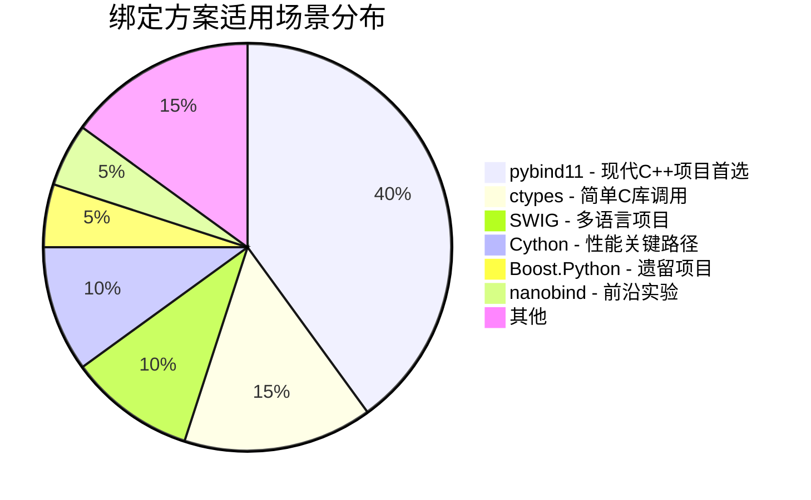
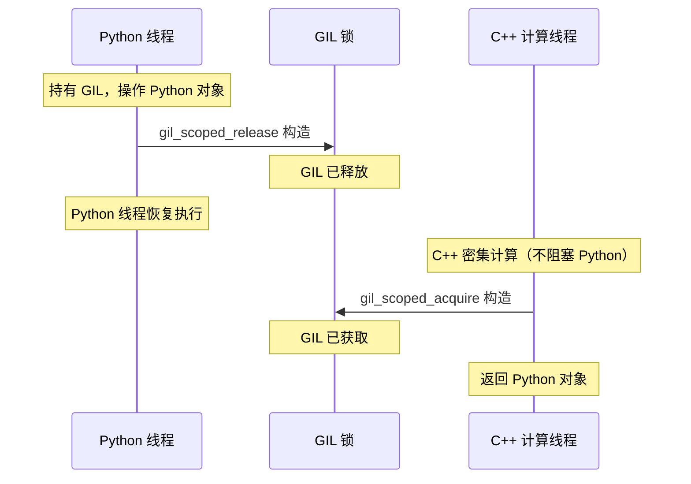

# 第 9 章：Python 绑定 (pybind11)

## 前置知识

> 📎 **参考**: [构建环境配置](../prerequisites/01_构建环境配置.md) — CMake 构建系统基础
> 📎 **参考**: [Python环境](../prerequisites/03_Python环境.md) — Python 开发环境配置

---

## 目录
1. [为什么 Python 绑定很重要](#1-为什么-python-绑定很重要)
2. [pybind11 基础](#2-pybind11-基础)
3. [零拷贝 NumPy 交互](#3-零拷贝-numpy-交互)
4. [GIL 管理](#4-gil-管理)
5. [类型转换](#5-类型转换)
6. [CMake + scikit-build-core 构建](#6-cmake--scikit-build-core-构建)
7. [LangChain 集成示例](#7-langchain-集成示例)
8. [思考题](#8-思考题)
9. [动手练习](#9-动手练习)

---

## 1. 为什么 Python 绑定很重要

### 1.1 核心问题：Python 统治 AI，但 C++ 才是引擎

先说一个你可能已经知道的事实：**Python 是 AI/ML 世界的通用语言。** 不是因为它快——它一点也不快——而是因为它的生态系统太庞大了。

Python 拥有全球最密集的 AI 工具链：
- **NumPy** —— 多维数组运算库，PyTorch、TensorFlow 的底层基石。NumPy 的核心用 C 和 Fortran 写成，Python 只是一层薄薄的胶水。
- **pandas** —— 数据清洗和分析的事实标准。
- **LangChain** 和 **LlamaIndex** —— 构建 LLM（大语言模型）应用的主流框架。LangChain 的核心概念是"链"（Chain）：把文档加载、向量化、检索、生成串联成流水线。
- **OpenAI SDK** —— 调用 GPT-4 像调用本地函数一样简单。
- **Jupyter Notebook** —— 数据科学家的交互式实验台。

**C++ 向量数据库如果不支持 Python，就等于放弃这个生态。** 你造了一台全世界最快的引擎，但没人能把它装进自己的车。

**Python 绑定（Python Bindings）** 就是连接这两个世界的桥梁——让 C++ 写的高性能核心（HNSW 图搜索、SIMD 加速的向量计算、mmap 零拷贝存储）暴露为 Python 可以直接 `import` 和调用的模块。

```mermaid
flowchart TD
    subgraph Python["Python 层（操作台）"]
        A[LangChain 集成 / FastAPI 路由]
        B[参数校验 / 日志 / Jupyter 可视化]
    end

    subgraph Pybind11["pybind11 层（变速箱）"]
        C[类型转换: list ↔ vector&lt;float&gt;]
        D[GIL 管理 / 异常翻译]
        E[Buffer Protocol 零拷贝通道]
    end

    subgraph CPP["C++ 层（引擎）"]
        F[HNSW 图索引搜索 (SIMD 加速)]
        G[mmap 零拷贝存储]
        H[L2/Cosine 距离计算]
    end

    A --> C
    B --> C
    C --> D
    D --> E
    E --> F
    E --> G
    E --> H

    style Python fill:#e1f5fe,stroke:#0288d1
    style Pybind11 fill:#fff3e0,stroke:#f57c00
    style CPP fill:#fce4ec,stroke:#c62828
```

用一个比喻：C++ 是发动机，轰鸣着跑百公里加速 3 秒，能拉 20 吨货物。但驾驶舱只有两个座位，没有空调，没有导航。Python 是豪华旅行大巴——有空调、Wi-Fi、触屏导航、200 个乘客帮你搬货，但踩下油门发动机像老牛喘气。**pybind11 就是变速箱，让两者各司其职。**

### 1.2 什么是 pybind11？

**pybind11** 是一个 **header-only**（纯头文件）C++ 库。"Header-only" 意味着你只需要 `#include` 它的头文件，不需要编译任何额外的 `.cpp`——没有 `.a` 静态库，没有 `.so` 动态库，所有代码在你的项目编译时直接展开。

pybind11 的核心功能：**让 C++ 的类、函数、枚举在 Python 中看起来和用起来都像原生 Python 对象。**

它不是魔法，而是基于两个 C++11 特性：

- **Variadic Templates（可变参数模板）**：C++11 引入的模板机制，允许模板接受任意数量的参数——类似 Python 的 `*args`，但发生在编译期。pybind11 用它实现 `py::arg("a"), py::arg("b")` 这样的参数命名语法。编译器会为每个不同的参数数量和类型生成一份专门的代码。

- **Type Traits（类型萃取/类型特征）**：一组编译期的"类型问询工具"。比如 `std::is_same<T, float>::value` 会在编译期返回 `true` 或 `false`。pybind11 用它们自动判断：这个 C++ 类型是整数？浮点？STL 容器？然后选择正确的转换逻辑。

因为一切发生在编译期，pybind11 能做到：
- **编译期类型检查** —— 如果 Python 传了个 `str` 给期望 `float*` 的参数，编译期就报错
- **自动 STL ↔ Python 转换** —— `std::vector<float>` 自动变成 Python `list`，不需要手写转换代码
- **近乎零开销** —— 生成的代码和手写 Python C API 一样快

### 1.3 什么是 Python C API？

在 pybind11 的舒适表面下，真正干活的是 **Python C API** —— 也叫 **CPython API**。

**CPython** 是 Python 的官方实现——你从 python.org 下载的 Python，或者 macOS/Linux 自带的 `python3`，都是 CPython。它用 C 语言写成。CPython 内部有一个 **解释器（Interpreter）**，负责读取 Python 源代码、将其编译为 **字节码（Bytecode）**、然后逐条执行字节码。字节码是 Python 源码的中间表示——`.pyc` 文件里存的就是它。

Python C API 就是 CPython 暴露给 C/C++ 程序员的内部接口。它定义了一系列函数和类型，让你能用 C 代码操作 Python 对象。

核心概念：

- **PyObject\***：CPython 中**所有对象**（int、str、list、自定义类、模块……）的基类指针。任何 Python 对象在内存中都是一个 `PyObject` 结构体，里面至少包含一个引用计数字段 `ob_refcnt` 和一个指向类型对象的指针 `ob_type`。所有 CPython API 函数都以 `Py` 开头（如 `Py_INCREF`、`PyErr_SetString`）。

- **引用计数（Reference Counting）**：CPython 用来管理内存的机制——不是垃圾回收（GC），而是给每个对象计数。`Py_INCREF` 加一，`Py_DECREF` 减一。计数归零时，CPython 立即调用该对象的析构函数释放内存。忘了调 `Py_INCREF`？对象可能被提前释放，产生悬垂指针（dangling pointer）。忘了调 `Py_DECREF`？内存泄漏。多调一次 `Py_DECREF`？double-free 崩溃。引用计数是 Python C API 最容易出错的地方，也是 pybind11 存在的最大理由之一。

- **C Extension（C 扩展）**：用 C 或 C++ 编写的 Python 模块。当你写 `import numpy` 时，加载的就是一个 C 扩展——一个编译好的 `.so`（Linux/macOS）或 `.pyd`（Windows）文件。C 扩展比纯 Python 快得多，因为它们直接操作 CPython 内部的 `PyObject*` 结构。

- **Module Init（模块初始化）**：当 Python 执行 `import foo` 时，CPython 会寻找一个名为 `PyInit_foo` 的 C 函数。这个函数负责创建模块对象、注册所有函数和类到模块上。pybind11 的 `PYBIND11_MODULE` 宏就是在帮你生成这个函数。

pybind11 的价值：**它把所有 `PyObject*`、引用计数、GIL 操作的脏活都封装起来了。** 你写一行 `py::class_<Vec3>(m, "Vec3")`，pybind11 在背后生成数百行 CPython API 调用。

### 1.4 pybind11 vs 其他方案：为什么选它？

| 方案 | 原理 | 优点 | 缺点 |
|------|------|------|------|
| **pybind11** | C++11 模板元编程，编译期生成绑定代码 | header-only，现代 C++，NumPy 原生支持，类型安全 | 需要 C++11+，编译较慢（模板实例化多） |
| **ctypes** | Python 标准库，通过 `cdll.LoadLibrary` 加载 `.so`/`.dll` | 无需任何编译，纯 Python | 无类型安全（`c_float` 忘写了没人提醒），手动管理内存，没有 STL 转换，只能调 C 不能绑 C++ 类 |
| **cffi** | 类似 ctypes，但支持 C 声明解析（可以从 `.h` 头文件自动提取函数签名） | 比 ctypes 更现代，支持 C 声明解析 | 仍然需要手动管理一切，无法绑定 C++ 类（没有类、虚函数、模板的概念） |
| **SWIG** | 通过接口文件（`.i` 文件）生成多语言绑定（C++/Python/Java/Ruby/...） | 支持 20+ 语言，适合多语言项目 | 配置复杂，生成的代码庞大难读，调试困难，对现代 C++ 支持有限 |
| **Boost.Python** | Boost 库的一部分，pybind11 的前身 | 成熟稳定（20+ 年历史） | **重量级** —— 依赖整个 Boost 库（>100MB 头文件），编译极慢，老式 C++ 风格 |
| **Cython** | 混合 Python + C 的独立语言（`.pyx` 文件） | 极灵活，可手动控制性能关键路径 | 需要学习**另一门语言**的语法，调试困难，不是标准 C++ |
| **nanobind** | pybind11 的现代替代品（2022 年由 pybind11 作者 Wenzel Jakob 创建） | 比 pybind11 快得多（编译后体积减少约 80%，编译速度约 4 倍，运行时开销约 10 倍）。已被 Google IREE、Apple MLX 等项目采用。 | 较新，社区和文档远不如 pybind11，生态兼容性待验证 |

**一句话总结：pybind11 是 C++ 绑定的"甜点"——比 ctypes 安全，比 Boost 轻量，比 Cython 简单，比 SWIG 现代。** 对于大多数 C++/Python 混合项目，它是性价比最高的选择。



---

## 2. pybind11 基础

### 2.1 第一个模块：从 C++ 到 Python

让我们从"Hello World"开始——把一个简单的 C++ 加法函数暴露给 Python。

```cpp
// bindings.cpp
#include <pybind11/pybind11.h>

namespace py = pybind11;

int add(int a, int b) {
    return a + b;
}

// PYBIND11_MODULE 是一个宏，展开后会生成 CPython 需要的模块初始化函数
// （即 PyInit_mymath 函数）
// 第一个参数 "mymath" 是模块名——Python 中 import 的名字
// 第二个参数 m 是 py::module_ 对象，代表这个模块本身
PYBIND11_MODULE(mymath, m) {
    m.doc() = "My math module in C++";  // Python 中 mymath.__doc__ 的值

    // def: 绑定函数
    //   参数1: Python 中的函数名
    //   参数2: C++ 函数指针
    //   参数3: 文档字符串
    //   后续: py::arg 为参数命名（Python 中可用关键字参数）
    m.def("add", &add, "A function that adds two numbers",
          py::arg("a"), py::arg("b"));
}
```

编译后在 Python 中直接使用：

```python
import mymath
print(mymath.add(3, 5))       # 8
print(mymath.add(a=10, b=7))  # 17 — 支持关键字参数
print(mymath.__doc__)         # "My math module in C++"
```

### 2.2 绑定类：让 C++ 类在 Python 中"回家"

```cpp
class Vec3 {
public:
    float x, y, z;
    Vec3(float x_, float y_, float z_) : x(x_), y(y_), z(z_) {}

    float dot(const Vec3& other) const {
        return x * other.x + y * other.y + z * other.z;
    }
    float length() const {
        return std::sqrt(x*x + y*y + z*z);
    }
};

PYBIND11_MODULE(vecmath, m) {
    // py::class_<T> 模板：参数1 = 要绑定的 C++ 类型，参数2 = 在 Python 中显示的名字
    py::class_<Vec3>(m, "Vec3")
        // init 绑定构造函数，py::arg 给每个参数命名
        .def(py::init<float, float, float>(),
             py::arg("x"), py::arg("y"), py::arg("z"))
        // def_readwrite: 暴露公有成员变量为 Python 属性（可读可写）
        .def_readwrite("x", &Vec3::x)
        .def_readwrite("y", &Vec3::y)
        .def_readwrite("z", &Vec3::z)
        // def: 暴露成员函数为 Python 方法
        .def("dot", &Vec3::dot)
        .def("length", &Vec3::length)
        // 重写 __repr__，让 Python 的 print(v) 输出友好的字符串
        .def("__repr__", [](const Vec3& v) {
            return "<Vec3 (" + std::to_string(v.x) + ", "
                   + std::to_string(v.y) + ", "
                   + std::to_string(v.z) + ")>";
        });
}
```

Python 端使用体验：

```python
v = Vec3(1, 2, 3)
print(v.x)           # 1.0 — 像原生的 Python 属性
print(v.length())    # 3.741657...
print(v)             # <Vec3 (1.000000, 2.000000, 3.000000)>
```

### 2.3 绑定枚举：让 C++ 常量进入 Python 命名空间

```cpp
enum class SearchMode {
    EXACT = 0,        // 暴力搜索
    APPROXIMATE = 1   // HNSW 近似搜索
};

PYBIND11_MODULE(mymod, m) {
    py::enum_<SearchMode>(m, "SearchMode")
        .value("EXACT", SearchMode::EXACT)
        .value("APPROXIMATE", SearchMode::APPROXIMATE)
        .export_values();  // 使 Python 中可直接使用 SearchMode.EXACT
}
```

### 2.4 STL 容器自动转换

```cpp
#include <pybind11/stl.h>  // 引入 STL ↔ Python 自动转换

// 只要 #include 了 <pybind11/stl.h>，
// std::vector ↔ list, std::map ↔ dict 的转换完全自动
std::vector<float> scale_vector(const std::vector<float>& vec, float factor) {
    std::vector<float> result;
    result.reserve(vec.size());
    for (float v : vec) result.push_back(v * factor);
    return result;
}

m.def("scale_vector", &scale_vector);  // 就这么简单
```

**`py::object`** 是 pybind11 中表示任意 Python 对象的 C++ 类型——它是 `PyObject*` 的 RAII 封装。当你在 C++ 中需要操作一个 Python 对象（比如传递参数、返回值、调用 Python 方法）时，就用 `py::object`。pybind11 会自动管理引用计数（`Py_INCREF`/`Py_DECREF`），避免手动操作的错误。

### 2.5 对象生命周期管理：return_value_policy

这是 C++/Python 边界上最容易出问题的地方——**谁负责释放内存？**

C++ 和 Python 的内存管理模型截然不同：C++ 用 `delete`/析构函数（RAII），Python 用引用计数/GC。当一个 C++ 对象的指针传到 Python 侧时，pybind11 必须知道采用哪种"护照"：

```cpp
// 1. reference: Python 只"借用"这个对象，C++ 端负责释放
//    适用场景：返回成员变量的引用
//    危险：如果母对象先析构，Python 端获得的是悬垂指针
.def("get_vector", &DB::get_vector,
     py::return_value_policy::reference)

// 2. take_ownership: Python 获得所有权，GC 负责 delete
//    适用场景：工厂函数创建的新对象
.def("create_index", &DB::create_index,
     py::return_value_policy::take_ownership)

// 3. copy: 拷贝一份给 Python（默认行为，最安全但最慢）
.def("get_copy", &DB::get_copy)

// 4. reference_internal: Python 端持有的对象引用了母对象
//    保证母对象在子对象存活期间不被 GC 回收
//    适用场景：迭代器、视图
.def("get_child", &Parent::get_child,
     py::return_value_policy::reference_internal)
```

---

## 3. 零拷贝 NumPy 交互

### 3.1 什么是 Buffer Protocol？

在 Python 中，`bytes` 对象、`bytearray`、`memoryview`、以及最重要的 **NumPy `ndarray`** 都实现了一个叫做 **Buffer Protocol（缓冲区协议）** 的接口。

**Buffer Protocol** 可以理解为一个"内存共享合约"：任何实现了这个协议的对象，都向外部暴露其底层原始内存的指针和布局信息（维度、步长、数据类型）。其他库拿到这个指针后，可以直接读写那块内存——**不需要拷贝任何字节。**

```
C++ vector<float>                     NumPy ndarray
     data ►──────── 共享内存区域 ───────► .data
     size                               .shape[0]
```

pybind11 通过 **`py::array_t<T>`** 类型与 Buffer Protocol 交互。`py::array_t<T>` 是 pybind11 对 NumPy `ndarray` 的 C++ 封装——`T` 是元素类型（如 `float`、`int32`）。当你用 `py::array_t<float>` 作为函数参数时，pybind11 会在运行时检查传入的 Python 对象是否实现了 Buffer Protocol，如果是，就直接获取其内存指针。

```cpp
#include <pybind11/numpy.h>

// 接收 numpy 数组，零拷贝
float l2_distance(py::array_t<float> a, py::array_t<float> b) {
    // .request() 返回 py::buffer_info，包含：
    //   .ptr     — 指向底层内存的原始指针 (void*)
    //   .ndim    — 数组维度数（1D = 1, 2D = 2, ...）
    //   .shape   — 每个维度的大小（如 {1024} 表示长度 1024 的一维数组）
    //   .strides — 每个维度的字节跨度（如 {4} 表示每个 float 占 4 字节）
    //   .itemsize— 单个元素的字节数（float = 4, double = 8）
    py::buffer_info a_info = a.request();
    py::buffer_info b_info = b.request();

    if (a_info.ndim != 1 || b_info.ndim != 1)
        throw std::runtime_error("Expected 1D arrays");
    if (a_info.shape[0] != b_info.shape[0])
        throw std::runtime_error("Dimension mismatch");

    float* a_ptr = static_cast<float*>(a_info.ptr);
    float* b_ptr = static_cast<float*>(b_info.ptr);
    ssize_t dim = a_info.shape[0];

    float sum = 0.0f;
    for (ssize_t i = 0; i < dim; i++) {
        float diff = a_ptr[i] - b_ptr[i];
        sum += diff * diff;
    }
    return std::sqrt(sum);
}
```

### 3.2 真的零拷贝吗？

**是，但有一个前提：numpy 数组必须是 C-contiguous 的（内存连续排列，与 C 语言的数组内存布局一致）。**

NumPy 支持多种内存布局：
- **C-contiguous**（行优先）：最后面的维度变化最快——`arr[i][j]` 中 `j` 是紧邻内存的
- **Fortran-contiguous**（列优先）：最前面的维度变化最快
- **不连续的**：切片后的视图（`arr[::2]`）、转置（`arr.T`）等

如果 numpy 数组是 C-contiguous 且 `dtype=float32`，`a_info.ptr` 直接指向 numpy 的底层内存——零拷贝。如果是不连续或非 float32，pybind11 会先拷贝一份，产生开销。可以用 `a.flags['C_CONTIGUOUS']` 检查。

### 3.3 性能对比：数字会说话

```
操作: 向量加法, 维度=1024, 10000 次调用

以下为典型量级估算，实际性能取决于硬件和 Python 版本：
纯 Python (list comprehension):  450 ms   ← 解释器循环 + 装箱拆箱
NumPy (vectorized, a + b):         8 ms   ← 已优化的 C 循环
pybind11 (STL vector 拷贝):       25 ms   ← 每次调用都要拷贝 4KB
pybind11 (numpy 零拷贝):           4 ms   ← 纯 C++ 速度，无拷贝
```

### 3.4 高级：自定义 Buffer Provider

如果你想让一个 C++ 类**直接**被 numpy 视为内存源（零拷贝），需要实现自定义的 type_caster：

```cpp
struct VectorStorage {
    float* data;
    size_t dim;
    VectorStorage(size_t d) : dim(d) { data = new float[dim]; }
    ~VectorStorage() { delete[] data; }
};

namespace pybind11 { namespace detail {
template<> struct type_caster<VectorStorage> {
    static constexpr auto name = _("VectorStorage");

    static handle cast(VectorStorage src, return_value_policy, handle parent) {
        // capsule: 一个携带析构函数的 Python 对象
        // 当 numpy 数组不再被引用时，capsule 的析构函数会 delete VectorStorage
        return array_t<float>(
            {src.dim},          // shape
            {sizeof(float)},    // strides
            src.data,           // 原始指针
            capsule(new VectorStorage(std::move(src)),
                    [](void* p) { delete (VectorStorage*)p; })
        ).release();
    }
};
}}
```

---

## 4. GIL 管理

### 4.1 什么是 GIL？

**GIL（Global Interpreter Lock，全局解释器锁）** 是 CPython 内部的一个 **互斥锁（Mutex）**。它的规则很简单，但后果深远：

> **同一时刻，只有一个线程能执行 Python 字节码。**

GIL 存在于历史原因。CPython 的内存管理基于 **引用计数（Reference Counting）** —— 每个 `PyObject` 内部都有一个 `ob_refcnt` 整数字段。当你写 `x = []` 时，空列表对象的引用计数为 1。当 `x` 被重新赋值或离开作用域时，引用计数减一。归零时，CPython 调用该对象的析构函数释放内存。

**问题在于：引用计数不是线程安全的。** `ob_refcnt++` 和 `ob_refcnt--` 不是原子操作。如果两个线程同时 `++count` 和 `--count`，就会产生 **数据竞争（Data Race）** —— 两个操作的机器指令交叠执行，导致引用计数错乱。结果可能是：
- 引用计数永远不归零 → 内存泄漏
- 引引用计数过早归零 → 对象被提前释放 → 后续访问触发段错误（Segmentation Fault）

GIL 是 CPython 选择的一个简单方案：**加一把全局锁，保证同一时刻只有一个线程在执行 Python 代码。** 这样引用计数就不会被并发修改。

GIL 的代价是残酷的：

```python
import threading
def compute():
    for i in range(50_000_000): _ = i * i

# 这两个线程永远无法真正并行运行
t1 = threading.Thread(target=compute)
t2 = threading.Thread(target=compute)
```

对于 **I/O 密集型** 程序（网络请求、文件读写），GIL 影响不大——线程大部分时间在等 I/O，释放着 GIL。但对于 **CPU 密集型** 程序（向量搜索、矩阵运算），GIL 是灾难——多线程变成了"排队轮流跑"。

> **注意：** Python 3.13（2024年10月）实验性地引入了 Free-threaded CPython（PEP 703），Python 3.14（2025年10月）将其正式稳定化。但在 2025 年，GIL 仍然是默认行为，也是你在写 pybind11 代码时必须面对的现实。

### 4.2 何时释放 GIL：核心原则

**规则：只要不触碰任何 Python 对象，就应该释放 GIL。**

```cpp
// 错误：持有 GIL 做密集计算 —— 200ms 内所有 Python 线程被冻结
py::array_t<float> search_bad(py::array_t<float> query, Database& db) {
    // Python 线程被阻塞 200ms
    return db.heavy_search(query);  // 耗时 200ms
}

// 正确：三步法 —— 拆包、放锁、打包
py::array_t<float> search_good(py::array_t<float> query, Database& db) {
    // 第 1 步：持有 GIL，把 numpy 数据读到 C++ 栈上
    auto query_vec = numpy_to_vector(query);  // < 1ms

    // 第 2 步：释放 GIL，让其他 Python 线程能跑
    py::gil_scoped_release release;

    auto result_vec = db.heavy_search(query_vec);  // 200ms，不阻塞任何人

    // 第 3 步：重新获取 GIL，返回 Python 对象
    py::gil_scoped_acquire acquire;

    return vector_to_numpy(result_vec);
}
```

### 4.3 pybind11::gil_scoped_release 的原理

`gil_scoped_release` 是一个 **RAII（Resource Acquisition Is Initialization，资源获取即初始化）** 对象——C++ 中管理资源生命周期的经典模式：构造时获取资源，析构时释放资源，保证异常安全。

- **构造函数** 中调用 `PyEval_SaveThread()` —— 释放 GIL，保存当前线程状态
- **析构函数** 中调用 `PyEval_RestoreThread()` —— 重新获取 GIL，恢复线程状态

为什么用 RAII？因为如果中间的 `heavy_search` 抛出一个 C++ 异常，栈展开（stack unwinding）会**自动**调用 `gil_scoped_release` 的析构函数，GIL 被安全地重新获取——不会出现"锁再也拿不回来"的死锁。

### 4.4 GIL 状态图



### 4.5 实际案例：多线程向量搜索

```cpp
class ParallelSearcher {
public:
    std::vector<Result> batch_search(
        const std::vector<std::vector<float>>& queries, int top_k) {
        std::vector<Result> results(queries.size());
        std::vector<std::thread> threads;

        for (size_t i = 0; i < queries.size(); i++) {
            threads.emplace_back([&, i]() {
                // 每个线程内部只操作 C++ 对象——不需要 GIL
                // 如果外层（pybind11 层）已释放 GIL，这里就是真正的多核并行
                results[i] = index_->search(queries[i], top_k);
            });
        }
        for (auto& t : threads) t.join();
        return results;
    }
};

// pybind11 层：GIL 管理集中在一处
PYBIND11_MODULE(db, m) {
    py::class_<ParallelSearcher>(m, "ParallelSearcher")
        .def("batch_search", [](ParallelSearcher& self,
                                 py::array_t<float> queries) {
            // 1. 持有 GIL: numpy → C++ (必须操作 Python 对象)
            auto qvecs = numpy_to_batch(queries);

            // 2. 释放 GIL: 多线程 C++ 搜索 (完全不碰 Python)
            py::gil_scoped_release release;
            auto results = self.batch_search(qvecs, 10);

            // 3. 重新获取 GIL: C++ → numpy
            py::gil_scoped_acquire acq;
            return batch_to_numpy(results);
        });
}
```

---

## 5. 类型转换

### 5.1 STL ↔ Python 内置类型

```cpp
#include <pybind11/stl.h>       // vector ↔ list, map ↔ dict, pair ↔ tuple
#include <pybind11/stl_bind.h>  // 双向绑定，O(1) 访问，避免中间拷贝

// 自动转换表:
//   std::vector<int>    ↔  Python list
//   std::vector<float>  ↔  Python list
//   std::map<K,V>       ↔  Python dict
//   std::pair<A,B>      ↔  Python tuple
//   std::set<T>         ↔  Python set
//   std::optional<T>    ↔  T or None

// 双向绑定（性能更好，C++ 端修改在 Python 端可见）：
PYBIND11_MAKE_OPAQUE(std::vector<float>);
```

### 5.2 异常翻译：C++ 异常 → Python 异常

没有异常翻译时，C++ 抛出的 `std::runtime_error` 在 Python 端是模糊的 `RuntimeError`。异常翻译让你精确控制：

```cpp
PYBIND11_MODULE(db, m) {
    // 注册自定义异常类
    static py::exception<DatabaseError> exc(m, "DatabaseError");

    // 注册翻译器：捕获所有 C++ 异常，映射为对应 Python 异常
    py::register_exception_translator([](std::exception_ptr p) {
        try {
            if (p) std::rethrow_exception(p);
        } catch (const std::invalid_argument& e) {
            PyErr_SetString(PyExc_ValueError, e.what());     // 参数错误
        } catch (const std::runtime_error& e) {
            PyErr_SetString(PyExc_RuntimeError, e.what());   // 运行时错误
        } catch (const std::bad_alloc& e) {
            PyErr_SetString(PyExc_MemoryError, e.what());    // 内存不足
        } catch (const DatabaseError& e) {
            exc(e.what());  // 自定义异常
        }
    });
}
```

---

## 6. CMake + scikit-build-core 构建

> 📎 **参考**: [构建环境配置](../prerequisites/01_构建环境配置.md) — CMake 构建系统详解

### 6.1 什么是 scikit-build-core？

**scikit-build-core** 是一个现代化的 **Python 构建后端（Build Backend）**。它在幕后调用 CMake 构建 C++ 代码，然后自动打包成 wheel。

### 6.2 完整构建配置

**CMakeLists.txt**：

```cmake
cmake_minimum_required(VERSION 3.16)
project(DeepVector-py VERSION 0.1.0 LANGUAGES CXX)

find_package(pybind11 REQUIRED)
find_package(Python COMPONENTS Interpreter Development NumPy REQUIRED)

pybind11_add_module(_lumen_core
    src/bindings.cpp
    src/hnsw_index.cpp
    src/vector_storage.cpp
)

target_include_directories(_lumen_core PRIVATE include)
target_compile_features(_lumen_core PRIVATE cxx_std_17)

# SIMD 加速
if(CMAKE_SYSTEM_PROCESSOR MATCHES "x86_64")
    target_compile_options(_lumen_core PRIVATE -mavx2 -mfma)
endif()
```

**pyproject.toml**（scikit-build-core）：

```toml
[build-system]
requires = ["scikit-build-core>=0.5", "pybind11>=2.11"]
build-backend = "scikit_build_core.build"

[project]
name = "lumen-db"
version = "0.1.0"
description = "DeepVector Python bindings"
requires-python = ">=3.8"

[tool.scikit-build]
cmake.minimum-version = "3.16"
```

构建流程：

```bash
pip install build scikit-build-core pybind11
python -m build --wheel
# 输出: dist/lumen_db-0.1.0-cp310-cp310-linux_x86_64.whl

pip install dist/lumen_db-0.1.0-cp310-cp310-linux_x86_64.whl
python -c "import lumen_db; print(lumen_db.__version__)"
```

---

## 7. LangChain 集成示例

### 7.1 什么是 LangChain？

**LangChain** 是目前最流行的 LLM（大语言模型）应用开发框架。它的核心哲学是"组合"——把各种 AI 组件像乐高积木一样拼接起来。

LangChain 的核心抽象：
- **Document Loaders**：从 PDF、网页、数据库加载文档
- **Text Splitters**：把长文档切分成语义相关的段落
- **Embeddings**：把文本转为向量（调用 OpenAI/本地模型）
- **VectorStores**：存储和检索向量——这就是 DeepVector 的切入点
- **Chains**：把多个组件串联成流水线

### 7.2 VectorStore 接口模式

LangChain 的 `VectorStore` 是一个 **抽象基类（Abstract Base Class, ABC）**，定义了向量数据库应该做什么。

```python
from abc import ABC, abstractmethod
from typing import List

class VectorStore(ABC):
    @abstractmethod
    def add_texts(self, texts: List[str], embeddings: List[List[float]]) -> List[str]:
        """存储文档文本和其向量表示，返回文档 ID 列表"""

    @abstractmethod
    def similarity_search(self, query_embedding: List[float], k: int = 4) -> List[Document]:
        """返回与查询向量最相似的 k 个文档"""
```

### 7.3 C++ 端实现

```cpp
class DeepVectorRetriever {
    HNSWIndex index_;
    std::unordered_map<int64_t, std::string> texts_;

public:
    void add_texts(const std::vector<std::string>& texts,
                   const std::vector<std::vector<float>>& embeddings) {
        for (size_t i = 0; i < texts.size(); i++) {
            int64_t id = index_.insert(embeddings[i].data(), embeddings[i].size());
            texts_[id] = texts[i];
        }
    }

    std::vector<std::pair<std::string, float>> similarity_search(
        const std::vector<float>& query_embedding, int k) {
        auto results = index_.search(query_embedding.data(),
                                      query_embedding.size(), k);
        std::vector<std::pair<std::string, float>> output;
        for (auto& r : results) {
            output.emplace_back(texts_[r.id], r.distance);
        }
        return output;
    }
};
```

### 7.4 Python 端 LangChain 包装器

```python
from langchain_core.retrievers import BaseRetriever
from langchain_core.documents import Document
from typing import List
import _lumen_retriever

class DeepVectorLangChainRetriever(BaseRetriever):
    db: _lumen_retriever.DeepVectorRetriever
    embedder: any

    class Config:
        arbitrary_types_allowed = True

    def _get_relevant_documents(self, query: str) -> List[Document]:
        query_vec = self.embedder.embed_query(query)
        results = self.db.similarity_search(query_vec, k=4)
        return [
            Document(page_content=text, metadata={"score": score})
            for text, score in results
        ]
```

---

## 8. 思考题

1. pybind11 的 `py::array_t<T>` 是如何实现零拷贝的？画出一张 numpy ndarray 内存布局图，标注 `ptr`、`shape`、`strides` 的物理位置。
2. 如果 C++ 端释放了一块被 numpy 引用的内存，会发生什么？如何用 `py::capsule` 防止？写出 capsule 的完整生命周期。
3. 解释 `gil_scoped_release` 和 `gil_scoped_acquire` 的实现原理（提示：`PyGILState_Ensure`/`PyGILState_Release` 内部维护了一个 GIL 状态计数器）。
4. 为什么在 `gil_scoped_release` 区域内不能创建 `py::object`？运行时到底会发生什么（从 CPython 源码角度）？
5. `py::return_value_policy::reference_internal` 和 `take_ownership` 的内存模型有什么区别？各举一个用错时会产生什么 bug 的例子。
6. scikit-build-core 相比老式 setup.py 有什么优势？当目标平台没有预编译 wheel 时（如 ARM SBC），构建流程是怎样的？
7. 如果矩阵太大（>1GB），`py::array_t` 零拷贝在 Python 端 `resize` 时如何保证安全？C++ 端如何检测这种情况？
8. 设计一个方案：如何让 C++ 的 mmap 内存直接暴露为 numpy 数组，实现真正的 C++ ↔ Python 双端零拷贝？考虑 mmap 的 `MAP_SHARED` 标志。

---

## 9. 动手练习

### 练习 1：基础绑定 (20 min)
创建 C++ 数学库 `libfastmath`，绑定以下函数并通过 `pip install -e .` 安装到 Python：
- `float vector_dot(const std::vector<float>& a, const std::vector<float>& b)`
- `std::vector<float> vector_add(const std::vector<float>& a, const std::vector<float>& b)`
- `float vector_norm(const std::vector<float>& v)`

### 练习 2：NumPy 零拷贝 (25 min)
将练习 1 改为使用 `py::array_t<float>`，确保零拷贝。用 `numpy.ndarray.nbytes` 验证没有多余拷贝。编写脚本对比 `vector_add` 的纯 Python、NumPy、pybind11 三种实现的性能差异。

### 练习 3：GIL 实验 (20 min)
在绑定函数中模拟一个耗时 500ms 的计算（`std::this_thread::sleep_for`）。对比释放 GIL 和不释放 GIL 时，5 个 Python `threading.Thread` 的总执行时间。解释两者差异的原因。

### 练习 4：构建 .whl (20 min)
为 `libfastmath` 编写 `CMakeLists.txt` 和 `pyproject.toml`，使用 scikit-build-core 构建 `.whl`。在干净的 venv 中安装并验证。

### 练习 5：LangChain 集成 (可选, 30 min)
为 HNSW 索引写 pybind11 绑定，包装为 `BaseRetriever` 子类。配合 `sentence-transformers` 做 embedding，实现一个简易 RAG 系统——输入自然语言问题，从本地文档库中检索相关段落。

---

## 本章总结

| 要点 | 说明 |
|------|------|
| **pybind11 定位** | C++ 引擎 + Python 操作台 —— 连接两个生态的桥梁 |
| **核心 API** | `PYBIND11_MODULE`, `class_`, `def`, `enum_`, `py::array_t<T>` |
| **零拷贝** | Buffer Protocol + `py::array_t<T>` 直接访问 numpy 内存，性能接近原生 C++ |
| **GIL 管理** | 三步法：拆包 → `gil_scoped_release` → 计算 → `gil_scoped_acquire` → 打包 |
| **生命周期** | `return_value_policy` 控制 C++↔Python 边的所有权转移 |
| **构建体系** | scikit-build-core + CMake + pyproject.toml → 一键生成 .whl |
| **生态集成** | 实现 LangChain VectorStore 接口 → 接入任意 RAG 流水线 |

> 下一章：[第 10 章：HTTP 服务器设计](../ch10_http_server/README.md)