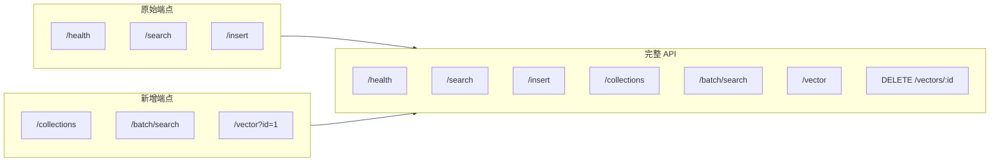

# 第十章：C++ 核心增强

> DeepVector 服务器新增端点和持久化支持。

## 前置知识

> 📎 **参考**: [构建环境配置](../prerequisites/01_构建环境配置_zh.md) | [测试框架](../prerequisites/04_测试框架_zh.md)

---

## 学习目标

- 掌握 DeepVector C++ Server 的端点设计
- 理解 Collection::load() 持久化实现
- 学会在 C++ 中处理 JSON 请求

---

## 10.1 新增端点



| 端点 | 方法 | 说明 |
|------|------|------|
| `/collections` | GET | 列出所有集合 |
| `/batch/search` | POST | 批量搜索 (一次多个 query) |
| `/vector?id=` | GET | 按 ID 获取向量 |

---

## 10.2 批量搜索实现

```cpp
if (path == "/batch/search" && method == "POST") {
    stats_.search_requests++;
    auto req = json::parse(body);
    json resp;
    resp["results"] = json::array();

    for (auto& q : req["queries"]) {
        std::vector<float> vec = q["vector"].get<std::vector<float>>();
        size_t k = q.value("k", 10);
        auto results = collection_->search(vec.data(), k);

        json batch;
        batch["results"] = json::array();
        for (auto& r : results) {
            json item;
            item["id"] = r.id;
            item["distance"] = r.distance;
            batch["results"].push_back(item);
        }
        resp["results"].push_back(batch);
    }
    return buildResponse(200, "application/json", resp.dump());
}
```

---

## 10.3 Collection::load() 持久化

```cpp
std::unique_ptr<Collection> Collection::load(
    const std::string& name,
    const std::string& data_dir
) {
    // 1. 从 JSON 配置文件恢复 CollectionConfig
    // 2. 创建 Collection 实例 (自动加载 mmap 数据)
    // 3. 返回实例 (HNSW 索引需要重新构建)

    CollectionConfig config;
    config.dim = 768;
    // ... 解析 data_dir + name + ".cfg.json"

    auto coll = std::make_unique<Collection>(config, data_dir + "/" + name);
    return coll;
}
```

> **注意**: 当前 `load()` 返回的 Collection 不包含 HNSW 索引。
> 向量数据 (mmap) 已自动加载，但搜索功能需要重建索引后才能使用。

---

## 思考题

1. `Collection::load()` 为什么不自动重建 HNSW 索引？如果自动重建，应该在什么时机做？
2. 如何让 `/batch/search` 实现真正的并行搜索 (多线程)？
3. 如果 JSON 请求体大于 64KB，当前的 HTTP Server 处理方式有什么问题？

## 动手练习

1. 给 `/batch/search` 添加并行的 C++ 线程实现
2. 实现 `Collection::load()` 的索引重建 (遍历 mmap 重新插入 HNSW)
3. 添加 `/save` 端点，支持通过 API 触发数据持久化

---

## 附录：本章与面试题库映射

请完成本章后练习 [INTERVIEW_BANK.md](../INTERVIEW_BANK.md) 中对应分区题目，并阅读 [_CHAPTER_TEMPLATE.md](../_CHAPTER_TEMPLATE.md) 自检是否覆盖「点/线/面/动手/反思/参考」。

**全局架构：** [ARCHITECTURE.md](../../ARCHITECTURE.md) · **选型：** [TECH.md](../../../TECH.md) · **运行：** [RUN.md](../../../RUN.md)
