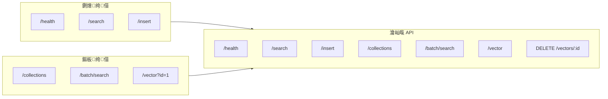

# 绗崄绔狅細C++ 鏍稿績澧炲己

> DeepVector 鏈嶅姟鍣ㄦ柊澧炵鐐瑰拰鎸佷箙鍖栨敮鎸併€?
## 鍓嶇疆鐭ヨ瘑

> 馃搸 **鍙傝€?*: [鏋勫缓鐜閰嶇疆](../prerequisites/01_鏋勫缓鐜閰嶇疆_zh.md) | [娴嬭瘯妗嗘灦](../prerequisites/04_娴嬭瘯妗嗘灦_zh.md)

---

## 瀛︿範鐩爣

- 鎺屾彙 DeepVector C++ Server 鐨勭鐐硅璁?- 鐞嗚В Collection::load() 鎸佷箙鍖栧疄鐜?- 瀛︿細鍦?C++ 涓鐞?JSON 璇锋眰

---

## 10.1 鏂板绔偣



| 绔偣 | 鏂规硶 | 璇存槑 |
|------|------|------|
| `/collections` | GET | 鍒楀嚭鎵€鏈夐泦鍚?|
| `/batch/search` | POST | 鎵归噺鎼滅储 (涓€娆″涓?query) |
| `/vector?id=` | GET | 鎸?ID 鑾峰彇鍚戦噺 |

---

## 10.2 鎵归噺鎼滅储瀹炵幇

```cpp
if (path == "/batch/search" && method == "POST") {
    stats_.search_requests++;
    auto req = json::parse(body);
    json resp;
    resp["results"] = json::array();

    for (auto& q : req["queries"]) {
        std::vector<float> vec = q["vector"].get<std::vector<float>>();
        size_t k = q.value("k", 10);
        auto results = collection_->search(vec.data(), k);

        json batch;
        batch["results"] = json::array();
        for (auto& r : results) {
            json item;
            item["id"] = r.id;
            item["distance"] = r.distance;
            batch["results"].push_back(item);
        }
        resp["results"].push_back(batch);
    }
    return buildResponse(200, "application/json", resp.dump());
}
```

---

## 10.3 Collection::load() 鎸佷箙鍖?
```cpp
std::unique_ptr<Collection> Collection::load(
    const std::string& name,
    const std::string& data_dir
) {
    // 1. 浠?JSON 閰嶇疆鏂囦欢鎭㈠ CollectionConfig
    // 2. 鍒涘缓 Collection 瀹炰緥 (鑷姩鍔犺浇 mmap 鏁版嵁)
    // 3. 杩斿洖瀹炰緥 (HNSW 绱㈠紩闇€瑕侀噸鏂版瀯寤?

    CollectionConfig config;
    config.dim = 768;
    // ... 瑙ｆ瀽 data_dir + name + ".cfg.json"

    auto coll = std::make_unique<Collection>(config, data_dir + "/" + name);
    return coll;
}
```

> **娉ㄦ剰**: 褰撳墠 `load()` 杩斿洖鐨?Collection 涓嶅寘鍚?HNSW 绱㈠紩銆?> 鍚戦噺鏁版嵁 (mmap) 宸茶嚜鍔ㄥ姞杞斤紝浣嗘悳绱㈠姛鑳介渶瑕侀噸寤虹储寮曞悗鎵嶈兘浣跨敤銆?
---

## 鎬濊€冮

1. `Collection::load()` 涓轰粈涔堜笉鑷姩閲嶅缓 HNSW 绱㈠紩锛熷鏋滆嚜鍔ㄩ噸寤猴紝搴旇鍦ㄤ粈涔堟椂鏈哄仛锛?2. 濡備綍璁?`/batch/search` 瀹炵幇鐪熸鐨勫苟琛屾悳绱?(澶氱嚎绋?锛?3. 濡傛灉 JSON 璇锋眰浣撳ぇ浜?64KB锛屽綋鍓嶇殑 HTTP Server 澶勭悊鏂瑰紡鏈変粈涔堥棶棰橈紵

## 鍔ㄦ墜缁冧範

1. 缁?`/batch/search` 娣诲姞骞惰鐨?C++ 绾跨▼瀹炵幇
2. 瀹炵幇 `Collection::load()` 鐨勭储寮曢噸寤?(閬嶅巻 mmap 閲嶆柊鎻掑叆 HNSW)
3. 娣诲姞 `/save` 绔偣锛屾敮鎸侀€氳繃 API 瑙﹀彂鏁版嵁鎸佷箙鍖?