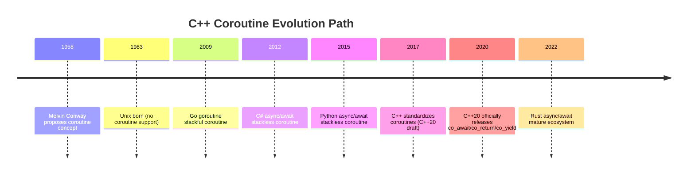
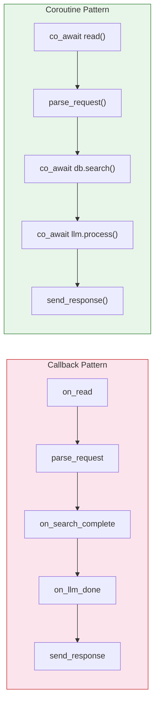
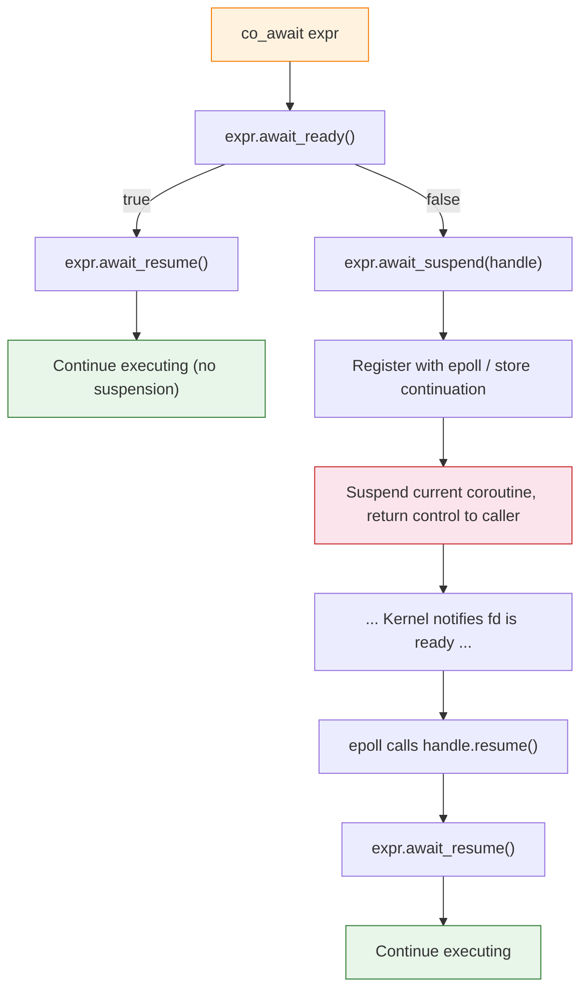
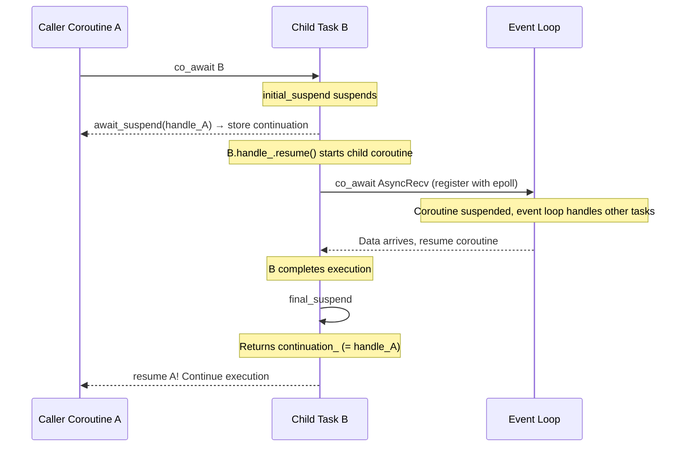
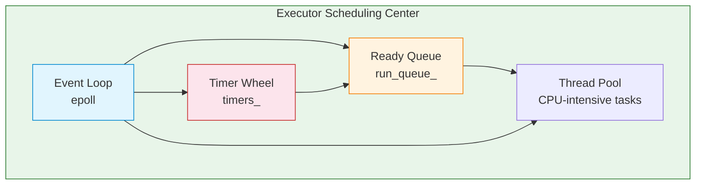

# Chapter 11: C++20 Coroutines & SkyNet

## Prerequisites

This chapter assumes familiarity with the following concepts. Review these shared documents before proceeding:

> 📎 **Reference**: [Build Environment Configuration](../prerequisites/01_构建环境配置_en.md) — CMake and C++20 compiler setup
> 📎 **Reference**: [Chapter 10: HTTP Server Design](../ch10_http_server/10_HTTP服务器设计_en.md) — epoll event loop fundamentals (Sections 5-6)

---

## Table of Contents
1. [From Callback Hell to Coroutines: The Evolution of Asynchronous Programming](#1-from-callback-hell-to-coroutines-the-evolution-of-asynchronous-programming)
2. [C++20 Coroutine Keywords](#2-c20-coroutine-keywords)
3. [Coroutine Frames and State Machines](#3-coroutine-frames-and-state-machines)
4. [Promise Types](#4-promise-types)
5. [The Awaitable Concept](#5-the-awaitable-concept)
6. [Symmetric Transfer](#6-symmetric-transfer)
7. [SkyNet Task\<T\> Design](#7-skynet-taskt-design)
8. [Epoll + Coroutine Integration](#8-epoll--coroutine-integration)
9. [Executor Design](#9-executor-design)
10. [Cross-Language Comparison](#10-cross-language-comparison)
11. [Discussion Questions](#11-discussion-questions)
12. [Hands-On Exercises](#12-hands-on-exercises)

---

## 1. From Callback Hell to Coroutines: The Evolution of Asynchronous Programming

### 1.1 First Generation: Callbacks — The Price of Fragmented Logic

The callback pattern is the oldest paradigm in asynchronous programming. When an I/O operation completes, the system calls your registered function. This is conceptually simple, but as business complexity grows, the code turns into spaghetti.

**Callback Hell**: When multiple asynchronous operations need to execute sequentially, each subsequent step must be nested inside the previous callback function, causing the code to indent continuously to the right, forming a pyramid structure.

```
Callback style (Chapter 10): Logic fragmented
on_read(fd) {
    parse_request(buf, n);
    db.search_async(req, on_search_complete);  // Callback 1
}
on_search_complete(results) {
    llm.process_async(results, on_llm_done);  // Callback 2
}
on_llm_done(llm_result) {
    send_response(fd, final);                  // Callback 3
}
```

The problem: a complete "read → parse → database → LLM → response" flow is split into 4 separate functions, and shared state can only be passed via `void*` or global variables. When debugging, you can't see the complete execution flow in the call stack—because the execution flow doesn't exist.

### 1.2 Second Generation: Future/Promise — Making Code Look Linear

**Future** is an abstract object representing "an asynchronous operation will eventually produce a value." You can chain `.then()` calls on a Future, transforming nested code into linear chains.

**Promise** is the producer side of a Future—when you start an asynchronous operation, you get a Promise object through which you set the final result of the operation.

```
// Pseudo-code: Future chain
auto f1 = read_async(fd);
auto f2 = f1.then([](auto buf) { return parse(buf); });
auto f3 = f2.then([](auto req) { return db.search(req); });
auto f4 = f3.then([](auto res) { return llm.process(res); });
f4.then([](auto final) { send_response(fd, final); });
```

Progress: code becomes a linear chain. But problems remain—each `.then()` is a new closure, making compiler inlining difficult, and the call stack visible in the debugger is still broken. C++'s Future (`std::future`) is worse: it requires synchronous `.get()`, essentially "fake asynchronous."

### 1.3 Third Generation: Coroutines — Synchronous Syntax, Asynchronous Execution

The core problem coroutines solve is: **making asynchronous code look like synchronous code, while keeping the underlying execution asynchronous.**

This concept is much older than you might think. **Melvin Conway** (yes, the Conway of Conway's Law) first coined the term "coroutine" in a **1958** paper—11 years before Unix and 14 years before C.

By the time C++20 standardized coroutines in 2017, coroutines were already a standard feature of mainstream languages:

| Language | Asynchronous Model | Year Introduced |
|----------|-------------------|-----------------|
| Go | goroutine (stackful coroutine) | 2009 |
| C# | async/await (stackless coroutine) | 2012 |
| Python | async/await (stackless coroutine) | 2015 |
| Rust | async/await (stackless coroutine) | 2019 |
| JavaScript | async/await (stackless coroutine) | 2017 |
| **C++** | **co_await/co_return/co_yield (stackless coroutine)** | **2020** |

C++ lagged a full generation in asynchronous programming. C++20 coroutines are the catch-up course.



### 1.4 The Thread Model Dilemma

Before coroutines, you had two choices:

```
Scenario: A server needs to handle 10,000 HTTP long connections simultaneously

Option A: One thread per connection
  Default stack size per thread: 8MB (Linux default ulimit -s 8192)
  10,000 × 8MB = 80,000MB = 80GB memory — just for stacks!
  Conclusion: Not feasible ❌

Option B: epoll event-driven (Chapter 10's approach)
  1 thread handles all connections, minimal memory usage
  But code turns into callback hell:
    on_read() → parse_request() → on_search_complete() → write_response()
  Business logic is fragmented
  Poor readability, difficult debugging ❌

Option C: Coroutines
  1 thread runs multiple coroutines, each coroutine ~1KB overhead
  Code looks synchronous (executes top to bottom), but execution is asynchronous (doesn't occupy thread when suspended)
  Perfect ✅
```



**Coroutines**, in the simplest definition: **a function that can be paused and resumed**—like having a "pause button" installed inside a function. You place a bookmark in a book, close it and go do something else, then come back and open to the bookmark to continue reading. Functions work the same way: execute to a certain point and pause, saving all local state; later, resume exactly from the pause point, as if you never left.

**Difference from threads**: Threads are scheduled by the operating system (**preemptive scheduling**—the OS can pause your thread at any time to run another), while coroutines are **explicitly controlled** by the programmer for suspension and resumption (**cooperative scheduling**). Cooperative means: coroutines must voluntarily yield control (via `co_await`, `co_yield`, `co_return`) and won't be forcibly interrupted. This eliminates data race issues—two cooperative coroutines won't concurrently modify the same variable without synchronization primitives, because they don't actually execute in parallel.

---

## 2. C++20 Coroutine Keywords

### 2.1 Three Magic Words

```cpp
co_await   // "Wait here until some operation completes"
co_return  // "Return a value and end the coroutine"
co_yield   // "Produce a value then pause, wait to be resumed later" (for generators)
```

**Detection rule**: If a function body contains any of `co_await`, `co_return`, or `co_yield`, the compiler treats it as a **Coroutine Function**—automatically compiling the function body into a state machine and allocating a coroutine frame. No `async` keyword needed, no special return type marker required (though the return type must contain `promise_type`), purely determined by whether these three keywords appear in the function body.

```cpp
// Normal function — compiles to a straight line
int add(int a, int b) {
    return a + b;
}

// Coroutine function — compiler generates hundreds of lines of state machine code behind the scenes
Task<int> async_add(int a, int b) {
    int sum = a + b;
    co_return sum;  // This co_return triggers coroutine transformation
}
```

### 2.2 co_await: The Suspension Point

**co_await** is the coroutine's pause instruction. When the execution flow encounters `co_await expr`:

1. The compiler calls `expr.await_ready()`—if it returns `true`, the result is ready, skip suspension
2. If `false`, the compiler calls `expr.await_suspend(current_handle)`—suspend the current coroutine, return control to the caller
3. When some event (I/O completion, another coroutine finishing) resumes the coroutine, execution continues from after the `co_await`

```cpp
auto result = co_await async_operation();
// ↑ When execution reaches this line, the coroutine may suspend
// ↑ During suspension, the thread can execute other coroutines or handle other events
// ↑ After resumption, result is assigned, execution continues downward
```

### 2.3 co_return: Final Value Return

**co_return** replaces the `return` statement of a normal function, ending the coroutine's execution. It calls `promise_type::return_value()` (or `return_void()`) to set the coroutine's final result value.

```cpp
Task<int> compute() {
    co_return 42;  // Coroutine ends, value 42 stored in promise
}
```

### 2.4 co_yield: Producer-Consumer Pattern

**co_yield** is syntactic sugar specifically for generators. It's equivalent to `co_await promise.yield_value(value)`—yielding a value to the caller while pausing the coroutine. When the caller resumes the coroutine next time, execution continues from after the `co_yield`.

```cpp
Generator<int> fibonacci() {
    int a = 0, b = 1;
    while (true) {
        co_yield a;       // Produce current value, pause
        int tmp = a + b;  // Continue from here on next resume
        a = b;
        b = tmp;
    }
}
```

---

## 3. Coroutine Frames and State Machines

### 3.1 What Is a Coroutine Frame?

A **Coroutine Frame** is a block of memory allocated on the **heap** by the compiler for each coroutine instance, containing:

| Member | Description |
|--------|-------------|
| **Promise Object** | The coroutine's "control panel," user-defined `promise_type` instance |
| **Local Variable Copies** | All local variables that need to survive across suspension points |
| **Parameter Copies** | Coroutine parameters (if passed by value) |
| **State Machine State** | `state` integer (compiler internal), marking which suspension point execution has reached |
| **Exception Pointer** | `std::exception_ptr`, capturing unhandled exceptions inside the coroutine |
| **Continuation Handle** | In some implementations, stores "who is waiting for me" information |

The frame is allocated via `operator new` when the coroutine is first called, and freed via `operator delete` when `coroutine_handle::destroy()` is called.

**Analogy**: A coroutine frame is like a bookmark, recording: which page you read to (state), what notes you've tucked in the book (local variables), your annotations (promise). When you close the book (suspend), all information is on the bookmark; when you open the book, you turn to the bookmark's position and continue reading.

### 3.2 How the Compiler Transforms Coroutines into State Machines

Look at a simple piece of coroutine code:

```cpp
Task<int> process(HttpRequest req) {
    auto db_result = co_await query_database(req);    // Suspension point 1
    auto llm_result = co_await call_llm(db_result);    // Suspension point 2
    auto final = merge(db_result, llm_result);          // Continue after resume
    co_return final;                                    // End
}
```

The compiler transforms this into an equivalent **state machine** (highly simplified):

```cpp
// Compiler-generated "coroutine frame" — stored on the heap
struct process_Frame {
    int state = 0;               // Which suspension point execution has reached
    HttpRequest req;             // Parameters (needs to survive across suspension points)
    DbResult db_result;          // Local variables (need to be preserved between suspension points)
    LlmResult llm_result;
    int final;
    promise_type promise;
    // ... bookkeeping information ...
};

// Compiler-generated "resume function" — called each time resume() is invoked
void process_resume(process_Frame* f) {
    switch (f->state) {
    case 0:
        // Initiate async query; set next state; suspend
        query_database_async(f->req, f);
        f->state = 1;
        return;  // Return control to caller

    case 1:
        // db_result is ready; initiate next async call
        call_llm_async(f->db_result, f);
        f->state = 2;
        return;

    case 2:
        f->final = merge(f->db_result, f->llm_result);

    case 3:
        f->promise.return_value(f->final);
        return;
    }
}
```

**Key insight**: The `state` variable and `switch-case` replace the program counter (**PC register**—the CPU register storing the address of the currently executing instruction). Each `return` is equivalent to "pause," and the next time it's called, the `switch` jumps to the previous position to continue execution. This is the essence of **stackless coroutines**: no separate stack needed; state is saved in the heap-allocated frame; resumption relies on the compiler-generated state machine.

### 3.3 Which Variables Need to Go Into the Frame?

The compiler only places local variables that **survive across suspension points** into the coroutine frame. Specific rules:

- If a local variable is still used after a `co_await`, `co_yield`, or `co_return`, it must be stored in the frame
- If a local variable's lifetime is completely within one suspension point, it can remain in the normal stack frame

```cpp
Task<void> example() {
    int a = 1;                    // ❌ Not in frame: used up before the first co_await
    co_await some_op();           // Suspension point
    int b = 2;                    // ✅ In frame: still used after the second co_await
    co_await another_op();
    printf("%d\n", b);            // b restored from frame
}
```

### 3.4 What Is HALO (Heap Allocation eLision Optimization)?

**HALO** is a compiler optimization: if the compiler can **prove** that the coroutine's entire lifetime is contained within its caller's (doesn't overlap), and the coroutine frame size is known at compile time, the frame can be allocated on the **caller's stack** instead of the heap—eliminating `new`/`delete` overhead.

HALO is not guaranteed by the C++ standard—it depends on the compiler and specific code. GCC 12+ and Clang 14+ can perform HALO in some scenarios.

---

## 4. Promise Types

### 4.1 What Is promise_type?

**promise_type** is the coroutine's **"control panel"**—a user-defined type that the compiler instantiates inside the coroutine frame, and through which it controls the coroutine's lifecycle behavior.

**Note**: This Promise has nothing to do with JavaScript's `Promise` or `std::future`. The promise in C++ coroutines is an interface protocol between the compiler and the coroutine—the compiler implements the coroutine mechanism by calling specific member functions on the promise.

promise_type must provide the following methods (the compiler calls them automatically):

| Method | When Called | Purpose |
|--------|------------|---------|
| `get_return_object()` | When coroutine starts | Creates the object returned to the caller (e.g., Task) |
| `initial_suspend()` | After coroutine frame allocation | Determines whether the coroutine executes immediately or suspends first |
| `final_suspend()` | When coroutine is about to end | Determines whether the frame stays alive after the coroutine ends |
| `return_value(T)` / `return_void()` | When executing `co_return` | Stores the coroutine's final return value |
| `unhandled_exception()` | Uncaught exception inside coroutine | Stores the exception, preventing process crash |
| `yield_value(T)` (optional) | When executing `co_yield` | Yields a value to the caller, suspends the coroutine |

### 4.2 initial_suspend: Cold Start vs Hot Start

**initial_suspend** determines behavior after coroutine creation:

- `std::suspend_always` (**cold start**): Coroutine suspends immediately after creation, only begins execution when an external call to `handle.resume()` is made. Suitable for scenarios where you need to obtain the coroutine handle before starting (like the Task pattern).
- `std::suspend_never` (**hot start**): Coroutine begins executing immediately after creation, only potentially suspending when it encounters the first `co_await`.

**Analogy**: A cold start is like you've prepared a book and bookmark but haven't opened it—waiting for someone to say "start reading." A hot start is like you grab the book, open to the first page, and start reading immediately, only pausing when you hit a "need to look up reference" note.

### 4.3 final_suspend: Life and Death of the Frame

**final_suspend** determines the frame's lifecycle after the coroutine ends:

- `std::suspend_always` (**keep alive**): After the coroutine ends, the frame still exists. The external must call `handle.destroy()` to free it. This ensures the caller can safely access the result after the coroutine ends.
- `std::suspend_never` (**auto-destroy**): After the coroutine ends, the frame is immediately destroyed. The `handle` then becomes a **Dangling Pointer**—pointing to freed memory, and any access is undefined behavior.

**Why is it dangerous?** If `final_suspend` returns `suspend_never`, the caller cannot read the result after the coroutine ends—because the frame containing the result has already been destroyed. This is why almost every practical Task implementation uses `suspend_always`.

### 4.4 Minimal Task\<T\> Implementation

```cpp
#include <coroutine>
#include <exception>

template<typename T>
struct Task {
    struct promise_type {
        T value_;
        std::exception_ptr exception_;

        std::suspend_never initial_suspend() { return {}; }   // Hot start
        std::suspend_always final_suspend() noexcept { return {}; } // Keep alive

        Task<T> get_return_object() {
            return Task<T>{
                std::coroutine_handle<promise_type>::from_promise(*this)
            };
        }

        void return_value(T value) {
            value_ = std::move(value);
        }

        void unhandled_exception() {
            exception_ = std::current_exception();
        }
    };

    std::coroutine_handle<promise_type> handle_;

    explicit Task(std::coroutine_handle<promise_type> h) : handle_(h) {}
    ~Task() { if (handle_) handle_.destroy(); }

    Task(const Task&) = delete;
    Task& operator=(const Task&) = delete;
    Task(Task&& other) noexcept : handle_(other.handle_) {
        other.handle_ = nullptr;
    }

    T get() {
        if (!handle_.done()) handle_.resume();
        if (handle_.promise().exception_)
            std::rethrow_exception(handle_.promise().exception_);
        return handle_.promise().value_;
    }
};
```

### 4.5 The Promise for co_yield

```cpp
template<typename T>
struct Generator {
    struct promise_type {
        T current_value_;

        std::suspend_always initial_suspend() { return {}; }
        std::suspend_always final_suspend() noexcept { return {}; }

        Generator get_return_object() {
            return Generator{
                std::coroutine_handle<promise_type>::from_promise(*this)
            };
        }

        // co_yield value; calls this function
        std::suspend_always yield_value(T value) {
            current_value_ = std::move(value);
            return {};  // Suspend
        }

        void return_void() {}
        void unhandled_exception() { std::terminate(); }
    };

    std::coroutine_handle<promise_type> handle_;

    explicit Generator(std::coroutine_handle<promise_type> h) : handle_(h) {}
    ~Generator() { if (handle_) handle_.destroy(); }
    Generator(const Generator&) = delete;
    Generator(Generator&& o) noexcept : handle_(o.handle_) { o.handle_ = nullptr; }

    bool next() {
        if (!handle_ || handle_.done()) return false;
        handle_.resume();
        return !handle_.done();
    }
    T value() const { return handle_.promise().current_value_; }

    struct iterator {
        Generator* gen_;
        bool operator!=(std::default_sentinel_t) const { return gen_->next(); }
        T operator*() const { return gen_->value(); }
        iterator& operator++() { return *this; }
    };
    iterator begin() { return iterator{this}; }
    std::default_sentinel_t end() { return {}; }
};

Generator<int> fibonacci(int n) {
    int a = 0, b = 1;
    for (int i = 0; i < n; i++) {
        co_yield a;
        int tmp = a + b;
        a = b;
        b = tmp;
    }
}
// for (int f : fibonacci(10)) printf("%d ", f);  // 0 1 1 2 3 5 8 13 21 34
```

### 4.6 What Is coroutine_handle?

**coroutine_handle\<P\>** is a **non-owning pointer** (like a raw pointer, not like `unique_ptr`) pointing to the coroutine frame. It doesn't manage the coroutine frame's lifecycle (unless you explicitly call `destroy()`), but provides the following operations:

| Method | Purpose |
|--------|---------|
| `h.resume()` | Resume coroutine execution (equivalent to continuing from the suspension point) |
| `h.destroy()` | Destroy the coroutine frame, free memory (calls destructors) |
| `h.done()` | Check if the coroutine has ended (returns `true` after `final_suspend`) |
| `h.promise()` | Access the associated promise_type object |
| `h.address()` | Get the underlying pointer (for cross-thread passing) |
| `coroutine_handle<>::from_promise(p)` | Get the corresponding handle from a promise object |

**Analogy**: `coroutine_handle` is like a remote control—you can use it to start, pause, or destroy the coroutine, but it doesn't own the coroutine. Just like a TV remote doesn't own the TV.

---

## 5. The Awaitable Concept

### 5.1 What Is an Awaitable?

An **Awaitable** is any type that implements the three methods required by `co_await`. You don't need to inherit from a class or implement an interface—as long as your type has these three methods, you can write `co_await` before it. This is **Concept-style** polymorphism—duck typing, determined at compile time.

### 5.2 What Is an Awaiter?

An **Awaiter** is the core implementation of an Awaitable—the object containing the three methods. Sometimes the Awaitable and Awaiter are the same type; sometimes the Awaitable returns an Awaiter via `operator co_await`.

```cpp
co_await my_awaitable;
// The compiler expands this to:
//   1. auto&& awaiter = as_awaitable(my_awaitable);
//   2. if (awaiter.await_ready()) goto resume_point;
//   3. awaiter.await_suspend(current_coroutine_handle);
//   4. return;  // Suspend
// resume_point:
//   5. auto result = awaiter.await_resume();
```

### 5.3 Detailed Meaning of the Three Methods

| Method | Meaning | Return Value |
|--------|---------|-------------|
| **await_ready()** | Is the result already ready? (No need to wait) | `true` → skip waiting; `false` → need to suspend |
| **await_suspend(handle)** | What to do when suspending? (Register with epoll; store continuation handle) | `void` (suspend) / `bool` (whether to suspend) / `coroutine_handle<>` (symmetric transfer) |
| **await_resume()** | Value returned to `co_await` after resuming execution | Any type—this is the value of `co_await expr` |

### 5.4 What Is await_transform?

**await_transform** is an optional member function of promise_type. When `co_await expr` appears in the coroutine body, the compiler first checks if promise_type has an `await_transform(expr)` method. If so, `expr` is passed to `await_transform` first, and the return value (an Awaitable) then participates in the standard `co_await` flow.

```cpp
struct promise_type {
    // Automatically wrap plain values as ready Awaitables
    template<typename T>
    auto await_transform(T&& value) {
        if constexpr (is_awaitable_v<T>) {
            return std::forward<T>(value);  // Already an Awaitable, use directly
        } else {
            return ready_awaitable{std::forward<T>(value)};  // Wrap as Awaitable
        }
    }
};
```

**Analogy**: `await_transform` is like a filter—you can intercept all `co_await` operations and do preprocessing before they reach the actual awaiter. Boost.Coro and some frameworks use it for features like debug logging and timeout injection.

### 5.5 Practical Example: Asynchronous Read Awaitable

```cpp
struct AsyncRecv {
    int fd_;
    char* buf_;
    size_t len_;
    ssize_t result_;

    bool await_ready() {
        ssize_t n = recv(fd_, buf_, len_, MSG_DONTWAIT);
        if (n > 0) { result_ = n; return true; }   // Data already ready
        if (n == 0) { result_ = 0; return true; }   // Connection closed
        return false;                                // errno == EAGAIN, need to wait
    }

    void await_suspend(std::coroutine_handle<> h) {
        g_io_context.register_read(fd_, h);  // Register with epoll
    }

    ssize_t await_resume() {
        ssize_t n = recv(fd_, buf_, len_, 0);  // Kernel guarantees fd is readable
        return n;
    }
};
```

### 5.6 Complete co_await Execution Flow Diagram



### 5.7 Standard Library Built-in Awaitables

```cpp
struct suspend_always {
    bool await_ready() const noexcept { return false; }    // Always suspend
    void await_suspend(coroutine_handle<>) const noexcept {}
    void await_resume() const noexcept {}
};

struct suspend_never {
    bool await_ready() const noexcept { return true; }     // Never suspend
    void await_suspend(coroutine_handle<>) const noexcept {}
    void await_resume() const noexcept {}
};
```

---

## 6. Symmetric Transfer

### 6.1 What Is Symmetric Transfer?

**Symmetric Transfer** is a key optimization introduced by C++20 coroutines. When `await_suspend` returns a `coroutine_handle<>`, the compiler doesn't push onto the stack like a normal function call—instead, it performs **Tail Call Optimization**, jumping directly to the target coroutine's resume function.

```cpp
// Symmetric transfer: await_suspend returns a handle
std::coroutine_handle<> await_suspend(std::coroutine_handle<> h) noexcept {
    return continuation_;  // Jump directly to continuation_, no increase in call stack depth
}

// Asymmetric: await_suspend returns void, requires explicit resume
void await_suspend(std::coroutine_handle<> h) noexcept {
    continuation_.resume();  // Call stack increases by one level!
}
```

### 6.2 Why Does It Matter?

Consider a deeply nested coroutine chain: A → B → C → D. If each final_suspend calls `continuation_.resume()`, the call stack nests层层嵌套:

```
Stack frames (asymmetric transfer):
  main() → executor.run() → D.resume() → C.resume() → B.resume()
  Each level ~64 bytes, 1000 coroutines = 64KB stack growth → possible stack overflow
```

Symmetric transfer avoids this problem—each transfer is a tail call, optimized by the compiler to a direct jump:

```
Stack frames (symmetric transfer):
  main() → executor.run() → D.resume()
  Stack depth is constant, regardless of nesting depth
```

**Analogy**: Asymmetric transfer is like a relay race—each runner finishes and hands the baton to the next person, then stands in place and waits. Symmetric transfer is like checkers—you jump directly to the next position, with no stops in between.

### 6.3 Application in SkyNet Task

```cpp
// final_suspend's awaiter: resume continuation after completion
struct FinalAwaiter {
    bool await_ready() noexcept { return false; }

    std::coroutine_handle<> await_suspend(
        std::coroutine_handle<promise_type> h) noexcept {
        // Symmetric transfer: directly return the waiter's handle
        // Compiler performs tail call optimization, no stack depth increase
        if (h.promise().continuation_) {
            return h.promise().continuation_;
        }
        return std::noop_coroutine();
    }

    void await_resume() noexcept {}
};

// std::noop_coroutine() returns a "do nothing" coroutine handle
// Used to safely return to the event loop when there's no continuation
```

---

## 7. SkyNet Task\<T\> Design

### 7.1 Core Design Philosophy

SkyNet's Task\<T\> deeply integrates C++20 coroutines with the epoll event loop. Its core innovation is **Continuation Passing**: when a Task completes, it automatically resumes the coroutine waiting for it.

**Continuation** is a function or handle representing "what to do next." In SkyNet, the continuation is the parent coroutine's `coroutine_handle`—when the child coroutine completes, it resumes the parent coroutine's execution.

### 7.2 Lifecycle: From Call to Completion



### 7.3 Complete Task\<T\> Implementation

```cpp
template<typename T = void>
class Task {
public:
    struct promise_type {
        T result_;
        std::exception_ptr exception_;
        std::coroutine_handle<> continuation_;  // Who is waiting for me?

        Task get_return_object() {
            return Task{std::coroutine_handle<promise_type>::from_promise(*this)};
        }

        std::suspend_always initial_suspend() { return {}; }  // Cold start

        struct FinalAwaiter {
            bool await_ready() noexcept { return false; }

            std::coroutine_handle<> await_suspend(
                std::coroutine_handle<promise_type> h) noexcept {
                // Symmetric transfer: directly return the waiter's handle
                if (h.promise().continuation_) {
                    return h.promise().continuation_;
                }
                return std::noop_coroutine();
            }

            void await_resume() noexcept {}
        };

        FinalAwaiter final_suspend() noexcept { return {}; }

        void return_value(T value) { result_ = std::move(value); }
        void unhandled_exception() { exception_ = std::current_exception(); }
    };

    std::coroutine_handle<promise_type> handle_;

    explicit Task(std::coroutine_handle<promise_type> h) : handle_(h) {}
    ~Task() { if (handle_) handle_.destroy(); }
    Task(const Task&) = delete;
    Task& operator=(const Task&) = delete;
    Task(Task&& o) noexcept : handle_(std::exchange(o.handle_, nullptr)) {}

    // Make Task itself an Awaitable—can co_await another Task
    bool await_ready() const { return false; }

    void await_suspend(std::coroutine_handle<> continuation) {
        // Store "who is waiting for me"
        handle_.promise().continuation_ = continuation;
        // Start child Task
        handle_.resume();
    }

    T await_resume() {
        if (handle_.promise().exception_)
            std::rethrow_exception(handle_.promise().exception_);
        return std::move(handle_.promise().result_);
    }

    // Synchronous get—blocks current thread until coroutine completes
    T get() {
        while (!handle_.done()) handle_.resume();
        if (handle_.promise().exception_)
            std::rethrow_exception(handle_.promise().exception_);
        return handle_.promise().result_;
    }
};
```

---

## 8. Epoll + Coroutine Integration

### 8.1 What Is epoll?

**epoll** is a **high-performance event notification mechanism** provided by the Linux kernel, used to monitor I/O events on a large number of file descriptors. It solves the performance bottleneck of `select()` and `poll()`—when the number of monitored fds grows from 100 to 100,000, epoll's performance barely changes because it's **event-driven** rather than polling-based.

- **File Descriptor (fd)**: An abstract integer identifier for I/O resources in Linux (network connections, files, pipes, etc.). Each socket connection corresponds to an fd.
- **EPOLLIN**: An epoll event flag indicating the fd is readable.
- **EPOLLONESHOT**: An epoll flag indicating the event is only notified once, requiring re-registration.

### 8.2 What Is io_uring?

**io_uring** is the next-generation asynchronous I/O framework introduced in Linux 5.1, designed by Jens Axboe (Linux kernel block I/O maintainer). It uses a **shared memory ring buffer** to pass I/O requests and completion events between user space and kernel space, avoiding the system call overhead of `epoll` + `read/write`.

Comparison with epoll:
- epoll: each I/O operation requires `epoll_wait` + `read/write` — two system calls
- io_uring: submission and completion through shared memory, batch processing possible, zero system calls (in busy-poll mode)

### 8.3 IoContext: Coroutine-Aware Event Loop

```cpp
class IoContext {
    int epoll_fd_;
    static constexpr int MAX_EVENTS = 256;

    struct PendingRead {
        char* buf; size_t len;
        std::coroutine_handle<> coro;
        ssize_t result;
    };
    std::unordered_map<int, PendingRead> pending_reads_;

public:
    IoContext() : epoll_fd_(epoll_create1(0)) {}

    void async_read(int fd, char* buf, size_t len,
                    std::coroutine_handle<> coro) {
        pending_reads_[fd] = {buf, len, coro};

        struct epoll_event ev{};
        ev.events = EPOLLIN | EPOLLONESHOT;
        ev.data.fd = fd;
        epoll_ctl(epoll_fd_, EPOLL_CTL_ADD, fd, &ev);
    }

    void run() {
        struct epoll_event events[MAX_EVENTS];
        while (!stop_) {
            int n = epoll_wait(epoll_fd_, events, MAX_EVENTS, 10);
            for (int i = 0; i < n; i++) {
                int fd = events[i].data.fd;
                auto it = pending_reads_.find(fd);
                if (it != pending_reads_.end()) {
                    it->second.result = recv(fd, it->second.buf, it->second.len, 0);
                    it->second.coro.resume();  // Resume waiting coroutine
                    pending_reads_.erase(it);
                }
            }
            process_timers();
        }
    }

private:
    bool stop_ = false;
};
```

### 8.4 Usage Example: Asynchronous Echo Server

**Comparison — Callbacks vs Coroutines**:

```cpp
// Callback style (Chapter 10): Logic fragmented
void on_read(int fd, char* buf, ssize_t n) {
    auto req = parse_request(buf, n);
    auto results = db.search(req.vector, req.k);  // If db.search takes 200ms...
    // ↑ The entire event loop is blocked! All other connections are stalled!
    send_response(fd, results);
}

// Coroutine style: Looks like synchronous code, but is actually fully asynchronous
Task<void> handle_client(IoContext& ctx, int client_fd) {
    char buf[4096];

    while (true) {
        ssize_t n = co_await AsyncRecv{client_fd, buf, sizeof(buf), &ctx};
        if (n <= 0) break;

        ssize_t sent = co_await AsyncSend{client_fd, buf, (size_t)n, &ctx};
        if (sent != n) break;
    }

    close(client_fd);
}

Task<void> accept_loop(IoContext& ctx, int server_fd) {
    while (true) {
        int client_fd = co_await AsyncAccept{server_fd, &ctx};
        if (client_fd < 0) break;
        handle_client(ctx, client_fd);  // fire-and-forget
    }
}

int main() {
    int server_fd = create_server(8080);
    set_nonblocking(server_fd);

    IoContext ctx;
    accept_loop(ctx, server_fd);
    ctx.run();
    return 0;
}
```

Every line of code is written in its natural order, but the underlying execution is 100% asynchronous—after `co_await` suspends the coroutine, the event loop immediately goes to handle other connections, and when data arrives for the current connection, the coroutine resumes seamlessly.

---

## 9. Executor Design

### 9.1 What Is an Executor?

An **Executor** is the coroutine scheduling center—a simplified event loop similar to libuv (Node.js's I/O engine) or Boost.Asio's `io_context`. It is responsible for:

1. **Scheduling coroutines**: Maintaining a ready queue, resuming coroutines in order
2. **Monitoring I/O events**: Monitoring file descriptors via epoll or io_uring
3. **Managing timers**: Handling timeouts, heartbeats, and other time-related events
4. **Coordinating thread pools**: Dispatching CPU-intensive tasks to thread pools

A **Scheduler** is a sub-concept of the Executor—responsible for deciding which coroutine runs when. Simple schedulers use FIFO queues (first come, first served); complex schedulers support priorities, Work Stealing, and other strategies.



### 9.2 Simplified Implementation

```cpp
class Executor {
    int epoll_fd_;
    std::queue<std::coroutine_handle<>> ready_queue_;
    std::unordered_map<int, std::coroutine_handle<>> fd_to_coro_;

public:
    Executor() : epoll_fd_(epoll_create1(0)) {}

    void schedule(std::coroutine_handle<> h) {
        ready_queue_.push(h);
    }

    void add_fd(int fd, uint32_t events, std::coroutine_handle<> h) {
        fd_to_coro_[fd] = h;
        struct epoll_event ev{};
        ev.events = events;
        ev.data.fd = fd;
        epoll_ctl(epoll_fd_, EPOLL_CTL_ADD, fd, &ev);
    }

    void run() {
        struct epoll_event events[256];

        while (!stop_) {
            // Step 1: Process coroutines in the ready queue first
            while (!ready_queue_.empty()) {
                auto h = ready_queue_.front();
                ready_queue_.pop();
                h.resume();
            }

            // Step 2: epoll_wait (if ready queue is not empty, don't block)
            int timeout = ready_queue_.empty() ? 10 : 0;
            int n = epoll_wait(epoll_fd_, events, 256, timeout);

            for (int i = 0; i < n; i++) {
                int fd = events[i].data.fd;
                auto it = fd_to_coro_.find(fd);
                if (it != fd_to_coro_.end()) {
                    schedule(it->second);  // fd ready → enqueue for resumption
                    fd_to_coro_.erase(it);
                }
            }

            // Step 3: Process expired timers
            process_timers();
        }
    }

private:
    bool stop_ = false;

    void process_timers() {
        auto now = std::chrono::steady_clock::now();
        for (auto& timer : timers_) {
            if (timer.deadline <= now) {
                schedule(timer.coro);
            }
        }
    }

    struct Timer {
        std::chrono::steady_clock::time_point deadline;
        std::coroutine_handle<> coro;
    };
    std::vector<Timer> timers_;
};
```

### 9.3 What Is a Completion Callback?

A **completion callback** is a function called after an asynchronous operation completes. In the traditional asynchronous model, you register a callback function, and the system calls it when the operation completes. In the coroutine model, callbacks are replaced by `co_await`'s resumption mechanism—when I/O completes, the kernel notifies epoll, epoll resumes the coroutine, and the coroutine continues executing from after the `co_await`. Essentially, the registration operation in a coroutine's `await_suspend` is a completion callback—it's just written differently.

---

## 10. Cross-Language Comparison

### 10.1 Go goroutine (Stackful Coroutine)

```go
func main() {
    go func() {
        // Each goroutine has its own independent stack (initial 2KB, dynamically growable)
        // Can be paused at any point (via runtime.Gosched() or channel operations)
        data := <-ch  // Suspension point
        fmt.Println(data)
    }()
}
```

**goroutine** is Go's coroutine implementation. It's a **stackful coroutine**—each goroutine has its own independent stack space and can be paused at any nesting level. Go's runtime uses **preemptive scheduling** (after Go 1.14) to switch between goroutines, appearing like multithreading but scheduled by the Go runtime rather than the OS.

**Advantages**: Can be paused at any position (no `co_await` marker needed), code is more natural.
**Disadvantages**: Each goroutine needs its own stack (initial 2KB, can grow to GB), switching requires saving/restoring the entire stack context.

### 10.2 Python async/await (Stackless Coroutine)

```python
async def fetch_data():
    async with aiohttp.ClientSession() as session:
        async with session.get('http://example.com') as resp:
            return await resp.json()  # Suspension point
```

Python's async/await is conceptually similar to C++20 coroutines—both are stackless coroutines that can only pause at `await` points. The differences:

- Python coroutines run on a **single-threaded event loop** (asyncio), scheduled by the Python interpreter
- C++20 coroutines are **zero-cost abstractions**—state machines generated at compile time, no runtime overhead
- Python's `await` is essentially syntactic sugar, an evolution of generators (yield) at the bottom level

### 10.3 JavaScript async/await

```javascript
async function fetchData() {
    const response = await fetch('http://example.com');
    return await response.json();
}
```

JavaScript's async/await is based on **Promises**. All asynchronous operations are single-threaded, scheduled via the **Event Loop**. Differences from C++20 coroutines:

- JavaScript is dynamically typed, C++20 coroutines are statically typed (compile-time determined)
- JavaScript Promises are runtime objects, C++20's promise_type is a compile-time template
- JavaScript has garbage collection, C++20 requires manual management of coroutine frame lifecycles

### 10.4 Rust async/await (Stackless Coroutine)

```rust
async fn fetch_data() -> Result<Data, Error> {
    let response = reqwest::get("http://example.com").await?;
    response.json::<Data>().await
}
```

Rust's async/await is most similar to C++20—both are zero-cost abstract stackless coroutines. Differences:

- Rust's `Future` trait is defined in the standard library, C++20 has no standard Task type
- Rust defaults to lazy (`.await` drives it), C++20 can choose cold start or hot start
- Rust's ownership system prevents dangling references at compile time, C++20 requires the programmer to be careful

### 10.5 Comparison Summary

| Feature | C++20 | Go | Python | JavaScript | Rust |
|---------|-------|-----|--------|-----------|------|
| Coroutine Type | Stackless | Stackful | Stackless | Stackless | Stackless |
| Scheduling | Manual/Cooperative | Runtime Preemptive | Event Loop | Event Loop | Manual/Cooperative |
| Zero-Cost Abstraction | ✅ | ❌ | ❌ | ❌ | ✅ |
| Stack Overhead | ~dozens of bytes frame | ~2KB initial | ~few KB | ~few KB | ~dozens of bytes frame |
| Pause at Any Point | ❌ (only await points) | ✅ | ❌ (only await points) | ❌ (only await points) | ❌ (only await points) |
| Standard Task Type | ❌ (need to implement yourself) | ✅ (goroutine) | ✅ (asyncio.Task) | ✅ (Promise) | ❌ (need to implement yourself) |

---

## 11. Discussion Questions

1. In what scenarios do C++20 stackless coroutines and Go goroutine stackful coroutines each have advantages? If a coroutine needs to recursively call itself (e.g., traversing an XML tree), which model is more suitable?
2. How does the compiler determine which local variables need to go into the heap frame (need to survive across suspension points) versus which can stay in registers/stack? Give examples of when a local variable does and doesn't need to be in the frame.
3. What happens if `final_suspend` returns `suspend_never`? Where should `handle.destroy()` be called? Why is this universally considered dangerous?
4. How does an exception thrown at the deepest point of a `co_await` call chain propagate through multiple coroutine boundaries to ultimately reach the outermost `get()` caller? Draw an exception propagation path.
5. Draw a SkyNet Task\<T\> parent-child coroutine relationship diagram, marking the storage, passing, and resumption process of continuation_.
6. What core problem does symmetric transfer solve? In C++ coroutine implementations without symmetric transfer, how does deep nesting of coroutine chains lead to stack overflow?
7. How should thread pools and coroutines interact? When a coroutine needs to execute CPU-intensive tasks (like SIMD distance computation), how do you avoid blocking the event loop?
8. Why doesn't C++20 provide a standard Task type? What are the consequences? Compare Go and Rust's standard library support.

---

## 12. Hands-On Exercises

### Exercise 1: Generator\<T\> (25 min)
Implement a `Generator<T>` coroutine class that supports `for (auto v : generator)` loops. Verify with Fibonacci sequence, ensuring output is `0 1 1 2 3 5 8 13 21 34`.

### Exercise 2: Task\<T\> Chaining (30 min)
Implement Task\<T\> supporting `co_await` chaining:
```cpp
Task<int> compute_sum(int a, int b) { co_return a + b; }
Task<int> double_sum(int a, int b) {
    int sum = co_await compute_sum(a, b);
    co_return sum * 2;
}
int result = double_sum(3, 5).get();  // Should be 16
```

### Exercise 3: Asynchronous Echo Server (40 min)
Write a TCP echo server using your own Task\<void\> + IoContext:
- One coroutine per connection
- Use epoll + coroutine suspend/resume
- Test with `nc localhost 8080`, opening 100 concurrent connections to verify

### Exercise 4: Coroutine-Based HTTP Server (40 min)
Based on the Chapter 10 HTTP server, rewrite using coroutines: `co_await` to read requests; `co_await` to send responses; support keep-alive.

### Exercise 5: Timer Timeout Mechanism (30 min)
Add timer support to the executor. Implement: if a client doesn't send data for 5 seconds, the coroutine is automatically resumed and the connection is closed. Use `chrono::steady_clock`.

---

## Chapter Summary

| Concept | Key Point |
|---------|-----------|
| **Coroutine Motivation** | Threads too heavy (8MB/thread), callbacks too fragmented (scattered logic), coroutines strike the balance (~1KB/coroutine) |
| **Evolution Path** | Callbacks → Future/.then() → async/await, each step reducing code fragmentation |
| **Two Types of Coroutines** | Stackful (Go goroutine, switch at any point) vs stackless (C++20, switch only at await points) |
| **Keywords** | `co_await` suspend / `co_return` return final value / `co_yield` produce intermediate value |
| **Coroutine Frame** | Heap-allocated memory block, contains promise + local variables + state machine state + bookkeeping info |
| **promise_type** | Coroutine "control panel": initial_suspend, final_suspend, return_value, unhandled_exception |
| **Awaitable** | Any type implementing await_ready/await_suspend/await_resume |
| **await_transform** | Interceptor in promise, can preprocess before co_await reaches the awaiter |
| **Task\<T\>** | Continuation passing pattern: final_suspend resumes the waiter |
| **Symmetric Transfer** | await_suspend returns coroutine_handle → no extra stack growth, tail call optimization |
| **epoll** | Linux high-performance event notification mechanism, monitors I/O events on file descriptors |
| **io_uring** | Next-generation Linux async I/O, avoids system call overhead through shared ring buffers |
| **Executor** | ready queue + epoll loop + timer wheel, unified coroutine scheduling |
| **Scheduler** | Sub-component of Executor, decides coroutine execution order and timing |

> Next chapter: [Chapter 12: Production Deployment](../ch12_production/README.md)

---

## Appendix: Interview Bank Mapping

After this chapter, drill the matching section in [INTERVIEW_BANK.md](../INTERVIEW_BANK.md) and self-check against [_CHAPTER_TEMPLATE.md](../_CHAPTER_TEMPLATE.md).

**Architecture:** [ARCHITECTURE.md](../../ARCHITECTURE.md) · **Tech:** [TECH.md](../../../TECH.md) · **Run:** [RUN.md](../../../RUN.md)
