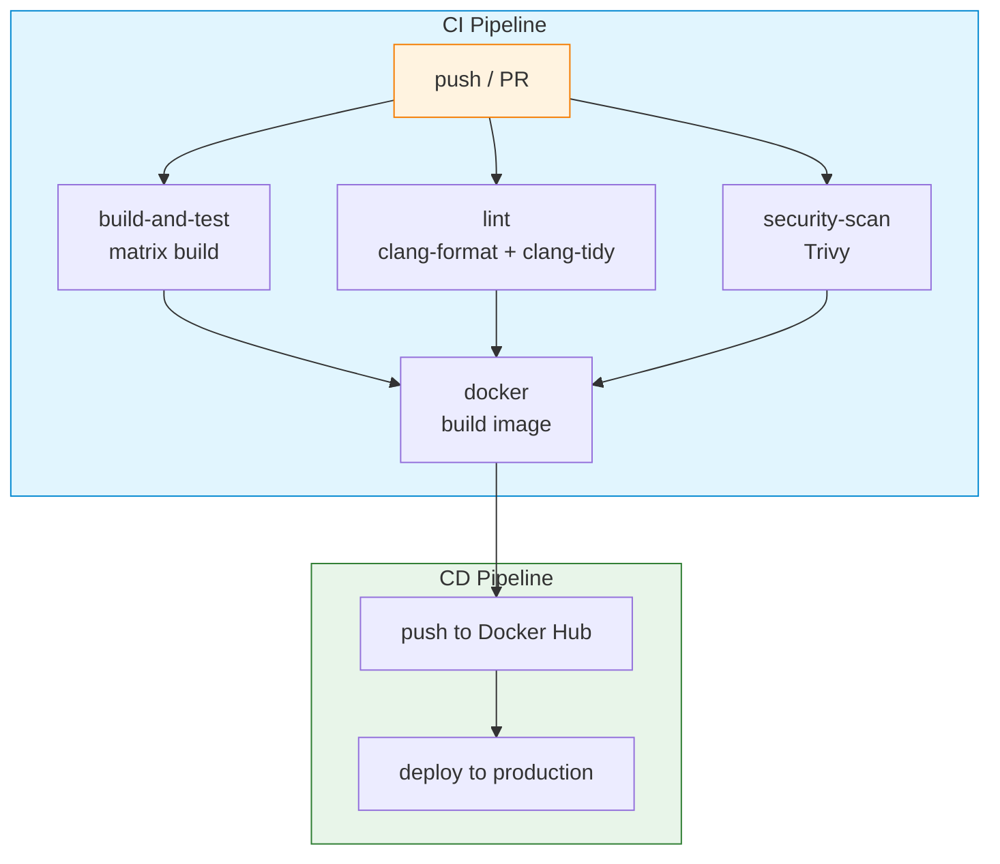
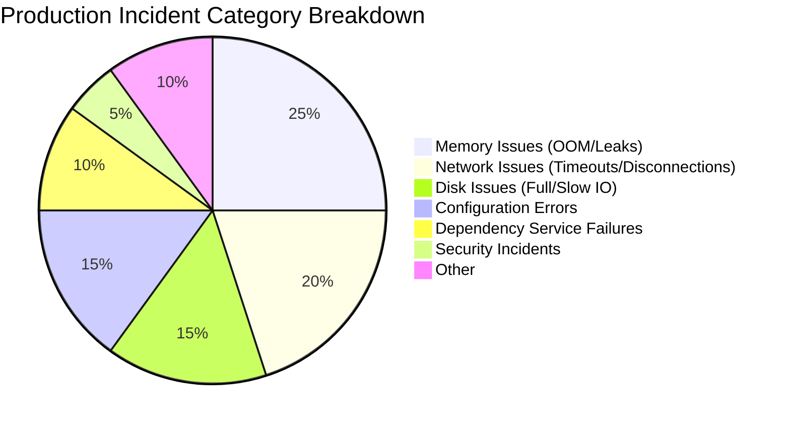

# Chapter 12: Production Deployment

> **"Code that runs on your laptop 鈮?code that runs in production."**

## Prerequisites

This chapter assumes familiarity with the following concepts. Review these shared documents before proceeding:

> 馃搸 **Reference**: [Docker Containerization](../prerequisites/02_Docker瀹瑰櫒鍖朹en.md) 鈥?Docker fundamentals, images, containers, Dockerfile basics
> 馃搸 **Reference**: [Testing Framework](../prerequisites/04_娴嬭瘯妗嗘灦_en.md) 鈥?Google Test and testing fundamentals
> 馃搸 **Reference**: [Build Environment Configuration](../prerequisites/01_鏋勫缓鐜閰嶇疆_en.md) 鈥?Build tools and compiler setup

---

## Table of Contents

1. [Docker: Containerization Basics](#1-docker-containerization-basics)
2. [Dockerfile and Multi-Stage Builds](#2-dockerfile-and-multi-stage-builds)
3. [docker-compose Orchestration](#3-docker-compose-orchestration)
4. [CI/CD: From Manual Deployment to GitHub Actions](#4-cicd-from-manual-deployment-to-github-actions)
5. [Performance Benchmarking](#5-performance-benchmarking)
6. [Monitoring and Observability](#6-monitoring-and-observability)
7. [Structured Logging](#7-structured-logging)
8. [Security Hardening](#8-security-hardening)
9. [Resource Limits](#9-resource-limiting)
10. [Discussion Questions](#10-discussion-questions)
11. [Hands-On Exercises](#11-hands-on-exercises)

---

## 1. Docker: Containerization Basics

> 馃搸 **Reference**: For Docker fundamentals (images, containers, namespaces, cgroups, common commands), see [Docker Containerization](../prerequisites/02_Docker瀹瑰櫒鍖朹en.md).

### 1.1 Why Containers Are Needed

Suppose you compiled DeepVector on your laptop with `g++-12` and it runs fine. Then you copy it to a server鈥攖he server has `g++-11`, the linked library versions don't match, and it crashes. Docker solves this by packaging your code and everything it needs into a standardized unit called a container, which runs identically on any machine with Docker installed.

### 1.2 DeepVector-Specific Container Concepts

| Concept | DeepVector Application |
|---------|-------------------|
| **Namespace** | Isolates DeepVector's process, network, and filesystem from other services |
| **Cgroup** | Limits DeepVector's memory (e.g., 2GB) and CPU (e.g., 2 cores) |
| **Layer caching** | CMakeLists.txt copied before source code to maximize cache hits |

### 1.3 Common Docker Commands for DeepVector

```bash
# Build an image
docker build -t lumendb:latest .

# Run with resource limits
docker run -d --name lumendb --memory 2g --cpus 2 -p 8080:8080 lumendb:latest

# View logs
docker logs -f lumendb

# Enter container for debugging
docker exec -it lumendb /bin/bash
```

---

## 2. Dockerfile and Multi-Stage Builds

> 馃搸 **Reference**: For Dockerfile fundamentals and multi-stage build concepts, see [Docker Containerization](../prerequisites/02_Docker瀹瑰櫒鍖朹en.md).

### 2.1 DeepVector Multi-Stage Dockerfile

```mermaid
flowchart LR
    subgraph Stage1["Stage 1: Build Stage"]
        A[ubuntu:22.04] --> B[g++-12 + cmake]
        B --> C[CMakeLists.txt]
        C --> D[make -j$(nproc)]
        D --> E[lumendb binary]
    end

    subgraph Stage2["Stage 2: Runtime Stage"]
        F[ubuntu:22.04 slim] --> G[libstdc++]
        G --> H[COPY --from=builder]
        H --> I[Final image ~80MB]
    end

    E --> H

    style Stage1 fill:#e1f5fe,stroke:#0288d1
    style Stage2 fill:#e8f5e9,stroke:#2e7d32
```

### 2.2 Complete Dockerfile

```dockerfile
# ============================================================
# Stage 1: Build Stage
# ============================================================
# FROM specifies the base image, AS names this stage
FROM ubuntu:22.04 AS builder

ENV DEBIAN_FRONTEND=noninteractive

# RUN executes commands, each RUN generates a new layer
# --no-install-recommends avoids installing unnecessary recommended packages
# Clean up apt cache at the end to reduce layer size
RUN apt-get update && apt-get install -y --no-install-recommends \
    build-essential \
    g++-12 \
    cmake \
    git \
    libssl-dev \
    && rm -rf /var/lib/apt/lists/*

# Key: COPY dependency description files first (CMakeLists.txt)
# Then COPY source code. This way if only source changes, Docker reuses the
# cached layer from downloading dependencies, no need to re-run cmake downloads
COPY CMakeLists.txt /app/
COPY cmake/ /app/cmake/

WORKDIR /app

# Build: -j$(nproc) uses all CPU cores for parallel compilation
RUN cmake -B build -DCMAKE_BUILD_TYPE=Release \
    && cmake --build build --target lumendb -j$(nproc)

# ============================================================
# Stage 2: Runtime Stage (Minimal Image)
# ============================================================
FROM ubuntu:22.04

RUN apt-get update && apt-get install -y --no-install-recommends \
    libstdc++ \
    ca-certificates \
    && rm -rf /var/lib/apt/lists/*

# Create non-root user鈥攕ecurity best practice
# If running as root, the process inside the container has root privileges,
# and if compromised, the attacker could escape to the host
RUN useradd --create-home --shell /bin/bash lumendb
USER lumendb

# Copy build artifacts from builder stage
COPY --from=builder /app/build/lumendb /usr/local/bin/lumendb
COPY --from=builder /app/build/liblumen.so /usr/local/lib/
COPY deepvector.json /etc/lumendb/config.json

EXPOSE 8080

# Health check: Docker executes every 30 seconds
# If 3 consecutive failures, container is marked unhealthy
HEALTHCHECK --interval=30s --timeout=3s --retries=3 \
    CMD curl -f http://localhost:8080/health || exit 1

ENTRYPOINT ["/usr/local/bin/lumendb"]
CMD ["--config", "/etc/lumendb/config.json"]
```

### 2.2 Dockerfile Layer Caching for DeepVector

**Key optimization**: COPY `CMakeLists.txt` first, then COPY `src/`. Source code changes daily, but `CMakeLists.txt` rarely changes. If reversed, every line of code change would require re-downloading all dependencies.

```
COPY CMakeLists.txt /app/     鈫?Layer 1: cache valid (file unchanged)
COPY cmake/ /app/cmake/       鈫?Layer 2: cache valid
RUN cmake ...                 鈫?Layer 3: cache valid (build config unchanged)
COPY src/ /app/src/           鈫?Layer 4: cache invalidated (source changed)
RUN cmake --build ...         鈫?Layer 5: must rebuild (upstream invalidated)
```

### 2.3 .dockerignore

Similar to `.gitignore`, tells Docker to **exclude** certain files during build:

```
build/
.git/
*.o
*.a
CMakeCache.txt
.clangd/
node_modules/
```

### 2.5 Alpine: Saves ~5MB

```dockerfile
FROM alpine:3.18 AS builder
RUN apk add --no-cache build-base cmake git
# ... compile ...

FROM alpine:3.18
RUN apk add --no-cache libstdc++ curl
COPY --from=builder /app/build/lumendb /usr/local/bin/
USER lumendb
ENTRYPOINT ["/usr/local/bin/lumendb"]
```

**Note:** Alpine uses **musl libc** (not glibc). Most C++ programs compile linking against glibc, and may crash on Alpine due to libc incompatibility. If your library depends on glibc-specific functions (like certain internal behaviors of `__libc_start_main`), use `ubuntu:22.04`'s `slim` variant instead of Alpine.

### 2.6 Image Size Comparison

```bash
docker images lumendb

# Expected comparison:
# Single-stage + ubuntu:22.04:       500MB-1.5GB
# Multi-stage + ubuntu:22.04:        ~80MB
# Multi-stage + Alpine:              ~30MB (if compatible)
```

---

## 3. docker-compose Orchestration

### 3.1 What Is docker-compose

When your system consists of multiple containers (e.g., DeepVector + Prometheus monitoring + Grafana dashboard), managing each `docker run` command manually is painful.

**docker-compose** is a declarative multi-container orchestration tool: you describe all services and their relationships in a `docker-compose.yml` file, then start the entire system with a single command.

| Term | Definition |
|------|-----------|
| **docker-compose** | Docker's official multi-container orchestration tool. Now more commonly written as `docker compose` (V2, as a Docker CLI plugin) |
| **Service** | A container template defined in the compose file. Can specify image, ports, environment variables, resource limits, etc. |
| **Orchestration** | The automated management of multiple containers' startup, shutdown, restart, networking, and storage |
| **Rolling Update** | Replacing old-version containers with new ones one by one, rather than stopping all containers simultaneously. Ensures zero downtime |
| **depends_on** | Declares service startup order. But note: `depends_on` only guarantees container startup order, **not service readiness**鈥攏eeds health checks to work properly |

### 3.2 docker-compose.yml

```yaml
version: "3.8"

services:
  lumendb:
    build:
      context: .
      dockerfile: Dockerfile
    image: lumendb:latest
    container_name: lumendb
    ports:
      - "8080:8080"                        # host port:container port
    volumes:
      - lumendb_data:/var/lib/lumendb      # Named volume, persistent data
      - ./deepvector.json:/etc/lumendb/config.json:ro  # :ro read-only mount
    environment:
      - DEEPVECTOR_LOG_LEVEL=info
      - DEEPVECTOR_MAX_MEMORY=2GB
    command: ["--config", "/etc/lumendb/config.json"]
    restart: unless-stopped                # Auto-restart on crash
    healthcheck:
      test: ["CMD", "curl", "-f", "http://localhost:8080/health"]
      interval: 30s
      timeout: 3s
      retries: 3
      start_period: 10s                   # 10-second buffer after startup
    deploy:
      resources:
        limits:
          memory: 2G                       # cgroup hard memory limit
          cpus: "2"                        # cgroup CPU limit
        reservations:
          memory: 512M                     # Guaranteed reservation
    logging:
      driver: "json-file"
      options:
        max-size: "10m"                    # Max 10MB per file
        max-file: "3"                      # Keep max 3 files

  prometheus:
    image: prom/prometheus:latest
    ports:
      - "9090:9090"
    volumes:
      - ./prometheus.yml:/etc/prometheus/prometheus.yml:ro
      - prometheus_data:/prometheus
    depends_on:
      lumendb:
        condition: service_healthy        # Wait for lumendb to be healthy

  grafana:
    image: grafana/grafana:latest
    ports:
      - "3000:3000"
    volumes:
      - grafana_data:/var/lib/grafana
    environment:
      - GF_SECURITY_ADMIN_PASSWORD=admin
    depends_on:
      - prometheus

volumes:
  lumendb_data:
    driver: local
  prometheus_data:
    driver: local
  grafana_data:
    driver: local
```

### 3.3 Quick Start

```bash
# Build and start all services (foreground, view logs)
docker compose up --build

# Background (production mode)
docker compose up -d

# View all service status
docker compose ps

# View specific service logs
docker compose logs -f lumendb

# Rolling update lumendb (zero downtime)
docker compose up -d --no-deps --build lumendb

# Scale up (if service is stateless)
docker compose up -d --scale lumendb=3

# Stop all services
docker compose down

# Stop and delete volumes (鈿狅笍 data will be lost!)
docker compose down -v
```

### 3.4 Volume vs Bind Mount

| Type | Syntax | Characteristics |
|------|--------|----------------|
| **Named Volume** | `- lumendb_data:/var/lib/lumendb` | Docker-managed, cross-platform, good performance |
| **Bind Mount** | `- ./config.json:/app/config.json` | Directly maps host path, suitable for hot-reloading config during development |

Production **strongly recommends Named Volumes**: they're Docker-managed, not dependent on host directory structure.

---

## 4. CI/CD: From Manual Deployment to GitHub Actions

### 4.1 What Is CI/CD

| Term | Definition |
|------|-----------|
| **CI (Continuous Integration)** | Developers frequently merge code to the main branch, with each merge automatically triggering builds and tests to catch problems early |
| **CD (Continuous Delivery/Deployment)** | After CI passes, automatically package, test, and deploy code to production |
| **Pipeline / Workflow** | A series of steps executed sequentially or in parallel: compile 鈫?test 鈫?static analysis 鈫?build image 鈫?deploy |
| **Trigger** | What event starts the pipeline: push to main, PR submission, scheduled trigger, etc. |

### 4.2 CI/CD Historical Evolution

```
Before 2000s:
  Developers manually compile, test, deploy on servers
  鈫?"It works on my machine" became the classic excuse

2005: CruiseControl (one of the earliest CI tools)

2011: Jenkins (open-source CI server)
  鈫?Required setting up your own server, maintaining plugins
  鈫?Complex configuration, outdated interface

2012: Travis CI (SaaS CI, GitHub integration)
  鈫?Declare pipeline in .travis.yml
  鈫?No server maintenance needed

2019: GitHub Actions
  鈫?Directly integrated into GitHub
  鈫?Define workflows in YAML
  鈫?Marketplace has many ready-made actions
  鈫?2000 minutes free per month
  鈫?Now the standard CI/CD solution in the GitHub ecosystem
```

### 4.3 Key Terms

| Term | Definition |
|------|-----------|
| **YAML** | A human-readable data serialization format using indentation to represent hierarchy. Widely used for configuration files (docker-compose.yml, k8s manifests, GitHub Actions workflows) |
| **Workflow** | An automation process in GitHub Actions, defined in a YAML file under the `.github/workflows/` directory |
| **Job** | A task group within a workflow. Multiple jobs can run in parallel or serially |
| **Step** | A single step within a job, can be running a shell command or calling an action |
| **Action** | A reusable step unit. For example, `actions/checkout@v4` is an action responsible for pulling code |
| **Matrix Build** | Running tests simultaneously across multiple OS/compiler version/configurations, defining combinations of multiple dimensions in one job |
| **Artifact** | Files produced during the pipeline (compiled results, test reports, Docker images, etc.), can be passed between jobs or downloaded |
| **Secret** | Sensitive information (API keys, passwords, tokens), stored in GitHub Settings, referenced via `${{ secrets.XXX }}` in workflows, never leaked to logs |
| **Cache** | Caching build artifacts, dependencies, etc., avoiding re-downloading/re-compiling from scratch every build, significantly speeding up CI |
| **Deployment** | The process of pushing built artifacts to production. Can be pushing to a container registry, pushing to a server, or updating a k8s cluster |
| **Rollback** | When a new version has problems, quickly reverting to the previous stable version. Docker's tag mechanism (`latest` + SHA tags) supports quick rollback |

### 4.4 Complete GitHub Actions Pipeline



```yaml
# .github/workflows/ci.yml
name: DeepVector CI/CD

on:
  push:
    branches: [main, develop]
  pull_request:
    branches: [main]

env:
  BUILD_TYPE: Release
  DOCKER_IMAGE: lumendb

jobs:
  # ============================================================
  # Job 1: Build & Test (Matrix Build)
  # ============================================================
  build-and-test:
    name: Build ${{ matrix.os }} gcc-${{ matrix.gcc }}
    runs-on: ${{ matrix.os }}
    strategy:
      fail-fast: true           # Cancel other combinations if one fails
      matrix:
        os: [ubuntu-22.04, ubuntu-24.04]
        gcc: [12, 13]
        exclude:                # Exclude unsupported combinations
          - os: ubuntu-22.04
            gcc: 13

    steps:
      - uses: actions/checkout@v4

      - name: Install dependencies
        run: |
          sudo apt-get update
          sudo apt-get install -y g++-${{ matrix.gcc }} cmake

      - name: Cache build
        uses: actions/cache@v3
        with:
          path: |
            build/
            ~/.ccache/
          key: ${{ runner.os }}-gcc${{ matrix.gcc }}-${{ hashFiles('CMakeLists.txt') }}
          restore-keys: ${{ runner.os }}-gcc${{ matrix.gcc }}-

      - name: Configure
        run: |
          cmake -B build -DCMAKE_BUILD_TYPE=$BUILD_TYPE \
            -DCMAKE_CXX_COMPILER=g++-${{ matrix.gcc }}

      - name: Build
        run: cmake --build build -j$(nproc)

      - name: Unit tests
        run: cd build && ctest --output-on-failure -j$(nproc)

      - name: Benchmark (sanity check)
        run: cd build && ./bench_hnsw --num-vectors 1000 --duration 5

  # ============================================================
  # Job 2: Static Analysis
  # ============================================================
  lint:
    runs-on: ubuntu-22.04
    steps:
      - uses: actions/checkout@v4

      - name: clang-format check
        run: |
          sudo apt-get install -y clang-format-16
          find . -name '*.cpp' -o -name '*.h' | xargs clang-format-16 --dry-run --Werror

      - name: clang-tidy check
        run: |
          sudo apt-get install -y clang-tidy-16
          cmake -B build -DCMAKE_EXPORT_COMPILE_COMMANDS=ON
          run-clang-tidy -p build -header-filter='.*' \
            -checks='bugprone-*,performance-*,modernize-*' \
            src/*.cpp

  # ============================================================
  # Job 3: Security Scan
  # ============================================================
  security-scan:
    runs-on: ubuntu-22.04
    steps:
      - uses: actions/checkout@v4

      - name: Run Trivy vulnerability scanner
        uses: aquasecurity/trivy-action@master
        with:
          scan-type: 'fs'
          scan-ref: '.'
          format: 'sarif'
          output: 'trivy-results.sarif'

      - name: Upload SARIF results
        uses: github/codeql-action/upload-sarif@v2
        with:
          sarif_file: 'trivy-results.sarif'

  # ============================================================
  # Job 4: Build & Push Docker Image
  # ============================================================
  docker:
    needs: [build-and-test, lint]      # Wait for first two jobs to pass
    if: github.ref == 'refs/heads/main' && github.event_name == 'push'
    runs-on: ubuntu-22.04
    steps:
      - uses: actions/checkout@v4

      - name: Set up Docker Buildx
        uses: docker/setup-buildx-action@v2

      - name: Login to Docker Hub
        uses: docker/login-action@v2
        with:
          username: ${{ secrets.DOCKER_USERNAME }}
          password: ${{ secrets.DOCKER_TOKEN }}

      - name: Build and push
        uses: docker/build-push-action@v5
        with:
          context: .
          push: true
          tags: |
            ${{ secrets.DOCKER_USERNAME }}/lumendb:latest
            ${{ secrets.DOCKER_USERNAME }}/lumendb:${{ github.sha }}
          cache-from: type=gha      # GitHub Actions cache
          cache-to: type=gha,mode=max
          platforms: linux/amd64,linux/arm64
```

### 4.5 CI Design Principles

1. **Matrix builds**: Multi-platform/multi-compiler parallel testing鈥攂uilding with GCC 12 on Ubuntu 22.04 and GCC 13 on Ubuntu 24.04 ensures cross-platform compatibility
2. **Cache everything**: Build artifacts (build/), compiler cache (ccache), Docker layer caching鈥攅very build doesn't start from scratch
3. **Fail fast**: `fail-fast: true` cancels other running combinations when one matrix combination fails, saving CI time
4. **Dependencies**: The `docker` job's `needs: [build-and-test, lint]` ensures images are only pushed after tests and code checks pass
5. **Secrets management**: Docker Hub passwords are stored in GitHub Secrets, never leaked to logs

---

## 5. Performance Benchmarking

> 馃搸 **Reference**: For Google Test fundamentals and testing patterns, see [Testing Framework](../prerequisites/04_娴嬭瘯妗嗘灦_en.md).

### 5.1 HTTP Load Testing: wrk

**wrk** is a high-performance HTTP benchmarking tool for measuring server throughput and latency.

```bash
# wrk parameter explanation:
# -t 4:  4 threads
# -c 100: 100 concurrent connections
# -d 30s: duration 30 seconds
# --latency: output detailed latency distribution
# -s post_search.lua: custom Lua script (send POST requests)

wrk -t 4 -c 100 -d 30s --latency \
    -s post_search.lua \
    http://localhost:8080/api/v1/search

# Example output:
# Running 30s test @ http://localhost:8080/api/v1/search
#   4 threads and 100 connections
#   Thread Stats   Avg      Stdev     Max   +/- Stdev
#     Latency     2.3ms    1.1ms   45.2ms   87.3%
#     Req/Sec    10.8k     1.2k    15.3k    72.0%
#   Latency Distribution
#      50%    2.1ms        鈫?P50: 50% of requests complete within this time
#      75%    2.8ms
#      90%    3.5ms        鈫?P90: 90% of requests complete within this time
#      99%    8.2ms        鈫?P99: 99% of requests complete within this time
#   1289123 requests in 30.00s, 245MB read
# Requests/sec:  42970.43   鈫?QPS: requests processed per second
```

### 5.2 C++ Internal Benchmark

```cpp
#include <chrono>
#include <vector>
#include <algorithm>
#include <numeric>
#include <iostream>

struct BenchmarkResult {
    double mean_us;     // Average latency (microseconds)
    double p50_us;      // 50th percentile latency (median)
    double p90_us;      // 90th percentile latency
    double p99_us;      // 99th percentile latency (long-tail latency)
    double ops_per_sec; // QPS (queries per second)
};

template<typename F>
BenchmarkResult benchmark(F&& fn, int warmup_iterations = 1000,
                          int iterations = 10000) {
    // ==========================================
    # WARMUP: Eliminate cold-start effects
    # ==========================================
    # On first run, CPU cache is cold,
    # branch predictor has no history, JIT/AOT may not have optimized yet.
    # Warmup lets these one-time costs complete before measurement begins.
    for (int i = 0; i < warmup_iterations; i++) {
        fn();
    }

    std::vector<double> times;
    times.reserve(iterations);

    for (int i = 0; i < iterations; i++) {
        auto start = std::chrono::high_resolution_clock::now();
        fn();
        auto end = std::chrono::high_resolution_clock::now();
        double us = std::chrono::duration<double, std::micro>(end - start).count();
        times.push_back(us);
    }

    // Sort and take percentiles
    std::sort(times.begin(), times.end());

    BenchmarkResult r;
    r.mean_us = std::accumulate(times.begin(), times.end(), 0.0) / times.size();
    r.p50_us  = times[times.size() * 50 / 100];
    r.p90_us  = times[times.size() * 90 / 100];
    r.p99_us  = times[times.size() * 99 / 100];
    r.ops_per_sec = 1e6 / r.mean_us;

    return r;
}

int main() {
    HNSWIndex index(128);
    // ... insert 10000 vectors ...

    auto result = benchmark([&]() {
        std::vector<float> query(128, 0.1f);
        auto neighbors = index.search(query.data(), 10);
    }, 1000, 10000);

    printf("Search benchmark results:\n");
    printf("  Mean:  %.1f us\n", result.mean_us);
    printf("  P50:   %.1f us\n", result.p50_us);
    printf("  P90:   %.1f us\n", result.p90_us);
    printf("  P99:   %.1f us\n", result.p99_us);
    printf("  QPS:   %.0f\n", result.ops_per_sec);

    if (result.p50_us < 500.0 && result.ops_per_sec > 10000) {
        printf("  Status: PASS\n");
    } else {
        printf("  Status: FAIL\n");
    }
}
```

### 5.3 Why Warmup and Statistical Rigor Are Needed

```
A good benchmark must:

1. Warmup
   - Discard the first N runs, eliminate cold cache effects
   - CPU L1/L2/L3 caches are finite鈥攆irst access loads from main memory, which is slow
   - Branch predictor needs to "learn" code execution paths
   - Without warmup, the first run may be 10-100x slower than subsequent runs

2. Multiple runs, take median
   - Single runs are affected by system interference (OS scheduling, interrupts, other processes preempting CPU)
   - Repeat 3-5 times and take the median to eliminate outliers

3. Statistical rigor
   - Record P50/P90/P99, not just averages
   - Averages can mask severe long-tail latency problems
   - P99 > P50 脳 10 usually indicates severe latency spikes

4. Control variables
   - Disable CPU frequency dynamic scaling: cpupower frequency-set -g performance
   - Fix CPU affinity: taskset -c 0 (pin to CPU 0)
   - Turn off unnecessary background processes
   - Fix power mode (don't use battery on laptops)

5. Prevent compiler optimization
   - Compiler may optimize away "no side effect" code
   - Use volatile or benchmark library's DoNotOptimize to prevent optimization
```

### 5.4 Key Performance Metrics Defined

| Metric | Definition | Meaning |
|--------|-----------|---------|
| **QPS (Queries Per Second)** | Queries/requests processed per second | Core metric of system throughput |
| **TPS (Transactions Per Second)** | Transactions processed per second (one transaction may contain multiple queries) | Higher-level metric than QPS |
| **Throughput** | Amount of data processed per unit time | Can be QPS, MB/s, etc. |
| **Latency** | Time from sending a request to receiving a response | User-perceived "speed" |
| **P50 (Median Latency)** | 50% of requests complete within this time | Represents "typical" user experience |
| **P95 Latency** | 95% of requests complete within this time | Represents "slower" user experience |
| **P99 Latency** | 99% of requests complete within this time | Represents "worst" user experience, long-tail latency |
| **SLI (Service Level Indicator)** | Concrete numerical measure of service quality (e.g., P99 latency, availability percentage) | Quantitative basis for SLA |
| **SLO (Service Level Objective)** | Internal target, like "P99 latency < 10ms" | Stricter than SLA鈥攍eaves margin for yourself |

---

## 6. Monitoring and Observability

### 6.1 Why Monitoring Is Needed

**"You can't improve what you can't measure."**

A system without monitoring is like a car without a dashboard鈥攜ou don't know the speed, fuel level, or engine temperature until an accident happens.

**Observability** is the ability to infer a system's internal state from its external outputs. Three pillars:

| Pillar | Tools/Methods | Question Answered |
|--------|--------------|-------------------|
| **Metrics** | Prometheus, Grafana | "How is the system doing? What's the trend?" |
| **Logs** | ELK, Loki, structured JSON | "What just happened? Why did it error?" |
| **Traces** | Jaeger, OpenTelemetry | "Which services did a request pass through? Where was it slow?" |

### 6.2 The RED Method

The **RED method** is the golden rule of microservice monitoring, proposed by Tom Wilkie (Grafana Labs co-founder), specifically for request-facing services:

| Letter | Meaning | Corresponding Metric | Example |
|--------|---------|---------------------|---------|
| **R** | **Rate** | QPS / request rate | How many search requests per second |
| **E** | **Errors** | Error rate | 5xx error ratio, 4xx client error ratio |
| **D** | **Duration** | Latency distribution | P50 / P95 / P99 latency |

RED's core idea: **for any request-facing service, monitoring just these three dimensions can quickly reveal most problems.**

| Term | Definition |
|------|-----------|
| **Prometheus** | An open-source monitoring and alerting system. It periodically pulls (pull) metrics from target services, stores them in a time-series database, and supports PromQL queries |
| **Grafana** | An open-source visualization dashboard tool. Connects to data sources like Prometheus to display metrics as charts. Can set alert rules |
| **Metrics** | A timestamped numerical value that changes over time. E.g., `lumendb_search_latency_us{quantile="0.99"} 8200` |
| **Counter** | A metric that only increases, never decreases. E.g., `http_requests_total` (total request count) |
| **Histogram** | Bins values into buckets for statistics. E.g., latency distribution: [0-1ms] has 100, [1-2ms] has 500... |
| **Gauge** | A metric that can increase or decrease. E.g., current active connection count, memory usage |
| **Alert** | Triggers a notification (email, Slack, PagerDuty) when a metric exceeds a threshold |

### 6.3 Distributed Tracing

**Distributed Tracing** is the technique of tracking a request's complete lifecycle across multiple services.

| Term | Definition |
|------|-----------|
| **Span** | A unit of work in a trace. Each span has a name, start time, end time, and status. A request consists of a tree of spans |
| **Trace** | The complete path of a request from entry to exit, consisting of multiple spans |
| **Jaeger** | Uber's open-source distributed tracing system, compatible with OpenTelemetry |
| **OpenTelemetry** | A vendor-neutral observability framework providing a unified API for collecting metrics, logs, and traces |

For monolithic applications (like early DeepVector), tracing has limited value. But when you split into microservices (like DeepVector frontend + backend + cache layer + vector engine), tracing becomes a powerful tool for locating performance bottlenecks.

### 6.4 Prometheus Endpoint Implementation

```cpp
#include <prometheus/counter.h>
#include <prometheus/exposer.h>
#include <prometheus/registry.h>

class Metrics {
    prometheus::Exposer exposer_{"8081"};  // metrics endpoint on port 8081
    std::shared_ptr<prometheus::Registry> registry_ =
        std::make_shared<prometheus::Registry>();

    prometheus::Counter* search_requests_;
    prometheus::Histogram* search_latency_us_;

public:
    Metrics() {
        search_requests_ = &prometheus::BuildCounter()
            .Name("lumendb_search_requests_total")
            .Help("Total search requests")
            .Register(*registry_);

        search_latency_us_ = &prometheus::BuildHistogram()
            .Name("lumendb_search_latency_us")
            .Help("Search latency in microseconds")
            .Register(*registry_);

        exposer_.RegisterCollectable(registry_);
    }

    void record_search(double latency_us) {
        search_requests_->Increment();
        search_latency_us_->Observe(latency_us);
    }
};
```

Prometheus pulls data from `http://lumendb:8081/metrics`, then Grafana connects to the Prometheus data source to draw charts.

### 6.5 Manual /proc Introspection

```cpp
#include <sys/resource.h>

struct ProcessMetrics {
    size_t vm_rss_kb;     // Physical memory (Resident Set Size)
    size_t vm_size_kb;    // Virtual memory
    int open_fds;         // File descriptor count
    double cpu_usage;     // CPU usage (requires two samples)
};

ProcessMetrics get_process_metrics() {
    ProcessMetrics m{};

    // Read memory info from /proc/self/status
    std::ifstream status("/proc/self/status");
    std::string line;
    while (std::getline(status, line)) {
        if (line.starts_with("VmRSS:"))
            m.vm_rss_kb = std::stoi(line.substr(6));
        if (line.starts_with("VmSize:"))
            m.vm_size_kb = std::stoi(line.substr(7));
    }

    // Count file descriptors under /proc/self/fd
    m.open_fds = 0;
    for (auto& entry : std::filesystem::directory_iterator("/proc/self/fd")) {
        m.open_fds++;
    }

    return m;
}
```

### 6.6 Monitoring Metrics System

| Category | Metric | Collection Method | Alert Threshold |
|----------|--------|-------------------|----------------|
| QPS (Rate) | requests/sec | In-memory counter + per-second reporting | < 50% of expected |
| Latency (Duration) | P50, P90, P99 | Histogram | P99 > SLA 脳 2 |
| Errors (Errors) | 4xx, 5xx error rate | Counter | Error rate > 1% |
| Resources | RSS, CPU%, fd count | /proc/self/ read | RSS > 80% of limit |
| Connections | Active connection count | accept/close counting | > 10000 |
| Index | Vector count, index size | Periodic snapshots | Disk > 80% |

### 6.7 Health Check Details

| Term | Definition |
|------|-----------|
| **Health Check** | A mechanism that periodically probes whether a service is running normally. Docker/Kubernetes decides whether to restart containers based on health check results |
| **Readiness Probe** | Tells the load balancer: "Am I ready to receive traffic?" If the readiness probe fails, the load balancer routes traffic away from this instance, but doesn't restart it |
| **Liveness Probe** | Tells the orchestrator: "Am I alive?" If the liveness probe fails, the container is restarted (assuming the process is deadlocked but hasn't exited) |
| **Load Balancer** | A component that distributes traffic to multiple backend instances. Can be hardware (F5), software (nginx, HAProxy), or cloud service (AWS ELB) |
| **start_period** | A buffer period after container startup. Health check failures during this period don't count toward retries, giving the application time to initialize |

```yaml
healthcheck:
  test: ["CMD", "curl", "-f", "http://localhost:8080/health"]
  interval: 30s       # Check every 30 seconds
  timeout: 3s         # Timeout per check: 3 seconds
  retries: 3          # 3 consecutive failures 鈫?unhealthy
  start_period: 10s   # Failures within 10 seconds of startup don't count
```

**Readiness vs Liveness differences:**

```
Scenario 1: Database is rebuilding index (temporarily cannot handle queries)
  鈫?Readiness Probe fails (doesn't receive new requests)
  鈫?Liveness Probe passes (process is still alive, shouldn't restart)

Scenario 2: Process deadlocked, can't respond to any requests
  鈫?Liveness Probe fails
  鈫?Container is restarted
```

### 6.8 Traffic Control

| Term | Definition |
|------|-----------|
| **Rate Limiting** | Restricts the number of client requests per unit time. Prevents traffic spikes from overwhelming the system. Common algorithms: Token Bucket, Sliding Window |
| **Circuit Breaker** | When a downstream service fails consecutively, temporarily stops calling it ("opens the circuit"), then tries to recover after a while. Prevents cascading failures |
| **Backoff** | After failure, waits before retrying, with progressively increasing wait times (exponential backoff). Prevents retry storms |
| **Degradation** | When system load is high, proactively disables non-core features (like recommendations, sorting), keeping only core features to ensure availability |

---

## 7. Structured Logging

### 7.1 Why Structured Logging Is Needed

Traditional logging:
```
[2024-01-15 14:30:02] User 42 searched 10 results, took 2.3ms
```

The problem: hard to parse and analyze. If you want to query "all searches taking > 10ms," you can only match line by line with regex.

Structured logging (JSON format):
```json
{
  "ts": "2024-01-15T14:30:02.123Z",
  "level": "info",
  "msg": "search completed",
  "user_id": "42",
  "top_k": 10,
  "latency_ms": 2.3,
  "result_count": 8,
  "req_id": "a1b2c3d4"
}
```

Can be directly imported into **Elasticsearch** (full-text search engine) / **Loki** (Grafana's log aggregation system) / **ClickHouse** (columnar OLAP database) for aggregation queries, alerts, and dashboards.

### 7.2 Lightweight Implementation

```cpp
#include <chrono>
#include <sstream>
#include <iomanip>
#include <iostream>

enum class LogLevel { DEBUG, INFO, WARN, ERROR };

class Logger {
    std::ostream& out_;
    LogLevel min_level_;

public:
    Logger(std::ostream& out = std::cerr, LogLevel level = LogLevel::INFO)
        : out_(out), min_level_(level) {}

    class LogEntry {
        std::ostream& out_;
        bool active_;
        std::ostringstream json_;
        bool first_field_ = true;

    public:
        LogEntry(std::ostream& out, bool active)
            : out_(out), active_(active) {}

        ~LogEntry() {
            if (active_) out_ << json_.str() /* << "}" */ << std::endl;
        }

        template<typename T>
        LogEntry& field(const std::string& key, const T& value) {
            if (!active_) return *this;
            if (!first_field_) json_ << ", ";
            first_field_ = false;
            json_ << "\"" << key << "\": ";
            write_value(value);
            return *this;
        }

    private:
        void write_value(const std::string& v) { json_ << "\"" << v << "\""; }
        void write_value(int v) { json_ << v; }
        void write_value(double v) { json_ << std::fixed << v; }
        void write_value(const char* v) { json_ << "\"" << v << "\""; }
    };

    LogEntry log(LogLevel level, const std::string& message) {
        if (level < min_level_) return LogEntry(out_, false);

        auto now = std::chrono::system_clock::now();
        auto time_t = std::chrono::system_clock::to_time_t(now);
        auto ms = std::chrono::duration_cast<std::chrono::milliseconds>(
            now.time_since_epoch()) % 1000;

        LogEntry entry(out_, true);
        entry.field("ts", format_time(time_t, ms.count()))
             .field("level", level_to_string(level))
             .field("msg", message);
        return entry;
    }

private:
    static const char* level_to_string(LogLevel l) {
        switch (l) {
            case LogLevel::DEBUG: return "debug";
            case LogLevel::INFO:  return "info";
            case LogLevel::WARN:  return "warn";
            case LogLevel::ERROR: return "error";
        }
        return "unknown";
    }

    static std::string format_time(time_t t, int ms) {
        std::ostringstream ss;
        ss << std::put_time(std::gmtime(&t), "%FT%T")
           << "." << std::setfill('0') << std::setw(3) << ms << "Z";
        return ss.str();
    }
};

// Usage
Logger g_logger;

void handle_search(const std::string& req_id, const std::vector<float>& query) {
    auto start = std::chrono::steady_clock::now();

    auto results = index.search(query, 10);

    auto elapsed = std::chrono::duration<double, std::milli>(
        std::chrono::steady_clock::now() - start).count();

    g_logger.log(LogLevel::INFO, "search completed")
        .field("req_id", req_id)
        .field("latency_ms", elapsed)
        .field("result_count", (int)results.size())
        .field("query_dim", (int)query.size());
}
```

### 7.3 Global Request ID

```cpp
// Use thread_local to pass request_id
thread_local std::string t_request_id;

// Set when receiving a request
t_request_id = generate_uuid();

// Use macro to simplify
#define LOG_INFO(msg) \
    g_logger.log(LogLevel::INFO, msg).field("req_id", t_request_id)

// Usage
LOG_INFO("search completed")
    .field("latency_ms", elapsed)
    .field("result_count", (int)results.size());
```

**Purpose of Request ID:** In microservice architecture, a user request may pass through multiple services. By passing the same Request ID between services, you can trace the complete call chain in logs, quickly locating which service has the problem.

### 7.4 Structured Logs vs Binary Logs

| Dimension | JSON Structured Logs | Binary Logs (e.g., Protocol Buffers) |
|-----------|---------------------|--------------------------------------|
| Readability | Human-readable, direct grep | Requires specialized tools to parse |
| Performance | High serialization/deserialization overhead | Efficient, suitable for high-throughput scenarios |
| Flexibility | Adding fields doesn't require schema changes | Requires recompiling proto files |
| Ecosystem | Natively supported by nearly all log systems | Requires additional collection pipelines |
| Suitable for | Small-to-medium scale, developer-friendly | High-throughput, low-latency requirements |

---

## 8. Security Hardening

### 8.1 TLS Termination

**TLS (Transport Layer Security)** is the underlying protocol for HTTPS, encrypting communication between client and server.

**Option 1: Reverse Proxy (recommended for production)**

Use nginx to terminate TLS outside the container, use HTTP for internal communication:

```nginx
server {
    listen 443 ssl;
    server_name deepvector.example.com;

    ssl_certificate     /etc/letsencrypt/live/deepvector.example.com/fullchain.pem;
    ssl_certificate_key /etc/letsencrypt/live/deepvector.example.com/privkey.pem;

    location / {
        proxy_pass http://localhost:8080;
        proxy_set_header X-Forwarded-For $remote_addr;
    }
}
```

**Option 2: Embedded OpenSSL in C++ (for development/intranet)**

```cpp
#include <openssl/ssl.h>
#include <openssl/err.h>

class TlsServer {
    SSL_CTX* ctx_;

public:
    TlsServer(const char* cert_file, const char* key_file) {
        SSL_library_init();
        ctx_ = SSL_CTX_new(TLS_server_method());
        SSL_CTX_use_certificate_file(ctx_, cert_file, SSL_FILETYPE_PEM);
        SSL_CTX_use_PrivateKey_file(ctx_, key_file, SSL_FILETYPE_PEM);
    }

    void accept_tls(int client_fd) {
        SSL* ssl = SSL_new(ctx_);
        SSL_set_fd(ssl, client_fd);
        SSL_accept(ssl);
        // After this, use SSL_read / SSL_write instead of recv / send
    }
};
```

**mTLS (mutual TLS):** Bidirectional TLS authentication. Not only does the client verify the server's identity, the server also verifies the client's identity. Suitable for inter-service communication (like internal calls between microservices), ensuring only authorized services can access.

### 8.2 Input Validation

```cpp
// Reject oversized payloads
if (content_length > 10 * 1024 * 1024) {  // 10MB limit
    return HttpResponse(413, "Payload too large");
}

// Validate vector dimension
if (vector.size() != expected_dim) {
    return HttpResponse(422, "Dimension mismatch");
}

// Validate top_k range
if (top_k < 1 || top_k > 1000) {
    return HttpResponse(400, "top_k must be in [1, 1000]");
}

// Check for NaN / Inf
for (float v : vector) {
    if (std::isnan(v) || std::isinf(v)) {
        return HttpResponse(400, "Vector contains NaN or Inf");
    }
}
```

### 8.3 Dependency Vulnerability Scanning

```bash
# Trivy scans Docker images for known vulnerabilities
trivy image lumendb:latest

# Scan filesystem for dependency vulnerabilities
trivy fs .

# Integrate in CI (see Section 4.4 GitHub Actions)
```

---

## 9. Resource Limits

### 9.1 Docker Resource Control (cgroup)

```yaml
# docker-compose approach
deploy:
  resources:
    limits:
      memory: 2G     # Hard limit, exceeded 鈫?OOM kill (kernel forcibly kills process)
      cpus: "2"      # Maximum use of 2 CPU cores' time
    reservations:
      memory: 512M   # Soft reservation: system guarantees at least 512MB

# docker run approach
docker run --memory 2g --memory-swap 2g --cpus 2 lumendb
```

**OOM Killer:** When a process uses memory exceeding the cgroup limit, the Linux kernel's OOM (Out-Of-Memory) killer forcibly kills the process. `docker inspect` can view container OOM kill records.

### 9.2 Program Self-Limiting

```cpp
#include <sys/resource.h>

void apply_resource_limits() {
    struct rlimit rl;

    // Limit virtual memory: 2GB
    rl.rlim_cur = 2ULL * 1024 * 1024 * 1024;
    rl.rlim_max = 2ULL * 1024 * 1024 * 1024;
    setrlimit(RLIMIT_AS, &rl);

    // Limit file descriptors: 10000
    rl.rlim_cur = 10000;
    rl.rlim_max = 10000;
    setrlimit(RLIMIT_NOFILE, &rl);

    // Limit core dump size: 0 (prevent core file generation, save disk)
    rl.rlim_cur = 0;
    rl.rlim_max = 0;
    setrlimit(RLIMIT_CORE, &rl);
}
```

### 9.3 cgroups v2 Direct Control

```bash
# Create cgroup
sudo mkdir -p /sys/fs/cgroup/lumendb

# Memory limit: 2GB
echo 2147483648 > /sys/fs/cgroup/lumendb/memory.max

# CPU limit: 2 cores (200000 = 2 脳 100000)
echo "200000 100000" > /sys/fs/cgroup/lumendb/cpu.max

# Add process to cgroup
echo $PID > /sys/fs/cgroup/lumendb/cgroup.procs
```

**Three-layer protection:** Docker limits (container level) + cgroups (kernel level) + rlimit (process level). If one layer is breached, there's another layer as backup.

### 9.4 Memory Planning

```
Total memory = Index storage + Vector storage + OS overhead + Buffer pool + Headroom

Example: 1 million vectors 脳 768 dimensions 脳 4 bytes = 3GB (vector data)
         HNSW graph (M=16): Each node stores up to M neighbor IDs (8 bytes each) plus
           bidirectional links: total 鈮?2 脳 M 脳 N 脳 8 bytes
           = 2 脳 16 脳 1,000,000 脳 8 = 256MB (graph structure)
         mmap cache: 1GB (OS page cache)
         Total: ~4.5GB, plan for 6-7GB

Headroom rule of thumb: 20-30% of total working memory
Reason: traffic spikes, GC (if any), temporary allocations, OS overhead
```



---

## 10. Discussion Questions

1. In multi-stage Docker builds, why must `COPY CMakeLists.txt` come before `COPY src/`? How does this relate to Docker **layer caching**?

2. In CI **matrix builds**, why is `key: ${{ hashFiles('CMakeLists.txt') }}` safe for cache reuse? In what cases might it incorrectly match? (Hint: think about version changes in system packages installed by `RUN apt-get install`)

3. P99 latency is much higher than P50 (e.g., P50=1ms, P99=50ms)鈥攚hat could be the cause? How to locate it? (Hint: think about **tail latency**, **GC pauses**, **lock contention**, **network jitter**)

4. If structured logs are one JSON per line, how do they differ from binary logs (e.g., Protocol Buffers)? What scenarios is each suitable for?

5. If a reverse proxy terminates TLS and the backend communicates via HTTP, is this secure within the container network? When is **mTLS** needed?

6. **OOM**: How does cgroup's OOM killer differ from the Linux kernel's OOM killer? How to ensure the expected process is killed? (Hint: `oom_score_adj`)

7. Design a **rolling update** strategy: how to ensure no request loss during updates? What state needs to be considered (connections, index, configuration)?

8. In monitoring, QPS suddenly drops to 0 but the process is still running鈥攚hat's the most likely cause? Write troubleshooting steps. (Hint: check port listening, check load balancer health checks, check DNS)

9. What are the three states of a **circuit breaker**? Draw the state transition diagram.

10. Why should **SLO** be stricter than **SLA**? (Hint: leave margin for yourself)

---

## 11. Hands-On Exercises

### Exercise 1: Dockerfile (20 min)

Write a multi-stage Dockerfile for DeepVector:

- Stage 1: `gcc-12` compile Release version
- Stage 2: `ubuntu:22.04` slim runtime
- Verify image size < 150MB
- Add `HEALTHCHECK` instruction
- Create non-root user to run

### Exercise 2: docker-compose Deployment (15 min)

Write `docker-compose.yml` containing:

- `lumendb` service (limited to 2GB memory, 2 CPU)
- Persistent volume
- Log rotation (max-size: 10m, max-file: 3)
- Health check + start_period
- One-click `docker compose up` to start

### Exercise 3: Performance Benchmark (25 min)

Add benchmark functionality to the Chapter 03 HNSW implementation:

- Use 10000 random 128-dimensional vectors
- **Warm up 1000 times**, then measure 10000 times
- Measure search P50/P90/P99 latency
- Measure QPS
- Output benchmark report in Markdown format
- Repeat 3 times, take median

### Exercise 4: Structured Logging (15 min)

Implement the structured Logger from Section 7, logging on critical paths (insert, search, delete). Each log entry should include:

- Timestamp (ISO 8601)
- Level
- Request ID (`thread_local`)
- Operation duration
- Operation parameters

### Exercise 5: CI Pipeline (Optional, 30 min)

Create `.github/workflows/ci.yml` for a GitHub repository:

- Matrix build: ubuntu-22.04 + ubuntu-24.04
- clang-format / clang-tidy checks
- Unit tests + benchmarks
- Docker image build and push

### Exercise 6: Stress Testing (Optional, 20 min)

Use `wrk` or custom scripts to stress test your vector database:

- Find maximum QPS (increase concurrency until latency starts growing exponentially)
- Find memory leaks (run for 30 minutes, observe if RSS continuously grows)
- Plot QPS vs latency curve (find the inflection point鈥?*knee point**)

---

## Chapter Summary

| Domain | Key Practice | Core Concept |
|--------|-------------|--------------|
| **Docker** | Multi-stage build 鈫?image reduced from 500MB-1.5GB to 80MB | Container = namespace + cgroup (not VM); layer caching speeds up builds |
| **Orchestration** | docker-compose one-click start/stop + health check + log rotation | Volume persistence, Readiness/Liveness Probe differences |
| **CI/CD** | GitHub Actions matrix build + caching + Docker push | From Jenkins manual deployment to GitHub Actions automated pipeline |
| **Benchmarking** | wrk (HTTP) + custom C++ benchmark (P50/P90/P99) | Warmup eliminates cold cache, statistical rigor, RED method |
| **Monitoring** | Prometheus metrics endpoint + /proc introspection | RED method (Rate/Errors/Duration), SLI/SLO/SLA |
| **Logging** | JSON structured + request ID end-to-end tracing | Distributed tracing, span, Jaeger, OpenTelemetry |
| **Security** | TLS (nginx reverse proxy) + input validation + dependency scanning | mTLS, rate limiting, circuit breaker |
| **Resources** | Docker limits + cgroups + rlimit multi-layer protection | OOM killer, memory planning, headroom |

> **Remember:** Production is not a "scaled-up" version of development. It requires a different mindset鈥攎onitoring, alerting, degradation, rollback, SLA... these are what let you sleep soundly at 3 AM when you get paged.
>
> Next chapter: [Chapter 13: The Capstone 鈥?Build Your Own Vector Database](../ch13_capstone/README.md)
