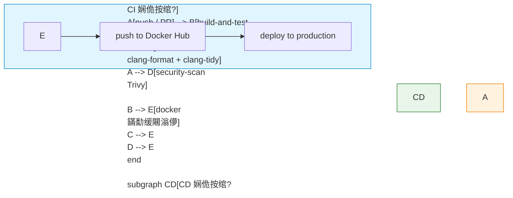
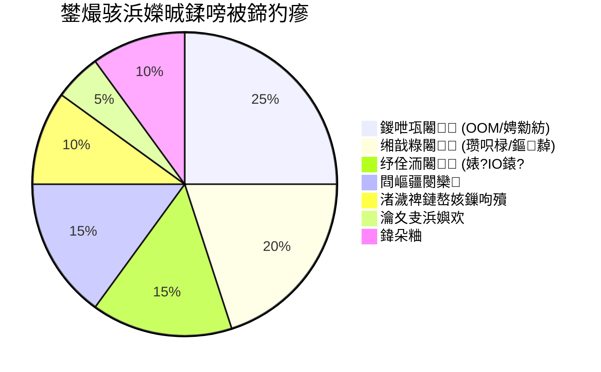

# 绗?12 绔狅細鐢熶骇閮ㄧ讲

> **"浠ｇ爜鑳借窇鍦ㄤ綘鐨勭瑪璁版湰涓?鈮?浠ｇ爜鑳藉湪鐢熶骇鐜杩愯銆?**

---

## 鍓嶇疆鐭ヨ瘑

> 馃搸 **鍙傝€?*: [Docker瀹瑰櫒鍖朷(../prerequisites/02_Docker瀹瑰櫒鍖?md) 鈥?Docker 瀹瑰櫒鍩虹銆侀暅鍍忔瀯寤轰笌 docker-compose
> 馃搸 **鍙傝€?*: [娴嬭瘯妗嗘灦](../prerequisites/04_娴嬭瘯妗嗘灦.md) 鈥?鍗曞厓娴嬭瘯涓庡熀鍑嗘祴璇曟柟娉?> 馃搸 **鍙傝€?*: [鏋勫缓鐜閰嶇疆](../prerequisites/01_鏋勫缓鐜閰嶇疆.md) 鈥?CMake 鏋勫缓涓?CI/CD 鍩虹

---

## 鐩綍

1. [Dockerfile 涓庡闃舵鏋勫缓](#1-dockerfile-涓庡闃舵鏋勫缓)
2. [docker-compose 缂栨帓](#2-docker-compose-缂栨帓)
3. [CI/CD锛欸itHub Actions](#3-cicdgithub-actions)
4. [鎬ц兘鍩哄噯娴嬭瘯](#4-鎬ц兘鍩哄噯娴嬭瘯)
5. [鐩戞帶涓庡彲瑙傛祴鎬(#5-鐩戞帶涓庡彲瑙傛祴鎬?
6. [缁撴瀯鍖栨棩蹇梋(#6-缁撴瀯鍖栨棩蹇?
7. [瀹夊叏鍔犲浐](#7-瀹夊叏鍔犲浐)
8. [璧勬簮闄愬埗](#8-璧勬簮闄愬埗)
9. [鎬濊€冮](#9-鎬濊€冮)
10. [鍔ㄦ墜缁冧範](#10-鍔ㄦ墜缁冧範)

---

## 1. Dockerfile 涓庡闃舵鏋勫缓

> Docker 瀹瑰櫒鍩虹姒傚康锛坣amespace銆乧group銆侀暅鍍忋€佸鍣ㄣ€丏ockerfile锛夎鍙傞槄 [Docker瀹瑰櫒鍖朷(../prerequisites/02_Docker瀹瑰櫒鍖?md)銆傛湰鑺傝仛鐒﹀闃舵鏋勫缓鍜屽眰缂撳瓨浼樺寲銆?
### 1.1 涓轰粈涔堥渶瑕佸闃舵鏋勫缓

鍗曢樁娈垫瀯寤虹殑闂鈥斺€旈暅鍍忛噷杩樻湁 g++, cmake, git, 婧愮爜锛屼綋绉€氬父鍦?500MB-1.5GB銆?*杩愯鏃舵牴鏈笉闇€瑕佺紪璇戝櫒銆?*

```mermaid
flowchart LR
    subgraph Stage1["Stage 1: 缂栬瘧闃舵"]
        A[ubuntu:22.04] --> B[g++-12 + cmake]
        B --> C[CMakeLists.txt]
        C --> D[make -j$(nproc)]
        D --> E[lumendb 浜岃繘鍒禲
    end

    subgraph Stage2["Stage 2: 杩愯鏃堕樁娈?]
        F[ubuntu:22.04 slim] --> G[libstdc++]
        G --> H[COPY --from=builder]
        H --> I[鏈€缁堥暅鍍?~80MB]
    end

    E --> H

    style Stage1 fill:#e1f5fe,stroke:#0288d1
    style Stage2 fill:#e8f5e9,stroke:#2e7d32
```

### 1.2 瀹屾暣 Dockerfile

```dockerfile
FROM ubuntu:22.04 AS builder
ENV DEBIAN_FRONTEND=noninteractive

RUN apt-get update && apt-get install -y --no-install-recommends \
    build-essential g++-12 cmake git libssl-dev \
    && rm -rf /var/lib/apt/lists/*

# 鍏?COPY 渚濊禆鎻忚堪鏂囦欢锛屽啀 COPY 婧愮爜锛堝埄鐢ㄥ眰缂撳瓨锛?COPY CMakeLists.txt /app/
COPY cmake/ /app/cmake/
WORKDIR /app

RUN cmake -B build -DCMAKE_BUILD_TYPE=Release \
    && cmake --build build --target lumendb -j$(nproc)

# Stage 2: 杩愯鏃?FROM ubuntu:22.04
RUN apt-get update && apt-get install -y --no-install-recommends \
    libstdc++ ca-certificates \
    && rm -rf /var/lib/apt/lists/*

RUN useradd --create-home --shell /bin/bash lumendb
USER lumendb

COPY --from=builder /app/build/lumendb /usr/local/bin/lumendb
COPY --from=builder /app/build/liblumen.so /usr/local/lib/
COPY deepvector.json /etc/lumendb/config.json

EXPOSE 8080

HEALTHCHECK --interval=30s --timeout=3s --retries=3 \
    CMD curl -f http://localhost:8080/health || exit 1

ENTRYPOINT ["/usr/local/bin/lumendb"]
CMD ["--config", "/etc/lumendb/config.json"]
```

### 1.3 Dockerfile 灞傜紦瀛樻満鍒?
**缂撳瓨瑙勫垯锛?* 涓€鏃︽煇涓€灞傜紦瀛樺け鏁堬紝鍏跺悗鎵€鏈夊眰閮藉繀椤婚噸鏂版瀯寤恒€?
```
COPY CMakeLists.txt /app/     鈫?灞?1: 缂撳瓨鏈夋晥
COPY cmake/ /app/cmake/       鈫?灞?2: 缂撳瓨鏈夋晥
RUN cmake ...                 鈫?灞?3: 缂撳瓨鏈夋晥
COPY src/ /app/src/           鈫?灞?4: 缂撳瓨澶辨晥锛堟簮鐮佹敼浜嗭級
RUN cmake --build ...         鈫?灞?5: 蹇呴』閲嶆柊鏋勫缓
```

杩欏氨鏄负浠€涔堟垜浠?*鍏?`COPY CMakeLists.txt`锛屽啀 `COPY src/`**銆?
---

## 2. docker-compose 缂栨帓

> docker-compose 鍩虹鐢ㄦ硶璇峰弬闃?[Docker瀹瑰櫒鍖朷(../prerequisites/02_Docker瀹瑰櫒鍖?md)銆傛湰鑺傚睍绀虹敓浜х骇閰嶇疆銆?
### 2.1 鐢熶骇绾?docker-compose.yml

```yaml
version: "3.8"

services:
  lumendb:
    build:
      context: .
      dockerfile: Dockerfile
    image: lumendb:latest
    container_name: lumendb
    ports:
      - "8080:8080"
    volumes:
      - lumendb_data:/var/lib/lumendb
      - ./deepvector.json:/etc/lumendb/config.json:ro
    environment:
      - DEEPVECTOR_LOG_LEVEL=info
      - DEEPVECTOR_MAX_MEMORY=2GB
    command: ["--config", "/etc/lumendb/config.json"]
    restart: unless-stopped
    healthcheck:
      test: ["CMD", "curl", "-f", "http://localhost:8080/health"]
      interval: 30s
      timeout: 3s
      retries: 3
      start_period: 10s
    deploy:
      resources:
        limits:
          memory: 2G
          cpus: "2"
        reservations:
          memory: 512M
    logging:
      driver: "json-file"
      options:
        max-size: "10m"
        max-file: "3"

  prometheus:
    image: prom/prometheus:latest
    ports:
      - "9090:9090"
    volumes:
      - ./prometheus.yml:/etc/prometheus/prometheus.yml:ro
      - prometheus_data:/prometheus
    depends_on:
      lumendb:
        condition: service_healthy

  grafana:
    image: grafana/grafana:latest
    ports:
      - "3000:3000"
    volumes:
      - grafana_data:/var/lib/grafana
    environment:
      - GF_SECURITY_ADMIN_PASSWORD=admin
    depends_on:
      - prometheus

volumes:
  lumendb_data:
  prometheus_data:
  grafana_data:
```

### 2.2 Readiness vs Liveness 鐨勫尯鍒?
```
鍦烘櫙 1: 鏁版嵁搴撴鍦ㄩ噸寤虹储寮曪紙鏆傛椂鏃犳硶澶勭悊鏌ヨ锛?  鈫?Readiness Probe 澶辫触锛堜笉鎺ユ敹鏂拌姹傦級
  鈫?Liveness Probe 閫氳繃锛堣繘绋嬭繕娲荤潃锛屼笉璇ラ噸鍚級

鍦烘櫙 2: 杩涚▼姝婚攣锛屾棤娉曞搷搴斾换浣曡姹?  鈫?Liveness Probe 澶辫触 鈫?瀹瑰櫒琚噸鍚?```

---

## 3. CI/CD锛欸itHub Actions

### 3.1 瀹屾暣 GitHub Actions 娴佹按绾?


```yaml
name: DeepVector CI/CD
on:
  push:
    branches: [main, develop]
  pull_request:
    branches: [main]

env:
  BUILD_TYPE: Release

jobs:
  build-and-test:
    name: Build ${{ matrix.os }} gcc-${{ matrix.gcc }}
    runs-on: ${{ matrix.os }}
    strategy:
      fail-fast: true
      matrix:
        os: [ubuntu-22.04, ubuntu-24.04]
        gcc: [12, 13]
        exclude:
          - os: ubuntu-22.04
            gcc: 13

    steps:
      - uses: actions/checkout@v4
      - name: Install dependencies
        run: |
          sudo apt-get update
          sudo apt-get install -y g++-${{ matrix.gcc }} cmake

      - name: Cache build
        uses: actions/cache@v3
        with:
          path: build/
          key: ${{ runner.os }}-gcc${{ matrix.gcc }}-${{ hashFiles('CMakeLists.txt') }}

      - name: Configure
        run: |
          cmake -B build -DCMAKE_BUILD_TYPE=$BUILD_TYPE \
            -DCMAKE_CXX_COMPILER=g++-${{ matrix.gcc }}

      - name: Build
        run: cmake --build build -j$(nproc)

      - name: Unit tests
        run: cd build && ctest --output-on-failure -j$(nproc)

  lint:
    runs-on: ubuntu-22.04
    steps:
      - uses: actions/checkout@v4
      - name: clang-format check
        run: |
          sudo apt-get install -y clang-format-16
          find . -name '*.cpp' -o -name '*.h' | xargs clang-format-16 --dry-run --Werror

  docker:
    needs: [build-and-test, lint]
    if: github.ref == 'refs/heads/main' && github.event_name == 'push'
    runs-on: ubuntu-22.04
    steps:
      - uses: actions/checkout@v4
      - name: Set up Docker Buildx
        uses: docker/setup-buildx-action@v2
      - name: Login to Docker Hub
        uses: docker/login-action@v2
        with:
          username: ${{ secrets.DOCKER_USERNAME }}
          password: ${{ secrets.DOCKER_TOKEN }}
      - name: Build and push
        uses: docker/build-push-action@v5
        with:
          context: .
          push: true
          tags: |
            ${{ secrets.DOCKER_USERNAME }}/lumendb:latest
            ${{ secrets.DOCKER_USERNAME }}/lumendb:${{ github.sha }}
          cache-from: type=gha
          cache-to: type=gha,mode=max
```

---

## 4. 鎬ц兘鍩哄噯娴嬭瘯

### 4.1 HTTP 鍘嬫祴锛歸rk

```bash
wrk -t 4 -c 100 -d 30s --latency \
    -s post_search.lua \
    http://localhost:8080/api/v1/search
```

### 4.2 C++ 鍐呴儴鍩哄噯

```cpp
#include <chrono>
#include <vector>
#include <algorithm>
#include <numeric>

struct BenchmarkResult {
    double mean_us;
    double p50_us;
    double p90_us;
    double p99_us;
    double ops_per_sec;
};

template<typename F>
BenchmarkResult benchmark(F&& fn, int warmup_iterations = 1000,
                          int iterations = 10000) {
    // 棰勭儹锛氭秷闄ゅ喎鍚姩鏁堝簲
    for (int i = 0; i < warmup_iterations; i++) fn();

    std::vector<double> times;
    times.reserve(iterations);

    for (int i = 0; i < iterations; i++) {
        auto start = std::chrono::high_resolution_clock::now();
        fn();
        auto end = std::chrono::high_resolution_clock::now();
        double us = std::chrono::duration<double, std::micro>(end - start).count();
        times.push_back(us);
    }

    std::sort(times.begin(), times.end());
    BenchmarkResult r;
    r.mean_us = std::accumulate(times.begin(), times.end(), 0.0) / times.size();
    r.p50_us  = times[times.size() * 50 / 100];
    r.p90_us  = times[times.size() * 90 / 100];
    r.p99_us  = times[times.size() * 99 / 100];
    r.ops_per_sec = 1e6 / r.mean_us;
    return r;
}
```

### 4.3 鍏抽敭鎬ц兘鎸囨爣

| 鎸囨爣 | 瀹氫箟 | 鍚箟 |
|------|------|------|
| **QPS** | 姣忕澶勭悊鐨勬煡璇㈡暟 | 绯荤粺鍚炲悙閲?|
| **P50** | 50% 鐨勮姹傚湪姝ゆ椂闂村唴瀹屾垚 | "鍏稿瀷"鐢ㄦ埛浣撻獙 |
| **P99** | 99% 鐨勮姹傚湪姝ゆ椂闂村唴瀹屾垚 | "鏈€宸?鐢ㄦ埛浣撻獙 |
| **SLI** | 琛￠噺鏈嶅姟璐ㄩ噺鐨勫叿浣撴暟鍊?| SLA 鐨勯噺鍖栧熀纭€ |
| **SLO** | 鍐呴儴鐩爣锛屽"P99 < 10ms" | 姣?SLA 鏇翠弗鏍?|

---

## 5. 鐩戞帶涓庡彲瑙傛祴鎬?
### 5.1 涓夊ぇ鏀煴

| 鏀煴 | 宸ュ叿/鏂规硶 | 鍥炵瓟鐨勯棶棰?|
|------|-----------|-----------|
| **鎸囨爣锛圡etrics锛?* | Prometheus, Grafana | "绯荤粺鐜板湪鎬庝箞鏍凤紵瓒嬪娍濡備綍锛? |
| **鏃ュ織锛圠ogs锛?* | ELK, Loki, 缁撴瀯鍖?JSON | "鍒氭墠鍙戠敓浜嗕粈涔堬紵" |
| **杩借釜锛圱races锛?* | Jaeger, OpenTelemetry | "涓€涓姹傜粡杩囦簡鍝簺鏈嶅姟锛? |

### 5.2 RED 鏂规硶

| 瀛楁瘝 | 鍚箟 | 瀵瑰簲鎸囨爣 |
|------|------|----------|
| **R** | **Rate**锛堥€熺巼锛?| QPS / 璇锋眰閫熺巼 |
| **E** | **Errors**锛堥敊璇級 | 閿欒鐜?|
| **D** | **Duration**锛堣€楁椂锛?| P50 / P95 / P99 寤惰繜 |

### 5.3 Prometheus 绔偣瀹炵幇

```cpp
#include <prometheus/counter.h>
#include <prometheus/exposer.h>
#include <prometheus/registry.h>

class Metrics {
    prometheus::Exposer exposer_{"8081"};
    std::shared_ptr<prometheus::Registry> registry_ =
        std::make_shared<prometheus::Registry>();

    prometheus::Counter* search_requests_;
    prometheus::Histogram* search_latency_us_;

public:
    Metrics() {
        search_requests_ = &prometheus::BuildCounter()
            .Name("lumendb_search_requests_total")
            .Help("Total search requests")
            .Register(*registry_);

        search_latency_us_ = &prometheus::BuildHistogram()
            .Name("lumendb_search_latency_us")
            .Help("Search latency in microseconds")
            .Register(*registry_);

        exposer_.RegisterCollectable(registry_);
    }

    void record_search(double latency_us) {
        search_requests_->Increment();
        search_latency_us_->Observe(latency_us);
    }
};
```

### 5.4 鍋ュ悍妫€鏌ヨ瑙?
| 鏈 | 瀹氫箟 |
|------|------|
| **Health Check** | 瀹氭湡鎺㈡祴鏈嶅姟鏄惁姝ｅ父杩愯 |
| **Readiness Probe** | "鎴戝噯澶囧ソ鎺ユ敹娴侀噺浜嗗悧锛? |
| **Liveness Probe** | "鎴戣繕娲荤潃鍚楋紵" |

### 5.5 娴侀噺鎺у埗

| 鏈 | 瀹氫箟 |
|------|------|
| **闄愭祦锛圧ate Limiting锛?* | 闄愬埗瀹㈡埛绔湪鍗曚綅鏃堕棿鍐呯殑璇锋眰鏁?|
| **鐔旀柇鍣紙Circuit Breaker锛?* | 褰撲笅娓告湇鍔¤繛缁け璐ユ椂锛屾殏鏃跺仠姝㈣皟鐢?|
| **閫€閬匡紙Backoff锛?* | 澶辫触鍚庣瓑寰呬竴娈垫椂闂村啀閲嶈瘯锛堟寚鏁伴€€閬匡級 |
| **闄嶇骇锛圖egradation锛?* | 鍘嬪姏澶ф椂涓诲姩鍏抽棴闈炴牳蹇冨姛鑳?|

---

## 6. 缁撴瀯鍖栨棩蹇?
### 6.1 涓轰粈涔堥渶瑕佺粨鏋勫寲鏃ュ織

浼犵粺鏃ュ織闅句互瑙ｆ瀽銆傜粨鏋勫寲鏃ュ織锛圝SON 鏍煎紡锛夛細
```json
{
  "ts": "2024-01-15T14:30:02.123Z",
  "level": "info",
  "msg": "search completed",
  "user_id": "42",
  "latency_ms": 2.3,
  "req_id": "a1b2c3d4"
}
```

### 6.2 杞婚噺绾у疄鐜?
```cpp
enum class LogLevel { DEBUG, INFO, WARN, ERROR };

class Logger {
    std::ostream& out_;
    LogLevel min_level_;
public:
    Logger(std::ostream& out = std::cerr, LogLevel level = LogLevel::INFO)
        : out_(out), min_level_(level) {}

    LogEntry log(LogLevel level, const std::string& message) {
        if (level < min_level_) return LogEntry(out_, false);
        // ... 鏍煎紡鍖?JSON 杈撳嚭
    }
};
```

### 6.3 鍏ㄥ眬 Request ID

```cpp
thread_local std::string t_request_id;

#define LOG_INFO(msg) \
    g_logger.log(LogLevel::INFO, msg).field("req_id", t_request_id)
```

### 6.4 缁撴瀯鍖栨棩蹇?vs 浜岃繘鍒舵棩蹇?
| 缁村害 | JSON 缁撴瀯鍖栨棩蹇?| 浜岃繘鍒舵棩蹇?|
|------|----------------|------------|
| 鍙鎬?| 浜虹被鍙 | 闇€瑕佷笓鐢ㄥ伐鍏?|
| 鎬ц兘 | 搴忓垪鍖栧紑閿€澶?| 楂樻晥 |
| 鐏垫椿鎬?| 鍔犲瓧娈典笉闇€瑕佹敼 schema | 闇€瑕侀噸鏂扮紪璇?|
| 閫傜敤 | 涓皬瑙勬ā锛屽紑鍙戝弸濂?| 楂樺悶鍚愩€佷綆寤惰繜瑕佹眰 |

---

## 7. 瀹夊叏鍔犲浐

### 7.1 TLS 缁堟

**鏂规 1: 鍙嶅悜浠ｇ悊锛堟帹鑽愶級**

```nginx
server {
    listen 443 ssl;
    server_name deepvector.example.com;
    ssl_certificate     /etc/letsencrypt/live/deepvector.example.com/fullchain.pem;
    ssl_certificate_key /etc/letsencrypt/live/deepvector.example.com/privkey.pem;
    location / {
        proxy_pass http://localhost:8080;
    }
}
```

**鏂规 2: C++ 鍐呭祵 OpenSSL**

```cpp
#include <openssl/ssl.h>
class TlsServer {
    SSL_CTX* ctx_;
public:
    TlsServer(const char* cert_file, const char* key_file) {
        SSL_library_init();
        ctx_ = SSL_CTX_new(TLS_server_method());
        SSL_CTX_use_certificate_file(ctx_, cert_file, SSL_FILETYPE_PEM);
        SSL_CTX_use_PrivateKey_file(ctx_, key_file, SSL_FILETYPE_PEM);
    }
};
```

### 7.2 杈撳叆楠岃瘉

```cpp
if (content_length > 10 * 1024 * 1024)
    return HttpResponse(413, "Payload too large");

if (vector.size() != expected_dim)
    return HttpResponse(422, "Dimension mismatch");

for (float v : vector) {
    if (std::isnan(v) || std::isinf(v))
        return HttpResponse(400, "Vector contains NaN or Inf");
}
```

---

## 8. 璧勬簮闄愬埗

### 8.1 涓夊眰闃叉姢

```yaml
deploy:
  resources:
    limits:
      memory: 2G
      cpus: "2"
    reservations:
      memory: 512M
```

```cpp
#include <sys/resource.h>
void apply_resource_limits() {
    struct rlimit rl;
    rl.rlim_cur = 2ULL * 1024 * 1024 * 1024;
    setrlimit(RLIMIT_AS, &rl);

    rl.rlim_cur = 10000;
    setrlimit(RLIMIT_NOFILE, &rl);
}
```

### 8.2 鍐呭瓨瑙勫垝

```
鎬诲唴瀛?= 绱㈠紩鍗犵敤 + 鍚戦噺瀛樺偍 + OS overhead + 缂撳啿姹?+ Headroom

绀轰緥锛?00涓囧悜閲?脳 768缁?脳 4 bytes = 3GB
      HNSW 鍥捐竟瀛樺偍 (M=16, int64 IDs)锛殈128MB锛?M 鑺傜偣 脳 16 杈?脳 8 瀛楄妭锛?      mmap 缂撳瓨: 1GB
      鎬昏: ~4.2GB锛岃鍒?6GB

Headroom: 鎬诲伐浣滃唴瀛樼殑 20-30%
```



---

## 9. 鎬濊€冮

1. 澶氶樁娈?Docker 鏋勫缓涓紝涓轰粈涔?`COPY CMakeLists.txt` 瑕佸湪 `COPY src/` 涔嬪墠锛?2. CI 鐭╅樀鏋勫缓涓紝涓轰粈涔?`key: ${{ hashFiles('CMakeLists.txt') }}` 鑳藉畨鍏ㄥ湴澶嶇敤缂撳瓨锛?3. P99 寤惰繜杩滈珮浜?P50锛屽彲鑳芥槸浠€涔堝師鍥狅紵
4. 濡傛灉鍙嶅悜浠ｇ悊缁堟 TLS锛屽悗绔湇鍔￠€氳繃 HTTP 閫氫俊锛岃繖瀹夊叏鍚楋紵
5. OOM 鏃讹紝cgroup 鐨?OOM killer 鍜?Linux 鍐呮牳鐨?OOM killer 鏈変粈涔堝尯鍒紵
6. 璁捐涓€涓粴鍔ㄦ洿鏂扮瓥鐣?7. 鐩戞帶涓?QPS 绐佺劧闄嶅埌 0 浣嗚繘绋嬭繕鍦紝鏈€鍙兘鏄粈涔堝師鍥狅紵
8. 鐔旀柇鍣ㄧ殑涓変釜鐘舵€佹槸浠€涔堬紵
9. 涓轰粈涔?SLO 瑕佹瘮 SLA 鏇翠弗鏍硷紵

---

## 10. 鍔ㄦ墜缁冧範

### 缁冧範 1锛欴ockerfile锛?0 min锛?涓?DeepVector 鍐欎竴涓闃舵 Dockerfile锛岄獙璇侀暅鍍忓ぇ灏?< 150MB銆?
### 缁冧範 2锛歞ocker-compose 閮ㄧ讲锛?5 min锛?缂栧啓 docker-compose.yml锛屽寘鍚寔涔呭寲銆佸仴搴锋鏌ャ€佹棩蹇楄疆杞€?
### 缁冧範 3锛氭€ц兘鍩哄噯锛?5 min锛?浣跨敤棰勭儹 + 澶氭杩愯锛屾祴閲忔悳绱?P50/P90/P99 寤惰繜鍜?QPS銆?
### 缁冧範 4锛氱粨鏋勫寲鏃ュ織锛?5 min锛?鍦ㄥ叧閿矾寰勶紙鎻掑叆銆佹悳绱€佸垹闄わ級璁板綍 JSON 缁撴瀯鍖栨棩蹇椼€?
### 缁冧範 5锛欳I Pipeline锛堝彲閫夛紝30 min锛?鍒涘缓 GitHub Actions workflow锛歮atrix build + clang-format + Docker push銆?
### 缁冧範 6锛氬帇鍔涙祴璇曪紙鍙€夛紝20 min锛?浣跨敤 wrk 鎵惧埌鏈€澶?QPS 鍜屽唴瀛樻硠婕忋€?
---

## 鏈珷鎬荤粨

| 棰嗗煙 | 鍏抽敭瀹炶返 | 鏍稿績姒傚康 |
|------|----------|----------|
| **Docker** | 澶氶樁娈垫瀯寤?鈫?闀滃儚浠?1.5GB 闄嶅埌 80MB | 瀹瑰櫒 = namespace + cgroup锛堜笉鏄?VM锛夛紱灞傜紦瀛?|
| **缂栨帓** | docker-compose 涓€閿惎鍋?+ 鍋ュ悍妫€鏌?| Volume 鎸佷箙鍖栥€丷eadiness/Liveness Probe |
| **CI/CD** | GitHub Actions matrix build + 缂撳瓨 | 浠?Jenkins 鎵嬪姩鍒?GitHub Actions 鑷姩鍖?|
| **鍩哄噯** | wrk + C++ benchmark (P50/P90/P99) | 棰勭儹娑堥櫎 cold cache锛岀粺璁′弗璋ㄦ€?|
| **鐩戞帶** | Prometheus metrics + /proc 鑷渷 | RED 鏂规硶锛孲LI/SLO/SLA |
| **鏃ュ織** | JSON 缁撴瀯鍖?+ request ID | 鍒嗗竷寮忚拷韪€丱penTelemetry |
| **瀹夊叏** | TLS (nginx) + 杈撳叆楠岃瘉 + 渚濊禆鎵弿 | mTLS銆侀檺娴併€佺啍鏂櫒 |
| **璧勬簮** | Docker limits + cgroups + rlimit | OOM killer銆佸唴瀛樿鍒?|

> **璁颁綇锛?* 鐢熶骇鐜涓嶆槸寮€鍙戠幆澧冪殑"鏀惧ぇ鐗?銆傚畠闇€瑕佷笉鍚岀殑鎬濈淮鏂瑰紡鈥斺€旂洃鎺с€佸憡璀︺€侀檷绾с€佸洖婊氥€丼LA鈥︹€﹁繖浜涙墠鏄浣犲噷鏅ㄤ笁鐐硅鍙啋鏃惰兘瀹夌劧鍏ョ潯鐨勪笢瑗裤€?>
> 涓嬩竴绔狅細[绗?13 绔狅細缁堟瀬椤圭洰 鈥?鎵嬪啓鍚戦噺鏁版嵁搴揮(../ch13_capstone/README.md)