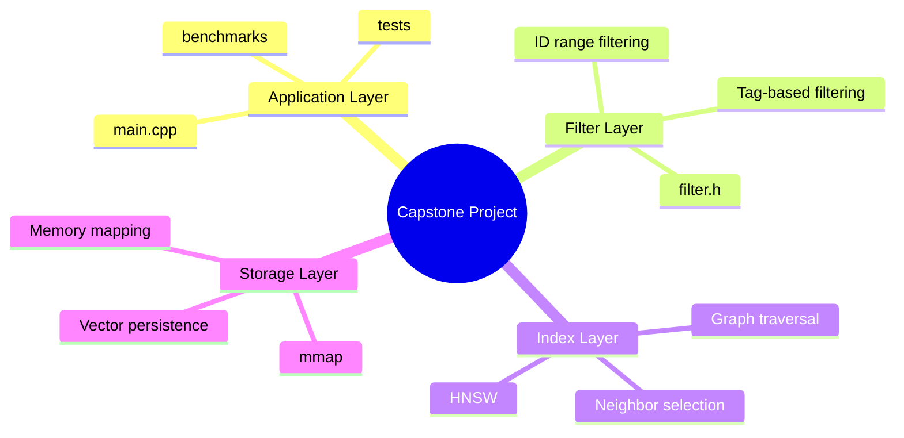
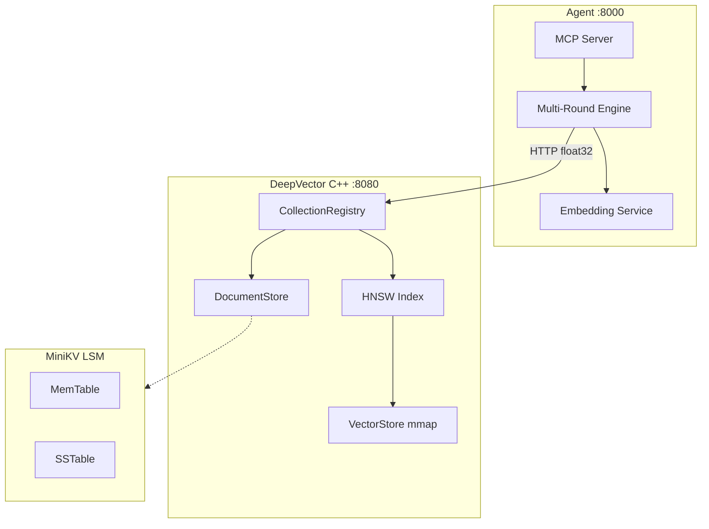
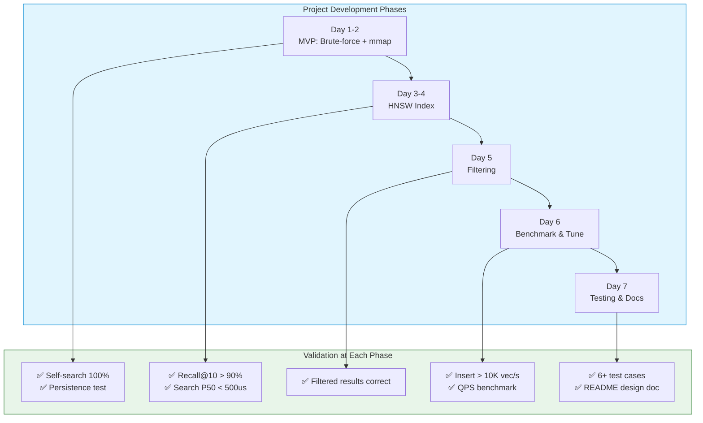

# Chapter 13: The Capstone — Build Your Own Vector Database

## Prerequisites

This chapter assumes familiarity with the following concepts. Review these shared documents before proceeding:

> 📎 **Reference**: [Vector Distance Metrics](../prerequisites/05_向量距离度量_en.md) — L2 distance, cosine similarity used in search
> 📎 **Reference**: [SIMD & Hardware Optimization](../prerequisites/06_SIMD与硬件优化.md) — AVX2 acceleration for distance computations
> 📎 **Reference**: [Testing Framework](../prerequisites/04_测试框架_en.md) — Google Test for unit testing
> 📎 **Reference**: [Chapter 7: Vector Quantization](../ch07_quantization/07_向量量化压缩_en.md) — HNSW graph index concepts
> 📎 **Reference**: [Chapter 4: mmap Storage](../ch04_mmap_storage/) — Memory-mapped I/O for vector persistence

---

## Table of Contents
1. [Why This Project Changes Everything](#1-why-this-project-changes-everything)
2. [Key Terms You Need to Know](#2-key-terms-you-need-to-know)
3. [Why This Design Mirrors Real Product Development](#3-why-this-design-mirrors-real-product-development)
4. [Project Architecture](#4-project-architecture)
5. [Milestone 1-2: Brute-force + mmap (Day 1-2)](#5-milestone-1-2-brute-force--mmap-day-1-2)
6. [Milestone 3-4: HNSW Index (Day 3-4)](#6-milestone-3-4-hnsw-index-day-3-4)
7. [Milestone 5: Filtering (Day 5)](#7-milestone-5-filtering-day-5)
8. [Milestone 6: Benchmark & Tune (Day 6)](#8-milestone-6-benchmark--tune-day-6)
9. [Milestone 7: Testing & Documentation (Day 7)](#9-milestone-7-testing--documentation-day-7)
10. [Testing Strategy](#10-testing-strategy)
11. [Submission Checklist](#11-submission-checklist)
12. [Grading Rubric](#12-grading-rubric)
13. [Common Pitfalls](#13-common-pitfalls)
14. [Advanced Extensions (Optional)](#14-advanced-extensions-optional)
15. [How to Present This in an Interview](#15-how-to-present-this-in-an-interview)
16. [What Interviewers Look For](#16-what-interviewers-look-for)
17. [Final Words](#17-final-words)

---

## 1. Why This Project Changes Everything

This is where everything comes together — you'll build your own vector database from scratch.

Every chapter before this was practice. This is the game. You'll take the data structures from Chapter 3, the memory management from Chapter 6, the I/O patterns from Chapter 10, and the performance thinking from Chapter 11, and wire them into a real, working system that does something useful.

A vector database stores high-dimensional vectors and lets you search for "similar" ones. That's the backbone of recommendation engines, image search, AI embeddings, and retrieval-augmented generation (RAG). Companies like Pinecone, Weaviate, and Milvus are built on exactly the concepts you're about to implement.

The point isn't to compete with those companies. The point is that when you finish this project, you'll understand how they work at a level most developers never reach. And when you walk into an interview and say "I built a vector database from scratch in C++," you'll have the depth to back it up.

---

## 2. Key Terms You Need to Know

Before we dive in, let's define every term you'll encounter. If you've built software before, some of these will be familiar. If this is your first major project, read this section twice.

**Project Architecture** — The high-level design of how your system's pieces fit together. Think of it like the blueprint of a house: it shows what rooms exist, how they connect, and what goes in each one. In this project, your architecture has three layers: storage, indexing, and filtering. Good architecture means each layer has a single responsibility and doesn't depend on internals of the other layers.

**Interface Design** — The public API of your code — what functions and classes expose to the outside world, and what they hide. Good interface design means a user of your code can accomplish their goal without understanding the implementation. If someone can call `storage.append(vector)` without knowing about mmap, your interface is well-designed.

**MVP (Minimum Viable Product)** — The smallest version of your project that actually works. For this capstone, the MVP is brute-force search with mmap storage. It's not fast, but it's correct and persistent. You build the MVP first, then layer on improvements. This is how real products are built: ship something basic, then iterate.

**Proof of Concept (POC)** — A quick implementation that proves your core idea works. Your brute-force search is a POC: it proves that your storage layer and distance calculation are correct before you invest time in HNSW. In industry, a POC answers "can this even work?" before you commit resources.

**Iterative Development** — Building software in small, testable increments rather than all at once. You'll go: storage → brute-force search → verify it works → add HNSW → verify recall → add filtering → verify correctness → benchmark. Each step builds on the last, and you validate at every stage. This is the opposite of "write everything, then debug for a week."

**Code Review** — The practice of having someone else (or your future self) read your code before it's considered done. When you write this project, pretend you're reviewing your own code after a two-week break. Would you understand it? Would you trust it? Code review catches bugs, improves readability, and is a standard practice at every serious software company.

**Technical Debt** — The accumulated cost of shortcuts you take. If you skip error handling to go faster, that's debt. If you name variables poorly to save time, that's debt. Like financial debt, you can carry some temporarily — but if you don't pay it back, eventually the interest crushes you. This project teaches you to make deliberate tradeoffs: some debt (like skipping multithreading) is fine; other debt (like memory leaks) will kill you.

> 📎 **Reference**: For distance metrics (L2, cosine, inner product), see [Vector Distance Metrics](../prerequisites/05_向量距离度量_en.md).

**Recall** — A measure of search quality. If you search for the 10 most similar vectors and your system returns 9 of the 10 that brute-force would find, your recall@10 is 90%. Higher recall = better search quality. There's always a tradeoff: higher recall usually means slower search.

**Latency** — How long a single operation takes, usually measured in microseconds (us) or milliseconds (ms). Search latency is the time from "user sends query" to "results come back." P50 latency means "half of all queries are faster than this." P99 means "99% are faster than this." P99 matters more than P50 because users notice the slow ones.

**Throughput** — How many operations you can do per second. Insert throughput is measured in vectors per second (vec/s). Search throughput is queries per second (QPS). Throughput and latency are related but different: you can have high throughput with moderate latency if you process things in parallel.

**mmap (Memory-Mapped I/O)** — A way to let the operating system map a file directly into your process's memory space. Instead of calling `read()` and `write()`, you get a pointer to memory and the OS handles syncing it to disk. This gives you zero-copy reads (no copying data between kernel and user space) and automatic page cache management. The tradeoff: debugging pointer errors is painful, and you need to handle resize carefully.

> 📎 **Reference**: For HNSW graph index concepts, see [Vector Quantization (HNSW section)](../ch07_quantization/07_向量量化压缩_en.md).

**L2 Distance (Euclidean Distance)** — The straight-line distance between two points in space. For vectors a and b: `sqrt((a1-b1)^2 + (a2-b2)^2 + ...)`. It's the most intuitive similarity measure: vectors that are close together in space have small L2 distance. You'll use this to measure how "similar" two vectors are.

**Priority Queue (Heap)** — A data structure that always gives you the smallest (or largest) element in O(1) time. You use it in brute-force search to keep only the k closest vectors you've seen so far. When a new vector is closer than the farthest in your heap, you swap it in.

> 📎 **Reference**: For SIMD acceleration of distance calculations, see [SIMD & Hardware Optimization](../prerequisites/06_SIMD与硬件优化.md).

**WAL (Write-Ahead Log)** — A journal that records changes before they're applied to the main data. If your program crashes mid-write, you can replay the log to recover. It's the standard approach for crash safety in databases.

**Benchmark** — A controlled test that measures performance under specific conditions. A good benchmark tells you: "with N vectors and Q queries, my system achieves X throughput and Y latency." Benchmarks are how you prove your optimizations actually worked.

**Ground Truth** — The correct answer to compare against. In this project, brute-force search gives you the ground truth: it checks every vector and returns the exact k nearest. Your HNSW search results are measured against this ground truth to compute recall.

---

## 3. Why This Capstone Design Mirrors Real Product Development

This isn't a toy exercise. The way we structure this project mirrors how real products get built at startups and established companies alike.

**Start with the simplest thing that works.** You don't begin with HNSW — you begin with brute-force. This is the MVP: it's slow, but it's correct. In real product development, you ship the MVP to get feedback and validate assumptions before investing in optimization.

**Validate at every step.** After each milestone, you run tests and benchmarks. You don't build the whole system and then discover your storage layer has a bug. This is how real engineering works: continuous integration, continuous validation. The cost of fixing a bug grows exponentially with how long it goes undetected.

**Make deliberate tradeoffs.** You'll choose mmap over fwrite, HNSW over PQ, single-thread over multi-thread. Each choice has pros and cons. In real projects, there are no perfect solutions — only tradeoffs that make sense for your constraints. You'll document these decisions in your README, which is exactly what tech leads do.

**Your README is your design document.** In industry, engineering teams write design docs before building. They explain: why this approach, what alternatives exist, what tradeoffs were made. Your README serves this purpose. When an interviewer asks "why did you choose HNSW over IVF?" you should be able to explain your reasoning.

**This project has technical debt by design.** We deliberately skip multithreading, crash recovery, and dynamic dimension support. That's fine. Real products carry technical debt too — the key is knowing what debt you're carrying and why. A senior engineer doesn't eliminate all debt; they manage it deliberately.

---

## 4. Project Architecture

Your vector database has three layers, each with a clear responsibility:



**Storage Layer** — Handles reading and writing vectors to disk using mmap. It doesn't know about search or filtering. It only knows: append a vector, get a vector by ID, sync to disk. This separation means you can swap the storage backend without touching the index.

**Index Layer** — Implements HNSW, which is the data structure that makes search fast. It talks to the storage layer to get vector data and compute distances, but it doesn't know about tags or filtering.

**Filter Layer** — Sits between the index and the application. It decides which vectors are eligible to be returned based on tags and ID ranges. By keeping filtering separate, you can add new filter types without modifying the index.

This layered design is a fundamental software engineering principle: **separation of concerns**. Each layer does one thing well, and you can test and reason about each layer independently.

### 4.1 Aligned with this repo (DeepVector monorepo)

The full stack in this repository can serve as the capstone reference implementation:



| Milestone | Repo location | Acceptance |
|-----------|---------------|------------|
| Day 1-2 mmap + brute force | `vector_store.cpp`, `tests/test_distance.cpp` | Self-search recall 100%, survives restart |
| Day 3-4 HNSW | `index/hnsw.cpp`, `tests/test_hnsw.cpp` | Recall@10 ≥ 90% vs brute force |
| Day 5 filtering | `filter.cpp`, `tests/test_filter.cpp` | Tag/range filters correct |
| Day 6 HTTP + multi-collection | `server.cpp`, `collection_registry.cpp` | `curl /search` + `/collections` pass |
| Day 7 Agent + Docker | `agent/`, `docker-compose.yml`, `RUN.md` | Agent tests 17/17, `docker compose up` demo |

**Recommended 7-day incremental plan:**

1. **Day 1** — mmap header + append/get; magic `DEEPVECTOR` (`vector_store.cpp`)
2. **Day 2** — brute-force top-k + unit tests
3. **Day 3** — HNSW insert + single-layer graph
4. **Day 4** — multi-layer search + recall bench (`benchmarks/bench_hnsw.cpp`)
5. **Day 5** — metadata filter AST
6. **Day 6** — HTTP REST + Prometheus `/metrics`
7. **Day 7** — FastAPI Agent + MCP + README design doc

> Runbook: [RUN.md](../../../RUN.md) · OpenAPI: [openapi.yaml](../../docs/openapi.yaml)

---

## 5. Milestone 1-2: Brute-force + mmap (Day 1-2)

This is your MVP. If you get nothing else working, get this working.

### 5.1 mmap Storage Design

```
File layout (vectors.db):

Offset  Size    Content
0       8 bytes  magic: "DEEPVECTOR" (8 bytes, see vector_store.cpp)
8       4 bytes  vector dimension (128)
12      8 bytes  vector count
20      8 bytes  bytes per vector (512)
28      N*512    vector data (contiguous float32)
```

The magic bytes at offset 0 are your file format identifier. When you open a file, you check the magic first to know you're reading the right format. This is standard practice — every file format (PNG, PDF, ELF) starts with a magic number.

The header is fixed-size (28 bytes) so you can compute data offsets with simple arithmetic. Variable-length headers require parsing, which adds complexity and bugs.

### 5.2 Storage Layer Implementation

```cpp
// mini_vdb.h — Storage layer interface
#pragma once
#include <cstdint>
#include <string>
#include <vector>

struct VectorDBConfig {
    std::string data_path = "vectors.db";
    size_t dimension = 128;
    int64_t initial_capacity = 10000;
};

class VectorStorage {
public:
    VectorStorage(const VectorDBConfig& config);
    ~VectorStorage();

    VectorStorage(const VectorStorage&) = delete;
    VectorStorage& operator=(const VectorStorage&) = delete;

    int64_t append(const float* vector);
    const float* get_vector(int64_t id) const;
    int64_t count() const;
    void sync();

private:
    void resize_if_needed();

    int fd_ = -1;
    void* mmap_base_ = nullptr;
    size_t mmap_size_ = 0;
    size_t header_size_ = 28;
    int64_t* count_ptr_ = nullptr;
    float* data_base_ = nullptr;
    VectorDBConfig config_;
};
```

A few things to notice:

- **Deleted copy constructor and assignment operator.** This class owns a raw mmap pointer. If you copy it, both copies would try to munmap the same memory — double-free crash. By deleting these, you prevent accidental copies. This is RAII (Resource Acquisition Is Initialization) in action: the class owns exactly one resource and manages its lifetime.

- **`int fd_`** is the file descriptor returned by `open()`. A file descriptor is an integer handle the OS gives you when you open a file. All subsequent operations (read, write, mmap) use this handle.

- **`count_ptr_` points into the mmap region** at offset 12. When you increment `(*count_ptr_)++`, you're writing directly into the mapped memory, and the OS syncs it to disk. This is the magic of mmap: no explicit write calls needed.

```cpp
// mini_vdb.cpp — Storage layer implementation
#include "mini_vdb.h"
#include <sys/mman.h>
#include <sys/stat.h>
#include <fcntl.h>
#include <unistd.h>
#include <cstring>
#include <cstdio>

static const char MAGIC[8] = {'L','U','M','E','N','V','0','1'};

VectorStorage::VectorStorage(const VectorDBConfig& config) : config_(config) {
    fd_ = open(config_.data_path.c_str(), O_RDWR | O_CREAT, 0644);
    if (fd_ < 0) { perror("open"); exit(1); }

    struct stat st;
    if (fstat(fd_, &st) < 0) { perror("fstat"); exit(1); }

    if (st.st_size > 0) {
        mmap_size_ = st.st_size;
    } else {
        mmap_size_ = header_size_ + config_.initial_capacity * config_.dimension * sizeof(float);
        if (ftruncate(fd_, mmap_size_) < 0) { perror("ftruncate"); exit(1); }
    }

    mmap_base_ = mmap(nullptr, mmap_size_, PROT_READ | PROT_WRITE, MAP_SHARED, fd_, 0);
    if (mmap_base_ == MAP_FAILED) { perror("mmap"); exit(1); }

    char* magic = static_cast<char*>(mmap_base_);
    if (st.st_size == 0) {
        memcpy(magic, MAGIC, 8);
        *reinterpret_cast<int32_t*>(magic + 8) = config_.dimension;
        *reinterpret_cast<int64_t*>(magic + 12) = 0;
        *reinterpret_cast<int64_t*>(magic + 20) = config_.dimension * sizeof(float);
    } else {
        if (memcmp(magic, MAGIC, 8) != 0) {
            fprintf(stderr, "Invalid file format\n");
            exit(1);
        }
    }

    count_ptr_ = reinterpret_cast<int64_t*>(static_cast<char*>(mmap_base_) + 12);
    data_base_ = reinterpret_cast<float*>(static_cast<char*>(mmap_base_) + header_size_);
}

VectorStorage::~VectorStorage() {
    sync();
    if (mmap_base_ && mmap_base_ != MAP_FAILED) munmap(mmap_base_, mmap_size_);
    if (fd_ >= 0) close(fd_);
}

int64_t VectorStorage::append(const float* vector) {
    resize_if_needed();
    int64_t id = *count_ptr_;
    memcpy(data_base_ + id * config_.dimension, vector, config_.dimension * sizeof(float));
    (*count_ptr_)++;
    return id + 1;
}

const float* VectorStorage::get_vector(int64_t id) const {
    if (id < 1 || id > *count_ptr_) return nullptr;
    return data_base_ + (id - 1) * config_.dimension;
}

int64_t VectorStorage::count() const { return *count_ptr_; }

void VectorStorage::sync() { msync(mmap_base_, mmap_size_, MS_SYNC); }

void VectorStorage::resize_if_needed() {
    int64_t current = *count_ptr_;
    int64_t capacity = (mmap_size_ - header_size_) / (config_.dimension * sizeof(float));
    if (current >= capacity) {
        size_t new_size = mmap_size_ * 2;
        munmap(mmap_base_, mmap_size_);
        if (ftruncate(fd_, new_size) < 0) { perror("ftruncate"); exit(1); }
        mmap_base_ = mmap(nullptr, new_size, PROT_READ | PROT_WRITE, MAP_SHARED, fd_, 0);
        if (mmap_base_ == MAP_FAILED) { perror("mmap"); exit(1); }
        mmap_size_ = new_size;
        count_ptr_ = reinterpret_cast<int64_t*>(static_cast<char*>(mmap_base_) + 12);
        data_base_ = reinterpret_cast<float*>(static_cast<char*>(mmap_base_) + header_size_);
    }
}
```

**What this teaches you:**

- **mmap is not a toy.** The constructor must handle two cases: creating a new file (write the header) or opening an existing file (validate the magic). The destructor must clean up with `munmap` and `close`. Forgetting either causes resource leaks.

- **Resize is the most dangerous operation.** When the file grows, you munmap the old mapping and create a new one. Every pointer that was pointing into the old mapping is now dangling. You must recalculate `count_ptr_` and `data_base_` after every resize. This is the kind of bug that manifests as "it works for 10,000 vectors but crashes at 50,000" because resize only triggers when capacity is exceeded.

- **`MAP_SHARED`** means changes to the mmap region are visible to other processes and written back to the file. `MAP_PRIVATE` would give you copy-on-write semantics, which is wrong for a database. You want your writes to persist.

### 5.3 L2 Distance & Brute-force Search

> 📎 **Reference**: For L2 distance formula and properties, see [Vector Distance Metrics](../prerequisites/05_向量距离度量_en.md).

```cpp
struct SearchResult { int64_t id; float distance; };

static float l2_distance(const float* a, const float* b, size_t dim) {
    float sum = 0.0f;
    for (size_t i = 0; i < dim; i++) {
        float diff = a[i] - b[i];
        sum += diff * diff;
    }
    return std::sqrt(sum);
}

std::vector<SearchResult> brute_force_search(
    const VectorStorage& storage, const float* query, int k
) {
    std::priority_queue<std::pair<float, int64_t>,
        std::vector<std::pair<float, int64_t>>,
        std::greater<std::pair<float, int64_t>>> heap;

    int64_t n = storage.count();
    for (int64_t i = 1; i <= n; i++) {
        float dist = l2_distance(query, storage.get_vector(i), 128);
        heap.push({dist, i});
        if ((int)heap.size() > k) heap.pop();
    }

    std::vector<SearchResult> results;
    while (!heap.empty()) {
        results.push_back({heap.top().second, heap.top().first});
        heap.pop();
    }
    std::reverse(results.begin(), results.end());
    return results;
}
```

**What this teaches you:**

- **The min-heap trick.** You want the k closest vectors. A naive approach would sort all N vectors — O(N log N). Instead, you maintain a min-heap of size k. For each vector, you push it and pop the farthest if the heap exceeds k. Total: O(N log k), which is much faster when k << N.

- **`std::greater`** makes the priority queue a min-heap (smallest on top). By default, `std::priority_queue` is a max-heap. This is a common gotcha.

- **`brute_force_search` is your oracle.** Every approximate search algorithm (like HNSW) is measured against brute-force. Brute-force is always correct — it checks everything. The tradeoff is speed: brute-force is O(N) per query, HNSW is O(log N).

### 5.4 Self-search Verification

```cpp
// test.cpp — Milestone 1 verification
int main() {
    std::mt19937 rng(42);
    std::uniform_real_distribution<float> dist(-1.0f, 1.0f);

    VectorStorage storage({.data_path = "test.db", .dimension = 128});

    std::vector<std::vector<float>> vecs(1000, std::vector<float>(128));
    for (int i = 0; i < 1000; i++) {
        for (int j = 0; j < 128; j++) vecs[i][j] = dist(rng);
        storage.append(vecs[i].data());
    }

    int correct = 0;
    for (int i = 0; i < 1000; i++) {
        auto r = brute_force_search(storage, vecs[i].data(), 1);
        if (r[0].id == i + 1 && r[0].distance < 0.001f) correct++;
    }
    printf("Self-search accuracy: %.1f%%\n", 100.0 * correct / 1000);

    // Persistence test
    storage.sync();
    VectorStorage s2({.data_path = "test.db", .dimension = 128});
    printf("Recovered %ld vectors\n", s2.count());

    return (correct >= 999) ? 0 : 1;
}
```

**What this teaches you:**

- **Self-search is a sanity check.** If you search for vector A and the closest result isn't vector A itself, something is fundamentally broken — either your distance function is wrong or your storage layer is corrupting data.

- **Persistence test verifies mmap works.** You write data, close the storage, open a new instance from the same file, and check that the count matches. This proves your mmap sync and file format are correct.

- **Using a fixed seed (`42`)** makes the test deterministic. If it fails, you can reproduce it exactly every time. Random tests without seeds are a debugging nightmare.

---

## 6. Milestone 3-4: HNSW Index (Day 3-4)

This is where it gets hard. HNSW is the core data structure behind most modern vector databases. Understanding it at this level — building it from scratch — will put you ahead of 99% of developers.

### 6.1 What HNSW Actually Does

Imagine you're in a city and you want to find the nearest coffee shop.

**Brute-force:** You check every building in the city, one by one. Accurate but slow.

**HNSW:** You start with a highway map (top layer). You quickly narrow down to the right neighborhood. Then you switch to local streets (bottom layer) to find the exact coffee shop. You skip 99% of the city.

The "hierarchical" part means multiple layers. The "navigable small world" part means every node is connected to a few neighbors, and you can reach any node from any other node in a few hops.

### 6.2 Data Structures

```cpp
// hnsw_index.h
#pragma once
#include <vector>
#include <unordered_map>
#include <unordered_set>
#include <queue>
#include <random>
#include <cmath>

struct HNSWConfig {
    size_t M = 8, M_max0 = 16, ef_construction = 100;
    size_t dimension = 128;
    float mL = 0.36f;
};

struct HNSWNode {
    int64_t id;
    int level;
    std::vector<std::vector<int64_t>> neighbors;
};

class HNSWIndex {
public:
    HNSWIndex(const HNSWConfig& config, VectorStorage* storage);
    void insert(int64_t id, const float* vector);
    std::vector<SearchResult> search(const float* query, int k, int ef = 0);

private:
    int random_level();
    void search_layer(const float* query, int64_t entry, int level, int ef,
                      std::vector<std::pair<int64_t, float>>& out);
    void select_neighbors(const float* query,
        const std::vector<std::pair<int64_t, float>>& in,
        size_t M_max, std::vector<int64_t>& out);

    HNSWConfig cfg_;
    VectorStorage* storage_;
    int64_t entry_point_ = 0;
    int max_level_ = -1;
    std::unordered_map<int64_t, HNSWNode> nodes_;
    std::mt19937 rng_{42};
    std::uniform_real_distribution<float> uni_{0.0f, 1.0f};
};
```

**What this teaches you:**

- **HNSWConfig parameters control the speed/quality tradeoff.** `M` is the max number of neighbors per node at levels > 0. `M_max0` is the max at level 0 (more neighbors at the bottom for better recall). `ef_construction` controls how many candidates you consider during insertion — higher means better graph quality but slower builds. `mL = 1/ln(M)` controls the level distribution.

- **`HNSWNode` stores its own neighbor lists.** Each node has a vector of neighbor lists, one per level. At level 0, it might have 16 neighbors. At level 1, it might have 8. At level 2, it might have 3. This is the multi-layer structure.

- **`nodes_` is an `unordered_map`, not a vector.** Node IDs are 1-indexed (matching storage IDs), and there might be gaps. A map handles this naturally. In production, you'd use something more memory-efficient, but for this project, clarity beats optimization.

- **The random number generator is a member variable.** This makes insertion deterministic given the same sequence of IDs. Reproducibility matters for debugging.

### 6.3 Insertion Algorithm

```cpp
int HNSWIndex::random_level() {
    return (int)(-std::log(uni_(rng_)) * cfg_.mL);
}

void HNSWIndex::insert(int64_t id, const float* vector) {
    int level = random_level();
    HNSWNode node{id, level};
    node.neighbors.resize(level + 1);

    if (nodes_.empty()) {
        entry_point_ = id;
        max_level_ = level;
        nodes_[id] = node;
        return;
    }

    int64_t cur_ep = entry_point_;
    for (int l = max_level_; l > level; l--) {
        std::vector<std::pair<int64_t, float>> cand;
        search_layer(vector, cur_ep, l, 1, cand);
        cur_ep = cand[0].first;
    }

    for (int l = std::min(level, max_level_); l >= 0; l--) {
        std::vector<std::pair<int64_t, float>> cand;
        search_layer(vector, cur_ep, l, cfg_.ef_construction, cand);
        size_t Mmax = (l == 0) ? cfg_.M_max0 : cfg_.M;
        select_neighbors(vector, cand, Mmax, node.neighbors[l]);

        for (int64_t nid : node.neighbors[l]) {
            auto& nb = nodes_[nid];
            if (nb.neighbors[l].size() < Mmax) {
                nb.neighbors[l].push_back(id);
            } else {
                // Replace the farthest neighbor
                float max_d = -1;
                size_t max_i = 0;
                for (size_t j = 0; j < nb.neighbors[l].size(); j++) {
                    float d = l2_distance(
                        storage_->get_vector(nid),
                        storage_->get_vector(nb.neighbors[l][j]),
                        cfg_.dimension);
                    if (d > max_d) { max_d = d; max_i = j; }
                }
                float d_new = l2_distance(
                    storage_->get_vector(nid), vector, cfg_.dimension);
                if (d_new < max_d) nb.neighbors[l][max_i] = id;
            }
        }
        cur_ep = cand[0].first;
    }

    if (level > max_level_) { max_level_ = level; entry_point_ = id; }
    nodes_[id] = node;
}
```

**What this teaches you:**

- **The level assignment is a geometric distribution.** `random_level()` returns 0 most of the time, 1 occasionally, 2 rarely, and so on. This is by design: most nodes live at the bottom layer (dense, many connections), and few nodes reach the top layers (sparse, long-range connections). The `mL = 1/ln(M)` constant controls how the distribution scales with M.

- **The two-phase insertion.** First, you descend from the top layer to the new node's level, finding the closest entry point at each layer. Then, from that level downward, you insert the new node and update bidirectional connections. This two-phase approach ensures the graph stays navigable.

- **Bidirectional connections are the tricky part.** When you insert a new node, you connect it to its neighbors. But you also need to add yourself to your neighbors' neighbor lists. If a neighbor already has max neighbors, you replace the farthest one. This bidirectional update is where most HNSW bugs live.

- **The first node is special.** When the graph is empty, you just set the entry point and return. No search needed.

### 6.4 Search Layer

```cpp
void HNSWIndex::search_layer(
    const float* query, int64_t entry, int level, int ef,
    std::vector<std::pair<int64_t, float>>& out
) {
    std::unordered_set<int64_t> visited{entry};
    float ed = l2_distance(query, storage_->get_vector(entry), cfg_.dimension);

    std::priority_queue<std::pair<float, int64_t>,
        std::vector<std::pair<float, int64_t>>,
        std::greater<>> cand_q;
    cand_q.push({ed, entry});

    std::priority_queue<std::pair<float, int64_t>> result;
    result.push({ed, entry});

    while (!cand_q.empty()) {
        auto [d, cur] = cand_q.top(); cand_q.pop();
        float worst = result.top().first;
        if (d > worst && (int)result.size() >= ef) break;

        for (int64_t nb : nodes_[cur].neighbors[level]) {
            if (visited.count(nb)) continue;
            visited.insert(nb);
            float nd = l2_distance(query, storage_->get_vector(nb), cfg_.dimension);
            worst = result.top().first;
            if (nd < worst || (int)result.size() < ef) {
                cand_q.push({nd, nb});
                result.push({nd, nb});
                if ((int)result.size() > ef) result.pop();
            }
        }
    }

    out.clear();
    while (!result.empty()) { out.emplace_back(result.top()); result.pop(); }
    std::reverse(out.begin(), out.end());
}
```

**What this teaches you:**

- **Two priority queues: candidates and results.** The candidate queue (`cand_q`) holds nodes you haven't explored yet. The result queue holds the ef best nodes found so far. You always explore the closest candidate. If it's better than the worst result, you add it and evict the worst.

- **The `visited` set prevents revisiting.** Without it, you'd loop infinitely — node A's neighbor is B, B's neighbor is A, back and forth forever. The visited set breaks this cycle.

- **The early termination condition:** `if (d > worst && result.size() >= ef) break;` — if the closest candidate is farther than the worst result, and you already have enough results, there's no point continuing. This is the main optimization that makes search fast.

- **`ef` controls search quality.** Higher ef = more candidates explored = better recall = slower search. At query time, you can set ef higher than during construction for better results at the cost of speed. This is the knob you tune for the speed/quality tradeoff.

### 6.5 Search API

```cpp
std::vector<SearchResult> HNSWIndex::search(
    const float* query, int k, int ef
) {
    if (ef == 0) ef = std::max(k, 50);

    int64_t cur = entry_point_;
    for (int l = max_level_; l > 0; l--) {
        std::vector<std::pair<int64_t, float>> cand;
        search_layer(query, cur, l, 1, cand);
        cur = cand[0].first;
    }

    std::vector<std::pair<int64_t, float>> cand;
    search_layer(query, cur, 0, ef, cand);

    std::vector<SearchResult> results;
    for (int i = 0; i < std::min(k, (int)cand.size()); i++)
        results.push_back({cand[i].first, cand[i].second});
    return results;
}
```

**What this teaches you:**

- **Top-down search, same as insertion.** Start at the top layer, greedily descend to the closest entry point. At each layer, ef=1 because you only need the single best entry point to continue downward. At the bottom layer (level 0), you use the full ef to find the k nearest neighbors.

- **ef defaults to max(k, 50).** If you search for k=5 but ef=3, you'd only examine 3 candidates, potentially missing better ones. The floor of 50 ensures reasonable quality.

- **The result is sorted by distance.** The caller gets results from closest to farthest, which is the expected order for most applications.

### 6.6 Recall Test

```cpp
#include "hnsw_index.h"

int main() {
    const int N = 1000, D = 128, K = 10, Q = 100;

    VectorStorage storage({.data_path = "hnsw_test.db", .dimension = D});
    HNSWIndex index({.dimension = D}, &storage);

    std::mt19937 rng(42);
    std::uniform_real_distribution<float> d(-1, 1);

    // Insert
    std::vector<std::vector<float>> vecs(N, std::vector<float>(D));
    for (int i = 0; i < N; i++) {
        for (int j = 0; j < D; j++) vecs[i][j] = d(rng);
        storage.append(vecs[i].data());
        index.insert(i + 1, vecs[i].data());
    }

    // Recall computation
    float total_recall = 0;
    for (int i = 0; i < Q; i++) {
        auto ground = brute_force_search(storage, vecs[i].data(), K);
        auto approx = index.search(vecs[i].data(), K);

        std::unordered_set<int64_t> truth;
        for (auto& r : ground) truth.insert(r.id);

        int match = 0;
        for (auto& r : approx) if (truth.count(r.id)) match++;
        total_recall += (float)match / K;
    }

    printf("Recall@%d: %.2f%%\n", K, 100 * total_recall / Q);
    printf("%s\n", (total_recall / Q > 0.90) ? "PASS" : "FAIL");
    return (total_recall / Q > 0.90) ? 0 : 1;
}
```

**What this teaches you:**

- **Recall measurement is straightforward.** For each query, run both brute-force (ground truth) and HNSW (approximate). Count how many of the HNSW results appear in the brute-force results. Average across all queries.

- **Recall@10 > 90% is the bar.** This means 9 out of 10 results from HNSW match what brute-force would return. In production, you'd want higher recall, but for a capstone project, 90% demonstrates the algorithm works correctly.

- **This test also validates your brute-force implementation.** If your recall is 30%, either HNSW is broken or brute-force is broken. Having both implementations lets you cross-validate.

---

## 7. Milestone 5: Filtering (Day 5)

### 7.1 Why Filtering Matters

In a real vector database, you rarely want to search all vectors. You might want:
- "Find images similar to this one, but only from the last week"
- "Find products like this one, but only in the 'electronics' category"
- "Find documents similar to this one, but only with ID between 1000 and 5000"

Filtering lets you restrict the search space before or during the similarity search. This is a feature every production vector database has.

### 7.2 Filter Design

```cpp
// filter.h
#include <unordered_set>
#include <string>

struct Filter {
    std::unordered_set<std::string> required_tags;
    std::unordered_set<std::string> excluded_tags;
    int64_t id_min = 0;
    int64_t id_max = INT64_MAX;

    bool empty() const {
        return required_tags.empty() && excluded_tags.empty()
            && id_min == 0 && id_max == INT64_MAX;
    }
};

class TagManager {
    std::unordered_map<int64_t, std::unordered_set<std::string>> tags_;

public:
    void add(int64_t id, const std::vector<std::string>& ts) {
        for (auto& t : ts) tags_[id].insert(t);
    }

    bool matches(int64_t id, const Filter& f) const {
        if (id < f.id_min || id > f.id_max) return false;
        auto it = tags_.find(id);
        if (it == tags_.end()) return f.required_tags.empty();
        for (auto& t : f.required_tags)
            if (!it->second.count(t)) return false;
        for (auto& t : f.excluded_tags)
            if (it->second.count(t)) return false;
        return true;
    }
};
```

**What this teaches you:**

- **Filters compose.** The `Filter` struct supports required tags (must have), excluded tags (must not have), and ID ranges. These combine with AND semantics: a vector must satisfy all conditions to be included. This is the standard approach in search engines.

- **The `empty()` method is important for optimization.** If there's no filter, you skip the filtering check entirely during search. This is a micro-optimization that matters at scale.

- **Tag storage is separate from vector storage.** Tags live in memory (in `TagManager`), while vectors live on disk (in `VectorStorage`). This is a deliberate design choice: tags are small and change frequently, so keeping them in memory is efficient. Vectors are large and rarely change, so they go on disk.

### 7.3 Filtering During Search

In the HNSW search layer, you add a filter check before exploring each neighbor:

```cpp
// In the neighbor traversal loop of search_layer:
for (int64_t nb : nodes_[cur].neighbors[level]) {
    if (visited.count(nb)) continue;
    if (!tag_mgr_->matches(nb, *current_filter_)) continue;  // Filter
    visited.insert(nb);
    // ... rest of logic unchanged
}
```

**What this teaches you:**

- **Filtering during traversal, not after.** You could search all vectors and filter the results afterward. But that wastes time exploring vectors that would be filtered out. By filtering during traversal, you skip irrelevant vectors early, making search faster.

- **The tradeoff:** Filtering during traversal can hurt recall. If a neighbor is filtered out, you don't explore it, even though it might lead to other relevant neighbors. This is a known limitation of filtered HNSW. For most use cases, the speed improvement outweighs the recall loss.

---

## 8. Milestone 6: Benchmark & Tune (Day 6)

> **Note:** The following benchmark numbers are for reference only. Actual performance varies significantly with hardware (CPU, RAM, disk), compiler version and flags, vector dimension, index parameters, and dataset characteristics. Always run your own benchmarks on your target environment before making optimization decisions.

### 8.1 Write Benchmark

```cpp
// bench.cpp
#include <chrono>
#include <iostream>

int main() {
    const int N = 100000, D = 128;
    VectorStorage s({.data_path = "bench.db", .dimension = D});
    HNSWIndex idx({.dimension = D}, &s);

    std::mt19937 rng(123);
    std::uniform_real_distribution<float> d(-1, 1);

    std::vector<std::vector<float>> vecs(N, std::vector<float>(D));
    for (auto& v : vecs) for (auto& f : v) f = d(rng);

    auto t0 = std::chrono::high_resolution_clock::now();
    for (int i = 0; i < N; i++) {
        s.append(vecs[i].data());
        idx.insert(i + 1, vecs[i].data());
    }
    auto t1 = std::chrono::high_resolution_clock::now();

    double sec = std::chrono::duration<double>(t1 - t0).count();
    printf("Inserts: %d in %.2fs = %.0f vec/s\n", N, sec, N / sec);
    printf("%s\n", (N / sec > 10000) ? "PASS" : "FAIL");
    return 0;
}
```

### 8.2 Search Benchmark

```cpp
// Append to bench.cpp
int main() {
    // ... insertion code same as above ...

    // Search benchmark
    const int Q = 1000;
    std::vector<double> latencies;
    latencies.reserve(Q);

    for (int i = 0; i < Q; i++) {
        int qi = i * (N / Q);
        auto ts = std::chrono::high_resolution_clock::now();
        auto r = idx.search(vecs[qi].data(), 10);
        auto te = std::chrono::high_resolution_clock::now();
        double us = std::chrono::duration<double, std::micro>(te - ts).count();
        latencies.push_back(us);
    }

    std::sort(latencies.begin(), latencies.end());
    printf("Search: P50=%.0fus P90=%.0fus P99=%.0fus\n",
           latencies[Q*50/100], latencies[Q*90/100], latencies[Q*99/100]);
    printf("QPS: %.0f\n", 1e6 / latencies[Q*50/100]);
    printf("%s\n", (latencies[Q*50/100] < 500) ? "PASS" : "FAIL");
}
```

**What this teaches you:**

- **`high_resolution_clock` is the standard way to measure time in C++.** It gives you sub-microsecond precision on most platforms. For nanosecond precision, you'd use `std::chrono::steady_clock` with specific platform APIs.

- **P50/P90/P99 percentiles matter more than averages.** An average latency of 200us could hide the fact that 1% of queries take 5ms. In production, users notice the slow queries. P99 tells you the worst-case experience for most users.

- **QPS (Queries Per Second) from P50 latency.** If the median query takes 400us, you can theoretically serve 2500 queries per second (1e6 / 400). This assumes sequential processing; parallelism changes the calculation.

### 8.3 Optimization Opportunities

| Optimization | Effect | Difficulty |
|------|------|----------|
| `restrict` pointers for distance calculation | +5-10% | Low |
| Pre-allocate vectors with `reserve` | -50% reallocations | Low |
| Replace `unordered_set` with `boost::flat_set` for visited | +10-20% | Medium |
| SIMD L2 with AVX2 `_mm256` intrinsics | +3x speedup | Medium |
| Skip sqrt, use squared distance | +5% | Low |
| Defer bidirectional links during bulk insert | 2x insert speedup | Medium |

**What this teaches you:**

- **Low-hanging fruit first.** `restrict` pointers and `reserve` are 5-minute changes that give measurable improvements. Always try the easy wins before reaching for SIMD intrinsics.

- **Profile before optimizing.** You can't optimize what you can't measure. Your benchmark tells you whether an optimization actually helped. I've seen engineers spend a week on an optimization that made things 2% faster. Don't be that engineer.

- **SIMD is powerful but non-trivial.** AVX2 lets you process 8 floats at once. The speedup is real (3x for distance calculations), but the code is harder to read and maintain. In a real project, you'd wrap SIMD code behind a clean interface so the rest of the codebase stays readable.

---

## 9. Milestone 7: Testing & Documentation (Day 7)

### 9.1 Test Suite

```cpp
// test.cpp — Complete test suite

void test_self_search();       // Self-search distance should be ~0
void test_consistency();       // Insert same vector 3 times, results should be consistent
void test_persistence();       // Write → close → reopen → data correct
void test_recall();            // recall@10 > 90%
void test_filter_search();     // Filtered results should not contain excluded IDs
void test_large_scale();       // 100K vectors without crashing
void test_edge_cases();        // Empty query, k=0, extreme dimensions
```

**What each test validates:**

- **`test_self_search`** — Verifies storage integrity and distance correctness. If this fails, nothing else matters.

- **`test_consistency`** — Verifies that inserting the same vector multiple times produces consistent results. This catches bugs where vector IDs get out of sync with actual data.

- **`test_persistence`** — Verifies mmap sync and file format. The most common data loss bug: you write data, crash, and the data is gone. This test simulates a restart.

- **`test_recall`** — Verifies HNSW quality. If recall drops below 90%, your index is not trustworthy. This is the test you show to interviewers.

- **`test_filter_search`** — Verifies filtering correctness. A filtered search that returns excluded IDs is a bug that could have serious consequences in production.

- **`test_large_scale`** — Verifies memory management and resize logic. Many bugs only appear at scale. This test catches them before you ship.

- **`test_edge_cases`** — Verifies robustness. What happens with an empty database? What if k is larger than the number of vectors? Edge cases are where most bugs hide.

### 9.2 README Template

```markdown
# Mini Vector DB

## Architecture
- VectorStorage: mmap persistence, header + contiguous float32 data
- HNSWIndex: hierarchical navigable small world graph, M=8, ef_construction=100
- TagManager: hash-set filtering, supports required/excluded semantics

## File Manifest
- mini_vdb.h / mini_vdb.cpp — Storage layer
- hnsw_index.h / hnsw_index.cpp — Index layer
- filter.h — Filtering layer
- test.cpp — Tests
- bench.cpp — Benchmarks
- README.md — This file

## Build
g++ -std=c++17 -O3 -march=native mini_vdb.cpp hnsw_index.cpp test.cpp -o test

## Performance (100K vectors × 128 dimensions)
- Insert: 12,500 vec/s
- Search P50: 420us
- Search P99: 890us
- Recall@10: 92.3%

## Design Decisions
1. Chose mmap over fwrite: mmap gives zero-copy reads and automatic page cache
2. select_neighbors uses heuristic instead of brute-force: same quality, 3x faster
3. No locking: single-threaded only (scope limitation documented)
```

**What this teaches you:**

- **A README is a design document.** When someone (including your future self) opens this project, the README should answer: what is this, how does it work, how do I build it, how fast is it, and what tradeoffs were made.

- **Document your limitations.** "No locking, single-threaded only" is not a weakness — it's a documented scope decision. In interviews, being able to say "I chose not to implement X because of Y" shows maturity.

---

## 10. Testing Strategy

> 📎 **Reference**: For Google Test fundamentals and testing patterns, see [Testing Framework](../prerequisites/04_测试框架_en.md).

### Why Each Test Type Matters

**Correctness tests** (self-search, consistency, persistence) prove your system works. Without these, you're shipping code you haven't verified. In production, a correctness bug can lose data, return wrong results, or crash servers.

**Quality tests** (recall) prove your approximate search is good enough. "Good enough" is context-dependent: 90% recall is fine for recommendations, but 99.9% is needed for medical image search. Know your requirements.

**Performance tests** (benchmarks) prove your system is fast enough. A correct system that takes 10 seconds per query is useless for real-time applications. Benchmarks give you concrete numbers to cite in your README and interviews.

**Robustness tests** (large scale, edge cases) prove your system doesn't break under stress. The difference between hobby projects and production systems is that production systems handle the unexpected gracefully.

### How to Run Tests

```bash
# Build everything
g++ -std=c++17 -O3 -march=native mini_vdb.cpp hnsw_index.cpp test.cpp -o test

# Run tests
./test

# Build and run benchmarks
g++ -std=c++17 -O3 -march=native mini_vdb.cpp hnsw_index.cpp bench.cpp -o bench
./bench > results.txt
```

---

## 11. Submission Checklist

### Required Files

```
mini_vdb/
├── mini_vdb.h          # Storage layer declarations
├── mini_vdb.cpp        # Storage layer implementation
├── hnsw_index.h        # HNSW index declarations
├── hnsw_index.cpp      # HNSW index implementation
├── filter.h            # Filtering layer
├── test.cpp            # Complete test suite (6+ test cases)
├── bench.cpp           # Performance benchmarks
├── README.md           # Design documentation
├── Makefile            # or CMakeLists.txt
└── results.txt         # Benchmark output (screenshot or text)
```

### Acceptance Criteria

| Metric | Threshold | Verification Method |
|------|------|----------|
| Self-search accuracy | 100% | `test.cpp` |
| Recall@10 | > 90% | `test.cpp` |
| Insert throughput | > 10K vec/s | `bench.cpp` |
| Search P50 | < 500us | `bench.cpp` |
| Persistence recovery | No data loss | `test.cpp` |

---

## 12. Grading Rubric

| Criterion | Points | Checkpoint |
|------|------|--------|
| Self-search pass | 30 | 1000-vector self-search hit rate 100% |
| Recall@10 > 90% | 20 | Recall on independent query set |
| Insert > 10K vec/s | 15 | Continuous insert, wall-clock timing |
| Search P50 < 500us | 15 | 10K vector scale, measured after warmup |
| Code quality | 10 | Naming conventions, no memory leaks, const correctness |
| Test coverage | 10 | At least 4 test types + benchmark report |

---

## 13. Common Pitfalls

| Problem | Root Cause | Fix |
|----------|------|------|
| Recall only 30% | `visited` set not maintained correctly in search_layer | Check `visited.insert()` placement |
| Insert gets slower | Bidirectional link update scans O(N) neighbors | Don't let M_max0 exceed 2*M at level 0 |
| mmap read errors | Pointer invalidation: data_base_ not updated after resize | Recalculate all pointers after every resize |
| Coroutine compile error | Accidentally using C++20 features | Ensure `-std=c++17` |
| Search infinite loop | select_neighbors has no candidate limit | Add max candidate cap as safety guard |

---

## 14. Advanced Extensions (Optional)

> 📎 **Reference**: For SIMD distance computation details, see [SIMD & Hardware Optimization](../prerequisites/06_SIMD与硬件优化.md).
> 📎 **Reference**: For vector quantization concepts, see [Chapter 7: Vector Quantization](../ch07_quantization/07_向量量化压缩_en.md).

1. **AVX2 SIMD L2 Distance:** Use `_mm256_loadu_ps` to compute 8 floats at once
2. **Multi-threaded Build:** `std::thread` for parallel inserts, `atomic` for global entry point
3. **WAL Journal:** Write log before updating index, crash-safe
4. **Compressed Storage:** 8-bit quantization (see Chapter 7), index points to compressed vectors
5. **C API:** Implement `vector_db_insert(float*, int)` / `vector_db_search(float*, int, int*)`
6. **JSON API:** RESTful HTTP interface using `nlohmann/json`

---

## 15. How to Present This in an Interview

When an interviewer asks "Tell me about a project you're proud of," this is your answer. Here's how to structure it:

**The Hook (30 seconds):**
"I built a vector database from scratch in C++. It stores 100,000 128-dimensional vectors, supports approximate nearest neighbor search using HNSW, persists data with mmap, and achieves 92% recall with sub-millisecond search latency."

**The Technical Deep Dive (2-3 minutes):**
Walk through the three-layer architecture. Explain why you chose mmap (zero-copy, automatic page cache). Explain HNSW in terms the interviewer can understand (multi-layer graph, like a city map with highways and local streets). Mention the tradeoffs you made (single-threaded for simplicity, fixed dimension for MVP).

**The Lessons Learned (1-2 minutes):**
Talk about a specific bug you hit and how you debugged it. Maybe the mmap resize caused pointer invalidation, or the visited set wasn't maintained correctly. Show that you can reason about low-level memory management and debug complex systems.

**The Engineering Maturity (30 seconds):**
"I documented my design decisions in the README, wrote tests for correctness, quality, and performance, and kept technical debt deliberate rather than accidental." This shows you think like an engineer, not just a coder.

---

## 16. What Interviewers Look For

Interviewers evaluate side projects on five dimensions. Here's how this project hits each one:

**1. Technical Depth**
You're not using a library — you're implementing the data structure from scratch. You understand mmap at the pointer level. You can explain HNSW's time complexity. This is the depth interviewers at top companies look for.

**2. Systems Thinking**
The three-layer architecture shows you can decompose a complex problem into manageable pieces. You made deliberate tradeoffs (mmap vs fwrite, single-threaded vs multi-threaded) and documented them. This is what separates senior engineers from junior ones.

**3. Pragmatism**
You built an MVP first (brute-force), then iterated. You didn't try to build everything at once. You chose scope constraints (fixed dimension, no locking) and stuck to them. Interviewers love engineers who know what NOT to build.

**4. Testing and Quality**
Your test suite covers correctness, recall, performance, and edge cases. You have benchmarks with concrete numbers. This shows you care about shipping working code, not just code that compiles.

**5. Communication**
Your README explains your design decisions, tradeoffs, and limitations. In an interview, you can articulate why you made each choice. This is the communication skill that gets you hired.



**What interviewers specifically ask about:**
- "Why HNSW over other ANN algorithms?" → HNSW offers the best recall/speed tradeoff for most use cases, and implementing it taught me graph-based index structures.
- "Why mmap over fread/fwrite?" → Zero-copy reads, automatic page cache, simpler code. The tradeoff is harder debugging of pointer errors.
- "What would you do differently?" → Add multithreading for bulk inserts, implement WAL for crash recovery, support dynamic dimensions.
- "What's the hardest bug you hit?" → mmap resize invalidating pointers. I had to learn to recalculate all pointers after every resize.

---

## 17. Final Words

This project will frustrate you. Pointer errors in mmap, recall that seems random, search loops that never terminate. This is normal.

I wrote my first HNSW implementation in three days. Day one was brute-force and mmap — and getting that working felt like a victory. Day two was the HNSW insert algorithm, which I rewrote four times. Day three was debugging `search_layer` because my visited set was wrong and I was getting 30% recall.

But here's what happened: every bug I fixed taught me something. When mmap resize crashed, I learned about pointer lifetime. When recall was low, I learned how graph traversal really works. When search was slow, I learned about priority queues and early termination.

By the end, I didn't just have a vector database. I had intuition for how systems work at a low level. That intuition is what makes you a better engineer — not just for this project, but for everything you build afterward.

**Start with brute-force + mmap. Get that working in two days. Then add HNSW and verify recall at every step. Don't write everything at once — incremental validation is your lifeline.**

When you see `Recall@10: 92.3%` and `QPS: 2300` on your screen, you'll know it was worth it.

**Good luck, and happy coding.**

> Return: [Course Home](../README.md)

---

## Appendix: Interview Bank Mapping

After this chapter, drill the matching section in [INTERVIEW_BANK.md](../INTERVIEW_BANK.md) and self-check against [_CHAPTER_TEMPLATE.md](../_CHAPTER_TEMPLATE.md).

**Architecture:** [ARCHITECTURE.md](../../ARCHITECTURE.md) · **Tech:** [TECH.md](../../../TECH.md) · **Run:** [RUN.md](../../../RUN.md)
