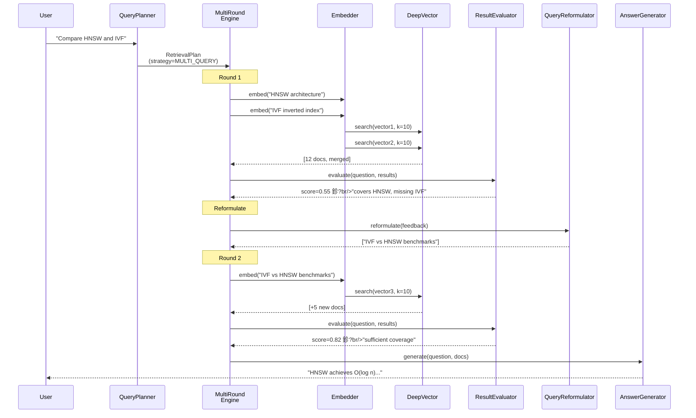
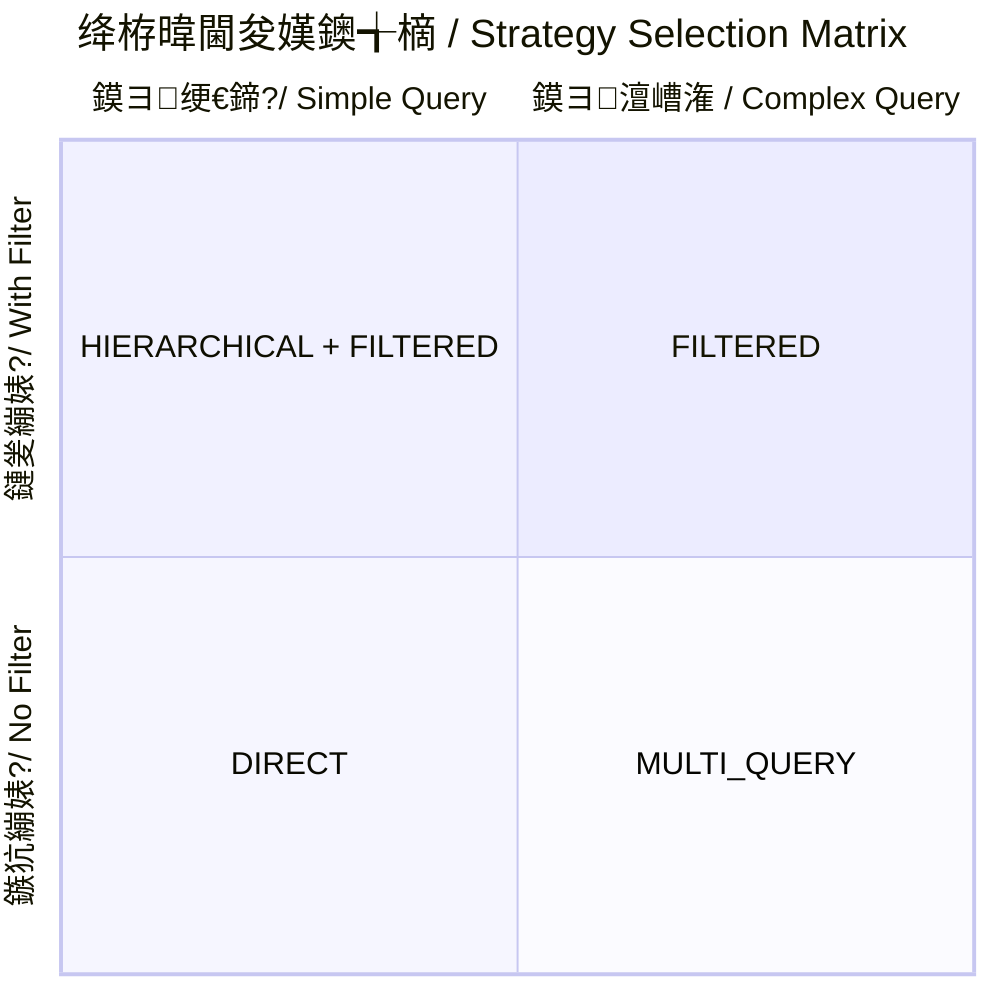

# AgenticDB 鈥?Agent-Native Vector Database

> 璁╁悜閲忔暟鎹簱鑷繁浼氭€濊€?/ Making vector databases think for themselves.

AgenticDB extends [DeepVector](https://github.com/Thezx-a/DeepVector) from a passive vector store into an **agent-native database** that can understand natural language queries, autonomously plan multi-round retrieval strategies, and self-evaluate result quality.

---

## Architecture

### System Overview

```mermaid
flowchart TB
    User["鐢ㄦ埛 / User<br/>'甯垜鎵?RAG 鐩稿叧鐨勮鏂?"]
    
    subgraph Agent ["Agent Server (Python, port 8090)"]
        API["HTTP API<br/>/query /ask /plan"]
        LLM["LLM Router<br/>OpenAI | Ollama"]
        Embed["Embedding Service<br/>Local | OpenAI"]
        
        subgraph Engine ["MultiRound Engine"]
            Planner["QueryPlanner<br/>绛栫暐閫夋嫨"]
            MR["MultiRound<br/>澶氳疆妫€绱?]
            Eval["ResultEvaluator<br/>璐ㄩ噺璇勫垎"]
            Reform["QueryReformulator<br/>鏌ヨ閲嶆瀯"]
            Gen["AnswerGenerator<br/>绛旀鐢熸垚"]
        end
        
        MCP["MCP Server<br/>Agent 妗嗘灦闆嗘垚"]
    end
    
    subgraph DeepVector ["DeepVector (C++, port 8080)"]
        HNSW["HNSW Index<br/>杩戜技鏈€杩戦偦鎼滅储"]
        MMAP["VectorStore<br/>mmap 闆舵嫹璐?]
        MINIKV["DocumentStore<br/>MiniKV 鍏冩暟鎹?]
        FILTER["Filter Engine<br/>AST 杩囨护鏍?]
        QUANT["Quantization<br/>PQ / SQ 鍘嬬缉"]
    end
    
    User --> API
    
    API --> Planner
    Planner --> MR
    MR <--> Eval
    Eval -.->|score < 0.7| Reform
    Reform --> MR
    MR --> Gen
    
    MR -.-> Embed
    MR -.-> LLM
    Eval -.-> LLM
    Gen -.-> LLM
    Reform -.-> LLM
    
    MR -.->|HTTP POST /search| DeepVector
    MCP -.->|HTTP| DeepVector
    
    DeepVector --> HNSW
    DeepVector --> MMAP
    DeepVector --> MINIKV
    DeepVector --> FILTER
    DeepVector --> QUANT
```

### Multi-Round Retrieval Flow




## System Components

### Python Agent Layer (`agent/`)

| Module | File | Purpose |
|--------|------|---------|
| **Config** | `config.py` | Central configuration: LLM provider, embedding, thresholds |
| **LLM Router** | `llm/router.py` | Unified async interface for OpenAI API and Ollama |
| **LLM Schemas** | `llm/schemas.py` | Function calling schemas for tool use |
| **LLM Prompts** | `llm/prompts.py` | 4 system prompts: planning, evaluation, reformulation, answering |
| **Embedding** | `embedding/service.py` | Text embedding: local sentence-transformers or OpenAI API |
| **Strategy** | `engine/strategy.py` | 4 search strategies + RetrievalPlan data structures |
| **Query Planner** | `engine/query_planner.py` | LLM-powered: question 鈫?strategy + plan |
| **Multi-Round** | `engine/multi_round.py` | Core orchestration: plan 鈫?execute 鈫?evaluate 鈫?reformulate |
| **Evaluator** | `engine/result_evaluator.py` | LLM-based quality assessment (relevance/coverage/sufficiency) |
| **Reformulator** | `engine/query_reformulator.py` | Generate improved queries when results are insufficient |
| **Agent Server** | `server/app.py` | FastAPI HTTP server: /query, /ask, /plan endpoints |
| **Simple Server** | `server/routes.py` | Zero-dependency fallback HTTP server |
| **MCP Server** | `mcp/server.py` | MCP protocol: 6 tools for agent framework integration |

### C++ Database Layer (DeepVector)

| Component | File | Purpose |
|-----------|------|---------|
| **HNSW Index** | `src/index/hnsw.cpp` | Approximate nearest neighbor search (O(log n)) |
| **Vector Store** | `src/storage/vector_store.cpp` | mmap-backed float32 vector persistence |
| **Document Store** | `src/storage/document_store.cpp` | MiniKV LSM-Tree metadata storage |
| **Filter Engine** | `src/filter.cpp` | AST-based metadata filter evaluation |
| **Quantization** | `src/quantize/pq.cpp` | Product Quantization (up to 48x compression) |
| **Quantization** | `src/quantize/scalar.cpp` | Scalar int8 Quantization (4x compression) |
| **HTTP Server** | `src/server/server.cpp` | REST API: /search, /insert, /collections, /batch |

## Search Strategies



| Strategy | Trigger | Description |
|----------|---------|-------------|
| **DIRECT** | Simple factual questions | Single vector search, k=10. Fastest path. |
| **FILTERED** | Questions with constraints | Extract filter conditions (tags, dates, categories) |
| **MULTI_QUERY** | Multi-part questions | Multiple parallel searches, results merged and deduplicated |
| **HIERARCHICAL** | Broad open-ended questions | Start broad, narrow down iteratively across rounds |

## Data Flow Examples

### Single Round (Simple Query)

```
User: "What is RAG?"
  鈹?  鈻?[QueryPlanner]  鈫? Strategy: DIRECT, Query: "RAG overview"
  鈹?  鈻?[Embedder]  鈫? vector[384]
  鈹?  鈻?[DeepVector /search]  鈫? top-10 results (distance: 0.12 ~ 0.45)
  鈹?  鈻?[ResultEvaluator]  鈫? score: 0.85 鉁?(threshold 鈮?0.7 鈫?STOP)
  鈹?  鈻?[AnswerGenerator]  鈫? "RAG is Retrieval-Augmented Generation..."
                               Total: ~3s, 1 round
```

### Multi-Round (Complex Query)

```
User: "Compare HNSW and IVF for vector search"
  鈹?  鈻?[QueryPlanner]  鈫? Strategy: MULTI_QUERY
  鈹溾攢 Query 1: "HNSW architecture performance"
  鈹斺攢 Query 2: "IVF inverted file index search"
  鈹?  鈻?Round 1 (~4s)
[MultiRoundEngine]  鈫? Execute both queries 鈫?12 docs merged
  鈹?  鈻?[ResultEvaluator]  鈫? score: 0.55 鉁?(covers HNSW, missing IVF details)
  鈹?  鈻?[QueryReformulator]  鈫? Query 3: "IVF vs HNSW comparison benchmarks"
  鈹?  鈻?Round 2 (~3s)
[MultiRoundEngine]  鈫? Execute query 3 鈫?+5 new docs (17 total)
  鈹?  鈻?[ResultEvaluator]  鈫? score: 0.82 鉁?(threshold met)
  鈹?  鈻?[AnswerGenerator]
  鈫? "HNSW achieves O(log n) search time with higher memory cost.
       IVF uses k-means clustering for partitioning, enabling
       faster index build at the expense of search accuracy..."
                               Total: ~7s, 2 rounds
```

## LLM Configuration

| Feature | OpenAI | Ollama |
|---------|--------|--------|
| **Default Model** | gpt-4o | qwen2.5:7b |
| **Function Calling** | Native 鉁?| Experimental 鈿狅笍 |
| **Cost per query** | ~$0.01-0.03 | Free (local) |
| **Latency** | 1-3s | 5-15s (CPU) |
| **Requirements** | API Key + internet | 16GB RAM, ~5GB disk |

## API Reference

### Agent Server (port 8090)

| Endpoint | Method | Description |
|----------|--------|-------------|
| `/health` | GET | Server status + model info |
| `/query` | POST | Full agent search: plan 鈫?multi-round 鈫?answer |
| `/ask` | POST | Simple Q&A (same engine, simplified response) |
| `/plan` | POST | Preview retrieval plan only (no execution) |

### DeepVector Server (port 8080)

| Endpoint | Method | Description |
|----------|--------|-------------|
| `/health` | GET | Server status |
| `/search` | POST | Vector search (with optional filter) |
| `/insert` | POST | Insert vector (single or batch) |
| `/collections` | GET | List all collections |
| `/batch/search` | POST | Batch search (multiple queries) |
| `DELETE /vectors/:id` | DELETE | Delete vector by ID |
| `/vector?id=` | GET | Get vector by ID |

## Project Structure

```
DeepVector/
鈹溾攢鈹€ agent/                    # Python Agent Layer (NEW)
鈹?  鈹溾攢鈹€ __init__.py
鈹?  鈹溾攢鈹€ config.py             # Configuration management
鈹?  鈹溾攢鈹€ llm/                  # LLM integration
鈹?  鈹?  鈹溾攢鈹€ router.py         # OpenAI/Ollama unified interface
鈹?  鈹?  鈹溾攢鈹€ schemas.py        # Function calling schemas
鈹?  鈹?  鈹斺攢鈹€ prompts.py        # System prompt templates
鈹?  鈹溾攢鈹€ embedding/
鈹?  鈹?  鈹斺攢鈹€ service.py        # Text embedding (local + OpenAI)
鈹?  鈹溾攢鈹€ engine/               # Retrieval engine
鈹?  鈹?  鈹溾攢鈹€ strategy.py       # Strategy definitions
鈹?  鈹?  鈹溾攢鈹€ query_planner.py  # LLM-powered query planning
鈹?  鈹?  鈹溾攢鈹€ multi_round.py    # Multi-round orchestration
鈹?  鈹?  鈹溾攢鈹€ result_evaluator.py  # Quality assessment
鈹?  鈹?  鈹斺攢鈹€ query_reformulator.py  # Query reformulation
鈹?  鈹溾攢鈹€ server/               # HTTP server
鈹?  鈹?  鈹溾攢鈹€ app.py            # FastAPI application
鈹?  鈹?  鈹斺攢鈹€ routes.py         # Simple HTTP fallback
鈹?  鈹斺攢鈹€ mcp/
鈹?      鈹斺攢鈹€ server.py         # MCP protocol implementation
鈹溾攢鈹€ src/                      # C++ DeepVector server
鈹?  鈹溾攢鈹€ collection.cpp        # Core Collection API
鈹?  鈹溾攢鈹€ filter.cpp            # Filter engine
鈹?  鈹溾攢鈹€ index/                # HNSW index
鈹?  鈹溾攢鈹€ quantize/             # PQ/SQ quantization
鈹?  鈹溾攢鈹€ storage/              # mmap + MiniKV storage
鈹?  鈹斺攢鈹€ server/               # HTTP server (enhanced)
鈹溾攢鈹€ docs/                     # Documentation
鈹?  鈹溾攢鈹€ AGENTICDB.md          # This file
鈹?  鈹溾攢鈹€ OPERATIONS.md         # Operations manual
鈹?  鈹溾攢鈹€ PRODUCTION_QA.md      # Interview Q&A
鈹?  鈹斺攢鈹€ ...
鈹溾攢鈹€ tests/agent/              # Agent unit tests (17 tests)
鈹溾攢鈹€ examples/                 # Demo scripts
鈹溾攢鈹€ scripts/                  # Utility scripts
鈹斺攢鈹€ Dockerfile                # Multi-stage build
```

## Quick Start

```bash
# Terminal 1: Start DeepVector C++ server
./build/server/lumendb_server --port 8080 --dim 384

# Terminal 2: Start Python agent server
python -m agent.server.app

# Terminal 3: Insert demo data + run the demo
python scripts/demo_data.py
python examples/demo_agentic_search.py
```

See [OPERATIONS.md](./OPERATIONS.md) for complete setup instructions.
See [PRODUCTION_QA.md](./PRODUCTION_QA.md) for production deployment interview preparation.
