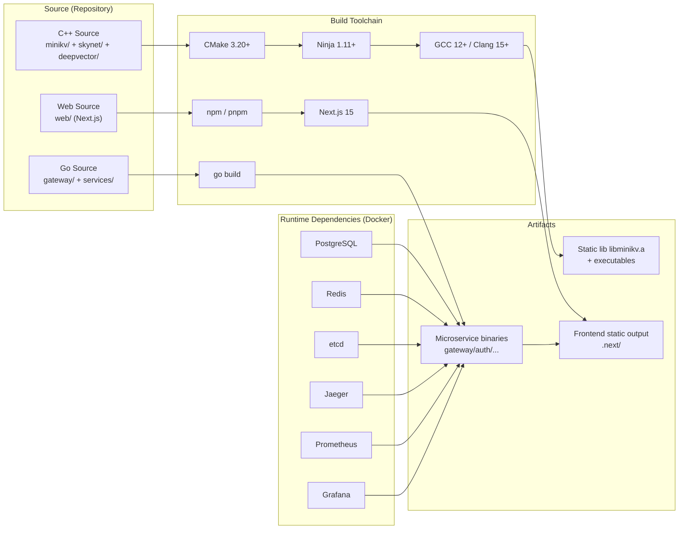

# Module 00 — Cross-Platform Environment Setup

> Source: top-level [CMakeLists.txt](file:///c:/Users/Administrator/Desktop/hellocpp/CMakeLists.txt), [Makefile](file:///c:/Users/Administrator/Desktop/hellocpp/Makefile), [go.mod](file:///c:/Users/Administrator/Desktop/hellocpp/go.mod), [web/package.json](file:///c:/Users/Administrator/Desktop/hellocpp/web/package.json), [deploy/dev/docker-compose.yml](file:///c:/Users/Administrator/Desktop/hellocpp/deploy/dev/docker-compose.yml)

## 1. Why Set Up the Environment First

When we build a distributed project, the first step is always "stock the kitchen." You say you want to cook a grand banquet, but the stove has no gas, you only have one pan, and half the spices are missing — no matter how good the recipe is, the dish won't come out. This is especially true for TitanKV: it's not a single-language toy, but a "real distributed system" spanning four tech stacks:

- **C++17/20** for the storage engine (`minikv`) and the coroutine network library (`skynet`) — the core highlight of the project, the card you can play in job interviews;
- **Go 1.23** for the upper-layer microservices (`gateway`, `services/{auth,data,meta,observability}`), responsible for auth, routing, metadata, and observability;
- **Next.js 15** (based on Node.js 20) for the console (`web/`), using App Router + TanStack Query for the real-time dashboard;
- **Docker** to spin up a full local dependency stack: Postgres, Redis, etcd, Jaeger, Prometheus, Grafana — miss one, and later Modules will stall.

Analogy: the C++ compiler is the stove (needs enough heat), the Go toolchain is the steamer (fast cooking), the frontend build is the oven (fine plating), and Docker is the pantry (dependency services on demand). All four are indispensable.

We put this module at Module 00 because every subsequent module assumes you can already run the project — Module 01 needs `cmake --build`, Module 07 needs `docker compose up` for Postgres, Module 12 needs `npm run dev`. If the environment isn't ready, every step that follows is friction. So we spend extra ink here to walk through every platform's pitfalls, so you don't doubt your life later.

A senior instructor's advice: **do not skip this chapter.** Even if you're a veteran, run through the "Verify Installation" section to confirm version numbers meet the bar. We've seen too many students stuck for a whole day in Module 09 because their GCC was too old (no C++20 coroutine support) or their Go was too low (apt-installed 1.19).

## 2. Toolchain Overview

Let's first draw the TitanKV toolchain relationships with a Mermaid diagram. With this picture in your head, you won't get lost installing things later:



This diagram tells a core fact: **TitanKV's build is split into streams.** C++ goes through the traditional CMake → Ninja → GCC chain; Go goes through `go build` with its own toolchain; the frontend goes through npm → Next.js. The three artifacts converge at runtime, and the dependency services provided by Docker (Postgres/Redis/etcd etc.) are the "foundation" for Go microservices and frontend integration.

Once you understand this split, you see why we install the C++ toolchain, Go toolchain, Node.js, and Docker separately — they're independent of each other.

## 3. Windows Platform

Windows is the platform most prone to pitfalls in TitanKV development, so we spend the most space on it. Core advice: **prefer WSL2**, and only consider native Windows when "company policy forbids WSL."

### 3.1 Option A: WSL2 + Ubuntu 22.04 (Strongly Recommended)

Why WSL2? Because TitanKV's C++ code (especially Snappy/Zstd pulled by `minikv/cmake/FetchCompression.cmake`) uses Linux-specific syscalls and file path conventions at compile time. The native Windows MSVC compiler doesn't fully support these, and Linux-specific code pulled down by FetchContent may fail to compile outright. WSL2 gives you a real Linux kernel where all Linux tutorial commands work directly — peace of mind.

#### 3.1.1 Enabling WSL2 (Online Installation)

Windows 10 2004+ and Windows 11 ship with WSL2. One command does it:

```bash
# Run in PowerShell (Administrator)
wsl --install
```

This command automatically:
- Enables the "Virtual Machine Platform" and "Windows Subsystem for Linux" optional features;
- Downloads and installs the WSL2 kernel;
- Sets WSL2 as the default version.

You **must restart the computer** after installation — without a restart, `wsl --set-default-version 2` will error out.

After restart, verify WSL2 is ready:

```bash
# Check WSL version and default distribution
wsl --status

# List installed distributions and their WSL version (VERSION column should be 2)
wsl -l -v
```

#### 3.1.2 Enabling WSL2 (Offline Installation, for Intranet/No-Internet Environments)

If you're on a corporate intranet and `wsl --install` can't pull, go the offline package route:

1. Go to the Microsoft official download page (search "WSL2 Linux kernel update package") and download `wsl_update_x64.msi`;
2. Double-click to install;
3. In PowerShell (Administrator), manually enable the features:

```bash
# Enable WSL feature
dism.exe /online /enable-feature /featurename:Microsoft-Windows-Subsystem-Linux /all /norestart

# Enable Virtual Machine Platform
dism.exe /online /enable-feature /featurename:VirtualMachinePlatform /all /norestart
```

4. **Restart the computer**;
5. Set the default version to WSL2:

```bash
wsl --set-default-version 2
```

#### 3.1.3 Installing Ubuntu 22.04

We recommend Ubuntu 22.04 LTS (not 24.04) because 22.04's package sources are more stable, GCC 11 is available by default, and upgrading to GCC 12+ goes smoothly. Of course, 24.04 works too — the commands are identical.

```bash
# Online installation (recommended)
wsl --install -d Ubuntu-22.04

# Offline installation: search Microsoft Store for Ubuntu 22.04, download the .appx package,
# or download from https://aka.ms/wslubuntu2204 and double-click to install
```

When you start Ubuntu for the first time, you'll be asked to create a UNIX username and password. **Remember this password** — you'll need it for `sudo` later.

#### 3.1.4 Configuring VSCode Remote-WSL

Once WSL2 is installed, we want to open the project directory inside WSL2 directly from VSCode on Windows, with the same experience as native Linux development:

1. Install [Visual Studio Code](https://code.visualstudio.com/) on Windows;
2. Open VSCode, press `Ctrl+Shift+X` to open the Extensions Marketplace, search for and install **Remote - WSL** (publisher Microsoft);
3. In the WSL2 terminal, `cd` to the project directory, then:

```bash
# Run in the WSL2 terminal
cd /mnt/c/Users/Administrator/Desktop/hellocpp
code .
```

The first time you run `code .`, it automatically installs the VSCode Server inside WSL2 — wait about 30 seconds. Once done, the bottom-left corner of VSCode shows a green `WSL: Ubuntu-22.04` badge, indicating the connection is live.

#### 3.1.5 Follow the Linux Tutorial Inside WSL2

After completing the above steps, **WSL2 is a standard Ubuntu** — all subsequent tool installations jump straight to **Section 4 Linux Platform**, commands verbatim.

The one caveat is filesystem performance: **project source is best placed in WSL2's native filesystem (under `~/`) rather than `/mnt/c/`**, because cross-filesystem access is 5-10x slower. We can symlink the project over:

```bash
# In WSL2, symlink the Windows project directory to home
ln -s /mnt/c/Users/Administrator/Desktop/hellocpp ~/hellocpp
cd ~/hellocpp
```

This way `git` operations and `cmake` builds are much faster.

### 3.2 Option B: Native Windows (Not Recommended, Has Pitfalls)

If you really can't use WSL2 (e.g., corporate IT policy disables virtualization), then you must go the native Windows route. **Advance warning**: this path has many pitfalls, and the C++ project may fail outright at the FetchContent stage. We'll cover it as completely as we can, but we don't guarantee every Module will run.

#### 3.2.1 Visual Studio 2022 Build Tools

For the C++ compiler we use MSVC (not MinGW — MinGW's C++20 coroutine support is unstable):

1. Go to the [Visual Studio download page](https://visualstudio.microsoft.com/downloads/) and download **Build Tools for Visual Studio 2022**;
2. During installation, check the "Desktop development with C++" workload;
3. Under "Individual components", confirm these are checked:
   - MSVC v143 - VS 2022 C++ x64/x86 build tools (latest version)
   - Windows 11 SDK (or Windows 10 SDK)
   - C++ CMake tools for Windows
4. Finish installation.

After installation, open the "x64 Native Tools Command Prompt for VS 2022" (search the Start menu) and run `cl` — you should see the compiler version.

#### 3.2.2 Install cmake/ninja via vcpkg

Although VS Build Tools ships with CMake, the version may be old. We use vcpkg for unified management:

```powershell
# Run in PowerShell
cd C:\
git clone https://github.com/microsoft/vcpkg.git
cd vcpkg
.\bootstrap-vcpkg.bat

# Add vcpkg to PATH (permanently)
[Environment]::SetEnvironmentVariable("Path", $env:Path + ";C:\vcpkg", "User")

# Install ninja
.\vcpkg install ninja
```

#### 3.2.3 Git for Windows

```powershell
# Install via winget (built into Windows 10 1709+)
winget install --id Git.Git -e --source winget
```

Or go to [git-scm.com](https://git-scm.com/download/win) to download the installer and click through.

#### 3.2.4 Go Windows Installer

```powershell
winget install --id GoLang.Go -e --source winget
```

Or go to [go.dev/dl](https://go.dev/dl/) and download `go1.23.x.windows-amd64.msi`, double-click to install. The installer configures `PATH` automatically.

Verify:

```powershell
go version
# Should output: go version go1.23.x windows/amd64
```

#### 3.2.5 Node.js Windows Installer

```powershell
winget install --id OpenJS.NodeJS.LTS -e --source winget
```

Or go to [nodejs.org](https://nodejs.org/en/download/) and download the LTS version (v20+) Windows Installer, double-click to install.

Verify:

```powershell
node -v
# Should output: v20.x.x
npm -v
```

#### 3.2.6 Docker Desktop

Download [Docker Desktop for Windows](https://www.docker.com/products/docker-desktop/), double-click to install. During installation, check "Use WSL 2 based engine" (even if you don't develop in WSL2, Docker Desktop itself uses the WSL2 kernel to run containers — that's its own business).

After installation, start Docker Desktop and wait for the whale icon in the system tray to turn green. Verify:

```powershell
docker --version
docker compose version
```

#### 3.2.7 Native Windows Pitfall Warnings

We stress again: running the C++ part of TitanKV on native Windows will hit these pitfalls:

1. **FetchContent fails to pull Snappy/Zstd**: The CMakeLists of these two libraries may have compatibility issues under MSVC. Errors are typically "cannot find `unistd.h`" or "`_POSIX_C_SOURCE` undefined". The fix is to manually patch or switch to WSL2.
2. **C++20 coroutines in `skynet`**: MSVC's C++20 coroutine support is only stable in newer versions — you need VS 2022 17.6+. Older versions may report `experimental`-related errors.
3. **Path separators**: Filenames like `env_posix.cpp` hint at a Linux leaning, and may need extra adaptation on Windows.
4. **Makefile unavailable**: The top-level `Makefile` uses GNU Make syntax, which native Windows lacks. You'll need to run `cmake` commands manually.

Our advice: **if C++ compilation errors out after Module 01 and isn't solved within 10 minutes, switch back to WSL2 immediately.** Don't bang your head against native Windows — your time is worth more.

## 4. Linux Platform

Linux is TitanKV's "home turf" — all commands are first-class citizens. We focus here.

### 4.1 Ubuntu 22.04 LTS / 24.04 LTS (Most Recommended)

#### 4.1.1 Update apt Sources

First update the package index to ensure you get the latest versions:

```bash
sudo apt update && sudo apt upgrade -y
```

If you're in China, we recommend switching to the Aliyun or Tsinghua mirror — downloads will be 10x faster:

```bash
# Back up the original sources (Ubuntu 22.04)
sudo cp /etc/apt/sources.list /etc/apt/sources.list.bak

# Switch to Aliyun mirror (Ubuntu 22.04)
sudo sed -i 's|http://archive.ubuntu.com|https://mirrors.aliyun.com|g' /etc/apt/sources.list
sudo sed -i 's|http://security.ubuntu.com|https://mirrors.aliyun.com|g' /etc/apt/sources.list

# Ubuntu 24.04 uses the new format /etc/apt/sources.list.d/ubuntu.sources,
# similar operation — just replace the URLs

sudo apt update
```

#### 4.1.2 Install C++ Toolchain: build-essential / cmake / ninja / git

```bash
# build-essential includes gcc/g++/make
sudo apt install -y build-essential

# cmake (note: Ubuntu 22.04 apt installs 3.22, which meets the 3.20+ requirement)
sudo apt install -y cmake

# ninja-build (apt installs 1.11, meets the requirement)
sudo apt install -y ninja-build

# git
sudo apt install -y git
```

But! Ubuntu 22.04's `build-essential` ships GCC 11 by default, **which doesn't meet our GCC 12+ requirement** (C++20 coroutines need GCC 12+). We manually add a PPA to upgrade:

```bash
# Add the toolchain PPA (officially maintained, safe)
sudo add-apt-repository -y ppa:ubuntu-toolchain-r/test
sudo apt update

# Install GCC 12 and G++ 12
sudo apt install -y gcc-12 g++-12

# Set as default
sudo update-alternatives --install /usr/bin/gcc gcc /usr/bin/gcc-12 100
sudo update-alternatives --install /usr/bin/g++ g++ /usr/bin/g++-12 100

# Verify
gcc --version
g++ --version
# Should output 12.x.x
```

Ubuntu 24.04 ships GCC 13 — no need to upgrade, just `sudo apt install -y build-essential`.

#### 4.1.3 Go 1.23 Manual Installation (Don't Use the Old apt Version)

Ubuntu 22.04's apt installs Go 1.19, **far too old** (the project's `go.mod` requires 1.23+). We manually download the official package — this is the Go-recommended approach:

```bash
# Download Go 1.23.4 (check https://go.dev/dl/ for the latest 1.23.x version)
wget https://go.dev/dl/go1.23.4.linux-amd64.tar.gz

# Remove old version (if apt installed before)
sudo rm -rf /usr/local/go

# Extract to /usr/local
sudo tar -C /usr/local -xzf go1.23.4.linux-amd64.tar.gz

# Configure environment variables (write to ~/.bashrc or ~/.zshrc)
echo 'export PATH=$PATH:/usr/local/go/bin' >> ~/.bashrc
echo 'export GOPATH=$HOME/go' >> ~/.bashrc
echo 'export PATH=$PATH:$GOPATH/bin' >> ~/.bashrc

# Reload config
source ~/.bashrc

# Verify
go version
# Should output: go version go1.23.4 linux/amd64
```

If downloads are slow in China, use the USTC mirror:

```bash
wget https://golang.google.cn/dl/go1.23.4.linux-amd64.tar.gz
```

The Go module proxy should also be switched to a domestic mirror, otherwise `go mod tidy` will hang for ages:

```bash
go env -w GO111MODULE=on
go env -w GOPROXY=https://goproxy.cn,direct
go env -w GOSUMDB=sum.golang.google.cn
```

#### 4.1.4 Node.js 20 via NodeSource

The Node.js shipped with Ubuntu apt is 12.x — far too old. We use the NodeSource official repo for 20.x:

```bash
# Add NodeSource repo (Node.js 20.x)
curl -fsSL https://deb.nodesource.com/setup_20.x | sudo -E bash -

# Install
sudo apt install -y nodejs

# Verify
node -v
# Should output: v20.x.x
npm -v
```

If the NodeSource script is slow in China, you can use nvm instead (see Section 7 for common issues).

#### 4.1.5 Docker Engine via Official Repository

Don't use the `docker.io` package from apt — that version is too old. We use the Docker official repo:

```bash
# Uninstall old versions (if any)
sudo apt remove -y docker docker-engine docker.io containerd runc

# Install required dependencies
sudo apt install -y ca-certificates curl gnupg lsb-release

# Add Docker's official GPG key
sudo install -m 0755 -d /etc/apt/keyrings
curl -fsSL https://download.docker.com/linux/ubuntu/gpg | sudo gpg --dearmor -o /etc/apt/keyrings/docker.gpg
sudo chmod a+r /etc/apt/keyrings/docker.gpg

# Add Docker repo
echo "deb [arch=$(dpkg --print-architecture) signed-by=/etc/apt/keyrings/docker.gpg] https://download.docker.com/linux/ubuntu $(lsb_release -cs) stable" | sudo tee /etc/apt/sources.list.d/docker.list > /dev/null

# Install Docker Engine + Compose plugin
sudo apt update
sudo apt install -y docker-ce docker-ce-cli containerd.io docker-buildx-plugin docker-compose-plugin

# Add current user to the docker group to avoid sudo
sudo usermod -aG docker $USER

# Make the group change take effect (choose one of two ways)
newgrp docker
# Or log out and log back in

# Verify
docker --version
# Should output: Docker version 24.x.x or higher
docker compose version
```

If pulling Docker images is slow in China, configure a registry mirror:

```bash
sudo mkdir -p /etc/docker
sudo tee /etc/docker/daemon.json <<EOF
{
  "registry-mirrors": [
    "https://docker.m.daocloud.io",
    "https://dockerproxy.com"
  ]
}
EOF

sudo systemctl daemon-reload
sudo systemctl restart docker
```

#### 4.1.6 One-Shot Verification

After installing everything above, run the verification commands:

```bash
echo "=== C++ Toolchain ==="
cmake --version      # expect 3.20+
ninja --version      # expect 1.11+
gcc --version        # expect 12+
g++ --version        # expect 12+
git --version        # expect 2.30+

echo "=== Go ==="
go version           # expect 1.23+

echo "=== Node.js ==="
node -v              # expect v20+
npm -v

echo "=== Docker ==="
docker --version     # expect 24+
docker compose version
```

### 4.2 Debian 12

Debian 12 (Bookworm) commands are nearly identical to Ubuntu — we only list the differences:

```bash
# Update sources
sudo apt update && sudo apt upgrade -y

# C++ toolchain: Debian 12 ships GCC 12, which meets the requirement
sudo apt install -y build-essential cmake ninja-build git

# Verify GCC version (Debian 12 default is 12.2, OK)
gcc --version

# Go 1.23 manual install (same as Ubuntu — apt installs 1.19, too old)
wget https://go.dev/dl/go1.23.4.linux-amd64.tar.gz
sudo rm -rf /usr/local/go
sudo tar -C /usr/local -xzf go1.23.4.linux-amd64.tar.gz
echo 'export PATH=$PATH:/usr/local/go/bin' >> ~/.bashrc
source ~/.bashrc

# Node.js 20 via NodeSource (same as Ubuntu)
curl -fsSL https://deb.nodesource.com/setup_20.x | sudo -E bash -
sudo apt install -y nodejs

# Docker: swap "ubuntu" for "debian"
curl -fsSL https://download.docker.com/linux/debian/gpg | sudo gpg --dearmor -o /etc/apt/keyrings/docker.gpg
echo "deb [arch=$(dpkg --print-architecture) signed-by=/etc/apt/keyrings/docker.gpg] https://download.docker.com/linux/debian $(lsb_release -cs) stable" | sudo tee /etc/apt/sources.list.d/docker.list > /dev/null
sudo apt update
sudo apt install -y docker-ce docker-ce-cli containerd.io docker-buildx-plugin docker-compose-plugin
sudo usermod -aG docker $USER
```

Debian 12 notes:
- Package name differences: `ninja-build` (same on Debian/Ubuntu), but some dev libraries like `libssl-dev` have different version numbers on Debian — look them up when needed;
- Debian doesn't install `sudo` by default. If you log in as root, you don't need `sudo`; if you're a regular user, first `apt install sudo` and add yourself to the `sudo` group;
- Debian's `lsb_release -cs` outputs `bookworm`, and the Docker repo must match.

### 4.3 Fedora 39/40

Fedora uses `dnf`, with simpler commands. Fedora 40 ships GCC 14 and CMake 3.28 — a very fresh toolchain:

```bash
# Upgrade system
sudo dnf upgrade -y

# C++ toolchain
sudo dnf groupinstall -y "Development Tools"
sudo dnf install -y cmake ninja-build git gcc-c++

# Verify
gcc --version        # Fedora 40 is 14.x
cmake --version      # 3.28+
ninja --version

# Go 1.23 manual install (Fedora dnf installs 1.22, slightly low — recommend manual)
wget https://go.dev/dl/go1.23.4.linux-amd64.tar.gz
sudo rm -rf /usr/local/go
sudo tar -C /usr/local -xzf go1.23.4.linux-amd64.tar.gz
echo 'export PATH=$PATH:/usr/local/go/bin' >> ~/.bashrc
source ~/.bashrc
go version

# Node.js 20 (Fedora's official repo has 20.x)
sudo dnf install -y nodejs npm
node -v

# Docker
sudo dnf install -y dnf-plugins-core
sudo dnf config-manager --add-repo https://download.docker.com/linux/fedora/docker-ce.repo
sudo dnf install -y docker-ce docker-ce-cli containerd.io docker-buildx-plugin docker-compose-plugin
sudo systemctl enable --now docker
sudo usermod -aG docker $USER
newgrp docker
docker --version
```

Fedora notes:
- SELinux is on by default. If a Docker container has trouble accessing host files, temporarily `sudo setenforce 0` to troubleshoot; the long-term fix is to configure correct SELinux policies;
- Fedora upgrades fast — a new major version every 6 months. We recommend sticking to stable even-numbered releases like 40/41.

## 5. macOS Platform

The macOS development experience is excellent, but we need to split into Apple Silicon and Intel paths — the main difference is Docker performance.

### 5.1 Apple Silicon (M1/M2/M3/M4)

#### 5.1.1 Xcode Command Line Tools

Install this first — it provides `clang`, `git`, `make`, and other basics:

```bash
# Install (will prompt for confirmation)
xcode-select --install
```

If you already have the full Xcode installed, you can skip this. Verify:

```bash
clang --version
git --version
```

#### 5.1.2 Homebrew Installation

Homebrew is the macOS package manager — a must-have:

```bash
# Official install script
/bin/bash -c "$(curl -fsSL https://raw.githubusercontent.com/Homebrew/install/HEAD/install.sh)"
```

If GitHub is unreachable in China, use the USTC mirror:

```bash
# Install Homebrew via USTC mirror
/bin/bash -c "$(curl -fsSL https://gitee.com/cunkai/HomebrewCN/raw/master/Homebrew.sh)"
```

On Apple Silicon, Homebrew installs to `/opt/homebrew` — you need to configure PATH (the install script will prompt):

```bash
# Write to ~/.zshrc (macOS default shell is zsh)
echo 'eval "$(/opt/homebrew/bin/brew shellenv)"' >> ~/.zshrc
source ~/.zshrc

# Verify
brew --version
```

#### 5.1.3 Install the Toolchain

```bash
# C++ toolchain
brew install cmake ninja

# Note: on macOS we use clang (Apple-bundled), not GCC
# Apple Clang supports C++20 coroutines by default — no extra steps
clang --version

# Go
brew install go
go version

# Node.js 20
brew install node@20
echo 'export PATH="/opt/homebrew/opt/node@20/bin:$PATH"' >> ~/.zshrc
source ~/.zshrc
node -v

# Git (system-bundled, but brew version is newer)
brew install git
git --version
```

#### 5.1.4 Docker Desktop for Mac (Apple Silicon)

On Apple Silicon, Docker Desktop uses Apple Hypervisor virtualization to run Linux containers — performance is slightly worse than Intel Mac but fully usable:

1. Download [Docker Desktop for Mac with Apple silicon](https://www.docker.com/products/docker-desktop/);
2. Double-click the `.dmg` and drag to Applications;
3. Start Docker.app and wait for the whale icon to turn green;
4. In Settings → Resources, allocate at least 4GB of RAM (the default 2GB will be tight when running the full TitanKV stack).

Verify:

```bash
docker --version
docker compose version

# Run an arm64 container to test
docker run --rm hello-world
```

Apple Silicon notes:
- Docker images should be `arm64` or `multi-arch` versions — Postgres/Redis/etcd all have official arm64 images, no problem;
- If you encounter an `amd64`-only image (rare), Docker Desktop will emulate via QEMU — slow but works;
- `skynet` and `minikv` compile natively on Apple Silicon — clang directly produces arm64 binaries.

### 5.2 Intel Mac

Intel Mac commands are nearly identical to Apple Silicon — the differences:

```bash
# Homebrew installs to /usr/local (not /opt/homebrew)
/bin/bash -c "$(curl -fsSL https://raw.githubusercontent.com/Homebrew/install/HEAD/install.sh)"

# PATH config (Intel path)
echo 'eval "$(/usr/local/bin/brew shellenv)"' >> ~/.zshrc
source ~/.zshrc

# Subsequent brew install commands are identical
brew install cmake ninja go node@20 git
```

Intel Mac advantages:
- Docker Desktop performs better (native virtualization, no Rosetta);
- Better third-party library compatibility (many old libraries only have amd64 binaries).

Disadvantages:
- The Mac line is discontinued; Apple will gradually drop Intel support;
- Compile speed is 2-3x slower than M-series chips.

If you're still doing heavy C++ compilation on an Intel Mac, we strongly recommend upgrading to Apple Silicon — the experience gap is huge.

## 6. Verify Installation (Cross-Platform Universal)

We've consolidated the verification commands for all platforms into a single script. Run it once to confirm the environment is ready.

Save the following as `check-env.sh` (Linux/macOS/WSL2) or `check-env.ps1` (Windows PowerShell):

```bash
#!/usr/bin/env bash
# TitanKV environment verification script
# Usage: bash check-env.sh

set -e

GREEN='\033[0;32m'
RED='\033[0;31m'
NC='\033[0m'

pass() { echo -e "${GREEN}[✓]${NC} $1"; }
fail() { echo -e "${RED}[✗]${NC} $1"; FAILED=1; }

FAILED=0

echo "========================================="
echo "  TitanKV Environment Check"
echo "========================================="

# --- C++ Toolchain ---
echo ""
echo "--- C++ Toolchain ---"

if command -v cmake &> /dev/null; then
    CMAKE_VER=$(cmake --version | head -1 | awk '{print $3}')
    CMAKE_MAJOR=$(echo $CMAKE_VER | cut -d. -f1)
    CMAKE_MINOR=$(echo $CMAKE_VER | cut -d. -f2)
    if [ "$CMAKE_MAJOR" -ge 3 ] && [ "$CMAKE_MINOR" -ge 20 ] || [ "$CMAKE_MAJOR" -gt 3 ]; then
        pass "CMake $CMAKE_VER (>= 3.20)"
    else
        fail "CMake $CMAKE_VER (need >= 3.20)"
    fi
else
    fail "CMake not found"
fi

if command -v ninja &> /dev/null; then
    NINJA_VER=$(ninja --version)
    pass "Ninja $NINJA_VER"
else
    fail "Ninja not found (recommended for faster builds)"
fi

# GCC or Clang
if command -v g++ &> /dev/null; then
    GCC_VER=$(g++ --version | head -1 | grep -oE '[0-9]+\.[0-9]+\.[0-9]+' | head -1)
    GCC_MAJOR=$(echo $GCC_VER | cut -d. -f1)
    if [ "$GCC_MAJOR" -ge 12 ]; then
        pass "GCC $GCC_VER (>= 12)"
    else
        fail "GCC $GCC_VER (need >= 12 for C++20 coroutines)"
    fi
elif command -v clang++ &> /dev/null; then
    CLANG_VER=$(clang++ --version | head -1 | grep -oE '[0-9]+\.[0-9]+\.[0-9]+' | head -1)
    CLANG_MAJOR=$(echo $CLANG_VER | cut -d. -f1)
    if [ "$CLANG_MAJOR" -ge 15 ]; then
        pass "Clang $CLANG_VER (>= 15)"
    else
        fail "Clang $CLANG_VER (need >= 15)"
    fi
else
    fail "No C++ compiler found (GCC or Clang)"
fi

# --- Git ---
echo ""
echo "--- Git ---"
if command -v git &> /dev/null; then
    GIT_VER=$(git --version | awk '{print $3}')
    pass "Git $GIT_VER"
else
    fail "Git not found"
fi

# --- Go ---
echo ""
echo "--- Go ---"
if command -v go &> /dev/null; then
    GO_VER=$(go version | awk '{print $3}' | sed 's/go//')
    GO_MAJOR=$(echo $GO_VER | cut -d. -f1)
    GO_MINOR=$(echo $GO_VER | cut -d. -f2)
    if [ "$GO_MAJOR" -ge 1 ] && [ "$GO_MINOR" -ge 23 ] || [ "$GO_MAJOR" -gt 1 ]; then
        pass "Go $GO_VER (>= 1.23)"
    else
        fail "Go $GO_VER (need >= 1.23)"
    fi
else
    fail "Go not found"
fi

# --- Node.js ---
echo ""
echo "--- Node.js ---"
if command -v node &> /dev/null; then
    NODE_VER=$(node -v | sed 's/v//')
    NODE_MAJOR=$(echo $NODE_VER | cut -d. -f1)
    if [ "$NODE_MAJOR" -ge 20 ]; then
        pass "Node.js $NODE_VER (>= 20)"
    else
        fail "Node.js $NODE_VER (need >= 20)"
    fi
    NPM_VER=$(npm -v)
    pass "npm $NPM_VER"
else
    fail "Node.js not found"
fi

# --- Docker ---
echo ""
echo "--- Docker ---"
if command -v docker &> /dev/null; then
    DOCKER_VER=$(docker --version | awk '{print $3}' | tr -d ',')
    DOCKER_MAJOR=$(echo $DOCKER_VER | cut -d. -f1)
    if [ "$DOCKER_MAJOR" -ge 24 ]; then
        pass "Docker $DOCKER_VER (>= 24)"
    else
        fail "Docker $DOCKER_VER (need >= 24)"
    fi

    if docker compose version &> /dev/null; then
        pass "Docker Compose plugin available"
    else
        fail "Docker Compose plugin missing"
    fi

    # Check Docker daemon is running
    if docker info &> /dev/null; then
        pass "Docker daemon is running"
    else
        fail "Docker daemon not running (start Docker Desktop or 'sudo systemctl start docker')"
    fi
else
    fail "Docker not found"
fi

# --- Summary ---
echo ""
echo "========================================="
if [ "$FAILED" -eq 0 ]; then
    echo -e "${GREEN}  All checks passed! Welcome to TitanKV.${NC}"
else
    echo -e "${RED}  Some checks failed. Fix them before Module 01.${NC}"
fi
echo "========================================="
```

Usage:

```bash
# Make it executable
chmod +x check-env.sh

# Run
./check-env.sh
```

Expected output (all green ✓):

```
=========================================
  TitanKV Environment Check
=========================================

--- C++ Toolchain ---
[✓] CMake 3.22.0 (>= 3.20)
[✓] Ninja 1.11.1
[✓] GCC 12.3.0 (>= 12)

--- Git ---
[✓] Git 2.34.1

--- Go ---
[✓] Go 1.23.4 (>= 1.23)

--- Node.js ---
[✓] Node.js 20.18.0 (>= 20)
[✓] npm 10.8.2

--- Docker ---
[✓] Docker 24.0.7 (>= 24)
[✓] Docker Compose plugin available
[✓] Docker daemon is running

=========================================
  All checks passed! Welcome to TitanKV.
=========================================
```

If any `[✗]` appears, go back to the relevant platform section and reinstall that tool.

## 7. Common Issues Troubleshooting

This section collects the pitfalls students hit most often, grouped by issue type.

### 7.1 WSL2 Installation Fails (Error Code 0x800701bc)

**Symptom**: Running `wsl --install` or starting WSL2 reports `WslRegisterDistribution failed with error: 0x800701bc`.

**Cause**: The WSL2 kernel version is too old, or virtualization isn't enabled in BIOS.

**Fix**:

```powershell
# 1. Download and install the latest WSL2 kernel update package
#    https://wslstorestorage.blob.core.windows.net/wslblob/wsl_update_x64.msi
#    Double-click to install

# 2. Set the default version to WSL2
wsl --set-default-version 2

# 3. Restart the computer
```

If it still doesn't work, check BIOS:
- Intel CPU: enable "Intel Virtualization Technology (VT-x)";
- AMD CPU: enable "SVM Mode".

### 7.2 Go Version Too Low (apt Installed 1.19, How to Upgrade)

**Symptom**: `go version` outputs `go1.19`, but the project's `go.mod` requires `go 1.23`. Running `go build` reports `go.mod requires go >= 1.23`.

**Cause**: Ubuntu 22.04 apt ships Go 1.19.

**Fix**: Manually install the official package (see 4.1.3). The key is to **uninstall the apt version first**:

```bash
# Uninstall the apt version
sudo apt remove -y golang-go
sudo apt autoremove -y

# Check for leftovers
which go
# Should output nothing, or point to /usr/local/go/bin/go (new version)

# Install official 1.23
wget https://go.dev/dl/go1.23.4.linux-amd64.tar.gz
sudo rm -rf /usr/local/go
sudo tar -C /usr/local -xzf go1.23.4.linux-amd64.tar.gz
echo 'export PATH=$PATH:/usr/local/go/bin' >> ~/.bashrc
source ~/.bashrc
go version
```

### 7.3 Node Version Management (nvm Recommended)

**Symptom**: You have multiple Node projects on the system requiring different Node versions, and switching is a hassle.

**Fix**: Use nvm (Node Version Manager) to manage multiple versions:

```bash
# Install nvm
curl -o- https://raw.githubusercontent.com/nvm-sh/nvm/v0.40.1/install.sh | bash

# Make nvm take effect
source ~/.bashrc

# Verify
nvm --version

# Install Node.js 20 (set as default)
nvm install 20
nvm alias default 20
nvm use 20

# Switch versions
nvm install 18
nvm use 18
nvm use 20

# List installed versions
nvm ls
```

macOS works the same way — nvm is cross-platform.

### 7.4 Docker Permission Issue (permission denied while trying to connect to Docker daemon)

**Symptom**: Running `docker ps` reports `permission denied`; you must add `sudo`.

**Cause**: The current user isn't in the `docker` group.

**Fix**:

```bash
# Add current user to the docker group
sudo usermod -aG docker $USER

# Make the group change take effect (important!)
newgrp docker

# Or log out and log back in

# Verify (no sudo needed)
docker ps
```

If `newgrp docker` doesn't take effect, restart the computer — that's the most reliable.

### 7.5 CMake Can't Find Packages (FETCHCONTENT Download Failure)

**Symptom**: Running `cmake -B build` hangs at the `FetchContent` stage, reporting `Failed to connect to github.com` or a download timeout.

**Cause**: GitHub access is unstable in China; FetchContent can't pull Snappy/Zstd/gtest.

**Fix**: Configure a proxy or switch mirrors.

Option A: Configure a git proxy (if you have a proxy tool):

```bash
# Assuming the proxy is at 127.0.0.1:7890
git config --global http.proxy http://127.0.0.1:7890
git config --global https.proxy http://127.0.0.1:7890

# Remove when done
git config --global --unset http.proxy
git config --global --unset https.proxy
```

Option B: Configure proxy env vars for CMake:

```bash
export HTTP_PROXY=http://127.0.0.1:7890
export HTTPS_PROXY=http://127.0.0.1:7890
cmake -B build -DCMAKE_BUILD_TYPE=Release
```

Option C: Manually download dependencies into the cache directory so FetchContent skips downloading. Check `minikv/cmake/FetchCompression.cmake` for the URLs and target paths, and pre-download into the right place.

Option D: Use a GitHub mirror (not recommended, unstable):

```bash
# Temporarily swap github.com for a mirror
git config --global url."https://ghproxy.com/https://github.com/".insteadOf "https://github.com/"
```

### 7.6 C++ Compilation Error (GCC Too Old for C++20 Coroutines)

**Symptom**: Compiling `skynet` reports `error: 'std::coroutine_traits' has not been declared` or `std::experimental::coroutine_traits`.

**Cause**: GCC < 12 doesn't support C++20 coroutines; GCC 12 fully supports them.

**Fix**: Upgrade GCC to 12+, see 4.1.2. Verify:

```bash
g++ --version
# Must be 12.x or higher

# Test whether C++20 coroutines are available
cat > /tmp/test_coro.cpp << 'EOF'
#include <coroutine>
#include <iostream>

struct Task {
    struct promise_type {
        Task get_return_object() { return {}; }
        std::suspend_never initial_suspend() { return {}; }
        std::suspend_never final_suspend() noexcept { return {}; }
        void return_void() {}
        void unhandled_exception() {}
    };
};

Task hello() {
    std::cout << "C++20 coroutine works!\n";
    co_return;
}

int main() {
    hello();
    return 0;
}
EOF

g++ -std=c++20 -fcoroutines /tmp/test_coro.cpp -o /tmp/test_coro
/tmp/test_coro
# Should output: C++20 coroutine works!
```

If the above code compiles and runs, your GCC is fully OK and can compile `skynet`.

### 7.7 Docker Desktop Won't Start (WSL2 Related)

**Symptom**: After Docker Desktop starts, the whale icon stays red, with a "WSL2 installation is incomplete" message.

**Fix**:

```powershell
# 1. Make sure WSL2 is enabled
wsl --status

# 2. Update the WSL2 kernel
wsl --update

# 3. Restart Docker Desktop
```

If it still doesn't work, check whether Windows features are enabled:

```powershell
# In PowerShell (Administrator)
dism.exe /online /enable-feature /featurename:VirtualMachinePlatform /all /norestart
dism.exe /online /enable-feature /featurename:Microsoft-Windows-Subsystem-Linux /all /norestart
# Restart the computer
```

### 7.8 Make Not Found (Native Windows)

**Symptom**: Running `make build` in Windows PowerShell reports `make: command not found`.

**Cause**: Native Windows doesn't have GNU Make.

**Fix**:

```powershell
# Install via Chocolatey
choco install make

# Or via winget
winget install GnuWin32.Make
```

Or skip `make` and run the underlying commands directly:

```powershell
cmake -B build -DCMAKE_BUILD_TYPE=Release -DENABLE_TESTS=ON
cmake --build build -j
ctest --test-dir build --output-on-failure
```

## 8. IDE Recommended Configuration

A craftsman must sharpen his tools to do good work. We recommend two IDE setups.

### 8.1 VSCode (Recommended, Free)

VSCode is TitanKV's primary IDE for three reasons: free, cross-platform, and Remote-WSL provides a top-notch experience.

#### 8.1.1 Must-Have Extensions

Open the VSCode Extensions Marketplace (`Ctrl+Shift+X`) and search for and install:

| Extension | Publisher | Purpose |
|---|---|---|
| **C/C++** | Microsoft | C/C++ IntelliSense, debugging |
| **CMake Tools** | Microsoft | CMake project integration, build, debug |
| **Go** | Go Team | Go language support, debug, testing |
| **Remote - WSL** | Microsoft | WSL2 remote development (must-have for Windows users) |
| **Remote - SSH** | Microsoft | Remote Linux server development (optional) |
| **Docker** | Microsoft | Docker container management |
| **YAML** | Red Hat | docker-compose.yml highlighting |
| **Markdown All in One** | Yu Zhang | Writing docs (this project has many .md files) |
| **Tailwind CSS IntelliSense** | Tailwind Labs | web/ frontend development |

#### 8.1.2 c_cpp_properties.json Example

Create `.vscode/c_cpp_properties.json` in the project root so IntelliSense resolves include paths correctly:

```json
{
    "version": 4,
    "configurations": [
        {
            "name": "Linux (WSL)",
            "includePath": [
                "${workspaceFolder}/**",
                "${workspaceFolder}/minikv/include",
                "${workspaceFolder}/minikv/src/core",
                "${workspaceFolder}/minikv/src/utils",
                "${workspaceFolder}/minikv/src/network",
                "${workspaceFolder}/skynet/include",
                "${workspaceFolder}/deepvector/include",
                "${workspaceFolder}/build/_deps/*-src/**",
                "${workspaceFolder}/minikv/build/_deps/*-src/**"
            ],
            "defines": [
                "_DEBUG",
                "UNICODE",
                "_UNICODE"
            ],
            "cStandard": "c17",
            "cppStandard": "c++17",
            "intelliSenseMode": "linux-gcc-x64",
            "configurationProvider": "ms-vscode.cmake-tools"
        },
        {
            "name": "macOS (Clang)",
            "includePath": [
                "${workspaceFolder}/**",
                "${workspaceFolder}/minikv/include",
                "${workspaceFolder}/skynet/include",
                "${workspaceFolder}/deepvector/include"
            ],
            "defines": [],
            "cStandard": "c17",
            "cppStandard": "c++20",
            "intelliSenseMode": "macos-clang-arm64",
            "configurationProvider": "ms-vscode.cmake-tools"
        }
    ]
}
```

Note the `_deps/*-src/**` in `includePath` — that's where CMake FetchContent downloads dependencies (gtest, snappy, zstd). It only exists after the first build, so IntelliSense may show red squiggles before the first build; restart VSCode after building and it'll resolve.

#### 8.1.3 Recommended settings.json

`.vscode/settings.json`:

```json
{
    "cmake.buildDirectory": "${workspaceFolder}/build",
    "cmake.configureSettings": {
        "CMAKE_BUILD_TYPE": "Debug",
        "ENABLE_TESTS": "ON"
    },
    "cmake.generator": "Ninja",
    "C_Cpp.default.configurationProvider": "ms-vscode.cmake-tools",
    "go.gopath": "~/go",
    "go.useLanguageServer": true,
    "editor.formatOnSave": true,
    "[cpp]": {
        "editor.defaultFormatter": "ms-vscode.cpptools"
    },
    "[go]": {
        "editor.defaultFormatter": "golang.go"
    },
    "files.associations": {
        "*.h": "cpp",
        "*.cpp": "cpp",
        "CMakeLists.txt": "cmake"
    }
}
```

#### 8.1.4 tasks.json (Optional, Quick Build)

`.vscode/tasks.json`:

```json
{
    "version": "2.0.0",
    "tasks": [
        {
            "label": "TitanKV: CMake Build (Debug)",
            "type": "shell",
            "command": "cmake --build build -j",
            "group": "build",
            "problemMatcher": ["$gcc"]
        },
        {
            "label": "TitanKV: CMake Test",
            "type": "shell",
            "command": "ctest --test-dir build --output-on-failure",
            "group": "test",
            "dependsOn": "TitanKV: CMake Build (Debug)"
        },
        {
            "label": "TitanKV: Go Test",
            "type": "shell",
            "command": "go test ./...",
            "group": "test"
        },
        {
            "label": "TitanKV: Docker Up",
            "type": "shell",
            "command": "docker compose -f deploy/dev/docker-compose.yml up -d"
        }
    ]
}
```

### 8.2 CLion (Paid but Excellent)

If you have budget (students can apply for a free educational license), CLion is a top-tier C++ IDE with deeper CMake project support than VSCode.

#### 8.2.1 Configuring the Project

1. Open CLion, `File → Open`, and select the project root's `CMakeLists.txt`;
2. CLion will auto-detect the CMake project — select the toolchain (default GCC on Linux, default Clang on macOS);
3. In `Settings → Build, Execution, Deployment → CMake`, configure:
   - **Build type**: Debug
   - **Build options**: `-j 8` (use Ninja to accelerate)
   - **CMake options**: `-DENABLE_TESTS=ON`
4. Apply and CLion will auto-configure — wait for the progress bar in the bottom-right corner.

#### 8.2.2 Configuring the skynet Subproject

Because `skynet` builds standalone, you need to open `skynet/CMakeLists.txt` separately in CLion, or use "Open Project in New Window" to open `skynet`.

CLion advantages:
- Refactoring (Rename, Extract Method) is more accurate than VSCode;
- The debugger integrates LLDB/GDB — breakpoints and variable watches are first-class;
- Built-in static analysis catches potential bugs.

Disadvantages:
- Memory-hungry (recommend 8GB+ RAM machines);
- Slow startup; first indexing of large projects takes 1-2 minutes.

### 8.3 Other Options

- **Neovim + LSP**: For advanced users — configure `clangd` + `gopls` and the experience rivals VSCode with faster startup;
- **Visual Studio 2022 Community** (Windows only): The best C++ debugging experience, but the project needs to use MSBuild instead of CMake (though CMake is supported) — not recommended for TitanKV;
- **GoLand**: If you only do the Go parts (`gateway`, `services`), the experience beats VSCode's Go extension, but you still need a separate IDE for C++.

Our final recommendation: **VSCode (Remote-WSL) as the main, occasionally CLion for deep debugging.**

## 9. Next Steps

With the environment set up, we'll now actually run the project and understand the overall architecture. Module 01 will guide us to:

- Build `minikv` and `skynet` with `cmake` and `ninja`, and run the C++ unit tests;
- Compile `gateway` and `services` with `go build`, and start the Go microservices;
- Start the Next.js console with `npm run dev`;
- Bring up the local dependency stack with `docker compose up`;
- Read through [README.md](file:///c:/Users/Administrator/Desktop/hellocpp/README.md) and [docs/REFACTORING.md](file:///c:/Users/Administrator/Desktop/hellocpp/docs/REFACTORING.md) to understand TitanKV's 9-phase refactoring roadmap.

Remember: **an all-green environment verification script is your ticket into Module 01.** If any red `[✗]` remains, go back to the relevant section and fix it before continuing.

See you in Module 01.

---

← [Course Outline](./README.md) | [Next Module: Module 01](./01-overview.md) →
