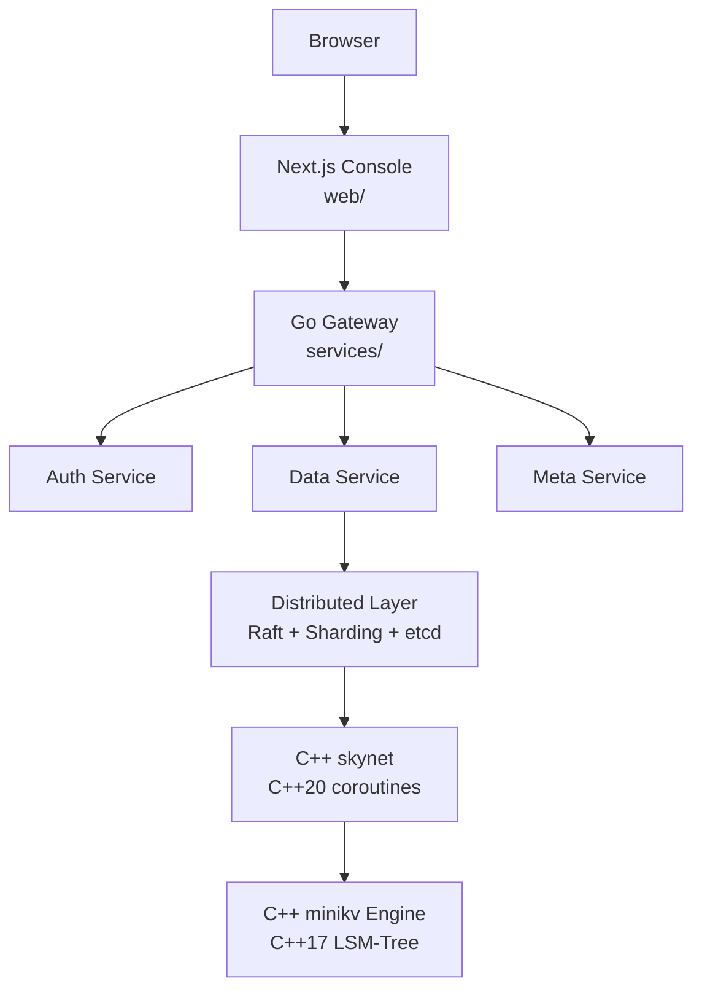

# Module 01 — Environment Setup & Project Overview

> Source: top-level [CMakeLists.txt](file:///c:/Users/Administrator/Desktop/hellocpp/CMakeLists.txt), [Makefile](file:///c:/Users/Administrator/Desktop/hellocpp/Makefile), [README.md](file:///c:/Users/Administrator/Desktop/hellocpp/README.md), [docs/REFACTORING.md](file:///c:/Users/Administrator/Desktop/hellocpp/docs/REFACTORING.md)

## Background & Motivation

Before we write a single line of code, we need to read the blueprints. Would you start building a house without studying the architect's drawings first? Distributed storage systems are the same — without grasping the layered architecture, the build system, and the refactoring roadmap, every later module will feel like assembling furniture without the instructions. This module exists to give you that bird's-eye view of TitanKV, so you know which piece goes where and why before the details start flying.

In the overall journey, this is Module 01 — the foundation. We deliberately walk through the directory layout, the CMake build graph, and the Makefile entry points before touching C++ syntax in Module 02 or concurrency in Module 03. By the end, you should be able to navigate the repository with confidence, run `make build` / `make test` locally, and trace a write request from the API down to the LSM-Tree engine on disk. Think of it as calibrating your mental map before the expedition begins.

After this module, you'll be able to answer interview questions like "Walk me through the architecture of a distributed KV store," "Why split the storage engine from the network library in different C++ standards?", and "What does a typical local dev stack for a storage project look like?" You'll also have a clean mental scaffold onto which every subsequent module — C++ core, modern C++, Go services, SkipList — can hang its details. Most importantly, you'll stop feeling lost in the repo and start feeling at home.

## 1. Core Knowledge

- TitanKV is a distributed KV storage platform **built from scratch** — not a wrapper over an existing database.
- Three C++ subsystems: `minikv` (C++17 LSM-Tree engine), `skynet` (C++20 coroutine network lib), `deepvector` (HNSW vector index, legacy).
- The refactoring roadmap has 9 phases (see REFACTORING.md); currently in Phase 1.
- Build system: top-level CMake aggregates `minikv`/`deepvector`; `skynet` builds standalone; Go uses `go.mod`; Next.js lives in `web/`.
- Unified entry: `make help` lists all targets; `make build`/`make test`/`make docker-up`.

## 2. Deep Dive

### 2.1 Overall Architecture

TitanKV is layered bottom-up:

```
┌─────────────────────────────────────────────┐
│  Next.js Console (web/)  ← Phase 6          │
├─────────────────────────────────────────────┤
│  Go µServices (services/) ← Phase 3-4       │
│   gateway / auth / data / meta / observability
├─────────────────────────────────────────────┤
│  Distributed Layer (distributed/) ← Phase 5 │
│   Raft replication + consistent-hash sharding + etcd
├─────────────────────────────────────────────┤
│  C++ Network Layer (skynet/) C++20 coroutines│
│   epoll / Executor / HTTP / reverse proxy    │
├─────────────────────────────────────────────┤
│  C++ Storage Engine (minikv/) C++17 LSM-Tree │
│   WAL / MemTable / SSTable / Compaction / BF │
└─────────────────────────────────────────────┘
```



Key insight: **the storage engine and network layer are written from scratch** (a résumé highlight); the Go/Next.js upper layers are still planned (see the status table in REFACTORING.md).

### 2.2 Build System Breakdown

The top-level [CMakeLists.txt](file:///c:/Users/Administrator/Desktop/hellocpp/CMakeLists.txt) sets `CMAKE_CXX_STANDARD 17` and aggregates `minikv` and `deepvector` via `add_subdirectory`:

```cmake
set(CMAKE_CXX_STANDARD 17)
set(CMAKE_CXX_EXTENSIONS OFF)          # disable GNU extensions for portability
option(ENABLE_TESTS "Enable unit tests" OFF)
option(ENABLE_SANITIZERS "Enable Address/Thread sanitizers" OFF)
add_subdirectory(minikv)
add_subdirectory(deepvector)
```

`minikv/CMakeLists.txt` compiles the core into a static library `minikv` and pulls Snappy + Zstd via `FetchContent` for block compression (see [cmake/FetchCompression.cmake](file:///c:/Users/Administrator/Desktop/hellocpp/minikv/cmake/FetchCompression.cmake)).

`skynet` requires C++20 coroutine support and builds standalone (the top-level CMake does not force C++20, so minikv is not affected):

```bash
cmake -B skynet/build -S skynet -DCMAKE_BUILD_TYPE=Release -DENABLE_TESTS=ON
cmake --build skynet/build -j
```

### 2.3 Unified Makefile Entry

The [Makefile](file:///c:/Users/Administrator/Desktop/hellocpp/Makefile) provides a cross-language unified entry. Key targets:

| Target | Purpose |
|---|---|
| `make cmake-build` | configure + build C++ |
| `make cpp-test` | run C++ unit tests via `ctest` |
| `make cpp-lint` | `clang-tidy` static analysis |
| `make go-build` / `make go-test` | Go build / test (with `-race`) |
| `make web-build` | build the Next.js console |
| `make build` / `make test` / `make lint` | aggregated: C++ + Go |
| `make docker-up` | launch Postgres/Redis/etcd/Jaeger/Prometheus/Grafana |

### 2.4 Local Dev Stack

[deploy/dev/docker-compose.yml](file:///c:/Users/Administrator/Desktop/hellocpp/deploy/dev/docker-compose.yml) brings up local dependencies:

- **PostgreSQL** — metadata store (Collection, User, APIKey)
- **Redis** — rate limiting, cache, distributed locks
- **etcd** — service registration/discovery, Raft config
- **Jaeger** — distributed tracing
- **Prometheus + Grafana** — metrics collection and visualization

### 2.5 Refactoring Progress at a Glance

Completed items in Phase 1 of REFACTORING.md (use these directly when asked "what did you do?"):

- WP 1.2.1 SSTable block compression (Snappy/Zstd): block format `[crc(4)][physical_size(4)][uncompressed_size(4)][type(1)][payload]`
- WP 1.2.2 MVCC snapshot reads: InternalKey = `[user_key | trailer(8)]`, sequence numbers in descending order
- WP 1.2.4 Manifest persistence: append-only `[crc(4)][size(4)][payload]`, replayed on restart to rebuild the Version

## 3. Thinking Questions

1. Why does the top-level CMake set `CMAKE_CXX_EXTENSIONS OFF`? What risk does enabling GNU extensions introduce?
2. `skynet` needs C++20 while `minikv` only uses C++17. Why not force the whole project to C++20?
3. Why does the SSTable block format store both `physical_size` and `uncompressed_size`?
4. When the Manifest appends a record whose CRC fails verification, why ignore it instead of erroring out?
5. `make go-test` defaults to `-race`. What impact does this have on performance benchmarks? When should you turn it off?

## 4. Hands-on Exercises

### Exercise 4.1 (Environment Verification)

On your local machine (WSL2 / Linux recommended), run:

```bash
cmake -B build -DCMAKE_BUILD_TYPE=Debug -DENABLE_TESTS=ON -DENABLE_SANITIZERS=ON
cmake --build build -j
ctest --test-dir build --output-on-failure
```

Record: compiler version, number of passing tests, whether AddressSanitizer reports any leak.

### Exercise 4.2 (Architecture Mapping)

Read the Repository Layout in [README.md](file:///c:/Users/Administrator/Desktop/hellocpp/README.md) and [docs/REFACTORING.md](file:///c:/Users/Administrator/Desktop/hellocpp/docs/REFACTORING.md). Summarize in a table: which Phase each directory belongs to, its current status, and its responsibility.

### Exercise 4.3 (Write Path Tracing)

Read `put()` and `flushMemTable()` in [minikv/src/core/db_impl.cpp](file:///c:/Users/Administrator/Desktop/hellocpp/minikv/src/core/db_impl.cpp). Draw the complete call chain (function-level) from `Put(key,value)` all the way to a flushed SSTable on disk.

## 5. Self-Check

1. TitanKV's storage engine uses C++____; its network library uses C++____.
2. The SSTable block format consists of a ____-byte CRC, ____-byte physical size, ____-byte uncompressed size, 1-byte type, and payload.
3. When recovering the Manifest, a truncated tail record should be ____ (error out / ignored).
4. `make build` builds targets in both ____ and ____ languages.
5. In the local dev stack, ____ handles service discovery, and ____ handles tracing.

<details>
<summary>Reference Answers</summary>

1. 17; 20
2. 4; 4; 4
3. ignored (tolerate torn writes)
4. C++; Go
5. etcd; Jaeger

Thinking question key points:
1. Enabling GNU extensions uses non-standard syntax like `__attribute__`, reducing portability across compilers/platforms.
2. C++20 compilers (especially coroutines) may not be default on some distros; minikv only needs C++17, lowering the build barrier.
3. `physical_size` is used to read a fixed length from disk; `uncompressed_size` allocates the decompression buffer. They differ because compression changes the size.
4. A truncated tail is usually a torn write from a crash; ignoring it recovers all previously committed records. Erroring out would prevent startup.
5. `-race` enables the race detector with 2-10x overhead; disable it for benchmarks.

</details>

---

← [Syllabus](./README.md)  |  Next: [Module 02 — C++ Core Syntax](./02-cpp-core.md) →
