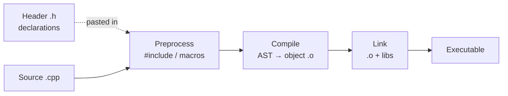

# Module 02 — C++ Core Syntax

> Source: [slice.h](file:///c:/Users/Administrator/Desktop/hellocpp/minikv/include/minikv/slice.h), [status.h](file:///c:/Users/Administrator/Desktop/hellocpp/minikv/include/minikv/status.h), [coding.h](file:///c:/Users/Administrator/Desktop/hellocpp/minikv/src/utils/coding.h), [db.h](file:///c:/Users/Administrator/Desktop/hellocpp/minikv/include/minikv/db.h)

## Background & Motivation

Have you ever wondered why databases like LevelDB, RocksDB, and TiKV are written in C++ rather than Java or Go? The answer is performance predictability — no GC pauses, no JIT warmup, byte-level control over memory layout and disk format. In distributed storage, a single 50ms GC stall on the hot path can blow your p99 latency budget, and that's exactly the pain C++ spares us. This module builds the syntactic foundation you need to read and write the minikv engine, the C++17 LSM-Tree at the heart of TitanKV.

This is Module 02, sitting right after the project overview and before modern C++ features. We focus on the bread-and-butter syntax that shows up everywhere in the codebase: the compilation model, value categories, pointers vs references, function overloading, and the project's signature idioms — `Slice` as a non-owning string view and `Status` as an explicit error channel. These idioms recur in every later module, so getting fluent now pays compound interest.

After this module, you'll be able to explain why `Slice` avoids heap allocation on hot paths, why `Status` replaces exceptions in storage engines, how varint encoding saves disk space, and what RAII actually guarantees. Interview questions like "Implement a lightweight string view" or "Why avoid exceptions in a database?" will no longer be intimidating — you'll have written the same patterns LevelDB and RocksDB use.

## 1. Core Knowledge

- C++ compilation model: headers (declarations) + source files (definitions); `#include` is textual paste; `#pragma once` prevents multiple inclusion.
- Value categories: lvalue / rvalue / xvalue; `const` and reference collapsing.
- Pointers vs references: pointers can be null, re-pointed, multi-level; references must be initialized and cannot be re-bound.
- Function overloading, namespaces, `enum class` scoped enumerations.
- Project idioms: `Slice` (lightweight non-owning view), `Status` (code + message), varint encoding.
- RAII basics and the Rule of Five.

## 2. Deep Dive

### 2.1 Headers and the Compilation Model

C++ uses separate compilation: declarations go in headers, definitions in source files. `#include` is **textual paste** at preprocess time, so multiple inclusion causes redefinition — guard with `#pragma once` or include guards.



Every minikv header starts with `#pragma once` (see [slice.h:1](file:///c:/Users/Administrator/Desktop/hellocpp/minikv/include/minikv/slice.h)). Namespaces `namespace minikv { ... }` prevent symbol collisions; utility functions add an inner `namespace utils` (see [coding.h:6-7](file:///c:/Users/Administrator/Desktop/hellocpp/minikv/src/utils/coding.h)).

### 2.2 Slice — A Lightweight String View

[slice.h](file:///c:/Users/Administrator/Desktop/hellocpp/minikv/include/minikv/slice.h) implements a LevelDB-style `Slice`:

```cpp
class Slice {
public:
    Slice() : data_(""), size_(0) {}
    Slice(const char* d) : data_(d), size_(d ? std::strlen(d) : 0) {}
    Slice(const char* d, size_t n) : data_(d), size_(n) {}
    Slice(const std::string& s) : data_(s.data()), size_(s.size()) {}
    Slice(std::string_view sv) : data_(sv.data()), size_(sv.size()) {}
    // ...
private:
    const char* data_;
    size_t size_;
};
```

Key points:

- **Non-owning**: `data_` points to an external buffer; `Slice`'s destructor does not free it. This avoids `std::string` heap allocation — critical on hot paths.
- **Multiple overloaded constructors**: accept `const char*`, `const std::string&`, `std::string_view` — function overloading in action.
- **`const` member functions**: `data()`/`size()` etc. are `const`, so const objects can call them.
- **Operator overloading**: `operator[]`, `operator==`, etc. make `Slice` behave like a built-in type.
- **Pitfall**: if `Slice` holds a pointer to a temporary, the dangling reference is UB.

### 2.3 Status — The Error-Handling Idiom

[status.h](file:///c:/Users/Administrator/Desktop/hellocpp/minikv/include/minikv/status.h) replaces exceptions with `Status`:

```cpp
enum class StatusCode {  // scoped enum, no implicit int conversion
    kOk = 0, kNotFound = 1, kCorruption = 2, kNotSupported = 3,
    kInvalidArgument = 4, kIOError = 5,
};

class Status {
public:
    static Status Ok() { return Status(); }
    static Status NotFound(std::string msg = "") { ... }
    // ...
private:
    StatusCode code_;
    std::string msg_;
};
```

Key points:

- **`enum class`**: introduced in C++11, scope-restricted, does not pollute the outer namespace, no implicit `int` conversion — safer than `enum`.
- **Static factory methods**: `Status::NotFound(...)` reads better than `Status(StatusCode::kNotFound, ...)`; default arg `msg = ""` adds convenience.
- **`std::move(msg)`**: moves the string at construction to avoid deep copy (move semantics covered in Module 03).
- **Why not exceptions**: storage engines want zero-overhead, predictable behavior; exceptions have nondeterministic cost on error paths. Status is explicit error propagation.

### 2.4 Varint Variable-Length Encoding

[coding.h](file:///c:/Users/Administrator/Desktop/hellocpp/minikv/src/utils/coding.h) implements Protobuf-style varint encoding:

```cpp
inline void encodeVariant32(std::string& dst, uint32_t val) {
    while (val >= 0x80) {
        dst.push_back(static_cast<char>(val | 0x80));  // high bit 1 = more bytes follow
        val >>= 7;
    }
    dst.push_back(static_cast<char>(val));              // high bit 0 = done
}
```

Principle: each byte stores 7 data bits in the low bits; the high bit is a "continuation flag". Small numbers (<128) take 1 byte, saving disk space. SSTable key/value lengths and sequence numbers all use varint.

`static_cast<char>` is an explicit cast that avoids the risk of C-style `(char)` — `static_cast` does stricter compile-time checks.

### 2.5 Pointers vs References

| Aspect | Pointer `T*` | Reference `T&` |
|---|---|---|
| Nullable | yes | no (must be initialized) |
| Re-pointable | yes | no |
| Multi-level | `T**` legal | `T&&` is an rvalue reference, not multi-level |
| `sizeof` | pointer size | referred object size (compile time) |
| Increment | moves pointer | illegal |

In the project, `Slice::data_` is `const char*` (nullable, re-pointable), while `Status(StatusCode code, std::string msg)` takes parameters by value (copy then move into the member).

### 2.6 RAII and the Rule of Five

**RAII** (Resource Acquisition Is Initialization): bind resources to object lifetimes — acquire in the constructor, release in the destructor; even when an exception unwinds the stack, destructors run.

minikv's `DBImpl` holds `std::unique_ptr<WAL>`, `std::unique_ptr<MemTable>` (see [db_impl.h:39-42](file:///c:/Users/Administrator/Desktop/hellocpp/minikv/src/core/db_impl.h)); when `DBImpl` is destroyed, the member unique_ptrs release automatically — no manual destructor logic needed.

**Rule of Five**: if you declare any of destructor / copy ctor / copy assign / move ctor / move assign, you usually need all five. `Status` declares only constructors, not copy/move — the compiler-generated defaults suffice (Rule of Zero).

### 2.7 The Type System: `auto`, `decltype`, and `size_t`

C++ is statically typed, and the type system is the compiler's first line of defense against bugs. Beyond the built-in types (`int`, `char`, `double`, `bool`), three type-related features show up constantly in minikv:

```cpp
size_t n = sst->size();          // unsigned, big enough for any object size
auto it = memtable_->begin();    // let the compiler deduce the type
decltype(x->key) k = x->key;     // deduce the declared type of an expression
```

- **`size_t`**: an unsigned integer type (typically 64-bit on 64-bit platforms) guaranteed to hold the size of any object. Use it for sizes, lengths, and indices — never `int`, which can overflow on large buffers. minikv's `Slice::size_` is `size_t`.
- **`auto`**: type deduction based on the initializer. Reduces verbosity for iterators and complex template types, but don't overuse it where the type isn't obvious — readability matters.
- **`decltype(expr)`**: yields the declared type of `expr` without evaluating it. Useful in template metaprogramming and when you need "the type of that other thing."

### 2.8 Functions: `inline`, `constexpr`, Default Args, and Overloading

minikv's [coding.h](file:///c:/Users/Administrator/Desktop/hellocpp/minikv/src/utils/coding.h) marks `encodeVariant32` as `inline`:

```cpp
inline void encodeVariant32(std::string& dst, uint32_t val) { ... }

constexpr int factorial(int n) {            // evaluable at compile time
    return n <= 1 ? 1 : n * factorial(n - 1);
}
```

- **`inline`**: modern meaning is "allow multiple definitions across TUs" (ODR exemption), not necessarily "inline this code." The linker picks one definition. Free functions defined in headers should be `inline` (or `constexpr`, which implies `inline`).
- **`constexpr` function**: may be evaluated at compile time if given constant arguments. `factorial(5)` becomes a compile-time constant — zero runtime cost.
- **Default arguments**: `Status::NotFound(std::string msg = "")` — callers can omit `msg`. Defaults must appear rightmost and are resolved at the call site.
- **Overloading**: multiple functions share a name; the compiler picks by parameter types. `Slice` has 5 overloaded constructors (`const char*`, `const char*+size`, `const std::string&`, `std::string_view`, default).

### 2.9 Namespaces: `using` and Anonymous Namespaces

```cpp
namespace minikv {
    namespace utils {
        uint32_t murmurHash2(const char* data, size_t len, uint32_t seed);
    }
}

using std::string;        // scoped using-declaration: pull in one symbol
using namespace std;      // using-directive: pull in everything (avoid in headers)

namespace {               // anonymous namespace — internal linkage
    int helperCount = 0;  // visible only in this translation unit
}
```

- **`namespace`**: prevents symbol collisions. minikv wraps everything in `namespace minikv`, utilities in an inner `namespace utils`.
- **`using`**: `using-declaration` (`using std::string`) pulls in one symbol — safe. `using-directive` (`using namespace std`) pulls in everything — avoid in headers where it pollutes every includer.
- **Anonymous namespace** (`namespace { ... }`): symbols have internal linkage (visible only in this TU). This is the modern C++ replacement for file-scope `static` — it also works for types, which `static` does not.

### 2.10 Type Casting: the Four C++ Casts

C++ replaces C-style `(T)x` with four named casts, each with a distinct purpose:

| Cast | Purpose | Example |
|---|---|---|
| `static_cast<T>` | related types (numeric, upcast) | `static_cast<char>(val \| 0x80)` |
| `const_cast<T>` | add/remove `const` | `const_cast<char*>(constData)` |
| `reinterpret_cast<T>` | unrelated pointer/integer reinterpretation | `reinterpret_cast<uintptr_t>(ptr)` |
| `dynamic_cast<T>` | safe downcast (needs RTTI + virtual) | `dynamic_cast<Derived*>(basePtr)` |

- minikv uses `static_cast` in varint encoding — the compiler checks the types are related, catching misuse at compile time.
- **`const_cast`** strips or adds `const`; use only when you know the underlying object is truly mutable (e.g. interfacing with a C API that forgot `const`).
- **`reinterpret_cast`** reinterprets bits (pointer ↔ integer, unrelated pointer types); unsafe and platform-dependent — use sparingly.
- **`dynamic_cast`** performs a runtime-checked downcast on polymorphic types; returns `nullptr` (or throws for references) on failure. Costs a RTTI lookup.
- Never use C-style casts in C++: they silently become whichever of the above works, hiding bugs.

### 2.11 Pointers in Depth: `const` Pointers and Pointer Arithmetic

```cpp
const char* a;        // pointer to const char: can't modify *a, can re-point a
char* const b = p;    // const pointer: can modify *b, can't re-point b
const char* const c;  // both const

char buf[4] = {'a','b','c','\0'};
const char* p = buf;
*(p + 1);             // 'b' — pointer arithmetic scales by sizeof(char)=1
```

- **Read right-to-left**: `const char*` = "pointer to const char"; `char* const` = "const pointer to char." This mnemonic resolves any const-pointer confusion.
- **Pointer arithmetic**: `p + n` advances by `n * sizeof(*p)` bytes. This is why `Slice::data_ + offset` lands on the right byte without manual scaling, and why `int*` advances 4 bytes per `++`.
- minikv's `Slice` holds `const char* data_` — it can re-point to different buffers but must never modify the underlying bytes (a read-only view).

## 3. Thinking Questions

1. `Slice` holds `const char*` but does not own memory. Give a usage that leaves `Slice` dangling.
2. Why does `Status` use `enum class` instead of `enum`? Write a line that compiles wrongly with `enum` but fails with `enum class`.
3. In `encodeVariant32`, what is `0x80` in decimal? Why bitwise-OR instead of addition?
4. Why does `Slice(const char* d)` check `d ? ... : 0`? What happens if you pass `nullptr`?
5. `Status` is returned by value (`return Status();`). Does this trigger a copy? What optimization does the compiler apply?

## 4. Hands-on Exercises

### Exercise 4.1 (Hand-write Slice)

Without looking at the source, implement a minimal `Slice`: constructors for `const char*` and `std::string`, `size()`, `data()`, `operator==`, `startsWith`, plus 5 unit tests.

### Exercise 4.2 (Varint Codec)

Implement `encodeVariant64` / `decodeVariant64` (64-bit versions). Test: how many bytes does encoding `0xFFFFFFFFFFFFFFFF` (max) take? Why?

### Exercise 4.3 (Status in Practice)

Following [status.h](file:///c:/Users/Administrator/Desktop/hellocpp/minikv/include/minikv/status.h), implement a `Result<T>` template: success carries `T`, failure carries `Status`. Support `map` / `andThen` chaining (like Rust's `Result`).

## 5. Self-Check

1. `#pragma once` is used to ________________.
2. Two advantages of `enum class` over `enum`: ______ and ______.
3. `Slice` not owning memory means the caller must ensure the buffer ____________.
4. In varint encoding, a high bit of 1 means ____________.
5. RAII stands for ________________; the core idea is to bind ________ to object lifetime.

<details>
<summary>Reference Answers</summary>

1. prevent a header from being included multiple times (like an include guard, but cleaner)
2. scope-restricted (no namespace pollution); no implicit int conversion
3. stays valid for the Slice's lifetime (otherwise dangling reference)
4. more bytes follow (continuation flag)
5. Resource Acquisition Is Initialization; resource acquire and release

Thinking question key points:
1. `Slice s(std::string("temp").c_str());` — the temporary string dies, s dangles.
2. `enum Color { Red, Green }; int x = Red;` (legal but dangerous); `enum class Color { Red }; int x = Color::Red;` (compile error).
3. 128. Bitwise-OR sets only the high bit without touching the low 7 bits; addition could carry if low bits are set.
4. Defensive programming; `std::strlen(nullptr)` is UB.
5. NRVO (Named Return Value Optimization) / RVO elides the copy; since C++17, guaranteed copy elision for prvalues.

</details>

---

← [Module 01](./01-overview.md)  |  Next: [Module 03 — Modern C++ & Concurrency](./03-modern-cpp.md) →
