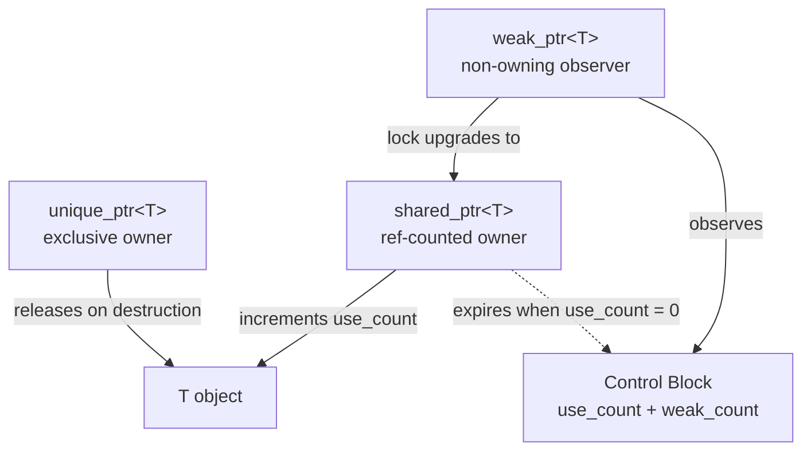

# Module 03 — Modern C++ & Concurrency

> Source: [skip_list.h](file:///c:/Users/Administrator/Desktop/hellocpp/minikv/src/core/skip_list.h), [thread_pool.h](file:///c:/Users/Administrator/Desktop/hellocpp/minikv/src/utils/thread_pool.h), [lru_cache.h](file:///c:/Users/Administrator/Desktop/hellocpp/minikv/src/utils/lru_cache.h), [db_impl.h](file:///c:/Users/Administrator/Desktop/hellocpp/minikv/src/core/db_impl.h)

## Background & Motivation

If you've ever chased a heap corruption bug at 2am, you already know why raw pointers are the interview minefield every senior engineer is tested on. Memory leaks, use-after-free, double-free, dangling references — C++ gives you enough rope to hang yourself, and distributed storage amplifies every mistake because the hot path runs millions of times per second. This module shows how modern C++ (C++11/17/20) hands you a safety net without sacrificing the zero-overhead principle: smart pointers, move semantics, lambdas, and a concurrency toolkit that lets the SkipList serve concurrent reads under a `shared_mutex`.

This is Module 03, building directly on the core syntax of Module 02 and setting up the concurrency vocabulary we'll reuse in Module 05's SkipList and beyond. We move from RAII basics to the full ownership story — `unique_ptr`, `shared_ptr`, `weak_ptr` — then cover move semantics, lambdas, `constexpr`, and the concurrency primitives (`mutex`, `shared_mutex`, `atomic`, `condition_variable`) that thread through minikv's thread pool and MemTable. By the end, the `shared_lock` in SkipList's `get` and the `unique_lock` in `put` will read like plain English.

After this module, you'll be able to answer "When does `shared_ptr`'s control block get allocated?", "Why mark move constructors `noexcept`?", "Why is `volatile` not a threading primitive?", and "How does `condition_variable::wait` defend against spurious wakeups?" You'll also be ready to implement a thread-safe data structure without reaching for a single raw `new` or `delete`.

## 1. Core Knowledge

- Smart pointers: `unique_ptr` (exclusive), `shared_ptr` (shared), `weak_ptr` (weak ref); control block & circular references.
- Move semantics: rvalue ref `T&&`, `std::move`, `std::forward`, move ctor/assign, the importance of `noexcept`.
- Lambdas: capture modes, `mutable`, `std::function` vs templates.
- `constexpr` / `constinit` / `consteval`: compile-time evaluation.
- Concurrency primitives: `std::thread`, `mutex`, `lock_guard` / `unique_lock` / `scoped_lock`, `shared_mutex` (RW lock), `atomic`, `condition_variable`.
- Memory orders: `relaxed` / `acquire` / `release` / `acq_rel` / `seq_cst`.
- Spurious wakeups and predicate waits.

## 2. Deep Dive

### 2.1 Smart Pointers

[db_impl.h:39-42](file:///c:/Users/Administrator/Desktop/hellocpp/minikv/src/core/db_impl.h) manages WAL/Manifest/MemTable with `std::unique_ptr`:

```cpp
std::unique_ptr<WAL>      wal_;
std::unique_ptr<Manifest> manifest_;
std::unique_ptr<MemTable> memtable_;
```

Key points:

- `unique_ptr`: exclusive ownership, non-copyable, movable, zero-overhead (size = raw pointer, unless a custom deleter is used). `DBImpl` releases members automatically on destruction.
- `shared_ptr`: reference counted; the control block holds `use_count` (strong) + `weak_count` (weak); counts are atomic.
- `weak_ptr`: does not increase `use_count`; breaks circular references. `weak_ptr::lock()` upgrades to `shared_ptr` (returns empty if the object is gone).
- **Thread-safety granularity**: ref counts are atomically safe; but concurrent read/write of the *same* `shared_ptr` object is **not** safe — lock it.



### 2.2 Move Semantics

[thread_pool.h:22-26](file:///c:/Users/Administrator/Desktop/hellocpp/minikv/src/utils/thread_pool.h) moves the task on submit:

```cpp
void submit(std::function<void()> task) {
    {
        std::lock_guard<std::mutex> lock(mutex_);
        tasks_.push(std::move(task));   // move into queue, avoid copying std::function
    }
    cv_.notify_one();
}
```

- `std::move(task)` is an unconditional cast to rvalue (`static_cast<T&&>`); it moves nothing itself. The actual move happens in `push`'s rvalue overload.
- Copying `std::function` may allocate (especially for lambdas capturing large objects); moving just swaps internal pointers — O(1).
- In `workerLoop`, `task = std::move(tasks_.front())` similarly moves on dequeue.

**Why `noexcept` matters**: when a `vector` grows, if the element's move ctor is not `noexcept`, the standard library falls back to copy for the strong exception guarantee. So prefer marking move ctors `noexcept`.

### 2.3 Lambdas

[thread_pool.h:17](file:///c:/Users/Administrator/Desktop/hellocpp/minikv/src/utils/thread_pool.h) starts a worker with a lambda:

```cpp
workers_.emplace_back([this] { workerLoop(); });
```

- `[this]` captures the `this` pointer, so the lambda can access `workerLoop`, `tasks_`, etc.
- Capture modes: `[]` (none), `[=]` (by value), `[&]` (by ref), `[this]`, `[x, &y]` (mixed).
- `cv_.wait(lock, [this] { return !tasks_.empty() || !running_; })` is a predicate wait, internally equivalent to `while(!pred) wait()` — automatically handles spurious wakeups.

### 2.4 `constexpr` Compile-Time Evaluation

A `constexpr` function/variable can be evaluated at compile time, with the result inlined — zero runtime cost. In minikv, [skip_list.h:25](file:///c:/Users/Administrator/Desktop/hellocpp/minikv/src/core/skip_list.h) uses `static constexpr int kMaxLevel = 32;` for a compile-time constant.

C++20 adds `consteval` (forces compile-time evaluation, no runtime calls allowed) and `constinit` (forces compile-time initialization, preventing static-init-order issues).

### 2.5 The `shared_mutex` RW Lock

[skip_list.h:39-40](file:///c:/Users/Administrator/Desktop/hellocpp/minikv/src/core/skip_list.h) takes a write lock in `put`:

```cpp
void put(const std::string& key, const std::string& value) {
    std::unique_lock<std::shared_mutex> lock(mutex_);   // write lock (exclusive)
    // ... modify the skiplist ...
}
```

while `get` takes a read lock (see [skip_list.h:68-69](file:///c:/Users/Administrator/Desktop/hellocpp/minikv/src/core/skip_list.h)):

```cpp
std::optional<std::string> get(const std::string& key) const {
    std::shared_lock<std::shared_mutex> lock(mutex_);   // read lock (shared)
    // ... read-only access ...
}
```

- `shared_mutex`: read locks (`shared_lock`) can be held by many threads concurrently; write locks (`unique_lock`) are exclusive.
- Good for "read-heavy" workloads. MemTable has far more reads than writes before flush, so an RW lock fits.
- Caveat: some implementations favor readers and may starve writers; for write-heavy workloads use a plain `mutex` instead.

### 2.6 `atomic` and Memory Orders

[thread_pool.h:57](file:///c:/Users/Administrator/Desktop/hellocpp/minikv/src/utils/thread_pool.h) uses `std::atomic<bool> running_`:

```cpp
std::atomic<bool> running_;   // stop() sets false; workers poll it
```

- `atomic` guarantees indivisible operations and provides memory-order control.
- Memory orders (weak to strong):
  - `relaxed`: atomic only, no synchronization (good for counters).
  - `acquire` (load): subsequent reads/writes cannot be reordered before this load.
  - `release` (store): prior reads/writes cannot be reordered after this store.
  - `acq_rel`: read-modify-write, both acquire and release.
  - `seq_cst` (default): globally sequentially consistent, strongest but slowest.
- `volatile` **cannot** be used for thread synchronization — it only prevents compiler optimization, with no atomicity or memory-order guarantees.

### 2.7 `condition_variable` and Spurious Wakeups

[thread_pool.h:43-48](file:///c:/Users/Administrator/Desktop/hellocpp/minikv/src/utils/thread_pool.h) is a classic producer-consumer:

```cpp
std::unique_lock<std::mutex> lock(mutex_);
cv_.wait(lock, [this] { return !tasks_.empty() || !running_; });  // predicate wait
if (!running_ && tasks_.empty()) break;
task = std::move(tasks_.front());
tasks_.pop();
```

- **Must use `unique_lock`**, not `lock_guard`: `wait` internally needs to `unlock` (so producers can enqueue) + `relock`; `lock_guard` cannot unlock manually.
- **Predicate wait** `cv_.wait(lock, pred)` equals `while(!pred) cv_.wait(lock)`, auto-looping to defend against spurious wakeups.
- **Spurious wakeup**: the OS may wake a waiting thread for no reason even if the condition is unmet; without a predicate you must `while` manually.
- `notify_one` wakes one, `notify_all` wakes all.

### 2.8 `mutable` and const Members

[lru_cache.h:56](file:///c:/Users/Administrator/Desktop/hellocpp/minikv/src/utils/lru_cache.h) declares `mutex_` as `mutable`:

```cpp
private:
    size_t capacity_;
    mutable std::mutex mutex_;   // const member functions can still lock
```

`get` is a `const` member but needs to lock `mutex_` (the lock itself is mutable state). `mutable` allows modifying this member inside a const function. This is the classic "logical const vs physical const" distinction — locking a cache does not change its logically observable state.

### 2.9 `make_unique` / `make_shared` — Why Prefer Factory Functions

```cpp
auto p = std::make_unique<WAL>(path);     // C++14
auto s = std::make_shared<MemTable>();    // one allocation for object + control block
```

- **`make_unique`** (C++14): allocates and constructs in one step; exception-safe (no leak if a function call between `new` and the ctor throws).
- **`make_shared`**: allocates the object **and** the control block in a single heap allocation — faster and more cache-friendly than `shared_ptr<T>(new T(...))` which needs two allocations.
- **When not to use `make_shared`**: when you need a custom deleter, or when memory must be freed promptly (the control block outlives the object if `weak_ptr`s linger, since they share the allocation).
- minikv's `DBImpl` uses `std::unique_ptr<WAL>` members — `make_unique` is the preferred construction form for exclusive ownership.

### 2.10 Move Constructors and Move Assignment

```cpp
class Status {
public:
    Status(Status&& o) noexcept                      // move ctor
        : code_(o.code_), msg_(std::move(o.msg_)) {}
    Status& operator=(Status&& o) noexcept {          // move assignment
        if (this != &o) {
            code_ = o.code_;
            msg_ = std::move(o.msg_);
        }
        return *this;
    }
};
```

- **Move ctor**: steals resources from the source (rather than deep-copying), leaving the source in a "valid but unspecified" state — typically cheap (pointer swaps, no heap allocation).
- **`noexcept` is critical**: `std::vector` only uses the move ctor during reallocation if it is `noexcept`; otherwise it falls back to copy to preserve the strong exception guarantee. Always mark move operations `noexcept`.
- **Rule of Five**: if you declare a move ctor, you typically need move assignment, destructor, and should explicitly delete or define copy operations.

### 2.11 Perfect Forwarding with `std::forward`

```cpp
template <typename T>
void submit(T&& task) {                      // T&& is a forwarding reference
    tasks_.push(std::forward<T>(task));      // preserve lvalue/rvalue-ness
}
```

- **`T&&` in a template** is a *forwarding reference* (not a pure rvalue ref): with reference collapsing, it binds both lvalues and rvalues.
- **`std::forward<T>(arg)`** casts `arg` back to its original value category: an rvalue stays an rvalue (moved), an lvalue stays an lvalue (copied). This is the core of perfect forwarding.
- Together they let a wrapper pass arguments through without losing move-eligibility — essential for generic factory functions like `std::make_unique`.
- minikv's `ThreadPool::submit(std::function<void()>)` takes by value; a template version would use `std::forward` to avoid an extra copy when the caller passes a movable lambda.

### 2.12 Lambda Return Types and `std::function`

```cpp
auto cmp = [](int a, int b) -> bool { return a < b; };   // explicit return type
auto add = [](int a, int b) { return a + b; };           // deduced return type (C++14)

std::function<bool(int,int)> fn = cmp;   // type-erased, stores any callable
```

- **Return type**: `-> T` for explicit; otherwise deduced from the `return` statement (C++14 auto return deduction). Multi-statement lambdas with inconsistent returns need an explicit trailing return type.
- **`std::function`**: a type-erased wrapper that can hold any callable (lambda, function pointer, functor). Costs a heap allocation + virtual dispatch vs a template parameter.
- **When to template vs `std::function`**: if the callable is used immediately in one place and performance matters, use a template parameter `template <class F> void submit(F&& f)`. If you need to store callables in a container (`std::queue<std::function<void()>>`), use `std::function` — type erasure is the only option for heterogeneous signatures.
- minikv's `ThreadPool` stores `std::queue<std::function<void()>>` because tasks have heterogeneous signatures.

### 2.13 `std::thread` Basics

```cpp
std::thread t([&] { compactionLoop(); });   // launch a 1:1 kernel thread
t.join();        // wait for completion
// or t.detach(); // let it run independently (ownership severed)
```

- **`std::thread`**: a 1:1 kernel thread (unlike goroutines which are M:N user-mode). Creating thousands is expensive (~1MB stack each).
- **`join`** blocks until the thread finishes; **`detach`** severs ownership. A thread that is neither joined nor detached when its `std::thread` object is destroyed calls `std::terminate` — a common crash source.
- **Passing arguments**: by default arguments are copied; wrap in `std::ref` for by-reference, or capture in a lambda. Beware of dangling references to local variables.
- minikv's `CompactionManager` and `ThreadPool` spawn `std::thread` workers that run until `stop()` sets a flag and joins them.

### 2.14 Template Basics

```cpp
// Function template
template <typename T>
T maxof(T a, T b) { return a > b ? a : b; }

// Class template
template <typename K, typename V>
class HashMap { /* ... */ };

// Variadic template (parameter pack) + C++17 fold expression
template <typename... Args>
void log(Args&&... args) {
    (std::cout << ... << args) << '\n';   // fold: expands the pack
}
```

- **Function template**: the compiler generates a specialization per `T` used. `maxof(1, 2)` and `maxof(1.5, 2.5)` produce two distinct functions — zero runtime overhead, but larger binary.
- **Class template**: `HashMap<std::string, int>` — the type arguments must be specified at use.
- **Variadic template**: accepts any number of arguments via a parameter pack `Args...`. C++17 fold expressions let you expand them concisely; pre-C++17 needed recursive specialization.
- Templates are compile-time (no dynamic dispatch), but they increase compile time and can produce verbose error messages — use concepts (C++20) to constrain and improve diagnostics.

## 3. Thinking Questions

1. Why is `unique_ptr` "zero-overhead"? How does its size differ from a raw pointer? When is there extra overhead?
2. After `std::move`, what state is the source object in? Can you still use it?
3. SkipList uses `shared_mutex` RW locks. If changed to a plain `mutex`, in what scenario would it actually be faster?
4. Is `cv_.wait(lock, pred)` equivalent to `while(!pred) cv_.wait(lock)`? Why prefer the former?
5. `atomic<bool>` defaults to `seq_cst`. Is `relaxed` enough for `ThreadPool::stop()` setting `running_` to false? Why?

## 4. Hands-on Exercises

### Exercise 4.1 (Hand-write a RW-locked SkipList, LeetCode 1206 advanced)

Following [skip_list.h](file:///c:/Users/Administrator/Desktop/hellocpp/minikv/src/core/skip_list.h), implement a thread-safe skiplist: `put` takes a write lock, `get`/`entries` take read locks. Verify no races with 10 threads each inserting 10,000 keys.

### Exercise 4.2 (Extend the ThreadPool, per [thread_pool.h](file:///c:/Users/Administrator/Desktop/hellocpp/minikv/src/utils/thread_pool.h))

Build on the existing `ThreadPool` and add:

1. `submit` returns `std::future<T>` (hint: use `std::packaged_task`).
2. Bounded queue (max N tasks); when full, apply a "caller-runs" policy.
3. Graceful shutdown: `stop()` still drains remaining queued tasks.

### Exercise 4.3 (Lock-free SPSC Queue)

Implement a single-producer single-consumer lock-free ring queue using `atomic` + `acquire/release`. Require `alignas(64)` to avoid false sharing. Write a test verifying 1M push/pop with no data corruption.

## 5. Self-Check

1. `unique_ptr` has ____ (exclusive/shared) ownership; `shared_ptr` has ____ ownership.
2. `std::move` is essentially ____________, and moves no data itself.
3. For `shared_mutex`, the read lock uses ____ and the write lock uses ____.
4. `condition_variable::wait` must pair with ____ (lock_guard/unique_lock) because wait needs ____.
5. `volatile` ____ (can/cannot) be used for thread synchronization, because it guarantees neither ____ nor ____.

<details>
<summary>Reference Answers</summary>

1. exclusive; shared
2. an unconditional cast to rvalue (static_cast<T&&>)
3. shared_lock; unique_lock
4. unique_lock; unlock+relock
5. cannot; atomicity; memory ordering

Thinking question key points:
1. Size usually equals a raw pointer (no custom deleter); with a custom deleter, unique_ptr must store it (may take 16 bytes). Zero-overhead means no runtime cost like ref counting.
2. "Valid but unspecified" state; resources are typically gone (e.g. pointer nulled). Safe to destruct or reassign, but do not read its value.
3. In write-heavy or read-write-balanced workloads, a plain mutex lets only one thread in, avoiding the RW lock's upgrade overhead and writer starvation — often faster.
4. Equivalent. The former is preferred because it's concise and you can't forget the loop.
5. Yes. `running_` is only a one-shot stop flag; no other data depends on it for happens-before (task sync relies on mutex/cv), so relaxed suffices.

</details>

---

← [Module 02](./02-cpp-core.md)  |  Next: [Module 04 — Go & TypeScript Basics](./04-go-ts.md) →
