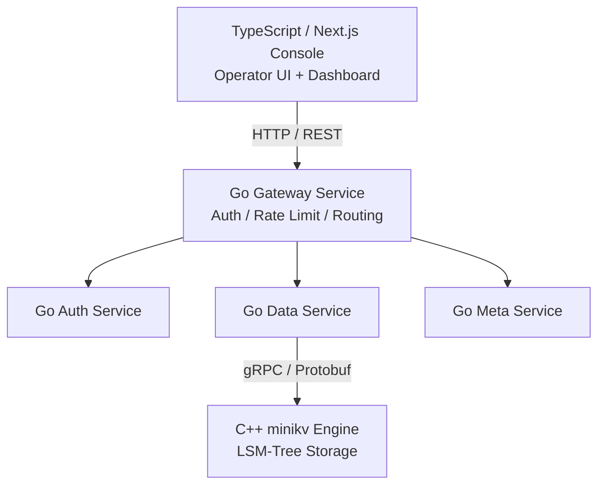

# Module 04 — Go & TypeScript Basics

> Source: [go.mod](file:///c:/Users/Administrator/Desktop/hellocpp/go.mod) (`github.com/titan-kv/titan`), REFACTORING.md Phase 3-6 (gateway/services/web)

## Background & Motivation

Here's a question worth pausing on: if C++ is so fast, why not write the entire TitanKV in it? Because developer efficiency matters as much as runtime efficiency. The storage engine lives and dies by nanoseconds, so it earns its C++ complexity — but the gateway, auth, and observability services change every week as product requirements evolve, and Go's goroutines and simple syntax ship features far faster than C++ ever could. This module explores that deliberate split, plus the TypeScript frontend that has become the industry standard for type-safe web UIs.

This is Module 04, bridging the C++ engine from Modules 02–03 and the web console that arrives later. We cover Go's concurrency trio (goroutine, channel, select), its implicit interfaces and `(T, error)` error handling, the gRPC + Protobuf bridge that lets Go talk to C++, and then pivot to TypeScript and Next.js App Router for the operator console. Think of it as learning the two upper layers of the stack the architecture diagram promised in Module 01.

After this module, you'll be able to answer "Why use goroutines instead of OS threads?", "How do Go's implicit interfaces compare to C++ virtual functions?", "Why gRPC over REST for internal RPC?", and "What's the difference between Next.js server and client components?" You'll also see clearly why TitanKV doesn't write everything in one language — and be able to defend that choice in a system design interview.

## 1. Core Knowledge

- Go's positioning: built for backend microservices, native concurrency (goroutine + channel), statically compiled, single-binary cross-platform deployment.
- Go's concurrency trio: `goroutine` (`go f()`), `channel` (`chan T`), `select`; the CSP (Communicating Sequential Processes) model.
- Go interfaces: implicit implementation (duck typing), `error` is a plain interface, the `(T, error)` multi-return idiom.
- gRPC + Protobuf: cross-language RPC, strongly-typed IDL, bidirectional streaming; TitanKV uses it to bridge the Go gateway ↔ C++ engine.
- TypeScript: a superset of JavaScript with static types, `type` / `interface` / generics.
- Next.js App Router: React Server Components (RSC), file-based routing, Server Actions, TanStack Query for data fetching.

## 2. Deep Dive

### 2.1 Why TitanKV Uses Go for the Business Layer

The architecture split (from [README.md](file:///c:/Users/Administrator/Desktop/hellocpp/README.md)):

- **C++ storage engine** (minikv): extreme performance, zero overhead, controllable memory.
- **Go microservices** (gateway/services): development efficiency and concurrency expressiveness, wired together with gRPC.

Go's advantages here:

- goroutines are lightweight (~2KB stack vs C++ thread ~1MB); millions of concurrent tasks are fine.
- Mature `net/http` + `google.golang.org/grpc` ecosystem; fast to write gateway/auth/rate-limit middleware.
- Statically compiled single binary; small container images, easy deployment.
- Talks to C++ via cgo or gRPC (planned in Phase 2).



### 2.2 goroutines and channels

```go
// Producer-consumer (compare with Module 03's C++ ThreadPool)
func producer(ch chan<- int) {
    for i := 0; i < 100; i++ { ch <- i }
    close(ch)
}
func consumer(ch <-chan int, done chan<- struct{}) {
    for v := range ch { fmt.Println(v) }
    done <- struct{}{}
}
func main() {
    ch := make(chan int, 10)            // buffered channel
    done := make(chan struct{})
    go producer(ch); go consumer(ch, done)
    <-done                              // block until done
}
```

Key points:

- `go f()` starts a goroutine, scheduled by the Go runtime (M:N user-mode scheduling, preemptive).
- `chan T` is a concurrency-safe FIFO queue; a buffered channel acts like a bounded blocking queue.
- `range ch` keeps receiving until the channel is `close`d.
- `select { case ...: }` multiplexes channels — like epoll but for channels.
- Compared to C++: C++ needs `mutex + condition_variable` by hand; Go does it in one line with channels, though channels have runtime overhead.

### 2.3 Interfaces and Error Handling

```go
type Storage interface {
    Get(ctx context.Context, key string) (string, error)
    Put(ctx context.Context, key, val string) error
}

type Engine struct{ db *C.DBImpl }   // cgo wrapper or gRPC client
func (e *Engine) Get(ctx context.Context, key string) (string, error) {
    val, err := e.db.Get(key)
    if err != nil { return "", fmt.Errorf("get %q: %w", key, err) }
    return val, nil
}
```

- Interfaces are **implicitly implemented**: `Engine` satisfies `Storage` by having `Get`/`Put` methods — no `implements` keyword.
- Errors are values: `(T, error)` multi-return; `fmt.Errorf("%w", err)` wraps to form an error chain; `errors.Is`/`errors.As` unwrap.
- `context.Context` threads through the call chain, supporting timeout, cancellation, and values — essential for microservices.

### 2.4 gRPC + Protobuf

TitanKV plans to define Put/Get/Delete/Scan in `proto/keyforge/storage.proto` (see REFACTORING.md Phase 2). Example:

```protobuf
service Storage {
  rpc Put(PutRequest) returns (PutResponse);
  rpc Get(GetRequest) returns (GetResponse);
  rpc Scan(ScanRequest) returns (stream ScanEntry);   // server streaming
}
message PutRequest { bytes key = 1; bytes value = 2; }
```

- Protobuf is a binary IDL — smaller and faster than JSON, strongly typed.
- gRPC runs on HTTP/2 multiplexing, supporting unary / server-stream / client-stream / bidi-stream calls.
- `protoc` generates Go and C++ stubs; both ends share one proto for protocol consistency.

### 2.5 TypeScript Type System

```typescript
type Collection = {
  id: string;
  name: string;
  createdAt: Date;
  settings: { shards: number; replication: number };
};

interface CollectionRepo {
  list(): Promise<Collection[]>;
  create(input: Omit<Collection, 'id' | 'createdAt'>): Promise<Collection>;
}
```

- `type` vs `interface`: `interface` supports declaration merging; `type` supports union/intersection/conditional types. Either works day-to-day.
- Utility types: `Omit`/`Pick`/`Partial`/`Record` reduce duplication.
- Types exist only at compile time; erased after compilation (similar to C++ templates but lighter).

### 2.6 Next.js App Router

The TitanKV console (Phase 6) plans to use Next.js 15 App Router + Tailwind + shadcn/ui + TanStack Query. The directory is the route:

```
web/app/
├── layout.tsx           root layout
├── page.tsx             home (dashboard)
├── data/page.tsx        /data data browser
├── collections/page.tsx /collections
└── api/                 route handlers (BFF)
```

- **Server Components (RSC)**: rendered on the server by default; can hit the DB directly; no JS shipped to the client.
- **Client Components**: the `'use client'` directive, for interactivity (useState, events).
- **TanStack Query**: client-side data caching, invalidation, optimistic updates; complements server components.

### 2.7 Go Variable Declaration and Basic Types

```go
var name string          // zero value ""
var count int = 10       // explicit init
port := 8080             // short declaration (type inferred, inside functions only)
var (                    // block declaration
    host string = "0.0.0.0"
    port int    = 8080
)
```

- **`var`** declares with a type; **`:=`** declares and infers (only inside functions). Package-level variables must use `var`.
- **Zero values**: `0` for numbers, `""` for strings, `nil` for pointers/slices/maps/channels/interfaces, `false` for bool — no uninitialized memory in Go.
- Basic types: `string`, `int`/`int64`, `float64`, `bool`, `byte` (= `uint8`), `rune` (= `int32`, a Unicode code point).
- **Slice** (`[]int`): a dynamic array header of `{ptr, len, cap}`. `make([]int, 0, 10)` preallocates capacity. Slices are references — passing one shares the backing array.
- **Map** (`map[string]int`): a hash map. `make(map[string]int)` initializes it; reading a missing key returns the zero value (no panic), but writing to a nil map panics.
- **Struct**: a record of named fields. Go has no `class` keyword; structs + methods are the OOP building blocks.

### 2.8 Go Control Flow: `if` / `for` / `switch` / `select`

```go
if err := db.Get(key); err != nil {   // if with init statement
    return err
}
for i := 0; i < 10; i++ { ... }       // C-style for
for _, v := range slice { ... }       // for-each (index, value)
for { ... }                            // infinite loop (break to exit)

switch n {                            // no fallthrough by default!
case 1: ...
case 2, 3: ...
default: ...
}

select {                              // channel multiplexing
case v := <-ch:  ...                  // receive
case ch <- 42:   ...                  // send
default:         ...                  // non-blocking
}
```

- **`if` init**: `if x := f(); x > 0` — `x` is scoped to the if/else block, keeping the variable close to its use.
- **`for` is the only loop keyword**: it serves as while (`for cond {}`), for-each (`for range`), and infinite loop (`for {}`).
- **`switch` breaks by default** (unlike C/Java); use an explicit `fallthrough` to continue to the next case.
- **`select`** blocks until one case is ready; `default` makes it non-blocking. It is the channel equivalent of `epoll` — multiplexing concurrent operations.

### 2.9 Go Functions: Multiple Returns, Closures, `defer`

```go
func divide(a, b int) (int, error) {           // multiple returns
    if b == 0 { return 0, errors.New("div by zero") }
    return a / b, nil
}

func adder(x int) func(int) int {              // closure: returns a function
    return func(y int) int { return x + y }    // captures x
}

func readFile(f *os.File) error {
    defer f.Close()                             // runs when readFile returns
    // ... use f ...
    return nil
}
```

- **Multiple returns**: Go's signature idiom is `(result, error)`. There are no exceptions for ordinary control flow — errors are values.
- **Closures**: functions capture their surrounding variables by reference. Useful for callbacks, decorators, and goroutine-safe encapsulation.
- **`defer`**: schedules a call to run when the enclosing function returns (LIFO order — deferred calls stack up). Used for cleanup: closing files, releasing locks. It is Go's analog to C++ RAII scope-exit, though manual rather than automatic.

### 2.10 Go OOP: Struct, Method, Interface, Composition

```go
type Engine struct {
    db *C.DBImpl
}

func (e *Engine) Get(key string) (string, error) { ... }   // pointer receiver method

type Storage interface {
    Get(ctx context.Context, key string) (string, error)
}

// Composition via embedding — Go's alternative to inheritance
type Service struct {
    *Engine          // embedded: Service "has-a" Engine and inherits its methods
    timeout time.Duration
}
```

- **Struct + methods** = Go's OOP. Methods are defined with a receiver (`func (e *Engine) ...`), not inside the struct.
- **Pointer vs value receiver**: pointer receivers can modify the struct and avoid copying; value receivers work on a copy. Be consistent within a type.
- **Interfaces are implicit**: a type satisfies an interface by having all the required methods — no `implements` keyword. This enables duck typing and easy mocking.
- **Composition over inheritance**: Go has no inheritance. Embed a struct to reuse its fields and methods (the embedded type's methods are promoted). This is the Go philosophy — prefer composition to deep hierarchies.

### 2.11 Go Concurrency Primitives: `sync.WaitGroup` and `sync.Mutex`

```go
var wg sync.WaitGroup
for i := 0; i < 10; i++ {
    wg.Add(1)
    go func() {
        defer wg.Done()
        // work
    }()
}
wg.Wait()   // block until all 10 goroutines call Done()

var mu sync.Mutex
mu.Lock()
// critical section
mu.Unlock()

var rw sync.RWMutex
rw.RLock()    // shared read lock (many readers)
rw.RUnlock()
rw.Lock()     // exclusive write lock
rw.Unlock()
```

- **`sync.WaitGroup`**: a counter for waiting on N goroutines. `Add(1)` increments, `Done()` decrements, `Wait()` blocks until zero. Always pair with `defer wg.Done()`.
- **`sync.Mutex`**: exclusive lock — only one goroutine holds it at a time. The Go equivalent of C++ `std::mutex`.
- **`sync.RWMutex`**: read-write lock — many readers or one writer. The Go equivalent of C++ `std::shared_mutex`.
- These are the lower-level primitives; channels (2.2) are preferred for *communicating* between goroutines, but mutexes suit simple shared-state protection.

### 2.12 Go Error Handling: `panic` / `recover`

```go
func safeDiv(a, b int) (r int) {
    defer func() {
        if rec := recover(); rec != nil {
            r = 0   // recover stops the panic, r is set to 0
        }
    }()
    if b == 0 { panic("div by zero") }
    return a / b
}
```

- **`error` interface**: the normal error path. The convention is to return `error` as the last value and always check `if err != nil`.
- **`panic`**: a runtime crash (like a `throw`). Use only for truly unrecoverable conditions — invariant violations, index out of range, nil map writes. Not for business errors.
- **`recover`**: catches a panic inside a deferred function, stopping the crash. Use sparingly — mainly at service boundaries to keep one bad request from crashing the whole server.
- **Convention**: business errors use `error`; programmer errors (bugs) use `panic`. The TitanKV Gateway's `Recover` middleware wraps handlers in a `recover` so a panic becomes a 500 instead of a crash.

### 2.13 Go Package Management: `go mod` and `import`

```
module github.com/titan-kv/titan    // go.mod first line

go 1.22

require (
    github.com/gin-gonic/gin v1.10.0
    google.golang.org/grpc v1.65.0
)
```

```go
import (
    "fmt"                                 // stdlib (no domain prefix)
    "github.com/titan-kv/titan/gateway"   // local module
    "github.com/gin-gonic/gin"            // third-party
)
```

- **`go mod init <module>`** creates `go.mod`; `go get <pkg>` adds a dependency; `go mod tidy` cleans up unused entries.
- **Imports**: an import path maps to a package. The package name (usually the last path segment) is the identifier you use (`gin.Default()`, `fmt.Println`).
- Go's module system (post-1.11) replaced GOPATH; versions are semver-tagged and a `go.sum` file pins hashes for reproducible builds.

### 2.14 TypeScript Type System Deep Dive: Union, Intersection, Generics

```typescript
// Union type: a value can be one of several types
type ID = string | number;
type ApiResponse = SuccessResponse | ErrorResponse;

// Intersection type: combine multiple types into one
type WithTimestamp = { createdAt: Date };
type Auditable = { createdBy: string };
type Record = WithTimestamp & Auditable;   // has both createdAt and createdBy

// Generics: reusable, type-safe containers
function first<T>(arr: T[]): T | undefined {
    return arr[0];
}
const n = first<number>([1, 2, 3]);        // n is number | undefined

// Optional properties
type Config = { host: string; port?: number };   // port may be absent → undefined
```

- **Union types** (`A | B`): a value of type `A | B` is either an `A` or a `B`. Great for tagged unions / sum types and for modeling "success or error" responses.
- **Intersection types** (`A & B`): a value of type `A & B` has all properties of both. Used to compose types (mixin pattern) — the TS analog of multiple inheritance.
- **Generics** (`<T>`): define a type once, use it with many concrete types. The compiler enforces type safety at each use site. More flexible than `any` and catches bugs at compile time.
- **Optional properties** (`prop?`): the property may be absent; accessing it yields `undefined`. Required for modeling partial updates and config objects.

### 2.15 TypeScript Enums and Type Guards

```typescript
enum Color { Red, Green, Blue }          // numeric enum (0, 1, 2)
enum Status { Ok = "OK", Err = "ERR" }   // string enum (preferred for logs)

// Type guards narrow a union at runtime
function format(v: string | number) {
    if (typeof v === "string") {
        return v.toUpperCase();          // TS knows v is string here
    }
    return v.toFixed(2);                 // TS knows v is number here
}

class Cat { meow(): void {} }
class Dog { bark(): void {} }
function speak(p: Cat | Dog) {
    if (p instanceof Cat) { p.meow(); }  // instanceof narrows to Cat
    else { p.bark(); }
}

// `in` operator narrows by property presence
function getName(x: { name?: string }): string {
    if ("name" in x && x.name) return x.name;
    return "anonymous";
}

// User-defined type predicate
function isUser(x: unknown): x is { id: string } {
    return typeof x === "object" && x !== null && "id" in x;
}
```

- **Enums**: named constants. String enums are preferred for readability in serialized output (logs, JSON); numeric enums support reverse mapping.
- **`typeof` guard**: narrows primitive unions (`string | number`).
- **`instanceof` guard**: narrows class unions — checks the prototype chain.
- **`in` guard**: checks for a property, narrowing object shapes (structural narrowing).
- **User-defined guards** (`x is T`): a predicate function the compiler trusts for narrowing — the bridge between runtime checks and compile-time types.

### 2.16 React Basics: Function Components, Props, Hooks

```tsx
// Function component with typed Props
type Props = { title: string; count?: number };
function Card({ title, count = 0 }: Props) {
    return <div>{title}: {count}</div>;
}

// useState: local state
function Counter() {
    const [n, setN] = useState(0);
    return <button onClick={() => setN(n + 1)}>{n}</button>;
}

// useEffect: side effects (fetching, subscriptions, timers)
function Profile({ id }: { id: string }) {
    const [user, setUser] = useState<User | null>(null);
    useEffect(() => {
        fetch(`/api/users/${id}`).then(r => r.json()).then(setUser);
    }, [id]);   // re-run only when id changes; [] runs once on mount
    return <div>{user?.name ?? "loading"}</div>;
}
```

- **Function components**: the modern React style (class components are legacy). A component is a pure function from Props to JSX.
- **Props**: read-only inputs passed from the parent. Destructure with defaults for optional ones. Props flow down; events flow up via callbacks.
- **`useState`**: a hook that gives a component local state. Returns `[value, setter]` — calling the setter triggers a re-render.
- **`useEffect`**: a hook for side effects. The dependency array `[id]` controls when it re-runs; `[]` runs only once on mount; omitting it runs after every render (usually wrong).
- TitanKV's Next.js console (Module 12) uses these hooks in client components like `LiveMetrics`, where `useState` holds metrics and `useEffect` opens an SSE stream.

## 3. Thinking Questions

1. What are the essential differences between goroutines, C++ `std::thread`, and `std::coroutine`?
2. Go transfers ownership via `channel`; C++ via `std::move`. How do their philosophies compare?
3. Go interfaces are implicit. Compared to C++ explicit virtual inheritance, what are the pros and cons?
4. What advantages does gRPC have over REST+JSON for internal service-to-service calls like TitanKV's? When should you still use REST?
5. Next.js server components ship no JS to the client by default. What does that mean for a real-time dashboard page? When must you switch to a client component?

## 4. Hands-on Exercises

### Exercise 4.1 (Go Concurrent Rate Limiter)

Use `time.Ticker` + `chan struct{}` to implement a token-bucket rate limiter: `Allow() bool`, issuing N tokens per second. Verify with 1000 concurrent goroutines.

### Exercise 4.2 (Minimal gRPC Example)

Define `proto/storage.proto` (Put/Get), generate stubs with `protoc-gen-go` + `protoc-gen-go-grpc`, write a server and a client with an in-memory map backend. Run one Put/Get round trip.

### Exercise 4.3 (Next.js Dashboard Skeleton)

Use `npx create-next-app@latest` (App Router + TypeScript + Tailwind) to build a `/dashboard` page: fetch mock data with a server component, render QPS/latency cards; on "refresh", use a client component + TanStack Query to refetch.

## 5. Self-Check

1. The Go keyword to start a goroutine is ____; the scheduling model is ____ (M:N / 1:1).
2. When a buffered channel is full, the sender ____; when empty, the receiver ____.
3. Go interface implementation is ____ (explicit/implicit); errors are returned as ____.
4. gRPC is based on ____ and supports ____ call modes.
5. In Next.js App Router, ____ (server/client) components ship no JS to the browser by default.

<details>
<summary>Reference Answers</summary>

1. `go`; M:N
2. blocks; blocks
3. implicit; values (`(T, error)`)
4. HTTP/2; four (unary, server-stream, client-stream, bidi-stream)
5. server

Thinking question key points:
1. `std::thread` is a 1:1 kernel thread, expensive; `std::coroutine` is a cooperative stackless coroutine needing a hand-written scheduler; goroutine is an M:N preemptive stackful coroutine scheduled by the runtime, which comes built-in.
2. A channel is a runtime synchronization primitive (locking/scheduling); move is a compile-time semantic cast. A channel implicitly transfers ownership with blocking sync; move is zero-cost but doesn't sync. Philosophically: Go encourages "share memory by communicating"; C++ encourages "communicate by sharing memory."
3. Pros: decoupling, easy mocking, flexible composition; Cons: implicit implementation is unintuitive, hard to trace on refactor, needs tooling to check satisfaction.
4. Pros: smaller binary, strongly typed, HTTP/2 multiplexing for low latency, streaming; REST suits external/browser/curl-accessible endpoints and cases needing HTTP caching semantics.
5. Faster first paint, better SEO, smaller bundle; but real-time data needs polling/SSE/WebSocket — you must switch to a client component (`'use client'`) with hooks.

</details>

---

← [Module 03](./03-modern-cpp.md)  |  Next: [Module 05 — SkipList & Ordered Structures](./05-skiplist.md) →
