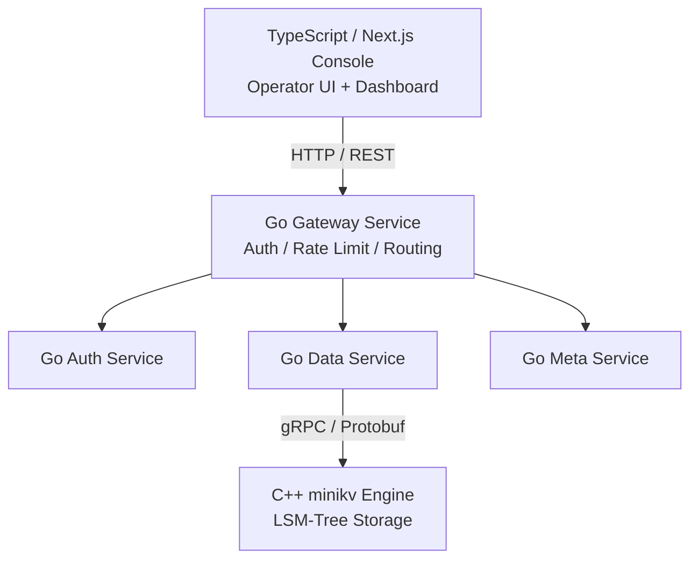

# Module 04 — Go & TypeScript Basics

> Source: [go.mod](file:///c:/Users/Administrator/Desktop/hellocpp/go.mod) (`github.com/titan-kv/titan`), REFACTORING.md Phase 3-6 (gateway/services/web)

## Background & Motivation

Here's a question worth pausing on: if C++ is so fast, why not write the entire TitanKV in it? Because developer efficiency matters as much as runtime efficiency. The storage engine lives and dies by nanoseconds, so it earns its C++ complexity — but the gateway, auth, and observability services change every week as product requirements evolve, and Go's goroutines and simple syntax ship features far faster than C++ ever could. This module explores that deliberate split, plus the TypeScript frontend that has become the industry standard for type-safe web UIs.

This is Module 04, bridging the C++ engine from Modules 02–03 and the web console that arrives later. We cover Go's concurrency trio (goroutine, channel, select), its implicit interfaces and `(T, error)` error handling, the gRPC + Protobuf bridge that lets Go talk to C++, and then pivot to TypeScript and Next.js App Router for the operator console. Think of it as learning the two upper layers of the stack the architecture diagram promised in Module 01.

After this module, you'll be able to answer "Why use goroutines instead of OS threads?", "How do Go's implicit interfaces compare to C++ virtual functions?", "Why gRPC over REST for internal RPC?", and "What's the difference between Next.js server and client components?" You'll also see clearly why TitanKV doesn't write everything in one language — and be able to defend that choice in a system design interview.

## 1. Core Knowledge

- Go's positioning: built for backend microservices, native concurrency (goroutine + channel), statically compiled, single-binary cross-platform deployment.
- Go's concurrency trio: `goroutine` (`go f()`), `channel` (`chan T`), `select`; the CSP (Communicating Sequential Processes) model.
- Go interfaces: implicit implementation (duck typing), `error` is a plain interface, the `(T, error)` multi-return idiom.
- gRPC + Protobuf: cross-language RPC, strongly-typed IDL, bidirectional streaming; TitanKV uses it to bridge the Go gateway ↔ C++ engine.
- TypeScript: a superset of JavaScript with static types, `type` / `interface` / generics.
- Next.js App Router: React Server Components (RSC), file-based routing, Server Actions, TanStack Query for data fetching.

## 2. Deep Dive

### 2.1 Why TitanKV Uses Go for the Business Layer

The architecture split (from [README.md](file:///c:/Users/Administrator/Desktop/hellocpp/README.md)):

- **C++ storage engine** (minikv): extreme performance, zero overhead, controllable memory.
- **Go microservices** (gateway/services): development efficiency and concurrency expressiveness, wired together with gRPC.

Go's advantages here:

- goroutines are lightweight (~2KB stack vs C++ thread ~1MB); millions of concurrent tasks are fine.
- Mature `net/http` + `google.golang.org/grpc` ecosystem; fast to write gateway/auth/rate-limit middleware.
- Statically compiled single binary; small container images, easy deployment.
- Talks to C++ via cgo or gRPC (planned in Phase 2).



### 2.2 goroutines and channels

```go
// Producer-consumer (compare with Module 03's C++ ThreadPool)
func producer(ch chan<- int) {
    for i := 0; i < 100; i++ { ch <- i }
    close(ch)
}
func consumer(ch <-chan int, done chan<- struct{}) {
    for v := range ch { fmt.Println(v) }
    done <- struct{}{}
}
func main() {
    ch := make(chan int, 10)            // buffered channel
    done := make(chan struct{})
    go producer(ch); go consumer(ch, done)
    <-done                              // block until done
}
```

Key points:

- `go f()` starts a goroutine, scheduled by the Go runtime (M:N user-mode scheduling, preemptive).
- `chan T` is a concurrency-safe FIFO queue; a buffered channel acts like a bounded blocking queue.
- `range ch` keeps receiving until the channel is `close`d.
- `select { case ...: }` multiplexes channels — like epoll but for channels.
- Compared to C++: C++ needs `mutex + condition_variable` by hand; Go does it in one line with channels, though channels have runtime overhead.

### 2.3 Interfaces and Error Handling

```go
type Storage interface {
    Get(ctx context.Context, key string) (string, error)
    Put(ctx context.Context, key, val string) error
}

type Engine struct{ db *C.DBImpl }   // cgo wrapper or gRPC client
func (e *Engine) Get(ctx context.Context, key string) (string, error) {
    val, err := e.db.Get(key)
    if err != nil { return "", fmt.Errorf("get %q: %w", key, err) }
    return val, nil
}
```

- Interfaces are **implicitly implemented**: `Engine` satisfies `Storage` by having `Get`/`Put` methods — no `implements` keyword.
- Errors are values: `(T, error)` multi-return; `fmt.Errorf("%w", err)` wraps to form an error chain; `errors.Is`/`errors.As` unwrap.
- `context.Context` threads through the call chain, supporting timeout, cancellation, and values — essential for microservices.

### 2.4 gRPC + Protobuf

TitanKV plans to define Put/Get/Delete/Scan in `proto/keyforge/storage.proto` (see REFACTORING.md Phase 2). Example:

```protobuf
service Storage {
  rpc Put(PutRequest) returns (PutResponse);
  rpc Get(GetRequest) returns (GetResponse);
  rpc Scan(ScanRequest) returns (stream ScanEntry);   // server streaming
}
message PutRequest { bytes key = 1; bytes value = 2; }
```

- Protobuf is a binary IDL — smaller and faster than JSON, strongly typed.
- gRPC runs on HTTP/2 multiplexing, supporting unary / server-stream / client-stream / bidi-stream calls.
- `protoc` generates Go and C++ stubs; both ends share one proto for protocol consistency.

### 2.5 TypeScript Type System

```typescript
type Collection = {
  id: string;
  name: string;
  createdAt: Date;
  settings: { shards: number; replication: number };
};

interface CollectionRepo {
  list(): Promise<Collection[]>;
  create(input: Omit<Collection, 'id' | 'createdAt'>): Promise<Collection>;
}
```

- `type` vs `interface`: `interface` supports declaration merging; `type` supports union/intersection/conditional types. Either works day-to-day.
- Utility types: `Omit`/`Pick`/`Partial`/`Record` reduce duplication.
- Types exist only at compile time; erased after compilation (similar to C++ templates but lighter).

### 2.6 Next.js App Router

The TitanKV console (Phase 6) plans to use Next.js 15 App Router + Tailwind + shadcn/ui + TanStack Query. The directory is the route:

```
web/app/
├── layout.tsx           root layout
├── page.tsx             home (dashboard)
├── data/page.tsx        /data data browser
├── collections/page.tsx /collections
└── api/                 route handlers (BFF)
```

- **Server Components (RSC)**: rendered on the server by default; can hit the DB directly; no JS shipped to the client.
- **Client Components**: the `'use client'` directive, for interactivity (useState, events).
- **TanStack Query**: client-side data caching, invalidation, optimistic updates; complements server components.

## 3. Thinking Questions

1. What are the essential differences between goroutines, C++ `std::thread`, and `std::coroutine`?
2. Go transfers ownership via `channel`; C++ via `std::move`. How do their philosophies compare?
3. Go interfaces are implicit. Compared to C++ explicit virtual inheritance, what are the pros and cons?
4. What advantages does gRPC have over REST+JSON for internal service-to-service calls like TitanKV's? When should you still use REST?
5. Next.js server components ship no JS to the client by default. What does that mean for a real-time dashboard page? When must you switch to a client component?

## 4. Hands-on Exercises

### Exercise 4.1 (Go Concurrent Rate Limiter)

Use `time.Ticker` + `chan struct{}` to implement a token-bucket rate limiter: `Allow() bool`, issuing N tokens per second. Verify with 1000 concurrent goroutines.

### Exercise 4.2 (Minimal gRPC Example)

Define `proto/storage.proto` (Put/Get), generate stubs with `protoc-gen-go` + `protoc-gen-go-grpc`, write a server and a client with an in-memory map backend. Run one Put/Get round trip.

### Exercise 4.3 (Next.js Dashboard Skeleton)

Use `npx create-next-app@latest` (App Router + TypeScript + Tailwind) to build a `/dashboard` page: fetch mock data with a server component, render QPS/latency cards; on "refresh", use a client component + TanStack Query to refetch.

## 5. Self-Check

1. The Go keyword to start a goroutine is ____; the scheduling model is ____ (M:N / 1:1).
2. When a buffered channel is full, the sender ____; when empty, the receiver ____.
3. Go interface implementation is ____ (explicit/implicit); errors are returned as ____.
4. gRPC is based on ____ and supports ____ call modes.
5. In Next.js App Router, ____ (server/client) components ship no JS to the browser by default.

<details>
<summary>Reference Answers</summary>

1. `go`; M:N
2. blocks; blocks
3. implicit; values (`(T, error)`)
4. HTTP/2; four (unary, server-stream, client-stream, bidi-stream)
5. server

Thinking question key points:
1. `std::thread` is a 1:1 kernel thread, expensive; `std::coroutine` is a cooperative stackless coroutine needing a hand-written scheduler; goroutine is an M:N preemptive stackful coroutine scheduled by the runtime, which comes built-in.
2. A channel is a runtime synchronization primitive (locking/scheduling); move is a compile-time semantic cast. A channel implicitly transfers ownership with blocking sync; move is zero-cost but doesn't sync. Philosophically: Go encourages "share memory by communicating"; C++ encourages "communicate by sharing memory."
3. Pros: decoupling, easy mocking, flexible composition; Cons: implicit implementation is unintuitive, hard to trace on refactor, needs tooling to check satisfaction.
4. Pros: smaller binary, strongly typed, HTTP/2 multiplexing for low latency, streaming; REST suits external/browser/curl-accessible endpoints and cases needing HTTP caching semantics.
5. Faster first paint, better SEO, smaller bundle; but real-time data needs polling/SSE/WebSocket — you must switch to a client component (`'use client'`) with hooks.

</details>

---

← [Module 03](./03-modern-cpp.md)  |  Next: [Module 05 — SkipList & Ordered Structures](./05-skiplist.md) →
