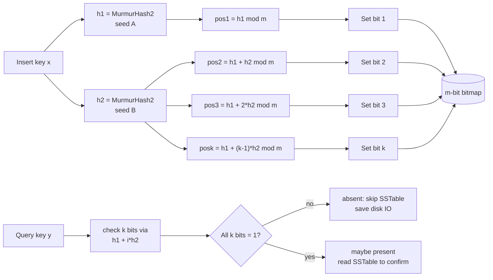

# Module 06 — BloomFilter & Hashing

> Source: [bloom_filter.h](file:///c:/Users/Administrator/Desktop/hellocpp/minikv/src/core/bloom_filter.h), [hash.h](file:///c:/Users/Administrator/Desktop/hellocpp/minikv/src/utils/hash.h)
> Planned: consistent-hash sharding in the distributed layer (REFACTORING.md Phase 5)

## Background & Motivation

In an LSM-Tree, every read potentially has to walk MemTable, Immutable, L0, L1, and onward — each SSTable on the path is a candidate disk seek, and read amplification can quietly climb to 10× or more. That is exactly the pain point a BloomFilter attacks: before we ever touch disk, we ask a compact bitmap "could this key be in here?" and skip the SSTable entirely when the answer is no. The trade-off is probabilistic — we accept a small false-positive rate (typically 1%) in exchange for a massive reduction in disk IO. This is why Cassandra, HBase, LevelDB, and RocksDB all ship Bloom filters as a default, not an option.

Inside TitanKV, this module sits right between the SkipList MemTable (Module 05) and the full LSM-Tree engine (Module 07): the BloomFilter is what makes the L1+ read path affordable, and the MurmurHash2 we study here is reused for InternalKey hashing and consistent-hash sharding later on. We also lay the groundwork for the distributed layer's consistent-hash ring, which Phase 5 of REFACTORING.md relies on for sharding and request routing.

By the end of this module, you should be able to derive the optimal `k = (m/n)·ln2` and `m = -n·ln(p)/(ln2)²` from first principles on a whiteboard, explain why a Bloom filter has zero false negatives but nonzero false positives, and defend the choice of MurmurHash2 over SHA-256 in an interview. These are exactly the questions that come up when interviewers probe "how do you make an LSM-Tree read fast" — and they map directly to hand-writes like designing a Bloom filter under a given false-positive budget.



## 1. Core Knowledge

- Bloom filter: an m-bit array + k hash functions; insert sets bits, query all-1s means "maybe present".
- Properties: **no false negatives (FN = 0), false positives possible (FP > 0)**; no deletion.
- False-positive formula: `p ≈ (1 - e^(-kn/m))^k`; optimal `k = (m/n)·ln2`, `m = -n·ln(p)/(ln2)²`.
- Double hashing (Kirsch-Mitzenmacher): simulate k hashes with 2, `h_i(x) = h1(x) + i·h2(x)`.
- MurmurHash2: a non-cryptographic hash, uniform distribution, fast; good for hash tables / bloom filters.
- Consistent hashing: ring + clockwise lookup + virtual nodes; add/remove only migrates the adjacent segment.

## 2. Deep Dive

### 2.1 Why LSM-Trees Need Bloom Filters

The LSM read path checks MemTable → Immutable → L0 (overlapping) → L1..Ln. Each SSTable may need a binary search — severe read amplification.

A Bloom Filter pre-filters before reading an SSTable: if the BF says "absent", skip the SSTable and save a disk read. Since the BF has no false negatives, no real key is missed.

### 2.2 minikv BloomFilter Construction

[bloom_filter.h:17-26](file:///c:/Users/Administrator/Desktop/hellocpp/minikv/src/core/bloom_filter.h):

```cpp
BloomFilter(size_t expected_keys, double false_positive_rate = 0.01) {
    int bits = static_cast<int>(-1.0 * std::log(fpr) / std::log(2.0) / std::log(2.0));  // m/n = -ln(p)/(ln2)^2
    num_hashes_ = static_cast<int>(bits * std::log(2.0));   // k = (m/n)·ln2
    if (num_hashes_ < 1) num_hashes_ = 1;
    if (num_hashes_ > 30) num_hashes_ = 30;                  // upper bound
    bits_per_key_ = static_cast<int>(bits / std::log(2.0));
    bits_.assign(expected_keys * bits_per_key_ / 8 + 1, 0);
}
```

Parameter derivation (commonly asked in interviews):

- Given n (expected keys) and p (target FP rate), find optimal m and k.
- FP rate `p = (1 - e^(-kn/m))^k`; differentiate w.r.t. k and set to 0 → `k = (m/n)·ln2`.
- Substitute back → `m = -n·ln(p)/(ln2)²`.
- Example: n=1M, p=1% → m ≈ 9.6M bits ≈ 1.17MB, k ≈ 7.

minikv caps `num_hashes_` at 30 to avoid pathological params making hashing too slow.

### 2.3 Double Hashing

[bloom_filter.h:28-36](file:///c:/Users/Administrator/Desktop/hellocpp/minikv/src/core/bloom_filter.h):

```cpp
void add(const Slice& key) {
    uint32_t h1 = utils::murmurHash2(key.data(), key.size(), 0xbc9f1d34);
    uint32_t h2 = utils::murmurHash2(key.data(), key.size(), 0x9e3779b9);
    uint32_t bits = static_cast<uint32_t>(bits_.size() * 8);
    for (int i = 0; i < num_hashes_; ++i) {
        uint32_t pos = (h1 + i * h2) % bits;        // double hash: h_i = h1 + i·h2
        bits_[pos / 8] |= (1 << (pos % 8));
    }
}
```

- **Kirsch-Mitzenmacher theorem**: two independent hashes `h1`, `h2` linearly combined as `h_i = h1 + i·h2` approximate k independent hashes with negligible loss.
- Benefit: only 2 hashes computed (not k), big CPU savings.
- `pos / 8` locates the byte, `1 << (pos % 8)` locates the bit; `|=` sets it.

`mightContain` ([bloom_filter.h:38-47](file:///c:/Users/Administrator/Desktop/hellocpp/minikv/src/core/bloom_filter.h)) is symmetric: any 0 bit returns false immediately; all 1s returns true.

### 2.4 MurmurHash2

[hash.h:8-30](file:///c:/Users/Administrator/Desktop/hellocpp/minikv/src/utils/hash.h) implements MurmurHash2:

```cpp
inline uint32_t murmurHash2(const char* data, size_t len, uint32_t seed) {
    const uint32_t m = 0x5bd1e995;
    const int r = 24;
    uint32_t h = seed ^ static_cast<uint32_t>(len);
    while (len >= 4) { /* 4 bytes at a time: multiply by m, xor, multiply by m */ }
    switch (len) { /* handle trailing 1-3 bytes with [[fallthrough]] */ }
    h ^= h >> 13; h *= m; h ^= h >> 15;   // avalanche
    return h;
}
```

- "Murmur" = multiply + rotate; a non-cryptographic hash, not collision-attack resistant, but uniform and fast.
- `0x5bd1e995` is an empirical magic number ensuring avalanche properties.
- `[[fallthrough]]` (C++17) explicitly marks switch fallthrough, silencing compiler warnings.
- Two different seeds (`0xbc9f1d34`, `0x9e3779b9`) produce two "independent" hashes for double hashing.

### 2.5 Persistence and Loading

[bloom_filter.h:49-72](file:///c:/Users/Administrator/Desktop/hellocpp/minikv/src/core/bloom_filter.h): the BF is persisted with the SSTable, format `[num_hashes(4)][bits_per_key(4)][size(8)][bits...]`. `load` returns a `unique_ptr` or nullptr on failure — RAII + explicit errors.

### 2.6 Consistent Hashing (Foundation for the Distributed Layer)

Traditional modulo `hash(key) % N` migrates almost all keys when N changes. Consistent hashing:

```
        0
   B    │    C
    ╲   │   ╱
     ╲  │  ╱
      ╲ │ ╱
   ────╳────  2^32-1
      ╱ │ ╲
     ╱  │  ╲
    ╱   │   ╲
   A    │    D
        2^32
```

- Organize `[0, 2^32-1]` as a ring; both nodes and keys hash onto it.
- A key goes to the next node clockwise. Adding/removing a node only affects keys between that node and the next.
- **Virtual nodes**: each physical node maps to many virtual nodes (e.g. 150), solving skew when few nodes exist.
- TitanKV Phase 5 plans to use consistent hashing for sharding (see REFACTORING.md).

## 3. Thinking Questions

1. Why does a Bloom filter have "no false negatives"? Explain mathematically.
2. minikv uses double hashing `h1 + i·h2` to simulate k hashes. When does this approximation break down?
3. A BF is configured with p=1%, n=1M, but 2M keys are actually inserted. How does the FP rate change?
4. MurmurHash2 is not a cryptographic hash. Why does the BF use it instead of SHA-256?
5. Consistent hashing uses 150 virtual nodes per physical node. What goes wrong with 1?

## 4. Hands-on Exercises

### Exercise 4.1 (Hand-write BloomFilter)

Without the source, implement `BloomFilter`: constructor takes `expected_keys` and `fpr`, auto-computes m, k; `add`/`mightContain` use double hashing. Test: insert 1M random keys, query 1M absent keys, measure the actual FP rate and compare to theory.

### Exercise 4.2 (Parameter Derivation)

Given n=100M, p=0.1%, compute m (bits and MB) and k by hand. If p is relaxed to 1%, how much m is saved?

### Exercise 4.3 (Consistent Hashing)

Implement a `ConsistentHash` class: `addNode(node)`, `removeNode(node)`, `getNode(key)`. Require virtual nodes (150 per physical). Test: distribution std-dev over 1M keys with 10 nodes; keys migrated when adding/removing 1 node (should be ≈ 1/10).

### Exercise 4.4 (Counting Bloom Filter)

A standard BF cannot delete. Implement a Counting BF (4-bit counters per slot): `add` +1, `remove` -1 (no underflow), `mightContain` > 0. Analyze the space cost.

## 5. Self-Check

1. A Bloom filter ____ (can/cannot) delete elements, because ____.
2. FP rate formula p ≈ ______; optimal k = ______.
3. minikv simulates k hashes with ____ hash functions, formula h_i = ______.
4. MurmurHash2 is a ____ (cryptographic/non-cryptographic) hash.
5. Consistent hashing add/remove only affects data ____, and virtual nodes solve ____.

<details>
<summary>Reference Answers</summary>

1. cannot; one bit may be shared by multiple elements, deletion would corrupt others
2. `(1 - e^(-kn/m))^k`; `(m/n)·ln2`
3. 2; `h1 + i·h2`
4. non-cryptographic
5. between that node and the next; skew when few nodes exist

Thinking question key points:
1. Insertion sets all relevant bits; query of an inserted key sees all 1s, so no false negative. Formally: `x ∈ S ⇒ BF[x] = 1`, contrapositive `BF[x] = 0 ⇒ x ∉ S`.
2. If `h2 ≡ 0 (mod bits)`, all h_i collapse to h1, the k positions coincide, and the BF degenerates. minikv uses fixed magic seeds; in practice h2=0 with probability ~1/2^32.
3. Doubling actual keys doubles kn/m, so FP rises exponentially. A p=1% design at 2n may rise to ~10%+.
4. A BF doesn't need collision resistance, just uniform distribution + speed. SHA-256 is 10-50x slower, and the BF doesn't store raw keys to attack anyway.
5. With 1 virtual node per physical node and few nodes (e.g. 3), data skews badly (one node may get 50%+); 150 virtual nodes make the distribution nearly uniform.

</details>

---

← [Module 05](./05-skiplist.md)  |  Next: [Module 07 — LSM-Tree Engine](./07-lsm-engine.md) →
