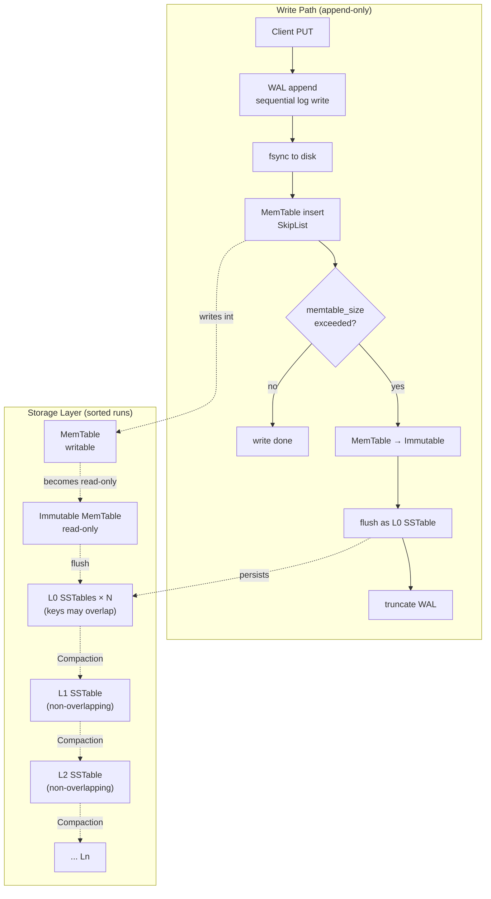
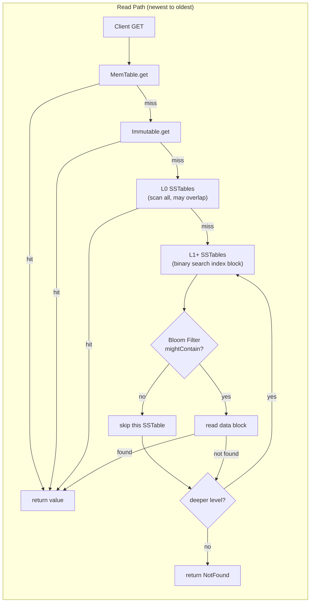

# Module 07 — LSM-Tree Engine

> Source: [db_impl.cpp](file:///c:/Users/Administrator/Desktop/hellocpp/minikv/src/core/db_impl.cpp), [wal.h](file:///c:/Users/Administrator/Desktop/hellocpp/minikv/src/core/wal.h), [sstable_builder.h](file:///c:/Users/Administrator/Desktop/hellocpp/minikv/src/core/sstable_builder.h), [memtable.h](file:///c:/Users/Administrator/Desktop/hellocpp/minikv/src/core/memtable.h)

## Background & Motivation

B+ trees have served databases well for decades, but they break down under write-heavy workloads: every update is an in-place random IO, page splits ripple through the tree, and SSD lifespan erodes under the write amplification. The LSM-Tree (Log-Structured Merge-Tree), introduced in the Bigtable paper and refined by LevelDB, RocksDB, and TiKV, flips the model — writes become sequential appends to a MemTable plus a WAL, and reads pay the cost of merging across multiple sorted runs. It is a deliberate "fast writes, slow reads" trade-off, and it is the reason every major write-heavy system (Cassandra, HBase, TiKV, RocksDB) sits on an LSM core.

In TitanKV, this module is the heart of the storage engine: everything before it (Slice, Status, SkipList, BloomFilter) is infrastructure, and everything after it (Compaction, MVCC, Raft, sharding) builds on top of the write path, read path, WAL, and SSTable format we study here. Once you understand `DBImpl::write` and `DBImpl::get`, you can reason about the entire engine's behavior — durability, crash recovery, read latency, and the amplification trade-offs that Compaction (Module 08) later tries to tame.

After this module, you should be able to walk an interviewer through the full LSM write path (WAL → MemTable → flush → SSTable), explain why `fsync` is the real durability boundary and what `write()` alone does not guarantee, and design an SSTable file layout with data/index/filter/footer blocks. You will also be ready for classic questions like "why does L0 allow overlapping keys but L1+ does not" and "what happens if we crash between MemTable write and WAL write" — both of which distinguish candidates who have read about LSM from those who have implemented one.

## 1. Core Knowledge

- LSM-Tree (Log-Structured Merge-Tree): append-only writes + ordered merges; trades read amplification + Compaction for write throughput.
- Three amplifications: write (WA), read (RA), space (SA) — cannot optimize all three at once.
- Write path: `Put → WAL append → MemTable(SkipList) insert → flush to SSTable when full`.
- Read path: `MemTable → Immutable → L0(overlapping) → L1..Ln(non-overlapping) + Bloom Filter`.
- SSTable file format: data block / index block / filter block(BF) / footer.
- WAL: write-ahead logging principle + fsync durability boundary + crash-recovery replay.

## 2. Deep Dive

### 2.1 LSM-Tree vs B+Tree

| Aspect | LSM-Tree | B+Tree |
|---|---|---|
| Write | append (sequential IO), low WA | in-place (random IO), page splits |
| Read | multi-level lookup, high RA | O(log_B N) disk reads, low RA |
| Space | old versions reclaimed by Compaction, medium SA | packed pages, low SA |
| Use case | write-heavy, massive data (TiKV/RocksDB/Cassandra) | read-heavy (MySQL/Postgres) |

TiKV's core reason for LSM: **it's easier to improve read performance with caching than write performance** (hot data in BlockCache; cold reads rarely traverse all levels).

#### LSM-Tree Overall Architecture





### 2.2 Write Path Deep Dive

`write` in [db_impl.cpp:88-116](file:///c:/Users/Administrator/Desktop/hellocpp/minikv/src/core/db_impl.cpp):

```cpp
Status DBImpl::write(const WriteOptions& opts, const WriteBatch& batch) {
    std::lock_guard<std::mutex> lock(write_mutex_);          // serialize writes
    uint64_t currentSeq = seq_.fetch_add(batch.count());     // allocate sequence numbers
    for (const auto& op : batch.ops()) {
        uint64_t opSeq = ++currentSeq;
        memtable_->put(Slice(op.key), Slice(op.value), opSeq, isDel);  // write MemTable
    }
    if (wal_) {
        // encode batch as [type(1)][keyLen(4)][valLen(4)][key][value]...
        wal_->append(Slice(data));
        if (options_.wal_sync && opts.sync) wal_->sync();    // fsync durability
    }
    maybeFlush();                                            // flush if full
    return Status::Ok();
}
```

Key points:

1. **`write_mutex_` serializes writes**: ensures atomic seq allocation + MemTable write. This is a simplified group-commit; production RocksDB uses a `WriteThread` for batch merging.
2. **Sequence number `seq_`**: atomic increment, one unique seq per op, for MVCC snapshot reads (Module 08).
3. **MemTable before WAL?** Note minikv writes MemTable **before** WAL — a simplification. Strict WAL says log first, then memory. But MemTable writes are in-memory and fast, low crash risk; production engines strictly follow "WAL before memory."
4. **`fsync` is the durability boundary**: `wal_->sync()` calls `fdatasync(fd)`, forcing kernel page cache to disk. `write()` only goes to the page cache; a crash loses it.
5. **`maybeFlush`**: when MemTable exceeds `options_.memtable_size`, convert to Immutable and flush to an L0 SSTable.

### 2.3 WAL Mechanism

[wal.h](file:///c:/Users/Administrator/Desktop/hellocpp/minikv/src/core/wal.h) interface:

```cpp
class WAL {
public:
    explicit WAL(const std::string& path);
    Status append(const Slice& data);     // append
    Status sync();                        // fsync
    std::vector<std::string> replay();    // crash-recovery replay
    Status truncate();                    // clear (after MemTable flush)
};
```

**WAL principle**: before modifying a data page, append the modification record to the WAL and fsync. After a crash, replay the WAL on restart to rebuild in-memory state.

minikv's `recover()` ([db_impl.cpp:45-74](file:///c:/Users/Administrator/Desktop/hellocpp/minikv/src/core/db_impl.cpp)):

1. Open the Manifest and restore the Version (which SSTables exist).
2. `wal_->replay()` reads all WAL records.
3. Decode each `[type][keyLen][valLen][key][value]`, re-insert into MemTable, increment seq.

**Checkpoint**: records the "flushed WAL position"; crash recovery only replays after the checkpoint. minikv simplifies to `truncate()` of the whole WAL after flush.

### 2.4 SSTable File Format

The comment in [sstable_builder.h:14-41](file:///c:/Users/Administrator/Desktop/hellocpp/minikv/src/core/sstable_builder.h):

```
/-----------------------------\
| data block #0               |   each block: [crc(4)]
|   ...                       |        [physical_size(4)]
| data block #N               |        [uncompressed_size(4)]
| index block                 |        [type(1) = CompressionType]
| footer (48 bytes)           |        [payload(physical_size)]
\-----------------------------/

Footer (48 bytes):
  8 bytes : index_offset
  8 bytes : index_size
  1 byte  : format_version (currently = 1)
  1 byte  : reserved
 30 bytes : reserved padding
  8 bytes : magic (0x4D4B53535441424C)
```

Key points:

- **data block**: ordered KV, default block size 4KB. The 13-byte header carries CRC + physical/uncompressed size + compression type, supporting Snappy/Zstd.
- **index block**: max key + offset of each data block, binary-searched to locate a data block.
- **filter block**: Bloom Filter (over user_key), pre-filters reads.
- **footer**: fixed 48 bytes, magic number prevents misreading, format_version supports evolution.
- **Immutable**: an SSTable is never modified after writing, enabling concurrent reads + mmap.

### 2.5 MemTable Flush Flow

`maybeFlush` → `flushMemTable` (see [db_impl.h:34](file:///c:/Users/Administrator/Desktop/hellocpp/minikv/src/core/db_impl.h)):

1. The current MemTable becomes an Immutable MemTable (read-only).
2. A new empty MemTable receives subsequent writes.
3. `SSTableBuilder` writes the Immutable's ordered entries (SkipList iteration) as an L0 SSTable.
4. Register with the Version, record to the Manifest.
5. `wal_->truncate()` (new WAL for the new MemTable).

L0 SSTables may have **overlapping** keys (multiple flushes); L1+ within a level do not overlap (Compaction guarantees this).

### 2.6 Read Path Deep Dive

[db_impl.cpp:118-120](file:///c:/Users/Administrator/Desktop/hellocpp/minikv/src/core/db_impl.cpp):

```cpp
Status DBImpl::get(const ReadOptions& opts, const Slice& key, std::string* value) {
    auto result = memtable_->get(key, seq_.load());      // 1. check MemTable
    if (result) { /* return */ }
    // 2. check Immutable MemTable
    // 3. per-level SSTable lookup:
    //    for level in 0..max_level:
    //      for sst in version_.files(level):
    //        if sst.bloom.mightContain(key):   // BF filter
    //          val = sstable_reader.get(key)
    //          if val found: return
    // 4. return NotFound
}
```

Key points:

- **Newest to oldest**: MemTable (newest) → Immutable → L0 → L1.., ensuring the latest version is read.
- **Bloom Filter**: if the BF says "absent", skip the SSTable, saving a disk read.
- **L0 sequential scan**: L0 files may overlap, all must be checked (or in reverse time order).
- **L1+ index binary search**: within a level files don't overlap; binary-search the index block to locate the data block, then search inside.

### 2.7 Block Compression

WP 1.2.1 introduced Snappy/Zstd compression (see [compression.h](file:///c:/Users/Administrator/Desktop/hellocpp/minikv/src/core/compression.h)). Data blocks are compressed before flushing and decompressed on read. The block header stores `physical_size` (on-disk) and `uncompressed_size` (after decompression); the CRC covers the compressed bytes.

Trade-off: saves disk space + IO, costs CPU. Snappy is fast with low ratio; Zstd is slower with a higher ratio. LSMs typically use Snappy for hot data blocks and Zstd for cold levels.

## 3. Thinking Questions

1. minikv's `write` does MemTable before WAL. Does this contradict "WAL first"? What's the risk?
2. Besides `fsync`, what other ways can data reach disk? Difference between `fdatasync` and `fsync`?
3. L0 files have overlapping keys; why don't L1+? How does Compaction ensure this?
4. Why is the SSTable footer fixed at 48 bytes with a magic at the end?
5. When the Bloom Filter says "maybe present" on the read path, will the data definitely be found? Why?

## 4. Hands-on Exercises

### Exercise 4.1 (WAL Crash-Recovery Test)

Write a test: open a DB, Put 1000 keys, **kill the process without `sync()`** (simulate a crash), reopen, verify that synced records are recovered and unsynced ones are lost.

### Exercise 4.2 (SSTable Format Experiment)

Following [sstable_builder.h](file:///c:/Users/Administrator/Desktop/hellocpp/minikv/src/core/sstable_builder.h), hand-write a minimal SSTable: write 3 KVs, manually parse footer → index → data block, verify round trip. Inspect the byte layout with hexdump.

### Exercise 4.3 (Read-Path Optimization: Block Cache)

Implement an LRU Block Cache for minikv (following [lru_cache.h](file:///c:/Users/Administrator/Desktop/hellocpp/minikv/src/utils/lru_cache.h)): cache recently read data blocks (key = file_path + block_offset); on hit, skip the disk read. Benchmark: random Get over 1M keys (20% hot), compare QPS with/without cache.

### Exercise 4.4 (Write Amplification Measurement)

Insert 1M keys (1KB values), observe actual disk writes (WAL + Compaction rounds). Compute WA = disk write / user data. Analyze how to reduce it.

## 5. Self-Check

1. An LSM-Tree trades ____ and ____ amplification for write throughput.
2. Write path order: Put → ____ → ____ → flush to SSTable when full.
3. `write()` only goes to ____; ____ forces it to disk.
4. An SSTable consists of data block / ____ / ____ / footer.
5. The read path searches from ____ (newest) to ____ (oldest) to read the latest version.

<details>
<summary>Reference Answers</summary>

1. read; space (Compaction is also a form of write amplification)
2. WAL append; MemTable insert
3. the kernel page cache; fsync/fdatasync
4. index block; filter block (Bloom Filter)
5. MemTable; L1..Ln SSTables

Thinking question key points:
1. Strictly yes, it contradicts. Risk: a crash between MemTable write and WAL write loses the data — but since the process crash also loses memory, the data is lost either way; the real risk vs "WAL first" is state inconsistency when "WAL write fails but MemTable was already modified." Production engines strictly do WAL before memory.
2. `fsync` syncs metadata (size, time) + data; `fdatasync` syncs only data (faster). `O_DIRECT` bypasses the page cache; `msync` flushes an mmap region.
3. L0 comes straight from MemTable flush, so multiple flushes overlap. Compaction merges L0 with overlapping L1 files into sorted output at L1, guaranteeing L1 within a level doesn't overlap (leveled compaction).
4. Fixed length lets you locate it from the file end (the SSTable tail is the footer); the magic prevents parsing a different file as an SSTable.
5. Not necessarily. On a BF false positive, it says "maybe present" but the key is actually absent — you still read the SSTable and end up NotFound. The BF only guarantees "if it says absent, it's truly absent."

</details>

---

← [Module 06](./06-bloom-hash.md)  |  Next: [Module 08 — Compaction & MVCC](./08-compaction-mvcc.md) →
