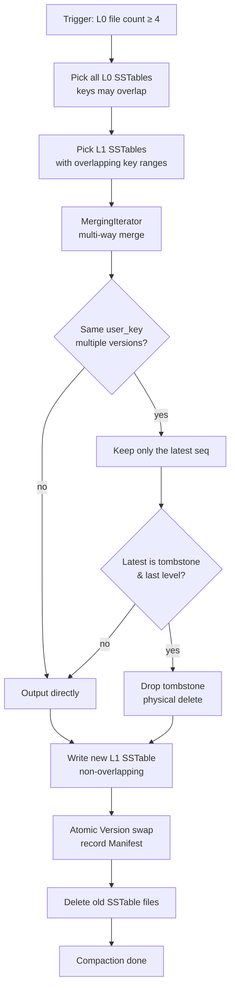
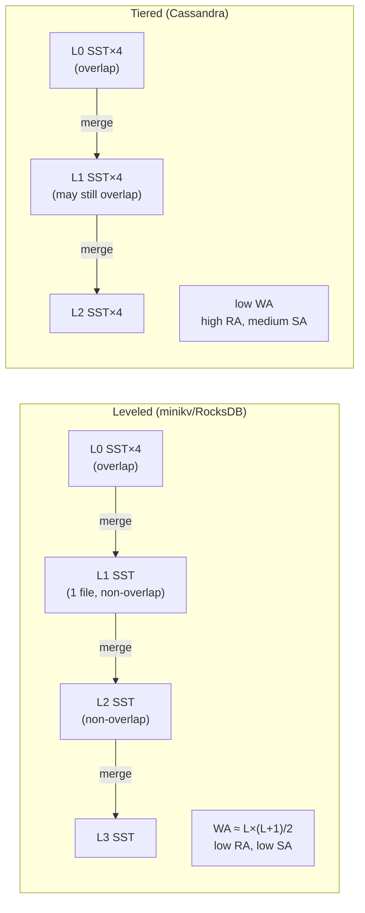

# Module 08 — Compaction & MVCC

> Source: [internal_key.h](file:///c:/Users/Administrator/Desktop/hellocpp/minikv/src/core/internal_key.h), [compaction.h](file:///c:/Users/Administrator/Desktop/hellocpp/minikv/src/core/compaction.h), [manifest.h](file:///c:/Users/Administrator/Desktop/hellocpp/minikv/src/core/manifest.h), [version.h](file:///c:/Users/Administrator/Desktop/hellocpp/minikv/src/core/version.h)

## Background & Motivation

An LSM-Tree without Compaction is a time bomb: every MemTable flush drops another overlapping L0 SSTable on disk, reads scan more and more files, stale versions pile up, and tombstones never get reclaimed — throughput decays, latency climbs, and space blooms. Compaction is the background garbage collection that keeps an LSM healthy, merging sorted runs, dropping superseded versions, and physically purging tombstones once they reach the last level. The strategy choice (Leveled vs Tiered) is fundamentally a trade-off between write amplification and read amplification, and getting it wrong for your workload means either burning CPU on rewrites or starving reads under too many SSTables.

In TitanKV, this module is what turns the raw LSM-Tree from Module 07 into a production-grade engine: `CompactionManager` runs the background loop, `InternalKey` encoding gives us the sort order that makes merging deterministic, and MVCC snapshot reads layered on top of the sequence number let reads proceed without blocking writes. The Manifest persists the Version (which SSTables exist at which level) so that crash recovery can rebuild the file set, and the whole design mirrors what RocksDB, TiKV, and HBase do in the real world.

By the end of this module, you should be able to explain why InternalKey puts `seq` in the high bits and `type` in the low bits, derive why Leveled compaction has `WA ≈ L×(L+1)/2`, and reason about when a tombstone can finally be dropped (only at the last level, otherwise older versions resurrect). You will also be able to answer "how do MVCC snapshot reads achieve reads-don't-block-writes" — a question that comes up in nearly every storage-engine interview, and one that candidates routinely botch by confusing it with MySQL's Undo Log approach.

## 1. Core Knowledge

- InternalKey encoding: `[user_key | trailer(8)]`, trailer = `(seq << 8) | type`, little-endian.
- Sort order: user_key ascending; under the same user_key, seq descending (newest version first).
- ValueType: `kValue=1` (regular value), `kDeletion=2` (tombstone).
- Compaction strategies: Leveled (non-overlapping within a level, low RA, high WA) vs Tiered (overlapping, low WA, high RA).
- Three amplifications: write (WA), read (RA), space (SA).
- Manifest persistence: append-only `[crc(4)][size(4)][payload]`, replayed on restart to rebuild the Version.
- MVCC snapshot reads: each read carries a seq and only sees versions with seq ≤ snapshot.

## 2. Deep Dive

### 2.1 InternalKey Encoding

[internal_key.h:27-40](file:///c:/Users/Administrator/Desktop/hellocpp/minikv/src/core/internal_key.h):

```
internal_key = user_key_bytes || trailer(8 bytes)
trailer      = uint64 LE of ((seq << 8) | type)

Bit allocation:
  bits 0..7   : ValueType (1=Value, 2=Deletion)
  bits 8..63  : seq (56 bits, ~7.2e16 — enough for decades)
```

Why this design:

- **user_key first**: byte-wise comparison hits user_key first, so multiple versions of the same user_key cluster together — good for range scans.
- **trailer little-endian**: `InternalKeyCompare` decodes the trailer as a uint64 for comparison; the high bits of seq decide order.
- **seq descending**: under the same user_key, the newest version (largest seq) sorts first; the first hit during iteration is the latest — O(1) latest-version read.
- **type in low 8 bits**: under the same seq, kValue(1) < kDeletion(2), so a value comes before a deletion (in practice the same seq never has both).

### 2.2 The Sort Comparator

`InternalKeyCompare(a, b)` logic:

1. Compare user_key byte-wise (`memcmp`); return if unequal.
2. If user_key equal, decode both trailers as uint64 and **invert the seq comparison** (descending).
3. If seq also equal, type ascending (kValue first).

This comparator is the unified ordering for SkipList, SSTable, and MergingIterator — the foundation of the LSM's "sorted" property.

### 2.3 Tombstones

A delete is not a physical delete; it writes an InternalKey of type `kDeletion`. The read path treats a tombstone as "deleted" and returns NotFound.

Why tombstones:

- LSM is append-only; you cannot modify/delete old versions inside an SSTable in place.
- A tombstone makes deletes go through the same write path as Puts (WAL → MemTable → SSTable) — uniform handling.
- Tombstones are physically reclaimed only during Compaction (dropped when compacted to the last level).

### 2.4 Compaction Strategy Comparison

`CompactionManager` in [compaction.h](file:///c:/Users/Administrator/Desktop/hellocpp/minikv/src/core/compaction.h) provides `compactL0()` and `compactLevel(level)`:

| Strategy | Leveled | Tiered (Size-Tiered) |
|---|---|---|
| In-level overlap | no (SSTable key ranges don't overlap) | yes (multiple overlapping SSTables) |
| Trigger | L_i full; pick 1 SSTable + overlapping L_{i+1} files to merge | level SSTable count hits threshold; merge into 1 big file |
| Write amplification | large (rewrites each merge, ~10-30x) | small |
| Read amplification | small (binary search, non-overlapping) | large (multiple files may all be checked) |
| Space amplification | small (reclaimed promptly) | large (old versions pile up) |
| Typical | RocksDB default, LevelDB | Cassandra, ScyllaDB |

minikv uses Leveled (`compactLevel` merges L_i with overlapping L_{i+1} files).

**WA estimate** (Leveled): `WA ≈ L×(L+1)/2`, L = number of levels. With 4 levels and a fan-out of 10 → WA ≈ 10+100+1000 ≈ 10-30x.

### 2.5 Compaction Flow

Typical `compactL0` steps:

1. Select all L0 SSTables (overlapping, must merge) + L1 SSTables whose key ranges overlap.
2. Use a `MergingIterator` for multi-way merge (by InternalKeyCompare), producing an ordered stream.
3. Dedup: keep only the newest version per user_key (largest seq); if the newest is a tombstone and this is the last level, drop it.
4. Write new non-overlapping L1 SSTables.
5. Atomic swap: remove old files from the Version, add new ones, record to the Manifest.
6. Delete the old SSTable files.

`CompactionManager` runs a background thread `compactionLoop` ([compaction.h:25](file:///c:/Users/Administrator/Desktop/hellocpp/minikv/src/core/compaction.h)); `triggerCompaction()` can trigger it manually.

#### Compaction Flow



#### Leveled vs Tiered Write Amplification



### 2.6 Manifest Persistence

[manifest.h](file:///c:/Users/Administrator/Desktop/hellocpp/minikv/src/core/manifest.h) records Version changes (which SSTables exist). Format: append-only `[crc(4)][size(4)][payload]`, record types `kReset / kAdd / kDel`.

Recovery flow ([db_impl.cpp:45-53](file:///c:/Users/Administrator/Desktop/hellocpp/minikv/src/core/db_impl.cpp)):

1. `manifest_->open()` opens the Manifest file.
2. `version_.restoreFrom(manifest_->levels())` replays all records, rebuilding the current Version snapshot.
3. Only then does it replay the WAL (to recover the MemTable).

**Tolerating torn writes**: if the last record fails CRC or is too short, it's treated as an incomplete write from a crash and ignored — committed records remain recoverable.

### 2.7 MVCC Snapshot Reads

Each `Get` carries `seq_.load()` as the snapshot ([db_impl.cpp:118-119](file:///c:/Users/Administrator/Desktop/hellocpp/minikv/src/core/db_impl.cpp)):

```cpp
auto result = memtable_->get(key, seq_.load());
```

`get(userKey, snapshotSeq)` in MemTable/SSTable:

1. Look up by user_key; all versions are ordered by seq descending.
2. Return the first version with `seq ≤ snapshotSeq`.
3. If that version is a tombstone → return NotFound; otherwise return the value.

Significance:

- **Reads don't block writes**: writes allocate new seqs; reads use old-seq snapshots; they don't interfere.
- **Repeatable reads**: the same transaction uses the same seq, so multiple reads are consistent.
- **Transaction isolation**: Read-Committed (fresh snapshot per read), Snapshot-Isolation (fixed snapshot per transaction).

Compared to MySQL InnoDB's MVCC (Undo Log version chain + ReadView), minikv uses InternalKey-embedded seq + the LSM's natural multi-version chain.

## 3. Thinking Questions

1. Why does InternalKey put seq in the high bits of the trailer and type in the low bits? What if type were in the high bits?
2. When can a tombstone be physically dropped during Compaction? Why not at L0?
3. Leveled Compaction has high write amplification. Why does RocksDB still default to it?
4. The Manifest is append-only rather than updated in place. What's the benefit? When does the Manifest need compaction?
5. How do MVCC snapshot reads achieve "reads don't block writes"? Are old versions modified when a new version is written?

## 4. Hands-on Exercises

### Exercise 4.1 (InternalKey Codec)

Implement `InternalKeyEncode` / `InternalKeyUserKey` / `InternalKeySequence` / `InternalKeyCompare`. Test: insert 3 versions of the same user_key with different seqs; verify `InternalKeyCompare` orders them descending (newest first).

### Exercise 4.2 (Compaction Simulation)

Simulate an L0→L1 compaction: L0 has 2 overlapping SSTables, L1 has 1 non-overlapping SSTable, with multiple versions of one user_key + 1 tombstone. Compute the post-compaction L1 contents by hand (only the newest version remains; the tombstone is kept if not the last level).

### Exercise 4.3 (Manifest Crash Recovery)

Write a test: insert data, trigger flush to produce several SSTables, record the Manifest; then **manually truncate the last byte of the Manifest** (simulate a torn write), reopen, verify recovery succeeds (the truncated record is ignored).

### Exercise 4.4 (MVCC Repeatable Read)

Implement a simple `Transaction`: `Begin()` records the current seq; `Get(key)` uses that seq for snapshot reads; `Put` uses a new seq. Verify: after A begins, B Puts the same key, A still reads the old value (repeatable read).

## 5. Self-Check

1. InternalKey = ____ + trailer(8); trailer = (____ << 8) | type.
2. Multiple versions of the same user_key are sorted by seq ____ (ascending/descending), so the first one during iteration is the ____ version.
3. A delete writes an InternalKey of type ____, called a ____.
4. In Leveled Compaction, SSTables within a level ____ (overlap/don't overlap); WA is ____ (larger/smaller) than Tiered.
5. On Manifest replay, a trailing record with a bad CRC should be ____ (error/ignored) to tolerate ____.

<details>
<summary>Reference Answers</summary>

1. user_key; seq
2. descending; newest
3. kDeletion; tombstone
4. don't overlap; larger
5. ignored; torn writes (incomplete writes from a crash)

Thinking question key points:
1. seq in the high bits makes seq the primary sort factor (within the same user_key); type is only a tiebreaker when seq is equal. If type were in the high bits, the same user_key would group by type first (all Values before all Deletions), breaking "newest first" — you'd have to scan to find the latest version.
2. A tombstone can be dropped only when compacting to the last level (or when no older SSTable contains that key). Dropping at L0 would "resurrect" older versions in L1/L2 (no tombstone to mask them, so the read sees an old value).
3. Leveled has low read and space amplification, better for read-latency-sensitive workloads (TiKV serves online requests); WA can be mitigated with Tiered/hybrid strategies.
4. Append-only is fast sequential IO, no in-place modification (avoids random writes); recovery just replays. When the Manifest grows too large, compact it (rewrite as a single kReset + current snapshot).
5. Writing a new version appends a new InternalKey (new seq); old versions are not modified (they're immutable inside SSTables). A read uses the snapshot seq and only sees versions ≤ the snapshot, so it naturally doesn't see the new version — no locks on read, writes don't block reads.

</details>

---

← [Module 07](./07-lsm-engine.md)  |  Next: [Module 09 — epoll & C++20 Coroutines](./09-epoll-coroutine.md) →
