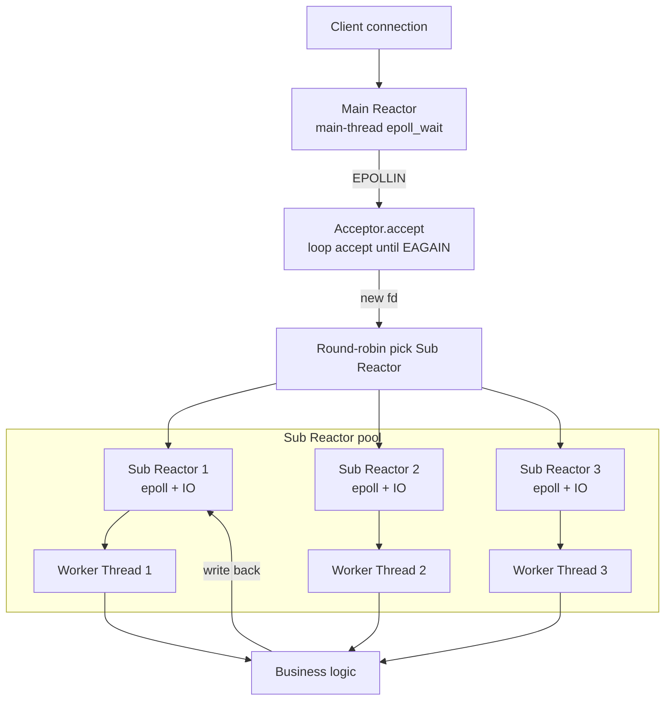
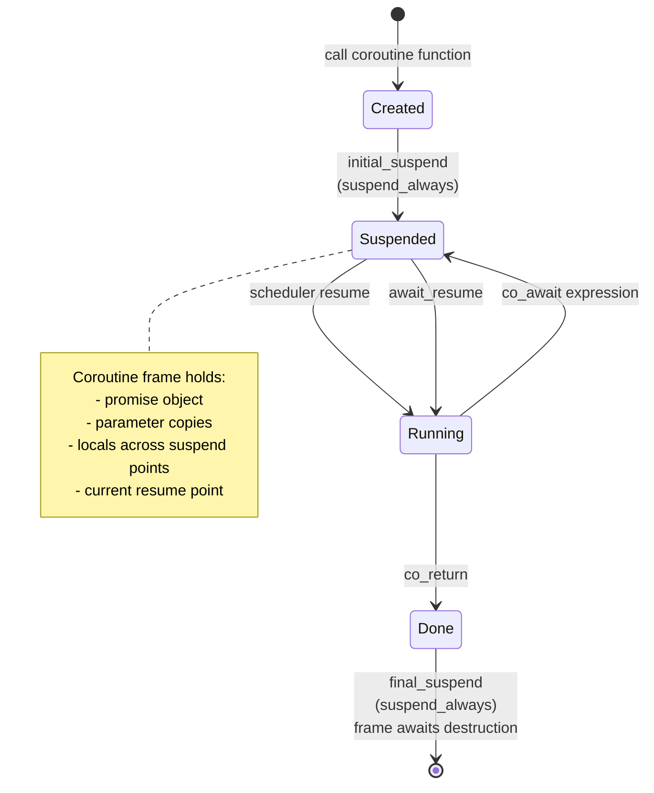

# Module 09 — epoll & C++20 Coroutines

> Source: [io_context.h](file:///c:/Users/Administrator/Desktop/hellocpp/skynet/include/skynet/net/io_context.h), [task.h](file:///c:/Users/Administrator/Desktop/hellocpp/skynet/include/skynet/core/task.h), [executor.h](file:///c:/Users/Administrator/Desktop/hellocpp/skynet/include/skynet/core/executor.h), [socket.h](file:///c:/Users/Administrator/Desktop/hellocpp/skynet/include/skynet/net/socket.h)

## Background & Motivation

The classic `select` and `poll` calls were fine when a server handled a few hundred connections, but they scale catastrophically: `select` is capped at 1024 fds by `FD_SETSIZE`, and both scan the entire fd set in O(n) on every call, copying the full set between user and kernel each time. At 10k+ connections (the C10k problem, then C100k), that overhead dominates — you spend more time scanning idle fds than servicing active ones. `epoll` was Linux's answer: a red-black tree holds registered fds, a ready list collects only the ones the kernel has marked active, and `epoll_wait` returns in O(1) for the ready set. It is the foundation of every high-concurrency Linux server from Nginx to Redis to skynet.

In TitanKV, this module lifts us out of the single-threaded minikv engine and into the networked `skynet` layer: `IOContext` wraps epoll into a Reactor, `Task<T>` and `promise_type` give us stackless C++20 coroutines, and the `Executor` ties them together so that `co_await stream.read(1024)` looks synchronous but actually suspends and yields back to the event loop. This is exactly the machinery our HTTP proxy (Module 10) and gateway will run on — without it, we cannot serve thousands of concurrent client connections on a handful of threads.

After this module, you should be able to answer "why is epoll faster than select" from both the data-structure and copy-cost angles, explain why edge-triggered mode mandates non-blocking IO and a loop-until-EAGAIN read, and articulate the difference between stackless C++20 coroutines and stackful goroutines. You will also be able to defend symmetric transfer as the fix for stack overflow in recursive `co_await` — a deep-dive question that separates coroutine users from coroutine implementers, and one that maps directly to the `final_awaiter` design in `task.h`.

## 1. Core Knowledge

- IO multiplexing: select / poll / epoll; epoll uses a red-black tree + a ready list, returning ready fds in O(1).
- LT (level-triggered) vs ET (edge-triggered): ET must use non-blocking IO + loop read/write until EAGAIN.
- Reactor pattern: event loop + callback dispatch; main/sub Reactors + a thread pool.
- C++20 coroutine keywords: `co_await` / `co_yield` / `co_return`; stackless coroutines, state-machine transformation.
- The `promise_type` protocol: `get_return_object` / `initial_suspend` / `final_suspend` / `return_value` / `unhandled_exception`.
- The Awaiter three methods: `await_ready` / `await_suspend` / `await_resume`.
- Symmetric Transfer: `await_suspend` returns a `coroutine_handle` for zero-overhead tail jumps.

## 2. Deep Dive

### 2.1 IO Multiplexing Comparison

| Feature | select | poll | epoll |
|---|---|---|---|
| FD limit | 1024 (FD_SETSIZE) | none | none (millions) |
| Data copy | full fd_set copy each call | full pollfd[] copy each call | only on epoll_ctl add/mod/del |
| Complexity | O(n) scan | O(n) scan | O(1) ready only |
| Trigger mode | LT only | LT only | LT + ET |
| Cross-platform | yes | yes | Linux only |

Why epoll is fast:

1. A red-black tree stores registered fds; `epoll_ctl` add/mod/del is O(log n).
2. Ready fds go on a doubly-linked list; `epoll_wait` takes from it in O(1).
3. The kernel's `ep_poll_callback` inserts into the ready list when an fd becomes ready — no full scan.

### 2.2 minikv's IOContext

[io_context.h:10-25](file:///c:/Users/Administrator/Desktop/hellocpp/skynet/include/skynet/net/io_context.h) wraps epoll:

```cpp
class IOContext {
public:
    using Callback = std::function<void(uint32_t)>;
    void add(int fd, uint32_t events, Callback cb);    // EPOLL_CTL_ADD
    void modify(int fd, uint32_t events);              // EPOLL_CTL_MOD
    void remove(int fd);                               // EPOLL_CTL_DEL
    bool poll(int timeout_ms);                         // epoll_wait
private:
    int epoll_fd_;
    std::unordered_map<int, Callback> callbacks_;      // fd → callback
};
```

Key points:

- `callbacks_` is an `unordered_map<int, Callback>` mapping fd → callback; `poll` looks up and invokes after taking ready fds.
- `uint32_t events` is an epoll event bitmask (`EPOLLIN`/`EPOLLOUT`/`EPOLLET`/`EPOLLONESHOT`).
- `kMaxEvents = 1024` is the max events returned per `epoll_wait`.

### 2.3 LT vs ET

- **LT (level-triggered, default)**: as long as the fd buffer is readable/writable, every `epoll_wait` returns the event. Forgiving, simple, allows blocking IO.
- **ET (edge-triggered, needs `EPOLLET`)**: notifies once on state change; you must read it all (loop `read` to `EAGAIN`), or data is lost. Must use non-blocking IO.

ET caveats:

- accept may miss connections (many arrive at once but only one notification) — loop accept to EAGAIN.
- write events busy-loop (always writable) — register on demand.
- Production often adds `EPOLLONESHOT`: one fd handled by one thread at a time, avoiding races.

### 2.4 The Reactor Pattern

Classic variants:

1. **Single Reactor single thread** (Redis before 6): one thread runs epoll + business; simple but single-core only.
2. **Single Reactor multi thread**: main thread accept + IO; workers handle business.
3. **Main-sub Reactor multi thread** (muduo default): main Reactor only accepts; sub Reactors handle IO; business goes to a thread pool.

Key components: EventLoop (IOContext), Channel (fd+events+callback), Acceptor, TcpConnection, ThreadPool.

skynet's `Executor` ([executor.h](file:///c:/Users/Administrator/Desktop/hellocpp/skynet/include/skynet/core/executor.h)) is the EventLoop + coroutine scheduler.

#### Main-Sub Reactor Multi-Threaded Architecture



#### C++20 Coroutine State Machine



### 2.5 The Essence of C++20 Coroutines

C++20 coroutines are **stackless**:

- The coroutine frame is on the heap, containing the promise, parameters, locals that live across suspend points, and the resume point state.
- The compiler transforms the coroutine into a state machine; suspend points (`co_await`) are state transitions.
- Switching cost ≈ a function call, far less than a thread context switch.

Compared to Go goroutines (stackful): stackful coroutines have their own stack and can suspend from deep nesting; stackless coroutines can only suspend at the top level, but use less memory.

### 2.6 The Task Type and promise_type

[task.h:22-34](file:///c:/Users/Administrator/Desktop/hellocpp/skynet/include/skynet/core/task.h) implements `promise_type`:

```cpp
struct promise_type {
    std::optional<T> result_;
    std::exception_ptr exception_;
    std::coroutine_handle<> awaiter_;        // who is waiting on me

    Task get_return_object() {
        return Task{std::coroutine_handle<promise_type>::from_promise(*this)};
    }
    std::suspend_always initial_suspend() noexcept { return {}; }   // lazy start
    final_awaiter final_suspend() noexcept { return {awaiter_}; }  // return to awaiter on finish
    void return_value(T v) { result_ = std::move(v); }
    void unhandled_exception() { exception_ = std::current_exception(); }
};
```

Key points:

- **`initial_suspend` returns `suspend_always`**: the coroutine suspends immediately on creation, doesn't auto-run (lazy) — the caller decides when to `resume`.
- **`final_suspend` returns `final_awaiter`**: on finish, returns to the awaiter (`awaiter_`) rather than destroying — avoids dangling handles.
- **`return_value`**: `co_return v` stores the result in `result_`.
- **`unhandled_exception`**: captures the exception into `exception_ptr`; `await_resume` rethrows it.

### 2.7 Awaiter and co_await

The `co_await expr` flow:

1. `expr.await_ready()`: if true, take the result without suspending.
2. If false, call `expr.await_suspend(handle)`: may return void (suspend) / bool (true=suspend, false=resume) / `coroutine_handle` (symmetric transfer to another coroutine).
3. On resume, call `expr.await_resume()` for the result.

[task.h:49-57](file:///c:/Users/Administrator/Desktop/hellocpp/skynet/include/skynet/core/task.h) — Task itself is an Awaiter:

```cpp
bool await_ready() const { return false; }
void await_suspend(std::coroutine_handle<> awaiter) {
    handle_.promise().awaiter_ = awaiter;    // record who waits
    handle_.resume();                         // start the awaited coroutine
}
T await_resume() {
    if (handle_.promise().exception_) std::rethrow_exception(...);
    return std::move(*handle_.promise().result_);
}
```

On `co_await innerTask()`: save the current handle as innerTask's awaiter, start innerTask; when innerTask finishes, `final_awaiter` resumes the awaiter (the outer coroutine).

### 2.8 Symmetric Transfer

`final_awaiter.await_suspend` returns a `coroutine_handle` (not void):

```cpp
void await_suspend(std::coroutine_handle<>) noexcept {
    if (awaiter_) awaiter_.resume();    // resume the awaiter directly
}
```

Note this actually returns void, but if you change it to return `awaiter_` (a handle), that's **symmetric transfer**: the compiler jumps directly to the awaiter without pushing a stack frame. This is the key to avoiding stack overflow in C++20 coroutines — recursive `co_await` doesn't accumulate frames.

Strict symmetric transfer:

```cpp
std::coroutine_handle<> await_suspend(std::coroutine_handle<>) noexcept {
    return awaiter_;   // return a handle for symmetric transfer
}
```

### 2.9 Executor Scheduling

C++20 **provides only language primitives, no scheduler/runtime**. skynet's `Executor` implements its own:

- `spawn(Task)`: enqueue a coroutine handle on the ready queue.
- `run()`: event loop — `epoll_wait` takes ready fds → resumes the corresponding coroutine → coroutine suspends on `co_await` IO → IO readiness resumes it.
- When a coroutine suspends, its fd is registered with epoll; resumption is driven by epoll events.

```cpp
skynet::Task<int> handle_client(TcpStream stream) {
    auto data = co_await stream.read(1024);   // suspend, register fd with epoll
    co_await stream.write("Hello!\n");        // suspend
    co_return 0;
}
```

## 3. Thinking Questions

1. Why is epoll faster than select? Explain from both data-structure and copy-cost angles.
2. In ET mode, what happens if `read` returns without reaching EAGAIN?
3. C++20 coroutines are "stackless" — what does that mean? The essential difference from Go goroutines?
4. `initial_suspend` returning `suspend_always` vs `suspend_never` — what's the impact on coroutine lifetime management?
5. Why does symmetric transfer prevent stack overflow? What happens to recursive `co_await` without it (returning void)?

## 4. Hands-on Exercises

### Exercise 4.1 (Hand-write an epoll ET echo server)

Following [io_context.h](file:///c:/Users/Administrator/Desktop/hellocpp/skynet/include/skynet/net/io_context.h), implement an echo server with epoll ET: set `O_NONBLOCK` on listenfd and clientfd, register `EPOLLIN | EPOLLET`, loop accept to EAGAIN, loop read to EAGAIN. Benchmark with `ab` or `wrk`.

### Exercise 4.2 (Hand-write a Minimal Task)

Following [task.h](file:///c:/Users/Administrator/Desktop/hellocpp/skynet/include/skynet/core/task.h), implement a minimal `Task<T>`: support `co_return`, `co_await`, exception propagation, lazy start. Test: `Task<int> f() { co_return 42; }`, `auto v = co_await f();` verify v==42.

### Exercise 4.3 (Coroutine-ize a TCP Read)

Implement an `AwaitableRead`: wrap fd + read buffer; `await_suspend` registers the fd with IOContext's `EPOLLIN`; the epoll event resumes the coroutine; `await_resume` returns bytes read. Compare readability with a raw epoll callback version.

### Exercise 4.4 (Symmetric Transfer Verification)

Write a recursive `co_await` chain: `a() → b() → c() → ...` 10,000 deep. Compare stack usage with `final_awaiter` returning void vs returning a handle (symmetric transfer). Use `ulimit -s` to observe stack overflow.

## 5. Self-Check

1. epoll stores registered fds in a ____; ready fds in a ____.
2. ET mode must use ____ IO and ____ read until EAGAIN.
3. C++20 coroutines are ____ (stackful/stackless); the frame is allocated on the ____.
4. `promise_type` must implement 5 methods: get_return_object / ____ / ____ / return_value / ____.
5. Symmetric transfer means `await_suspend` returns a ____, the compiler jumps ____, avoiding ____.

<details>
<summary>Reference Answers</summary>

1. red-black tree; doubly-linked list (ready list)
2. non-blocking; loop
3. stackless; heap
4. initial_suspend; final_suspend; unhandled_exception
5. coroutine_handle; directly (no stack push); stack overflow

Thinking question key points:
1. Data structure: select/poll use arrays scanned in full O(n); epoll uses a red-black tree O(log n) for add/del and a ready list O(1) for retrieval. Copy: select/poll copy the full fd set every call; epoll copies once at ctl time.
2. Remaining data stalls in the kernel buffer; ET won't notify again, so it's "lost" (until new data triggers). You must loop to EAGAIN to drain.
3. Stackless: the frame is on the heap; the compiler transforms to a state machine; suspend points are state transitions; cannot suspend from deep nesting. Go goroutines are stackful with their own stack and can suspend deeply, but allocating a stack costs.
4. suspend_always: created but not auto-run; the caller controls when to resume — safer lifetime. suspend_never: runs immediately to the first suspend point, possibly surprising timing.
5. Returning void: each `co_await` resumes the inner coroutine on the outer's stack, accumulating frames — deep recursion overflows. Returning a handle (symmetric transfer): the compiler tail-jumps, no frame accumulation, unbounded recursion OK.

</details>

---

← [Module 08](./08-compaction-mvcc.md)  |  Next: [Module 10 — HTTP & Reverse Proxy](./10-http-proxy.md) →
