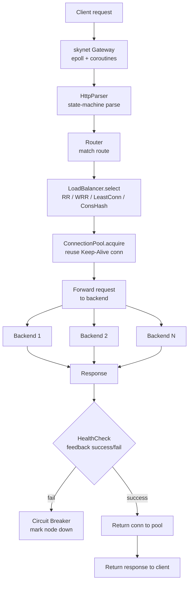

# Module 10 — HTTP & Reverse Proxy

> Source: [parser.h](file:///c:/Users/Administrator/Desktop/hellocpp/skynet/include/skynet/http/parser.h), [router.h](file:///c:/Users/Administrator/Desktop/hellocpp/skynet/include/skynet/http/router.h), [load_balancer.h](file:///c:/Users/Administrator/Desktop/hellocpp/skynet/include/skynet/proxy/load_balancer.h), [connection_pool.h](file:///c:/Users/Administrator/Desktop/hellocpp/skynet/include/skynet/proxy/connection_pool.h), [health_check.h](file:///c:/Users/Administrator/Desktop/hellocpp/skynet/include/skynet/proxy/health_check.h)

## Background & Motivation

In a microservice system, the gateway is the throat every request passes through — it terminates TLS, parses HTTP, enforces auth and rate limits, picks a healthy backend, and forwards traffic, all while hiding the backend topology from clients. Nginx, Envoy, and HAProxy all play this role in production, and their internals (state-machine HTTP parsing, weighted round-robin, connection pools, health checks) are exactly what we reimplement in `skynet/gateway`. Get the gateway wrong and a single slow backend cascades into a full outage; get it right and burst traffic is absorbed, failing nodes are isolated, and the system degrades gracefully.

In TitanKV, this module is where the storage engine meets the network: the `HttpParser` we build here feeds the router, the `LoadBalancer` picks a backend, the `ConnectionPool` reuses TCP connections to amortize handshake cost, and `HealthCheck` couples passive circuit-breaking back into `select()`. It sits between the epoll/coroutine layer (Module 09) and the full Go microservice stack (Module 12) — a native C++ gateway that can later be replaced or fronted by a Go service mesh.

By the end of this module, you should be able to hand-write a streaming HTTP/1.1 parser with a state machine and defend it over `sscanf`/regex, explain Nginx's smooth weighted round-robin and why `{5,1,1}` yields `a a b a c a a` instead of `a a a a a b c`, and reason about the four load-balancing strategies and when each fits. You will also be ready for classic interview questions like "what if a pooled connection is stale" and "how do you defend against a forged huge `Content-Length`" — the kind of edge cases that distinguish "I've used Nginx" from "I can build one."



## 1. Core Knowledge

- HTTP/1.1 message structure: request line / headers / blank line / body; state-machine parsing.
- TCP packet sticking/splitting: a stream protocol with no message boundaries; solve via length-prefix / delimiter / Content-Length.
- Four load-balancing strategies: Round-Robin (RR), Weighted RR (WRR), Least-Connection, Consistent Hash.
- Connection pool: reuse TCP connections to avoid handshake overhead, Keep-Alive.
- Health checks: active probing + passive circuit breaking; remove failed nodes.
- Reverse proxy: client → proxy → backend cluster; hides backend topology, load-spreading, SSL offloading.

## 2. Deep Dive

### 2.1 HTTP/1.1 State-Machine Parsing

[parser.h:13-31](file:///c:/Users/Administrator/Desktop/hellocpp/skynet/include/skynet/http/parser.h) parses with a state machine:

```cpp
enum class State {
    kMethod, kPath, kVersion, kHeaderName, kHeaderValue, kBody, kDone
};
class HttpParser {
    ParseResult feed(const char* data, size_t len);   // feed data
    bool isComplete() const { return state_ == State::kDone; }
    HttpRequest result() const;
};
```

State transitions:

```
kMethod ──' '──► kPath ──' '──► kVersion ──\r\n──► kHeaderName
   ▲                                              │
   │                                         \r\n (blank line)
   │                                              │
   │                                              ▼
   └──────────────────────────────────────── kBody ──► kDone
```

Key points:

- **Streaming parse**: `feed` may be called multiple times; insufficient data returns `kNeedMoreData`, parsing continues next time — fits TCP segmentation.
- **`buffer_` caches half-packets**: unconsumed data is retained and concatenated with the next chunk.
- **`content_length_` / `chunked_`**: determine body boundaries — fixed length or chunked encoding.
- **State machine beats regex**: higher performance, resumable, precise error location.

### 2.2 TCP Packet Sticking/Splitting

TCP is a byte stream, no message boundaries:

- **Sticking**: multiple sends merge into one segment.
- **Splitting**: one send splits into multiple segments.

Solutions:

1. **Fixed length**: each message is fixed-length, padded if short.
2. **Delimiter**: e.g. `\r\n` (HTTP, Redis protocol).
3. **Length prefix** (most common): a length field in the header; read length first, then body.
4. **Structured protocol**: TLV (Type-Length-Value).

HTTP uses `Content-Length` (fixed) or `Transfer-Encoding: chunked` for boundaries. HttpParser's `buffer_` handles half-packet retention.

### 2.3 Load-Balancing Strategies

[load_balancer.h:11-52](file:///c:/Users/Administrator/Desktop/hellocpp/skynet/include/skynet/proxy/load_balancer.h) defines an abstract base + four implementations:

```cpp
class LoadBalancer {
public:
    virtual std::shared_ptr<Upstream> select() = 0;
    virtual void feedback(const Upstream& up, bool success) {}
};
```

#### Round-Robin

```cpp
class RoundRobinLB : public LoadBalancer {
    size_t idx_{0};
    std::shared_ptr<Upstream> select() override { return mgr_->at(idx_++ % n); }
};
```

- Fair, simplest; assumes all backends are equivalent.

#### Weighted Round-Robin

- Each backend has a weight; higher weight gets more requests. Nginx's smooth WRR: keep a `current_weight`; each round `current_weight += effective_weight`, pick the max, then `current_weight -= total` for the chosen one.
- Good for heterogeneous clusters (4C8G vs 8C16G).

#### Least-Connection

- Pick the backend with the fewest active connections. Good when request processing time varies (some slow).
- Requires real-time connection counts from backends or tracked by the proxy.

#### Consistent Hash

```cpp
class ConsistentHashLB : public LoadBalancer {
    std::vector<std::pair<uint32_t, std::shared_ptr<Upstream>>> ring_;  // hash ring
    void buildRing();   // vnodes per backend
};
```

- The same key (e.g. user_id) always routes to the same backend (unless it goes down) — good for local cache hit rate.
- Virtual nodes (default 160) ensure evenness.
- Same principle as Module 06's consistent hashing, used here for request routing.

### 2.4 Connection Pool

[connection_pool.h](file:///c:/Users/Administrator/Desktop/hellocpp/skynet/include/skynet/proxy/connection_pool.h): reuse TCP connections.

- **Problem**: a new TCP connection per request needs a 3-way handshake + TLS handshake — high latency, kernel resource cost.
- **Solution**: keep several long connections per backend in a pool; borrow on request, return on completion; close idle connections past a timeout.
- **Keep-Alive**: HTTP/1.1 default on; reuse a connection for multiple requests.
- **Pool-size trade-off**: too small queues requests; too large wastes resources and pressures backends.

### 2.5 Health Checks

[health_check.h](file:///c:/Users/Administrator/Desktop/hellocpp/skynet/include/skynet/proxy/health_check.h):

- **Active probing**: periodically send a health request (e.g. `GET /health`); after N failures mark the node down.
- **Passive circuit breaking**: when the normal-request failure rate exceeds a threshold, temporarily remove the backend; half-open probe to recover.
- **Circuit-breaker states**: Closed (normal) → Open (tripping, reject) → Half-Open (let a few probes through) → Closed.
- Couples with `LoadBalancer::feedback(success)`: failures feed back and affect subsequent `select`.

### 2.6 Overall Reverse-Proxy Flow

```
Client ──► [skynet Gateway]
            │
            ├─ HttpParser parses the request
            ├─ Router matches the route
            ├─ LoadBalancer.select() picks a backend
            ├─ ConnectionPool lends a connection
            ├─ Forward request → backend response
            ├─ HealthCheck.feedback(success)
            └─ Return the connection to the pool
            │
            ▼
        Backend Pool (N backends)
```

skynet's `gateway/` ([gateway/main.cpp](file:///c:/Users/Administrator/Desktop/hellocpp/skynet/gateway/main.cpp)) is exactly such a reverse proxy; config in [gateway.yaml](file:///c:/Users/Administrator/Desktop/hellocpp/skynet/gateway/gateway.yaml).

## 3. Thinking Questions

1. Why does HttpParser use a state machine instead of `sscanf`/regex? How is `kNeedMoreData` handled in streaming parsing?
2. HTTP uses `Content-Length` for boundaries. If a client forges a huge `Content-Length` but sends no body, how does the server defend?
3. What does "smooth" mean in WRR? How does Nginx's smooth WRR avoid concentrated hits?
4. When consistent-hash LB is used for routing, what should the key be (user_id? request_id?)? What's the impact of different choices?
5. A pooled connection is stale (backend restarted); the proxy borrows it, the request fails. How to handle?

## 4. Hands-on Exercises

### Exercise 4.1 (Hand-write an HTTP request parser)

Following [parser.h](file:///c:/Users/Administrator/Desktop/hellocpp/skynet/include/skynet/http/parser.h), implement an HTTP/1.1 request line + header parser (no body). Test: `feed` the same request in 3 chunks (simulate splitting), verify final `isComplete()` and correct fields.

### Exercise 4.2 (Smooth Weighted Round-Robin)

Implement Nginx's smooth WRR: 3 backends with weights {a:5, b:1, c:1}, call `select()` 7 times, verify the sequence is `a a b a c a a` (spread, not concentrated).

### Exercise 4.3 (Consistent-Hash LB)

Following `ConsistentHashLB` in [load_balancer.h](file:///c:/Users/Administrator/Desktop/hellocpp/skynet/include/skynet/proxy/load_balancer.h), implement `select(key)`: hash the key, find the next virtual node clockwise. Test: 1M keys across 5 backends, std-dev < 5%; after taking 1 backend down, only ~1/5 of keys migrate.

### Exercise 4.4 (Connection Pool + Health Check)

Implement a simple connection pool: `acquire(host) → conn`, `release(conn)`, with idle-timeout reclamation. Add passive health check: on failure, destroy the connection, increment the backend's failure count; 3 consecutive failures mark it down for 30s.

## 5. Self-Check

1. An HTTP/1.1 request consists of ____, ____, a blank line, and body.
2. TCP packet sticking is essentially because TCP is a ____ protocol with no ____.
3. The four LB strategies: ____, ____, ____, consistent hash.
4. A connection pool reuses TCP connections to avoid ____ and ____ overhead.
5. The three circuit-breaker states: ____ → ____ → ____.

<details>
<summary>Reference Answers</summary>

1. request line (method/path/version); headers
2. byte stream; message boundaries
3. Round-Robin (RR); Weighted RR (WRR); Least-Connection
4. 3-way handshake; TLS handshake
5. Closed; Open; Half-Open

Thinking question key points:
1. State machine: high performance (single O(n) pass), resumable (insufficient data buffered for next time), precise error location. On `kNeedMoreData`, the unconsumed data goes into `buffer_`; the next `feed` concatenates and continues.
2. Read timeout: after parsing the header, set a body-read timeout (e.g. 30s); close the connection on timeout; cap `Content-Length` to prevent OOM; read in chunks without pre-allocating a huge buffer.
3. "Smooth" means high-weight backends are spread across rounds, not hit consecutively. Nginx: each round every backend `current_weight += effective_weight`, pick the max, the chosen one `current_weight -= total_weight`. So {5,1,1} yields `a,a,b,a,c,a,a` instead of `a,a,a,a,a,b,c`.
4. Using user_id/session_id helps local cache hits (same user → same backend); using request_id spreads fully with no affinity. Depends on whether session stickiness is needed.
5. On failure (RST/timeout), destroy the connection and remove it from the pool; retry 1-2 times with a fresh connection; still failing → `feedback(false)` triggers health check, marks the backend down, LB skips it.

</details>

---

← [Module 09](./09-epoll-coroutine.md)  |  Next: [Module 11 — Raft & Sharding](./11-raft-sharding.md) →
