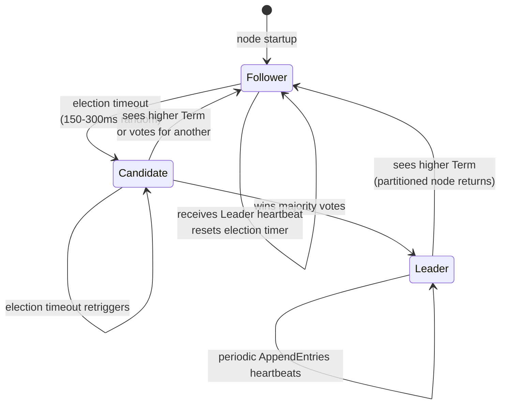
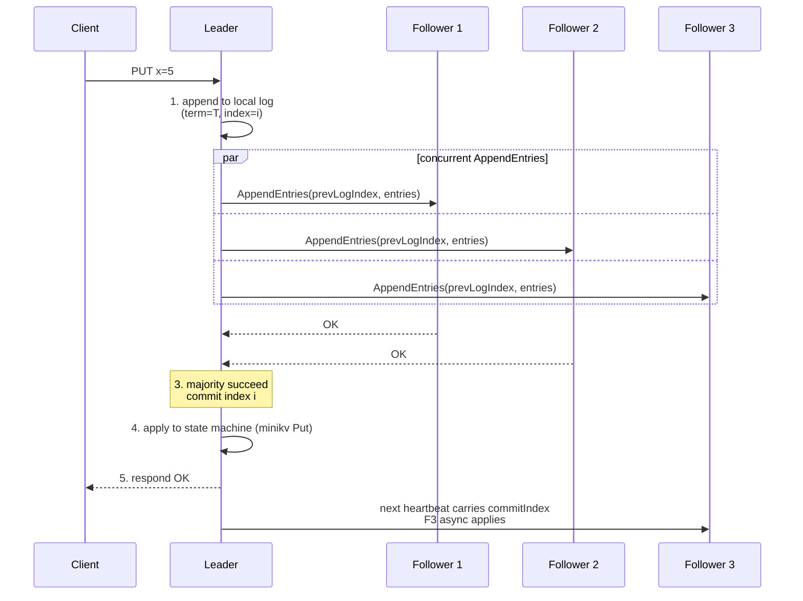

# Module 11 — Raft & Sharding

> Source: REFACTORING.md Phase 5 (`distributed/` — etcd + hashicorp/raft + consistent-hash sharding)
> References: the Raft paper "In Search of an Understandable Consensus Algorithm", TiKV architecture, etcd docs

## Background & Motivation

Paxos is mathematically elegant but notoriously hard to implement correctly — multi-Paxos is more of a "build your own consensus" toolkit than a usable algorithm, and most production teams that try it ship bugs. Raft was designed from the ground up for *understandability*: a strong Leader, a monotonically increasing Term, log replication via `AppendEntries`, and a random election timeout to split votes — every mechanism exists for an explicit, teachable reason. It is the algorithm behind etcd, Consul, TiKV, and CockroachDB, and it is what TitanKV Phase 5 plans to wrap around the minikv engine via `hashicorp/raft`.

In TitanKV, this module is the leap from a single-node engine to a fault-tolerant, horizontally scalable distributed store: Raft gives us a replicated log so that a 3- or 5-node cluster survives node failures without losing committed data, and sharding (via consistent hashing from Module 06) spreads data across multiple Raft groups so the cluster grows beyond a single machine's disk and CPU. The PD (Placement Driver), itself built on etcd, maintains the routing table and schedules shard splits and migrations — exactly the architecture TiKV uses in production.

After this module, you should be able to draw the Follower/Candidate/Leader state machine, walk through a full election and log-replication sequence, and explain why random timeouts prevent vote splitting and why PreVote avoids disruption from partitioned nodes returning with a high Term. You will also be ready for system-design questions like "design a 5-node Raft cluster tolerating 2 failures" and "consistent hash vs range sharding — why does TitanKV pick consistent hash" — both of which are common final-round questions for distributed-systems roles.

## 1. Core Knowledge

- The consensus problem: multiple replicas agree on log order, tolerating minority failures.
- Raft's three roles: Follower / Candidate / Leader; Term monotonically increases.
- Leader election: triggered by random timeout (150-300ms); majority of votes wins.
- Log replication: Leader appends → concurrent AppendEntries → majority commit → apply.
- Safety: committed logs are never overwritten (Leader Completeness).
- Optimizations: PreVote, Joint Consensus, Snapshot log compaction.
- Sharding: range / hash / consistent hash; PD (Placement Driver) routing.
- Linearizable reads: ReadIndex / Lease Read.

## 2. Deep Dive

### 2.1 Why Consensus

A single-node store loses data or availability on failure. Replication adds availability but introduces **consistency** problems:

- How do replicas synchronize?
- How to elect a new primary when one fails?
- How to avoid split-brain under network partition?

Consensus algorithms (Raft/Paxos/ZAB) solve "a group of replicas agreeing on log order." TitanKV Phase 5 plans to wrap the minikv engine with `hashicorp/raft` (a Go implementation).

### 2.2 Raft's Three Roles and Election



- **Follower**: passively receives Leader heartbeats/logs; if no heartbeat before timeout, becomes Candidate.
- **Candidate**: increments Term, votes for itself, sends `RequestVote` RPC; on majority becomes Leader; on seeing a higher Term, falls back to Follower.
- **Leader**: sends periodic heartbeats; all writes go through the Leader.

Election rules:

- Each node votes at most once per Term (first-come-first-served).
- The candidate's log must be at least as up-to-date as the voter's (`lastLogTerm` greater, or equal with `lastLogIndex` greater).
- Random timeout (150-300ms) prevents multiple nodes from campaigning simultaneously.

### 2.3 Log Replication



Log consistency guarantees:

- `AppendEntries` carries `prevLogIndex/prevLogTerm`; the Follower verifies the local position matches.
- On mismatch the Follower rejects; the Leader decrements `nextIndex` and retries, eventually overwriting the Follower's log.
- **Leader Completeness**: committed logs are present in all future Leaders (guaranteed by the voting rules).

### 2.4 Safety and Membership Changes

- **Safety**: committed logs are never overwritten. Ensures eventual state-machine consistency.
- **Joint Consensus** (membership change): alternate between old and new majority sets to add/remove nodes safely.
- **PreVote**: the Candidate first sends PreVote (without incrementing Term) to probe, avoiding disruption from partitioned nodes returning with a high Term.

### 2.5 Snapshot Log Compaction

Unbounded log growth fills the disk and slows restart recovery. Snapshot:

- Periodically write the current state-machine snapshot to disk, discarding logs before the snapshot point.
- Lagging Followers receive the snapshot via `InstallSnapshot` RPC.
- minikv's SSTables are naturally suited — a batch of SSTable files is the state-machine snapshot.

`hashicorp/raft`'s FSM interface: `Apply(log) / Snapshot() / Restore(snapshot)`. minikv implements these three methods to plug in.

### 2.6 Sharding Strategies

A single Raft group has a capacity ceiling (one machine's disk + replication bandwidth). Sharding spreads data across groups:

| Strategy | Trait | Use |
|---|---|---|
| Range | keys split in order, supports range scans | TiKV Region |
| Hash | `hash(key) % N`, even but no ranges | Redis Cluster |
| Consistent hash | ring + virtual nodes, low migration | Cassandra, TitanKV plan |

TitanKV plans to use consistent hashing (see Module 06) + PD routing:

- **PD (Placement Driver)**: a centralized routing table recording which Raft group serves each shard.
- Clients cache the routing table; on cache miss, query the PD.
- Oversized shards split; hot shards migrate.

#### Consistent-Hash Sharding + PD Routing

```mermaid
flowchart TD
    Client[Client PUT key=foo] --> Cache{Local routing cache<br/>hit?}
    Cache -->|yes| Shard[Find shard = Raft Group 3]
    Cache -->|no| PD[Query PD]
    PD -->|return shard| Shard
    Shard --> Leader[Connect to Raft Group 3 Leader]
    Leader --> Replicate[Replicate to Followers]

    subgraph Ring["Consistent-Hash Ring (virtual nodes)"]
        N1[Node A<br/>range [0, 1/4)] --> N2[Node B<br/>range [1/4, 1/2)]
        N2 --> N3[Node C<br/>range [1/2, 3/4)]
        N3 --> N4[Node D<br/>range [3/4, 1)]
        N4 --> N1
    end

    PD -.maintains.-> Ring
    PD -.watch.-> ETCD[(etcd<br/>routing table store)]
```

### 2.7 Linearizable Reads

By default Raft writes go through the Leader + majority, but a **read** that just reads the Leader's local state may return stale data (the Leader thinks it's still Leader but has actually been deposed).

- **ReadIndex**: before reading, the Leader sends a heartbeat round to confirm it's still Leader, notes the commitIndex, waits for the state machine to apply up to that index, then reads.
- **Lease Read**: the Leader uses a heartbeat lease to confirm its identity; within the lease, reads go directly, saving a round of RPC (relies on clocks).
- TitanKV can choose ReadIndex for strong consistency or Lease Read for higher read throughput.

### 2.8 etcd Service Discovery

[deploy/dev/docker-compose.yml](file:///c:/Users/Administrator/Desktop/hellocpp/deploy/dev/docker-compose.yml) starts a local etcd. Uses:

- **Service registration**: each TitanKV node registers on startup; the PD watches changes.
- **Config distribution**: the routing table and shard assignments go into etcd; clients watch.
- **Leader election**: the PD itself is elected via etcd (etcd is itself Raft-based).

## 3. Thinking Questions

1. Why does Raft use random timeouts (150-300ms) instead of a fixed timeout?
2. After a Leader fails, what happens to uncommitted logs (already replicated to some Followers)?
3. What problem does PreVote solve? What happens without it?
4. Consistent-hash vs range sharding (TiKV Region): pros and cons? Why does TitanKV plan consistent hash?
5. Lease Read relies on clocks. What does clock drift cause? How to mitigate?

## 4. Hands-on Exercises

### Exercise 4.1 (Raft Election Simulation)

Use 5 goroutines to simulate a 5-node Raft: implement `RequestVote` / `AppendEntries` RPCs (via Go channels), random election timeouts. Verify: (a) at most 1 Leader at any time; (b) a new Leader is elected within 5s of killing the old one.

### Exercise 4.2 (Minimal FSM with hashicorp/raft)

Use `hashicorp/raft` to build a 3-node cluster with an in-memory map FSM. Verify: writing to the Leader is readable from any Follower; writing still works after killing the Leader.

### Exercise 4.3 (Consistent-Hash Sharding + PD Routing)

Implement a simplified PD: maintain a `shardID → node` routing table (in etcd). Client `Get(key)`: `shardID = hash(key) % N` → query PD → route to the node. Simulate node failure, verify routing updates and migration triggers.

### Exercise 4.4 (Linearizable Read)

On top of Exercise 4.2, implement ReadIndex: before reading, the Leader sends a heartbeat round to confirm identity, notes commitIndex, waits for apply, then reads. Compare against the "stale read" case of reading the Leader directly (simulate a partition).

## 5. Self-Check

1. The three Raft roles: ____ / ____ / ____.
2. Election is triggered by ____, random range typically ____ ms.
3. Log replication needs a ____ majority to commit, guaranteeing ____.
4. PreVote solves ____; Snapshot solves ____.
5. Two linearizable-read schemes: ____ (strong but slow) and ____ (fast but clock-dependent).

<details>
<summary>Reference Answers</summary>

1. Follower; Candidate; Leader
2. a Follower timeout with no Leader heartbeat; 150-300
3. majority; committed logs are never overwritten (Leader Completeness)
4. disruption from partitioned nodes with high Terms; unbounded log growth
5. ReadIndex; Lease Read

Thinking question key points:
1. With a fixed timeout, multiple nodes time out simultaneously and all campaign, splitting votes; many retries needed. Random timeouts make one node time out first and campaign, greatly reducing vote splitting.
2. Uncommitted logs are not necessarily preserved by the new Leader (unless already replicated to a majority and present in the new Leader). The new Leader uses its own log to overwrite inconsistent Follower logs; if the uncommitted log isn't in the new Leader, it's discarded.
3. PreVote solves "a partitioned node returns with a high Term and forces re-election": the partitioned node's Term grows; on return, the healthy Leader is forced to step down. PreVote probes without incrementing Term; without majority response, no real candidacy.
4. Range supports range scans but is hot-spot-prone (sequential writes cluster); consistent hash is even but has no ranges. TitanKV plans consistent hash because general KV has no strong range needs, and migration is small.
5. Clock drift makes the Leader think the lease hasn't expired (while actually deposed), causing stale reads. Mitigate with conservative lease duration, NTP clock sync, or fall back to ReadIndex when needed.

</details>

---

← [Module 10](./10-http-proxy.md)  |  Next: [Module 12 — Go µServices & Next.js Console](./12-go-nextjs.md) →
