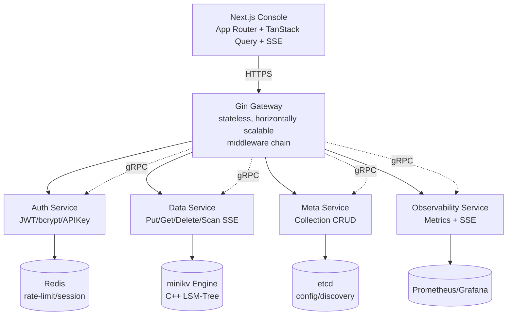

# Module 12 — Go Microservices & Next.js Console

> Mapping: REFACTORING.md Phase 3 (Gateway + Auth), Phase 4 (Data/Meta/Observability + Go SDK), Phase 6 (Next.js console)
> Current status: `gateway/ services/ web/` contain only `.gitkeep`; this module is a *blueprint course* — design and code skeletons are explained against the plan; live sections will be back-filled once Phases land.
> References: Gin docs, JWT RFC 7519, bcrypt paper, Redis Lua scripting guide, Next.js App Router docs, TanStack Query docs

## 1. Core Knowledge

- **Microservice topology**: Gateway (stateless) → Auth / Data / Meta / Observability services → minikv storage engine + etcd config center.
- **Gin middleware chain**: `RequestID → Logger → Recover → RateLimit → Auth → RBAC → Handler`, onion model.
- **Auth trio**: JWT (short-lived Access Token) + Refresh Token (long-lived, Redis-backed) + API Key (machine-to-machine, revocable).
- **Password hashing**: bcrypt (cost=12), salt built-in, rainbow-table & brute-force resistant.
- **Rate limiting**: Redis + Lua token bucket, atomic CAS, distributed-wide.
- **RBAC**: User → Role → Permission; permissions expressed as `resource:action` (e.g. `kv:put`, `collection:create`).
- **Data service**: wraps minikv; Scan returns SSE (Server-Sent Events) stream to avoid blocking on large result sets.
- **Meta service**: Collection metadata CRUD, etcd watch for hot config reload.
- **Go SDK**: typed errors (`ErrNotFound`, `ErrConflict`), exponential backoff retries, context propagation.
- **Next.js App Router**: RSC (React Server Components) for first paint, TanStack Query for client-side caching & retry.
- **Live dashboard**: SSE pushes QPS / latency / storage / node status; shadcn/ui charts render.

## 2. In Depth

### 2.1 Overall Architecture



Principles:

- **Stateless Gateway**: session state externalized to Redis; Gateway scales horizontally.
- **Internal RPC = gRPC** (efficient), external API = REST/SSE (friendly).
- **etcd dual role**: service registry + config center (Collection metadata).
- **Observability triad**: Prometheus (metrics) + Jaeger (tracing) + Loki (logs).

### 2.2 Gin Middleware Chain (Onion Model)

```mermaid
flowchart LR
    Req[HTTP request] --> RID[RequestID<br/>inject X-Request-ID]
    RID --> Log1[Logger<br/>record start time]
    Log1 --> Rec[Recover<br/>catch panic]
    Rec --> RL[RateLimit<br/>Redis token bucket]
    RL --> Auth[Auth<br/>JWT/APIKey verify]
    Auth --> RBAC[RBAC<br/>role permission check]
    RBAC --> Handler[Business Handler]
    Handler --> RBAC2[RBAC post]
    RBAC2 --> Auth2[Auth post]
    Auth2 --> RL2[RateLimit post]
    RL2 --> Rec2[Recover post]
    Rec2 --> Log2[Logger<br/>record latency/status]
    Log2 --> RID2[RequestID<br/>write-back header]
    RID2 --> Resp[HTTP response]
```



Every middleware shares the signature `func(ctx *gin.Context)` (a `gin.HandlerFunc`). Onion model: code *before* `c.Next()` is the "request phase", code *after* is the "response phase".

```go
// gateway/middleware/logger.go
package middleware

import (
    "time"
    "github.com/gin-gonic/gin"
)

func Logger() gin.HandlerFunc {
    return func(c *gin.Context) {
        start := time.Now()
        path := c.Request.URL.Path

        c.Next()  // ← go deeper

        latency := time.Since(start)
        status := c.Writer.Status()
        log.Infof("[GIN] %3d | %13v | %s | %s",
            status, latency, c.ClientIP(), path)
    }
}
```

#### Middleware Roster

| Order | Middleware | Responsibility | On Failure |
|-------|-----------|----------------|------------|
| 1 | RequestID | inject `X-Request-ID` (generate UUID if absent) | always ok |
| 2 | Logger | log method/path/status/latency | always ok |
| 3 | Recover | catch panic, return 500 | 500 |
| 4 | RateLimit | Redis token bucket by IP/UID | 429 |
| 5 | Auth | verify JWT / API Key | 401 |
| 6 | RBAC | check role permissions | 403 |
| 7 | Handler | business logic | — |

#### Why this order

- `RequestID` first: every downstream log line can be correlated by the same ID for full-chain tracing.
- `Logger` before `Recover`: even if a panic occurs, the request is still logged.
- `Recover` before `RateLimit`: protect the process even when throttling.
- `RateLimit` before `Auth`: drop malicious anonymous traffic early; saves Auth CPU.
- `Auth` before `RBAC`: identify *who* first, then check *what they can do*.

### 2.3 Auth: JWT + bcrypt + RefreshToken + APIKey

#### 2.3.1 Password Hashing with bcrypt

```go
// services/auth/password.go
package auth

import "golang.org/x/crypto/bcrypt"

const bcryptCost = 12  // 2^12 ≈ 4096 rounds, ~250ms

func HashPassword(plain string) (string, error) {
    h, err := bcrypt.GenerateFromPassword([]byte(plain), bcryptCost)
    return string(h), err
}

func VerifyPassword(plain, hash string) error {
    return bcrypt.CompareHashAndPassword([]byte(hash), []byte(plain))
}
```

Why not MD5/SHA256:

- Plain hash, no salt → rainbow tables.
- Salted SHA256 → GPU brute force ~10⁹/s.
- bcrypt has built-in salt + tunable cost → GPU cost grows exponentially (cost+1 ≈ 2×).
- Argon2id is the modern alternative (ASIC-resistant); bcrypt remains battle-tested and stable.

#### 2.3.2 JWT Structure

JWT has three base64url-encoded parts: `Header.Payload.Signature`.

```json
// Header
{"alg": "HS256", "typ": "JWT"}

// Payload (Claims)
{
  "sub": "user-uuid",
  "role": "admin",
  "exp": 1735689600,
  "iat": 1735603200,
  "jti": "token-uuid"
}

// Signature
HMAC-SHA256(base64(Header) + "." + base64(Payload), secret)
```

Sign & verify:

```go
// services/auth/jwt.go
package auth

import (
    "time"
    "github.com/golang-jwt/jwt/v5"
)

type Claims struct {
    UserID string `json:"sub"`
    Role   string `json:"role"`
    jwt.RegisteredClaims
}

func Sign(userID, role, secret string, ttl time.Duration) (string, error) {
    now := time.Now()
    claims := Claims{
        UserID: userID,
        Role:   role,
        RegisteredClaims: jwt.RegisteredClaims{
            ExpiresAt: jwt.NewNumericDate(now.Add(ttl)),
            IssuedAt:  jwt.NewNumericDate(now),
            Issuer:    "titan-auth",
        },
    }
    return jwt.NewWithClaims(jwt.SigningMethodHS256, claims).SignedString([]byte(secret))
}

func Parse(tokenStr, secret string) (*Claims, error) {
    claims := &Claims{}
    _, err := jwt.ParseWithClaims(tokenStr, claims, func(t *jwt.Token) (interface{}, error) {
        if _, ok := t.Method.(*jwt.SigningMethodHMAC); !ok {
            return nil, fmt.Errorf("unexpected method: %v", t.Header["alg"])
        }
        return []byte(secret), nil
    })
    return claims, err
}
```

Security notes:

- Access Token TTL short (15-30 min) → small leak window.
- Refresh Token TTL long (7-30 days), stored in Redis for revocation.
- `jti` blacklist: on logout, add jti to Redis with TTL = remaining token lifetime.
- Algorithm whitelist: explicitly reject `alg: none` attacks (the code above checks `*jwt.SigningMethodHMAC`).

#### 2.3.3 RBAC Three-Level Model

```
User ──┐
       ├─► Role ──► Permission
       │           (resource:action)
       └─► many-to-many
```

Permission naming convention `resource:action`:

| Permission | Meaning |
|-----------|---------|
| `kv:get` | read KV |
| `kv:put` | write KV |
| `kv:delete` | delete KV |
| `collection:create` | create Collection |
| `collection:delete` | delete Collection |
| `user:manage` | user management |
| `apikey:issue` | issue API Keys |

Middleware:

```go
// gateway/middleware/rbac.go
package middleware

import (
    "net/http"
    "github.com/gin-gonic/gin"
)

func RBAC(requiredPerm string) gin.HandlerFunc {
    return func(c *gin.Context) {
        role, exists := c.Get("role")
        if !exists {
            c.AbortWithStatusJSON(http.StatusForbidden, gin.H{"error": "no role"})
            return
        }
        if !roleHasPermission(role.(string), requiredPerm) {
            c.AbortWithStatusJSON(http.StatusForbidden, gin.H{"error": "permission denied"})
            return
        }
        c.Next()
    }
}

// Simplified: production loads from DB / etcd.
var rolePerms = map[string]map[string]bool{
    "admin":  {"kv:get": true, "kv:put": true, "kv:delete": true, "user:manage": true},
    "writer": {"kv:get": true, "kv:put": true},
    "reader": {"kv:get": true},
}

func roleHasPermission(role, perm string) bool {
    return rolePerms[role][perm]
}
```

#### 2.3.4 API Key (Machine-to-Machine)

JWT suits human users (browsers); API Key suits services/scripts:

- Format `tk_live_<random32bytes>`, prefix tags environment.
- Server stores only SHA256(key); DB leak does not reveal keys.
- Revocable (Redis `apikey:revoked:<sha256>` with TTL).
- Can bind IP/CIDR allowlist.
- Can bind permission subset (scope) → smaller blast radius.

```go
// services/auth/apikey.go
package auth

import (
    "crypto/rand"
    "crypto/sha256"
    "encoding/hex"
)

const keyPrefix = "tk_live_"

func IssueAPIKey() (plain string, hash string, err error) {
    buf := make([]byte, 32)
    if _, err := rand.Read(buf); err != nil {
        return "", "", err
    }
    plain = keyPrefix + hex.EncodeToString(buf)
    sum := sha256.Sum256([]byte(plain))
    hash = hex.EncodeToString(sum[:])
    return plain, hash, nil
}

// VerifyAPIKey: SHA256 the input and compare to the stored hash.
```

### 2.4 Redis Token-Bucket Rate Limiter (Lua Atomicity)

Token-bucket params: `capacity` (bucket size), `rate` (tokens replenished per second). Each request costs 1 token.

Why Lua is mandatory:

- Read current tokens → compute refill → write back: three steps must be atomic.
- A GET-then-SET sequence lets concurrent requests read stale values and overwrite each other → over-admission.
- Redis executes Lua single-threaded → inherently atomic.

```lua
-- gateway/middleware/ratelimit.lua
local key = KEYS[1]
local capacity = tonumber(ARGV[1])
local rate = tonumber(ARGV[2])
local now = tonumber(ARGV[3])
local requested = tonumber(ARGV[4])

local bucket = redis.call('HMGET', key, 'tokens', 'ts')
local tokens = tonumber(bucket[1]) or capacity
local ts = tonumber(bucket[2]) or now

-- Refill by elapsed time
local delta = math.max(0, now - ts)
tokens = math.min(capacity, tokens + delta * rate)

local allowed = 0
if tokens >= requested then
    tokens = tokens - requested
    allowed = 1
end

redis.call('HMSET', key, 'tokens', tokens, 'ts', now)
redis.call('EXPIRE', key, math.ceil(capacity / rate) * 2)

return allowed
```

Go caller:

```go
// gateway/middleware/ratelimit.go
package middleware

import (
    "net/http"
    "time"
    "github.com/gin-gonic/gin"
    "github.com/redis/go-redis/v9"
)

func RateLimit(rdb *redis.Client, capacity, rate float64) gin.HandlerFunc {
    script := redis.NewScript(ratelimitLua)
    return func(c *gin.Context) {
        key := "rl:" + c.ClientIP()
        allowed, err := script.Run(c, rdb, []string{key},
            capacity, rate, time.Now().Unix(), 1).Int()
        if err != nil || allowed == 0 {
            c.AbortWithStatusJSON(http.StatusTooManyRequests, gin.H{"error": "rate limited"})
            return
        }
        c.Next()
    }
}
```

### 2.5 Data Service: Put/Get/Delete + Scan SSE

#### 2.5.1 Basic KV (wraps minikv)

```go
// services/data/handler.go
package data

import (
    "net/http"
    "github.com/gin-gonic/gin"
)

type Handler struct {
    db DB  // interface; backed by cgo→minikv or gRPC→C++ server
}

type PutReq struct {
    Key   string `json:"key" binding:"required"`
    Value string `json:"value" binding:"required"`
}

func (h *Handler) Put(c *gin.Context) {
    var req PutReq
    if err := c.ShouldBindJSON(&req); err != nil {
        c.JSON(http.StatusBadRequest, gin.H{"error": err.Error()})
        return
    }
    if err := h.db.Put([]byte(req.Key), []byte(req.Value)); err != nil {
        c.JSON(http.StatusInternalServerError, gin.H{"error": err.Error()})
        return
    }
    c.JSON(http.StatusOK, gin.H{"ok": true})
}

func (h *Handler) Get(c *gin.Context) {
    val, err := h.db.Get([]byte(c.Query("key")))
    if err != nil {
        c.JSON(http.StatusNotFound, gin.H{"error": err.Error()})
        return
    }
    c.Data(http.StatusOK, "application/octet-stream", val)
}
```

#### 2.5.2 Scan SSE Stream

SSE is a one-way HTTP long-lived stream: `Content-Type: text/event-stream`, each message `data: <json>\n\n`. Ideal for "server keeps pushing, client only receives" — simpler than WebSocket.

```go
// services/data/scan.go
package data

import (
    "encoding/json"
    "fmt"
    "net/http"
    "github.com/gin-gonic/gin"
)

type KVPair struct {
    Key   string `json:"key"`
    Value string `json:"value"`
}

func (h *Handler) Scan(c *gin.Context) {
    start := c.Query("start")
    end := c.Query("end")

    c.Writer.Header().Set("Content-Type", "text/event-stream")
    c.Writer.Header().Set("Cache-Control", "no-cache")
    c.Writer.Header().Set("Connection", "keep-alive")
    c.Writer.Header().Set("X-Accel-Buffering", "no")  // disable Nginx buffering

    flusher, ok := c.Writer.(http.Flusher)
    if !ok {
        c.JSON(http.StatusInternalServerError, gin.H{"error": "no flusher"})
        return
    }

    it := h.db.NewIterator([]byte(start), []byte(end))
    defer it.Close()

    count := 0
    for it.Valid() {
        pair := KVPair{Key: string(it.Key()), Value: string(it.Value())}
        data, _ := json.Marshal(pair)
        fmt.Fprintf(c.Writer, "data: %s\n\n", data)
        flusher.Flush()
        count++
        if count%1000 == 0 {
            // Periodically check ctx cancellation (client disconnect).
            select {
            case <-c.Request.Context().Done():
                return
            default:
            }
        }
        it.Next()
    }
    fmt.Fprintf(c.Writer, "event: end\ndata: {\"count\":%d}\n\n", count)
    flusher.Flush()
}
```

Notes:

- `flusher.Flush()` pushes each row immediately; otherwise the buffer batches up.
- `X-Accel-Buffering: no` turns off Nginx buffering, or SSE won't be real-time.
- Periodically check `ctx.Done()` so iteration stops after the client disconnects.
- Large scans must be streaming — collecting a million KVs in memory would OOM.

### 2.6 Meta Service: Collection CRUD + etcd watch

Collection (namespace) metadata: `{name, ttl, schema, created_at, updated_at}`.

```go
// services/meta/handler.go
type Collection struct {
    Name      string            `json:"name"`
    TTL       int               `json:"ttl_seconds"`
    Schema    map[string]string `json:"schema"`
    UpdatedAt int64             `json:"updated_at"`
}
```

etcd watch hot reload: Meta watches `/titan/collections/` at startup; every CRUD writes to etcd; all Meta instances receive the change event and update local cache.

```go
// services/meta/watcher.go
package meta

import (
    "context"
    "encoding/json"
    "go.etcd.io/etcd/client/v3"
)

func (s *Service) WatchCollections(ctx context.Context) {
    rch := s.etcd.Watch(ctx, "/titan/collections/", clientv3.WithPrefix())
    for wresp := range rch {
        for _, ev := range wresp.Events {
            var c Collection
            switch ev.Type {
            case clientv3.EventTypePut:
                json.Unmarshal(ev.Kv.Value, &c)
                s.cache.Store(c.Name, c)  // sync.Map
            case clientv3.EventTypeDelete:
                s.cache.Delete(string(ev.Kv.Key))
            }
        }
    }
}
```

Why etcd over Redis:

- etcd is Raft-based, strongly consistent; "read-heavy + strong-consistency" metadata suits it.
- Redis replicates asynchronously; master failover may lose data → not for metadata.
- Rate-limit counters and sessions are "rebuildable" → Redis is fine.

### 2.7 Observability Service

Responsibilities:

1. **Metrics aggregation**: scrape Prometheus exporters from each service and re-aggregate (e.g. "avg QPS over the last 5 min").
2. **Health rollup**: collect each service's health, expose a single red/yellow/green overview to the console.
3. **Alert routing**: forward threshold breaches to Alertmanager.

A unified health endpoint convention: `GET /healthz` returns `{status, version, uptime, deps: {db, redis, etcd}}`.

```go
// services/observability/health.go
type Health struct {
    Status  string            `json:"status"`           // ok / degraded / down
    Version string            `json:"version"`
    Uptime  int64             `json:"uptime_seconds"`
    Deps    map[string]string `json:"deps"`
}
```

### 2.8 Go SDK: Typed Errors + Retries

Why typed errors:

- Users match with `errors.Is(err, ErrNotFound)` instead of fragile string matching.
- Error catalog is documented; no scattered magic codes.
- The compiler enforces handling.

```go
// client-go/titan/errors.go
package titan

import "errors"

var (
    ErrNotFound      = errors.New("titan: not found")
    ErrConflict      = errors.New("titan: conflict")
    ErrUnauthorized  = errors.New("titan: unauthorized")
    ErrRateLimited   = errors.New("titan: rate limited")
    ErrInternal      = errors.New("titan: internal")
)

// client-go/titan/client.go
type Client struct {
    gatewayURL string
    apiKey     string
    http       *http.Client
    maxRetries int
}

func (c *Client) Get(ctx context.Context, key string) ([]byte, error) {
    var lastErr error
    for i := 0; i <= c.maxRetries; i++ {
        val, retryable, err := c.doGet(ctx, key)
        if err == nil {
            return val, nil
        }
        if !retryable {
            return nil, err
        }
        lastErr = err
        // Exponential backoff + jitter
        backoff := time.Duration(1<<uint(i)) * 100 * time.Millisecond
        jitter := time.Duration(rand.Intn(50)) * time.Millisecond
        select {
        case <-ctx.Done():
            return nil, ctx.Err()
        case <-time.After(backoff + jitter):
        }
    }
    return nil, lastErr
}
```

Retry policy essentials:

- **Retry only idempotent ops**: GET is safe; POST/PUT may not be (unless an idempotency-key is provided).
- **Retry only recoverable errors**: 5xx, network errors yes; 4xx (business) no.
- **Exponential backoff + jitter**: avoid "thundering herd" retry storms.
- **Total budget capped**: avoid infinite retry.

### 2.9 Next.js App Router + TanStack Query

#### 2.9.1 App Router Key Concepts

- **RSC (React Server Components)**: render on the server by default, zero JS shipped; great for static content.
- **`'use client'`**: marks client components — needed when you use state/effects.
- **Layout / Page**: `app/dashboard/layout.tsx` (shared nav) + `app/dashboard/page.tsx` (page body).
- **Streaming SSR**: wrap slow components in `<Suspense>`; server streams HTML.

#### 2.9.2 TanStack Query as the Client Data Layer

RSC handles first paint; live dashboards still need polling/SSE on the client → hybrid:

- RSC renders the first screen (SEO-friendly).
- TanStack Query takes over live data (polling/SSE).

```tsx
// web/app/dashboard/page.tsx
import { MetricsCard } from '@/components/metrics-card'
import { getMetrics } from '@/lib/api'

export default async function DashboardPage() {
    const initial = await getMetrics()  // RSC first paint
    return <MetricsCard initialData={initial} />
}
```

```tsx
// web/components/metrics-card.tsx
'use client'
import { useQuery } from '@tanstack/react-query'

export function MetricsCard({ initialData }: { initialData: Metrics }) {
    const { data } = useQuery({
        queryKey: ['metrics'],
        queryFn: () => fetch('/api/metrics').then(r => r.json()),
        initialData,
        refetchInterval: 5000,  // poll every 5s
    })
    return <Card>...</Card>
}
```

#### 2.9.3 Route Guard (middleware.ts)

Next.js middleware runs in the Edge runtime — a great fit for route guards:

```ts
// web/middleware.ts
import { NextResponse } from 'next/server'
import type { NextRequest } from 'next/server'
import { jwtVerify } from 'jose'

const publicPaths = ['/login', '/api/auth']

export async function middleware(req: NextRequest) {
    const { pathname } = req.nextUrl
    if (publicPaths.some(p => pathname.startsWith(p))) {
        return NextResponse.next()
    }
    const token = req.cookies.get('titan_token')?.value
    if (!token) {
        return NextResponse.redirect(new URL('/login', req.url))
    }
    try {
        await jwtVerify(token, secret)
        return NextResponse.next()
    } catch {
        return NextResponse.redirect(new URL('/login', req.url))
    }
}

export const config = {
    matcher: ['/((?!_next/static|_next/image|favicon.ico).*)'],
}
```

### 2.10 Live Dashboard (SSE Push + shadcn/ui)

The Observability service exposes `GET /api/metrics/stream` that pushes aggregated metrics every second:

```
event: metrics
data: {"qps": 1234, "p50_ms": 5, "p99_ms": 42, "storage_gb": 12.3}

event: metrics
data: {"qps": 1250, "p50_ms": 4, "p99_ms": 38, "storage_gb": 12.4}
```

The client subscribes via EventSource and renders with shadcn/ui:

```tsx
// web/components/live-metrics.tsx
'use client'
import { useEffect, useState } from 'react'
import { Card, CardContent, CardHeader, CardTitle } from '@/components/ui/card'

type Metrics = { qps: number; p50_ms: number; p99_ms: number; storage_gb: number }

export function LiveMetrics() {
    const [m, setM] = useState<Metrics>({ qps: 0, p50_ms: 0, p99_ms: 0, storage_gb: 0 })

    useEffect(() => {
        const es = new EventSource('/api/metrics/stream')
        es.addEventListener('metrics', e => {
            setM(JSON.parse(e.data))
        })
        return () => es.close()
    }, [])

    return (
        <div className="grid grid-cols-4 gap-4">
            <Card>
                <CardHeader><CardTitle>QPS</CardTitle></CardHeader>
                <CardContent className="text-2xl">{m.qps}</CardContent>
            </Card>
            {/* p50 / p99 / storage similar */}
        </div>
    )
}
```

Why SSE over polling:

- Polling every 5s → ~2.5s average latency, plus wasted empty polls.
- SSE long-connection: server pushes only when there's data → real-time & cheap.
- Browsers natively support EventSource; no WebSocket lib needed.

Why not WebSocket:

- Push-only scenario → WS duplex is wasted.
- WS uses HTTP Upgrade; some legacy proxies mishandle it.
- SSE is plain HTTP → CDN/reverse-proxy friendly.

## 3. Reflection Questions

1. Should `Recover` be registered before or after `Logger`? Why?
2. Should JWT `exp` be 1h or 24h? What about Refresh Token? What are the trade-offs?
3. Why can't JWT support true "logout"? How do you implement logout then?
4. bcrypt cost 12 vs 14 — what's the user-experience vs security trade-off?
5. Token bucket vs leaky bucket: which suits "bursty traffic"? Which suits "constant downstream rate"?
6. Why limit by UID in addition to IP? What does IP-only fail to stop?
7. In SSE streaming Scan, how does the server detect a client disconnect? What happens if it doesn't stop in time?
8. Both etcd and Redis can be a config center — why does TitanKV use etcd for Collection metadata?
9. Differences among RSC, SSR, and CSR? Why is RSC ideal for the "first paint + live data" hybrid?
10. Why must the Go SDK distinguish idempotent vs non-idempotent ops? Is `PUT /kv/foo` idempotent?
11. Why store SHA256 of API Keys instead of the raw value? What's the verify flow?
12. RBAC vs ABAC: which fits which scenario?

## 4. Hands-On Exercises

### Ex 1. Minimal Gin Middleware Chain

Requirements:
- Implement `RequestID` / `Logger` / `Recover`.
- RequestID: read `X-Request-ID` or generate a UUID; store via `c.Set("request_id", ...)`.
- Logger: print `[request_id] method path status latency`.
- Recover: catch panics, return 500, print stack trace.
- Add a `/ping` handler returning `{"pong": true}`; verify the chain works.

### Ex 2. JWT Sign & Parse

Requirements:
- Implement `Sign(userID, role, secret, ttl) (token string, err error)`.
- Implement `Parse(token, secret) (*Claims, error)`; explicitly verify the signing algorithm (reject `alg: none`).
- Test: sign → parse → assert claims.
- Test: tamper with payload → parse should fail.

### Ex 3. Redis Token-Bucket Rate Limiter

Requirements:
- Write the Lua script (capacity=10, rate=1/s).
- Go middleware `RateLimit(rdb, 10, 1)`.
- Unit test: 11 requests → first 10 pass, 11th gets 429.
- Integration test: wait 1s, then a request should pass (refill).

### Ex 4. SSE Scan Iterator

Requirements:
- Mock a `DB` returning 10 000 KVs.
- Implement a `Scan` handler with SSE streaming; check ctx cancellation every 1000 rows.
- Verify with `curl -N` that the stream is incremental.
- Test: client `Ctrl+C` mid-stream → server stops iteration within 1000 rows.

### Ex 5. Next.js Route Guard + First Paint + Live Data

Requirements:
- Create `/dashboard` with App Router.
- `middleware.ts` verifies cookie `titan_token`; redirect to `/login` if missing.
- RSC renders first-paint metrics (mock fetch).
- Client component polls with TanStack Query every 5s.
- Verify: view-source shows first-paint data; client keeps updating.

### Ex 6. Go SDK Typed Errors + Retries

Requirements:
- Define `ErrNotFound` / `ErrRateLimited` / `ErrInternal`.
- Implement `Client.Get(ctx, key)` with exponential backoff (max 3 retries) on 429/5xx.
- Test: mock HTTP returns 429 thrice then 200; assert success and elapsed ≥ sum of backoffs.
- Test: mock returns 404; assert immediate `ErrNotFound`, no retry.

## 5. Self-Check

<details>
<summary>Answer 1</summary>

`Recover` should be registered *after* `Logger`. Logger enters first → records the request phase → `c.Next()` → `Recover` catches panics inside → Logger's post-`Next()` code records the response. With this order, even a panic is logged as status 500. In Gin: `router.Use(Logger(), Recover())` registers Logger outer, Recover inner.
</details>

<details>
<summary>Answer 2</summary>

Access Token TTL short (15-30 min) → small leak window. Refresh Token TTL long (7-30 days), stored in Redis for revocation. JWT is stateless, so "true logout" is impossible (even if the server drops the token, holders can use it until `exp`). The fix is a `jti` blacklist: on logout, store the jti in Redis with TTL = remaining lifetime; check it on every request.
</details>

<details>
<summary>Answer 3</summary>

cost=12 ≈ 250ms, cost=14 ≈ 1s. UX: higher cost → slower login. Security: cost+1 ≈ 2× cost → GPU attacks become exponentially expensive. Pick 12-14 and re-evaluate as hardware improves. In production, run bcrypt in a goroutine+channel pool to avoid blocking requests.
</details>

<details>
<summary>Answer 4</summary>

Token bucket permits bursts (consume many tokens when the bucket is full) — fits "average rate limit with burst tolerance." Leaky bucket emits at a constant rate — fits "downstream has a fixed processing speed" (e.g. calling an external API). TitanKV Gateway uses a token bucket: short bursts (batch scripts) allowed, but long-run average ≤ rate.
</details>

<details>
<summary>Answer 5</summary>

IP-only limiting penalizes many users behind one NAT (corporate network all blocked together) and is trivially bypassed by attacker proxy pools. Layer UID limiting: IP for anonymous, UID for logged-in, key-hash for API Keys. Multiple layers defend against different abuses.
</details>

<details>
<summary>Answer 6</summary>

The server sees `c.Request.Context().Done()` fire when the client closes the HTTP long connection. If we don't stop in time, the iterator keeps consuming CPU/IO from minikv, and writes to an SSE buffer nobody reads → memory grows → OOM. The skeleton code checks ctx every 1000 rows — a balance between check overhead and responsiveness.
</details>

<details>
<summary>Answer 7</summary>

etcd is Raft-based, strongly consistent; writes require majority persistence. Redis replicates asynchronously and may lose data on failover. Collection metadata loss breaks business logic → must be strongly consistent → etcd. Rate-limit counters and sessions are "lose-a-few-is-fine" → Redis is faster.
</details>

<details>
<summary>Answer 8</summary>

- **CSR (Client-Side Rendering)**: browser downloads empty HTML + JS, JS renders. Slow first paint, poor SEO.
- **SSR (Server-Side Rendering)**: server renders full HTML per request. Fast first paint, good SEO, but no static optimization.
- **RSC (React Server Components)**: components run on the server, zero JS shipped (except interactive parts). Beyond SSR: streamable, static-cacheable.
- **Hybrid**: RSC renders first paint (SEO + fast), client components use TanStack Query for live data (polling/SSE) — best of both.
</details>

<details>
<summary>Answer 9</summary>

Idempotent ops: same result no matter how many times (GET, DELETE, PUT same value). Non-idempotent: POST creates a new resource each time. Retrying non-idempotent ops creates duplicates; mitigate with `Idempotency-Key` headers and server-side dedup. `PUT /kv/foo` with the same value is idempotent and safe to retry; with different values it's not — caller must handle it.
</details>

<details>
<summary>Answer 10</summary>

Storing the raw key: a DB leak exposes every key. Storing SHA256: leak doesn't reveal keys (one-way), and verification just SHA256s the input and compares. Flow: `plain → SHA256(plain) → compare to DB hash`. Note: SHA256 only defends against DB leak, not against interception in transit (use HTTPS).
</details>

<details>
<summary>Answer 11</summary>

- **RBAC**: role-based — fits "few roles, fixed permissions" (admin/writer/reader). Simple, manageable.
- **ABAC**: attribute-based (user + resource + environment attributes) — fits "fine-grained dynamic policy" (e.g. "only during business hours," "only own resources"). Flexible but complex.
- TitanKV starts with RBAC; evolve to ABAC when you need per-Collection permissions or IP allowlists.
</details>

<details>
<summary>Ex 12 (SSE vs WebSocket vs Polling) comparison</summary>

| Scheme | Direction | Protocol | Latency | Complexity | Best For |
|--------|-----------|----------|---------|------------|----------|
| Polling | client pull | HTTP | low (seconds) | low | simple, low-frequency |
| SSE | server push | HTTP | high | medium | one-way push (dashboard, logs) |
| WebSocket | bidirectional | WS | high | high | bidirectional (chat, collaboration) |

TitanKV dashboard only needs server-pushed metrics → SSE is optimal.
</details>
