# Module 13 — System Design & Interview Q&A

> Sources: LeetCode real problems (1206/146/460/707/380/381), NowCoder interview posts, CSDN big-tech compilations, TiKV/RocksDB official docs, etcd Raft docs, Stanford CS244b, LevelDB source comments.
> Project mapping: each question is tagged with its TitanKV module so you can "learn by question."

## Background & Motivation

Interviews for storage and distributed-systems roles are not just about knowing concepts — they demand hand-writing a SkipList or LRU on a whiteboard under time pressure, and walking an interviewer through a system design from blank page to capacity estimate. That is a separate skill from "understanding the material," and it has to be practiced deliberately: the four-step whiteboard method (clarify → design → code → test) and the five-step DDIA system design method (requirements → capacity → interface → architecture → bottlenecks) are the scaffolds that keep you coherent when the interviewer pushes. This module is the drill book that turns the previous twelve modules into interview-ready reflexes.

In TitanKV, this module is the capstone — it maps every interview theme (C++ basics, concurrency, coroutines, data structures, storage engine, networking, system design) back to the specific module and source file where you can study the production implementation. Instead of memorizing generic answers, you anchor each question in real code you have read: "SkipList? I implemented it in `skip_list.h` with `shared_mutex` and `thread_local` RNG." That is what makes TitanKV a resume highlight rather than another tutorial project.

After this module, you should be able to frame TitanKV on your resume in STAR format with quantified results, hand-write any of the seven skeletons (SkipList, LRU, ThreadPool, unique_ptr, Singleton, epoll server, SPSC queue) from memory, and tackle system-design questions like "design a distributed KV store" or "design a distributed rate limiter" end to end. You will also have a checklist for the Q&A round — team size, stack, business direction, promotion path — so the interview ends with you looking like a thoughtful future colleague, not just a candidate who cleared the technical bar.

```mermaid
flowchart TD
    Root["TitanKV Interview Knowledge Map"]
    Root --> CPP["C++ Basics<br/>M02"]
    Root --> Conc["Concurrency<br/>M03 / M05"]
    Root --> Coro["Coroutines<br/>M09"]
    Root --> DS["Data Structures"]
    Root --> SE["Storage Engine<br/>M07 / M08"]
    Root --> Net["Networking<br/>M09 / M10"]
    Root --> SD["System Design"]
    Root --> HW["Hand-Writes"]

    CPP --> CPP1["smart pointers, RAII"]
    CPP --> CPP2["move semantics, enum class"]

    Conc --> Conc1["SkipList + shared_mutex"]
    Conc --> Conc2["ThreadPool, atomic, cv"]

    Coro --> Coro1["promise_type, co_await"]
    Coro --> Coro2["Symmetric Transfer"]

    DS --> DS1["SkipList LeetCode 1206"]
    DS --> DS2["LRU 146 / LFU 460"]
    DS --> DS3["BloomFilter formula"]

    SE --> SE1["LSM vs B+, WAL, SSTable"]
    SE --> SE2["Compaction, MVCC"]

    Net --> Net1["epoll LT / ET"]
    Net --> Net2["HTTP parser, TCP packets"]

    SD --> SD1["Distributed KV / Lock"]
    SD --> SD2["Rate limiter / Raft cluster"]

    HW --> HW1["SkipList / LRU / ThreadPool"]
    HW --> HW2["unique_ptr / epoll server"]
```



## 1. Core Knowledge

- **Whiteboard four steps**: ① clarify requirements (boundary, scale, concurrency) → ② pick data structure & algorithm + estimate complexity → ③ write code (signature first, body second) → ④ test cases + optimization discussion.
- **System design five steps** (DDIA style): ① requirement clarification (functional/non-) → ② capacity estimation (QPS / storage / bandwidth) → ③ interface & data model → ④ architecture sketch (components + data flow) → ⑤ bottlenecks & scaling.
- **Complexity cheatsheet**: SkipList O(log n) expected; BloomFilter O(k); LSM-Tree write O(log n), read O(log n + bloom); Raft quorum = ⌊N/2⌋+1.
- **CAP tri-choice**: CP (etcd/ZK) vs AP (Cassandra) vs CA (single node). TitanKV metadata is CP, rate-limiting is AP.
- **Interview triad**: self-intro (project STAR), whiteboard (the four steps), Q&A round (team / stack / promotion).
- **Frequent hand-writes**: SkipList, LRU, LFU, ThreadPool, SmartPtr, Singleton, epoll server, producer-consumer, lock-free queue, rate limiter.

---

## 2. In Depth (8 themes · 60+ real questions)

### 2.1 C++ Basics (10 questions)

**Q1.** In `int* p, q;`, what are the types of `p` and `q`? Why?

**A1.** `p` is `int*`, `q` is `int`. The `*` modifier binds to the variable name, not the type — a C legacy. Modern C++ prefers one declaration per line: `int* p; int q;`.

**Q2.** Virtual function vs pure virtual function? Why is a virtual destructor necessary?

**A2.**
- Virtual function: derived may override; runtime dispatch.
- Pure virtual (`= 0`): class becomes abstract; derived must implement.
- Virtual destructor necessary: `Base* p = new Derived(); delete p;` — if `~Base()` is non-virtual, only `~Base()` runs and derived resources leak. Rule: for any class meant to be a base, destructor either virtual or protected non-virtual.

**Q3.** Four smart pointers: `unique_ptr` / `shared_ptr` / `weak_ptr` / `auto_ptr` — purpose & pitfalls?

**A3.**

| Ptr | Ownership | Count | Pitfall |
|-----|-----------|-------|---------|
| `unique_ptr` | exclusive | none | non-copyable, move-only |
| `shared_ptr` | shared | atomic ref-count | circular refs → leak |
| `weak_ptr` | none | no increment | breaks shared_ptr cycles |
| `auto_ptr` (removed in C++17) | exclusive | none | copy steals ownership, error-prone |

**Q4.** Move semantics & perfect forwarding: what does `std::move` do? Is `T&&` an rvalue reference or a forwarding reference?

**A4.**
- `std::move` is a `static_cast<T&&>` with no type conversion; it just casts an lvalue to an rvalue reference and **moves nothing**. The actual move happens inside move ctor/assignment.
- `T&&` in template deduction context is a forwarding reference (binds both lvalues and rvalues). In non-template context (e.g. `void f(int&&)`) it's a pure rvalue reference.
- `std::forward<T>(arg)` preserves value category by T — the core of perfect forwarding.

**Q5.** What is RAII and why is it the soul of C++ resource management?

**A5.** RAII (Resource Acquisition Is Initialization): resource lifetime bound to object lifetime — acquire in ctor, release in dtor. Advantages:
- Exception-safe: stack unwinding runs dtors.
- No manual free → no leaks.
- Released on scope exit → no GC needed.
- minikv: `std::shared_mutex` guards SkipList; `std::lock_guard` guards ThreadPool queue — both RAII.

**Q6.** `vector` growth? `reserve` vs `resize`? Why 2× or 1.5×?

**A6.**
- Growth: when size > capacity, allocate new (usually 2× or 1.5×), copy/move old elements, free old. Amortized O(1).
- `reserve(n)`: changes capacity only, no objects created. `resize(n)`: changes size; extra elements default-constructed, removed ones destructed.
- 2×: fewer growths but more waste. 1.5×: more growths but old memory reusable (Fibonacci growth). libc++/libstdc++ use 2×, MSVC uses 1.5×.

**Q7.** `map` vs `unordered_map`: data structure, complexity, iteration order?

**A7.**

| Item | `map` | `unordered_map` |
|------|-------|-----------------|
| Underlying | red-black tree | hash table (chaining) |
| Lookup | O(log n) | avg O(1), worst O(n) |
| Ordered | yes (ascending by key) | no |
| Memory | per-node ptrs, larger | buckets + lists |
| When to pick | need order / range query | point lookup only |

**Q8.** Real meaning of `inline`? ODR conflict if placed in a header?

**A8.** Modern `inline` mainly means "allow multiple definitions" (ODR exemption), not "inline this code." Multiple TUs including the same `inline` definition do not conflict — the linker picks one. `constexpr` and templates are implicitly inline. In-class member function definitions are implicitly inline.

**Q9.** Advantages of `enum class` over `enum`? How does minikv use them?

**A9.** `enum class` (strongly-typed enum):
- No implicit int conversion (no `if (color == 1)` foot-gun).
- Doesn't pollute the enclosing namespace.
- Can be forward-declared.
- minikv uses `enum class StatusCode` in [status.h](file:///c:/Users/Administrator/Desktop/hellocpp/minikv/include/minikv/status.h); `enum class State` and `enum class ParseResult` in [parser.h](file:///c:/Users/Administrator/Desktop/hellocpp/skynet/include/skynet/http/parser.h).

**Q10.** `[[nodiscard]]` / `[[fallthrough]]` / `[[maybe_unused]]` — purpose & scenarios?

**A10.**
- `[[nodiscard]]`: return value must not be discarded. `[[nodiscard]] Status Open(...);` reminds callers to check errors.
- `[[fallthrough]]`: explicit switch fallthrough. Used in minikv [hash.h](file:///c:/Users/Administrator/Desktop/hellocpp/minikv/src/utils/hash.h) MurmurHash2 size branches.
- `[[maybe_unused]]`: suppresses unused warnings, common for conditionally-compiled variables.

---

### 2.2 C++ Concurrency (8 questions)

**Q11.** `std::mutex` vs `std::shared_mutex`: when to use a read-write lock? Is RW lock always faster?

**A11.**
- `std::mutex`: exclusive — only one thread holds at a time.
- `std::shared_mutex` (C++17): reads shared, writes exclusive.
- Suits "read-heavy, write-light" (e.g. SkipList with many queries).
- Not always faster: when writes are frequent, RW lock degrades (writer starvation, counter overhead). minikv SkipList uses `shared_mutex` because queries ≫ writes.

**Q12.** Four necessary conditions for deadlock? How to prevent?

**A12.** Mutual exclusion, hold-and-wait, no-preemption, circular wait. Prevention:
- Break hold-and-wait: acquire all resources at once.
- Break circular wait: lock in a global order.
- Use `std::lock(m1, m2)` to acquire multiple locks deadlock-free.
- Use `std::scoped_lock` for RAII.

**Q13.** Six memory orders of `std::atomic`? Why is the default `memory_order_seq_cst` slow?

**A13.**
- `relaxed`: no synchronization, atomic only.
- `consume`/`acquire`: reader side; subsequent ops can't reorder before it.
- `release`: writer side; prior ops can't reorder after it.
- `acq_rel`: both acquire and release.
- `seq_cst`: global total order, strongest but slowest (needs CPU fence + global bus).
- Default seq_cst is slow: every op fences, blocking CPU reordering.

**Q14.** Why must `condition_variable` pair with a lock and a predicate? What is spurious wakeup?

**A14.**
- cv carries no data; a lock must protect shared state (queue/flag), and a predicate tests whether the condition holds.
- Spurious wakeup: `wait` may return without `notify` (OS allows it). Must use `wait(lock, pred)` to loop-check.
- minikv [thread_pool.h](file:///c:/Users/Administrator/Desktop/hellocpp/minikv/src/utils/thread_pool.h): `cv_.wait(lock, [this]{ return !queue_.empty() || stop_; })`.

**Q15.** Core elements of a thread pool? How does minikv ThreadPool shut down?

**A15.** Core: task queue, worker threads, mutex+cv, stop flag. minikv implementation:
- `std::vector<std::thread>` workers, `std::queue` tasks, `mutex` + `cv` guard.
- `stop_` is `atomic<bool>`.
- `stop()` sets `stop_=true`, notify_all, joins all workers.
- Predicate wait guards against spurious wakeups.

**Q16.** `std::async` vs `std::thread`? `launch::async` vs `launch::deferred`?

**A16.**
- `std::thread`: must manually join/detach; exception in thread calls std::terminate.
- `std::async`: returns future; auto-managed; exception stored in future.
- `launch::async`: runs in a new thread immediately.
- `launch::deferred`: deferred until `future.get()` runs in the calling thread.
- Default `async | deferred`: implementation picks — unreliable.

**Q17.** Can atomics fully replace locks?

**A17.** No:
- Atomcs suit single-variable read-modify-write (counters, flags).
- Multi-variable consistency still needs locks (e.g. "check-then-insert" can't be atomic).
- Lock-free structures (e.g. lock-free queue) are complex: ABA, memory reclamation.
- In practice: use atomics where possible, locks elsewhere — avoid "lock-free worship."

**Q18.** Purpose of TLS (`thread_local`)? Where does minikv use it?

**A18.** `thread_local` gives each thread an independent copy — lock-free access. minikv [skip_list.h](file:///c:/Users/Administrator/Desktop/hellocpp/minikv/src/core/skip_list.h) uses `thread_local std::mt19937` for RNG — avoids per-instance generators and lock contention.

---

### 2.3 C++20 Coroutines (5 questions)

**Q19.** Semantics of `co_await` / `co_yield` / `co_return`?

**A19.**
- `co_return`: returns value, calls `promise_type::return_value`.
- `co_yield expr`: equivalent to `co_await promise.yield_value(expr)`; suspends and yields a value.
- `co_await expr`: awaits an awaitable; calls `await_ready/await_suspend/await_resume`; may suspend and yield control.

**Q20.** What is `promise_type`? Four required methods?

**A20.** `promise_type` is the coroutine "promise" interface controlling behavior. Required methods:
- `get_return_object()`: builds the object returned to the caller (e.g. `Task`).
- `initial_suspend()`: suspend on start? `suspend_always` (lazy) or `suspend_never` (eager).
- `final_suspend()`: suspend on end? Use `final_awaiter` for symmetric transfer.
- `return_value(T)` / `return_void()`: called on return.
- `unhandled_exception()`: stores `exception_ptr`.

**Q21.** What problem does Symmetric Transfer solve?

**A21.** Nested `co_await` accumulates coroutine frames on the stack → deep recursion blows the stack. Symmetric transfer has `await_suspend` return a `coroutine_handle` (instead of `void/bool`), letting the suspended coroutine directly "jump" to the next one rather than returning up the call chain — keeping stack depth O(1). skynet [task.h](file:///c:/Users/Administrator/Desktop/hellocpp/skynet/include/skynet/core/task.h) `final_awaiter::await_suspend` uses symmetric transfer.

**Q22.** Stackless vs stackful coroutines?

**A22.**

| Item | Stackless (C++20) | Stackful (goroutine/libco) |
|------|-------------------|----------------------------|
| Stack | state machine, no separate stack | separate stack |
| Switch | compiler-generated state machine | save/restore registers |
| Memory | only promise + locals | one stack per coroutine |
| Nesting | needs symmetric transfer to avoid stack blowup | naturally supported |
| Startup | 0-byte stack overhead | default 8KB stack |

**Q23.** What is an Executor and why is it needed?

**A23.** Coroutine resumption needs a scheduler to decide "which thread to resume on." `std::suspend_always` doesn't specify; whoever calls `resume()` decides. An Executor abstracts the scheduling policy (same-thread / thread-pool / IO-thread). skynet [executor.h](file:///c:/Users/Administrator/Desktop/hellocpp/skynet/include/skynet/core/executor.h) is the coroutine scheduler that submits resumable coroutines to a thread pool.

---

### 2.4 Data Structures (with LeetCode real problems, 8 questions)

**Q24.** **LeetCode 1206** Design Skiplist. Implement `search` / `add` / `erase` in expected O(log n).

**A24.** Design:
- Node `{val, forward[MAX_LEVEL]}`; `forward[i]` points to next node on level i.
- `head` is a dummy with all levels starting from it.
- Search: from top level go right; when next is greater, drop down.
- Insert: random level (`p=0.5`, `max=16`), record per-level predecessor, update forward.
- Erase: same search, update predecessors' forward.
- minikv [skip_list.h](file:///c:/Users/Administrator/Desktop/hellocpp/minikv/src/core/skip_list.h) is the production version (InternalKey compare, shared_mutex, thread_local RNG) — a good reference.

Skeleton (LeetCode style):

```cpp
class Skiplist {
    struct Node { int val; vector<Node*> forward; Node(int v, int lv):val(v),forward(lv,nullptr){} };
    static const int kMaxLevel = 16;
    Node* head_;
    int randomLevel() { int lv=1; while((rand()&1) && lv<kMaxLevel) ++lv; return lv; }
public:
    Skiplist(): head_(new Node(0, kMaxLevel)) {}
    bool search(int target) {
        Node* cur = head_;
        for (int i = kMaxLevel-1; i >= 0; --i) {
            while (cur->forward[i] && cur->forward[i]->val < target) cur = cur->forward[i];
        }
        cur = cur->forward[0];
        return cur && cur->val == target;
    }
    void add(int num) {
        vector<Node*> update(kMaxLevel, head_);
        Node* cur = head_;
        for (int i = kMaxLevel-1; i >= 0; --i) {
            while (cur->forward[i] && cur->forward[i]->val < num) cur = cur->forward[i];
            update[i] = cur;
        }
        int lv = randomLevel();
        Node* n = new Node(num, lv);
        for (int i = 0; i < lv; ++i) {
            n->forward[i] = update[i]->forward[i];
            update[i]->forward[i] = n;
        }
    }
    bool erase(int num) {
        vector<Node*> update(kMaxLevel, head_);
        Node* cur = head_;
        for (int i = kMaxLevel-1; i >= 0; --i) {
            while (cur->forward[i] && cur->forward[i]->val < num) cur = cur->forward[i];
            update[i] = cur;
        }
        cur = cur->forward[0];
        if (!cur || cur->val != num) return false;
        for (int i = 0; i < kMaxLevel; ++i) {
            if (update[i]->forward[i] != cur) break;
            update[i]->forward[i] = cur->forward[i];
        }
        delete cur;
        return true;
    }
};
```

**Q25.** **LeetCode 146** LRU Cache. `get` / `put` in O(1).

**A25.** Hash map + doubly-linked list. Hash map O(1) lookup; list O(1) move-to-front / pop-tail. minikv [lru_cache.h](file:///c:/Users/Administrator/Desktop/hellocpp/minikv/src/utils/lru_cache.h) uses `unordered_map + list` — same idea.

```cpp
class LRUCache {
    int cap_;
    list<pair<int,int>> l_;                       // front = recent
    unordered_map<int, list<pair<int,int>>::iterator> m_;
    void touch(int key) { auto kv = *m_[key]; l_.erase(m_[key]); l_.push_front(kv); m_[key] = l_.begin(); }
public:
    LRUCache(int capacity):cap_(capacity){}
    int get(int key) {
        if (!m_.count(key)) return -1;
        touch(key);
        return m_[key]->second;
    }
    void put(int key, int value) {
        if (m_.count(key)) { m_[key]->second = value; touch(key); return; }
        if ((int)l_.size() == cap_) { m_.erase(l_.back().first); l_.pop_back(); }
        l_.push_front({key, value});
        m_[key] = l_.begin();
    }
};
```

**Q26.** **LeetCode 460** LFU Cache. `get` / `put` in O(log n) or O(1).

**A26.** Maintain `freq → doubly-linked list` (within same freq, LRU order) and `key → Node`. On access, move the node to the head of `freq+1` list. On eviction, take the tail of the min-freq list.

**Q27.** SkipList vs RB-tree vs B+ tree?

**A27.**

| DS | Lookup | Range scan | Impl complexity | Concurrency |
|----|--------|------------|------------------|-------------|
| SkipList | O(log n) expected | excellent | simple | excellent (local locks) |
| RB-tree | O(log n) worst | medium | complex (rotations) | poor (rotations hit many nodes) |
| B+ tree | O(log_B n) | excellent (leaf chain) | medium | medium (large node, big lock) |

LSM-Tree picks SkipList for MemTable: simple impl, range-scan friendly, fine lock granularity.

**Q28.** BloomFilter false-positive formula? Why "false positives" but not "false negatives"?

**A28.**
- FP rate `p ≈ (1 - e^(-kn/m))^k`; optimal `k = (m/n)·ln2`; then `p ≈ (0.6185)^(m/n)`.
- False positive: an absent key has all k hash bits coincidentally set → judged "present."
- No false negative: an inserted key set k bits to 1; queries see all 1s → "present" is correct (unless bits are wrongly cleared, which a standard BF never does).
- Engineering: BF filters most absent keys; the few FPs are caught by real lookups.

**Q29.** Why does consistent hashing need virtual nodes?

**A29.** With few nodes, data skew is severe (e.g. 3 nodes unevenly placed on the ring, one might own 60% of keys). Virtual nodes: each physical node maps to 150-200 virtual points on the ring — much more uniform. skynet [load_balancer.h](file:///c:/Users/Administrator/Desktop/hellocpp/skynet/include/skynet/proxy/load_balancer.h) `ConsistentHashLB(vnodes=160)`.

**Q30.** MurmurHash2 vs SHA1/CRC32? Why does an LSM-Tree use MurmurHash2 internally?

**A30.**
- SHA1: cryptographic hash, slow, collision-resistant. LSM internals don't need collision resistance.
- CRC32: error-detection, uneven distribution, slower.
- MurmurHash2: non-cryptographic, uniform, very fast (~1 cycle/byte). Used by minikv BloomFilter and InternalKey.

**Q31.** **LeetCode 707** Design doubly-linked list + **LeetCode 380** Insert Delete GetRandom O(1). What can you build by combining them?

**A31.** Doubly-linked list is the backbone of LRU/LFU; GetRandom O(1) uses "array + value-to-index map", deletion swaps the target with the tail then pops. Combined → "LRU with random access."

---

### 2.5 Storage Engine (10 questions)

**Q32.** LSM-Tree vs B+ tree: write-heavy vs read-heavy? Why?

**A32.**
- LSM-Tree: write-optimized. Writes only append to MemTable (memory + WAL), sequential IO, high throughput. Reads need to scan multiple SSTable levels + Bloom → read amplification.
- B+ tree: read-optimized. Point lookup is one tree walk; leaves are sorted. Writes need splits/merges → random IO → write amplification.
- Write-heavy (logs, monitoring, messages) → LSM. Read-heavy (RDBMS, OLTP) → B+.
- RocksDB / Cassandra / HBase use LSM; MySQL InnoDB / PostgreSQL use B+.

**Q33.** Why is WAL necessary? How to choose fsync timing?

**A33.**
- WAL (Write-Ahead Log): record the "intended" operation before applying it; on crash, replay to recover.
- Without WAL: MemTable data not yet flushed → lost on crash.
- fsync timing:
  - Per-op fsync: strong consistency but slow (fsync ~5ms).
  - Async fsync: batched, high throughput, may lose recent data.
  - Group commit: batch fsync — balanced.
  - LevelDB default async; RocksDB configurable.

**Q34.** Why is the SSTable file format designed this way? What's the minikv format?

**A34.** Design goals: single sequential read, O(log) point lookup, range-scan friendly, support index & bloom. minikv [sstable_builder.h](file:///c:/Users/Administrator/Desktop/hellocpp/minikv/src/core/sstable_builder.h):
```
[DataBlock1][DataBlock2]...[DataBlockN]
[IndexBlock]
[FilterBlock(Bloom)]
[Footer: 48 bytes]
  - metaindex_handle (8)
  - index_handle (8)
  - filter_handle (8)
  - format_version (1)
  - padding
  - magic 0x4D4B53535441424C
```
DataBlock: `[crc(4)][physical_size(4)][uncompressed_size(4)][type(1)][payload]`, type=0 raw / 1 snappy / 2 zstd.

**Q35.** Three amplifications of Compaction? Leveled vs Tiered trade-off?

**A35.**
- Write amp: one logical write produces N physical writes (multi-level compaction).
- Read amp: one read scans N SSTable levels.
- Space amp: unmerged versions/tombstones take extra space.
- Leveled (LevelDB/RocksDB): at most one SSTable per range per level → low read amp, high write amp.
- Tiered (Cassandra): multiple SSTables per range per level → low write amp, high read amp.
- RocksDB Hybrid: L0 Tiered, L1+ Leveled — best of both.

**Q36.** How does MVCC implement snapshot reads? minikv InternalKey encoding?

**A36.**
- MVCC: each row carries a version (seq); reads see only the latest version ≤ snapshot_seq.
- minikv [internal_key.h](file:///c:/Users/Administrator/Desktop/hellocpp/minikv/src/core/internal_key.h): `[user_key | trailer(8)]`, trailer = `(seq << 8) | type`.
- Sort: user_key ascending; same user_key → seq descending (newest first).
- Read: scan to the first row matching user_key — that's the latest version.

**Q37.** What is a tombstone? Why not delete physically?

**A37.** A tombstone is a "special marker" for deletion. Not physically deleted because:
- Multi-replica: other replicas may not have synced the delete; physical delete causes divergence.
- Old versions of a deleted key may still be visible to old snapshots → must keep until snapshots expire.
- Compaction cleans tombstones (when all dependent snapshots have expired).

**Q38.** What problem does Manifest persistence solve? How does minikv do it?

**A38.** Manifest records Version metadata (which SSTables belong to which level). On restart, replay Manifest to rebuild Version — otherwise existing SSTables are lost. minikv [manifest.h](file:///c:/Users/Administrator/Desktop/hellocpp/minikv/src/core/manifest.h):
- Append-only: `[crc(4)][size(4)][payload]` per record (add/del/reset).
- Restart replays Manifest to rebuild Version.
- Torn-write tolerant: tail record with bad CRC is ignored.

**Q39.** How is BloomFilter used in LSM-Tree? Why not "query Bloom for every SSTable on every read"?

**A39.**
- Each SSTable, at write time, computes a Bloom from all keys; stored as FilterBlock.
- Point lookup: query Bloom first; if "absent" → skip this SSTable, save IO.
- If "present" → read the DataBlock (may be a false positive).
- We do query Bloom for every SSTable in the search path — but Bloom filters out ~99% of irrelevant SSTables at 1% FP rate, dramatically cutting IO.

**Q40.** Suppose n=100M keys, 100 bytes each, FP rate 1%. Bloom size? Number of hashes?

**A40.**
- Formulas: `m = -n·ln(p)/(ln2)²`, `k = (m/n)·ln2`.
- n=1e8, p=0.01: m ≈ 1e8 × 9.585 ≈ 9.6e8 bits ≈ 114 MB.
- k ≈ 9.585 × 0.693 ≈ 6.64 → 7 hashes.
- I.e. 114 MB memory, 7 hashes, 1% FP.

**Q41.** Relationship of LevelDB / RocksDB / TiKV? Why doesn't TiKV use RocksDB directly?

**A41.**
- LevelDB: Google's single-node LSM engine, single-threaded.
- RocksDB: Facebook's LevelDB fork; multi-threaded compaction, column families, compression, transactions.
- TiKV: distributed KV; each node runs RocksDB as the local engine, Raft for replication, PD for sharding.
- TiKV doesn't use RocksDB's raw API because it needs MVCC, transactions, Raft integration → wraps RocksDB with its own layer.

---

### 2.6 Networking (8 questions)

**Q42.** select / poll / epoll differences? Why is epoll fastest?

**A42.**

| Item | select | poll | epoll |
|------|--------|------|-------|
| FD limit | 1024 (FD_SETSIZE) | none | none |
| Data structure | bitmap | array | RB-tree + ready list |
| Complexity | O(n) | O(n) | O(1) (ready events) |
| Kernel copy | full each call | full each call | once at registration |
| Trigger mode | LT | LT | LT/ET |

epoll stores all fds in a RB-tree; ready fds enter a ready list; `epoll_wait` returns only the ready ones — no need to scan all fds.

**Q43.** LT (level-triggered) vs ET (edge-triggered)? Which is more efficient? Which is harder to use?

**A43.**
- LT: keep triggering as long as fd has data; every `epoll_wait` returns it. Simple.
- ET: trigger once on state change; must read until EAGAIN. Efficient (fewer `epoll_wait` calls) but error-prone.
- ET must use non-blocking fd + loop read; otherwise partial data + no future trigger → deadlock.
- minikv [io_context.h](file:///c:/Users/Administrator/Desktop/hellocpp/skynet/include/skynet/net/io_context.h) defaults to LT — simple and robust.

**Q44.** Reactor pattern? Why main reactor + sub reactor?

**A44.** Reactor: event-driven; IO multiplex watches fds; callbacks handle ready events. main reactor only does accept (one thread); sub reactors handle read/write of connected fds (multiple threads). This way accept isn't blocked by business logic; even connection storms still get accepted. Nginx / Netty / skynet all use this.

**Q45.** Zero-copy techniques? What does sendfile / splice / mmap solve?

**A45.**
- Traditional: disk → kernel → user → kernel → NIC (4 copies + 2 syscalls).
- `mmap`: kernel & user share memory; saves one copy. Good for "read + process."
- `sendfile`: kernel moves disk → NIC directly; 2 copies. Good for "file forward" (e.g. nginx static files).
- `splice`: kernel pipe transfer; no user-space involvement.
- LSM-Tree SSTable reads can use mmap to save a copy.

**Q46.** How to solve TCP sticky packets?

**A46.** TCP is a byte stream with no boundaries; the app layer must demarcate:
- Fixed-length packets: each packet is N bytes. Simple but wasteful.
- Delimiter: `\r\n` etc. HTTP/1.1 headers use this.
- Length prefix: N bytes of length at the head. Most common.
- minikv protocol: "length prefix + magic + payload" — same pattern as SSTable block format.

**Q47.** TIME_WAIT state? Why needed? How to optimize?

**A47.**
- TIME_WAIT: entered by the active closer; lasts 2MSL (~60s).
- Why: ① ensure the final ACK reaches the peer (if lost, peer resends FIN); ② let delayed packets from the old connection expire so a new connection won't receive them.
- Optimize: `SO_REUSEADDR` to reuse addr; `tcp_tw_reuse` (with timestamps); long connections (avoid frequent open/close).
- High-concurrency short-connection servers can exhaust ports via TIME_WAIT — must optimize.

**Q48.** HTTP/1.1 vs HTTP/2 vs HTTP/3?

**A48.**

| Version | Transport | Multiplex | Header compress | Head-of-line blocking |
|---------|-----------|-----------|-----------------|------------------------|
| 1.1 | TCP | no (pipelining pitfalls) | none | TCP + app layer |
| 2 | TCP | yes (streams) | HPACK | TCP layer (one lost packet blocks all streams) |
| 3 | QUIC(UDP) | yes | QPACK | per-stream independent |

HTTP/3 uses QUIC (reliable transport over UDP) to solve TCP HoL blocking; 0-RTT connection setup.

**Q49.** What are the states in the skynet HTTP parser state machine? Why use a state machine?

**A49.** States: `kMethod → kPath → kVersion → kHeaderName → kHeaderValue → kBody → kDone` (see [parser.h](file:///c:/Users/Administrator/Desktop/hellocpp/skynet/include/skynet/http/parser.h)). Advantages:
- Streaming: `feed` can be called multiple times — fits epoll incremental reads.
- Boundary handling: each byte branches by state — no need to buffer the whole request.
- Error localization: parse failures point at the failed state.
- Memory: no whole-request buffering.

---

### 2.7 System Design (6 questions)

**Q50.** Design a distributed KV store (like TitanKV).

**A50.** Five steps:

1. **Requirements**:
   - Functional: Put/Get/Delete/Scan.
   - Non-functional: 1 TB per cluster, 100k QPS, P99 < 10ms, 99.95% availability, strong consistency.
2. **Capacity**:
   - 1 TB / 100 GB per node = 10 nodes.
   - 3 replicas = 30 nodes.
   - 100k QPS / 10k per node = 10 nodes; 3 replicas = 30 (matches).
3. **Interface & model**:
   - `Put(key, value)` / `Get(key) → value` / `Delete(key)` / `Scan(start, end) → stream`.
   - Model: `[user_key | seq | type] → value`, MVCC.
4. **Architecture**:
   - SDK → Gateway (stateless, JWT/RBAC) → Data nodes (Raft replica groups, 3 per group).
   - PD (Placement Driver): routing table + replica scheduling, etcd-backed.
   - Storage engine: minikv (LSM-Tree).
   - Sharding: consistent hash / range; PD maintains shard→node mapping.
5. **Bottlenecks & scaling**:
   - Hot keys: single shard overload → sub-shard / cache.
   - Large Scan: stream + throttle.
   - Failover: Raft auto election < 5s.
   - Cross-region: async replication + read-local write-remote.

**Q51.** Design a distributed lock.

**A51.**
- Single Redis SETNX: simple but single-point-of-failure.
- Redlock: multi-node majority; controversial (Martin Kleppmann critique).
- etcd/ZK: based on Raft/ZAB, strongly consistent; lease + watch. Most robust.
- TitanKV impl: etcd lease + txn CAS (`if key==nil then put key=txid with lease`); release via txn deleting own key.
- Key points: ① must expire (crash safety); ② release must verify owner (no accidental delete of others); ③ watchdog renewal.

**Q52.** Design a distributed rate limiter.

**A52.**
- Single-node: token bucket / leaky bucket / sliding window.
- Distributed: Redis + Lua (atomicity).
- TitanKV Gateway: Redis Lua token bucket (see Module 12 §2.4).
- Multi-tier: local (coarse) → gateway (fine) → service (protect downstream).
- Key points: ① atomicity (Lua); ② clock sync (NTP); ③ fallback (allow vs deny when Redis down).

**Q53.** Design a 5-node Raft cluster (tolerating 2 failures).

**A53.**
- 5 nodes, quorum = 3, tolerates 2 failures.
- Election: random timeout 150-300ms; PreVote to avoid partition interference.
- Log: Leader writes, sends AppendEntries to 4 Followers; 3 acks (incl. self) commit.
- Snapshot: every 100k logs, SSTable snapshot, discard old logs.
- Linearizable read: ReadIndex (Leader confirms it's still Leader before responding) or Lease Read (read directly within Leader lease).
- Failover: Leader dies → Follower timeout → election → new Leader < 5s.
- Deployment: 5 nodes across AZs (3 AZs, 1-2 nodes each) — survives AZ failure.

**Q54.** Design a sharded KV (100 TB data).

**A54.**
- 100 TB / 100 GB per shard = 1000 shards.
- Strategy: Range (sorted by key, range-scan friendly) vs Hash (uniform but range scans hit all shards). TitanKV picks Range (Scan compatible).
- Routing: PD maintains `Range → replica group`; clients cache routing; on routing error (during rebalance) re-query PD.
- Split: shard over 96 MB auto-splits.
- Merge: shard under 10 MB merges to reduce metadata.
- Rebalance: PD watches load, migrates shards by QPS/storage.
- Cross-shard transactions: 2PC + Percolator (TiDB model).

**Q55.** Design a message queue (like Kafka).

**A55.**
- Model: Topic → Partition → Offset.
- Write: producer picks partition (round-robin / key hash), appends.
- Read: consumer reads by offset; consumer group assigns partitions.
- Replication: each partition has N replicas; leader serves R/W; followers sync; ISR mechanism.
- Persistence: partition is a set of segment files, sequential disk writes.
- Performance: ① sequential writes (600 MB/s); ② zero-copy sendfile; ③ batch compression; ④ page cache.
- Relation to TitanKV: could implement partition concept on minikv (key = topic-partition-offset), but a KV engine is less efficient than a purpose-built log engine (no offset optimization).

---

### 2.8 Hand-Writes (7 skeletons)

**S1. Hand-write SkipList** (10 min) — see Q24.

**S2. Hand-write LRU** (5 min) — see Q25.

**S3. Hand-write ThreadPool** (10 min)

```cpp
class ThreadPool {
    std::vector<std::thread> workers_;
    std::queue<std::function<void()>> tasks_;
    std::mutex m_;
    std::condition_variable cv_;
    std::atomic<bool> stop_{false};
public:
    explicit ThreadPool(size_t n) {
        for (size_t i = 0; i < n; ++i) {
            workers_.emplace_back([this] {
                while (true) {
                    std::function<void()> task;
                    {
                        std::unique_lock<std::mutex> lk(m_);
                        cv_.wait(lk, [this]{ return stop_ || !tasks_.empty(); });
                        if (stop_ && tasks_.empty()) return;
                        task = std::move(tasks_.front());
                        tasks_.pop();
                    }
                    task();
                }
            });
        }
    }
    ~ThreadPool() {
        stop_ = true;
        cv_.notify_all();
        for (auto& t : workers_) t.join();
    }
    template <class F> void submit(F&& f) {
        {
            std::lock_guard<std::mutex> lk(m_);
            tasks_.emplace(std::forward<F>(f));
        }
        cv_.notify_one();
    }
};
```

**S4. Hand-write unique_ptr** (10 min)

```cpp
template <typename T>
class UniquePtr {
    T* ptr_;
public:
    UniquePtr() noexcept : ptr_(nullptr) {}
    explicit UniquePtr(T* p) noexcept : ptr_(p) {}
    ~UniquePtr() { delete ptr_; }
    UniquePtr(const UniquePtr&) = delete;
    UniquePtr& operator=(const UniquePtr&) = delete;
    UniquePtr(UniquePtr&& o) noexcept : ptr_(o.ptr_) { o.ptr_ = nullptr; }
    UniquePtr& operator=(UniquePtr&& o) noexcept {
        if (this != &o) { delete ptr_; ptr_ = o.ptr_; o.ptr_ = nullptr; }
        return *this;
    }
    T& operator*() const noexcept { return *ptr_; }
    T* operator->() const noexcept { return ptr_; }
    explicit operator bool() const noexcept { return ptr_ != nullptr; }
    T* get() const noexcept { return ptr_; }
    T* release() noexcept { T* p = ptr_; ptr_ = nullptr; return p; }
    void reset(T* p = nullptr) noexcept { delete ptr_; ptr_ = p; }
};
```

**S5. Hand-write Singleton** (Meyers' Singleton)

```cpp
class Singleton {
public:
    static Singleton& instance() {
        static Singleton inst;  // C++11 thread-safe
        return inst;
    }
    Singleton(const Singleton&) = delete;
    Singleton& operator=(const Singleton&) = delete;
private:
    Singleton() = default;
    ~Singleton() = default;
};
```

**S6. Hand-write epoll server** (10 min)

```cpp
int main() {
    int listen_fd = socket(AF_INET, SOCK_STREAM, 0);
    int opt = 1; setsockopt(listen_fd, SOL_SOCKET, SO_REUSEADDR, &opt, sizeof(opt));
    sockaddr_in addr{AF_INET, htons(8080), INADDR_ANY};
    bind(listen_fd, (sockaddr*)&addr, sizeof(addr));
    listen(listen_fd, 1024);

    int epfd = epoll_create1(0);
    epoll_event ev{EPOLLIN, {.fd = listen_fd}};
    epoll_ctl(epfd, EPOLL_CTL_ADD, listen_fd, &ev);

    epoll_event events[1024];
    while (true) {
        int n = epoll_wait(epfd, events, 1024, -1);
        for (int i = 0; i < n; ++i) {
            int fd = events[i].data.fd;
            if (fd == listen_fd) {
                int conn = accept(listen_fd, nullptr, nullptr);
                epoll_event e{EPOLLIN, {.fd = conn}};
                epoll_ctl(epfd, EPOLL_CTL_ADD, conn, &e);
            } else {
                char buf[1024];
                ssize_t r = read(fd, buf, sizeof(buf));
                if (r <= 0) { close(fd); epoll_ctl(epfd, EPOLL_CTL_DEL, fd, nullptr); }
                else write(fd, buf, r);  // echo
            }
        }
    }
}
```

**S7. Hand-write SPSC lock-free queue**

```cpp
template <typename T, size_t Cap>
class SPSCQueue {
    alignas(64) std::atomic<size_t> head_{0};  // producer writes
    alignas(64) std::atomic<size_t> tail_{0};  // consumer writes
    alignas(64) T buf_[Cap];
public:
    bool push(const T& v) {
        size_t h = head_.load(std::memory_order_relaxed);
        size_t next = (h + 1) % Cap;
        if (next == tail_.load(std::memory_order_acquire)) return false;  // full
        buf_[h] = v;
        head_.store(next, std::memory_order_release);
        return true;
    }
    bool pop(T& out) {
        size_t t = tail_.load(std::memory_order_relaxed);
        if (t == head_.load(std::memory_order_acquire)) return false;  // empty
        out = buf_[t];
        tail_.store((t + 1) % Cap, std::memory_order_release);
        return true;
    }
};
```

---

### 2.9 TitanKV Module Mapping Table

| Interview theme | TitanKV module | Key source | Course module |
|---|---|---|---|
| C++ basics | Slice / Status / Varint | [slice.h](file:///c:/Users/Administrator/Desktop/hellocpp/minikv/include/minikv/slice.h), [status.h](file:///c:/Users/Administrator/Desktop/hellocpp/minikv/include/minikv/status.h), [coding.h](file:///c:/Users/Administrator/Desktop/hellocpp/minikv/src/utils/coding.h) | M02 |
| C++ concurrency | SkipList / ThreadPool / LRUCache | [skip_list.h](file:///c:/Users/Administrator/Desktop/hellocpp/minikv/src/core/skip_list.h), [thread_pool.h](file:///c:/Users/Administrator/Desktop/hellocpp/minikv/src/utils/thread_pool.h), [lru_cache.h](file:///c:/Users/Administrator/Desktop/hellocpp/minikv/src/utils/lru_cache.h) | M03 |
| Go / TS | gateway / web | (planned) | M04 / M12 |
| SkipList | MemTable | [skip_list.h](file:///c:/Users/Administrator/Desktop/hellocpp/minikv/src/core/skip_list.h) | M05 |
| Bloom / Hash | BloomFilter / MurmurHash | [bloom_filter.h](file:///c:/Users/Administrator/Desktop/hellocpp/minikv/src/core/bloom_filter.h), [hash.h](file:///c:/Users/Administrator/Desktop/hellocpp/minikv/src/utils/hash.h) | M06 |
| LSM-Tree | DBImpl / SSTable | [db_impl.cpp](file:///c:/Users/Administrator/Desktop/hellocpp/minikv/src/core/db_impl.cpp), [sstable_builder.h](file:///c:/Users/Administrator/Desktop/hellocpp/minikv/src/core/sstable_builder.h) | M07 |
| Compaction / MVCC | CompactionManager / InternalKey | [compaction.h](file:///c:/Users/Administrator/Desktop/hellocpp/minikv/src/core/compaction.h), [internal_key.h](file:///c:/Users/Administrator/Desktop/hellocpp/minikv/src/core/internal_key.h) | M08 |
| epoll / coroutines | IOContext / Task | [io_context.h](file:///c:/Users/Administrator/Desktop/hellocpp/skynet/include/skynet/net/io_context.h), [task.h](file:///c:/Users/Administrator/Desktop/hellocpp/skynet/include/skynet/core/task.h) | M09 |
| HTTP / proxy | HttpParser / LoadBalancer | [parser.h](file:///c:/Users/Administrator/Desktop/hellocpp/skynet/include/skynet/http/parser.h), [load_balancer.h](file:///c:/Users/Administrator/Desktop/hellocpp/skynet/include/skynet/proxy/load_balancer.h) | M10 |
| Raft / sharding | distributed/ | (planned) | M11 |
| Go microservices | gateway / services | (planned) | M12 |

---

## 3. Reflection Questions

1. When designing a KV store, why does PD (Placement Driver) use etcd instead of being implemented from scratch?
2. When a Raft cluster grows from 3 to 5 nodes, will the old Leader's "log completeness" be broken? Why?
3. LSM-Tree performance differences on SSD vs HDD? Why is LSM still better than B+ tree in the SSD era?
4. If you were to design a "KV with secondary indexes," how would you extend minikv? Where to store the indexes? How to sync?
5. Is "P" in CAP mandatory? Can network partitions truly be avoided?
6. Why does etcd use Raft instead of Paxos? Engineering trade-offs?
7. High-concurrency gateway: Gin or fasthttp? Why?
8. Next.js RSC reduces JS payload, but how to avoid "client hydration mismatch" for first-paint data?
9. How to decide microservice granularity? Is "DDD bounded context ↔ service 1-to-1" reasonable?
10. How to design a 500k-QPS rate limiter? Is a single Redis enough?

## 4. Hands-On Exercises

### Ex 1. Hand-write SkipList from scratch + stress test

Implement a skip list; insert 100k keys + query 100k keys; compare against `std::map`. Expect SkipList query speed close to `std::map` with lower memory (no RB-tree nodes).

### Ex 2. LSM-Tree single-node prototype

MemTable (SkipList) + WAL + SSTable (no Bloom). Implement Put / Get / Scan. Simulate 1M key writes + crash + restart + recovery; verify WAL correctness.

### Ex 3. Hand-write Raft election (simplified)

3 nodes; simulate heartbeat timeout + election + Leader switch. Use Go channels as RPC. Verify: kill the Leader, new Leader elected within 5s.

### Ex 4. epoll + coroutine HTTP server

In skynet style: epoll + C++20 coroutines. Implement a simple HTTP echo server. Benchmark: wrk 100 concurrency 10k requests, QPS > 50000.

### Ex 5. Distributed rate limiter

Redis + Lua token bucket. Stress test: 1000 concurrent threads racing for 100 tokens; verify exactly 100 pass, 900 rejected.

### Ex 6. TitanKV end-to-end setup

Follow REFACTORING.md Phase 1-6: run minikv + skynet + Gateway + console (mock Gateway first). Implement Put/Get/Scan; console shows live QPS.

## 5. Self-Check

<details>
<summary>Answer 1</summary>

PD uses etcd because: ① etcd already implements Raft strong consistency — writing your own is bug-prone; ② etcd provides watch/lease/txn that exactly fit routing + scheduling; ③ TiKV, CockroachDB all use etcd as PD — industrially validated. Rolling your own Raft is expensive unless for learning (e.g. hashicorp/raft).
</details>

<details>
<summary>Answer 2</summary>

Not broken. Raft membership changes use Joint Consensus: first alternate between old and new majorities (C_old,new), guaranteeing that at any moment "committed logs are in either old or new majority." Growing to 5 nodes requires the new Leader to be approved by both majorities simultaneously — log completeness is preserved.
</details>

<details>
<summary>Answer 3</summary>

In the SSD era, LSM still wins because: ① SSD sequential writes are still 10× faster than random (NAND flash page programming); ② LSM write amp is high but all sequential IO → high throughput; ③ B+ tree write amp is mostly random IO (page splits) → bad for SSD lifespan; ④ LSM compresses better (column-like). But read amp is still LSM's weakness → mitigate with Bloom + Cache.
</details>

<details>
<summary>Answer 4</summary>

Secondary index approach: ① each index is also a KV (key=index_value+primary_key, value=primary_key), stored in a separate SSTable; ② write the main table and indexes synchronously (transactional); ③ query: "index table → primary key → main table" two hops; ④ Compaction compacts index and main separately; ⑤ TiDB does this — performance cost is mostly double writes.
</details>

<details>
<summary>Answer 5</summary>

P is mandatory. Partitions are a physical fact (fiber cuts, switch failures, DC network) — can't be fully avoided. CAP's "P" isn't "can we partition?" but "when partitioned, do we choose C or A?" Without partition we can have CA simultaneously; with partition we must pick one.
</details>

<details>
<summary>Answer 6</summary>

Raft is the "understandable Paxos." Engineering trade-offs: ① Raft forces a Leader, simpler impl; Paxos has multiple Proposers, livelock-prone. ② Raft log is index-ordered, easy impl; Paxos log can be out-of-order. ③ Raft is easy to test (deterministic state machine); Paxos is hard to debug. ④ Paxos is more general (Fast Paxos, EPaxos), but Raft suffices for industry. etcd/Consul/TiKV all use Raft.
</details>

<details>
<summary>Answer 7</summary>

Gin is built on net/http with mature ecosystem (middleware, binding, validation) — great for API gateways. fasthttp implements its own HTTP stack, 5-10× faster but incompatible with net/http (no standard middleware). Only consider fasthttp past 500k QPS. TitanKV picks Gin — ecosystem first.
</details>

<details>
<summary>Answer 8</summary>

RSC hydration mismatch: server-rendered data + client re-fetch may diverge. Fixes: ① RSC serializes props into HTML; client hydrates directly without re-fetching; ② TanStack Query's `initialData` uses RSC data as the initial cache; ③ use `staleTime` to control when re-fetch starts; ④ avoid reading "mutable" data (e.g. live metrics) in RSC — use client components instead.
</details>

<details>
<summary>Answer 9</summary>

Microservice granularity: ① split by business capability (bounded context); ② don't force 1-to-1 — large contexts may have multiple services, small ones may merge; ③ split signals: >10 maintainers per service / very different deploy cadence / geographically distributed team; ④ over-splitting: cross-service call overhead, distributed tx complexity, ops cost; ⑤ under-splitting: monolith explosion, deploy coupling. Principle: "start coarse, split on pain."
</details>

<details>
<summary>Answer 10</summary>

500k QPS exceeds a single Redis (cap ~100k QPS) → must shard. Approaches: ① hash UID mod N to N Redis instances; ② local pre-deduct + async sync (trade precision for perf); ③ multi-tier: gateway-local + central Redis; ④ fallback: allow on Redis failure (availability-first) or local limit (protection-first). Twitter does this for 1M QPS rate limiting.
</details>

---

## Appendix: Interview Prep Checklist

- [ ] Resume: projects in STAR (Situation / Task / Action / Result), quantified (QPS / latency / improvement).
- [ ] Self-intro: 30s / 1min / 3min versions.
- [ ] C++ basics: this module Q1-Q10 all explainable.
- [ ] C++ concurrency: Q11-Q18 + hand-write ThreadPool.
- [ ] Data structures: LeetCode 1206/146/460 must-solve + hand-writes.
- [ ] Storage engine: LSM/B+/WAL/Compaction/MVCC drawable.
- [ ] Networking: epoll LT/ET explainable + hand-write epoll server.
- [ ] System design: 5-step method memorized + ≥3 complete designs (KV / lock / rate limiter).
- [ ] Project: explain TitanKV architecture + detail of your module + problems & solutions.
- [ ] Q&A round: team size / stack / business direction / personal growth.
