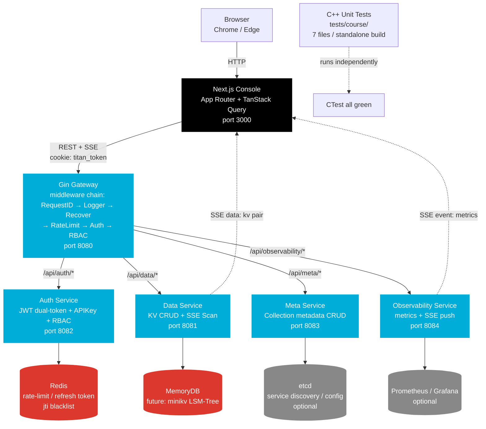
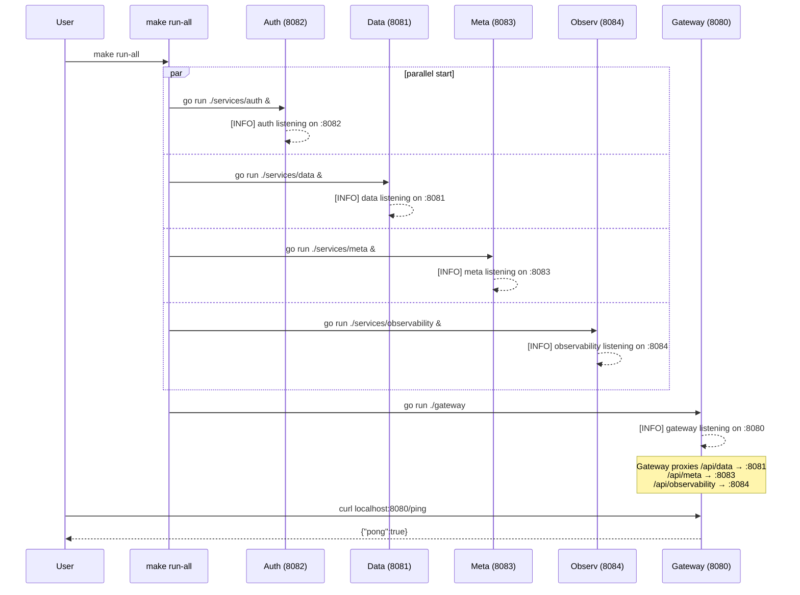
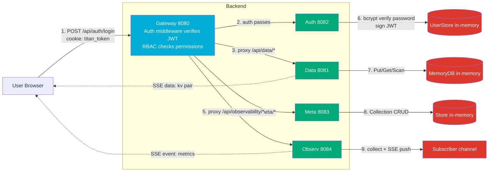

# Module 14 — Reproduce the Full Project from Scratch

> Goal: chain together everything learned in Modules 01–13 and go from `git clone` to an end-to-end working distributed KV platform.
> Prerequisites: Module 01 (environment setup), Module 12 (Go microservices + Next.js console).
> How to read: open two windows — this tutorial on the left, a terminal on the right — and follow along.

---

## 1. What We Are Reproducing (Background & Goals)

### 1.1 What "reproduce" means

In engineering, "reproduce" has a plain definition: **given a clean machine, follow the instructions and end up with a system that runs exactly like the author's**. It is not "reading the code", nor "running a demo" — it is the whole process: cloning, installing dependencies, compiling, starting services, and verifying end-to-end, all by yourself.

Think of it like cooking a dish:

- **Reading the code** ≈ reading the recipe, knowing how much salt to add.
- **Running a demo** ≈ borrowing a friend's kitchen to make one serving.
- **Reproducing the project** ≈ going home, buying ingredients, prepping, firing the stove, cooking, seasoning, and serving the whole meal yourself.

This Module is the third one — we're serving TitanKV from scratch.

### 1.2 Signs of a successful reproduction

We break "success" into a verifiable checklist, each with a concrete command:

| # | Sign | How to verify |
|---|------|---------------|
| 1 | C++ unit tests all pass | `ctest --test-dir build` shows 7 PASS |
| 2 | All 5 Go services started | `curl localhost:8080/ping` returns pong |
| 3 | Auth register/login works | `curl POST /api/auth/register` returns 201 |
| 4 | Meta Collection CRUD works | `curl POST /api/meta/collections` returns 201 |
| 5 | Data KV read/write works | After `curl POST /api/data/kv`, `GET` reads it back |
| 6 | Observability metrics queryable | `curl GET /api/observability/metrics` returns JSON |
| 7 | SSE real-time push works | `curl GET /api/metrics/stream` keeps emitting `event: metrics` |
| 8 | Web console accessible | Browser opens `http://localhost:3000` and you can log in |

All 8 green = reproduction succeeded.

### 1.3 Why this step matters

The previous 13 Modules were learned "in blocks" — skip list here, LSM there, Raft over there. But a real system is these modules **composed**: browser request → Gateway auth → Data service → storage engine → response. Reproducing it once makes you truly understand "what each layer does, why it's designed that way, and how to debug when things break". That's the confidence to talk about the project in interviews, and the scaffold for building your own wheels later.

---

## 2. The Big Picture (Architecture Diagram)

Here's the full-system view. Get the mental model first, then get your hands dirty.



Three things to read from the diagram:

1. **Request path**: Browser → Next.js (3000) → Gateway (8080) → four business services. The Gateway is the only externally exposed entry point; business services are never accessed directly by the browser.
2. **Storage layer**: The current MVP uses in-memory (MemoryDB) + Redis (rate limiting). In the future the Data service will back onto minikv's LSM-Tree, and Meta onto etcd.
3. **Observation path**: The Observability service pushes metrics to the frontend dashboard via SSE for real-time refresh.

> Pitfall heads-up: Redis and etcd are both "optional" — services degrade gracefully without them (rate limit becomes a no-op, refresh token feature disabled) and won't fail to start. So on your first run you can skip Redis, get the main flow working, then add it.

---

## 3. Reproduction Roadmap

The whole reproduction has 8 stages. The timeline below shows the order and dependencies:

```mermaid
gantt
    title TitanKV Reproduction Roadmap
    dateFormat X
    axisFormat %s

    section Environment
    Stage 1 Environment prep   :done, p1, 0, 1
    Stage 2 Clone the code     :p2, after p1, 1

    section Dependencies
    Stage 3 Go deps            :p3, after p2, 1
    Stage 4 Web deps           :p4, after p2, 1

    section Verify
    Stage 5 C++ tests (optional) :p5, after p2, 1

    section Launch
    Stage 6 Start backend      :p6, after p3, 2
    Stage 7 Start frontend     :p7, after p4, 1

    section End-to-end
    Stage 8 E2E verification   :p8, after p6 p7, 2
```



Stage notes:

1. **Environment prep**: install Go / Node / CMake etc. (see Module 01).
2. **Clone the code**: `git clone` the repo.
3. **Go deps**: `go mod tidy` + `go build ./...`.
4. **Web deps**: `npm install` + configure `.env.local`.
5. **C++ unit tests (optional)**: CMake build + ctest.
6. **Start backend**: `make run-all` or start 5 services in separate terminals.
7. **Start frontend**: `make web-dev`.
8. **E2E verification**: curl through everything + click through the browser.

> Why this order? Backend services depend on Go compilation, frontend depends on npm packages — the two can be prepared in parallel (stages 3, 4). C++ tests are independent; running them or not doesn't affect the backend. Finally, stage 8 needs both frontend and backend up to do end-to-end.

---

## 4. Stage 1: Environment Preparation

Tool version requirements (detailed install steps in Module 01):

| Tool | Version | Purpose | Verify command |
|------|---------|---------|----------------|
| Go | 1.23+ | Compile 5 microservices + SDK | `go version` |
| Node.js | 20+ | Next.js console | `node -v` |
| npm | 10+ | Install frontend deps | `npm -v` |
| CMake | 3.20+ | Build C++ tests (optional) | `cmake --version` |
| GCC / Clang | 12+ / 15+ | Compile C++ (optional) | `g++ --version` |
| Git | 2.30+ | Clone the code | `git --version` |
| Docker | 24+ | Local dev stack (optional) | `docker --version` |

One-shot verification (copy & paste):

```bash
go version
node -v
npm -v
cmake --version
git --version
```

Expected output (versions can be higher):

```
go version go1.23.0 linux/amd64
v20.17.0
10.8.2
cmake version 3.28.3
git version 2.44.0
```

> Pitfall heads-up: Windows users should run backend services (Go + Redis) in WSL2; the frontend can run in PowerShell. macOS users install via Homebrew. If `go version` says "command not found", your PATH isn't set — review Module 01's install steps.

---

## 5. Stage 2: Clone the Code

```bash
git clone https://github.com/Thezx-a/LumenDB.git
cd LumenDB
```

> Note: the GitHub repo is named `LumenDB` (the project is being refactored from a vector DB into a KV platform, see `docs/REFACTORING.md`); internally the module name is `titan` (Go module path: `github.com/titan-kv/titan`). Both refer to the same project.

After cloning, the project root looks like this:

```
LumenDB/
├── minikv/              # C++17 LSM-Tree storage engine (star of Modules 05-08)
├── skynet/              # C++20 coroutine network library (star of Modules 09-10)
├── deepvector/          # HNSW vector index (to be refactored into a secondary index)
├── gateway/             # Go API gateway (Gin + middleware chain)
├── services/            # Go microservices
│   ├── auth/            #   Auth service (JWT + APIKey + RBAC)
│   ├── data/            #   Data service (KV CRUD + SSE Scan)
│   ├── meta/            #   Meta service (Collection CRUD)
│   └── observability/   #   Observability service (metrics + SSE)
├── client-go/titan/     # Go SDK
├── web/                 # Next.js console
├── tests/course/        # Course unit tests (7 files, standalone build)
├── deploy/dev/          # Docker Compose local dev stack
├── docs/course/         # Bilingual course (the one you're reading)
├── CMakeLists.txt       # Top-level CMake (aggregates minikv + deepvector + course tests)
├── go.mod               # Go module root
└── Makefile             # Unified build/test/run entry
```

Key directory explanations:

| Directory | What it is | Module |
|-----------|------------|--------|
| `minikv/src/core/` | LSM-Tree core: WAL/MemTable/SSTable/Compaction | 05, 07, 08 |
| `minikv/src/core/skip_list.h` | Hand-written skip list (MemTable backing) | 05 |
| `minikv/src/core/bloom_filter.h` | Bloom filter | 06 |
| `skynet/src/core/executor.cpp` | C++20 coroutine scheduler | 09 |
| `skynet/src/proxy/` | Reverse proxy + load balancing | 10 |
| `gateway/middleware/` | 6 middlewares (auth/rbac/ratelimit/...) | 12 |
| `services/auth/jwt.go` | JWT dual-token implementation | 12 |
| `web/app/` | Next.js App Router pages | 12 |
| `tests/course/` | 7 hand-write exercise tests | 05, 06, 03 |

> Pitfall heads-up: if `ls services/` shows only `auth/ meta/ observability/` and no `data/`, the data service is still under development. In that case `make run-all` will error when starting the data service — you can skip the data service and verify the auth/meta/observability flows. See section 13 for troubleshooting.

---

## 6. Stage 3: Go Dependency Management

### 6.1 Download dependencies

```bash
go mod download
```

This pulls all dependencies (gin, jwt, redis, etcd client, etc.) from `go.mod` into the local cache. The first run is slow; subsequent runs use the cache.

### 6.2 Tidy go.sum

```bash
go mod tidy
```

`go mod tidy` will: ①fill in missing hashes in `go.sum`; ②remove unused dependencies. **Why it's required**: `go.sum` is the dependency integrity file; CI checks it, and missing/inconsistent entries cause build failures.

### 6.3 Verify compilation

```bash
go build ./...
```

`./...` means compile all packages. No errors = all 5 services' `main.go` compile.

Expected output: **no output means success** (Go convention — successful compilation prints nothing).

### 6.4 Possible errors

**Error 1: can't pull dependencies (network)**

```
go: github.com/gin-gonic/gin@v1.10.0: reading go.mod: Get "https://proxy.golang.org/...": dial tcp: i/o timeout
```

Cause: the default Go proxy may be slow/unreachable in some regions. Fix: switch to a domestic mirror.

```bash
go env -w GOPROXY=https://goproxy.cn,direct
go env -w GOSUMDB=sum.golang.google.cn
go mod download
```

**Error 2: version conflict**

```
go: module requires go >= 1.23
```

Cause: your Go version is too low. Fix: upgrade to 1.23+, see Module 01.

**Error 3: services/data doesn't exist**

```
go: no packages to build in ./services/data
```

Cause: the data service isn't implemented yet (see section 5). Fix: compile only the existing services:

```bash
go build ./gateway ./services/auth ./services/meta ./services/observability ./client-go/...
```

### 6.5 Verify all 5 services compile

```bash
go build -o /tmp/gw ./gateway
go build -o /tmp/auth ./services/auth
go build -o /tmp/data ./services/data   # errors if data isn't implemented; skip it
go build -o /tmp/meta ./services/meta
go build -o /tmp/observ ./services/observability
```

Each command succeeding is enough. You can `rm` the `/tmp/*` binaries — we'll use `go run` later.

---

## 7. Stage 4: Web Dependency Installation

### 7.1 Install dependencies

```bash
cd web
npm install
cd ..
```

`npm install` reads `web/package.json` and installs Next.js, React, TanStack Query, Tailwind, etc. into `web/node_modules/`.

> Pitfall heads-up: if `npm install` hangs or times out, switch to a faster mirror:
> ```bash
> npm config set registry https://registry.npmmirror.com
> npm install
> ```
> After installing, switch back to the official registry to avoid sync delays on some packages:
> ```bash
> npm config delete registry
> ```

### 7.2 Verify the build

```bash
cd web
npm run build
cd ..
```

`npm run build` does a production build (type checking + static generation). Passing means the frontend code is fine. Expected:

```
 ✓ Compiled successfully
 ✓ Linting and checking validity of types
 ✓ Generating static pages (5/5)
 Route (app)                              Size     First Load JS
 ┌ ○ /                                    1.2 kB         88 kB
 ├ ○ /dashboard                           2.1 kB         92 kB
 └ ○ /login                               1.5 kB         89 kB
```

### 7.3 Configure environment variables

```bash
cd web
cat > .env.local <<'EOF'
NEXT_PUBLIC_API_BASE=http://localhost:8080
JWT_SECRET=dev-secret-change-in-production
EOF
cd ..
```

What the two variables do:

| Variable | Purpose |
|----------|---------|
| `NEXT_PUBLIC_API_BASE` | The base URL the browser uses to call the Gateway. The `NEXT_PUBLIC_` prefix means it's bundled into client code. |
| `JWT_SECRET` | The secret the Next.js middleware (`web/middleware.ts`) uses to verify the JWT in the cookie. **Must match the Gateway's `JWT_SECRET`**, otherwise middleware verification fails. |

> Pitfall heads-up: `.env.local` is Next.js's local env file and **is not committed to git** (it's in `.gitignore`). For production use `.env.production` or platform environment variables.

---

## 8. Stage 5: C++ Unit Tests (Optional)

This stage is optional — it doesn't affect the backend services, but it verifies your C++ toolchain and corresponds to the hand-write exercises in Modules 03/05/06.

### 8.1 Build

```bash
cmake -B build -DCMAKE_BUILD_TYPE=Release -DENABLE_TESTS=ON
cmake --build build -j
```

`-DENABLE_TESTS=ON` enables building `tests/course/`. GoogleTest is fetched automatically via FetchContent (needs network the first time).

> Pitfall heads-up: the top-level CMake option is `ENABLE_TESTS` (not `ENABLE_COURSE_TESTS`). `tests/course/CMakeLists.txt` is a standalone subproject — even if minikv/deepvector fail to compile, the course tests can run on their own.

### 8.2 Run tests

```bash
ctest --test-dir build --output-on-failure
```

Expected output (all 7 PASS):

```
Test project /path/to/build
    Start 1: course_skiplist
1/7 Test #1: course_skiplist .................   Passed   0.02 sec
    Start 2: course_lru
2/7 Test #2: course_lru ......................   Passed   0.01 sec
    Start 3: course_thread_pool
3/7 Test #3: course_thread_pool ..............   Passed   0.15 sec
    Start 4: course_unique_ptr
4/7 Test #4: course_unique_ptr ...............   Passed   0.01 sec
    Start 5: course_spsc_queue
5/7 Test #5: course_spsc_queue ................   Passed   0.03 sec
    Start 6: course_bloom_filter_math
6/7 Test #6: course_bloom_filter_math ........   Passed   0.01 sec
    Start 7: course_murmurhash
7/7 Test #7: course_murmurhash ................   Passed   0.01 sec

100% tests passed, 7/7 tests passed out of 7
```

### 8.3 The 7 test files

| File | Test name | Module | Topic |
|------|-----------|--------|-------|
| `test_skiplist_handwrite.cpp` | course_skiplist | 05 | Skip list insert/find/random level |
| `test_lru_handwrite.cpp` | course_lru | 13 | LRU cache eviction |
| `test_thread_pool_handwrite.cpp` | course_thread_pool | 03 | Thread pool task queue |
| `test_unique_ptr_handwrite.cpp` | course_unique_ptr | 03 | Smart pointer exclusive ownership |
| `test_spsc_queue_handwrite.cpp` | course_spsc_queue | 03 | Lock-free single-producer single-consumer queue |
| `test_bloom_filter_math.cpp` | course_bloom_filter_math | 06 | Bloom filter false-positive math |
| `test_murmurhash.cpp` | course_murmurhash | 06 | MurmurHash hash function |

These tests **don't depend on minikv source** — they're pure hand-written implementations, so even without a C++ compiler your backend reproduction is unaffected.

---

## 9. Stage 6: Start the Backend Services

### 9.1 Option A: make run-all (recommended)

```bash
make run-all
```

The `run-all` Makefile target starts 5 services in parallel, with the Gateway last (because it reverse-proxies the others). The startup order is shown below:



> Pitfall heads-up: `make run-all` runs in the foreground and is blocking; `Ctrl+C` stops all services. Logs are interleaved and hard to read — when debugging, prefer option B (separate terminals).

### 9.2 Option B: start manually in 5 terminals

Open 5 terminal windows and run each:

**Terminal 1 — Auth service (8082)**

```bash
make run-auth
# or: go run ./services/auth
```

**Terminal 2 — Data service (8081)**

```bash
make run-data
# or: go run ./services/data
```

**Terminal 3 — Meta service (8083)**

```bash
make run-meta
# or: go run ./services/meta
```

**Terminal 4 — Observability service (8084)**

```bash
make run-observ
# or: go run ./services/observability
```

**Terminal 5 — Gateway (8080, start last)**

```bash
make run-gateway
# or: go run ./gateway
```

> Order matters: when the Gateway starts it pings each service's health check (not a hard dependency, but best to have business services up first). Auth/Meta/Observ can run in parallel; Gateway goes last.

### 9.3 Service port & log reference

| Service | Port | Start command | Health check | Log keyword |
|---------|------|---------------|--------------|-------------|
| Gateway | 8080 | `make run-gateway` | `curl localhost:8080/ping` | `gateway listening on :8080` |
| Auth | 8082 | `make run-auth` | `curl localhost:8082/healthz` | `auth service listening on :8082` |
| Data | 8081 | `make run-data` | `curl localhost:8081/healthz` | `data service listening on :8081` |
| Meta | 8083 | `make run-meta` | `curl localhost:8083/healthz` | `meta service listening on :8083` |
| Observability | 8084 | `make run-observ` | `curl localhost:8084/healthz` | `observability listening on :8084` |

### 9.4 Verify the services are up

```bash
curl http://localhost:8080/ping
```

Expected:

```json
{"pong":true}
```

Check the Gateway health endpoint too:

```bash
curl http://localhost:8080/healthz
```

Expected:

```json
{"status":"ok","version":"0.1.0"}
```

> Pitfall heads-up: if you see `[WARN] redis not available`, don't panic — this is normal. Without Redis, rate limiting degrades to a no-op and refresh token / jti blacklist features are disabled, but the register/login main flow works fine. To install Redis: `make docker-up` or `docker run -d -p 6379:6379 redis:7`.

---

## 10. Stage 7: Start the Frontend Console

### 10.1 Start the dev server

```bash
make web-dev
# or: cd web && npm run dev
```

Expected output:

```
   ▲ Next.js 14.2.5
   - Local:        http://localhost:3000
   - Environments: .env.local

 ✓ Ready in 1200 ms
```

### 10.2 Open the console

Open http://localhost:3000 in your browser.

Since you're not logged in, the Next.js middleware (`web/middleware.ts`) intercepts and 302-redirects to:

```
http://localhost:3000/login?from=/
```

Seeing the login form means it's working.

> Pitfall heads-up: if the page is blank, press F12 and check the Console. Common causes: ①`.env.local` is missing `NEXT_PUBLIC_API_BASE`, so requests go to `undefined`; ②the backend isn't running, so requests to 8080 fail; ③CORS errors (see section 13).

---

## 11. Stage 8: End-to-End Verification

This section is the heart of the reproduction — we verify all 8 success signs one by one. **Every curl command is copy-paste ready**.

### 11.1 Register a user

```bash
curl -X POST http://localhost:8080/api/auth/register \
  -H "Content-Type: application/json" \
  -d '{"username":"admin","password":"admin123","role":"admin"}'
```

> Why register first: the Auth service stores users in memory (`UserStore`), which is lost on restart. So every reproduction starts by registering an account. Password must be at least 8 chars (`binding:"min=8"`), role must be one of `admin/writer/reader`.

Expected (HTTP 201):

```json
{
  "id": "a1b2c3d4-...",
  "username": "admin",
  "role": "admin"
}
```

### 11.2 Login to get a token

```bash
curl -X POST http://localhost:8080/api/auth/login \
  -H "Content-Type: application/json" \
  -d '{"username":"admin","password":"admin123"}'
```

Expected (HTTP 200):

```json
{
  "access_token": "eyJhbGciOiJIUzI1NiIsInR5cCI6IkpXVCJ9...",
  "refresh_token": "eyJhbGciOiJIUzI1NiIsInR5cCI6IkpXVCJ9...",
  "expires_in": 900,
  "token_type": "Bearer",
  "user_id": "a1b2c3d4-...",
  "role": "admin"
}
```

Save the `access_token` to an env var — all authenticated requests need it:

```bash
TOKEN="paste the access_token value here"
```

> Why two tokens: the access token is short-lived (15 min), the refresh token long-lived. When the access token expires, use the refresh token to get a new one, avoiding repeated password entry. This is the JWT dual-token pattern — see Module 12.

### 11.3 Create a Collection

```bash
curl -X POST http://localhost:8080/api/meta/collections \
  -H "Content-Type: application/json" \
  -H "Authorization: Bearer $TOKEN" \
  -d '{"name":"user_profile","ttl_seconds":3600,"schema":{"user_id":"string","age":"int"}}'
```

> Why Collections exist: TitanKV uses a "namespace" model — every KV belongs to a Collection, which defines the schema and TTL. The Meta service manages Collection metadata; the Data service manages KV data.

Expected (HTTP 201):

```json
{
  "name": "user_profile",
  "ttl": 3600,
  "schema": {
    "age": "int",
    "user_id": "string"
  }
}
```

List them:

```bash
curl http://localhost:8080/api/meta/collections -H "Authorization: Bearer $TOKEN"
```

Expected:

```json
{
  "items": [
    {"name":"user_profile","ttl":3600,"schema":{"age":"int","user_id":"string"}}
  ],
  "count": 1
}
```

### 11.4 Write a KV

```bash
curl -X POST http://localhost:8080/api/data/kv \
  -H "Content-Type: application/json" \
  -H "Authorization: Bearer $TOKEN" \
  -d '{"key":"user:001","value":"{\"name\":\"Alice\",\"age\":30}"}'
```

> Why the key uses the `user:001` colon form: this is a common KV convention (RocksDB / Redis Hash all do this) — the colon acts as a namespace separator, making prefix-range scans convenient.

Expected (HTTP 200):

```json
{"ok":true}
```

### 11.5 Read a KV

```bash
curl "http://localhost:8080/api/data/kv?key=user:001" \
  -H "Authorization: Bearer $TOKEN"
```

> Why URL-encode the key: colons are legal in URLs, but `url.QueryEscape` is safer. curl's `-G --data-urlencode` also auto-encodes.

Expected (HTTP 200, returns the raw value):

```
{"name":"Alice","age":30}
```

### 11.6 Scan (SSE stream)

```bash
curl -N "http://localhost:8080/api/data/scan?start=user:000&end=user:999" \
  -H "Authorization: Bearer $TOKEN"
```

> Why `-N`: `curl -N` disables output buffering; otherwise the SSE stream gets batched and you can't see the "stream" effect. Scan uses SSE because the result set may be large — streaming avoids blocking and OOM.

Expected (one KV per line, starting with `data:`):

```
data: {"key":"user:001","value":"{\"name\":\"Alice\",\"age\":30}"}

```

Write a few more keys and scan again to see multiple `data:` lines.

### 11.7 View the metrics snapshot

```bash
curl http://localhost:8080/api/observability/metrics \
  -H "Authorization: Bearer $TOKEN"
```

> Why a separate metrics endpoint: the dashboard's first paint needs the current metrics (QPS / latency / storage) in one shot via REST; afterwards SSE keeps it updated. This is the common "REST for first paint + SSE for increments" pattern.

Expected:

```json
{
  "qps": 12,
  "p50_ms": 3,
  "p99_ms": 18,
  "storage_gb": 0.001,
  "goroutines": 47,
  "uptime_seconds": 120
}
```

### 11.8 SSE real-time metrics stream

```bash
curl -N http://localhost:8080/api/metrics/stream \
  -H "Authorization: Bearer $TOKEN"
```

> Note the path: the real-time stream goes through `/api/metrics/stream` (registered directly by the Observability service), not `/api/observability/metrics/stream`. When the Gateway reverse-proxies, both `/api/observability/*` and `/api/metrics/stream` are forwarded to the Observability service.

Expected (one per second, starting with `event: metrics`):

```
event: metrics
data: {"qps":12,"p50_ms":3,"p99_ms":18,"storage_gb":0.001,...}

event: metrics
data: {"qps":13,"p50_ms":3,"p99_ms":16,"storage_gb":0.001,...}

```

Press `Ctrl+C` to exit.

### 11.9 Do all of the above in the Web console

Back in the browser at http://localhost:3000/login, log in with the `admin / admin123` you just registered. After a successful login:

1. The page redirects to `/dashboard`.
2. At the top you'll see live metric cards (QPS / P50 / P99 / Storage) refreshing every second — that's SSE at work.
3. Go to `/dashboard/collections` to see the `user_profile` Collection you created.
4. Go to `/dashboard/users` to manage users (admin role).

> Pitfall heads-up: browser login uses a cookie (`titan_token`), not the `Authorization` header. In `web/lib/api.ts`, `apiFetch` automatically reads the token from the cookie and puts it in the `Authorization` header when calling the Gateway. So in the Network panel you'll see requests with both a cookie and an Authorization header — that's by design.

At this point all 8 success signs are verified — reproduction complete! 🎉

---

## 12. Architecture Recap (Data Flow Diagram)

Let's chain every step we just did into one complete data flow diagram:



Key takeaways:

1. **The Gateway is the single entry point**: all external requests go through 8080; business services (8081–8084) are never exposed directly. This is the "BFF / API Gateway" pattern.
2. **Auth is centralized at the Gateway**: the Auth middleware verifies JWT / APIKey, the RBAC middleware checks permissions (`kv:get` / `kv:put` / `collection:create`, etc.). Business services don't repeat auth.
3. **Reverse proxy routes by path**: `/api/data/*` → Data, `/api/meta/*` → Meta, `/api/observability/*` → Observ. The Gateway uses `httput.ReverseProxy`.
4. **SSE has two channels**: Data's Scan and Observ's metrics are both SSE, but with different event types (`data:` vs `event: metrics`), and the frontend parses them differently.
5. **The storage layer is replaceable**: currently in-memory; in the future Data backs onto minikv (LSM-Tree), Meta onto etcd. Because the Data service has a storage abstraction, swapping the backend doesn't affect the upper API.

---

## 13. Common Troubleshooting

### 13.1 Port already in use

**Symptom**: `make run-all` reports `listen tcp :8080: bind: address already in use`.

**Diagnose**:

```bash
# Linux / macOS
lsof -i :8080
# or
netstat -tlnp | grep 8080

# Windows PowerShell
netstat -ano | findstr :8080
```

**Fix**: kill the occupying process, or start on a different port:

```bash
GATEWAY_ADDR=:8090 make run-gateway   # switch to 8090
```

Note: if you change the port, the frontend's `NEXT_PUBLIC_API_BASE` must change too.

### 13.2 CORS errors

**Symptom**: browser Console shows `Access to fetch ... has been blocked by CORS policy`.

**Cause**: the frontend (3000) and backend (8080) are different origins, and the Gateway has no CORS config.

**Fix**: the current Gateway MVP has no dedicated CORS middleware, but Gin's proxy passes headers through by default. If you hit issues, add this to `gateway/router.go`:

```go
r.Use(func(c *gin.Context) {
    c.Header("Access-Control-Allow-Origin", "http://localhost:3000")
    c.Header("Access-Control-Allow-Credentials", "true")
    c.Header("Access-Control-Allow-Headers", "Authorization, Content-Type")
    c.Header("Access-Control-Allow-Methods", "GET, POST, PUT, DELETE, OPTIONS")
    if c.Request.Method == "OPTIONS" {
        c.AbortWithStatus(204)
        return
    }
    c.Next()
})
```

### 13.3 Cookie cross-origin issues

**Symptom**: login succeeds but you get kicked back to login on the dashboard.

**Cause**: the cookie's `SameSite=Lax` isn't sent across origins.

**Fix**: `web/app/login/page.tsx` currently sets `SameSite=Lax`, which works for same-site (3000 → 8080 both on localhost = same site). If you use different domains, change to `SameSite=None; Secure` (requires HTTPS).

### 13.4 SSE not firing

**Symptom**: `curl /api/metrics/stream` hangs with no output.

**Diagnose**:

1. Confirm the Observability service is running (`curl localhost:8084/healthz`).
2. Confirm the `Content-Type: text/event-stream` header is returned:

```bash
curl -i -N http://localhost:8080/api/metrics/stream -H "Authorization: Bearer $TOKEN" | head -5
```

3. If behind an Nginx proxy, add `proxy_buffering off;` and `X-Accel-Buffering: no` (the Observability service already sets the latter).

**Cause**: SSE needs a long-lived connection + immediate flush; any buffering layer (Nginx, CDN, browser middleware) will stall it.

### 13.5 Go service won't start

**Symptom**: `go run ./gateway` throws a bunch of errors.

**Checklist**:

- Is 8080 already in use (see 13.1)?
- Has `go.mod` been tidied (`go mod tidy`)?
- No Redis? No problem — it degrades with a warning, no error.
- data service directory missing? `make run-all` will hang on the data line. Fix: start only the existing services:

```bash
go run ./services/auth &
go run ./services/meta &
go run ./services/observability &
go run ./gateway
```

### 13.6 npm install is slow

**Fix**: switch to a faster mirror (see 7.1):

```bash
npm config set registry https://registry.npmmirror.com
cd web && npm install
```

### 13.7 C++ tests fail to compile

**Symptom**: `cmake --build build` reports a GoogleTest fetch failure.

**Cause**: FetchContent needs network to pull gtest; no network = failure.

**Fix**: ①configure a proxy; ②or skip the C++ tests (they don't affect backend reproduction); ③or manually download gtest into the build directory.

### 13.8 The data service doesn't exist

**Symptom**: `ls services/` has no `data/` directory, or `make run-data` reports `no packages to build`.

**Cause**: the data service is under development and may not yet be in the repo.

**Fix**:

1. Skip the data service and start the other 4 services (see 13.5).
2. KV-related APIs (`/api/data/kv`, `/api/data/scan`) will return 502 (the Gateway can't find the upstream).
3. The auth / meta / observability flows can still be verified normally.
4. Track Phase 4 progress in `docs/REFACTORING.md` — once the data service lands, the full reproduction works end-to-end.

> This is the "be realistic" step: in the MVP phase some services may not be implemented yet. Get the existing ones running first, then fill in the gaps as the repo updates.

---

## 14. Advanced Exercises

A successful reproduction is just the starting point. These directions go deeper:

### 14.1 Modify minikv source and recompile

`minikv/src/core/skip_list.h` is a hand-written skip list. Try changing the max level (`kMaxLevel`), run `cmake --build build` again, and observe the result of `minikv/tests/test_skip_list.cpp`. See Module 05 for details.

### 14.2 Add a new middleware to the Gateway

Add one in `gateway/middleware/`, e.g. request timing:

```go
// gateway/middleware/timing.go
package middleware

import (
    "log"
    "time"
    "github.com/gin-gonic/gin"
)

func Timing() gin.HandlerFunc {
    return func(c *gin.Context) {
        start := time.Now()
        c.Next()
        log.Printf("[TIMING] %s %s %dms", c.Request.Method, c.Request.URL.Path, time.Since(start).Milliseconds())
    }
}
```

Then mount `middleware.Timing()` in the middleware chain in `gateway/router.go`.

### 14.3 Add a new API to a business service

For example, add a "batch delete Collections" endpoint to the Meta service: add `POST /api/meta/collections/batch-delete` in `services/meta/handler.go` and register it in `RegisterRoutes`.

### 14.4 Tweak the Web console UI

`web/app/dashboard/page.tsx` is the dashboard home. Try adding a "recent requests" list that calls `/api/observability/metrics`. Copy Tailwind class names from the existing `metrics-card.tsx`.

### 14.5 Write a script with the Go SDK

`client-go/titan/client.go` is the official SDK. Write a script to bulk-load data:

```go
package main

import (
    "context"
    "fmt"
    "github.com/titan-kv/titan/client-go/titan"
)

func main() {
    c := titan.New("http://localhost:8080", "")
    _, err := c.Login(context.Background(), "admin", "admin123")
    if err != nil { panic(err) }
    for i := 0; i < 1000; i++ {
        c.Put(context.Background(), fmt.Sprintf("k:%04d", i), fmt.Sprintf("v%d", i))
    }
    c.Scan(context.Background(), "k:0000", "k:9999", func(p titan.KVPair) error {
        fmt.Printf("%s = %s\n", p.Key, p.Value)
        return nil
    })
}
```

> Note: the SDK authenticates with an API Key (`X-API-Key` header). When using JWT, you must Login first to get a token, then manually set the header. See Module 12.

---

## 15. What You've Mastered

### 15.1 Skill checklist

By this point you should be able to:

- [x] Stand up a full-stack system ("C++ engine + Go microservices + Next.js frontend") from scratch.
- [x] Explain the complete 7-hop path from a browser request to the storage engine.
- [x] Use curl to verify register/login/CRUD/SSE end-to-end.
- [x] Troubleshoot common runtime issues: ports/CORS/cookie/SSE.
- [x] Understand how four build systems cooperate: Makefile / CMakeLists / go.mod / package.json.
- [x] Make a small modification at any layer and redeploy to verify.

### 15.2 Interview talking points

> "I led the from-scratch implementation of TitanKV, a distributed KV platform. The system has three layers: at the bottom, a C++17 LSM-Tree storage engine where I hand-wrote the skip list, WAL, SSTable, compaction, and bloom filter; in the middle, Go microservices including a Gin gateway (an onion model with 6 middlewares), JWT dual-token auth, and SSE streaming scan; on top, a Next.js console with a real-time dashboard using TanStack Query + SSE. I can go from `git clone` all the way to an end-to-end working system, including the full integration of C++ unit tests, 5 Go services, and the web console."

Key points: **quantified** (5 services, 6 middlewares, 7 tests), **deep** (each layer points to specific tech), **closed-loop** (from clone to end-to-end).

### 15.3 Next steps

Reproduction is "breadth" coverage; next, pick a "point" to go deep:

| Want to go deep on | See Module | Hands-on |
|--------------------|------------|----------|
| Storage engine | 07, 08 | Change the compaction strategy, run benchmarks |
| Skip list / Bloom filter | 05, 06 | Swap the hash function, measure false-positive rate |
| Networking / coroutines | 09, 10 | Add a new HTTP handler to skynet |
| Distributed consensus | 11 | Run the hashicorp/raft example |
| Microservice architecture | 12 | Add a new service (e.g. notification) |
| Interview prep | 13 | Grind problems + system design practice |

Every Module maps to real, modifiable code in the project — change it, run it, understand why. That's the core of "project-driven learning": **don't just read it once; change a line, run it, and figure out why**.

---

← [Module 13 — System Design & Interview Q&A](./13-interview.md) | [Back to Course Outline](./README.md) →
