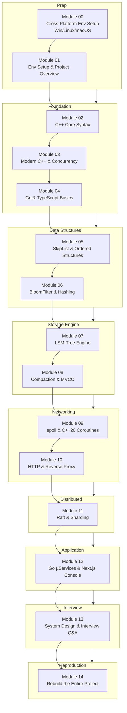

# TitanKV Hands-on Course · English Syllabus

> From absolute zero to reproducing a distributed KV store on your own, layer by layer, tightly bound to the source.

## Why this course is worth your time

There are plenty of distributed-storage courses out there, but most stop at "use a library + memorize concepts": you learn how to call RocksDB, how to deploy etcd, but you never actually write one. **TitanKV is different** — its storage engine, network library, replication protocol, and console are all written from scratch, and every line is visible in the source.

We use TitanKV's own C++ / Go / TypeScript code as the only textbook, walking you through a complete path: first get Windows / Linux / macOS all three environments working in Module 00, then over thirteen modules push from C++ syntax, skip lists, and bloom filters all the way to LSM-Tree, epoll coroutines, Raft consensus, Go microservices, and the Next.js console — and finally reproduce the entire project from an empty directory in Module 14.

This is not a bootcamp. It is an **engineering path that can actually get you a C++ backend / distributed systems offer**.

---

## Course Philosophy

- **Motivation first**: Every module starts with "why do we need this thing," not "here's the API." We know what MemTable is for, why Compaction exists, why Raft has PreVote — once the motivation is clear, the details stick.
- **Layer-by-layer progression**: Foundation → Data Structures → Storage → Networking → Distributed → Application → Interview → Reproduction. Each layer only depends on the previous one. No "jump-ahead" learning.
- **Source-bound**: Every concept maps to real TitanKV code. When we talk skip lists, we read `minikv/src/core/skip_list.h`; when we talk epoll, we read `skynet/src/net/`; when we talk JWT auth, we read `services/auth/jwt.go`.
- **Bilingual**: Every module has both `zh` and `en` versions, with technical terms kept in their original form so you can use them directly on your résumé and in interviews.

---

## Learning Path



---

## Module List

| # | Module | Layer | Source Code | Difficulty | Est. Hours | Key Concepts | Status |
|---|---|---|---|---|---|---|---|
| 00 | Cross-Platform Env Setup | Prep | `CMakeLists.txt` / `Makefile` / `minikv/CMakePresets.json` / `skynet/CMakePresets.json` | ⭐ | 2h | Windows MSVC / WSL2 / macOS Clang / vcpkg / paths & encoding | 🚧 In progress |
| 01 | Env Setup & Project Overview | Foundation | `CMakeLists.txt` / `Makefile` / `go.mod` / `README.md` / `docs/REFACTORING.md` | ⭐ | 2h | CMake / Ninja / Go / Node / Docker / TitanKV architecture / refactor roadmap | ✅ Done |
| 02 | C++ Core Syntax | Foundation | `minikv/src/utils/` | ⭐⭐ | 4h | type system / pointers & references / overloading / namespaces / compilation model / Slice·Status | ✅ Done |
| 03 | Modern C++ & Concurrency | Foundation | `minikv/src/core/skip_list.h` / `minikv/src/utils/thread_pool.h` | ⭐⭐⭐ | 6h | smart pointers / move semantics / lambdas / constexpr / thread·mutex·atomic·shared_mutex | ✅ Done |
| 04 | Go & TypeScript Basics | Foundation | `go.mod` / `services/` / `web/` | ⭐⭐ | 4h | goroutine·channel / gRPC / TS types / Next.js App Router | ✅ Done |
| 05 | SkipList & Ordered Structures | Data Structures | `minikv/src/core/skip_list.h` / `tests/course/test_skiplist_handwrite.cpp` | ⭐⭐⭐ | 4h | probabilistic balancing / random level / complexity proof / RB-tree & B+tree comparison / hand-write SkipList | ✅ Done |
| 06 | BloomFilter & Hashing | Data Structures | `minikv/src/core/bloom_filter.h` / `minikv/src/utils/hash.h` | ⭐⭐⭐ | 4h | bitmap + k hashes / false-positive formula / Counting BF / consistent-hash ring / virtual nodes | ✅ Done |
| 07 | LSM-Tree Engine | Storage Engine | `minikv/src/core/{wal,memtable,sstable*}.cpp` | ⭐⭐⭐⭐ | 8h | WAL / MemTable / SSTable file format / write & read paths / Block Cache | ✅ Done |
| 08 | Compaction & MVCC | Storage Engine | `minikv/src/core/{compaction,internal_key,manifest}.cpp` | ⭐⭐⭐⭐ | 8h | Leveled vs Tiered / three amplifications / InternalKey encoding / Manifest / crash recovery | ✅ Done |
| 09 | epoll & C++20 Coroutines | Networking | `skynet/src/net/` / `skynet/src/core/` | ⭐⭐⭐⭐⭐ | 10h | IO multiplexing / LT·ET / Reactor / co_await·promise_type / symmetric transfer / Executor | ✅ Done |
| 10 | HTTP & Reverse Proxy | Networking | `skynet/src/http/` / `skynet/src/proxy/` | ⭐⭐⭐⭐ | 6h | HTTP/1.1 state machine / Router / connection pool / load balancing / health checks | ✅ Done |
| 11 | Raft & Sharding | Distributed | `distributed/` (planned) / `services/meta/watcher.go` | ⭐⭐⭐⭐⭐ | 10h | Leader election / log replication / safety / Snapshot / PreVote / consistent-hash sharding | 🚧 In progress |
| 12 | Go µServices & Next.js Console | Application | `services/` / `gateway/` / `web/` | ⭐⭐⭐⭐ | 8h | Gin gateway / JWT·RBAC·APIKey / gRPC / Next.js + TanStack Query + SSE dashboard | ✅ Done |
| 13 | System Design & Interview Q&A | Interview | whole project + `tests/course/` | ⭐⭐⭐ | 6h | design KV / distributed lock / rate limiter / LeetCode 1206·146·460 / 50+ real questions / hand-write series | ✅ Done |
| 14 | Rebuild the Entire Project | Reproduction | whole project (end-to-end) | ⭐⭐⭐⭐⭐ | 20h+ | project scaffold / subsystem split / CI / deployment / full-chain benchmark / résumé & interview walkthrough | 🚧 In progress |

---

## Nine Learning Stages

### Stage 1 · Prep (Module 00-01)
Before we write any code, we get the dev environment running on all three operating systems (Windows / Linux / macOS) and understand TitanKV's overall architecture and the 9-Phase refactoring roadmap. This stage covers no algorithms — it only solves the most basic question of "can I build and run it locally." Many students get stuck on step one not because they don't know C++, but because the environment won't configure.

### Stage 2 · Foundation (Module 02-04)
We use three modules to cover the core syntax of C++ / Go / TypeScript. The C++ part walks through the type system, modern C++, and concurrency, contrasted with the read-write lock in `skip_list.h`; the Go and TypeScript parts cover goroutines, gRPC, and the Next.js App Router — laying the groundwork for the distributed layer and console. **Strong recommendation: do not skip this stage.** Otherwise reading SSTable and Raft code later will be very painful.

### Stage 3 · Data Structures (Module 05-06)
SkipList and BloomFilter are the "two pillars" of LSM-Tree: MemTable uses SkipList for ordered data, SSTable uses BloomFilter to accelerate point lookups. We don't just write them — we prove them: the expected complexity of probabilistic balancing and the parameter derivation of the false-positive rate are both high-frequency interview questions.

### Stage 4 · Storage Engine (Module 07-08)
This is the hardest core of the course. We dive into `minikv`'s WAL / MemTable / SSTable file format, draw the write and read paths, then cover Compaction strategies (Leveled vs Tiered), the three amplifications, InternalKey encoding and MVCC, Manifest persistence, and crash recovery. After this stage, you'll be able to answer "design a KV store" with substance in any interview.

### Stage 5 · Networking (Module 09-10)
We leave storage and enter networking. First we cover epoll's LT/ET and the Reactor pattern, then rewrite them with C++20 coroutines — how `co_await` / `promise_type` / symmetric transfer actually work. Module 10 builds on this to implement HTTP/1.1 state-machine parsing, Router, connection pool, load balancing, and health checks — corresponding to `skynet`'s full reverse-proxy capability.

### Stage 6 · Distributed (Module 11)
Once a single machine isn't enough, we go distributed. We cover Raft's Leader election, log replication, safety, Snapshot, and PreVote, then use consistent hashing for sharding and online rebalancing. This stage is tightly coupled with the Go microservices in Module 12 — the distributed layer is ultimately exposed as Go services.

### Stage 7 · Application (Module 12)
We use Go microservices (gateway / auth / data / meta / observability) and the Next.js console to wire the whole system together: JWT/RBAC/APIKey auth, gRPC inter-service communication, TanStack Query + SSE live dashboard. This is the most visually demonstrable part of the project on a résumé.

### Stage 8 · Interview (Module 13)
We condense all prior modules into 50+ real interview questions: system design (design a KV / distributed lock / rate limiter), LeetCode-numbered problems (1206 SkipList / 146 LRU / 460 LFU), NowCoder interview posts, and hand-write series (SkipList / LRU / ThreadPool / SmartPtr / epoll server). During interview crunch time, two or three problems a day is enough.

### Stage 9 · Reproduction (Module 14)
In the final stage, we start from an empty directory and rebuild the entire TitanKV: project scaffolding, subsystem split, CI pipeline, Docker/K8s deployment, full-chain benchmarking, résumé and interview walkthrough. **Only by reproducing it yourself does the knowledge truly internalize.** This is what sets this course apart from "watch once, forget forever."

---

## Environment Requirements

| Tool | Version | Purpose | Install Guide |
|---|---|---|---|
| Visual Studio 2022 / MSVC | 17.x | Compile C++17/20 on Windows | https://visualstudio.microsoft.com/ |
| WSL2 + Ubuntu | 22.04+ | Run the Linux toolchain on Windows (recommended) | `wsl --install` |
| GCC | 12+ | Compile C++17/20 on Linux/WSL2 | `apt install g++-12` |
| Clang | 15+ | Compile C++17/20 on macOS | `xcode-select --install` or brew |
| CMake | 3.20+ | Build system | https://cmake.org/download/ |
| Ninja | 1.11+ | Faster builds (recommended) | `pip install ninja` or `brew install ninja` |
| vcpkg | latest | C++ dependency manager on Windows (optional) | https://github.com/microsoft/vcpkg |
| Go | 1.23+ | Microservices / SDK | https://go.dev/dl/ |
| Node.js | 20+ | Next.js console | https://nodejs.org/ |
| Docker | 24+ | Local dev stack (Postgres/Redis/etcd/Jaeger/Prometheus/Grafana) | https://docs.docker.com/get-docker/ |
| Python | 3.10+ | minikv Python client (optional) | https://www.python.org/ |

> Module 00 walks through the minimal runnable configuration for Windows / Linux / macOS separately.

---

## Quick Start

```bash
# 1. Clone the repo
git clone <repo-url> titan-kv
cd titan-kv

# 2. C++ build & test (pick one)
#    Linux / macOS / WSL2
cmake -B build -DCMAKE_BUILD_TYPE=Release -DENABLE_TESTS=ON
cmake --build build -j
ctest --test-dir build --output-on-failure
#    Windows MSVC
cmake -B build -G "Visual Studio 17 2022" -DENABLE_TESTS=ON
cmake --build build --config Release
ctest --test-dir build --build-config Release --output-on-failure

# 3. Bring up the dev stack and run all services
docker compose -f deploy/dev/docker-compose.yml up -d
make run-all        # 5 Go microservices in parallel
make web-install && make web-dev   # Next.js console at http://localhost:3000
```

The unified entry also has these common targets: `make help` / `make build` / `make test` / `make lint` / `make docker-up` / `make docker-down`.

---

## How to Read Each Module

Every module follows the same six-section structure so you can pace yourself:

1. **Background & Motivation** — why does this thing exist? What problem does it solve? Studying details without understanding the motivation is like memorizing a dictionary.
2. **Core Knowledge** — the list of concepts you must master in this module, used as a "self-interrogation" checklist.
3. **Deep Dive** — explanation grounded in TitanKV source, with diagrams and code references. All code references are relative paths and clickable.
4. **Thinking Questions** — conceptual analysis to test depth of understanding. Think first, then read the answer.
5. **Hands-on Exercises** — coding practice tied to project source or LeetCode problems. **This section is mandatory** — reading without doing equals not learning.
6. **Self-Check** — fill-in-the-blank / true-false to quickly verify mastery. **Answer independently first**, then check against the reference answer.

---

## Who This Course Is For

- **C++ backend job seekers** — targeting infrastructure or storage teams at ByteDance, Tencent, Alibaba, Meta, etc., and needing a project that holds up on a résumé.
- **Distributed systems learners** — have read MIT 6.824 and DDIA but never written Raft or an LSM-Tree from scratch, and need a hands-on vehicle.
- **Engineers who want to build a complete project end-to-end** — your day job touches only one piece (e.g., only business Go, only C++ algorithms), and you want to wire the full picture of a distributed system together.
- **Cross-stack learners** — moving from pure C++ to Go / TypeScript or vice versa, and needing a real engineering project that covers all three.

---

## Study Tips

As instructors who have mentored several cohorts, we distill our experience into a few tips:

- **Do not skip the Foundation stage.** Module 02-04 look "easy," but modern C++ rvalue semantics and Go's channel scheduling model are exactly where the storage engine and network layer bite hardest later. A weak foundation shakes everything above it.
- **Hands-on is mandatory; thinking questions are mandatory too.** Every hand-write exercise in this course (SkipList, LRU, ThreadPool, SmartPtr, epoll server) maps to a real unit test under `tests/course/`. It only counts as mastery when the test passes.
- **Answer the self-check independently first.** Don't rush to the answer. Even if you're wrong, your brain will actively compare differences, and retention is far better than passive reading.
- **Review the module map weekly.** Learning is a spiral. When you reach Compaction later, going back to BloomFilter in Module 06 will feel brand new.
- **Don't push Module 14 to the very end.** As you learn each module, reproduce a slice of it in another empty repo. By Module 14, you're just assembling fragments — not starting from zero.
- **When a concept is unclear, `grep` the source first.** TitanKV's code is the best textbook — more accurate than any blog.

---

## Next Step

Proceed to [Module 00 — Cross-Platform Env Setup](./00-cross-platform-env.md) to start learning.

If you already have the project running on Linux, you can jump directly to [Module 01 — Env Setup & Project Overview](./01-overview.md).
