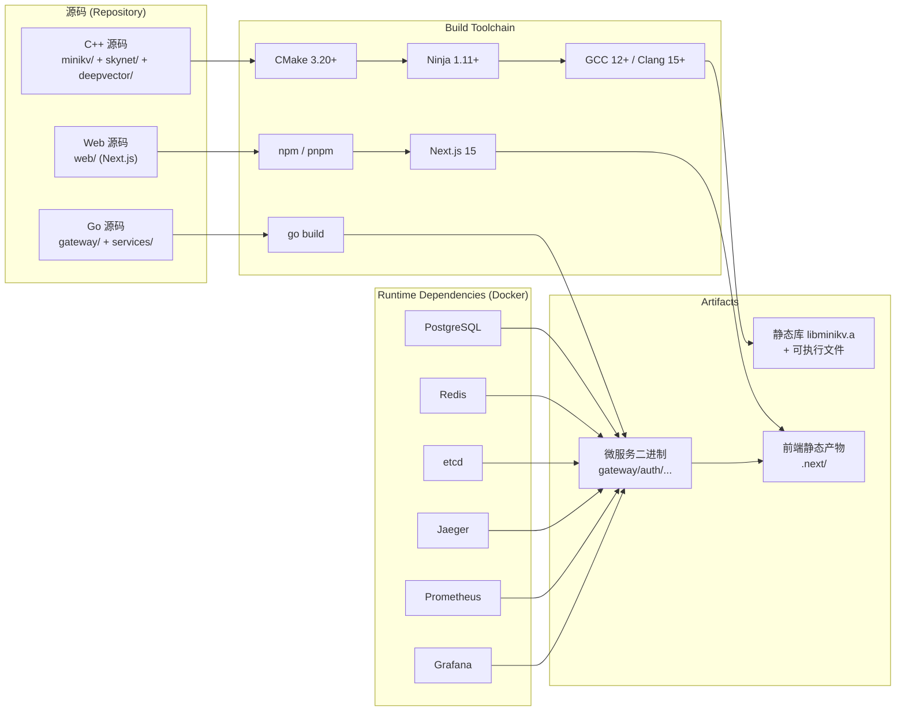

# Module 00 — 跨平台环境搭建

> 对应源码：顶层 [CMakeLists.txt](file:///c:/Users/Administrator/Desktop/hellocpp/CMakeLists.txt)、[Makefile](file:///c:/Users/Administrator/Desktop/hellocpp/Makefile)、[go.mod](file:///c:/Users/Administrator/Desktop/hellocpp/go.mod)、[web/package.json](file:///c:/Users/Administrator/Desktop/hellocpp/web/package.json)、[deploy/dev/docker-compose.yml](file:///c:/Users/Administrator/Desktop/hellocpp/deploy/dev/docker-compose.yml)

## 1. 为什么要先搭环境

我们做分布式项目，第一步永远是「把厨房备齐」。你说你想做满汉全席，结果灶台没接通燃气、锅铲只有一把、调料缺一半——那这道菜再好的方子也做不出来。TitanKV 这个项目尤其如此，它不是单一语言的小玩具，而是一个横跨四种技术栈的「真·分布式系统」：

- **C++17/20** 写存储引擎（`minikv`）和协程网络库（`skynet`），这是项目的核心亮点，求职时拿出来能打的牌；
- **Go 1.23** 写上层微服务（`gateway`、`services/{auth,data,meta,observability}`），负责鉴权、路由、元数据、可观测性；
- **Next.js 15**（基于 Node.js 20）做控制台（`web/`），用 App Router + TanStack Query 实时仪表盘；
- **Docker** 起一整套本地依赖栈：Postgres、Redis、etcd、Jaeger、Prometheus、Grafana——缺一个，后面的 Module 跑起来就会卡壳。

类比一下：C++ 编译器是灶台（火力要够），Go 工具链是蒸锅（快出菜），前端构建是烤箱（精致摆盘），Docker 是食材库（依赖服务随时取用）。四样厨具缺一不可。

我们之所以把这个模块放在 Module 00，是因为后面每一个 Module 都默认你已经能把项目跑起来——Module 01 要 `cmake --build`，Module 07 要 `docker compose up` 起 Postgres，Module 12 要 `npm run dev`。环境没搭好，后面每一步都是阻力。所以这一章我们多花点篇幅，把每个平台的坑都讲透，避免你后面踩坑时怀疑人生。

资深讲师的忠告：**不要跳过这一章**。哪怕你是老手，也建议过一遍「验证安装」那一节，确认版本号达标。我们见过太多同学因为 GCC 版本太老（不支持 C++20 协程）或者 Go 版本太低（apt 装的 1.19）而在 Module 09 卡了一整天。

## 2. 工具链总览

我们先用一张 Mermaid 图把 TitanKV 的工具链关系画清楚，你脑子里有这张图，后面装东西就不会迷路：



这张图说明一个核心事实：**TitanKV 的构建是分流的**。C++ 走 CMake → Ninja → GCC 的传统链路；Go 走 `go build` 自己的工具链；前端走 npm → Next.js。三者产物最终在运行时汇合，而 Docker 提供的依赖服务（Postgres/Redis/etcd 等）是 Go 微服务和前端联调的「地基」。

理解了这个分流，你就明白为什么我们后面要分别装 C++ 工具链、Go 工具链、Node.js、Docker——它们各自独立，互不依赖。

## 3. Windows 平台

Windows 是 TitanKV 开发中最容易踩坑的平台，我们花最多篇幅讲。核心建议：**优先用 WSL2**，原生 Windows 只在「公司强制不允许装 WSL」时才考虑。

### 3.1 方案 A：WSL2 + Ubuntu 22.04（强烈推荐）

为什么要用 WSL2？因为 TitanKV 的 C++ 代码（特别是 `minikv/cmake/FetchCompression.cmake` 拉取的 Snappy/Zstd）在编译时会用到 Linux 专用的系统调用和文件路径约定，原生 Windows 的 MSVC 编译器对这些支持不完整，FetchContent 拉下来的 Linux 专用代码可能直接编译失败。WSL2 给你一个真正的 Linux 内核，所有 Linux 教程的命令都能直接跑，省心。

#### 3.1.1 启用 WSL2（在线安装）

Windows 10 2004+ 和 Windows 11 自带 WSL2，一条命令搞定：

```bash
# 在 PowerShell（管理员）中执行
wsl --install
```

这条命令会自动：
- 启用「虚拟机平台」和「适用于 Linux 的 Windows 子系统」两个可选功能；
- 下载并安装 WSL2 内核；
- 把 WSL2 设为默认版本。

安装完**必须重启电脑**，不重启的话后面 `wsl --set-default-version 2` 会报错。

重启后验证 WSL2 是否就绪：

```bash
# 查看 WSL 版本和默认发行版
wsl --status

# 列出已安装发行版及其 WSL 版本（VERSION 列应为 2）
wsl -l -v
```

#### 3.1.2 启用 WSL2（离线安装，适用于内网/无外网环境）

如果你在公司内网，`wsl --install` 拉不动，可以走离线包：

1. 去 Microsoft 官方下载页（搜「WSL2 Linux kernel update package」）下载 `wsl_update_x64.msi`；
2. 双击安装；
3. 在 PowerShell（管理员）中手动启用功能：

```bash
# 启用 WSL 功能
dism.exe /online /enable-feature /featurename:Microsoft-Windows-Subsystem-Linux /all /norestart

# 启用虚拟机平台
dism.exe /online /enable-feature /featurename:VirtualMachinePlatform /all /norestart
```

4. **重启电脑**；
5. 设置默认版本为 WSL2：

```bash
wsl --set-default-version 2
```

#### 3.1.3 安装 Ubuntu 22.04

我们推荐 Ubuntu 22.04 LTS（而不是 24.04），原因是 22.04 的软件源更稳定，GCC 11 默认可用，手动升 GCC 12+ 也顺。当然 24.04 也行，命令一致。

```bash
# 在线安装（推荐）
wsl --install -d Ubuntu-22.04

# 离线安装：去 Microsoft Store 搜 Ubuntu 22.04，下载 .appx 包，
# 或者从 https://aka.ms/wslubuntu2204 下载后双击安装
```

第一次启动 Ubuntu 时会要求你创建一个 UNIX 用户名和密码，**记住这个密码**，后面 `sudo` 要用。

#### 3.1.4 配置 VSCode Remote-WSL

WSL2 装好后，我们要在 Windows 上的 VSCode 里直接打开 WSL2 内的项目目录，体验和原生 Linux 开发一样：

1. 在 Windows 上安装 [Visual Studio Code](https://code.visualstudio.com/)；
2. 打开 VSCode，按 `Ctrl+Shift+X` 打开扩展市场，搜索并安装 **Remote - WSL**（发布者 Microsoft）；
3. 在 WSL2 终端里 `cd` 到项目目录，然后：

```bash
# 在 WSL2 终端中执行
cd /mnt/c/Users/Administrator/Desktop/hellocpp
code .
```

第一次执行 `code .` 会自动在 WSL2 内安装 VSCode Server，稍等 30 秒左右。装好后，VSCode 左下角会出现绿色的 `WSL: Ubuntu-22.04` 标识，说明已经连上。

#### 3.1.5 在 WSL2 内按 Linux 教程操作

完成以上步骤后，**WSL2 就是一个标准的 Ubuntu**，所有后续工具安装请直接跳到 **第 4 节 Linux 平台**，命令一字不差。

唯一需要注意的是文件系统性能：**项目源码最好放在 WSL2 的原生文件系统（`~/` 下）而不是 `/mnt/c/`**，因为跨文件系统访问会慢 5-10 倍。我们可以把项目软链过去：

```bash
# 在 WSL2 中，把 Windows 项目目录软链到 home
ln -s /mnt/c/Users/Administrator/Desktop/hellocpp ~/hellocpp
cd ~/hellocpp
```

这样 `git` 操作和 `cmake` 构建会快很多。

### 3.2 方案 B：原生 Windows（不推荐，有坑）

如果你确实不能用 WSL2（比如公司 IT 策略禁用虚拟化），那只能走原生 Windows 路线。**提前预警**：这条路坑很多，C++ 项目可能在 FetchContent 阶段直接失败，我们尽量讲完整，但不保证所有 Module 都能跑通。

#### 3.2.1 Visual Studio 2022 Build Tools

C++ 编译器我们用 MSVC（不用 MinGW，MinGW 对 C++20 协程支持不稳定）：

1. 去 [Visual Studio 下载页](https://visualstudio.microsoft.com/zh-hans/downloads/)，下载 **Build Tools for Visual Studio 2022**；
2. 安装时勾选「使用 C++ 的桌面开发」工作负载；
3. 在「单个组件」里确认勾选：
   - MSVC v143 - VS 2022 C++ x64/x86 生成工具（最新版本）
   - Windows 11 SDK（或 Windows 10 SDK）
   - 适用于 Windows 的 C++ CMake 工具
4. 完成安装。

安装完后，打开「x64 Native Tools Command Prompt for VS 2022」这个命令行（开始菜单搜），在里面执行 `cl` 应该能看到编译器版本。

#### 3.2.2 用 vcpkg 装 cmake/ninja

虽然 VS Build Tools 自带 CMake，但版本可能偏老。我们用 vcpkg 统一管理：

```powershell
# 在 PowerShell 中执行
cd C:\
git clone https://github.com/microsoft/vcpkg.git
cd vcpkg
.\bootstrap-vcpkg.bat

# 把 vcpkg 加到 PATH（永久）
[Environment]::SetEnvironmentVariable("Path", $env:Path + ";C:\vcpkg", "User")

# 安装 ninja
.\vcpkg install ninja
```

#### 3.2.3 Git for Windows

```powershell
# 用 winget 装（Windows 10 1709+ 自带）
winget install --id Git.Git -e --source winget
```

或者去 [git-scm.com](https://git-scm.com/download/win) 下载安装包，一路下一步即可。

#### 3.2.4 Go Windows 安装包

```powershell
winget install --id GoLang.Go -e --source winget
```

或者去 [go.dev/dl](https://go.dev/dl/) 下载 `go1.23.x.windows-amd64.msi`，双击安装。安装程序会自动配置 `PATH`。

验证：

```powershell
go version
# 应输出：go version go1.23.x windows/amd64
```

#### 3.2.5 Node.js Windows 安装包

```powershell
winget install --id OpenJS.NodeJS.LTS -e --source winget
```

或去 [nodejs.org](https://nodejs.org/zh-cn/download/) 下载 LTS 版本（v20+）的 Windows Installer，双击安装。

验证：

```powershell
node -v
# 应输出：v20.x.x
npm -v
```

#### 3.2.6 Docker Desktop

下载 [Docker Desktop for Windows](https://www.docker.com/products/docker-desktop/)，双击安装。安装时勾选「Use WSL 2 based engine」（即使你不用 WSL2 开发，Docker Desktop 自己也会用 WSL2 内核跑容器，这是它自己的事）。

安装完启动 Docker Desktop，等右下角鲸鱼图标变绿，验证：

```powershell
docker --version
docker compose version
```

#### 3.2.7 原生 Windows 的坑预警

我们再强调一次，原生 Windows 跑 TitanKV 的 C++ 部分会遇到这些坑：

1. **FetchContent 拉取 Snappy/Zstd 失败**：这两个库的 CMakeLists 在 MSVC 下可能有兼容问题，报错通常是「无法找到 `unistd.h`」或「`_POSIX_C_SOURCE` 未定义」。解决办法是手动 patch 或者切换到 WSL2。
2. **`skynet` 的 C++20 协程**：MSVC 对 C++20 协程支持较新版本才稳定，需要 VS 2022 17.6+，老版本可能报 `experimental` 相关错误。
3. **路径分隔符**：`env_posix.cpp` 这种文件名暗示了 Linux 倾向，Windows 下可能需要额外适配。
4. **Makefile 不可用**：顶层 `Makefile` 是 GNU Make 语法，Windows 原生没有 `make`，需要手动跑 `cmake` 命令。

我们的建议是：**Module 01 之后如果 C++ 编译报错且 10 分钟内没解决，立刻切回 WSL2**。不要在原生 Windows 上死磕，时间不值。

## 4. Linux 平台

Linux 是 TitanKV 的「主场」，所有命令都是一等公民，我们重点讲。

### 4.1 Ubuntu 22.04 LTS / 24.04 LTS（最推荐）

#### 4.1.1 更新 apt 源

先更新包索引，确保后面装的是最新版本：

```bash
sudo apt update && sudo apt upgrade -y
```

如果你在国内，建议把源换成阿里云或清华镜像，下载会快 10 倍：

```bash
# 备份原源（Ubuntu 22.04）
sudo cp /etc/apt/sources.list /etc/apt/sources.list.bak

# 换成阿里云源（Ubuntu 22.04）
sudo sed -i 's|http://archive.ubuntu.com|https://mirrors.aliyun.com|g' /etc/apt/sources.list
sudo sed -i 's|http://security.ubuntu.com|https://mirrors.aliyun.com|g' /etc/apt/sources.list

# Ubuntu 24.04 用的是新格式 /etc/apt/sources.list.d/ubuntu.sources，
# 操作类似，把 URL 替换即可

sudo apt update
```

#### 4.1.2 安装 C++ 工具链：build-essential / cmake / ninja / git

```bash
# build-essential 包含 gcc/g++/make
sudo apt install -y build-essential

# cmake（注意：Ubuntu 22.04 apt 装的是 3.22，刚好满足 3.20+ 要求）
sudo apt install -y cmake

# ninja-build（apt 装的是 1.11，满足要求）
sudo apt install -y ninja-build

# git
sudo apt install -y git
```

但是！Ubuntu 22.04 的 `build-essential` 默认装的是 GCC 11，**不满足我们 GCC 12+ 的要求**（C++20 协程需要 GCC 12+）。我们要手动加 PPA 升级：

```bash
# 添加 toolchain PPA（官方维护，安全）
sudo add-apt-repository -y ppa:ubuntu-toolchain-r/test
sudo apt update

# 安装 GCC 12 和 G++ 12
sudo apt install -y gcc-12 g++-12

# 设为默认
sudo update-alternatives --install /usr/bin/gcc gcc /usr/bin/gcc-12 100
sudo update-alternatives --install /usr/bin/g++ g++ /usr/bin/g++-12 100

# 验证
gcc --version
g++ --version
# 应输出 12.x.x
```

Ubuntu 24.04 自带 GCC 13，不用升，直接 `sudo apt install -y build-essential` 即可。

#### 4.1.3 Go 1.23 手动安装（不用 apt 老版本）

Ubuntu 22.04 的 apt 装 Go 是 1.19 版本，**严重过低**（项目 `go.mod` 要求 1.23+）。我们手动下载官方包，这是 Go 官方推荐做法：

```bash
# 下载 Go 1.23.4（请去 https://go.dev/dl/ 查最新 1.23.x 版本号）
wget https://go.dev/dl/go1.23.4.linux-amd64.tar.gz

# 删除旧版（如果之前 apt 装过）
sudo rm -rf /usr/local/go

# 解压到 /usr/local
sudo tar -C /usr/local -xzf go1.23.4.linux-amd64.tar.gz

# 配置环境变量（写入 ~/.bashrc 或 ~/.zshrc）
echo 'export PATH=$PATH:/usr/local/go/bin' >> ~/.bashrc
echo 'export GOPATH=$HOME/go' >> ~/.bashrc
echo 'export PATH=$PATH:$GOPATH/bin' >> ~/.bashrc

# 让配置生效
source ~/.bashrc

# 验证
go version
# 应输出：go version go1.23.4 linux/amd64
```

如果你在国内，下载慢的话可以换中科大镜像：

```bash
wget https://golang.google.cn/dl/go1.23.4.linux-amd64.tar.gz
```

Go 模块代理也建议换成国内镜像，不然 `go mod tidy` 会卡半天：

```bash
go env -w GO111MODULE=on
go env -w GOPROXY=https://goproxy.cn,direct
go env -w GOSUMDB=sum.golang.google.cn
```

#### 4.1.4 Node.js 20 via NodeSource

Ubuntu apt 自带的 Node.js 是 12.x，太老。我们用 NodeSource 官方源装 20.x：

```bash
# 添加 NodeSource 源（Node.js 20.x）
curl -fsSL https://deb.nodesource.com/setup_20.x | sudo -E bash -

# 安装
sudo apt install -y nodejs

# 验证
node -v
# 应输出：v20.x.x
npm -v
```

如果你在国内，NodeSource 的脚本可能下载慢，可以改用 nvm（见第 7 节常见问题）。

#### 4.1.5 Docker Engine via 官方仓库

不要用 apt 自带的 `docker.io` 包，那个版本太老。我们用 Docker 官方仓库：

```bash
# 卸载旧版（如果有）
sudo apt remove -y docker docker-engine docker.io containerd runc

# 安装必要依赖
sudo apt install -y ca-certificates curl gnupg lsb-release

# 添加 Docker 官方 GPG key
sudo install -m 0755 -d /etc/apt/keyrings
curl -fsSL https://download.docker.com/linux/ubuntu/gpg | sudo gpg --dearmor -o /etc/apt/keyrings/docker.gpg
sudo chmod a+r /etc/apt/keyrings/docker.gpg

# 添加 Docker 源
echo "deb [arch=$(dpkg --print-architecture) signed-by=/etc/apt/keyrings/docker.gpg] https://download.docker.com/linux/ubuntu $(lsb_release -cs) stable" | sudo tee /etc/apt/sources.list.d/docker.list > /dev/null

# 安装 Docker Engine + Compose plugin
sudo apt update
sudo apt install -y docker-ce docker-ce-cli containerd.io docker-buildx-plugin docker-compose-plugin

# 把当前用户加到 docker 组，免 sudo
sudo usermod -aG docker $USER

# 让组变更生效（两种方式二选一）
newgrp docker
# 或者注销重新登录

# 验证
docker --version
# 应输出：Docker version 24.x.x 或更高
docker compose version
```

国内用户如果 Docker 拉镜像慢，可以配置镜像加速器：

```bash
sudo mkdir -p /etc/docker
sudo tee /etc/docker/daemon.json <<EOF
{
  "registry-mirrors": [
    "https://docker.m.daocloud.io",
    "https://dockerproxy.com"
  ]
}
EOF

sudo systemctl daemon-reload
sudo systemctl restart docker
```

#### 4.1.6 一键验证

把上面所有东西装完后，跑一遍验证命令：

```bash
echo "=== C++ 工具链 ==="
cmake --version      # 期望 3.20+
ninja --version      # 期望 1.11+
gcc --version        # 期望 12+
g++ --version        # 期望 12+
git --version        # 期望 2.30+

echo "=== Go ==="
go version           # 期望 1.23+

echo "=== Node.js ==="
node -v              # 期望 v20+
npm -v

echo "=== Docker ==="
docker --version     # 期望 24+
docker compose version
```

### 4.2 Debian 12

Debian 12（Bookworm）和 Ubuntu 命令几乎一致，我们只列差异点：

```bash
# 更新源
sudo apt update && sudo apt upgrade -y

# C++ 工具链：Debian 12 自带 GCC 12，正好满足要求
sudo apt install -y build-essential cmake ninja-build git

# 验证 GCC 版本（Debian 12 默认 12.2，OK）
gcc --version

# Go 1.23 手动安装（同 Ubuntu，apt 装的是 1.19，太老）
wget https://go.dev/dl/go1.23.4.linux-amd64.tar.gz
sudo rm -rf /usr/local/go
sudo tar -C /usr/local -xzf go1.23.4.linux-amd64.tar.gz
echo 'export PATH=$PATH:/usr/local/go/bin' >> ~/.bashrc
source ~/.bashrc

# Node.js 20 via NodeSource（同 Ubuntu）
curl -fsSL https://deb.nodesource.com/setup_20.x | sudo -E bash -
sudo apt install -y nodejs

# Docker：把 Ubuntu 换成 Debian 即可
curl -fsSL https://download.docker.com/linux/debian/gpg | sudo gpg --dearmor -o /etc/apt/keyrings/docker.gpg
echo "deb [arch=$(dpkg --print-architecture) signed-by=/etc/apt/keyrings/docker.gpg] https://download.docker.com/linux/debian $(lsb_release -cs) stable" | sudo tee /etc/apt/sources.list.d/docker.list > /dev/null
sudo apt update
sudo apt install -y docker-ce docker-ce-cli containerd.io docker-buildx-plugin docker-compose-plugin
sudo usermod -aG docker $USER
```

Debian 12 的注意事项：
- 包名差异：`ninja-build`（Debian/Ubuntu 一致），但部分开发库如 `libssl-dev` 在 Debian 上版本号不同，遇到再查；
- Debian 默认不装 `sudo`，如果你用的是 root 登录就不需要 `sudo`，如果是普通用户需要先 `apt install sudo` 再把自己加到 `sudo` 组；
- Debian 的 `lsb_release -cs` 输出是 `bookworm`，Docker 源要对应。

### 4.3 Fedora 39/40

Fedora 用 `dnf`，命令更简洁。Fedora 40 自带 GCC 14、CMake 3.28，工具链很新：

```bash
# 更新系统
sudo dnf upgrade -y

# C++ 工具链
sudo dnf groupinstall -y "Development Tools"
sudo dnf install -y cmake ninja-build git gcc-c++

# 验证
gcc --version        # Fedora 40 是 14.x
cmake --version      # 3.28+
ninja --version

# Go 1.23 手动安装（Fedora dnf 装的是 1.22，略低，建议手动）
wget https://go.dev/dl/go1.23.4.linux-amd64.tar.gz
sudo rm -rf /usr/local/go
sudo tar -C /usr/local -xzf go1.23.4.linux-amd64.tar.gz
echo 'export PATH=$PATH:/usr/local/go/bin' >> ~/.bashrc
source ~/.bashrc
go version

# Node.js 20（Fedora 官方源就有 20.x）
sudo dnf install -y nodejs npm
node -v

# Docker
sudo dnf install -y dnf-plugins-core
sudo dnf config-manager --add-repo https://download.docker.com/linux/fedora/docker-ce.repo
sudo dnf install -y docker-ce docker-ce-cli containerd.io docker-buildx-plugin docker-compose-plugin
sudo systemctl enable --now docker
sudo usermod -aG docker $USER
newgrp docker
docker --version
```

Fedora 注意事项：
- SELinux 默认开启，如果 Docker 容器访问宿主文件出问题，临时 `sudo setenforce 0` 排查，长期方案是配置正确的 SELinux 策略；
- Fedora 升级很快，每 6 个月一个大版本，建议跟 40/41 这种偶数稳定版。

## 5. macOS 平台

macOS 开发体验很好，但要分 Apple Silicon 和 Intel 两套，主要差异在 Docker 性能。

### 5.1 Apple Silicon (M1/M2/M3/M4)

#### 5.1.1 Xcode Command Line Tools

先装这个，它提供 `clang`、`git`、`make` 等基础工具：

```bash
# 安装（会弹窗确认）
xcode-select --install
```

如果你已经装了完整 Xcode，可以跳过。验证：

```bash
clang --version
git --version
```

#### 5.1.2 Homebrew 安装

Homebrew 是 macOS 的包管理器，必装：

```bash
# 官方安装脚本
/bin/bash -c "$(curl -fsSL https://raw.githubusercontent.com/Homebrew/install/HEAD/install.sh)"
```

国内如果 GitHub 拉不动，用中科大镜像：

```bash
# 用中科大镜像安装 Homebrew
/bin/bash -c "$(curl -fsSL https://gitee.com/cunkai/HomebrewCN/raw/master/Homebrew.sh)"
```

Apple Silicon 上 Homebrew 装在 `/opt/homebrew`，需要配置 PATH（安装脚本会提示）：

```bash
# 写入 ~/.zshrc（macOS 默认 shell 是 zsh）
echo 'eval "$(/opt/homebrew/bin/brew shellenv)"' >> ~/.zshrc
source ~/.zshrc

# 验证
brew --version
```

#### 5.1.3 安装工具链

```bash
# C++ 工具链
brew install cmake ninja

# 注意：macOS 上我们用 clang（Apple 自带），不用 GCC
# Apple Clang 默认支持 C++20 协程，无需额外操作
clang --version

# Go
brew install go
go version

# Node.js 20
brew install node@20
echo 'export PATH="/opt/homebrew/opt/node@20/bin:$PATH"' >> ~/.zshrc
source ~/.zshrc
node -v

# Git（系统自带，但 brew 版本更新）
brew install git
git --version
```

#### 5.1.4 Docker Desktop for Mac (Apple Silicon)

Apple Silicon 上 Docker Desktop 用 Apple Hypervisor 虚拟化跑 Linux 容器，性能比 Intel Mac 稍差但完全可用：

1. 下载 [Docker Desktop for Mac with Apple silicon](https://www.docker.com/products/docker-desktop/)；
2. 双击 `.dmg` 拖到 Applications；
3. 启动 Docker.app，等鲸鱼图标变绿；
4. 在 Settings → Resources 里分配至少 4GB 内存（默认 2GB 跑 TitanKV 全栈会卡）。

验证：

```bash
docker --version
docker compose version

# 跑一个 arm64 容器测试
docker run --rm hello-world
```

Apple Silicon 注意事项：
- Docker 镜像要选 `arm64` 或 `multi-arch` 版本，Postgres/Redis/etcd 官方都有 arm64 镜像，没问题；
- 如果遇到只有 `amd64` 镜像（罕见），Docker Desktop 会用 QEMU 模拟，性能差但能跑；
- `skynet` 和 `minikv` 在 Apple Silicon 上原生编译没问题，clang 直接出 arm64 二进制。

### 5.2 Intel Mac

Intel Mac 命令和 Apple Silicon 几乎一致，差异点：

```bash
# Homebrew 装在 /usr/local（不是 /opt/homebrew）
/bin/bash -c "$(curl -fsSL https://raw.githubusercontent.com/Homebrew/install/HEAD/install.sh)"

# PATH 配置（Intel 路径）
echo 'eval "$(/usr/local/bin/brew shellenv)"' >> ~/.zshrc
source ~/.zshrc

# 后续 brew install 命令完全一致
brew install cmake ninja go node@20 git
```

Intel Mac 的优势：
- Docker Desktop 性能更好（原生虚拟化，不用走 Rosetta）；
- 第三方库兼容性更好（很多老库只有 amd64 二进制）。

劣势：
- Mac 已停产，未来 Apple 会逐渐放弃 Intel 支持；
- 编译速度比 M 系列慢 2-3 倍。

如果你还在用 Intel Mac 做重度 C++ 编译，我们强烈建议升级到 Apple Silicon，体验差距巨大。

## 6. 验证安装（跨平台通用）

我们把所有平台的验证命令整合成一个脚本，你跑一遍就能确认环境是否就绪。

把下面的内容存为 `check-env.sh`（Linux/macOS/WSL2）或 `check-env.ps1`（Windows PowerShell）：

```bash
#!/usr/bin/env bash
# TitanKV 环境验证脚本
# 用法：bash check-env.sh

set -e

GREEN='\033[0;32m'
RED='\033[0;31m'
NC='\033[0m'

pass() { echo -e "${GREEN}[✓]${NC} $1"; }
fail() { echo -e "${RED}[✗]${NC} $1"; FAILED=1; }

FAILED=0

echo "========================================="
echo "  TitanKV Environment Check"
echo "========================================="

# --- C++ Toolchain ---
echo ""
echo "--- C++ Toolchain ---"

if command -v cmake &> /dev/null; then
    CMAKE_VER=$(cmake --version | head -1 | awk '{print $3}')
    CMAKE_MAJOR=$(echo $CMAKE_VER | cut -d. -f1)
    CMAKE_MINOR=$(echo $CMAKE_VER | cut -d. -f2)
    if [ "$CMAKE_MAJOR" -ge 3 ] && [ "$CMAKE_MINOR" -ge 20 ] || [ "$CMAKE_MAJOR" -gt 3 ]; then
        pass "CMake $CMAKE_VER (>= 3.20)"
    else
        fail "CMake $CMAKE_VER (need >= 3.20)"
    fi
else
    fail "CMake not found"
fi

if command -v ninja &> /dev/null; then
    NINJA_VER=$(ninja --version)
    pass "Ninja $NINJA_VER"
else
    fail "Ninja not found (recommended for faster builds)"
fi

# GCC or Clang
if command -v g++ &> /dev/null; then
    GCC_VER=$(g++ --version | head -1 | grep -oE '[0-9]+\.[0-9]+\.[0-9]+' | head -1)
    GCC_MAJOR=$(echo $GCC_VER | cut -d. -f1)
    if [ "$GCC_MAJOR" -ge 12 ]; then
        pass "GCC $GCC_VER (>= 12)"
    else
        fail "GCC $GCC_VER (need >= 12 for C++20 coroutines)"
    fi
elif command -v clang++ &> /dev/null; then
    CLANG_VER=$(clang++ --version | head -1 | grep -oE '[0-9]+\.[0-9]+\.[0-9]+' | head -1)
    CLANG_MAJOR=$(echo $CLANG_VER | cut -d. -f1)
    if [ "$CLANG_MAJOR" -ge 15 ]; then
        pass "Clang $CLANG_VER (>= 15)"
    else
        fail "Clang $CLANG_VER (need >= 15)"
    fi
else
    fail "No C++ compiler found (GCC or Clang)"
fi

# --- Git ---
echo ""
echo "--- Git ---"
if command -v git &> /dev/null; then
    GIT_VER=$(git --version | awk '{print $3}')
    pass "Git $GIT_VER"
else
    fail "Git not found"
fi

# --- Go ---
echo ""
echo "--- Go ---"
if command -v go &> /dev/null; then
    GO_VER=$(go version | awk '{print $3}' | sed 's/go//')
    GO_MAJOR=$(echo $GO_VER | cut -d. -f1)
    GO_MINOR=$(echo $GO_VER | cut -d. -f2)
    if [ "$GO_MAJOR" -ge 1 ] && [ "$GO_MINOR" -ge 23 ] || [ "$GO_MAJOR" -gt 1 ]; then
        pass "Go $GO_VER (>= 1.23)"
    else
        fail "Go $GO_VER (need >= 1.23)"
    fi
else
    fail "Go not found"
fi

# --- Node.js ---
echo ""
echo "--- Node.js ---"
if command -v node &> /dev/null; then
    NODE_VER=$(node -v | sed 's/v//')
    NODE_MAJOR=$(echo $NODE_VER | cut -d. -f1)
    if [ "$NODE_MAJOR" -ge 20 ]; then
        pass "Node.js $NODE_VER (>= 20)"
    else
        fail "Node.js $NODE_VER (need >= 20)"
    fi
    NPM_VER=$(npm -v)
    pass "npm $NPM_VER"
else
    fail "Node.js not found"
fi

# --- Docker ---
echo ""
echo "--- Docker ---"
if command -v docker &> /dev/null; then
    DOCKER_VER=$(docker --version | awk '{print $3}' | tr -d ',')
    DOCKER_MAJOR=$(echo $DOCKER_VER | cut -d. -f1)
    if [ "$DOCKER_MAJOR" -ge 24 ]; then
        pass "Docker $DOCKER_VER (>= 24)"
    else
        fail "Docker $DOCKER_VER (need >= 24)"
    fi

    if docker compose version &> /dev/null; then
        pass "Docker Compose plugin available"
    else
        fail "Docker Compose plugin missing"
    fi

    # Check Docker daemon is running
    if docker info &> /dev/null; then
        pass "Docker daemon is running"
    else
        fail "Docker daemon not running (start Docker Desktop or 'sudo systemctl start docker')"
    fi
else
    fail "Docker not found"
fi

# --- Summary ---
echo ""
echo "========================================="
if [ "$FAILED" -eq 0 ]; then
    echo -e "${GREEN}  All checks passed! Welcome to TitanKV.${NC}"
else
    echo -e "${RED}  Some checks failed. Fix them before Module 01.${NC}"
fi
echo "========================================="
```

使用方法：

```bash
# 赋予执行权限
chmod +x check-env.sh

# 运行
./check-env.sh
```

预期输出大致如下（全部绿色 ✓）：

```
=========================================
  TitanKV Environment Check
=========================================

--- C++ Toolchain ---
[✓] CMake 3.22.0 (>= 3.20)
[✓] Ninja 1.11.1
[✓] GCC 12.3.0 (>= 12)

--- Git ---
[✓] Git 2.34.1

--- Go ---
[✓] Go 1.23.4 (>= 1.23)

--- Node.js ---
[✓] Node.js 20.18.0 (>= 20)
[✓] npm 10.8.2

--- Docker ---
[✓] Docker 24.0.7 (>= 24)
[✓] Docker Compose plugin available
[✓] Docker daemon is running

=========================================
  All checks passed! Welcome to TitanKV.
=========================================
```

如果有任何 `[✗]`，回到对应平台的章节重装那个工具。

## 7. 常见问题排查

这一节我们收集了同学们最常遇到的坑，按问题类型分类。

### 7.1 WSL2 无法安装（错误码 0x800701bc）

**症状**：执行 `wsl --install` 或启动 WSL2 时报 `WslRegisterDistribution failed with error: 0x800701bc`。

**原因**：WSL2 内核版本过旧，或者 BIOS 里没开虚拟化。

**解决**：

```powershell
# 1. 下载并安装最新 WSL2 内核更新包
#    https://wslstorestorage.blob.core.windows.net/wslblob/wsl_update_x64.msi
#    双击安装

# 2. 设置默认版本为 WSL2
wsl --set-default-version 2

# 3. 重启电脑
```

如果还是不行，进 BIOS 检查：
- Intel CPU：开启「Intel Virtualization Technology (VT-x)」；
- AMD CPU：开启「SVM Mode」。

### 7.2 Go 版本过低（apt 装了 1.19，怎么升级）

**症状**：`go version` 输出 `go1.19`，但项目 `go.mod` 要求 `go 1.23`，跑 `go build` 报 `go.mod requires go >= 1.23`。

**原因**：Ubuntu 22.04 apt 自带的是 Go 1.19。

**解决**：手动安装官方包（见 4.1.3），关键是**先卸载 apt 版本**：

```bash
# 卸载 apt 版本
sudo apt remove -y golang-go
sudo apt autoremove -y

# 检查是否还有残留
which go
# 应该输出空，或者指向 /usr/local/go/bin/go（新版）

# 安装官方 1.23
wget https://go.dev/dl/go1.23.4.linux-amd64.tar.gz
sudo rm -rf /usr/local/go
sudo tar -C /usr/local -xzf go1.23.4.linux-amd64.tar.gz
echo 'export PATH=$PATH:/usr/local/go/bin' >> ~/.bashrc
source ~/.bashrc
go version
```

### 7.3 Node 版本管理（nvm 推荐）

**症状**：系统里有多个 Node 项目，需要不同 Node 版本，切来切去麻烦。

**解决**：用 nvm（Node Version Manager）管理多版本：

```bash
# 安装 nvm
curl -o- https://raw.githubusercontent.com/nvm-sh/nvm/v0.40.1/install.sh | bash

# 让 nvm 生效
source ~/.bashrc

# 验证
nvm --version

# 安装 Node.js 20（设为默认）
nvm install 20
nvm alias default 20
nvm use 20

# 切换版本
nvm install 18
nvm use 18
nvm use 20

# 查看已装版本
nvm ls
```

macOS 同理，nvm 跨平台。

### 7.4 Docker 权限问题（permission denied while trying to connect to Docker daemon）

**症状**：跑 `docker ps` 报 `permission denied`，必须加 `sudo` 才行。

**原因**：当前用户不在 `docker` 组里。

**解决**：

```bash
# 把当前用户加到 docker 组
sudo usermod -aG docker $USER

# 让组变更生效（重要！）
newgrp docker

# 或者注销重新登录

# 验证（不需要 sudo）
docker ps
```

如果 `newgrp docker` 不生效，重启电脑最稳。

### 7.5 CMake 找不到包（FETCHCONTENT 下载失败）

**症状**：跑 `cmake -B build` 时卡在 `FetchContent` 阶段，报 `Failed to connect to github.com` 或下载超时。

**原因**：GitHub 在国内访问不稳定，FetchContent 拉取 Snappy/Zstd/gtest 失败。

**解决**：配置代理或换镜像。

方案 A：配置 git 代理（如果你有代理工具）：

```bash
# 假设代理在 127.0.0.1:7890
git config --global http.proxy http://127.0.0.1:7890
git config --global https.proxy http://127.0.0.1:7890

# 用完取消
git config --global --unset http.proxy
git config --global --unset https.proxy
```

方案 B：给 CMake 配置代理环境变量：

```bash
export HTTP_PROXY=http://127.0.0.1:7890
export HTTPS_PROXY=http://127.0.0.1:7890
cmake -B build -DCMAKE_BUILD_TYPE=Release
```

方案 C：手动下载依赖放到缓存目录，让 FetchContent 跳过下载。具体看 `minikv/cmake/FetchCompression.cmake` 里的 URL 和目标路径，提前下载好放进去。

方案 D：用 GitHub 镜像（不推荐，不稳定）：

```bash
# 临时把 github.com 换成镜像
git config --global url."https://ghproxy.com/https://github.com/".insteadOf "https://github.com/"
```

### 7.6 C++ 编译错误（GCC 版本太老不支持 C++20 协程）

**症状**：编译 `skynet` 时报错 `error: 'std::coroutine_traits' has not been declared` 或 `std::experimental::coroutine_traits`。

**原因**：GCC < 12 不支持 C++20 协程，GCC 12 才完整支持。

**解决**：升级 GCC 到 12+，方法见 4.1.2。验证：

```bash
g++ --version
# 必须 12.x 或更高

# 测试 C++20 协程是否可用
cat > /tmp/test_coro.cpp << 'EOF'
#include <coroutine>
#include <iostream>

struct Task {
    struct promise_type {
        Task get_return_object() { return {}; }
        std::suspend_never initial_suspend() { return {}; }
        std::suspend_never final_suspend() noexcept { return {}; }
        void return_void() {}
        void unhandled_exception() {}
    };
};

Task hello() {
    std::cout << "C++20 coroutine works!\n";
    co_return;
}

int main() {
    hello();
    return 0;
}
EOF

g++ -std=c++20 -fcoroutines /tmp/test_coro.cpp -o /tmp/test_coro
/tmp/test_coro
# 应输出：C++20 coroutine works!
```

如果上面这段代码编译运行通过，说明你的 GCC 完全 OK，可以编译 `skynet`。

### 7.7 Docker Desktop 启动失败（WSL2 相关）

**症状**：Docker Desktop 启动后鲸鱼图标一直是红色，提示「WSL2 installation is incomplete」。

**解决**：

```powershell
# 1. 确保 WSL2 已启用
wsl --status

# 2. 更新 WSL2 内核
wsl --update

# 3. 重启 Docker Desktop
```

如果还不行，检查 Windows 功能是否启用：

```powershell
# 在 PowerShell（管理员）中
dism.exe /online /enable-feature /featurename:VirtualMachinePlatform /all /norestart
dism.exe /online /enable-feature /featurename:Microsoft-Windows-Subsystem-Linux /all /norestart
# 重启电脑
```

### 7.8 Make 找不到（Windows 原生）

**症状**：在 Windows PowerShell 跑 `make build` 报 `make: command not found`。

**原因**：Windows 原生没有 GNU Make。

**解决**：

```powershell
# 用 Chocolatey 装
choco install make

# 或者用 winget
winget install GnuWin32.Make
```

或者干脆不用 `make`，直接跑底层命令：

```powershell
cmake -B build -DCMAKE_BUILD_TYPE=Release -DENABLE_TESTS=ON
cmake --build build -j
ctest --test-dir build --output-on-failure
```

## 8. IDE 推荐配置

工欲善其事，必先利其器。我们推荐两套 IDE 方案。

### 8.1 VSCode（推荐，免费）

VSCode 是 TitanKV 项目的首选 IDE，原因有三：免费、跨平台、Remote-WSL 体验一流。

#### 8.1.1 必装扩展

打开 VSCode 扩展市场（`Ctrl+Shift+X`），搜索并安装：

| 扩展 | 发布者 | 用途 |
|---|---|---|
| **C/C++** | Microsoft | C/C++ IntelliSense、调试 |
| **CMake Tools** | Microsoft | CMake 项目集成、构建、调试 |
| **Go** | Go Team | Go 语言支持、调试、测试 |
| **Remote - WSL** | Microsoft | WSL2 远程开发（Windows 用户必装） |
| **Remote - SSH** | Microsoft | 远程 Linux 服务器开发（可选） |
| **Docker** | Microsoft | Docker 容器管理 |
| **YAML** | Red Hat | docker-compose.yml 高亮 |
| **Markdown All in One** | Yu Zhang | 写文档（本项目有大量 .md） |
| **Tailwind CSS IntelliSense** | Tailwind Labs | web/ 前端开发 |

#### 8.1.2 c_cpp_properties.json 示例

在项目根目录创建 `.vscode/c_cpp_properties.json`，让 IntelliSense 正确解析 include 路径：

```json
{
    "version": 4,
    "configurations": [
        {
            "name": "Linux (WSL)",
            "includePath": [
                "${workspaceFolder}/**",
                "${workspaceFolder}/minikv/include",
                "${workspaceFolder}/minikv/src/core",
                "${workspaceFolder}/minikv/src/utils",
                "${workspaceFolder}/minikv/src/network",
                "${workspaceFolder}/skynet/include",
                "${workspaceFolder}/deepvector/include",
                "${workspaceFolder}/build/_deps/*-src/**",
                "${workspaceFolder}/minikv/build/_deps/*-src/**"
            ],
            "defines": [
                "_DEBUG",
                "UNICODE",
                "_UNICODE"
            ],
            "cStandard": "c17",
            "cppStandard": "c++17",
            "intelliSenseMode": "linux-gcc-x64",
            "configurationProvider": "ms-vscode.cmake-tools"
        },
        {
            "name": "macOS (Clang)",
            "includePath": [
                "${workspaceFolder}/**",
                "${workspaceFolder}/minikv/include",
                "${workspaceFolder}/skynet/include",
                "${workspaceFolder}/deepvector/include"
            ],
            "defines": [],
            "cStandard": "c17",
            "cppStandard": "c++20",
            "intelliSenseMode": "macos-clang-arm64",
            "configurationProvider": "ms-vscode.cmake-tools"
        }
    ]
}
```

注意 `includePath` 里的 `_deps/*-src/**` 是 CMake FetchContent 下载的依赖（gtest、snappy、zstd）所在目录，构建一次后才会有，第一次构建前 IntelliSense 可能报红，构建完重启 VSCode 即可。

#### 8.1.3 settings.json 推荐

`.vscode/settings.json`：

```json
{
    "cmake.buildDirectory": "${workspaceFolder}/build",
    "cmake.configureSettings": {
        "CMAKE_BUILD_TYPE": "Debug",
        "ENABLE_TESTS": "ON"
    },
    "cmake.generator": "Ninja",
    "C_Cpp.default.configurationProvider": "ms-vscode.cmake-tools",
    "go.gopath": "~/go",
    "go.useLanguageServer": true,
    "editor.formatOnSave": true,
    "[cpp]": {
        "editor.defaultFormatter": "ms-vscode.cpptools"
    },
    "[go]": {
        "editor.defaultFormatter": "golang.go"
    },
    "files.associations": {
        "*.h": "cpp",
        "*.cpp": "cpp",
        "CMakeLists.txt": "cmake"
    }
}
```

#### 8.1.4 tasks.json（可选，快捷构建）

`.vscode/tasks.json`：

```json
{
    "version": "2.0.0",
    "tasks": [
        {
            "label": "TitanKV: CMake Build (Debug)",
            "type": "shell",
            "command": "cmake --build build -j",
            "group": "build",
            "problemMatcher": ["$gcc"]
        },
        {
            "label": "TitanKV: CMake Test",
            "type": "shell",
            "command": "ctest --test-dir build --output-on-failure",
            "group": "test",
            "dependsOn": "TitanKV: CMake Build (Debug)"
        },
        {
            "label": "TitanKV: Go Test",
            "type": "shell",
            "command": "go test ./...",
            "group": "test"
        },
        {
            "label": "TitanKV: Docker Up",
            "type": "shell",
            "command": "docker compose -f deploy/dev/docker-compose.yml up -d"
        }
    ]
}
```

### 8.2 CLion（付费但好用）

如果你预算充足（学生可申请免费教育许可），CLion 是 C++ 开发的顶级 IDE，对 CMake 项目支持比 VSCode 更深。

#### 8.2.1 配置项目

1. 打开 CLion，`File → Open` 选择项目根目录的 `CMakeLists.txt`；
2. CLion 会自动识别 CMake 项目，选择工具链（Linux 上选默认 GCC，macOS 选默认 Clang）；
3. 在 `Settings → Build, Execution, Deployment → CMake` 里配置：
   - **Build type**: Debug
   - **Build options**: `-j 8`（用 Ninja 加速）
   - **CMake options**: `-DENABLE_TESTS=ON`
4. 应用后 CLion 会自动 configure，等右下角进度条跑完。

#### 8.2.2 配置 skynet 子项目

因为 `skynet` 独立构建，要在 CLion 里单独打开 `skynet/CMakeLists.txt`，或者在主项目里用「Open Project in New Window」打开 `skynet`。

CLion 的优势：
- 重构（Rename、Extract Method）比 VSCode 准确；
- 调试器集成了 LLDB/GDB，断点、变量监视一流；
- 内置静态分析，能发现潜在 bug。

劣势：
- 占内存（建议 8GB+ 内存机器用）；
- 启动慢，大项目首次索引要 1-2 分钟。

### 8.3 其他选择

- **Neovim + LSP**：资深用户可选，配置好 `clangd` + `gopls` 体验不输 VSCode，启动快；
- **Visual Studio 2022 Community**（仅 Windows）：C++ 调试体验最好，但项目要走 MSBuild 而非 CMake（虽然有 CMake 支持），不推荐用于 TitanKV；
- **GoLand**：只做 Go 部分（`gateway`、`services`）开发的话，体验比 VSCode Go 扩展好，但 C++ 部分还得另开 IDE。

我们的最终建议：**主力 VSCode（Remote-WSL），偶尔用 CLion 做深度调试**。

## 9. 下一步

环境搭好了，接下来我们要把项目真正跑起来，理解整体架构。Module 01 会带我们：

- 用 `cmake` 和 `ninja` 构建 `minikv` 和 `skynet`，跑通 C++ 单元测试；
- 用 `go build` 编译 `gateway` 和 `services`，启动 Go 微服务；
- 用 `npm run dev` 启动 Next.js 控制台；
- 用 `docker compose up` 起本地依赖栈；
- 通读 [README.md](file:///c:/Users/Administrator/Desktop/hellocpp/README.md) 和 [docs/REFACTORING.md](file:///c:/Users/Administrator/Desktop/hellocpp/docs/REFACTORING.md)，理解 TitanKV 的 9 个 Phase 重构路线。

记住：**环境验证脚本全绿是进入 Module 01 的入场券**。如果还有红色 `[✗]`，回到对应章节修好再继续。

我们 Module 01 见。

---

← [课程大纲](./README.md) | [下一模块：Module 01](./01-overview.md) →
