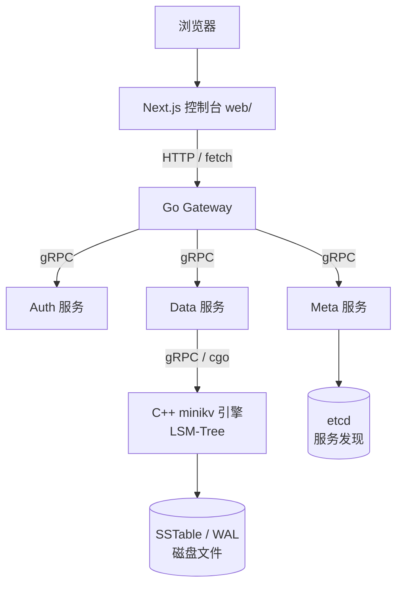

# Module 01 — 环境搭建与项目概览

> 对应源码：顶层 [CMakeLists.txt](file:///c:/Users/Administrator/Desktop/hellocpp/CMakeLists.txt)、[Makefile](file:///c:/Users/Administrator/Desktop/hellocpp/Makefile)、[README.md](file:///c:/Users/Administrator/Desktop/hellocpp/README.md)、[docs/REFACTORING.md](file:///c:/Users/Administrator/Desktop/hellocpp/docs/REFACTORING.md)

## 背景与动机

我们见过太多同学一上来就钻进某个文件埋头读代码，三天以后还在 CMakeLists.txt 里打转，连项目长什么样都没看清。盖房子之前先看图纸，是工程师的本能；研究一个分布式存储系统也是一样——先把分层、依赖、构建链路在脑子里铺开，再去抠某个模块的细节，每一步才落得踏实。这一模块就是 TitanKV 的「图纸」：把 C++ 引擎、Go 服务、Next.js 控制台三层之间的关系理顺，把 CMake、Make、docker-compose 三套构建工具的位置摆正。

分布式 KV 这个题目本身并不新鲜，但真要从零写一个，大多数人会卡在「我不知道下一步该做什么」。TitanKV 用 9 个 Phase 把这件事拆开——存储引擎先跑通、再加网络层、再上 Go 网关、最后接前端，每个 Phase 都对应可交付的代码和面试可讲的成果。Module 01 的位置正在于此：它不教任何语法，但告诉你整个项目地图，让你后面读 Module 02-05 时心里有底，知道每个语法点会落到哪个子系统。

学完这一模块，你应该能在白板上把 TitanKV 的分层架构画清楚，回答「这个项目用到了哪些语言、为什么用三套、它们怎么协作」，也能讲清 Phase 1 已经完成的 SSTable 块压缩、MVCC 快照、Manifest 持久化这三件事的来龙去脉。如果面试官问「你做的项目里最难的部分是什么」，你至少有了一张可以展开的全局地图。别因为这一节没有代码就跳过——全局地图不扎实，后面所有细节都会变成「为什么这里这样写」的迷宫。

## 1. 核心知识

- TitanKV 是一个**从零实现**的分布式 KV 存储平台，不是一个对现有数据库的封装。
- 两大 C++ 子系统：`minikv`（C++17 LSM-Tree 存储引擎）、`skynet`（C++20 协程网络库）。
- 重构路线分 9 个 Phase（见 REFACTORING.md），当前处于 Phase 1。
- 构建系统：顶层 CMake 聚合 `minikv`；`skynet` 独立构建；Go 走 `go.mod`；Next.js 在 `web/`。
- 统一入口：`make help` 列出全部目标；`make build`/`make test`/`make docker-up`。

## 2. 内容详解

### 2.1 整体架构

TitanKV 采用分层架构，自底向上：

```
┌─────────────────────────────────────────────┐
│  Next.js 控制台 (web/)  ← Phase 6           │
├─────────────────────────────────────────────┤
│  Go 微服务 (services/) ← Phase 3-4          │
│   gateway / auth / data / meta / observability
├─────────────────────────────────────────────┤
│  分布式层 (distributed/) ← Phase 5          │
│   Raft 复制 + 一致性哈希分片 + etcd 发现     │
├─────────────────────────────────────────────┤
│  C++ 网络层 (skynet/) C++20 协程            │
│   epoll / Executor / HTTP / 反向代理         │
├─────────────────────────────────────────────┤
│  C++ 存储引擎 (minikv/) C++17 LSM-Tree      │
│   WAL / MemTable / SSTable / Compaction / BF │
└─────────────────────────────────────────────┘
```

关键认知：**存储引擎和网络层是从零写的**（这是求职亮点），上层 Go/Next.js 部分尚在规划中（见 REFACTORING.md 状态表）。

把上面那张分层图换成调用链视角，整个系统就是一条从浏览器到 SSTable 的链路，每一跳都换了语言和协议：



### 2.2 构建系统拆解

顶层 [CMakeLists.txt](file:///c:/Users/Administrator/Desktop/hellocpp/CMakeLists.txt) 设定 `CMAKE_CXX_STANDARD 17`，并通过 `add_subdirectory` 聚合 `minikv`：

```cmake
set(CMAKE_CXX_STANDARD 17)
set(CMAKE_CXX_EXTENSIONS OFF)          # 关闭 GNU 扩展，保证可移植
option(ENABLE_TESTS "Enable unit tests" OFF)
option(ENABLE_SANITIZERS "Enable Address/Thread sanitizers" OFF)
add_subdirectory(minikv)
```

`minikv/CMakeLists.txt` 把核心编译为静态库 `minikv`，并通过 `FetchContent` 拉取 Snappy + Zstd 做块压缩（见 [cmake/FetchCompression.cmake](file:///c:/Users/Administrator/Desktop/hellocpp/minikv/cmake/FetchCompression.cmake)）。

`skynet` 需要 C++20 协程支持，单独构建（顶层 CMake 不强制 C++20，避免拖累 minikv）：

```bash
cmake -B skynet/build -S skynet -DCMAKE_BUILD_TYPE=Release -DENABLE_TESTS=ON
cmake --build skynet/build -j
```

### 2.3 统一 Makefile 入口

[Makefile](file:///c:/Users/Administrator/Desktop/hellocpp/Makefile) 提供跨语言统一入口，关键目标：

| 目标 | 作用 |
|---|---|
| `make cmake-build` | 配置 + 构建 C++ |
| `make cpp-test` | `ctest` 跑 C++ 单测 |
| `make cpp-lint` | `clang-tidy` 静态检查 |
| `make go-build` / `make go-test` | Go 构建 / 测试（带 `-race`） |
| `make web-build` | Next.js 控制台构建 |
| `make build` / `make test` / `make lint` | 聚合：C++ + Go |
| `make docker-up` | 启 Postgres/Redis/etcd/Jaeger/Prometheus/Grafana |

### 2.4 本地开发栈

[deploy/dev/docker-compose.yml](file:///c:/Users/Administrator/Desktop/hellocpp/deploy/dev/docker-compose.yml) 起本地依赖：

- **PostgreSQL** — 元数据存储（Collection、User、APIKey）
- **Redis** — 限流、缓存、分布式锁
- **etcd** — 服务注册发现、Raft 配置
- **Jaeger** — 分布式链路追踪
- **Prometheus + Grafana** — 指标采集与可视化

### 2.5 重构进度速读

REFACTORING.md 的 Phase 1 已完成项（面试常问「你做了什么」时直接用）：

- WP 1.2.1 SSTable 块压缩（Snappy/Zstd）：块格式 `[crc(4)][physical_size(4)][uncompressed_size(4)][type(1)][payload]`
- WP 1.2.2 MVCC 快照读：InternalKey = `[user_key | trailer(8)]`，序列号降序排列
- WP 1.2.4 Manifest 持久化：追加写 `[crc(4)][size(4)][payload]`，重启时重放重建 Version

## 3. 思考题

1. 为什么顶层 CMake 设 `CMAKE_CXX_EXTENSIONS OFF`？开启 GNU 扩展会带来什么风险？
2. `skynet` 需要 C++20 而 `minikv` 只用 C++17，为什么不强制全项目 C++20？
3. SSTable 块格式里为什么要同时存 `physical_size` 和 `uncompressed_size`？
4. Manifest 追加写时若最后一笔记录 CRC 校验失败，为什么直接忽略而不是报错退出？
5. `make go-test` 默认带 `-race` 标志，这会对性能测试产生什么影响？何时该关掉？

## 4. 动手题

### 题 4.1（环境验证）

在本地（推荐 WSL2 / Linux）完成：

```bash
cmake -B build -DCMAKE_BUILD_TYPE=Debug -DENABLE_TESTS=ON -DENABLE_SANITIZERS=ON
cmake --build build -j
ctest --test-dir build --output-on-failure
```

记录：编译器版本、测试通过数、AddressSanitizer 是否报告泄漏。

### 题 4.2（架构梳理）

阅读 [README.md](file:///c:/Users/Administrator/Desktop/hellocpp/README.md) 的 Repository Layout 与 [docs/REFACTORING.md](file:///c:/Users/Administrator/Desktop/hellocpp/docs/REFACTORING.md)，用一张表总结：每个目录对应哪个 Phase、当前状态、负责什么职责。

### 题 4.3（写路径追踪）

阅读 [minikv/src/core/db_impl.cpp](file:///c:/Users/Administrator/Desktop/hellocpp/minikv/src/core/db_impl.cpp) 的 `put()` 与 `flushMemTable()`，画出 `Put(key,value)` 从调用到落盘 SSTable 的完整调用链（函数名级）。

## 5. 自检

1. TitanKV 的存储引擎语言标准是 C++____，网络库是 C++____。
2. SSTable 块格式由 ____ 字节的 CRC、____ 字节的物理大小、____ 字节的未压缩大小、1 字节类型和 payload 组成。
3. Manifest 重启恢复时，遇到尾部截断记录应____（报错退出 / 忽略继续）。
4. `make build` 会同时构建 ____ 和 ____ 两种语言的目标。
5. 本地开发栈中负责服务注册发现的是 ____，负责链路追踪的是 ____。

<details>
<summary>参考答案</summary>

1. 17；20
2. 4；4；4
3. 忽略继续（容忍 torn write）
4. C++；Go
5. etcd；Jaeger

思考题要点：
1. 开启 GNU 扩展会使用 `__attribute__` 等非标准语法，降低跨编译器/跨平台可移植性。
2. C++20 编译器（尤其协程）在部分发行版未必默认可用；minikv 只需 C++17 即可，降低构建门槛。
3. `physical_size` 用于磁盘读取定长，`uncompressed_size` 用于解压后分配缓冲区；二者不同是因为压缩后大小变了。
4. 尾部截断通常是崩溃时未写完整（torn write），忽略可正常恢复此前已提交记录；若报错会导致无法启动。
5. `-race` 开启竞争检测器会有 2-10x 性能损耗，基准测试时应关闭。

</details>

---

← [课程大纲](./README.md)  |  下一模块：[Module 02 — C++ 核心语法](./02-cpp-core.md) →
