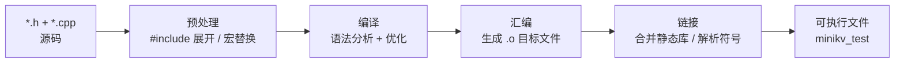

# Module 02 — C++ 核心语法

> 对应源码：[slice.h](file:///c:/Users/Administrator/Desktop/hellocpp/minikv/include/minikv/slice.h)、[status.h](file:///c:/Users/Administrator/Desktop/hellocpp/minikv/include/minikv/status.h)、[coding.h](file:///c:/Users/Administrator/Desktop/hellocpp/minikv/src/utils/coding.h)、[db.h](file:///c:/Users/Administrator/Desktop/hellocpp/minikv/include/minikv/db.h)

## 背景与动机

每次讲到 C++ 核心语法，总会有人问：「老师，存储引擎为什么非得用 C++，用 Java 或者 Go 不行吗？」我们的回答很直接——在 MemTable 这种纳秒级热路径上，GC 的停顿、运行时的不确定性、字节码的解释开销，都会成为系统抖动的来源。C++ 给你的不是性能更快，而是性能可控：什么时候分配、什么时候释放、有没有拷贝，全都摆在你眼前。LevelDB、RocksDB、Redis 都是这套逻辑，TitanKV 也是顺着这条路走。

这一模块在整个 TitanKV 课程里是「底层语言地基」的位置：Module 01 给你看了全局，Module 02 就带你下到 C++ 这块地基上，把 Slice、Status、varint 这些工业界惯用法一个一个掰开揉碎。后面 Module 03 讲现代 C++ 与并发、Module 05 讲跳表实现，都会反复用到这里的 Slice 比较、Status 返回、varint 编码，所以我们在这里把基础打实，后面读源码才不会卡壳。哪怕只是理解 `Status` 的错误码返回方式，也是看懂 `DBImpl::Get` 流程的前提。

学完之后，你应该能讲清这几个面试高频题：为什么 LevelDB 风格的 Slice 不持有内存、为什么不抛异常而是返回 Status、varint 编码为什么每字节只用 7 位。更重要的是，下次你看 minikv 源码时，不会因为 `Slice(const char*, size_t)` 这种构造函数而发怵，因为你已经知道它背后那套「零拷贝视图」的设计哲学。走完这一节，你会发现自己看 LevelDB、RocksDB 源码时也轻松了一大截。

## 1. 核心知识

- C++ 编译模型：头文件（声明）+ 源文件（定义），`#include` 是文本粘贴，`#pragma once` 防重复包含。
- 值类别：lvalue / rvalue / xvalue；`const` 与引用折叠。
- 指针 vs 引用：指针可空、可重指向、有多级；引用必须初始化、不可重绑定。
- 函数重载、命名空间、`enum class` 强类型枚举。
- 项目惯用法：`Slice`（不持有内存的轻量视图）、`Status`（错误码 + 消息）、`varint` 编码。
- RAII 雏形与五法则。

## 2. 内容详解

### 2.1 头文件与编译模型

C++ 采用分离编译：声明放头文件，定义放源文件。`#include` 是预处理期的**文本粘贴**，因此头文件被多次包含会重复定义，需用 `#pragma once` 或 include guard 防护。

minikv 全部头文件以 `#pragma once` 开头（见 [slice.h:1](file:///c:/Users/Administrator/Desktop/hellocpp/minikv/include/minikv/slice.h)）。命名空间用 `namespace minikv { ... }` 防止符号冲突，工具函数再套一层 `namespace utils`（见 [coding.h:6-7](file:///c:/Users/Administrator/Desktop/hellocpp/minikv/src/utils/coding.h)）。

理解分离编译最直观的方式是看一条 `.cpp` 文件是怎么变成可执行文件的——预处理、编译、汇编、链接四步，每一步产物不同、看的对象不同：



`#pragma once` 在预处理这一步生效——预处理器看到同一头文件第二次被包含时直接跳过，避免重复定义；链接这一步则把 `minikv` 静态库和测试代码合到一起，最终得到 `ctest` 跑的可执行文件。

### 2.2 Slice —— 轻量字符串视图

[slice.h](file:///c:/Users/Administrator/Desktop/hellocpp/minikv/include/minikv/slice.h) 实现了一个 LevelDB 风格的 `Slice`：

```cpp
class Slice {
public:
    Slice() : data_(""), size_(0) {}
    Slice(const char* d) : data_(d), size_(d ? std::strlen(d) : 0) {}
    Slice(const char* d, size_t n) : data_(d), size_(n) {}
    Slice(const std::string& s) : data_(s.data()), size_(s.size()) {}
    Slice(std::string_view sv) : data_(sv.data()), size_(sv.size()) {}
    // ...
private:
    const char* data_;
    size_t size_;
};
```

要点：

- **不持有内存**：`data_` 指向外部缓冲区，`Slice` 析构不释放。这避免了 `std::string` 的堆分配，是热路径上的关键优化。
- **多个构造函数重载**：接受 `const char*`、`const std::string&`、`std::string_view`，体现函数重载。
- **`const` 成员函数**：`data()`/`size()` 等都是 `const`，保证 const 对象可调用。
- **运算符重载**：`operator[]`、`operator==` 等，使 `Slice` 用起来像内置类型。
- **陷阱**：`Slice` 持有的指针若指向临时对象，悬空引用即未定义行为。

### 2.3 Status —— 错误处理惯用法

[status.h](file:///c:/Users/Administrator/Desktop/hellocpp/minikv/include/minikv/status.h) 用 `Status` 替代异常：

```cpp
enum class StatusCode {  // 强类型枚举，不会隐式转 int
    kOk = 0, kNotFound = 1, kCorruption = 2, kNotSupported = 3,
    kInvalidArgument = 4, kIOError = 5,
};

class Status {
public:
    static Status Ok() { return Status(); }
    static Status NotFound(std::string msg = "") { ... }
    // ...
private:
    StatusCode code_;
    std::string msg_;
};
```

要点：

- **`enum class`**：C++11 引入，作用域受限、不会污染外层命名空间、不会隐式转 `int`，比 `enum` 更安全。
- **静态工厂方法**：`Status::NotFound(...)` 比 `Status(StatusCode::kNotFound, ...)` 更可读，且默认参数 `msg = ""` 提供便捷。
- **`std::move(msg)`**：构造时移动字符串，避免深拷贝（移动语义在 Module 03 详讲）。
- **为什么不用异常**：存储引擎追求零开销、可预测，异常在错误路径有性能不确定性；Status 是显式错误传播。

### 2.4 Varint 变长编码

[coding.h](file:///c:/Users/Administrator/Desktop/hellocpp/minikv/src/utils/coding.h) 实现了 Protobuf 风格的变长整数编码：

```cpp
inline void encodeVariant32(std::string& dst, uint32_t val) {
    while (val >= 0x80) {
        dst.push_back(static_cast<char>(val | 0x80));  // 高位 1 表示还有后续字节
        val >>= 7;
    }
    dst.push_back(static_cast<char>(val));              // 高位 0 表示结束
}
```

原理：每字节用低 7 位存数据，最高位作「继续标志」。小数字（<128）只占 1 字节，节省磁盘空间。SSTable 的 key/value 长度、序列号都用 varint 编码。

`static_cast<char>` 显式转型避免 C 风格转换 `(char)` 的风险——`static_cast` 编译期检查更严格。

### 2.5 指针 vs 引用

| 维度 | 指针 `T*` | 引用 `T&` |
|---|---|---|
| 可空 | 是 | 否（必须初始化） |
| 可重指向 | 是 | 否 |
| 多级 | `T**` 合法 | `T&&` 是右值引用不是多级 |
| `sizeof` | 指针大小 | 所指对象大小（编译期） |
| 自增 | 移动指针 | 非法 |

项目里 `Slice::data_` 是 `const char*`（可空、可改指向），而 `Status(StatusCode code, std::string msg)` 形参用值传递（拷贝后再 move 进成员）。

### 2.6 RAII 与五法则

**RAII**（Resource Acquisition Is Initialization）：资源获取即初始化，对象生命周期绑定资源——构造获取、析构释放，即使抛异常栈展开也会调用析构。

minikv 的 `DBImpl` 持有 `std::unique_ptr<WAL>`、`std::unique_ptr<MemTable>`（见 [db_impl.h:39-42](file:///c:/Users/Administrator/Desktop/hellocpp/minikv/src/core/db_impl.h)），`DBImpl` 析构时成员 unique_ptr 自动释放，无需手写析构释放逻辑。

**五法则**：若声明了析构/拷贝构造/拷贝赋值/移动构造/移动赋值中任一个，通常需全部声明。`Status` 只声明了构造，未声明拷贝/移动——编译器生成的默认版本即够用（零法则）。

### 2.7 类型系统：基本类型、`size_t`、`auto`、`decltype`

读 minikv 源码时你会发现到处是 `size_t`、`auto`、`decltype`，我们先把这几个高频货色一次讲清。

**基本类型**要记住宽度约定：`int` 至少 16 位（多数平台 32 位）、`long long` 至少 64 位、`char` 是字节单位。存储引擎里凡是表示「大小」「长度」「索引」的，一律用 `size_t`（无符号，宽度跟指针一致，64 位机器是 8 字节），因为下标运算、`std::string::size()`、`sizeof` 全都返回 `size_t`，混用 `int` 会触发有符号/无符号比较警告：

```cpp
size_t n = slice.size();
for (size_t i = 0; i < n; ++i) { /* 用 size_t */ }
```

**`auto`** 让编译器推导类型，特别适合长名字的迭代器和返回类型：

```cpp
auto it = map.find(key);              // std::unordered_map<...>::iterator
auto s = std::string("hello");        // std::string
const auto& ref = container.front();  // 加 const& 避免拷贝
```

**`decltype`** 提取表达式的「声明类型」，常用于泛型或转发：

```cpp
int x = 3;
decltype(x) y = 4;                    // int
decltype(slice.size()) len = 0;       // size_t
template<typename T>
auto make_ref(T& t) -> decltype(t) { return t; }
```

要点：
- `auto` 默认丢引用和 `const`，要保留就写 `const auto&`。
- `decltype(auto)`（C++14）保留引用性和 cv 限定，转发场景常用。
- `size_t` 是无符号，`for (size_t i = n-1; i >= 0; --i)` 是死循环，要用 `do/while` 或 signed 类型。

### 2.8 函数：重载、默认参数、`inline`、`constexpr` 函数

`Slice` 有五个构造函数（见 [slice.h](file:///c:/Users/Administrator/Desktop/hellocpp/minikv/include/minikv/slice.h)），这就是**函数重载**——同名函数形参列表不同，编译器按实参类型选最佳匹配。`Status::NotFound(std::string msg = "")` 则是**默认参数**，调用时可省略 `msg`：

```cpp
Status s1 = Status::NotFound();              // msg = ""
Status s2 = Status::NotFound("key missing"); // msg = "key missing"
```

**`inline`** 是给链接器的「提示」：建议把函数体内联展开，更重要的是允许多个翻译单元定义同一函数而不报重定义（违反 ODR 的特例）。`coding.h` 里 `encodeVariant32` 标 `inline`，因为它放在头文件被多个 `.cpp` 包含：

```cpp
inline void encodeVariant32(std::string& dst, uint32_t val) { /* ... */ }
```

**`constexpr` 函数**比 `inline` 更强——它要求函数**可在编译期求值**，调用处若实参也是常量表达式，结果就内联为字面量。minikv 的 `kMaxLevel` 之类的常量可由 `constexpr` 函数生成：

```cpp
constexpr int kMaxHeight() { return 32; }
int arr[kMaxHeight()];          // 编译期已知大小，C 风格数组合法
```

要点：
- 重载决议看形参类型，不看返回类型；`const` 顶层/底层会影响匹配。
- 默认参数只能从右往左连续出现，声明和定义里只能写一处。
- 现代 C++ 里 `inline` 的「内联展开」语义已弱化，真正起作用的是「允许头文件多次定义」。
- `constexpr` 函数在 C++14 起允许局部变量、循环，但禁止副作用（IO、异常）。

### 2.9 命名空间：`namespace`、`using`、匿名命名空间

minikv 全部代码在 `namespace minikv` 下，工具函数再套 `namespace utils`（见 [coding.h:6-7](file:///c:/Users/Administrator/Desktop/hellocpp/minikv/src/utils/coding.h)）。命名空间的核心是**防符号冲突**——你写的 `Slice` 和别人库里的 `Slice` 互不打架：

```cpp
namespace minikv {
namespace utils {
    void encodeVariant32(std::string& dst, uint32_t val);
}
}
```

**`using`** 有三种用法，语义差很多：

```cpp
using namespace std;              // using 指令：引入整个命名空间（头文件里禁用）
using std::string;                // using 声明：只引入一个名字
namespace fs = std::filesystem;   // 命名空间别名
```

`using` 还能做类型别名（C++11）和继承构造（C++11）：

```cpp
using StringVec = std::vector<std::string>;   // 等价 typedef
```

**匿名命名空间**（anonymous namespace）是头文件里**绝对不要用**、源文件里常用的特性——它给符号内部链接，相当于 C 的 `static`，但更适合函数和类：

```cpp
// db_impl.cpp
namespace {
    int parseFd(const std::string& s) { /* 只在本文件可见 */ }
}
```

要点：
- 头文件里禁止 `using namespace std`，会污染所有包含者的全局命名空间。
- 嵌套命名空间 C++17 起可写 `namespace minikv::utils { ... }`。
- 匿名命名空间 vs `static`：现代 C++ 优先用匿名命名空间，对模板函数更友好。

### 2.10 类型转换：`static_cast` / `const_cast` / `reinterpret_cast` / `dynamic_cast`

C 风格转换 `(T)x` 在 C++ 里是被唾弃的——它啥都能转，编译期不检查，出 bug 难定位。C++ 提供四个具名 cast，让你写转换时**先想清楚意图**：

| cast | 用途 | 检查 | 典型场景 |
|---|---|---|---|
| `static_cast<T>` | 相关类型间转换 | 编译期 | `int`→`double`、`void*`→`T*`、`char`↔`uint8_t` |
| `const_cast<T>` | 增删 `const`/`volatile` | 编译期 | 调用遗留 C API 去掉 const |
| `reinterpret_cast<T>` | 比特位重新解释 | 编译期 | `char*`↔`uint8_t*`、指针↔整数 |
| `dynamic_cast<T>` | 多态向下转型 | 运行期 | 基类指针→派生类指针，失败返回 nullptr |

minikv 里 varint 编码用 `static_cast<char>(val | 0x80)`（见 [coding.h](file:///c:/Users/Administrator/Desktop/hellocpp/minikv/src/utils/coding.h)），因为 `val` 是 `uint32_t`，按位或后还是 `uint32_t`，要存进 `std::string`（内部是 `char`）必须显式转：

```cpp
dst.push_back(static_cast<char>(val | 0x80));   // static_cast：相关类型
// 绝不写 (char)(val | 0x80)，丢失了「我知道这是相关类型转换」的语义
```

要点：
- `static_cast` 最常用，但**不能**去掉 `const`，也不能跨无关系类型转指针（那要 `reinterpret_cast`）。
- `const_cast` 去掉 const 后改值是未定义行为（若原对象真是 const）。
- `reinterpret_cast` 几乎总伴随实现定义行为，网络协议、序列化才用。
- `dynamic_cast` 要求基类有多态（至少一个 virtual），且比其他三个慢（查 RTTI）。

### 2.11 指针运算与 `const` 指针

2.5 讲了指针 vs 引用的骨架，这里补两条高频细节。

**指针运算**：`T* p` 的 `++p` 实际跳过 `sizeof(T)` 字节，这就是为什么 `const char*` 可以当游标遍历字符串：

```cpp
const char* p = slice.data();
const char* end = p + slice.size();
while (p < end) { /* *p ... ++p */ }
```

**`const` 指针的两副面孔**（"左定值、右定向" 口诀）：

```cpp
int x = 1, y = 2;
const int* a = &x;      // 指向 const int：不能通过 a 改值，可改指向
int* const b = &x;      // const 指针：可改值，不可改指向
const int* const c = &x;// 都不能改
```

`Slice::data_` 是 `const char*`——能改指向（指向不同外部缓冲区），但不能改所指向的字符内容。这正符合「视图只读」的语义。

## 3. 思考题

1. `Slice` 持有 `const char*` 但不持有内存，举一个会让 `Slice` 悬空的错误用法。
2. 为什么 `Status` 用 `enum class` 而不是 `enum`？写出一条 `enum` 会出错而 `enum class` 不会的代码。
3. `encodeVariant32` 中 `val | 0x80` 的 `0x80` 是十进制多少？为什么用按位或而不是加法？
4. `Slice(const char* d)` 构造函数里 `d ? std::strlen(d) : 0` 为什么要判空？传 `nullptr` 会怎样？
5. 函数返回 `Status` 用值返回（`return Status();`），会不会触发拷贝？编译器做了什么优化？

## 4. 动手题

### 题 4.1（手写 Slice）

不参考源码，实现一个最小 `Slice`：支持 `const char*` 和 `std::string` 构造、`size()`、`data()`、`operator==`、`startsWith`，并写 5 个单元测试。

### 题 4.2（Varint 编解码）

实现 `encodeVariant64` / `decodeVariant64`（64 位版本）。测试：编码 `0xFFFFFFFFFFFFFFFF`（最大值）需要几字节？为什么？

### 题 4.3（Status 实战）

参考 [status.h](file:///c:/Users/Administrator/Desktop/hellocpp/minikv/include/minikv/status.h)，实现一个 `Result<T>` 模板：成功携带 `T`，失败携带 `Status`。要求支持 `map`/`andThen` 链式调用（类似 Rust 的 `Result`）。

## 5. 自检

1. `#pragma once` 的作用是________________。
2. `enum class` 相比 `enum` 的两个优势：______ 和 ______。
3. `Slice` 不持有内存意味着调用方必须保证所指向的缓冲区________。
4. varint 编码中，每字节的最高位是 1 表示________。
5. RAII 的全称是________________，核心思想是把________绑定到对象生命周期。

<details>
<summary>参考答案</summary>

1. 防止头文件被重复包含（同 include guard 作用但更简洁）
2. 作用域受限（不会污染外层命名空间）；不会隐式转换为 int
3. 在 Slice 生命周期内有效（否则悬空引用）
4. 还有后续字节（继续标志）
5. Resource Acquisition Is Initialization；资源获取与释放

思考题要点：
1. `Slice s(std::string("temp").c_str());` —— 临时 string 析构后 s 悬空。
2. `enum Color { Red, Green }; int x = Red;`（合法但危险）；`enum class Color { Red }; int x = Color::Red;`（编译错误）。
3. 128。用按位或保证只置最高位而不影响低 7 位；加法可能在低 7 位已置位时进位出错。
4. 防御性编程，`std::strlen(nullptr)` 是 UB。
5. NRVO（命名返回值优化）/ RVO 会消除拷贝；C++17 起对纯右值 guaranteed copy elision。

</details>

---

← [Module 01](./01-overview.md)  |  下一模块：[Module 03 — 现代 C++ 与并发](./03-modern-cpp.md) →
