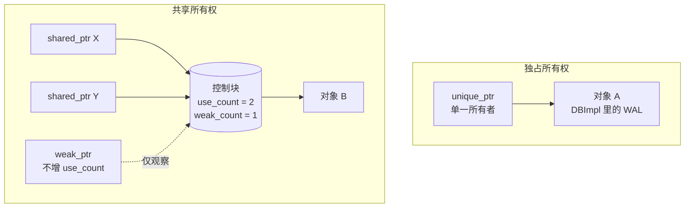

# Module 03 — 现代 C++ 与并发

> 对应源码：[skip_list.h](file:///c:/Users/Administrator/Desktop/hellocpp/minikv/src/core/skip_list.h)、[thread_pool.h](file:///c:/Users/Administrator/Desktop/hellocpp/minikv/src/utils/thread_pool.h)、[lru_cache.h](file:///c:/Users/Administrator/Desktop/hellocpp/minikv/src/utils/lru_cache.h)、[db_impl.h](file:///c:/Users/Administrator/Desktop/hellocpp/minikv/src/core/db_impl.h)

## 背景与动机

如果说 C++ 核心语法是地基，那现代 C++ 与并发就是承重墙。我们见过太多面试翻车现场——简历上写着「熟悉 C++」，一问裸指针就露馅：内存泄漏、双重释放、悬空指针、循环引用，每个坑都踩过一遍却讲不清。这不是因为大家不努力，而是因为裸指针这套心智模型太重，靠人工 review 根本兜不住。智能指针的出现，本质上是把「资源所有权」这件事从运行期错误提升到编译期类型，让你写代码的时候就在做选择题：这个对象是独占、共享、还是只观察？

在 TitanKV 里，这堵「承重墙」承担两件事：一是 `DBImpl` 持有的 WAL/MemTable/Manifest 用 `unique_ptr` 自动释放，二是 SkipList 的并发读写用 `shared_mutex` 兜底。这一模块承上启下——向上接 Module 02 讲过的 RAII 雏形，向下铺 Module 05 跳表实现里会用到的读写锁和 `thread_local` RNG。如果你跳过这一模块直接看跳表，多半会被 `mutable mutex_`、`weak_ptr::lock()` 这些细节绊住。

学完之后，你应该能从容回答这几类面试题：`unique_ptr` 凭什么说零开销、`shared_ptr` 的控制块里到底有什么、`std::move` 之后原对象还能不能用、`shared_mutex` 在什么场景下反而比普通 `mutex` 慢。再往深一层，你能讲清为什么 `condition_variable::wait` 必须配 `unique_lock`、为什么 `volatile` 在多线程里几乎没用——这两条几乎是 C++ 后端面试的必考题。一旦把这套词汇内化成肌肉记忆，你写并发代码会从「小心翼翼」变成「顺手就来」。

## 1. 核心知识

- 智能指针：`unique_ptr`（独占）、`shared_ptr`（共享）、`weak_ptr`（弱引用）；控制块与循环引用。
- 移动语义：右值引用 `T&&`、`std::move`、`std::forward`、移动构造/赋值、`noexcept` 的重要性。
- Lambda：捕获方式、`mutable`、`std::function` 与模板的区别。
- `constexpr` / `constinit` / `consteval`：编译期求值。
- 并发原语：`std::thread`、`mutex`、`lock_guard` / `unique_lock` / `scoped_lock`、`shared_mutex`（读写锁）、`atomic`、`condition_variable`。
- 内存序：`relaxed` / `acquire` / `release` / `acq_rel` / `seq_cst`。
- 虚假唤醒与谓词 wait。

## 2. 内容详解

### 2.1 智能指针

[db_impl.h:39-42](file:///c:/Users/Administrator/Desktop/hellocpp/minikv/src/core/db_impl.h) 用 `std::unique_ptr` 管理 WAL/Manifest/MemTable：

```cpp
std::unique_ptr<WAL>      wal_;
std::unique_ptr<Manifest> manifest_;
std::unique_ptr<MemTable> memtable_;
```

要点：

- `unique_ptr`：独占所有权，不可拷贝、可移动，零开销（大小 = 裸指针，除非自定义删除器）。`DBImpl` 析构时成员自动释放。
- `shared_ptr`：引用计数，控制块含 `use_count`（强）+ `weak_count`（弱），计数为原子操作。
- `weak_ptr`：不增加 `use_count`，解决循环引用。`weak_ptr::lock()` 升级为 `shared_ptr`（若对象已释放返回空）。
- **线程安全粒度**：引用计数本身原子安全；但同一 `shared_ptr` 对象的并发读写**不**安全，需加锁。

三种智能指针的所有权关系用一张图最直观——`unique_ptr` 一根线独占对象，`shared_ptr` 多根线共享同一个控制块，`weak_ptr` 只观察控制块、不延长对象生命：



`weak_ptr::lock()` 会原子地检查 `use_count` 并尝试升级为 `shared_ptr`，这正是它解决循环引用的机制——对象 B 若已释放，`lock()` 返回空 `shared_ptr`，避免悬空访问。

### 2.2 移动语义

[thread_pool.h:22-26](file:///c:/Users/Administrator/Desktop/hellocpp/minikv/src/utils/thread_pool.h) 提交任务时移动：

```cpp
void submit(std::function<void()> task) {
    {
        std::lock_guard<std::mutex> lock(mutex_);
        tasks_.push(std::move(task));   // 移动入队，避免拷贝 std::function
    }
    cv_.notify_one();
}
```

- `std::move(task)` 是无条件的右值转换（`static_cast<T&&>`），本身不移动任何东西；真正的移动发生在 `push` 的右值重载里。
- `std::function` 拷贝可能涉及堆分配（尤其捕获大对象的 lambda），移动只需交换内部指针，O(1)。
- `workerLoop` 里 `task = std::move(tasks_.front())` 同理，出队也用移动。

**`noexcept` 的重要性**：`vector` 扩容时，若元素移动构造非 `noexcept`，标准库为强异常保证会回退到拷贝。因此移动构造应尽量标 `noexcept`。

### 2.3 Lambda

[thread_pool.h:17](file:///c:/Users/Administrator/Desktop/hellocpp/minikv/src/utils/thread_pool.h) 用 lambda 启动 worker：

```cpp
workers_.emplace_back([this] { workerLoop(); });
```

- `[this]` 捕获 `this` 指针，使 lambda 内可访问 `workerLoop`、`tasks_` 等成员。
- 捕获方式：`[]`（无）、`[=]`（按值）、`[&]`（按引用）、`[this]`、`[x, &y]`（混合）。
- `cv_.wait(lock, [this] { return !tasks_.empty() || !running_; })` 是带谓词的 wait，内部等价于 `while(!pred) wait()`，自动处理虚假唤醒。

### 2.4 `constexpr` 编译期求值

`constexpr` 标注的函数/变量可在编译期求值，结果内联到代码，零运行期开销。minikv 中 [skip_list.h:25](file:///c:/Users/Administrator/Desktop/hellocpp/minikv/src/core/skip_list.h) 用 `static constexpr int kMaxLevel = 32;` 定义编译期常量。

C++20 新增 `consteval`（强制编译期求值，不允许运行期调用）与 `constinit`（强制编译期初始化，防止静态初始化顺序问题）。

### 2.5 读写锁 `shared_mutex`

[skip_list.h:39-40](file:///c:/Users/Administrator/Desktop/hellocpp/minikv/src/core/skip_list.h) 的 `put` 用写锁：

```cpp
void put(const std::string& key, const std::string& value) {
    std::unique_lock<std::shared_mutex> lock(mutex_);   // 写锁（独占）
    // ... 修改跳表 ...
}
```

而 `get` 用读锁（见 [skip_list.h:68-69](file:///c:/Users/Administrator/Desktop/hellocpp/minikv/src/core/skip_list.h)）：

```cpp
std::optional<std::string> get(const std::string& key) const {
    std::shared_lock<std::shared_mutex> lock(mutex_);   // 读锁（共享）
    // ... 只读访问 ...
}
```

- `shared_mutex`：读锁（`shared_lock`）可多线程并发持有；写锁（`unique_lock`）独占。
- 适用「读多写少」场景。MemTable 在 flush 前读远多于写，故用读写锁。
- 注意：部分实现偏向读者，可能写者饥饿；写多场景应改用普通 `mutex`。

### 2.6 `atomic` 与内存序

[thread_pool.h:57](file:///c:/Users/Administrator/Desktop/hellocpp/minikv/src/utils/thread_pool.h) 用 `std::atomic<bool> running_`：

```cpp
std::atomic<bool> running_;   // stop() 设 false，worker 轮询
```

- `atomic` 保证操作不可分割，且提供内存序控制。
- 内存序（从弱到强）：
  - `relaxed`：只保证原子，无同步语义（计数器适用）。
  - `acquire`（读）：之后的读写不能重排到该读之前。
  - `release`（写）：之前的读写不能重排到该写之后。
  - `acq_rel`：读改写操作，同时 acquire + release。
  - `seq_cst`（默认）：全局顺序一致，最强但最慢。
- `volatile` **不能**用于多线程同步——它只防编译器优化，不保证原子性也不保证内存序。

### 2.7 `condition_variable` 与虚假唤醒

[thread_pool.h:43-48](file:///c:/Users/Administrator/Desktop/hellocpp/minikv/src/utils/thread_pool.h) 是经典生产者-消费者：

```cpp
std::unique_lock<std::mutex> lock(mutex_);
cv_.wait(lock, [this] { return !tasks_.empty() || !running_; });  // 谓词 wait
if (!running_ && tasks_.empty()) break;
task = std::move(tasks_.front());
tasks_.pop();
```

- **必须用 `unique_lock`** 而非 `lock_guard`：`wait` 内部需要 `unlock`（让生产者入队）+ `relock`，`lock_guard` 不支持手动解锁。
- **谓词 wait** `cv_.wait(lock, pred)` 等价于 `while(!pred) cv_.wait(lock)`，自动循环检查，防御虚假唤醒。
- **虚假唤醒**：OS 可能无端唤醒等待线程，即使条件未满足；若不用谓词而用裸 `wait`，必须手动 `while` 循环。
- `notify_one` 唤醒一个，`notify_all` 唤醒所有。

### 2.8 `mutable` 与 const 成员

[lru_cache.h:56](file:///c:/Users/Administrator/Desktop/hellocpp/minikv/src/utils/lru_cache.h) 的 `mutex_` 声明为 `mutable`：

```cpp
private:
    size_t capacity_;
    mutable std::mutex mutex_;   // const 成员函数也能加锁
```

`get` 是 `const` 成员函数，但要加锁修改 `mutex_`（锁本身是可变状态），`mutable` 允许在 const 函数内修改该成员。这是「逻辑 const vs 物理 const」的经典区分——缓存加锁不改变逻辑可见状态。

### 2.9 `make_unique` / `make_shared`：为什么推荐工厂函数

2.1 里我们看到 `DBImpl` 持有 `std::unique_ptr<WAL> wal_`，但创建这些指针的推荐姿势不是 `unique_ptr<T>(new T(...))`，而是 `std::make_unique<T>(...)`（C++14 起）。原因有三：

```cpp
// 不推荐：两次堆分配 + 异常安全坑
std::shared_ptr<MemTable> p(new MemTable(args));

// 推荐：一次分配 + 异常安全
auto p = std::make_shared<MemTable>(args);
```

- **异常安全**：`func(std::shared_ptr<A>(new A), std::shared_ptr<B>(new B))` 在 C++17 前求值顺序未指定，若 `new A` 成功、`new B` 抛异常，A 就泄漏；`make_shared` 不会有此问题。
- **性能**：`make_shared` 把对象和控制块**一次性分配**（一次 `new`），而 `shared_ptr(new T)` 是两次 `new`，且对象和控制块分居两块内存，缓存不友好。
- **可读性**：`auto p = make_shared<T>(args)` 不重复写 `T`，避免 `shared_ptr<T>(new T(...))` 的类型双写。

`make_unique` 同理（异常安全 + 简洁），但**没有**控制块合并的优化（独占所有权不需要控制块）。

**何时不能用 make**：
- 自定义删除器：`std::unique_ptr<FILE, decltype(&fclose)>` 需直接构造。
- 类的构造函数是 private 且 `make_shared` 不是友元。
- 内存压力大且对象生命周期很长：`make_shared` 把对象和控制块绑在一块内存，对象析构后**控制块内存不会立刻释放**（要等所有 `weak_ptr` 也析构），若此时 `weak_ptr` 长期存活，对象占的内存也跟着挂住。

### 2.10 模板基础：函数模板、类模板、变参模板

模板是 C++ 泛型的根，minikv 里 `SkipList` 就是类模板，`LRUCache` 也是。我们把三类模板一次理清。

**函数模板**：用 `template<typename T>` 前缀，让一个函数处理多种类型。`std::max`、`std::swap` 都是模板。minikv 里写 varint 编解码时，若想同时支持 `uint32_t` 和 `uint64_t`，可以模板化：

```cpp
template<typename T>
inline void encodeVarint(std::string& dst, T val) {
    while (val >= 0x80) {
        dst.push_back(static_cast<char>(val | 0x80));
        val >>= 7;
    }
    dst.push_back(static_cast<char>(val));
}
// 调用：encodeVarint<uint32_t>(dst, 42); 编译器也可推导
```

要点：
- 模板是**编译期代码生成**，实例化几次就生成几份代码，二进制会变大。
- 模板定义通常放头文件（编译器要在使用点看到完整定义才能实例化）。
- **显式特化**：`template<> void encodeVarint<uint8_t>(std::string&, uint8_t)` 可为特定类型写专门版本。
- **SFINAE** 与 C++17 `if constexpr`：编译期按类型选择分支，避免无效实例化。

**类模板**：`SkipList<K>` 是典型，类型参数 `K` 是 key 类型：

```cpp
template<typename Key, typename Value>
class SkipList {
public:
    void put(const Key& k, const Value& v);
    std::optional<Value> get(const Key& k) const;
private:
    struct Node { Key key; Value value; /* ... */ };
    static constexpr int kMaxLevel = 32;
};
// 使用：SkipList<std::string, std::string> table;
```

- 类模板的成员函数默认是模板，定义放头文件。
- 类模板可以有默认参数：`template<typename T = std::string>`。
- C++17 类模板实参推导（CTAD）：`SkipList table;`（若构造函数能推导出 Key/Value）。

**变参模板（variadic template）**：用 `typename... Args` 接收任意个数参数，是 `std::make_shared`、`std::tuple`、`printf` 安全替代的基础：

```cpp
template<typename... Args>
auto make_status(Args&&... args) {
    return Status(std::forward<Args>(args)...);   // 完美转发
}
```

- `Args...` 是「参数包」，`args...` 是展开。
- `sizeof...(Args)` 求参数个数。
- **折叠表达式**（C++17）：`(args + ...)` 把包按运算符折叠。
- `std::forward<Args>(args)...` 完美转发：保持实参的左右值性，是模板转发的标准姿势（与 Module 2.2 的 `std::move` 配对记忆：move 强制转右值，forward 按实参原本的值类别转发）。

模板进阶（特化、偏特化、概念约束）在 TitanKV 里用得不多，我们点到为止。读到 `SkipList`、`LRUCache`、`std::function<void()>` 这些模板化代码时，你能讲清「实例化、推导、转发」三件事就够了。

## 3. 思考题

1. `unique_ptr` 为什么是「零开销」？它和裸指针在大小上有何差异？何时会有额外开销？
2. `std::move` 之后原对象处于什么状态？还能用吗？
3. SkipList 用 `shared_mutex` 读写锁，如果改成普通 `mutex`，在什么场景下反而更快？
4. `cv_.wait(lock, pred)` 与 `while(!pred) cv_.wait(lock)` 等价吗？为什么推荐前者？
5. `atomic<bool>` 默认 `seq_cst`，`ThreadPool::stop()` 把 `running_` 设 false 用 `relaxed` 行不行？为什么？

## 4. 动手题

### 题 4.1（手撕读写锁版 SkipList，LeetCode 1206 进阶）

参考 [skip_list.h](file:///c:/Users/Administrator/Desktop/hellocpp/minikv/src/core/skip_list.h)，实现一个线程安全跳表：`put` 用写锁，`get`/`entries` 用读锁。用 10 个线程各插入 10000 个 key 验证无竞争。

### 题 4.2（线程池扩展，对应 [thread_pool.h](file:///c:/Users/Administrator/Desktop/hellocpp/minikv/src/utils/thread_pool.h)）

在现有 `ThreadPool` 基础上添加：

1. `submit` 返回 `std::future<T>`（提示：用 `std::packaged_task`）。
2. 有界队列（最大 N 个任务），满时按「调用者执行」策略。
3. 优雅关闭：`stop()` 后仍执行完队列中剩余任务。

### 题 4.3（无锁 SPSC 队列）

实现一个单生产者单消费者无锁环形队列，用 `atomic` + `acquire/release`。要求 `alignas(64)` 避免 false sharing。写测试验证 100 万次 push/pop 无数据错乱。

## 5. 自检

1. `unique_ptr` 是____（独占/共享）所有权，`shared_ptr` 是____所有权。
2. `std::move` 本质是____________，不移动任何数据。
3. `shared_mutex` 的读锁用____，写锁用____。
4. `condition_variable::wait` 必须配合____（lock_guard/unique_lock），因为 wait 需要____。
5. `volatile` ____（能/不能）用于多线程同步，因为它不保证____和____。

<details>
<summary>参考答案</summary>

1. 独占；共享
2. 无条件的右值转换（static_cast<T&&>）
3. shared_lock；unique_lock
4. unique_lock；unlock+relock
5. 不能；原子性；内存序

思考题要点：
1. 大小通常等于裸指针（无自定义删除器时）；带自定义删除器时 unique_ptr 需额外存删除器（可能占 16 字节）。零开销指运行期无引用计数等额外成本。
2. 处于「有效但未指定」状态，通常资源已被搬走（如指针置空）；可安全析构或重新赋值，但不应读取其值。
3. 写多读少或读写相当的场景下，普通 mutex 一次只让一个线程进，避免读写锁的升级开销和写者饥饿，可能更快。
4. 等价。前者更推荐是因为代码简洁且不易遗漏循环。
5. 行。`running_` 只用作一次性停止标志，无其他数据依赖它建立 happens-before（任务同步靠 mutex/cv），用 relaxed 足够。

</details>

---

← [Module 02](./02-cpp-core.md)  |  下一模块：[Module 04 — Go 与 TypeScript 基础](./04-go-ts.md) →
