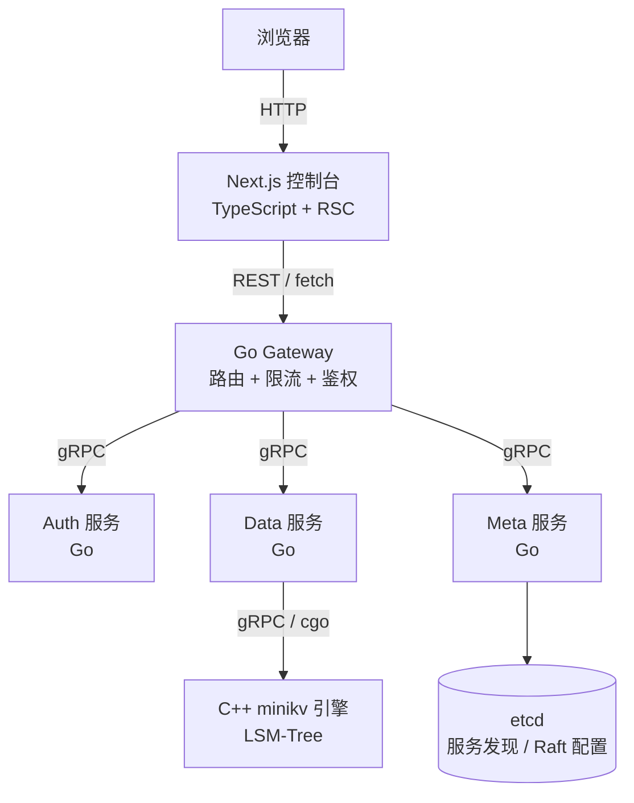

# Module 04 — Go 与 TypeScript 基础

> 对应规划：[go.mod](file:///c:/Users/Administrator/Desktop/hellocpp/go.mod)（`github.com/titan-kv/titan`）、REFACTORING.md Phase 3-6（gateway/services/web）

## 背景与动机

讲到这一模块，常有同学会反问：「既然 C++ 性能这么好，为什么不全部用 C++ 写完？」我们的答案很务实：写网关、写认证、写限流中间件这些活，用 C++ 是自找罪受——没有 GC、没有反射、没有标准化的 HTTP/gRPC 框架，开发效率被 Go 甩开好几倍。分布式存储的真正瓶颈往往不在网关层，而在底层的 IO 和数据结构；把上层让给 Go，把性能留给 C++，这是工业界反复验证过的分工。Postgres、CockroachDB、TiDB 都是这套思路，TitanKV 也照搬过来。

这一模块在 TitanKV 课程里是「上层服务层」的总入口：Module 02-03 打好了 C++ 这一头，Module 04 把 Go 和 TypeScript 这两头接上——Go 通过 gRPC 调 C++ 引擎，Next.js 通过 HTTP 调 Go 网关。三层之间的协议、错误传递、并发模型各有各的语言风格，我们在这里把它们摆在一起看，你才能理解「跨语言协作」到底协作在哪里。顺便也回答一个常见疑问：为什么前端非用 TypeScript 不可——因为大型前端项目没有静态类型，重构一次就敢崩三处。

学完之后，你应该能讲清这几件事：为什么 goroutine 比 `std::thread` 轻、Go 的隐式接口和 C++ 虚函数各有什么取舍、gRPC 相比 REST 在内部 RPC 上的优势、Next.js 服务端组件为什么默认不发 JS 到浏览器。这些题在后端/全栈面试里几乎是标配，而 TitanKV 这套三层架构正好把它们串成一条线。TitanKV 的三层架构就是这套思路的样本，看完这一节你会知道每层各自的语言该怎么挑。

## 1. 核心知识

- Go 语言定位：为后端微服务而生，原生并发（goroutine + channel）、静态编译、跨平台单文件部署。
- Go 并发三件套：`goroutine`（`go f()`）、`channel`（`chan T`）、`select`；CSP 通信顺序进程模型。
- Go 接口：隐式实现（鸭子类型），`error` 是普通接口，惯用 `(T, error)` 多返回值。
- gRPC + Protobuf：跨语言 RPC，强类型 IDL，双向流；TitanKV 用其打通 Go 网关 ↔ C++ 存储引擎。
- TypeScript：JavaScript 的超集 + 静态类型，`type` / `interface` / 泛型。
- Next.js App Router：React 服务端组件（RSC）、文件即路由、Server Actions、TanStack Query 数据获取。

## 2. 内容详解

### 2.1 为什么 TitanKV 用 Go 做业务层

架构分工（来自 [README.md](file:///c:/Users/Administrator/Desktop/hellocpp/README.md)）：

- **C++ 存储引擎**（minikv）：追求极致性能，零开销、内存可控。
- **Go 微服务**（gateway/services）：追求开发效率与并发表达力，gRPC 串联。

Go 的优势在此场景：

- goroutine 极轻量（~2KB 栈 vs C++ 线程 ~1MB），百万并发无压力。
- `net/http` + `google.golang.org/grpc` 生态成熟，写网关/认证/限流中间件快。
- 静态编译单二进制，容器镜像小、部署简单。
- 与 C++ 通过 cgo 或 gRPC 互通（Phase 2 计划）。

把上面这些点画成一张调用链路图，三种语言的分工就一目了然——TypeScript 管前端展示，Go 管业务编排，C++ 管数据落盘，每两跳之间都有清晰的协议边界：



可以看到 Go 在这张图里是「中间层枢纽」——向上对前端用 REST/HTTP，向下对引擎用 gRPC， sideways 用 etcd 做服务发现。这种「语言切换发生在协议边界」的设计，正是 TitanKV 选三套语言的核心理由。

### 2.2 goroutine 与 channel

```go
// 生产者-消费者（对比 Module 03 的 C++ ThreadPool）
func producer(ch chan<- int) {
    for i := 0; i < 100; i++ { ch <- i }
    close(ch)
}
func consumer(ch <-chan int, done chan<- struct{}) {
    for v := range ch { fmt.Println(v) }
    done <- struct{}{}
}
func main() {
    ch := make(chan int, 10)            // 带缓冲 channel
    done := make(chan struct{})
    go producer(ch); go consumer(ch, done)
    <-done                              // 阻塞等待完成
}
```

要点：

- `go f()` 启动 goroutine，由 Go runtime 调度（M:N 用户态调度，抢占式）。
- `chan T` 是并发安全的 FIFO 队列；带缓冲 channel 类似有界阻塞队列。
- `range ch` 持续接收直到 channel 被 `close`。
- `select { case ...: }` 多路复用 channel，类似 epoll 但用于 channel。
- 对比 C++：C++ 需要 `mutex + condition_variable` 手搓，Go 用 channel 一行搞定，但 channel 有运行时开销。

### 2.3 接口与错误处理

```go
type Storage interface {
    Get(ctx context.Context, key string) (string, error)
    Put(ctx context.Context, key, val string) error
}

type Engine struct{ db *C.DBImpl }   // cgo 包装或 gRPC client
func (e *Engine) Get(ctx context.Context, key string) (string, error) {
    val, err := e.db.Get(key)
    if err != nil { return "", fmt.Errorf("get %q: %w", key, err) }
    return val, nil
}
```

- 接口**隐式实现**：`Engine` 实现了 `Get`/`Put` 方法即满足 `Storage`，无需 `implements` 声明。
- 错误是值：`(T, error)` 多返回值；`fmt.Errorf("%w", err)` 包裹错误形成错误链，`errors.Is`/`errors.As` 解包。
- `context.Context` 贯穿调用链，支持超时、取消、传值——微服务必备。

### 2.4 gRPC + Protobuf

TitanKV 计划在 `proto/keyforge/storage.proto` 定义 Put/Get/Delete/Scan 接口（见 REFACTORING.md Phase 2）。示例：

```protobuf
service Storage {
  rpc Put(PutRequest) returns (PutResponse);
  rpc Get(GetRequest) returns (GetResponse);
  rpc Scan(ScanRequest) returns (stream ScanEntry);   // 服务端流
}
message PutRequest { bytes key = 1; bytes value = 2; }
```

- Protobuf 是二进制 IDL，比 JSON 更小更快，强类型。
- gRPC 基于 HTTP/2 多路复用，支持一元/服务端流/客户端流/双向流四种调用。
- `protoc` 生成 Go 与 C++ 桩代码，两端用同一份 proto 保证协议一致。

### 2.5 TypeScript 类型系统

```typescript
type Collection = {
  id: string;
  name: string;
  createdAt: Date;
  settings: { shards: number; replication: number };
};

interface CollectionRepo {
  list(): Promise<Collection[]>;
  create(input: Omit<Collection, 'id' | 'createdAt'>): Promise<Collection>;
}
```

- `type` vs `interface`：`interface` 可声明合并，`type` 支持联合/交叉/条件类型；日常二者皆可。
- 工具类型：`Omit`/`Pick`/`Partial`/`Record` 减少重复定义。
- 类型只在编译期存在，编译后擦除（与 C++ 模板类似但更轻）。

### 2.6 Next.js App Router

TitanKV 控制台（Phase 6）规划用 Next.js 15 App Router + Tailwind + shadcn/ui + TanStack Query。目录即路由：

```
web/app/
├── layout.tsx           根布局
├── page.tsx             首页（仪表盘）
├── data/page.tsx        /data 数据浏览器
├── collections/page.tsx /collections
└── api/                 路由处理器（BFF）
```

- **服务端组件（RSC）**：默认在服务端渲染，可直连数据库，无 JS 发到客户端。
- **客户端组件**：`'use client'` 指令，用于交互（useState、事件）。
- **TanStack Query**：客户端数据缓存、失效、乐观更新；与服务端组件互补。

### 2.7 Go 语言基础：变量、类型、控制流、函数、`defer`

上面讲了 goroutine/channel 这套并发心脏，但读 TitanKV 的 Go 代码你还得先过基础语法关。我们用最小篇幅把 Go 最常用的货色过一遍。

**变量声明**有三种姿势，按场景挑：

```go
var a int           // 零值初始化（a = 0），显式类型
var b = 42          // 类型推断（b 是 int）
c := "hello"        // 短变量声明（函数内专用），最常用
var d, e int = 1, 2 // 多变量
```

`:=` 只能在函数内用；包级变量必须用 `var`。Go 没有「未初始化」——所有变量有**零值**（int 是 0、string 是 `""`、指针是 `nil`、slice 是 `nil`），不会像 C++ 那样读到垃圾值。

**基本类型**：

```go
var s string = "key"
var i int = 100              // 平台相关宽度，通常 64 位
var u uint64 = 1 << 40
var f float64 = 3.14
var ok bool = true
nums := []int{1, 2, 3}       // slice（变长数组）
m := map[string]int{"a": 1}  // map（哈希表）
type Pair struct { K, V string }
p := Pair{K: "x", V: "y"}
```

- `slice` 是 `([]T, len, cap)` 三元组，`append` 可能重新分配底层数组——这跟 C++ `std::vector` 类似但**没有迭代器失效警告**，靠纪律。
- `map` 是哈希表，遍历顺序随机（Go 故意打乱以防依赖顺序）。
- `struct` 是值类型，赋值是拷贝；要共享就传指针 `*Pair`。

**控制流**——Go 把流程控制砍到极简：

```go
// if：条件不加括号，但花括号必填
if err != nil { return err }

// for：唯一循环关键字，当 while 用也行
for i := 0; i < 10; i++ { /* C 风格 */ }
for n > 0 { n-- }              // 当 while 用
for range nums { /* index */ } // 遍历
for i, v := range nums { /* i 索引, v 值 */ }

// switch：默认 break，不穿透（除非 fallthrough）
switch s {
case "GET", "HEAD": handleRead()
case "POST": handleWrite()
default: NotFound()
}

// select：多路复用 channel（见 2.2）
select {
case v := <-ch: fmt.Println(v)
case <-time.After(time.Second): fmt.Println("timeout")
}
```

**函数**：多返回值、闭包、`defer` 三件套：

```go
// 多返回值：Go 错误处理的基础
func Get(key string) (string, error) {
    if key == "" { return "", errors.New("empty key") }
    return "val", nil
}

// 闭包：捕获外层变量
func counter() func() int {
    n := 0
    return func() int { n++; return n }
}

// defer：函数返回前执行，常用于资源释放
func readFile(path string) error {
    f, err := os.Open(path)
    if err != nil { return err }
    defer f.Close()           // 无论怎么 return 都会关
    // ... 读文件 ...
    return nil
}
```

- `defer` 按 LIFO 顺序执行（栈），多个 defer 反向出栈。
- `defer` 的实参在 defer 语句处求值，不是真正执行时——这是高频面试坑。
- 多返回值让 Go 不用异常也能优雅传递错误，配合 `if err != nil` 是社区惯例。

### 2.8 Go 包管理、`panic`/`recover`、`sync` 补遗

**包管理**用 `go mod`，TitanKV 的 [go.mod](file:///c:/Users/Administrator/Desktop/hellocpp/go.mod) 声明模块路径 `github.com/titan-kv/titan`：

```
module github.com/titan-kv/titan
go 1.22
require (
    google.golang.org/grpc v1.62.0
    github.com/redis/go-redis/v9 v9.5.0
)
```

- `go mod init <module>` 初始化，`go get <pkg>` 加依赖，`go mod tidy` 清理。
- import 路径就是模块路径 + 子目录：`import "github.com/titan-kv/titan/internal/gateway"`。
- 大写开头是导出（`Get`），小写开头是包内私有（`get`）——这条规则替代了 `public`/`private` 关键字。

**`panic` / `recover`**：Go 不用异常做常规错误处理，但 `panic` 用于「不该发生的不可恢复错误」（类似 `assert` 失败）：

```go
func mustGet(key string) string {
    v, ok := data[key]
    if !ok { panic("key must exist: " + key) }
    return v
}

// recover 只在 defer 里有效，捕获 panic 让程序不崩
func safeRun(f func()) (err error) {
    defer func() {
        if r := recover(); r != nil {
            err = fmt.Errorf("panic: %v", r)
        }
    }()
    f()
    return nil
}
```

社区惯例：库代码**不**该 panic 给调用方，应该返回 error；只有「初始化失败就该挂」或「不变量被破坏」才 panic。

**`sync` 包补遗**：除了 channel，Go 也有显式锁：

```go
var mu sync.Mutex
mu.Lock(); defer mu.Unlock()

var wg sync.WaitGroup
for i := 0; i < 10; i++ {
    wg.Add(1)
    go func() { defer wg.Done(); work() }()
}
wg.Wait()   // 等所有 goroutine 完成
```

`sync.WaitGroup` 是「等一批 goroutine 结束」的标准姿势，对应 C++ 的 `barrier`；`sync.Mutex` 就是普通互斥锁。Go 的口号是「不要通过共享内存通信，而要通过通信共享内存」，但真要共享内存时 `sync` 一点也不少用。

### 2.9 TypeScript 类型系统补全：联合/交叉类型、泛型、枚举、类型守卫

2.5 讲了 `type` vs `interface` 和工具类型，这里把剩下的基础补齐。

**联合类型与可选属性**：联合类型是 TS 表达「多种可能」的核心：

```typescript
type ID = string | number;          // 联合：ID 可以是 string 或 number
type Response =
  | { status: 'ok'; data: Collection[] }   // 可辨识联合
  | { status: 'error'; message: string };

type User = {
  id: string;
  name: string;
  email?: string;                   // 可选属性（email 可能 undefined）
  role: 'admin' | 'viewer' | 'editor';  // 字面量联合
};
```

- 联合类型用 `|`，交叉类型用 `&`（取并集）：
  ```typescript
  type Timestamps = { createdAt: Date; updatedAt: Date };
  type NamedEntity = { id: string; name: string };
  type Record = NamedEntity & Timestamps;   // 三个字段都有
  ```
- 可选属性 `?` 等价于 `field: T | undefined`，但严格模式下 `undefined` 要显式区分。
- 可辨识联合（discriminated union）是 TS 模拟「标签枚举」的标准模式，配合类型守卫很好用。

**泛型基础**：跟 C++ 模板神似但更轻（编译期擦除）：

```typescript
function getOrDefault<K>(map: Map<K, string>, key: K, def: string): string {
  return map.get(key) ?? def;
}

interface Repo<T> {
  get(id: string): Promise<T | null>;
  list(): Promise<T[]>;
  create(input: Omit<T, 'id'>): Promise<T>;
}

class CollectionRepo implements Repo<Collection> { /* ... */ }
```

- 泛型约束：`<T extends { id: string }>` 限制 T 必须有 id 字段。
- 泛型默认值：`<T = string>` 调用时不传默认是 string。

**枚举**：分数字枚举和字符串枚举：

```typescript
enum ShardStatus {
  Healthy = 'HEALTHY',
  Degraded = 'DEGRADED',
  Offline = 'OFFLINE',
}
// 字符串枚举更安全，调试时打印可读
```

注意：`enum` 会生成运行时代码（不是纯类型），追求零运行时开销可用 `as const` 对象替代：

```typescript
const ShardStatus = { Healthy: 'HEALTHY', Degraded: 'DEGRADED' } as const;
type ShardStatus = typeof ShardStatus[keyof typeof ShardStatus];
```

**类型守卫**：在联合类型里「收窄」出具体分支：

```typescript
function handle(resp: Response) {
  if (resp.status === 'ok') {
    console.log(resp.data);   // TS 知道这里 resp 是 { status:'ok'; data:... }
  } else {
    console.log(resp.message); // TS 知道这里 resp 是 { status:'error'; message:... }
  }
}

// typeof：区分原始类型
function len(x: string | string[]) {
  if (typeof x === 'string') return x.length;
  return x.length;
}

// instanceof：区分类实例
if (err instanceof ValidationError) { /* ... */ }

// in：区分有某属性的对象
if ('code' in err) { console.log(err.code); }
```

类型守卫是 TS 把「运行时检查」和「编译时类型」绑在一起的关键——检查通过后，TS 在该分支内自动收窄类型，免得你手动断言。

### 2.10 React 基础：函数组件、Props、`useState`、`useEffect`

TitanKV 控制台用 Next.js（基于 React），这里把 React 函数组件和最常用的两个 Hook 过一遍。

**函数组件 + Props**：现代 React 不用 class 了，一切是函数：

```tsx
type ShardCardProps = {
  shard: { id: string; qps: number; latency: number };
  onRefresh?: () => void;          // 可选回调
};

function ShardCard({ shard, onRefresh }: ShardCardProps) {
  return (
    <div className="card">
      <h3>分片 {shard.id}</h3>
      <p>QPS: {shard.qps} · 延迟: {shard.latency}ms</p>
      {onRefresh && <button onClick={onRefresh}>刷新</button>}
    </div>
  );
}
```

- 组件名首字母大写（`ShardCard`），否则 React 当 HTML 标签。
- Props 是只读的，组件内绝不能改 `shard` 本身；要交互就用 state。
- `children` prop 让组件可嵌套：`function Card({ children }: { children: React.ReactNode })`。

**`useState`**：组件内的可变状态，触发重渲染：

```tsx
function Counter() {
  const [count, setCount] = useState<number>(0);   // 泛型指定类型
  return <button onClick={() => setCount(c => c + 1)}>点击 {count}</button>;
}
```

- `useState` 返回 `[当前值, setter]` 二元组。
- setter 接受新值或函数 `prev => next`（推荐函数式，避免闭包读到旧 state）。
- 状态更新是异步批量的，连续 `setCount` 不会立刻反映。

**`useEffect`**：处理副作用（订阅、定时器、数据请求）：

```tsx
function useShardMetrics(id: string) {
  const [metrics, setMetrics] = useState<Metrics | null>(null);

  useEffect(() => {
    let cancelled = false;
    fetch(`/api/shards/${id}/metrics`)
      .then(r => r.json())
      .then(m => { if (!cancelled) setMetrics(m); });
    return () => { cancelled = true; };   // 清理函数：组件卸载或 id 变化时跑
  }, [id]);                               // 依赖数组：仅 id 变化时重新执行

  return metrics;
}
```

- 第二个参数是**依赖数组**：`[]` 只跑一次（挂载时），`[id]` 在 id 变化时重跑，省略则每次渲染都跑（通常不是你想要的）。
- 返回的清理函数在组件卸载或下次 effect 跑之前执行，用来取消订阅、清定时器——**忘记清理是最常见的内存泄漏来源**。
- 服务端组件里**不能**用 `useState`/`useEffect`，要用它们必须 `'use client'`。

读 TitanKV 控制台代码时，记住这条心智：**服务端组件取数据，客户端组件管交互**，两者用 props 串联。

## 3. 思考题

1. goroutine 和 C++ 的 `std::thread`、`std::coroutine` 各有什么本质区别？
2. Go 用 `channel` 传递所有权，C++ 用 `std::move` 转移所有权，二者哲学上有何异同？
3. Go 的接口是隐式实现，相比 C++ 的显式虚函数继承，优势和劣势各是什么？
4. gRPC 相比 REST+JSON 在 TitanKV 这种内部服务间通信中有什么优势？什么场景下反而该用 REST？
5. Next.js 服务端组件默认不发送 JS 到客户端，这对仪表盘这种实时数据页面意味着什么？何时必须切到客户端组件？

## 4. 动手题

### 题 4.1（Go 并发限流器）

用 `time.Ticker` + `chan struct{}` 实现一个令牌桶限流器：`Allow() bool`，每秒发放 N 个令牌。用 1000 个 goroutine 并发请求验证限流效果。

### 题 4.2（gRPC 最小示例）

定义 `proto/storage.proto`（Put/Get），用 `protoc-gen-go` + `protoc-gen-go-grpc` 生成桩代码，写一个 server 和 client，实现内存 map 后端。运行通一次 Put/Get。

### 题 4.3（Next.js 仪表盘骨架）

用 `npx create-next-app@latest` 创建项目（App Router + TypeScript + Tailwind），做一个 `/dashboard` 页面：用服务端组件 fetch 假数据，渲染 QPS/延迟卡片；点击「刷新」用客户端组件 + TanStack Query 重新拉取。

## 5. 自检

1. Go 启动 goroutine 的关键字是____，调度模型是____（M:N / 1:1）。
2. 带缓冲 channel 满 时发送方____，空 时接收方____。
3. Go 接口实现是____（显式/隐式），错误以____形式返回。
4. gRPC 基于____协议，支持____种调用模式。
5. Next.js App Router 中____（服务端/客户端）组件默认不发送 JS 到浏览器。

<details>
<summary>参考答案</summary>

1. `go`；M:N
2. 阻塞；阻塞
3. 隐式；值（`(T, error)`）
4. HTTP/2；四（一元、服务端流、客户端流、双向流）
5. 服务端

思考题要点：
1. `std::thread` 是 1:1 内核线程，开销大；`std::coroutine` 是协作式无栈协程，需手写调度器；goroutine 是 M:N 抢占式有栈协程，runtime 调度，自带运行时。
2. channel 是运行时同步原语（带锁/调度），move 是编译期语义转换；channel 隐式传递所有权且阻塞同步，move 零开销但不同步。哲学上：Go 鼓励「通过通信共享内存」，C++ 鼓励「通过共享内存通信」。
3. 优势：解耦、易 mock、组合灵活；劣势：隐式导致实现关系不直观、重构难追踪、接口满意度需工具辅助检查。
4. 优势：二进制更小、强类型、HTTP/2 多路复用低延迟、流式；REST 适合对外的、需浏览器/curl 直接访问的、需缓存（HTTP 语义）的场景。
5. 意味着首屏快、SEO 好、bundle 小；但实时数据需轮询/SSE/WebSocket，必须切到客户端组件（`'use client'`）使用 hooks。

</details>

---

← [Module 03](./03-modern-cpp.md)  |  下一模块：[Module 05 — 跳表与有序结构](./05-skiplist.md) →
