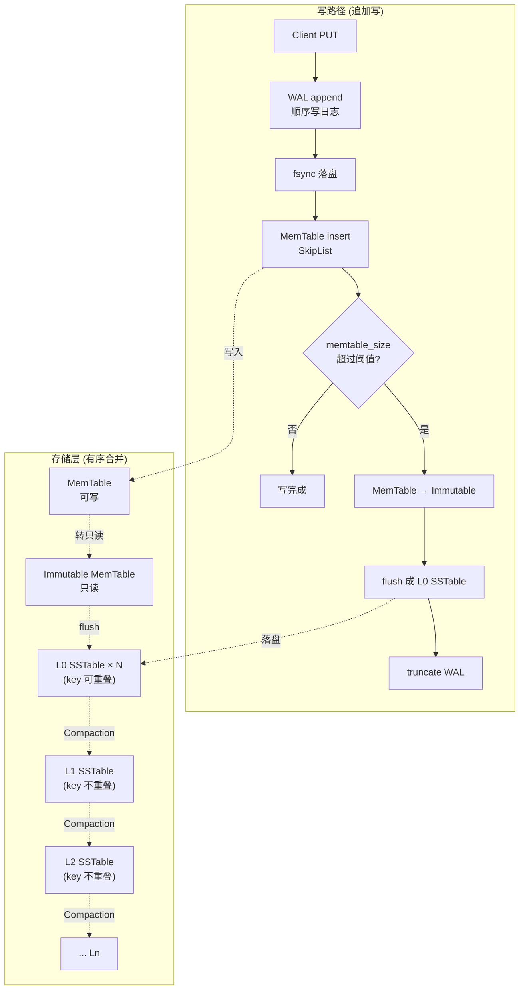
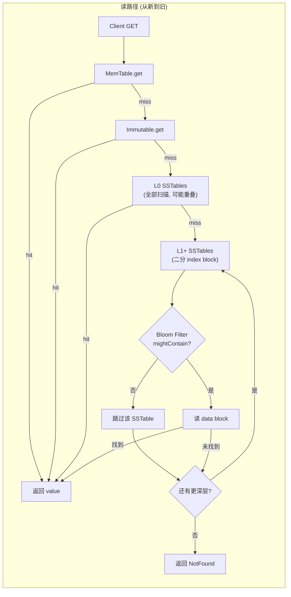

# Module 07 — LSM-Tree 存储引擎

> 对应源码：[db_impl.cpp](file:///c:/Users/Administrator/Desktop/hellocpp/minikv/src/core/db_impl.cpp)、[wal.h](file:///c:/Users/Administrator/Desktop/hellocpp/minikv/src/core/wal.h)、[sstable_builder.h](file:///c:/Users/Administrator/Desktop/hellocpp/minikv/src/core/sstable_builder.h)、[memtable.h](file:///c:/Users/Administrator/Desktop/hellocpp/minikv/src/core/memtable.h)

## 背景与动机

我们在 Module 03 里用跳表把 MemTable 跑了起来，但一个真正的存储引擎远不止内存里那点数据——数据要落盘、要能崩溃恢复、要支持范围扫描、还要在百万级 key 下保持稳定延迟。这时候如果还用 B+ 树，写一条 KV 就得随机 IO 改页、还要页分裂，机械盘上延迟直接飙到十毫秒级，SSD 寿命也被随机写磨得很快。写密集场景下，B+ 树这套「就地更新」的模型就显得力不从心了。

这就是 LSM-Tree（Log-Structured Merge-Tree）登场的舞台。它的核心思想很反直觉：写不改旧数据，只追加到内存的 MemTable，满了再顺序 flush 成 SSTable；读的时候从新到旧层层查，靠 Compaction 在后台合并整理。这个「写快读慢」的权衡源自 1996 年 O'Neil 等人的论文，被 Bigtable、LevelDB、RocksDB、Cassandra、TiKV 一脉相承地发扬光大。它用读放大和空间放大换来了惊人的写吞吐——而我们的 minikv 正是这条 lineage 的一个教学版缩影。

学完这一模块，你应该能在面试里把 LSM-Tree 讲得有理有据：写路径 WAL → MemTable → SSTable 的顺序为什么不能乱、`fsync` 到底保证了什么、SSTable 的文件格式为什么这样设计、读路径怎么用 Bloom Filter 减少磁盘 IO。更重要的是，你会理解为什么 TiKV 选 LSM 而不是 B+ 树——「缓存提升读性能比提升写性能容易」这句话，是整个 LSM 阵营的设计哲学。

## 1. 核心知识

- LSM-Tree（Log-Structured Merge-Tree）：追加写 + 有序合并，用读放大 + Compaction 换写吞吐。
- 三大放大：写放大（WA）、读放大（RA）、空间放大（SA），三者不可同时最优。
- 写路径：`Put → WAL append → MemTable(SkipList) insert → 满则 flush 成 SSTable`。
- 读路径：`MemTable → Immutable → L0(重叠) → L1..Ln(不重叠) + Bloom Filter 过滤`。
- SSTable 文件格式：data block / index block / filter block(BF) / footer。
- WAL 先写日志原则 + fsync 持久性边界 + 崩溃恢复重放。

## 2. 内容详解

### 2.1 LSM-Tree vs B+Tree

| 维度 | LSM-Tree | B+Tree |
|---|---|---|
| 写 | 追加写（顺序 IO），写放大小 | 就地更新（随机 IO），页分裂 |
| 读 | 多层查找，读放大高 | O(log_B N) 次磁盘读，读放大小 |
| 空间 | 旧版本待 Compaction 回收，空间放大中 | 页内紧凑，空间放大小 |
| 适用 | 写多读少、海量数据（TiKV/RocksDB/Cassandra） | 读多写少（MySQL/Postgres） |

TiKV 选 LSM 的核心理由：**缓存提升读性能比提升写性能容易**（热数据在 BlockCache，冷读走多层的概率低）。

#### LSM-Tree 整体架构





### 2.2 写路径详解

[db_impl.cpp:88-116](file:///c:/Users/Administrator/Desktop/hellocpp/minikv/src/core/db_impl.cpp) 的 `write`：

```cpp
Status DBImpl::write(const WriteOptions& opts, const WriteBatch& batch) {
    std::lock_guard<std::mutex> lock(write_mutex_);          // 串行化写
    uint64_t currentSeq = seq_.fetch_add(batch.count());     // 分配序列号
    for (const auto& op : batch.ops()) {
        uint64_t opSeq = ++currentSeq;
        memtable_->put(Slice(op.key), Slice(op.value), opSeq, isDel);  // 写 MemTable
    }
    if (wal_) {
        // 编码 batch 为 [type(1)][keyLen(4)][valLen(4)][key][value]...
        wal_->append(Slice(data));
        if (options_.wal_sync && opts.sync) wal_->sync();    // fsync 持久化
    }
    maybeFlush();                                            // 满则刷盘
    return Status::Ok();
}
```

关键点：

1. **`write_mutex_` 串行化写**：保证序列号分配 + MemTable 写入原子。这是简化的 group-commit；生产级 RocksDB 用 `WriteThread` 批量合并。
2. **序列号 `seq_`**：原子自增，每个 op 一个唯一 seq，供 MVCC 快照读（Module 08）。
3. **先写 WAL 再写 MemTable**？注意 minikv 这里**先 MemTable 后 WAL**——这是简化实现，严格 WAL 应先写日志再写内存。但 MemTable 写内存极快，崩溃概率低；生产引擎严格遵循「先 WAL 后内存」。
4. **`fsync` 是持久性边界**：`wal_->sync()` 调 `fdatasync(fd)`，强制内核页缓存落盘。`write()` 只写到页缓存，崩溃会丢。
5. **`maybeFlush`**：MemTable 超过 `options_.memtable_size` 时转 Immutable 并 flush 成 L0 SSTable。

### 2.3 WAL 机制

[wal.h](file:///c:/Users/Administrator/Desktop/hellocpp/minikv/src/core/wal.h) 接口：

```cpp
class WAL {
public:
    explicit WAL(const std::string& path);
    Status append(const Slice& data);     // 追加写
    Status sync();                        // fsync 落盘
    std::vector<std::string> replay();    // 崩溃恢复重放
    Status truncate();                    // 清空（MemTable flush 后）
};
```

**WAL 原则**：修改数据页前，先把修改记录追加到 WAL 并落盘。崩溃后重启重放 WAL 重建内存状态。

minikv 的 `recover()`（[db_impl.cpp:45-74](file:///c:/Users/Administrator/Desktop/hellocpp/minikv/src/core/db_impl.cpp)）：

1. 打开 Manifest，恢复 Version（哪些 SSTable 存在）。
2. `wal_->replay()` 读全部 WAL 记录。
3. 逐条解码 `[type][keyLen][valLen][key][value]`，重新插入 MemTable，递增 seq。

**Checkpoint**：记录「已刷盘的 WAL 位置」，崩溃恢复只需重放 Checkpoint 之后的部分。minikv 简化为 flush 后 `truncate()` 整个 WAL。

### 2.4 SSTable 文件格式

[sstable_builder.h:14-41](file:///c:/Users/Administrator/Desktop/hellocpp/minikv/src/core/sstable_builder.h) 注释详尽：

```
/-----------------------------\
| data block #0               |   每块: [crc(4)]
|   ...                       |        [physical_size(4)]
| data block #N               |        [uncompressed_size(4)]
| index block                 |        [type(1) = CompressionType]
| footer (48 bytes)           |        [payload(physical_size)]
\-----------------------------/

Footer (48 字节):
  8 bytes : index_offset
  8 bytes : index_size
  1 byte  : format_version (当前 = 1)
  1 byte  : reserved
 30 bytes : reserved padding
  8 bytes : magic (0x4D4B53535441424C)
```

要点：

- **data block**：有序 KV，块大小默认 4KB。块头 13 字节含 CRC + 物理/未压缩大小 + 压缩类型，支持 Snappy/Zstd。
- **index block**：每个 data block 的最大 key + 偏移，二分定位 data block。
- **filter block**：Bloom Filter（基于 user_key），读前过滤。
- **footer**：定长 48 字节，含 magic number 防误读、format_version 支持演进。
- **不可变**：SSTable 写入后不再修改，便于并发读 + mmap。

### 2.5 MemTable flush 流程

`maybeFlush` → `flushMemTable`（见 [db_impl.h:34](file:///c:/Users/Administrator/Desktop/hellocpp/minikv/src/core/db_impl.h)）：

1. 当前 MemTable 转为 Immutable MemTable（只读）。
2. 新建空 MemTable 接收后续写。
3. 用 `SSTableBuilder` 把 Immutable 的有序 entries（SkipList 迭代）写成 L0 SSTable。
4. 注册到 Version，记录到 Manifest。
5. `wal_->truncate()`（新 WAL 对应新 MemTable）。

L0 SSTable 间 key **可能重叠**（多次 flush），L1+ 层内不重叠（Compaction 保证）。

### 2.6 读路径详解

[db_impl.cpp:118-120](file:///c:/Users/Administrator/Desktop/hellocpp/minikv/src/core/db_impl.cpp)：

```cpp
Status DBImpl::get(const ReadOptions& opts, const Slice& key, std::string* value) {
    auto result = memtable_->get(key, seq_.load());      // 1. 查 MemTable
    if (result) { /* 返回 */ }
    // 2. 查 Immutable MemTable
    // 3. 逐层查 SSTable：
    //    for level in 0..max_level:
    //      for sst in version_.files(level):
    //        if sst.bloom.mightContain(key):   // BF 过滤
    //          val = sstable_reader.get(key)
    //          if val found: return
    // 4. 返回 NotFound
}
```

关键点：

- **从新到旧查**：MemTable 最新 → Immutable → L0 → L1..，保证读到最新版本。
- **Bloom Filter 过滤**：BF 说「不存在」直接跳过该 SSTable，省磁盘读。
- **L0 顺序查**：L0 文件可能重叠，需全部检查（或按时间倒序）。
- **L1+ 二分 index**：层内不重叠，先二分 index block 定位 data block，再块内查找。

### 2.7 块压缩

WP 1.2.1 引入 Snappy/Zstd 压缩（见 [compression.h](file:///c:/Users/Administrator/Desktop/hellocpp/minikv/src/core/compression.h)）。data block 落盘前压缩，读取时解压。块头存 `physical_size`（磁盘大小）和 `uncompressed_size`（解压后大小），CRC 校验压缩后数据。

压缩权衡：省磁盘空间 + IO，但增加 CPU。Snappy 快但压缩率低，Zstd 慢但压缩率高。LSM 通常 data block 用 Snappy（热路径），冷层用 Zstd。

## 3. 思考题

1. minikv 的 `write` 先写 MemTable 后写 WAL，这与「WAL 先写日志原则」矛盾吗？这样做的风险是什么？
2. `fsync` 之外还有哪些数据落盘方式？`fdatasync` 与 `fsync` 区别？
3. L0 文件 key 重叠，为什么 L1+ 不重叠？Compaction 如何保证？
4. SSTable 的 footer 为什么固定 48 字节且末尾放 magic？
5. 读路径中 Bloom Filter 说「可能存在」时，一定会读到数据吗？为什么？

## 4. 动手题

### 题 4.1（WAL 崩溃恢复测试）

写一个测试：打开 DB，Put 1000 个 key，**不调 `sync()` 直接 kill 进程**（模拟崩溃），重新 open，验证已 sync 的记录都恢复、未 sync 的丢失。

### 题 4.2（SSTable 格式实验）

参考 [sstable_builder.h](file:///c:/Users/Administrator/Desktop/hellocpp/minikv/src/core/sstable_builder.h)，手写一个最小 SSTable：写入 3 个 KV，手动解析 footer → index → data block，验证能读回。用 hexdump 观察字节布局。

### 题 4.3（读路径优化：Block Cache）

为 minikv 实现一个 LRU Block Cache（参考 [lru_cache.h](file:///c:/Users/Administrator/Desktop/hellocpp/minikv/src/utils/lru_cache.h)）：缓存最近读过的 data block（key = file_path + block_offset），命中则跳过磁盘读。基准测试：随机 Get 100 万 key（热点 20%），对比有/无 cache 的 QPS。

### 题 4.4（写放大测量）

插入 100 万 key（value 1KB），观察磁盘实际写入量（含 WAL + 多次 Compaction）。计算写放大 = 磁盘写入 / 用户数据量。分析如何降低。

## 5. 自检

1. LSM-Tree 用____放大和____换取写吞吐。
2. 写路径顺序：Put → ____ → ____ → 满则 flush 成 SSTable。
3. `write()` 只写到____，____才强制落盘。
4. SSTable 由 data block / ____ / ____ / footer 组成。
5. 读路径从____（最新）到____（最旧）查找，保证读到最新版本。

<details>
<summary>参考答案</summary>

1. 读；空间（Compaction 也可视为写放大）
2. WAL append；MemTable insert
3. 内核页缓存；fsync/fdatasync
4. index block；filter block（Bloom Filter）
5. MemTable；L1..Ln SSTable

思考题要点：
1. 严格意义上矛盾。风险：MemTable 写入后、WAL 写入前崩溃，该写丢失但内存已改（实际上进程崩溃内存也丢，所以数据仍丢，与「先 WAL」相比风险等同在「WAL 写失败但 MemTable 已改」时状态不一致）。生产引擎严格先 WAL 后内存。
2. `fsync` 同步元数据（大小、时间）+ 数据；`fdatasync` 只同步数据（更快）。`O_DIRECT` 绕过页缓存直接写磁盘；`msync` 刷 mmap 区域。
3. L0 由 MemTable 直接 flush，多次 flush的 key 范围重叠；Compaction 把 L0 与 L1 重叠文件归并排序输出到 L1，保证 L1 内 key 范围不重叠（leveled compaction）。
4. 定长便于从文件尾反向定位（SSTable 末尾即 footer）；magic 防止把其他文件误当 SSTable 解析。
5. 不一定。BF 误报（False Positive）时会说「可能存在」但实际不在，仍需读 SSTable 确认最终 NotFound。BF 只保证「说不存在则一定不存在」。

</details>

---

← [Module 06](./06-bloom-hash.md)  |  下一模块：[Module 08 — Compaction 与 MVCC](./08-compaction-mvcc.md) →
