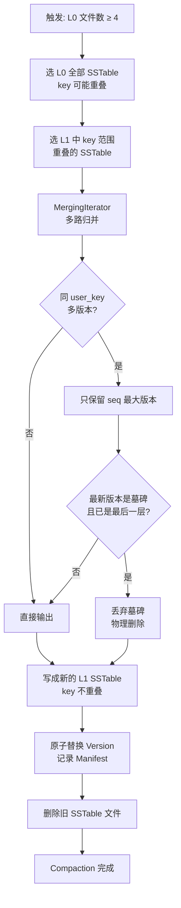
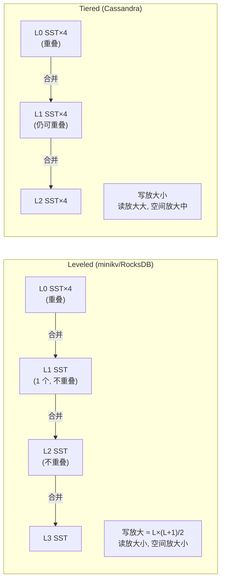

# Module 08 — Compaction 与 MVCC

> 对应源码：[internal_key.h](file:///c:/Users/Administrator/Desktop/hellocpp/minikv/src/core/internal_key.h)、[compaction.h](file:///c:/Users/Administrator/Desktop/hellocpp/minikv/src/core/compaction.h)、[manifest.h](file:///c:/Users/Administrator/Desktop/hellocpp/minikv/src/core/manifest.h)、[version.h](file:///c:/Users/Administrator/Desktop/hellocpp/minikv/src/core/version.h)

## 背景与动机

上一模块我们把 LSM-Tree 的写路径和读路径跑通了，但留下两个致命隐患：第一，MemTable 不断 flush 成 L0 SSTable，key 还会重叠，如果不收拾，L0 会越积越多，读一次要扫几十个文件，延迟直接劣化；第二，同一条 key 可能被反复 Put，旧版本散落在各层 SSTable 里，既浪费空间又让「读不到最新值」成为可能。这两个问题不解，LSM 就只是个能写不能读的玩具。

Compaction 就是来解决前者的——它把多层 SSTable 归并排序、去重、回收旧版本，是 LSM 引擎「自我维护」的生命线。Leveled 和 Tiered 两种策略代表了读优先还是写优先的取舍，RocksDB 和 Cassandra 各自的选择背后都有深刻的工程考量。而 MVCC（多版本并发控制）则解决后者——每条数据带一个序列号，读时只看 ≤ 快照 seq 的版本，写时不阻塞读，读也不阻塞写。这套机制让 LSM 天然支持事务隔离，是 TiKV、CockroachDB 这类分布式数据库的基础。

学完这一模块，你会理解 InternalKey 为什么要把 seq 编进 trailer、墓碑为什么不能在 L0 就丢、Manifest 怎么容忍 torn write、MVCC 怎么实现可重复读。面试里被问到「LSM 的写放大怎么算」「Compaction 什么时候清墓碑」「MVCC 和 MySQL 的 Undo Log 有什么区别」时，你都能从容应对——因为你在 minikv 里亲手实现过这套逻辑。

## 1. 核心知识

- InternalKey 编码：`[user_key | trailer(8)]`，trailer = `(seq << 8) | type`，小端。
- 排序规则：user_key 升序，同 user_key 下 seq 降序（新版本在前）。
- ValueType：`kValue=1`（普通值）、`kDeletion=2`（墓碑 tombstone）。
- Compaction 策略：Leveled（层内不重叠，读优写放大大）vs Tiered（层内可重叠，写优读放大大）。
- 三大放大：写放大 WA、读放大 RA、空间放大 SA。
- Manifest 持久化：追加写 `[crc(4)][size(4)][payload]`，重启重放重建 Version。
- MVCC 快照读：每个读带 seq，只可见 seq ≤ 快照的版本。

## 2. 内容详解

### 2.1 InternalKey 编码

[internal_key.h:27-40](file:///c:/Users/Administrator/Desktop/hellocpp/minikv/src/core/internal_key.h)：

```
internal_key = user_key_bytes || trailer(8 bytes)
trailer      = uint64 LE of ((seq << 8) | type)

位分配:
  bits 0..7   : ValueType (1=Value, 2=Deletion)
  bits 8..63  : seq (56 bits, ~7.2e16, 够用几十年)
```

为什么这样设计：

- **user_key 在前**：字节序比较时先比 user_key，同 user_key 的多版本聚在一起，利于范围扫描。
- **trailer 小端**：`InternalKeyCompare` 把 trailer 解码为 uint64 后比较，seq 高位决定顺序。
- **seq 降序**：同一 user_key 的新版本（seq 大）排在前，迭代时第一个命中即最新——O(1) 取最新版本。
- **type 占低 8 位**：同 seq 时 kValue(1) < kDeletion(2)，保证删除标记在值之后（实际同 seq 不会同时有值和删除）。

### 2.2 排序比较器

`InternalKeyCompare(a, b)` 逻辑：

1. 先比 user_key 字节序（`memcmp`），不等直接返回。
2. user_key 相等时，解码两个 trailer 为 uint64，**seq 部分取反比较**（实现降序）。
3. seq 也相等时，type 升序（kValue 在前）。

这个比较器是 SkipList、SSTable、MergingIterator 的统一排序依据——整个 LSM 的「有序」基础。

### 2.3 墓碑（Tombstone）

删除不是物理删除，而是写入一个 `kDeletion` 类型的 InternalKey。读路径遇到墓碑即视为「已删除」，返回 NotFound。

为什么用墓碑：

- LSM 追加写，不能原地修改/删除 SSTable 里的旧版本。
- 墓碑让删除走与 Put 相同的写路径（WAL → MemTable → SSTable），统一处理。
- 墓碑在 Compaction 时才真正物理清除（当合并到最后一层时丢弃）。

### 2.4 Compaction 策略对比

[compaction.h](file:///c:/Users/Administrator/Desktop/hellocpp/minikv/src/core/compaction.h) 的 `CompactionManager` 提供 `compactL0()` 和 `compactLevel(level)`：

| 策略 | Leveled | Tiered (Size-Tiered) |
|---|---|---|
| 层内重叠 | 否（每层 SSTable key 范围不重叠） | 是（同层多个 SSTable 可重叠） |
| 合并触发 | L_i 满，选 1 个 SSTable 与 L_{i+1} 重叠文件合并 | 同层 SSTable 数到阈值，合并成 1 个大文件 |
| 写放大 | 大（每次合并重写，~10-30x） | 小 |
| 读放大 | 小（层内二分，不重叠） | 大（层内多文件可能全查） |
| 空间放大 | 小（及时回收） | 大（旧版本堆积） |
| 典型 | RocksDB 默认、LevelDB | Cassandra、ScyllaDB |

minikv 采用 Leveled（`compactLevel` 把 L_i 与 L_{i+1} 重叠文件归并）。

**写放大估算**（Leveled）：`WA ≈ L×(L+1)/2`，L 为层数。如 4 层、放大因子 10 → WA ≈ 10+100+1000 ≈ 10-30x。

### 2.5 Compaction 流程

`compactL0` 典型步骤：

1. 选 L0 全部 SSTable（key 重叠，需合并）+ L1 中 key 范围重叠的 SSTable。
2. 用 `MergingIterator` 多路归并（按 InternalKeyCompare），输出有序流。
3. 去重：同 user_key 只保留最新版本（seq 最大）；若最新是墓碑且已是最后一层，丢弃。
4. 写成新的 L1 SSTable（不重叠）。
5. 原子替换：旧文件从 Version 移除，新文件加入，记录到 Manifest。
6. 删除旧 SSTable 文件。

`CompactionManager` 在后台线程 `compactionLoop` 轮询（[compaction.h:25](file:///c:/Users/Administrator/Desktop/hellocpp/minikv/src/core/compaction.h)），`triggerCompaction()` 可主动触发。

#### Compaction 流程图



#### Leveled vs Tiered 写放大对比



### 2.6 Manifest 持久化

[manifest.h](file:///c:/Users/Administrator/Desktop/hellocpp/minikv/src/core/manifest.h) 记录 Version 变更（哪些 SSTable 存在）。格式：追加写 `[crc(4)][size(4)][payload]`，记录类型 `kReset / kAdd / kDel`。

恢复流程（[db_impl.cpp:45-53](file:///c:/Users/Administrator/Desktop/hellocpp/minikv/src/core/db_impl.cpp)）：

1. `manifest_->open()` 打开 Manifest 文件。
2. `version_.restoreFrom(manifest_->levels())` 重放全部记录，重建当前 Version 快照。
3. 之后才 replay WAL（恢复 MemTable）。

**容忍 torn write**：尾部最后一条记录若 CRC 校验失败或长度不足，视为崩溃时未写完整，直接忽略——保证已提交记录可恢复。

### 2.7 MVCC 快照读

每次 `Get` 带 `seq_.load()` 作为快照（[db_impl.cpp:118-119](file:///c:/Users/Administrator/Desktop/hellocpp/minikv/src/core/db_impl.cpp)）：

```cpp
auto result = memtable_->get(key, seq_.load());
```

MemTable/SSTable 的 `get(userKey, snapshotSeq)` 逻辑：

1. 按 user_key 查找，遇到的所有版本按 seq 降序排列。
2. 返回第一个 `seq ≤ snapshotSeq` 的版本。
3. 若该版本是墓碑 → 返回 NotFound；否则返回 value。

意义：

- **读不阻塞写**：写分配新 seq，读用旧 seq 快照，互不干扰。
- **可重复读**：同一事务内用同一 seq，多次读结果一致。
- **事务隔离**：Read-Committed（每次读新快照）、Snapshot-Isolation（事务用固定快照）。

对比 MySQL InnoDB 的 MVCC：InnoDB 用 Undo Log 版本链 + ReadView，minikv 用 InternalKey 内嵌 seq + LSM 多版本天然链。

## 3. 思考题

1. InternalKey 为什么把 seq 放 trailer 高位、type 放低位？如果把 type 放高位会怎样？
2. 墓碑在 Compaction 时何时才能真正丢弃？为什么不能在 L0 就丢？
3. Leveled Compaction 写放大大，为什么 RocksDB 仍默认用它？
4. Manifest 用追加写而非原地更新，有什么好处？何时需要 Compact Manifest？
5. MVCC 快照读如何实现「读不阻塞写」？写入新版本时旧版本会被修改吗？

## 4. 动手题

### 题 4.1（InternalKey 编解码）

实现 `InternalKeyEncode` / `InternalKeyUserKey` / `InternalKeySequence` / `InternalKeyCompare`。测试：同一 user_key 插入 3 个不同 seq 的版本，验证 `InternalKeyCompare` 降序排列（新版本在前）。

### 题 4.2（Compaction 模拟）

模拟一个 L0→L1 Compaction：L0 有 2 个重叠 SSTable，L1 有 1 个不重叠 SSTable，含同 user_key 的多版本 + 1 个墓碑。手算合并后 L1 的内容（应只保留最新版本，墓碑若非最后一层则保留）。

### 题 4.3（Manifest 崩溃恢复）

写测试：插入数据触发 flush 产生若干 SSTable，记录 Manifest；然后**手动截断 Manifest 最后一字节**（模拟 torn write），重新 open，验证能正常恢复（忽略截断记录）。

### 题 4.4（MVCC 可重复读）

实现一个简单的 `Transaction`：`Begin()` 记录当前 seq，`Get(key)` 用该 seq 快照读，`Put` 用新 seq。验证：事务 A Begin 后，事务 B Put 同 key，A 仍读到旧值（可重复读）。

## 5. 自检

1. InternalKey = ____ + trailer(8)，trailer = (____ << 8) | type。
2. 同 user_key 的多版本按 seq ____（升/降）序排列，保证迭代时第一个是____版本。
3. 删除写入一个____类型的 InternalKey，称为____。
4. Leveled Compaction 层内 SSTable____（重叠/不重叠），写放大比 Tiered____（大/小）。
5. Manifest 重放时尾部 CRC 失败的记录应____（报错/忽略），以容忍____。

<details>
<summary>参考答案</summary>

1. user_key；seq
2. 降；最新
3. kDeletion；墓碑（tombstone）
4. 不重叠；大
5. 忽略；torn write（崩溃时未写完整）

思考题要点：
1. seq 放高位使 seq 成为排序主因子（同 user_key 内），type 仅作 seq 相同时的次序。若 type 放高位，则同 user_key 内先按 type 分组（所有 Value 在前、所有 Deletion 在后），破坏「新版本在前」语义，取最新版本需扫描。
2. 墓碑只有在合并到最后一层（或确认无更旧 SSTable 含该 key）时才能丢弃。L0 丢弃会让旧 L1/L2 的旧版本「复活」（读不到墓碑却读到旧值）。
3. Leveled 读放大小、空间放大小，对读延迟敏感场景（TiKV 服务在线请求）更优；写放大可通过 Tiered/混合策略缓解。
4. 追加写顺序 IO 快、无需原地修改（避免随机写）；崩溃恢复只需重放。Manifest 过大时需 Compact（重写为单条 kReset + 当前快照）。
5. 写入新版本是追加新 InternalKey（新 seq），不修改旧版本（旧版本在 SSTable 里不可变）。读用快照 seq，只看 ≤ 快照的版本，自然看不到新版本——读不加锁，写也不阻塞读。

</details>

---

← [Module 07](./07-lsm-engine.md)  |  下一模块：[Module 09 — epoll 与 C++20 协程](./09-epoll-coroutine.md) →
