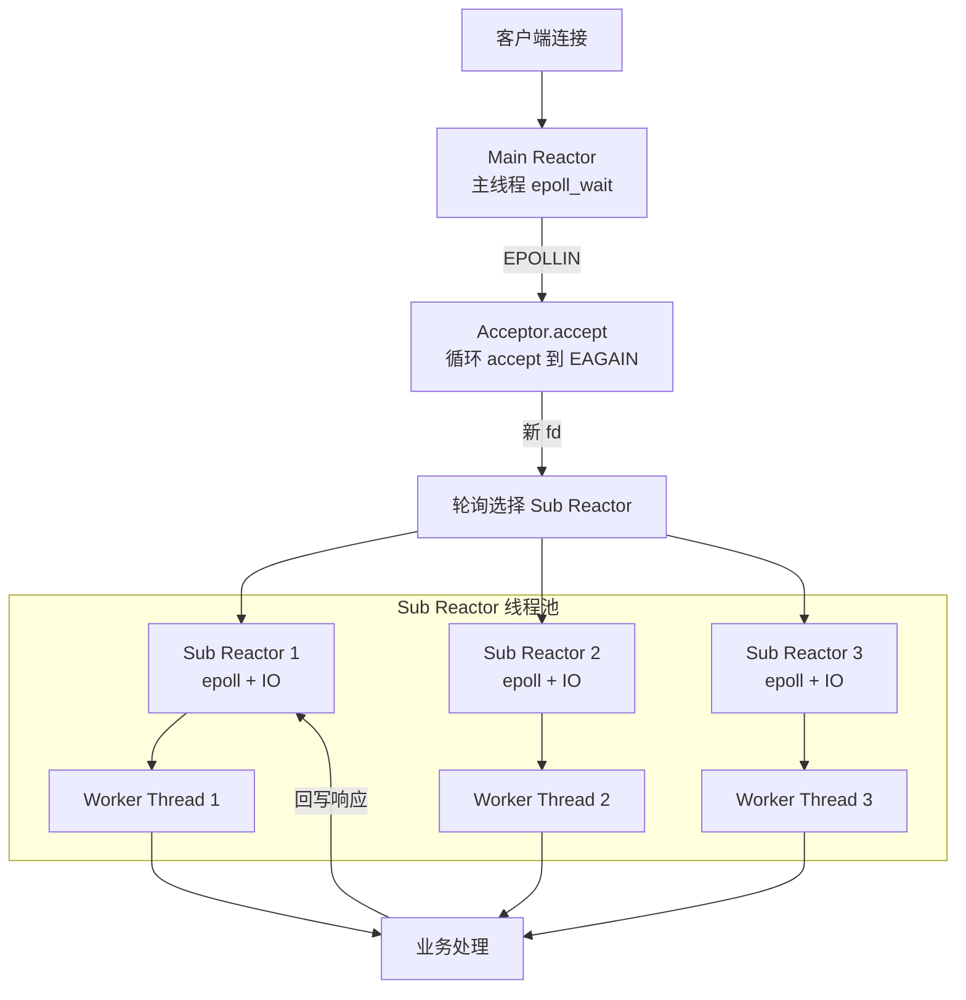
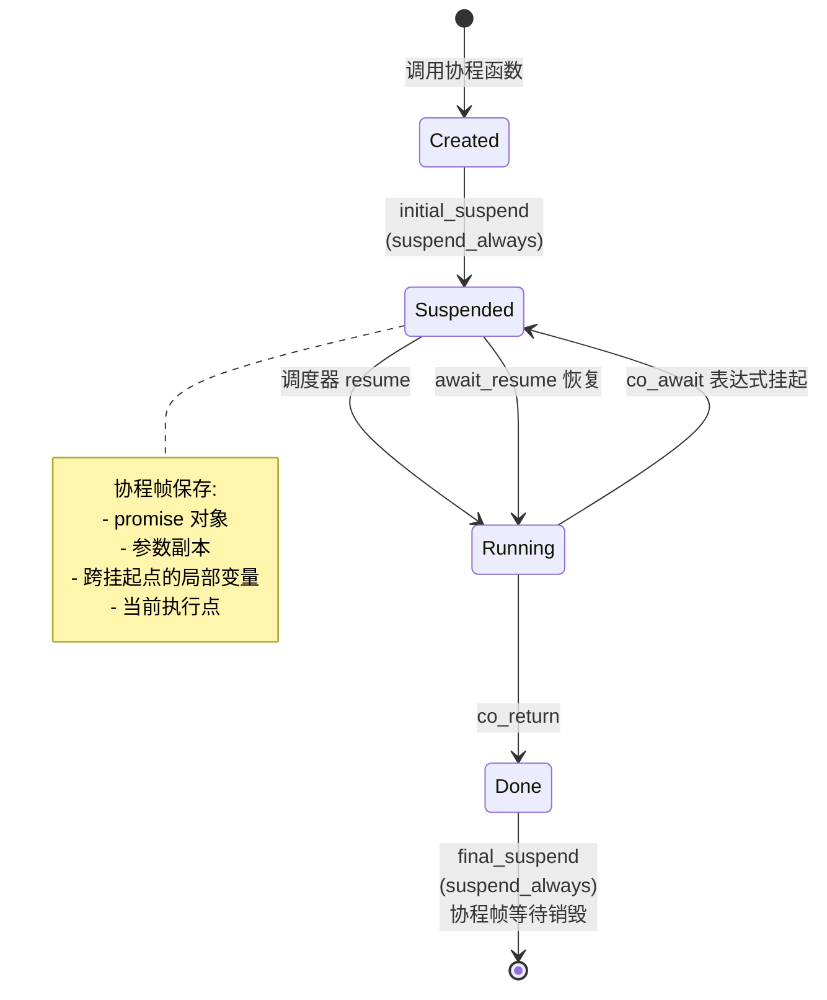

# Module 09 — epoll 与 C++20 协程

> 对应源码：[io_context.h](file:///c:/Users/Administrator/Desktop/hellocpp/skynet/include/skynet/net/io_context.h)、[task.h](file:///c:/Users/Administrator/Desktop/hellocpp/skynet/include/skynet/core/task.h)、[executor.h](file:///c:/Users/Administrator/Desktop/hellocpp/skynet/include/skynet/core/executor.h)、[socket.h](file:///c:/Users/Administrator/Desktop/hellocpp/skynet/include/skynet/net/socket.h)

## 1. 核心知识

- IO 多路复用：select / poll / epoll；epoll 用红黑树 + 就绪链表，O(1) 返回就绪 fd。
- LT（水平触发）vs ET（边缘触发）：ET 必须配合非阻塞 IO + 循环读写到 EAGAIN。
- Reactor 模式：事件循环 + 回调分发；主从 Reactor + 线程池。
- C++20 协程三关键字：`co_await` / `co_yield` / `co_return`；无栈协程、状态机变换。
- `promise_type` 协议：`get_return_object` / `initial_suspend` / `final_suspend` / `return_value` / `unhandled_exception`。
- Awaiter 三方法：`await_ready` / `await_suspend` / `await_resume`。
- 对称转移（Symmetric Transfer）：`await_suspend` 返回 `coroutine_handle`，零开销跳转。

## 2. 内容详解

### 2.1 IO 多路复用对比

| 特性 | select | poll | epoll |
|---|---|---|---|
| FD 上限 | 1024（FD_SETSIZE） | 无上限 | 无上限（百万级） |
| 数据拷贝 | 每次全量拷贝 fd_set | 每次全量拷贝 pollfd[] | 仅 epoll_ctl 增删改时拷贝 |
| 复杂度 | O(n) 遍历 | O(n) 遍历 | O(1) 仅返回就绪 |
| 触发模式 | 仅 LT | 仅 LT | LT + ET |
| 跨平台 | 是 | 是 | 仅 Linux |

epoll 高效原因：

1. 红黑树存储注册 fd，`epoll_ctl` 增删改 O(log n)。
2. 就绪 fd 放双向链表，`epoll_wait` 直接取 O(1)。
3. 内核回调 `ep_poll_callback` 在 fd 就绪时插入就绪链表，无需遍历所有 fd。

### 2.2 minikv 的 IOContext

[io_context.h:10-25](file:///c:/Users/Administrator/Desktop/hellocpp/skynet/include/skynet/net/io_context.h) 封装 epoll：

```cpp
class IOContext {
public:
    using Callback = std::function<void(uint32_t)>;
    void add(int fd, uint32_t events, Callback cb);    // EPOLL_CTL_ADD
    void modify(int fd, uint32_t events);              // EPOLL_CTL_MOD
    void remove(int fd);                               // EPOLL_CTL_DEL
    bool poll(int timeout_ms);                         // epoll_wait
private:
    int epoll_fd_;
    std::unordered_map<int, Callback> callbacks_;      // fd → 回调
};
```

要点：

- `callbacks_` 用 `unordered_map<int, Callback>` 存 fd 到回调的映射，`poll` 取出就绪 fd 后查表调用。
- `uint32_t events` 是 epoll 事件位掩码（`EPOLLIN`/`EPOLLOUT`/`EPOLLET`/`EPOLLONESHOT`）。
- `kMaxEvents = 1024` 是单次 `epoll_wait` 最多返回事件数。

### 2.3 LT vs ET

- **LT（水平触发，默认）**：fd 缓冲区有数据可读/可写，每次 `epoll_wait` 都返回该事件。容错高、编程简单、可阻塞 IO。
- **ET（边缘触发，需 `EPOLLET`）**：仅在状态变化时通知一次，必须一次性读尽（循环 `read` 到 `EAGAIN`），否则数据丢失。必须配合非阻塞 IO。

ET 模式注意点：

- accept 可能丢连接（多连接同时到来只通知一次），需循环 accept 到 EAGAIN。
- write 事件易 busy-loop（只要可写就触发），通常按需注册。
- 生产环境常加 `EPOLLONESHOT`：一个 fd 同一时刻只被一个线程处理，避免多线程竞态。

### 2.4 Reactor 模式

经典变体：

1. **单 Reactor 单线程**（Redis 6 之前）：一个线程跑 epoll + 业务，简单但无法利用多核。
2. **单 Reactor 多线程**：主线程 accept + IO，工作线程处理业务。
3. **主从 Reactor 多线程**（muduo 默认）：主 Reactor 只 accept，子 Reactor 处理 IO，业务丢线程池。

关键组件：EventLoop（IOContext）、Channel（fd+事件+回调）、Acceptor、TcpConnection、ThreadPool。

skynet 的 `Executor`（[executor.h](file:///c:/Users/Administrator/Desktop/hellocpp/skynet/include/skynet/core/executor.h)）即 EventLoop + 协程调度器。

#### 主从 Reactor 多线程架构



#### C++20 协程状态机转换



### 2.5 C++20 协程本质

C++20 协程是**无栈协程**（Stackless）：

- 协程帧在堆上，含 promise、参数、跨挂起点的局部变量、执行点状态。
- 编译器把协程变换为状态机，挂起点（`co_await`）对应状态切换。
- 切换开销 ≈ 函数调用，远小于线程上下文切换。

对比 Go goroutine（有栈协程）：有栈协程有独立栈，可在深层嵌套挂起；无栈协程只能在顶层挂起，但内存占用更小。

### 2.6 Task 类型与 promise_type

[task.h:22-34](file:///c:/Users/Administrator/Desktop/hellocpp/skynet/include/skynet/core/task.h) 实现 `promise_type`：

```cpp
struct promise_type {
    std::optional<T> result_;
    std::exception_ptr exception_;
    std::coroutine_handle<> awaiter_;        // 谁在等我

    Task get_return_object() {
        return Task{std::coroutine_handle<promise_type>::from_promise(*this)};
    }
    std::suspend_always initial_suspend() noexcept { return {}; }   // 惰性启动
    final_awaiter final_suspend() noexcept { return {awaiter_}; }  // 结束时回到等待者
    void return_value(T v) { result_ = std::move(v); }
    void unhandled_exception() { exception_ = std::current_exception(); }
};
```

要点：

- **`initial_suspend` 返回 `suspend_always`**：协程创建后立即挂起，不自动运行（lazy）——调用者决定何时 `resume`。
- **`final_suspend` 返回 `final_awaiter`**：协程结束时回到等待者（`awaiter_`），而非直接销毁——避免悬空 handle。
- **`return_value`**：`co_return v` 时存结果到 `result_`。
- **`unhandled_exception`**：捕获异常到 `exception_ptr`，`await_resume` 时 `rethrow`。

### 2.7 Awaiter 与 co_await

`co_await expr` 的执行流程：

1. `expr.await_ready()`：返回 true 则直接取结果，不挂起。
2. 若 false，调 `expr.await_suspend(handle)`：可返回 void（挂起）/ bool（true 挂起 false 恢复）/ `coroutine_handle`（对称转移到另一协程）。
3. 恢复时调 `expr.await_resume()` 返回结果。

[task.h:49-57](file:///c:/Users/Administrator/Desktop/hellocpp/skynet/include/skynet/core/task.h) 的 Task 本身也是 Awaiter：

```cpp
bool await_ready() const { return false; }
void await_suspend(std::coroutine_handle<> awaiter) {
    handle_.promise().awaiter_ = awaiter;    // 记下谁等我
    handle_.resume();                         // 启动被等待的协程
}
T await_resume() {
    if (handle_.promise().exception_) std::rethrow_exception(...);
    return std::move(*handle_.promise().result_);
}
```

调用 `co_await innerTask()` 时：保存当前 handle 为 innerTask 的 awaiter，启动 innerTask；innerTask 结束时 `final_awaiter` 恢复 awaiter（即外层协程）。

### 2.8 对称转移（Symmetric Transfer）

`final_awaiter.await_suspend` 返回 `coroutine_handle`（而非 void）：

```cpp
void await_suspend(std::coroutine_handle<>) noexcept {
    if (awaiter_) awaiter_.resume();    // 直接 resume 等待者
}
```

注意这里实际返回 void，但若改成返回 `awaiter_`（handle）则是**对称转移**：编译器直接跳转到 awaiter，不压栈。这是 C++20 协程避免栈溢出的关键——递归 `co_await` 不会累积栈帧。

严格对称转移写法：

```cpp
std::coroutine_handle<> await_suspend(std::coroutine_handle<>) noexcept {
    return awaiter_;   // 返回 handle，对称转移
}
```

### 2.9 Executor 调度

C++20 **只提供语言原语，不提供调度器/运行时**。skynet 的 `Executor` 自行实现：

- `spawn(Task)`：把协程 handle 加入就绪队列。
- `run()`：事件循环，`epoll_wait` 取就绪 fd → 恢复对应协程 → 协程 `co_await` IO 时挂起 → IO 就绪再恢复。
- 协程挂起时把 fd 注册到 epoll，恢复由 epoll 事件驱动。

```cpp
skynet::Task<int> handle_client(TcpStream stream) {
    auto data = co_await stream.read(1024);   // 挂起，注册 fd 到 epoll
    co_await stream.write("Hello!\n");        // 挂起
    co_return 0;
}
```

## 3. 思考题

1. epoll 为什么比 select 快？从数据结构和拷贝开销两方面解释。
2. ET 模式下 `read` 没读到 EAGAIN 就返回，会有什么后果？
3. C++20 协程是「无栈」的，意味着什么？与 Go goroutine 的本质区别？
4. `initial_suspend` 返回 `suspend_always` vs `suspend_never`，对协程生命周期管理有何影响？
5. 对称转移为什么能避免栈溢出？不用对称转移（返回 void）递归 `co_await` 会怎样？

## 4. 动手题

### 题 4.1（手撕 epoll ET 回显服务器）

参考 [io_context.h](file:///c:/Users/Administrator/Desktop/hellocpp/skynet/include/skynet/net/io_context.h)，用 epoll ET 实现一个回显服务器：listenfd 和 clientfd 都设 `O_NONBLOCK`，注册 `EPOLLIN | EPOLLET`，accept 循环到 EAGAIN，read 循环到 EAGAIN。用 `ab` 或 `wrk` 压测。

### 题 4.2（手写最小 Task）

参考 [task.h](file:///c:/Users/Administrator/Desktop/hellocpp/skynet/include/skynet/core/task.h)，实现一个最小 `Task<T>`：支持 `co_return`、`co_await`、异常传播、惰性启动。写测试：`Task<int> f() { co_return 42; }`，`auto v = co_await f();` 验证 v==42。

### 题 4.3（协程化 TCP 读）

实现一个 `AwaitableRead`：包装 fd + 读缓冲，`await_suspend` 把 fd 注册到 IOContext 的 `EPOLLIN`，epoll 事件触发时恢复协程，`await_resume` 返回读到的字节数。与裸 epoll 回调版对比代码可读性。

### 题 4.4（对称转移验证）

写一个递归 `co_await` 的链：`a() → b() → c() → ...` 共 10000 层。对比 `final_awaiter` 返回 void vs 返回 handle（对称转移）的栈使用情况（用 `ulimit -s` 观察是否栈溢出）。

## 5. 自检

1. epoll 用____存储注册 fd，用____存储就绪 fd。
2. ET 模式必须配合____IO，且要____读到 EAGAIN。
3. C++20 协程是____（有栈/无栈）协程，帧分配在____。
4. `promise_type` 必须实现 5 个方法：get_return_object / ____ / ____ / return_value / ____。
5. 对称转移指 `await_suspend` 返回____，编译器____跳转，避免____。

<details>
<summary>参考答案</summary>

1. 红黑树；双向链表（就绪链表）
2. 非阻塞；循环
3. 无栈；堆
4. initial_suspend；final_suspend；unhandled_exception
5. coroutine_handle；直接（无压栈）；栈溢出

思考题要点：
1. 数据结构：select/poll 用数组全量遍历 O(n)；epoll 用红黑树 O(log n) 增删、就绪链表 O(1) 取。拷贝：select/poll 每次全量拷贝 fd 集合；epoll 只在 ctl 时拷贝一次。
2. 剩余数据滞留内核缓冲，ET 不会再通知，该数据「丢失」（直到下次有新数据触发）。必须循环读到 EAGAIN 确保读尽。
3. 无栈：协程帧在堆，编译器变换为状态机，挂起点即状态切换；不能在深层嵌套调用中挂起。Go goroutine 是有栈协程，有独立栈可深层挂起，但有栈分配开销。
4. suspend_always：创建后不自动运行，调用者控制何时 resume，生命周期安全；suspend_never：创建即运行到第一个挂起点，可能立即执行产生意外时序。
5. 返回 void 时，每次 `co_await` 内层协程会在外层栈上 resume，递归链累积栈帧，深递归栈溢出。返回 handle（对称转移）时编译器尾调用跳转，不累积栈帧，可无限深递归。

</details>

---

← [Module 08](./08-compaction-mvcc.md)  |  下一模块：[Module 10 — HTTP 与反向代理](./10-http-proxy.md) →
