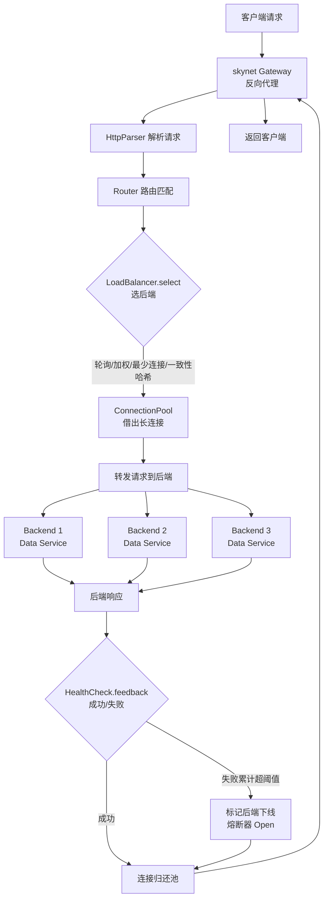

# Module 10 — HTTP 与反向代理

> 对应源码：[parser.h](file:///c:/Users/Administrator/Desktop/hellocpp/skynet/include/skynet/http/parser.h)、[router.h](file:///c:/Users/Administrator/Desktop/hellocpp/skynet/include/skynet/http/router.h)、[load_balancer.h](file:///c:/Users/Administrator/Desktop/hellocpp/skynet/include/skynet/proxy/load_balancer.h)、[connection_pool.h](file:///c:/Users/Administrator/Desktop/hellocpp/skynet/include/skynet/proxy/connection_pool.h)、[health_check.h](file:///c:/Users/Administrator/Desktop/hellocpp/skynet/include/skynet/proxy/health_check.h)

## 背景与动机

到这一模块为止，我们的 minikv 已经能存能取，skynet 也能用 epoll + 协程扛住高并发连接。可问题来了：真实的生产环境里，后端绝不会只有一个进程——你有 Data 服务、Auth 服务、Meta 服务，还要面对突发流量、节点故障、滚动发布。如果让客户端直连后端，那拓扑一变就得全体改配置，一个节点挂了就整片不可用。这时候我们就需要一个「咽喉」：网关。

反向代理就是这个咽喉。它站在客户端和后端集群之间，屏蔽内部拓扑、分担负载、卸载 SSL、做健康检查和熔断——Nginx 多年来就是干这个的，原理值得每一位后端工程师吃透。更进一步，网关还要抗突发流量：连接池复用 TCP 长连接避免反复握手，令牌桶限流把流量洪峰削平，一致性哈希让同一用户的请求始终落到有本地缓存的节点。这些都是微服务时代网关的「标配」能力。

学完这一模块，你会理解 skynet `gateway/` 那个看似简单的反向代理是怎么把 HttpParser、LoadBalancer、ConnectionPool、HealthCheck 四件套串起来的。面试里被问到「设计一个 API 网关」或「Nginx 反向代理原理」时，你能从状态机解析一路讲到熔断器状态机，把这条链路讲透。

## 1. 核心知识

- HTTP/1.1 报文结构：请求行 / 头部 / 空行 / body；状态机解析。
- TCP 粘包/拆包：流式协议无消息边界，用长度前缀 / 分隔符 / Content-Length 解决。
- 负载均衡四策略：轮询（RR）、加权轮询（WRR）、最少连接（LeastConn）、一致性哈希。
- 连接池：复用 TCP 连接，避免握手开销，Keep-Alive。
- 健康检查：主动探测 + 被动熔断；剔除故障节点。
- 反向代理：客户端 → 代理 → 后端集群；屏蔽后端拓扑、负载分担、SSL 卸载。

## 2. 内容详解

### 2.1 HTTP/1.1 状态机解析

[parser.h:13-31](file:///c:/Users/Administrator/Desktop/hellocpp/skynet/include/skynet/http/parser.h) 用状态机解析：

```cpp
enum class State {
    kMethod, kPath, kVersion, kHeaderName, kHeaderValue, kBody, kDone
};
class HttpParser {
    ParseResult feed(const char* data, size_t len);   // 喂入数据
    bool isComplete() const { return state_ == State::kDone; }
    HttpRequest result() const;
};
```

状态转移：

```
kMethod ──' '──► kPath ──' '──► kVersion ──\r\n──► kHeaderName
   ▲                                              │
   │                                         \r\n (空行)
   │                                              │
   │                                              ▼
   └──────────────────────────────────────── kBody ──► kDone
```

要点：

- **流式解析**：`feed` 可分多次调用，数据不足返回 `kNeedMoreData`，下次继续——适配 TCP 分段到达。
- **`buffer_` 缓存半包**：本次没解析完的数据留存，与下次数据拼接。
- **`content_length_` / `chunked_`**：确定 body 边界——固定长度 or 分块编码。
- **状态机优于正则**：性能高、可中断续传、错误定位精确。

### 2.2 TCP 粘包/拆包

TCP 是字节流，无消息边界：

- **粘包**：多个 send 合并成一个 segment 到达。
- **拆包**：一个 send 拆成多个 segment 到达。

解决方案：

1. **固定长度**：每条消息定长，不足补齐。
2. **分隔符**：如 `\r\n`（HTTP、Redis 协议）。
3. **长度前缀**（最常用）：消息头含长度字段，先读长度再读 body。
4. **结构化协议**：TLV（Type-Length-Value）。

HTTP 用 `Content-Length`（固定长度）或 `Transfer-Encoding: chunked`（分块）定界。HttpParser 的 `buffer_` 处理半包留存。

### 2.3 负载均衡策略

[load_balancer.h:11-52](file:///c:/Users/Administrator/Desktop/hellocpp/skynet/include/skynet/proxy/load_balancer.h) 定义抽象基类 + 四实现：

```cpp
class LoadBalancer {
public:
    virtual std::shared_ptr<Upstream> select() = 0;
    virtual void feedback(const Upstream& up, bool success) {}
};
```

#### 轮询 RoundRobin

```cpp
class RoundRobinLB : public LoadBalancer {
    size_t idx_{0};
    std::shared_ptr<Upstream> select() override { return mgr_->at(idx_++ % n); }
};
```

- 公平轮流，实现最简；假设所有后端等价。

#### 加权轮询 WeightedRoundRobin

- 每个后端有权重，权重高的多分请求。Nginx 平滑加权轮询算法：维护 `current_weight`，每轮 `current_weight += effective_weight`，选最大的，选中后 `current_weight -= total`。
- 适用异构集群（4C8G vs 8C16G）。

#### 最少连接 LeastConn

- 选当前活跃连接数最少的后端。适合请求处理时间差异大（如有的请求慢）。
- 需后端实时上报或代理统计连接数。

#### 一致性哈希 ConsistentHash

```cpp
class ConsistentHashLB : public LoadBalancer {
    std::vector<std::pair<uint32_t, std::shared_ptr<Upstream>>> ring_;  // 哈希环
    void buildRing();   // 每后端 vnodes 个虚拟节点
};
```

- 同一 key（如 user_id）始终路由到同一后端（除非该后端下线）——利于本地缓存命中。
- 虚拟节点（默认 160）保证均匀。
- 与 Module 06 的一致性哈希同原理，这里用于请求路由。

### 2.4 连接池

[connection_pool.h](file:///c:/Users/Administrator/Desktop/hellocpp/skynet/include/skynet/proxy/connection_pool.h)：复用 TCP 连接。

- **问题**：每次请求新建 TCP 连接要 3 次握手 + TLS 握手，延迟高、内核资源消耗大。
- **方案**：池中保持若干到每个后端的长连接，请求时借出、用完归还；连接空闲超时则关闭。
- **Keep-Alive**：HTTP/1.1 默认开启，复用连接发多个请求。
- **池大小权衡**：太小不够用（请求排队），太大浪费资源（后端承受压力）。

### 2.5 健康检查

[health_check.h](file:///c:/Users/Administrator/Desktop/hellocpp/skynet/include/skynet/proxy/health_check.h)：

- **主动探测**：周期性向后端发健康请求（如 `GET /health`），失败 N 次标记下线。
- **被动熔断**：正常请求失败率超阈值，临时剔除该后端，半开探测恢复。
- **熔断器状态**：Closed（正常）→ Open（熔断，拒绝请求）→ Half-Open（放少量请求试探）→ Closed。
- 与 `LoadBalancer::feedback(success)` 联动：失败时反馈，影响后续 select。

### 2.6 反向代理整体流程



```
Client ──► [skynet Gateway]
            │
            ├─ HttpParser 解析请求
            ├─ Router 路由匹配
            ├─ LoadBalancer.select() 选后端
            ├─ ConnectionPool 借连接
            ├─ 转发请求 → 后端响应
            ├─ HealthCheck.feedback(success)
            └─ 连接归还池
            │
            ▼
        Backend Pool (N 个后端)
```

skynet 的 `gateway/`（[gateway/main.cpp](file:///c:/Users/Administrator/Desktop/hellocpp/skynet/gateway/main.cpp)）即这样一个反向代理，配置见 [gateway.yaml](file:///c:/Users/Administrator/Desktop/hellocpp/skynet/gateway/gateway.yaml)。

## 3. 思考题

1. HttpParser 为什么用状态机而非 `sscanf`/正则？流式解析的 `kNeedMoreData` 如何处理？
2. HTTP 用 `Content-Length` 定界，若客户端伪造一个超大 `Content-Length` 但不发 body，服务端如何防御？
3. 加权轮询（WRR）中「平滑」是什么意思？Nginx 的平滑 WRR 算法如何避免集中命中？
4. 一致性哈希 LB 用于请求路由时，key 选什么（user_id？request_id？）？选择不同有什么影响？
5. 连接池中某连接已失效（后端重启），代理借到该连接发请求失败，如何处理？

## 4. 动手题

### 题 4.1（手撕 HTTP 请求解析器）

参考 [parser.h](file:///c:/Users/Administrator/Desktop/hellocpp/skynet/include/skynet/http/parser.h)，实现一个 HTTP/1.1 请求行 + 头部解析器（不含 body）。测试：分 3 次 `feed` 同一请求（模拟拆包），验证最终 `isComplete()` 且字段正确。

### 题 4.2（平滑加权轮询）

实现 Nginx 平滑 WRR：3 个后端权重 {a:5, b:1, c:1}，调用 `select()` 7 次，验证序列为 `a a b a c a a`（分散而非集中）。

### 题 4.3（一致性哈希 LB）

参考 [load_balancer.h](file:///c:/Users/Administrator/Desktop/hellocpp/skynet/include/skynet/proxy/load_balancer.h) 的 `ConsistentHashLB`，实现 `select(key)`：用 key 的哈希在环上顺时针找最近虚拟节点。测试：100 万 key 分布到 5 后端，标准差 < 5%；下线 1 后端后，仅约 1/5 key 迁移。

### 题 4.4（连接池 + 健康检查）

实现一个简单连接池：`acquire(host) → conn`、`release(conn)`，含空闲超时回收。叠加被动健康检查：请求失败则该连接销毁、后端失败计数+1，连续 3 次失败标记下线 30s。

## 5. 自检

1. HTTP/1.1 请求由____、____、空行、body 组成。
2. TCP 粘包本质是 TCP 是____协议，无____。
3. 负载均衡四策略：____、____、____、一致性哈希。
4. 连接池复用 TCP 连接避免____和____开销。
5. 熔断器三状态：____ → ____ → ____。

<details>
<summary>参考答案</summary>

1. 请求行（method/path/version）；头部（headers）
2. 字节流；消息边界
3. 轮询（RR）；加权轮询（WRR）；最少连接（LeastConn）
4. 三次握手；TLS 握手
5. Closed；Open；Half-Open

思考题要点：
1. 状态机性能高（O(n) 单遍扫描）、可中断续传（数据不足存 buffer 下次继续）、错误定位精确。`kNeedMoreData` 时把未消费数据存 `buffer_`，下次 `feed` 拼接继续解析。
2. 读超时机制：解析 header 后设读 body 超时（如 30s），超时关闭连接；限制 `Content-Length` 上限防 OOM；分块读取不预分配大缓冲。
3. 「平滑」指权重高的后端请求分散到各轮而非连续命中。Nginx 算法：每轮所有后端 `current_weight += effective_weight`，选 `current_weight` 最大的，选中者 `current_weight -= total_weight`。使 {5,1,1} 输出 `a,a,b,a,c,a,a` 而非 `a,a,a,a,a,b,c`。
4. key 选 user_id/session_id 利于本地缓存命中（同一用户路由到同一后端）；选 request_id 则完全打散无亲和性。取决于是否需会话保持。
5. 检测失败（RST/超时）后销毁该连接，从池中移除；新建连接重试 1-2 次；仍失败则 `feedback(false)` 触发健康检查，标记后端下线，LB 暂不选它。

</details>

---

← [Module 09](./09-epoll-coroutine.md)  |  下一模块：[Module 11 — Raft 共识与分片](./11-raft-sharding.md) →
