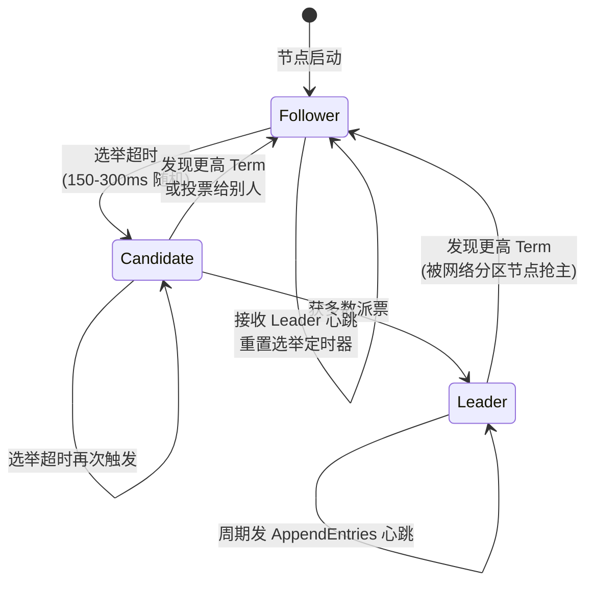
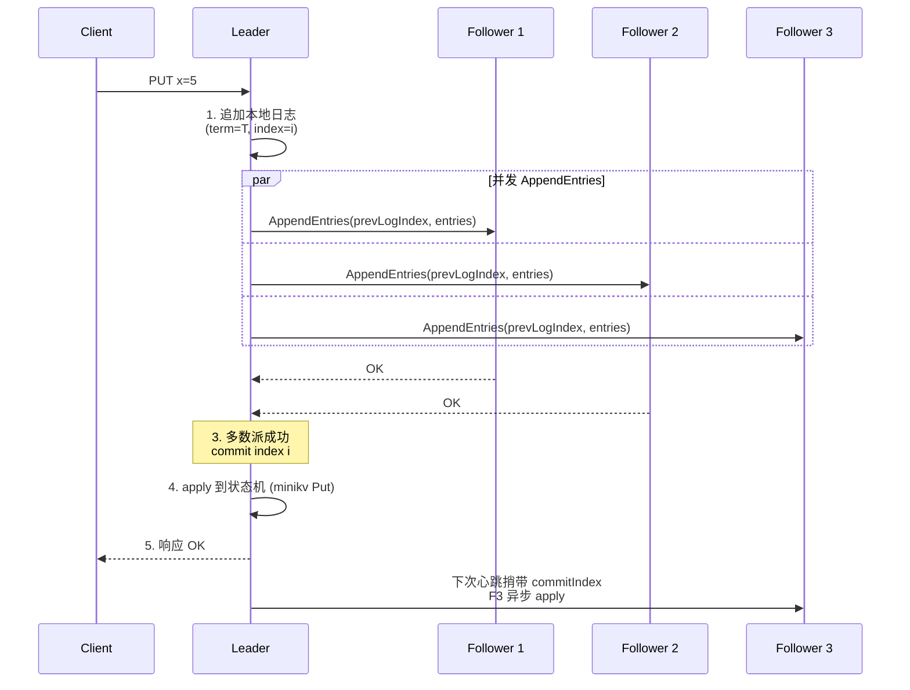

# Module 11 — Raft 共识与分片

> 对应规划：REFACTORING.md Phase 5（`distributed/` — etcd + hashicorp/raft + 一致性哈希分片）
> 参考资料：Raft 论文《In Search of an Understandable Consensus Algorithm》、TiKV 架构、etcd 文档

## 1. 核心知识

- 共识问题：多副本就「日志顺序」达成一致，容忍少数派故障。
- Raft 三角色：Follower / Candidate / Leader；Term 单调递增。
- Leader 选举：随机超时（150-300ms）触发，多数派票当选。
- 日志复制：Leader 追加 → 并发 AppendEntries → 多数派 commit → apply。
- 安全性：已 commit 日志不被覆盖（Leader 完整性）。
- 优化：PreVote、Joint Consensus、Snapshot 日志压缩。
- 分片：范围分片 / 哈希分片 / 一致性哈希；PD（Placement Driver）路由。
- 线性一致读：ReadIndex / Lease Read。

## 2. 内容详解

### 2.1 为什么需要共识

单机存储故障即数据丢失/不可用。多副本解决可用性，但引入**一致性**问题：

- 副本间数据如何同步？
- 副本故障时如何选主？
- 网络分区时如何避免脑裂？

共识算法（Raft/Paxos/ZAB）解决「一组副本就日志顺序达成一致」。TitanKV Phase 5 计划用 `hashicorp/raft`（Go 实现）包裹 minikv 存储引擎。

### 2.2 Raft 三角色与选举



- **Follower**：被动接收 Leader 心跳/日志；超时无心跳则转 Candidate。
- **Candidate**：自增 Term，投自己，发 `RequestVote` RPC；获多数派票当选 Leader；发现更高 Term 则回退 Follower。
- **Leader**：周期发心跳维持权威；所有写经 Leader。

选举规则：

- 每个 Term 每个节点只投一票（先到先得）。
- 候选者日志至少和投票者一样新（`lastLogTerm` 更大，或相等且 `lastLogIndex` 更大）。
- 随机超时（150-300ms）避免多个节点同时竞选。

### 2.3 日志复制



日志一致性保证：

- `AppendEntries` 携带 `prevLogIndex/prevLogTerm`；Follower 校验本地对应位置匹配。
- 不匹配则 Follower 拒绝，Leader 递减 `nextIndex` 重试，最终强制覆盖 Follower 日志。
- **Leader 完整性**：已 commit 的日志必在所有未来 Leader 中（由投票规则保证）。

### 2.4 安全性与成员变更

- **安全性**：已 commit 日志不会被覆盖。保证状态机最终一致。
- **Joint Consensus**（成员变更）：交替使用新旧两套多数派，安全增删节点。
- **PreVote**：Candidate 先发 PreVote（不递增 Term）探测，避免网络分区节点回归后用高 Term 干扰。

### 2.5 Snapshot 日志压缩

日志无限增长会占满磁盘、重启恢复慢。Snapshot：

- 周期把状态机当前快照写入磁盘，丢弃快照点之前的日志。
- 落后 Follower 用 `InstallSnapshot` RPC 直接传快照。
- minikv 的 SSTable 天然适合做 Snapshot——一批 SSTable 文件即状态机快照。

`hashicorp/raft` 的 FSM 接口：`Apply(log) / Snapshot() / Restore(snapshot)`，minikv 实现这三个方法即可接入。

### 2.6 分片策略

单 Raft 组有容量上限（单机磁盘 + 复制带宽）。分片（Sharding）把数据分散到多组：

| 策略 | 特点 | 适用 |
|---|---|---|
| 范围分片 | key 按序切分，支持范围扫描 | TiKV Region |
| 哈希分片 | `hash(key) % N`，均匀但无范围 | Redis Cluster |
| 一致性哈希 | 环 + 虚拟节点，迁移量小 | Cassandra、TitanKV 计划 |

TitanKV 计划用一致性哈希（见 Module 06）+ PD 路由：

- **PD（Placement Driver）**：中心化路由表，记录每个 shard 由哪个 Raft 组服务。
- 客户端缓存路由表，缓存失效时回查 PD。
- shard 过大时分裂，热点 shard 迁移。

#### 一致性哈希分片 + PD 路由

```mermaid
flowchart TD
    Client[Client PUT key=foo] --> Cache{本地路由表<br/>缓存命中?}
    Cache -->|是| Shard[找到 shard = Raft Group 3]
    Cache -->|否| PD[查询 PD]
    PD -->|返回 shard| Shard
    Shard --> Leader[连 Raft Group 3 的 Leader]
    Leader --> Replicate[复制到 Followers]

    subgraph Ring["一致性哈希环 (虚拟节点)"]
        N1[Node A<br/>范围 [0, 1/4)] --> N2[Node B<br/>范围 [1/4, 1/2)]
        N2 --> N3[Node C<br/>范围 [1/2, 3/4)]
        N3 --> N4[Node D<br/>范围 [3/4, 1)]
        N4 --> N1
    end

    PD -.维护.-> Ring
    PD -.watch.-> ETCD[(etcd<br/>路由表存储)]
```

### 2.7 线性一致读

默认 Raft 写走 Leader + 多数派，但**读**若直接读 Leader 本地，可能读到旧数据（Leader 自以为 Leader 但实际已被推翻）。

- **ReadIndex**：读前 Leader 发心跳确认自己仍是 Leader，记下 commitIndex，等状态机 apply 到该 index 再读。
- **Lease Read**：Leader 靠心跳租约（lease）确认身份，租约内直接读，省一轮 RPC（依赖时钟）。
- TitanKV 可选 ReadIndex 保证强一致，或 Lease Read 提升读吞吐。

### 2.8 etcd 服务发现

[deploy/dev/docker-compose.yml](file:///c:/Users/Administrator/Desktop/hellocpp/deploy/dev/docker-compose.yml) 起本地 etcd。etcd 用途：

- **服务注册**：每个 TitanKV 节点启动注册到 etcd，PD 监听变更。
- **配置分发**：路由表、shard 分配写入 etcd，客户端 watch。
- **选主**：PD 自身用 etcd 选举（etcd 本身是 Raft 实现）。

## 3. 思考题

1. Raft 选举为什么用随机超时（150-300ms）而非固定超时？
2. Leader 故障后，未 commit 的日志（已复制到部分 Follower）会被如何处理？
3. PreVote 优化解决什么问题？不用 PreVote 会怎样？
4. 一致性哈希分片 vs 范围分片（TiKV Region），各有什么优劣？TitanKV 为何计划用一致性哈希？
5. Lease Read 依赖时钟，时钟漂移会带来什么问题？如何缓解？

## 4. 动手题

### 题 4.1（Raft 选举模拟）

用 5 个 goroutine 模拟 5 节点 Raft：实现 `RequestVote` / `AppendEntries` RPC（用 Go channel 传消息），随机超时选举，验证：(a) 任意时刻最多 1 个 Leader；(b) kill Leader 后 5s 内选出新 Leader。

### 题 4.2（hashicorp/raft 最小 FSM）

用 `hashicorp/raft` 库实现一个 3 节点集群，FSM 用内存 map。验证：写入 Leader，从任一 Follower 读到；kill Leader 后仍能写。

### 题 4.3（一致性哈希分片 + PD 路由）

实现一个简化 PD：维护 `shardID → node` 路由表（存 etcd）。客户端 `Get(key)`：`shardID = hash(key) % N` → 查 PD → 路由到对应节点。模拟节点下线，验证路由更新与数据迁移触发。

### 题 4.4（线性一致读实现）

在题 4.2 基础上实现 ReadIndex：读前 Leader 发一轮心跳确认身份，记 commitIndex，等 apply 后读。对比直接读 Leader 的「脏读」场景（模拟网络分区）。

## 5. 自检

1. Raft 三角色：____ / ____ / ____。
2. 选举触发条件是____，随机范围通常____ms。
3. 日志复制需____派成功才 commit，保证____。
4. PreVote 解决____问题；Snapshot 解决____问题。
5. 线性一致读两种方案：____（强但慢）和____（快但依赖时钟）。

<details>
<summary>参考答案</summary>

1. Follower；Candidate；Leader
2. Follower 超时无 Leader 心跳；150-300
3. 多数；已 commit 日志不被覆盖（Leader 完整性）
4. 网络分区节点用高 Term 干扰；日志无限增长
5. ReadIndex；Lease Read

思考题要点：
1. 固定超时下多节点同时超时同时竞选，互相投不出票（分票），多次重试才选出。随机超时使某节点先超时先竞选，大幅降低分票概率。
2. 未 commit 日志不会被新 Leader 强制保留（除非已被多数派复制且新 Leader 含该日志）。新 Leader 会用自身日志覆盖 Follower 不一致日志；若该未 commit 日志不在新 Leader 中则被丢弃。
3. PreVote 解决「网络分区节点回归后用高 Term 触发重选」问题：分区节点 Term 自增，回归后正常 Leader 被迫降级。PreVote 不递增 Term 先探测，多数派不响应则不真正竞选。
4. 范围分片支持范围扫描但易热点（顺序写集中）；一致性哈希均匀但无范围。TitanKV 计划一致性哈希因其通用 KV 无强范围需求，且迁移量小。
5. 时钟漂移使 Leader 误以为租约未到期（实际已被推翻），读到旧数据（stale read）。缓解：保守 lease 时长、NTP 时钟同步、必要时退化为 ReadIndex。

</details>

---

← [Module 10](./10-http-proxy.md)  |  下一模块：[Module 12 — Go 微服务与 Next.js 控制台](./12-go-nextjs.md) →
