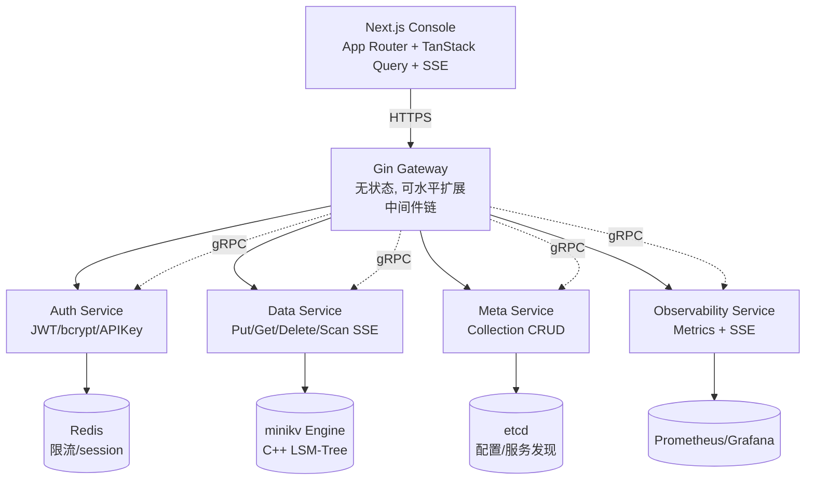

# Module 12 — Go 微服务与 Next.js 控制台

> 对应规划：REFACTORING.md Phase 3（Gateway + Auth）、Phase 4（Data/Meta/Observability + Go SDK）、Phase 6（Next.js 控制台）
> 当前状态：`gateway/ services/ web/` 仅有 `.gitkeep`，本模块作为「蓝图课程」，对照规划讲解设计与代码骨架，后续 Phase 落地后回填实战章节。
> 参考资料：Gin 官方文档、JWT RFC 7519、bcrypt 论文、Redis 官方 Lua 脚本指南、Next.js App Router 文档、TanStack Query 文档

## 背景与动机

走到 Module 12，我们的 minikv 引擎和 skynet 网络层都已经成型，但它们还是「裸」的——没有认证、没有限流、没有监控、没有控制台。如果你把这样一个服务直接暴露到公网，几小时内就会被扫描器打穿；如果让运维同学纯靠命令行运维，排查问题全靠 grep 日志，效率会低到不可接受。一个真正能上生产的系统，需要的是一整套微服务生态：网关、认证、数据服务、元数据服务、可观测性、前端控制台。

这就是为什么我们要把视角从 C++ 拉到全栈：Gateway 用 Gin 做无状态网关，中间件链像洋葱一样层层包裹请求；认证三件套 JWT + Refresh Token + API Key，分别服务人类用户、长期会话和机器对机器；限流用 Redis + Lua 实现原子令牌桶，抗住突发流量；前端用 Next.js App Router 做 RSC 首屏 + TanStack Query 客户端实时数据，仪表盘用 SSE 推送指标。这一套组合拳背后有深刻的权衡——为什么 JWT 取代了 session（无状态、易水平扩展）、为什么 SSE 比 WebSocket 更适合指标推送（单向、HTTP 友好、CDN 兼容）、为什么元数据用 etcd 而非 Redis（强一致 vs 异步复制）。

学完这一模块，你会在面试里能讲清楚：前后端分离的本质是什么、bcrypt 为什么比 SHA256 更适合存密码、令牌桶为什么必须用 Lua 保证原子性、RBAC 三级模型怎么设计。更重要的是，你会理解一个分布式系统「从引擎到产品」的全链路是怎么搭起来的——这恰恰是高级工程师区别于「只会写某一层代码」的分水岭。

## 1. 核心知识

- **微服务拓扑**：Gateway（无状态）→ Auth / Data / Meta / Observability 服务（业务）→ minikv 存储引擎 + etcd 配置中心。
- **Gin 中间件链**：`RequestID → Logger → Recover → RateLimit → Auth → RBAC → Handler`，洋葱模型。
- **认证三件套**：JWT（Access Token 短期）+ Refresh Token（长期，Redis 存储）+ API Key（机器对机器，可吊销）。
- **密码哈希**：bcrypt（cost=12），盐内置，抗彩虹表与暴力破解。
- **限流**：Redis + Lua 实现令牌桶，原子 CAS，分布式生效。
- **RBAC**：User → Role → Permission 三级，权限以 `resource:action` 表达（如 `kv:put`、`collection:create`）。
- **Data 服务**：封装 minikv，Scan 用 SSE（Server-Sent Events）流式返回，避免大结果集阻塞。
- **Meta 服务**：Collection 元数据 CRUD，etcd watch 实现配置热更新。
- **Go SDK**：typed errors（`ErrNotFound`、`ErrConflict`）、指数退避重试、context 透传。
- **Next.js App Router**：RSC（React Server Components）做静态渲染，TanStack Query 做客户端数据缓存与重试。
- **实时仪表盘**：SSE 推送 QPS / 延迟 / 存储用量 / 节点状态，shadcn/ui 图表展示。

## 2. 内容详解

### 2.1 微服务总体架构



设计原则：

- **无状态 Gateway**：所有会话状态外置到 Redis，Gateway 可水平扩展。
- **服务间通信用 gRPC**（内部高效），对外用 REST/SSE（友好）。
- **etcd 双角色**：服务注册发现 + 配置中心（Collection 元数据）。
- **观测三件套**：Prometheus（metrics）+ Jaeger（tracing）+ Loki（logs）。

### 2.2 Gin 中间件链（洋葱模型）

```mermaid
flowchart LR
    Req[HTTP 请求] --> RID[RequestID<br/>注入 X-Request-ID]
    RID --> Log1[Logger<br/>记录开始时间]
    Log1 --> Rec[Recover<br/>捕获 panic]
    Rec --> RL[RateLimit<br/>Redis 令牌桶]
    RL --> Auth[Auth<br/>JWT/APIKey 校验]
    Auth --> RBAC[RBAC<br/>角色权限检查]
    RBAC --> Handler[业务 Handler]
    Handler --> RBAC2[RBAC 后置]
    RBAC2 --> Auth2[Auth 后置]
    Auth2 --> RL2[RateLimit 后置]
    RL2 --> Rec2[Recover 后置]
    Rec2 --> Log2[Logger<br/>记录耗时/状态]
    Log2 --> RID2[RequestID<br/>写回响应头]
    RID2 --> Resp[HTTP 响应]
```



每个中间件签名统一：

```go
func(ctx *gin.Context)  // gin.HandlerFunc
```

洋葱模型的关键：在 `c.Next()` 之前是「请求阶段」，之后是「响应阶段」。

```go
// gateway/middleware/logger.go
package middleware

import (
    "time"
    "github.com/gin-gonic/gin"
)

func Logger() gin.HandlerFunc {
    return func(c *gin.Context) {
        start := time.Now()
        path := c.Request.URL.Path

        c.Next()  // ← 进入下一层

        latency := time.Since(start)
        status := c.Writer.Status()
        log.Infof("[GIN] %3d | %13v | %s | %s",
            status, latency, c.ClientIP(), path)
    }
}
```

#### 中间件清单与职责

| 顺序 | 中间件 | 职责 | 失败行为 |
|------|--------|------|----------|
| 1 | RequestID | 注入 `X-Request-ID`（无则生成 UUID） | 必成功 |
| 2 | Logger | 记录方法/路径/状态/耗时 | 必成功 |
| 3 | Recover | 捕获 panic，返回 500 | 返回 500 |
| 4 | RateLimit | Redis 令牌桶，按 IP/UID 限流 | 返回 429 |
| 5 | Auth | 校验 JWT / API Key | 返回 401 |
| 6 | RBAC | 校验角色权限 | 返回 403 |
| 7 | Handler | 业务逻辑 | — |

#### 为什么这个顺序

- `RequestID` 必须最先：后续所有日志都能关联同一 ID，便于全链路追踪。
- `Logger` 在 `Recover` 之前：即使 panic 也能记录请求信息。
- `Recover` 在 `RateLimit` 之前：即使限流也要保护进程不崩。
- `RateLimit` 在 `Auth` 之前：未授权的恶意流量先挡掉，节省 Auth 开销。
- `Auth` 在 `RBAC` 之前：先知道「你是谁」再判断「你能干啥」。

### 2.3 Auth 服务：JWT + bcrypt + RefreshToken + APIKey

#### 2.3.1 密码哈希：bcrypt

```go
// services/auth/password.go
package auth

import "golang.org/x/crypto/bcrypt"

const bcryptCost = 12  // 2^12 ≈ 4096 轮，约 250ms

func HashPassword(plain string) (string, error) {
    h, err := bcrypt.GenerateFromPassword([]byte(plain), bcryptCost)
    return string(h), err
}

func VerifyPassword(plain, hash string) error {
    return bcrypt.CompareHashAndPassword([]byte(hash), []byte(plain))
}
```

为什么不用 MD5/SHA256：

- 单纯哈希无盐 → 彩虹表破解。
- 加盐 SHA256 → GPU 暴力破解可达 10⁹/s。
- bcrypt 自带盐 + 可调 cost → GPU 攻击成本指数级上升（cost+1 翻倍）。
- 同等场景还可选 Argon2id（抗 ASIC），bcrypt 工业成熟稳定。

#### 2.3.2 JWT 结构

JWT 三段：`Header.Payload.Signature`，base64url 编码。

```json
// Header
{"alg": "HS256", "typ": "JWT"}

// Payload（Claims）
{
  "sub": "user-uuid",          // subject = 用户 ID
  "role": "admin",             // 自定义 claim
  "exp": 1735689600,           // 过期时间
  "iat": 1735603200,           // 签发时间
  "jti": "token-uuid"          // JWT ID，用于吊销
}

// Signature
HMAC-SHA256(base64(Header) + "." + base64(Payload), secret)
```

签发与校验：

```go
// services/auth/jwt.go
package auth

import (
    "time"
    "github.com/golang-jwt/jwt/v5"
)

type Claims struct {
    UserID string `json:"sub"`
    Role   string `json:"role"`
    jwt.RegisteredClaims
}

func Sign(userID, role, secret string, ttl time.Duration) (string, error) {
    now := time.Now()
    claims := Claims{
        UserID: userID,
        Role:   role,
        RegisteredClaims: jwt.RegisteredClaims{
            ExpiresAt: jwt.NewNumericDate(now.Add(ttl)),
            IssuedAt:  jwt.NewNumericDate(now),
            Issuer:    "titan-auth",
        },
    }
    return jwt.NewWithClaims(jwt.SigningMethodHS256, claims).SignedString([]byte(secret))
}

func Parse(tokenStr, secret string) (*Claims, error) {
    claims := &Claims{}
    _, err := jwt.ParseWithClaims(tokenStr, claims, func(t *jwt.Token) (interface{}, error) {
        if _, ok := t.Method.(*jwt.SigningMethodHMAC); !ok {
            return nil, fmt.Errorf("unexpected method: %v", t.Header["alg"])
        }
        return []byte(secret), nil
    })
    return claims, err
}
```

安全要点：

- Access Token TTL 短（15-30 分钟），降低泄露风险。
- Refresh Token TTL 长（7-30 天），存 Redis 便于吊销。
- `jti` 黑名单：用户登出时把 jti 加入 Redis 黑名单，到期前剩余时间内不可用。
- 签名算法白名单：拒绝 `alg: none` 攻击（代码中显式校验 `*jwt.SigningMethodHMAC`）。

#### 2.3.3 RBAC 三级模型

```
User ──┐
       ├─► Role ──► Permission
       │           (resource:action)
       └─► 多对多
```

权限命名规范 `resource:action`：

| 权限 | 说明 |
|------|------|
| `kv:get` | 读取 KV |
| `kv:put` | 写入 KV |
| `kv:delete` | 删除 KV |
| `collection:create` | 创建 Collection |
| `collection:delete` | 删除 Collection |
| `user:manage` | 用户管理 |
| `apikey:issue` | 签发 API Key |

中间件实现：

```go
// gateway/middleware/rbac.go
package middleware

import (
    "net/http"
    "github.com/gin-gonic/gin"
)

func RBAC(requiredPerm string) gin.HandlerFunc {
    return func(c *gin.Context) {
        role, exists := c.Get("role")
        if !exists {
            c.AbortWithStatusJSON(http.StatusForbidden, gin.H{"error": "no role"})
            return
        }
        if !roleHasPermission(role.(string), requiredPerm) {
            c.AbortWithStatusJSON(http.StatusForbidden, gin.H{"error": "permission denied"})
            return
        }
        c.Next()
    }
}

// 简化示例：实际从 DB / etcd 加载
var rolePerms = map[string]map[string]bool{
    "admin":  {"kv:get": true, "kv:put": true, "kv:delete": true, "user:manage": true},
    "writer": {"kv:get": true, "kv:put": true},
    "reader": {"kv:get": true},
}

func roleHasPermission(role, perm string) bool {
    return rolePerms[role][perm]
}
```

#### 2.3.4 API Key（机器对机器）

JWT 适合人类用户（浏览器），API Key 适合服务/脚本：

- 形如 `tk_live_<random32bytes>`，前缀区分环境。
- 服务端只存 SHA256(key)，泄露数据库不暴露 Key。
- 可吊销（Redis `apikey:revoked:<sha256>` 设 TTL）。
- 可绑 IP / CIDR 白名单。
- 可绑权限子集（scope），避免全权 Key 泄露后爆炸半径过大。

```go
// services/auth/apikey.go
package auth

import (
    "crypto/rand"
    "crypto/sha256"
    "encoding/hex"
)

const keyPrefix = "tk_live_"

func IssueAPIKey() (plain string, hash string, err error) {
    buf := make([]byte, 32)
    if _, err := rand.Read(buf); err != nil {
        return "", "", err
    }
    plain = keyPrefix + hex.EncodeToString(buf)
    sum := sha256.Sum256([]byte(plain))
    hash = hex.EncodeToString(sum[:])
    return plain, hash, nil
}

// VerifyAPIKey: 校验时对入参做 SHA256，比对 DB 中存储的 hash。
```

### 2.4 Redis 令牌桶限流（Lua 原子性）

令牌桶参数：`capacity`（桶容量）、`rate`（每秒补充令牌数）。每次请求消耗 1 令牌。

为什么必须 Lua：

- 拿当前令牌数 → 计算补充 → 写回，三步必须原子。
- 若用 GET + SET 两步，并发请求会读到旧值并各自写回，导致超卖。
- Redis 单线程执行 Lua，天然原子。

```lua
-- gateway/middleware/ratelimit.lua
local key = KEYS[1]
local capacity = tonumber(ARGV[1])
local rate = tonumber(ARGV[2])
local now = tonumber(ARGV[3])
local requested = tonumber(ARGV[4])

local bucket = redis.call('HMGET', key, 'tokens', 'ts')
local tokens = tonumber(bucket[1]) or capacity
local ts = tonumber(bucket[2]) or now

-- 按经过时间补充令牌
local delta = math.max(0, now - ts)
tokens = math.min(capacity, tokens + delta * rate)

local allowed = 0
if tokens >= requested then
    tokens = tokens - requested
    allowed = 1
end

redis.call('HMSET', key, 'tokens', tokens, 'ts', now)
redis.call('EXPIRE', key, math.ceil(capacity / rate) * 2)

return allowed
```

Go 调用：

```go
// gateway/middleware/ratelimit.go
package middleware

import (
    "net/http"
    "time"
    "github.com/gin-gonic/gin"
    "github.com/redis/go-redis/v9"
)

func RateLimit(rdb *redis.Client, capacity, rate float64) gin.HandlerFunc {
    script := redis.NewScript(ratelimitLua)
    return func(c *gin.Context) {
        key := "rl:" + c.ClientIP()
        allowed, err := script.Run(c, rdb, []string{key},
            capacity, rate, time.Now().Unix(), 1).Int()
        if err != nil || allowed == 0 {
            c.AbortWithStatusJSON(http.StatusTooManyRequests, gin.H{"error": "rate limited"})
            return
        }
        c.Next()
    }
}
```

### 2.5 Data 服务：Put/Get/Delete/Scan SSE

#### 2.5.1 基本 KV 操作（封装 minikv）

```go
// services/data/handler.go
package data

import (
    "net/http"
    "github.com/gin-gonic/gin"
)

type Handler struct {
    db DB  // 接口，底层是 cgo 调 minikv 或 gRPC 调 C++ server
}

type PutReq struct {
    Key   string `json:"key" binding:"required"`
    Value string `json:"value" binding:"required"`
}

func (h *Handler) Put(c *gin.Context) {
    var req PutReq
    if err := c.ShouldBindJSON(&req); err != nil {
        c.JSON(http.StatusBadRequest, gin.H{"error": err.Error()})
        return
    }
    if err := h.db.Put([]byte(req.Key), []byte(req.Value)); err != nil {
        c.JSON(http.StatusInternalServerError, gin.H{"error": err.Error()})
        return
    }
    c.JSON(http.StatusOK, gin.H{"ok": true})
}

func (h *Handler) Get(c *gin.Context) {
    val, err := h.db.Get([]byte(c.Query("key")))
    if err != nil {
        c.JSON(http.StatusNotFound, gin.H{"error": err.Error()})
        return
    }
    c.Data(http.StatusOK, "application/octet-stream", val)
}
```

#### 2.5.2 Scan SSE 流式返回

SSE（Server-Sent Events）单向流，HTTP 长连接，`Content-Type: text/event-stream`，每条消息 `data: <json>\n\n`。适合「服务端持续推、客户端只接收」的场景，比 WebSocket 简单。

```go
// services/data/scan.go
package data

import (
    "encoding/json"
    "fmt"
    "net/http"
    "github.com/gin-gonic/gin"
)

type KVPair struct {
    Key   string `json:"key"`
    Value string `json:"value"`
}

func (h *Handler) Scan(c *gin.Context) {
    start := c.Query("start")
    end := c.Query("end")

    c.Writer.Header().Set("Content-Type", "text/event-stream")
    c.Writer.Header().Set("Cache-Control", "no-cache")
    c.Writer.Header().Set("Connection", "keep-alive")
    c.Writer.Header().Set("X-Accel-Buffering", "no")  // 禁用 Nginx 缓冲

    flusher, ok := c.Writer.(http.Flusher)
    if !ok {
        c.JSON(http.StatusInternalServerError, gin.H{"error": "no flusher"})
        return
    }

    it := h.db.NewIterator([]byte(start), []byte(end))
    defer it.Close()

    count := 0
    for it.Valid() {
        pair := KVPair{Key: string(it.Key()), Value: string(it.Value())}
        data, _ := json.Marshal(pair)
        fmt.Fprintf(c.Writer, "data: %s\n\n", data)
        flusher.Flush()
        count++
        if count%1000 == 0 {
            // 每千条检查 ctx 是否已取消（客户端断开）
            select {
            case <-c.Request.Context().Done():
                return
            default:
            }
        }
        it.Next()
    }
    fmt.Fprintf(c.Writer, "event: end\ndata: {\"count\":%d}\n\n", count)
    flusher.Flush()
}
```

要点：

- `flusher.Flush()` 每条立即推送，否则缓冲区攒满才发。
- `X-Accel-Buffering: no` 关闭 Nginx 缓冲，否则 SSE 不实时。
- 周期性检查 `ctx.Done()`，客户端断开后及时停止迭代。
- 大 Scan 必须用流式，否则一次性返回百万 KV 会 OOM。

### 2.6 Meta 服务：Collection CRUD + etcd watch

Collection（命名空间）元数据：`{name, ttl, schema, created_at, updated_at}`。

```go
// services/meta/handler.go
type Collection struct {
    Name      string            `json:"name"`
    TTL       int               `json:"ttl_seconds"`
    Schema    map[string]string `json:"schema"`
    UpdatedAt int64             `json:"updated_at"`
}
```

etcd watch 热更新：Meta 服务启动时 watch `/titan/collections/`，任何 CRUD 都写 etcd，所有 Meta 实例实时收到变更通知，更新本地缓存。

```go
// services/meta/watcher.go
package meta

import (
    "context"
    "encoding/json"
    "go.etcd.io/etcd/client/v3"
)

func (s *Service) WatchCollections(ctx context.Context) {
    rch := s.etcd.Watch(ctx, "/titan/collections/", clientv3.WithPrefix())
    for wresp := range rch {
        for _, ev := range wresp.Events {
            var c Collection
            switch ev.Type {
            case clientv3.EventTypePut:
                json.Unmarshal(ev.Kv.Value, &c)
                s.cache.Store(c.Name, c)  // sync.Map
            case clientv3.EventTypeDelete:
                s.cache.Delete(string(ev.Kv.Key))
            }
        }
    }
}
```

为什么用 etcd 而不是 Redis：

- etcd 基于 Raft，强一致；Collection 元数据「读多写少 + 强一致」场景适合。
- Redis 是异步复制，主从切换可能丢数据，不适合元数据。
- 但限流、session 这种「可丢可重建」数据用 Redis 即可。

### 2.7 Observability 服务

职责：

1. **Metrics 聚合**：从各服务 Prometheus exporter 拉取，二次聚合（如「过去 5 分钟平均 QPS」）。
2. **Health Rollup**：汇总各服务健康状态，给控制台一个总览红黄绿。
3. **Alert 路由**：触发阈值时发到 Alertmanager。

健康检查端点统一约定：`GET /healthz` 返回 `{status, version, uptime, deps: {db, redis, etcd}}`。

```go
// services/observability/health.go
type Health struct {
    Status  string         `json:"status"`           // ok / degraded / down
    Version string         `json:"version"`
    Uptime  int64          `json:"uptime_seconds"`
    Deps    map[string]string `json:"deps"`           // 每个依赖的状态
}
```

### 2.8 Go SDK：typed errors + retries

为什么 SDK 要 typed errors：

- 用户用 `errors.Is(err, ErrNotFound)` 判断，而不是字符串匹配。
- 文档化错误类型，避免「错误码散落在各处」。
- 编译期保证错误被处理。

```go
// client-go/titan/errors.go
package titan

import "errors"

var (
    ErrNotFound      = errors.New("titan: not found")
    ErrConflict      = errors.New("titan: conflict")
    ErrUnauthorized  = errors.New("titan: unauthorized")
    ErrRateLimited   = errors.New("titan: rate limited")
    ErrInternal      = errors.New("titan: internal")
)

// client-go/titan/client.go
type Client struct {
    gatewayURL string
    apiKey     string
    http       *http.Client
    maxRetries int
}

func (c *Client) Get(ctx context.Context, key string) ([]byte, error) {
    var lastErr error
    for i := 0; i <= c.maxRetries; i++ {
        val, retryable, err := c.doGet(ctx, key)
        if err == nil {
            return val, nil
        }
        if !retryable {
            return nil, err
        }
        lastErr = err
        // 指数退避 + jitter
        backoff := time.Duration(1<<uint(i)) * 100 * time.Millisecond
        jitter := time.Duration(rand.Intn(50)) * time.Millisecond
        select {
        case <-ctx.Done():
            return nil, ctx.Err()
        case <-time.After(backoff + jitter):
        }
    }
    return nil, lastErr
}
```

重试策略要点：

- **只重试幂等操作**：GET 幂等可重试，POST/PUT 不一定幂等（除非带 idempotency-key）。
- **只重试可恢复错误**：5xx、网络错误可重试；4xx（业务错误）不重试。
- **指数退避 + 抖动（jitter）**：避免「thundering herd」同时重试压垮服务。
- **总时长有上限**：避免无限重试。

### 2.9 Next.js App Router + TanStack Query

#### 2.9.1 App Router 关键概念

- **RSC（React Server Components）**：默认在服务端渲染，零 JS 发往浏览器，适合静态内容。
- **`'use client'`**：标注客户端组件，需要交互（state/effect）的组件用。
- **Layout / Page**：`app/dashboard/layout.tsx`（共享导航）+ `app/dashboard/page.tsx`（页面内容）。
- **Streaming SSR**：`<Suspense>` 包裹慢组件，服务端流式发送 HTML。

#### 2.9.2 TanStack Query 客户端数据层

RSC 适合首屏，但实时仪表盘需要客户端轮询/SSE，所以混合：

- RSC 渲染首屏骨架（SEO 友好）。
- TanStack Query 客户端接管实时数据（轮询/SSE）。

```tsx
// web/app/dashboard/page.tsx
import { MetricsCard } from '@/components/metrics-card'
import { getMetrics } from '@/lib/api'

export default async function DashboardPage() {
    const initial = await getMetrics()  // RSC 首屏
    return <MetricsCard initialData={initial} />
}
```

```tsx
// web/components/metrics-card.tsx
'use client'
import { useQuery } from '@tanstack/react-query'

export function MetricsCard({ initialData }: { initialData: Metrics }) {
    const { data } = useQuery({
        queryKey: ['metrics'],
        queryFn: () => fetch('/api/metrics').then(r => r.json()),
        initialData,
        refetchInterval: 5000,  // 5s 轮询
    })
    return <Card>...</Card>
}
```

#### 2.9.3 路由守卫（middleware.ts）

Next.js 中间件在 Edge 运行时执行，适合做路由守卫：

```ts
// web/middleware.ts
import { NextResponse } from 'next/server'
import type { NextRequest } from 'next/server'
import { jwtVerify } from 'jose'

const publicPaths = ['/login', '/api/auth']

export async function middleware(req: NextRequest) {
    const { pathname } = req.nextUrl
    if (publicPaths.some(p => pathname.startsWith(p))) {
        return NextResponse.next()
    }
    const token = req.cookies.get('titan_token')?.value
    if (!token) {
        return NextResponse.redirect(new URL('/login', req.url))
    }
    try {
        await jwtVerify(token, secret)  // 校验 JWT
        return NextResponse.next()
    } catch {
        return NextResponse.redirect(new URL('/login', req.url))
    }
}

export const config = {
    matcher: ['/((?!_next/static|_next/image|favicon.ico).*)'],
}
```

### 2.10 实时仪表盘（SSE 推送 + shadcn/ui）

后端 Observability 服务暴露 SSE 端点 `GET /api/metrics/stream`，每秒推送聚合指标：

```
event: metrics
data: {"qps": 1234, "p50_ms": 5, "p99_ms": 42, "storage_gb": 12.3}

event: metrics
data: {"qps": 1250, "p50_ms": 4, "p99_ms": 38, "storage_gb": 12.4}
```

前端用 EventSource 订阅，配合 shadcn/ui 的 Card/Chart 展示：

```tsx
// web/components/live-metrics.tsx
'use client'
import { useEffect, useState } from 'react'
import { Card, CardContent, CardHeader, CardTitle } from '@/components/ui/card'

type Metrics = { qps: number; p50_ms: number; p99_ms: number; storage_gb: number }

export function LiveMetrics() {
    const [m, setM] = useState<Metrics>({ qps: 0, p50_ms: 0, p99_ms: 0, storage_gb: 0 })

    useEffect(() => {
        const es = new EventSource('/api/metrics/stream')
        es.addEventListener('metrics', e => {
            setM(JSON.parse(e.data))
        })
        return () => es.close()
    }, [])

    return (
        <div className="grid grid-cols-4 gap-4">
            <Card>
                <CardHeader><CardTitle>QPS</CardTitle></CardHeader>
                <CardContent className="text-2xl">{m.qps}</CardContent>
            </Card>
            {/* p50 / p99 / storage 类似 */}
        </div>
    )
}
```

为什么用 SSE 而不是轮询：

- 轮询每 5 秒一次 → 平均延迟 2.5 秒，且空轮询浪费带宽。
- SSE 长连接，服务端有数据才推 → 实时性高，资源省。
- 浏览器原生支持 EventSource，无需 WebSocket 库。

为什么不用 WebSocket：

- 单向推送场景，WebSocket 双向能力浪费。
- WebSocket 走 HTTP Upgrade，部分中间设备（旧代理）兼容性差。
- SSE 走普通 HTTP，CDN/反向代理友好。

## 3. 思考题

1. 中间件链中 `Recover` 放在 `Logger` 之前还是之后？为什么？
2. JWT 的 `exp` 设 1 小时还是 24 小时？Refresh Token 又该多长？权衡是什么？
3. 为什么 JWT 不能直接做「登出」？要怎么实现真正的登出？
4. bcrypt cost 设 12 还是 14？增大 cost 对用户体验和安全性各有什么影响？
5. 令牌桶 vs 漏桶：哪个更适合「突发流量」？哪个更适合「匀速消费」？
6. 限流为什么按 IP 之外还要按 UID？只用 IP 会有什么漏洞？
7. SSE 流式 Scan 中，如果客户端断开，服务端怎么感知？不及时停止会有什么后果？
8. etcd 和 Redis 都能做配置中心，为什么 TitanKV 元数据用 etcd 而非 Redis？
9. Next.js RSC 和 SSR、CSR 的区别？为什么 RSC 适合「首屏 + 实时数据」混合场景？
10. Go SDK 重试为什么必须区分幂等 / 非幂等？PUT `/kv/foo` 是否幂等？
11. API Key 为什么存 SHA256 而不是直接存原值？服务端校验流程是什么？
12. RBAC vs ABAC：基于角色 vs 基于属性，分别适合什么场景？

## 4. 动手题

### 题 1：实现一个最简 Gin 中间件链

要求：
- 实现 `RequestID` / `Logger` / `Recover` 三个中间件。
- RequestID：从 `X-Request-ID` 取，没有则生成 UUID，写入 `c.Set("request_id", ...)`。
- Logger：打印 `[request_id] method path status latency`。
- Recover：捕获 panic 返回 500，并打印堆栈。
- 写一个 `/ping` handler 返回 `{"pong": true}`，验证中间件链。

### 题 2：JWT 签发与校验

要求：
- 实现 `Sign(userID, role, secret, ttl) (token string, err error)`。
- 实现 `Parse(token, secret) (*Claims, error)`，必须显式校验签名算法（拒绝 `alg: none`）。
- 写测试：签发 → 解析 → 校验 claims 正确。
- 写测试：篡改 payload 后解析应失败。

### 题 3：Redis 令牌桶限流

要求：
- 写一个 Lua 脚本实现令牌桶（capacity=10, rate=1/s）。
- Go 调用：`RateLimit(rdb, 10, 1)` 中间件。
- 单元测试：连续 11 次请求，前 10 次通过，第 11 次 429。
- 集成测试：等 1 秒后再请求，应通过（令牌补充）。

### 题 4：SSE Scan 迭代器

要求：
- 模拟一个 `DB` 接口，返回 1 万条 KV。
- 实现 `Scan` handler 用 SSE 流式返回，每 1000 条检查 ctx 取消。
- 客户端用 `curl -N` 接收，验证流式输出。
- 测试：客户端中途 Ctrl+C，服务端应在 1000 条内停止迭代。

### 题 5：Next.js 路由守卫 + 首屏 + 实时数据

要求：
- 用 Next.js App Router 创建 `/dashboard` 页面。
- `middleware.ts` 校验 cookie `titan_token`，未登录跳转 `/login`。
- RSC 渲染首屏 metrics（模拟 fetch）。
- 客户端组件用 TanStack Query 每 5 秒轮询更新。
- 验证：首屏 HTML 已包含数据（查看源代码），后续自动刷新。

### 题 6：Go SDK typed errors + 重试

要求：
- 定义 `ErrNotFound` / `ErrRateLimited` / `ErrInternal`。
- 实现 `Client.Get(ctx, key)`，对 429 / 5xx 指数退避重试（最多 3 次）。
- 单元测试：mock HTTP 返回 429 三次后 200，验证最终成功且耗时 ≥ 退避和。
- 单元测试：mock 返回 404，验证立即返回 `ErrNotFound` 不重试。

## 5. 自检

<details>
<summary>题 1 答案</summary>

`Recover` 应在 `Logger` 之后。Logger 先注册 → 进入「请求阶段」记录请求信息 → `c.Next()` → `Recover` 在内层捕获 panic → `Logger` 的 `c.Next()` 之后记录响应。这样即使 handler panic，Logger 仍能记录到状态码 500。但要注意：`Recover` 必须 `c.Next()` 之前的逻辑捕获，所以实际写法上 Logger 在外层、Recover 在内层；两者顺序通过注册顺序控制：`router.Use(Logger(), Recover())`。
</details>

<details>
<summary>题 2 答案</summary>

Access Token TTL 应短（15-30 分钟），泄露后窗口期短；Refresh Token TTL 长（7-30 天），存 Redis 可主动吊销。JWT 无状态使其无法「真正登出」（即使服务端删除 token，持有者仍能用直到 exp），所以靠 `jti` 黑名单：登出时把 jti 加入 Redis，TTL = token 剩余有效期，每次请求查黑名单。
</details>

<details>
<summary>题 3 答案</summary>

cost=12 约 250ms，cost=14 约 1s。用户体验：cost 高 → 登录慢。安全性：cost+1 翻倍成本，GPU 攻击也指数级变难。一般选 12-14，并随硬件升级定期评估。生产环境可异步 bcrypt（goroutine + channel）避免阻塞请求。
</details>

<details>
<summary>题 4 答案</summary>

令牌桶允许突发（桶满时一次性消耗多个令牌），适合「平均速率限制但允许突发」场景；漏桶匀速输出，适合「下游处理能力固定」场景（如调外部 API）。TitanKV Gateway 限流用令牌桶：允许短时突发（如批量脚本），但长期均值不超过 rate。
</details>

<details>
<summary>题 5 答案</summary>

只按 IP 限流会被 NAT 后的大量用户互相影响（公司网络共享 IP 被封）；且攻击者可用代理池绕过。应叠加 UID 限流：未登录按 IP，登录后按 UID，API Key 按 key hash。多层限流各防不同滥用。
</details>

<details>
<summary>题 6 答案</summary>

服务端通过 `c.Request.Context().Done()` 感知客户端断开（HTTP 长连接关闭后 ctx 被取消）。不及时停止：迭代器继续读 minikv 占 CPU/IO，且写 SSE 缓冲无人读 → 内存增长 → OOM。本模块代码每 1000 条检查一次 ctx，平衡检查开销与响应速度。
</details>

<details>
<summary>题 7 答案</summary>

etcd 基于 Raft 强一致，写入需多数派持久化；Redis 主从异步复制，故障切换可能丢数据。元数据（Collection 配置）丢失会导致业务异常，必须强一致 → etcd。限流计数、session 这种「丢一两条无所谓」的数据用 Redis 性能更高。
</details>

<details>
<summary>题 8 答案</summary>

- **CSR（Client-Side Rendering）**：浏览器下载空 HTML + JS，JS 渲染。首屏慢，SEO 差。
- **SSR（Server-Side Rendering）**：服务端渲染完整 HTML 发送。首屏快，SEO 好，但每次请求都渲染，无静态优化。
- **RSC（React Server Components）**：组件在服务端运行，零 JS 发往浏览器（除交互部分）。比 SSR 进一步：可流式、可静态化、可缓存。
- **混合场景**：RSC 渲染首屏（SEO 友好、首屏快），客户端组件用 TanStack Query 接管实时数据（轮询/SSE），两全其美。
</details>

<details>
<summary>题 9 答案</summary>

幂等操作：多次执行结果相同（GET、DELETE、PUT 同一值）。非幂等：POST 创建资源每次产生新 ID。重试非幂等操作会重复创建/修改，必须用 `Idempotency-Key` 头标识，服务端去重。`PUT /kv/foo` 同一 value 是幂等的，可重试；但若 value 不同则非幂等，需用户自行控制。
</details>

<details>
<summary>题 10 答案</summary>

存原值：数据库泄露即所有 Key 泄露。存 SHA256：泄露后攻击者无法反推原 Key（单向函数），且校验时对入参做 SHA256 比对即可。校验流程：`plain → SHA256(plain) → 与 DB 中 hash 比对`。注意 SHA256 仅防「数据库泄露」，防不住「原 Key 在传输中泄露」（需 HTTPS）。
</details>

<details>
<summary>题 11 答案</summary>

- **RBAC**：基于角色，适合「角色少、权限相对固定」场景（如 admin/writer/reader）。简单、易管理。
- **ABAC**：基于属性（用户属性 + 资源属性 + 环境属性），适合「细粒度动态策略」（如「仅工作时间可访问」、「仅本人创建的资源可改」）。灵活但复杂。
- TitanKV 初期用 RBAC 足够，后期如需「Collection 级权限」「IP 白名单」可演进到 ABAC。
</details>

<details>
<summary>题 12（SSE vs WebSocket vs 轮询）对比</summary>

| 方案 | 方向 | 协议 | 实时性 | 复杂度 | 适用 |
|------|------|------|--------|--------|------|
| 轮询 | 客户端拉 | HTTP | 低（秒级延迟） | 低 | 简单、低频 |
| SSE | 服务端推 | HTTP | 高 | 中 | 单向推送（仪表盘、日志流） |
| WebSocket | 双向 | WS | 高 | 高 | 双向通信（聊天、协作） |

TitanKV 仪表盘只需服务端推指标 → SSE 最优。
</details>
