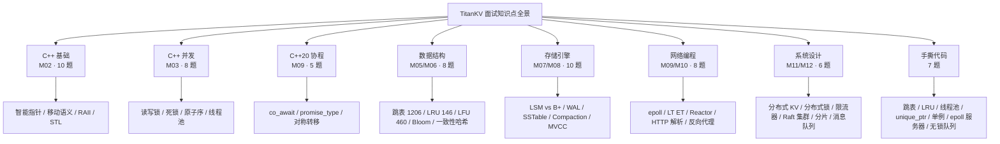

# Module 13 — 系统设计与面试题汇总解析

> 题源：LeetCode 真题（1206/146/460/707/380/381）、牛客面经、CSDN 大厂汇总、TiKV/RocksDB 官方文档、etcd Raft 文档、Stanford CS244b、LevelDB 源码注释
> 项目映射：每题标注对应 TitanKV 模块，便于「以题带学」

## 背景与动机

走到这里，我们已经把 TitanKV 从跳表、布隆过滤器、LSM-Tree、Compaction、epoll 协程、HTTP 代理、Raft 分片一路讲到 Go 微服务和 Next.js 控制台。这些模块单独看都是硬核知识点，但面试官不会按模块出题——他们会把 C++ 基础、并发、数据结构、存储引擎、网络、系统设计揉在一起，还会让你在白板上 10 分钟手撕一个跳表或 LRU。这就是为什么我们需要一个「收口」模块，把散落的知识串成一张可应试的网。

面试和做项目是两种不同的能力：做项目讲究深度和工程权衡，面试讲究「在有限时间里把关键点讲清楚、把代码写对」。LeetCode 1206 的跳表、146 的 LRU、460 的 LFU 看似是算法题，其实都在考你对 minikv MemTable、LRUCache 的理解；系统设计题「设计一个分布式 KV」更是直接对应 TitanKV 本身。我们这一模块要做的，就是把每个面试题映射回它对应的 TitanKV 模块，让你「以题带学、以学应题」。

学完这一模块，你会拿到一份覆盖 60+ 真题的应试地图：C++ 基础与并发怎么答、LSM 和 B+ 树怎么对比、Raft 选举和日志复制怎么画图、系统设计五步法怎么套用。更重要的是，你会学会怎么把 TitanKV 这段项目经历讲成简历上的亮点——不是堆砌技术名词，而是用 STAR 讲清「我遇到什么问题、做了什么、量化结果如何」。

## 1. 核心知识

- **白板编码四步法**：①澄清需求（边界、规模、并发）→ ②数据结构与算法选择 + 复杂度估算 → ③写代码（先签名再实现）→ ④测试用例 + 优化讨论。
- **系统设计五步法**（DDIA 风格）：①需求澄清（功能/非功能）→ ②容量估算（QPS/存储/带宽）→ ③接口与数据模型 → ④架构草图（组件 + 数据流）→ ⑤瓶颈与扩展。
- **复杂度速记**：跳表 O(log n) 期望；BloomFilter O(k)；LSM-Tree 写 O(log n)、读 O(log n + bloom)；Raft 多数派 quorum = ⌊N/2⌋+1。
- **分布式 CAP 三选二**：CP（如 etcd/ZK）vs AP（如 Cassandra）vs CA（单机）。TitanKV 元数据 CP，限流 AP。
- **面试三件套**：自我介绍（项目 STAR）、白板题（前述四步）、反问环节（团队/技术栈/晋升）。
- **手撕常考**：跳表、LRU、LFU、线程池、智能指针、单例、epoll 服务器、生产消费队列、无锁队列、限流器。

---

## 2. 内容详解（8 大主题 · 60+ 真题）

### 面试知识点全景图



每个主题都对应 TitanKV 的一个或多个模块，复习时可按「模块 → 面试题」的路径回溯到源码实现。

### 2.1 C++ 基础（10 题）

**Q1.** `int* p, q;` 中 `p` 和 `q` 的类型分别是什么？为什么？

**A1.** `p` 是 `int*`，`q` 是 `int`。指针修饰符 `*` 跟变量名而非类型，是 C 遗留语法。现代 C++ 推荐每个指针变量单独一行：`int* p; int q;`。

**Q2.** 虚函数与纯虚函数的区别？虚析构函数为什么必要？

**A2.**
- 虚函数：派生类可 override，运行期分派。
- 纯虚函数：`= 0`，类变抽象，必须由派生类实现。
- 虚析构函数必要：`Base* p = new Derived(); delete p;` 若 `~Base()` 非虚，只调 `~Base()`，派生类资源泄漏。规则：当作基类的类，析构要么 virtual，要么 protected non-virtual。

**Q3.** 智能指针四种：`unique_ptr` / `shared_ptr` / `weak_ptr` / `auto_ptr`，各自用途与坑？

**A3.**

| 指针 | 所有权 | 计数 | 坑 |
|------|--------|------|----|
| `unique_ptr` | 独占 | 无 | 不能复制，只能 move |
| `shared_ptr` | 共享 | 引用计数（原子） | 循环引用 → 内存泄漏 |
| `weak_ptr` | 不拥有 | 不增加计数 | 解锁 shared_ptr 循环引用 |
| `auto_ptr`（C++17 移除） | 独占 | 无 | 复制时转移所有权，易误用 |

**Q4.** 移动语义与完美转发：`std::move` 做了什么？`T&&` 是右值引用还是万能引用？

**A4.**
- `std::move` 是无类型转换的 `static_cast<T&&>`，仅把左值强转为右值引用，**不移动任何东西**，真正移动发生在移动构造/赋值函数内。
- `T&&` 在模板推导上下文中是万能引用（forwarding reference），可绑左值也可绑右值；非模板上下文（如 `void f(int&&)`）是纯右值引用。
- `std::forward<T>(arg)` 根据 T 保持值类别，是完美转发的核心。

**Q5.** RAII 是什么？为什么是 C++ 资源管理的灵魂？

**A5.** RAII（Resource Acquisition Is Initialization）：资源获取即初始化，资源生命周期绑定到对象生命周期——构造时获取，析构时释放。优势：
- 异常安全：栈展开自动调析构。
- 无需手动 free，避免泄漏。
- 离开作用域即释放，无需 GC。
- minikv 中 `std::shared_mutex lock` 守护 SkipList，`std::lock_guard` 守护 ThreadPool 队列，都是 RAII。

**Q6.** STL `vector` 扩容机制？`reserve` 与 `resize` 区别？为什么 `vector` 增长是 2 倍或 1.5 倍？

**A6.**
- 扩容：size 超 capacity 时分配新内存（一般 2 倍或 1.5 倍），拷贝/移动旧元素，释放旧内存。均摊 O(1)。
- `reserve(n)`：只改 capacity，不创建对象。`resize(n)`：改 size，多则默认构造，少则析构。
- 2 倍：扩容次数少但空间浪费。1.5 倍：扩容次数多但旧空间可被新空间复用（Fibonacci 增长）。libc++ 用 2 倍，libstdc++ 用 2 倍，MSVC 用 1.5 倍。

**Q7.** `map` vs `unordered_map`：底层数据结构、复杂度、迭代顺序？

**A7.**

| 项 | `map` | `unordered_map` |
|---|---|---|
| 底层 | 红黑树 | 哈希表（链地址） |
| 查找 | O(log n) | 平均 O(1)，最坏 O(n) |
| 有序 | 是（按键升序） | 否 |
| 内存 | 节点指针，开销大 | 桶 + 链表/红黑树 |
| 何时选 | 需要顺序 / 范围查询 | 仅点查 |

**Q8.** `inline` 函数的真正作用？放在头文件中是否会 ODR 冲突？

**A8.** 现代 C++ 中 `inline` 主要不是「内联」，而是允许「多重定义」（ODR 豁免）。多个翻译单元包含同一 `inline` 函数定义不会冲突，链接器选一份即可。`constexpr`、模板函数默认 inline。类内定义的成员函数也默认 inline。

**Q9.** `enum class` 相比 `enum` 的优势？minikv 中怎么用？

**A9.** `enum class`（强类型枚举）优势：
- 不会隐式转 int，避免 `if (color == 1)` 这种坑。
- 不会污染外层命名空间。
- 可前向声明。
- minikv [status.h](file:///c:/Users/Administrator/Desktop/hellocpp/minikv/include/minikv/status.h) 用 `enum class StatusCode`，[parser.h](file:///c:/Users/Administrator/Desktop/hellocpp/skynet/include/skynet/http/parser.h) 用 `enum class State`、`enum class ParseResult`。

**Q10.** `[[nodiscard]]` / `[[fallthrough]]` / `[[maybe_unused]]` 三个属性的作用与场景？

**A10.**
- `[[nodiscard]]`：返回值不可丢弃。`[[nodiscard]] Status Open(...);` 提醒调用者检查错误。
- `[[fallthrough]]`：switch 显式贯穿。minikv [hash.h](file:///c:/Users/Administrator/Desktop/hellocpp/minikv/src/utils/hash.h) MurmurHash2 中 size 分支显式 fallthrough。
- `[[maybe_unused]]`：抑制未使用警告，常用于条件编译变量。

---

### 2.2 C++ 并发（8 题）

**Q11.** `std::mutex` vs `std::shared_mutex`：什么时候用读写锁？读写锁一定比互斥锁快吗？

**A11.**
- `std::mutex`：独占，任何时刻一个线程持有。
- `std::shared_mutex`（C++17）：读可共享，写独占。
- 适合「读多写少」（如 SkipList 查询多、写少）。
- 不一定快：写多读少场景读写锁反而退化（写饥饿、计数器开销）。minikv SkipList 用 `shared_mutex` 因为查询 >> 写入。

**Q12.** 死锁的四个必要条件？怎么预防？

**A12.** 互斥、占有等待、不可剥夺、循环等待。预防：
- 破坏占有等待：一次性申请所有资源。
- 破坏循环等待：所有锁按全局顺序加锁。
- 用 `std::lock(m1, m2)` 一次性获取多锁（避免死锁算法）。
- 用 `std::scoped_lock` RAII 包装。

**Q13.** `std::atomic` 的六种内存序？默认 `memory_order_seq_cst` 为什么慢？

**A13.**
- `relaxed`：无同步，仅原子。
- `consume`/`acquire`：读端，禁止后续重排到此操作之前。
- `release`：写端，禁止前面重排到此操作之后。
- `acq_rel`：读改写都用 acquire/release。
- `seq_cst`：全局总顺序，最强但最慢（需 CPU fence + 全局总线锁）。
- 默认 seq_cst 慢：每次都需 fence，阻止 CPU 乱序优化。

**Q14.** condition_variable 为什么必须配合锁与谓词？虚假唤醒是什么？

**A14.**
- cv 不带数据，必须用锁保护共享状态（队列/标志），谓词判断条件是否满足。
- 虚假唤醒：`wait` 可能在没有 notify 时返回（OS 实现允许），所以必须用谓词 `wait(lock, pred)` 循环判断。
- minikv [thread_pool.h](file:///c:/Users/Administrator/Desktop/hellocpp/minikv/src/utils/thread_pool.h) 用 `cv_.wait(lock, [this]{ return !queue_.empty() || stop_; })`。

**Q15.** 线程池核心要素？minikv ThreadPool 怎么停机？

**A15.** 核心：任务队列、工作线程、互斥锁+条件变量、停止标志。minikv 实现：
- `std::vector<std::thread>` 工作线程，`std::queue` 任务，`mutex` + `cv` 保护。
- `stop_` 是 `atomic<bool>`。
- `stop()` 设 `stop_=true`，notify_all，所有线程 join。
- 谓词 wait 防虚假唤醒。

**Q16.** `std::async` vs `std::thread`？`std::launch::async` 与 `std::launch::deferred` 区别？

**A16.**
- `std::thread`：必须手动 join/detach，异常会 std::terminate。
- `std::async`：返回 future，自动管理，异常存 future。
- `launch::async`：立即在新线程执行。
- `launch::deferred`：延迟到 `future.get()` 才在同线程执行。
- 默认 `async | deferred`：实现自行选择，不可靠。

**Q17.** 原子操作能完全替代锁吗？

**A17.** 不能：
- 原子适合「单一变量」的读改写（计数器、标志）。
- 多变量一致性仍需锁（如「先查后插」原子无法保证）。
- 无锁数据结构（如 lock-free queue）实现复杂，ABA 问题、内存回收难。
- 实践中：能用原子用原子，复杂逻辑用锁，避免「无锁崇拜」。

**Q18.** TLS（thread_local）的作用？minikv 在哪用？

**A18.** `thread_local` 每个线程独立副本，无锁访问。minikv [skip_list.h](file:///c:/Users/Administrator/Desktop/hellocpp/minikv/src/core/skip_list.h) 用 `thread_local std::mt19937` 做 RNG，避免每个 SkipList 实例都持一个生成器，也避免锁竞争。

---

### 2.3 C++20 协程（5 题）

**Q19.** `co_await` / `co_yield` / `co_return` 各自语义？

**A19.**
- `co_return`：协程返回值，调 `promise_type::return_value`。
- `co_yield expr`：等价 `co_await promise.yield_value(expr)`，暂停并产出值。
- `co_await expr`：等待一个 awaitable，调 `await_ready/await_suspend/await_resume`，可能暂停协程并让出执行权。

**Q20.** `promise_type` 是什么？四个必需方法？

**A20.** `promise_type` 是协程「承诺」接口，控制协程行为。四个必需方法：
- `get_return_object()`：构造返回给调用者的对象（如 `Task`）。
- `initial_suspend()`：协程启动时是否立即暂停（`suspend_always` 惰性、`suspend_never` 急性）。
- `final_suspend()`：协程结束时是否暂停（用 `final_awaiter` 实现对称转移）。
- `return_value(T)` / `return_void()`：协程返回时调。
- `unhandled_exception()`：异常处理（存 `exception_ptr`）。

**Q21.** 对称转移（Symmetric Transfer）解决什么问题？

**A21.** 嵌套 `co_await` 会栈式累积协程帧，深层递归会爆栈。对称转移通过 `await_suspend` 返回 `coroutine_handle` 而非 `void/bool`，让被挂起的协程直接「跳转」到下一个协程，而非返回到调用链上层，保持栈深度 O(1)。skynet [task.h](file:///c:/Users/Administrator/Desktop/hellocpp/skynet/include/skynet/core/task.h) 的 `final_awaiter::await_suspend` 即用对称转移。

**Q22.** 无栈协程 vs 有栈协程？

**A22.**

| 项 | 无栈（C++20） | 有栈（goroutine/libco） |
|---|---|---|
| 栈 | 状态机，无独立栈 | 独立栈 |
| 切换 | 编译器生成状态机 | 保存/恢复寄存器 |
| 内存 | 仅 promise + 局部 | 每协程一份栈 |
| 嵌套 | 需对称转移防爆栈 | 天然支持 |
| 启动 | 0 字节栈开销 | 默认 8KB 栈 |

**Q23.** Executor 是什么？为什么需要？

**A23.** 协程恢复需要调度器决定「在哪个线程恢复」。`std::suspend_always` 不指定恢复线程，由谁调 `resume()` 决定。Executor 抽象调度策略（同线程 / 线程池 / IO 线程）。skynet [executor.h](file:///c:/Users/Administrator/Desktop/hellocpp/skynet/include/skynet/core/executor.h) 即协程调度器，把可恢复协程投递到线程池。

---

### 2.4 数据结构（含 LeetCode 真题，8 题）

**Q24.** **LeetCode 1206** 设计跳表。实现 `search` / `add` / `erase`，期望 O(log n)。

**A24.** 设计：
- 节点 `{val, forward[MAX_LEVEL]}`，forward[i] 指向第 i 层的下一个节点。
- 头节点 `head` 是 dummy，所有层 forward 都从 head 出发。
- 查找：从最高层往右走，遇到比 target 大就下降。
- 插入：随机层数（`p=0.5`，`max=16`），记录每层插入位置的前驱，更新 forward。
- 删除：同查找，更新前驱 forward。
- minikv [skip_list.h](file:///c:/Users/Administrator/Desktop/hellocpp/minikv/src/core/skip_list.h) 是工程版（带 InternalKey 比较、shared_mutex、thread_local RNG），可作为参考实现。

骨架（LeetCode 风格）：

```cpp
class Skiplist {
    struct Node { int val; vector<Node*> forward; Node(int v, int lv):val(v),forward(lv,nullptr){} };
    static const int kMaxLevel = 16;
    Node* head_;
    int randomLevel() { int lv=1; while((rand()&1) && lv<kMaxLevel) ++lv; return lv; }
public:
    Skiplist(): head_(new Node(0, kMaxLevel)) {}
    bool search(int target) {
        Node* cur = head_;
        for (int i = kMaxLevel-1; i >= 0; --i) {
            while (cur->forward[i] && cur->forward[i]->val < target) cur = cur->forward[i];
        }
        cur = cur->forward[0];
        return cur && cur->val == target;
    }
    void add(int num) {
        vector<Node*> update(kMaxLevel, head_);
        Node* cur = head_;
        for (int i = kMaxLevel-1; i >= 0; --i) {
            while (cur->forward[i] && cur->forward[i]->val < num) cur = cur->forward[i];
            update[i] = cur;
        }
        int lv = randomLevel();
        Node* n = new Node(num, lv);
        for (int i = 0; i < lv; ++i) {
            n->forward[i] = update[i]->forward[i];
            update[i]->forward[i] = n;
        }
    }
    bool erase(int num) {
        vector<Node*> update(kMaxLevel, head_);
        Node* cur = head_;
        for (int i = kMaxLevel-1; i >= 0; --i) {
            while (cur->forward[i] && cur->forward[i]->val < num) cur = cur->forward[i];
            update[i] = cur;
        }
        cur = cur->forward[0];
        if (!cur || cur->val != num) return false;
        for (int i = 0; i < kMaxLevel; ++i) {
            if (update[i]->forward[i] != cur) break;
            update[i]->forward[i] = cur->forward[i];
        }
        delete cur;
        return true;
    }
};
```

**Q25.** **LeetCode 146** LRU Cache。`get` / `put` O(1)。

**A25.** 哈希表 + 双向链表。哈希表 O(1) 查节点，双向链表 O(1) 移到头部 / 删尾部。minikv [lru_cache.h](file:///c:/Users/Administrator/Desktop/hellocpp/minikv/src/utils/lru_cache.h) 用 `unordered_map + list` 组合，本质相同。

```cpp
class LRUCache {
    int cap_;
    list<pair<int,int>> l_;                       // front = recent
    unordered_map<int, list<pair<int,int>>::iterator> m_;
    void touch(int key) { auto kv = *m_[key]; l_.erase(m_[key]); l_.push_front(kv); m_[key] = l_.begin(); }
public:
    LRUCache(int capacity):cap_(capacity){}
    int get(int key) {
        if (!m_.count(key)) return -1;
        touch(key);
        return m_[key]->second;
    }
    void put(int key, int value) {
        if (m_.count(key)) { m_[key]->second = value; touch(key); return; }
        if ((int)l_.size() == cap_) { m_.erase(l_.back().first); l_.pop_back(); }
        l_.push_front({key, value});
        m_[key] = l_.begin();
    }
};
```

**Q26.** **LeetCode 460** LFU Cache。`get` / `put` O(log n) 或 O(1)。

**A26.** 思路：维护 `freq → 双向链表`（同频次按 LRU 排），`key → Node` 映射。访问时把节点移到 `freq+1` 链表头。淘汰时取最小 freq 链表的尾节点。

**Q27.** 跳表 vs 红黑树 vs B+ 树？

**A27.**

| 数据结构 | 查找 | 范围查询 | 实现复杂度 | 并发友好 |
|---|---|---|---|---|
| 跳表 | O(log n) 期望 | 优 | 简单 | 优（局部锁） |
| 红黑树 | O(log n) 最坏 | 中 | 复杂（旋转/重染色） | 差（旋转影响多节点） |
| B+ 树 | O(log_B n) | 优（叶子链） | 中 | 中（节点大，锁粒度大） |

LSM-Tree 选 SkipList 做 MemTable：实现简单、范围扫描友好、并发锁粒度小。

**Q28.** 布隆过滤器误判率公式？为什么会有「假阳性」但不会有「假阴性」？

**A28.**
- 误判率 `p ≈ (1 - e^(-kn/m))^k`，最优 `k = (m/n)·ln2`，此时 `p ≈ (0.6185)^(m/n)`。
- 假阳性：未在集合中的 key 被 k 个哈希位都误置 1，判为「存在」。
- 无假阴性：已加入的 key 把 k 个位置 1，查询时这 k 位必然仍为 1，判「存在」正确（除非位被误清，但标准 BF 不清位）。
- 工程含义：BF 用于「过滤大部分不存在的 key」，剩少量误判靠真实查询兜底。

**Q29.** 一致性哈希为什么需要虚拟节点？

**A29.** 节点少时数据倾斜严重（如 3 节点，哈希环上分布不均，某节点可能拿 60% key）。虚拟节点：每物理节点对应 150-200 个虚拟节点，哈希环上分布更均匀。skynet [load_balancer.h](file:///c:/Users/Administrator/Desktop/hellocpp/skynet/include/skynet/proxy/load_balancer.h) `ConsistentHashLB(vnodes=160)`。

**Q30.** MurmurHash2 vs SHA1/CRC32？为什么 LSM-Tree 内部用 MurmurHash2？

**A30.**
- SHA1：加密哈希，慢，抗碰撞。LSM 内部不需要抗碰撞。
- CRC32：错误检测，分布不均，慢。
- MurmurHash2：非加密，分布均匀，极快（~1 cycle/byte）。minikv BloomFilter 与 InternalKey 都用它。

**Q31.** **LeetCode 707** 设计双向链表 + **LeetCode 380** Insert Delete GetRandom O(1)。两者结合可以做什么？

**A31.** 双向链表是 LRU/LFU 底层；GetRandom O(1) 用「数组 + 值到索引的 map」，删除时把待删元素与末尾交换再 pop。组合可做「带随机访问的 LRU」。

---

### 2.5 存储引擎（10 题）

**Q32.** LSM-Tree vs B+ Tree：写多读多各选什么？为什么？

**A32.**
- LSM-Tree：写优。写只追加 MemTable（内存 + WAL），顺序 IO，写吞吐高。读需查多层 SSTable + Bloom，读放大。
- B+ Tree：读优。点查一次树遍历，叶节点有序。写需分裂/合并，随机 IO，写放大。
- 写多场景（日志、监控、消息）用 LSM；读多场景（关系数据库、OLTP）用 B+。
- RocksDB / Cassandra / HBase 用 LSM；MySQL InnoDB / PostgreSQL 用 B+。

**Q33.** WAL 为什么必要？fsync 时机如何选？

**A33.**
- WAL（Write-Ahead Log）：写前先记录「准备做」的操作，崩溃后重放恢复。
- 不写 WAL：MemTable 数据未刷盘，崩溃丢失。
- fsync 时机：
  - 每条都 fsync：强一致但慢（fsync ~5ms）。
  - 异步 fsync：批量提交，吞吐高，可能丢最近数据。
  - group commit：批量 fsync 一组，平衡。
  - LevelDB 默认异步，RocksDB 可配置。

**Q34.** SSTable 文件格式为什么这样设计？minikv 的格式是什么？

**A34.** 设计目标：单次顺序读、点查 O(log)、范围扫描友好、支持索引与布隆。minikv [sstable_builder.h](file:///c:/Users/Administrator/Desktop/hellocpp/minikv/src/core/sstable_builder.h) 格式：
```
[DataBlock1][DataBlock2]...[DataBlockN]
[IndexBlock]
[FilterBlock(Bloom)]
[Footer: 48 字节]
  - metaindex_handle (8)
  - index_handle (8)
  - filter_handle (8)
  - format_version (1)
  - padding
  - magic 0x4D4B53535441424C
```
DataBlock：`[crc(4)][physical_size(4)][uncompressed_size(4)][type(1)][payload]`，type=0 raw / 1 snappy / 2 zstd。

**Q35.** Compaction 三种放大？Leveled vs Tiered 怎么取舍？

**A35.**
- 写放大：一次逻辑写产生 N 次物理写（多层 compaction）。
- 读放大：一次读需查 N 层 SSTable。
- 空间放大：多版本/墓碑暂未合并，占用额外空间。
- Leveled（LevelDB/RocksDB）：每层至多 1 个 SSTable 范围重叠，读放大小，写放大大。
- Tiered（Cassandra）：每层多个 SSTable 范围可重叠，写放大小，读放大大。
- RocksDB Hybrid：L0 Tiered、L1+ Leveled，兼顾。

**Q36.** MVCC 怎么实现快照读？minikv InternalKey 编码？

**A36.**
- MVCC：每条数据带版本号（seq），读时只看 ≤ snapshot_seq 的最新版本。
- minikv [internal_key.h](file:///c:/Users/Administrator/Desktop/hellocpp/minikv/src/core/internal_key.h) 编码：`[user_key | trailer(8)]`，trailer = `(seq << 8) | type`。
- 排序：user_key 升序，相同 user_key 下 seq 降序（新版本在前）。
- 读取：扫描到匹配 user_key 的第一行即最新版本。

**Q37.** 墓碑（Tombstone）是什么？为什么不能直接物理删除？

**A37.** 墓碑是删除的「特殊标记」。不能直接物理删除：
- 多副本场景，其他副本可能尚未同步删除，直接物理删会导致副本不一致。
- 已删除的旧版本可能仍被旧快照读到，需保留至所有快照过期。
- Compaction 时统一清理墓碑（条件：所有依赖快照都过期）。

**Q38.** Manifest 持久化解决什么问题？minikv 怎么做？

**A38.** Manifest 记录 Version 元数据（哪些 SSTable 属于哪层）。重启时通过 Manifest 重建 Version，否则会丢失已有 SSTable 列表。minikv [manifest.h](file:///c:/Users/Administrator/Desktop/hellocpp/minikv/src/core/manifest.h)：
- 追加写：`[crc(4)][size(4)][payload]`，每条记录一个 add/del/reset。
- 重启时重放 Manifest 重建 Version。
- 撕裂写容忍：尾部 CRC 失败的记录被忽略（torn write）。

**Q39.** Bloom Filter 在 LSM-Tree 中怎么用？为什么不是「读每个 SSTable 都查 Bloom」？

**A39.**
- 每个 SSTable 写入时用所有 key 算 Bloom，存 FilterBlock。
- 点查时：先查 Bloom，若返回「不存在」直接跳过该 SSTable，省 IO。
- 返回「存在」才真正读 DataBlock（可能误判）。
- 不是「读每个 SSTable 都查」：因为 Bloom 误判率可控（如 1%），减少 99% 不存在的 SSTable 访问。

**Q40.** 假设 n=1 亿 key，每 key 100 字节，要求误判率 1%。Bloom 多大？多少哈希？

**A40.**
- 公式：`m = -n·ln(p)/(ln2)²`，`k = (m/n)·ln2`。
- n=1e8，p=0.01：m ≈ 1e8 × 9.585 ≈ 9.6e8 bits ≈ 114 MB。
- k ≈ 9.585 × 0.693 ≈ 6.64 → 取 7。
- 即 114 MB 内存，7 个哈希，误判率 1%。

**Q41.** LevelDB / RocksDB / TiKV 的关系？为什么 TiKV 不直接用 RocksDB？

**A41.**
- LevelDB：Google 单机 LSM 引擎，单线程。
- RocksDB：Facebook 基于 LevelDB，多线程 compaction、列族、压缩、事务。
- TiKV：分布式 KV，每个节点用 RocksDB 做本地引擎，Raft 做副本，PD 做分片。
- TiKV 不直接用 RocksDB 的接口是因为需要 MVCC、事务、Raft 集成，所以在 RocksDB 之上封装了一层。

---

### 2.6 网络编程（8 题）

**Q42.** select / poll / epoll 区别？为什么 epoll 性能最好？

**A42.**

| 项 | select | poll | epoll |
|---|---|---|---|
| FD 上限 | 1024 (FD_SETSIZE) | 无 | 无 |
| 数据结构 | bitmap | array | 红黑树 + 就绪链表 |
| 复杂度 | O(n) | O(n) | O(1)（就绪事件） |
| 内核拷贝 | 每次全量 | 每次全量 | 仅注册时一次 |
| 触发模式 | LT | LT | LT/ET |

epoll 用红黑树存所有 fd，就绪 fd 进入就绪链表，`epoll_wait` 只返回就绪的，无需遍历所有 fd。

**Q43.** LT（水平触发）vs ET（边缘触发）？哪个更高效？哪个更难用？

**A43.**
- LT：只要 fd 有数据可读就一直触发，每次 `epoll_wait` 都返回。简单。
- ET：fd 状态变化时触发一次，必须一次读完所有数据（循环 read 到 EAGAIN）。高效（减少 epoll_wait 调用次数），但易漏数据。
- ET 必须配合非阻塞 fd + 循环读，否则部分数据未读 + 下次不再触发 → 死锁。
- minikv [io_context.h](file:///c:/Users/Administrator/Desktop/hellocpp/skynet/include/skynet/net/io_context.h) 默认 LT，简单可靠。

**Q44.** Reactor 模式？为什么 main reactor + sub reactor？

**A44.** Reactor：事件驱动，IO 多路复用监听 fd，事件就绪时回调处理。main reactor 只处理 accept（一个线程），sub reactor 处理已连接 fd 的读写（多个线程）。这样 accept 不会被业务逻辑阻塞，连接风暴时仍能接收新连接。Nginx / Netty / skynet 都是此模式。

**Q45.** 零拷贝技术有哪些？sendfile / splice / mmap 各解决什么？

**A45.**
- 传统读写：磁盘 → 内核 → 用户 → 内核 → 网卡（4 次拷贝 + 2 次系统调用）。
- `mmap`：内核与用户空间共享内存，省去一次拷贝。适合「读 + 处理」场景。
- `sendfile`：内核直接从磁盘到网卡，2 次拷贝。适合「文件转发」场景（如 nginx 静态文件）。
- `splice`：内核管道转移，无用户态参与。
- LSM-Tree 读 SSTable 可用 mmap，省一次拷贝。

**Q46.** TCP 粘包怎么解决？

**A46.** TCP 是字节流无边界，应用层需自己分包：
- 定长包：每包固定 N 字节。简单但浪费。
- 分隔符：`\r\n` 等。HTTP/1.1 header 用此方式。
- 长度前缀：包首部 N 字节存长度。最常用。
- minikv 网络协议用「长度前缀 + magic + payload」三段，与 SSTable 块格式一致。

**Q47.** TIME_WAIT 状态？为什么需要？怎么优化？

**A47.**
- TIME_WAIT：主动关闭方进入，持续 2MSL（60s 左右）。
- 必要：①确保最后一个 ACK 到达对端（若丢失，对端重发 FIN）；②让旧连接的延迟报文失效，避免新连接误收。
- 优化：`SO_REUSEADDR` 重用地址；`tcp_tw_reuse`（开启 timestamp 后可快速重用 TIME_WAIT 端口）；长连接（避免频繁开关）。
- 服务器高并发短连接场景 TIME_WAIT 会耗尽端口，必须优化。

**Q48.** HTTP/1.1 vs HTTP/2 vs HTTP/3？

**A48.**

| 版本 | 传输 | 多路复用 | 头压缩 | 队头阻塞 |
|---|---|---|---|---|
| 1.1 | TCP | 否（pipelining 有坑） | 无 | TCP 层 + 应用层 |
| 2 | TCP | 是（流） | HPACK | TCP 层（一个包丢阻塞全部流） |
| 3 | QUIC(UDP) | 是 | QPACK | 流独立 |

HTTP/3 用 QUIC（UDP 上的可靠传输）解决 TCP 队头阻塞，0-RTT 建连。

**Q49.** skynet HTTP parser 状态机的状态有哪些？为什么用状态机？

**A49.** 状态：`kMethod → kPath → kVersion → kHeaderName → kHeaderValue → kBody → kDone`（见 [parser.h](file:///c:/Users/Administrator/Desktop/hellocpp/skynet/include/skynet/http/parser.h)）。状态机优势：
- 流式处理：feed 多次调用，适合 epoll 增量读。
- 边界处理：每字节根据状态走分支，无需先缓存整个请求。
- 错误定位：解析失败能指出在哪个状态出错。
- 内存：无需缓存整个请求，节省内存。

---

### 2.7 系统设计（6 题）

**Q50.** 设计一个分布式 KV 存储（如 TitanKV）。

**A50.** 五步法：

1. **需求澄清**：
   - 功能：Put/Get/Delete/Scan。
   - 非功能：单集群 1TB 数据、10 万 QPS、P99 < 10ms、可用性 99.95%、强一致。
2. **容量估算**：
   - 1TB 数据 / 100GB 每节点 = 10 节点。
   - 3 副本 = 30 节点。
   - 10 万 QPS / 1 万 QPS 每节点 = 10 节点，3 副本 = 30 节点（与上同）。
3. **接口与数据模型**：
   - `Put(key, value)` / `Get(key) → value` / `Delete(key)` / `Scan(start, end) → stream`。
   - 数据模型：`[user_key | seq | type] → value`，MVCC。
4. **架构**：
   - 客户端 SDK → Gateway（无状态，JWT/RBAC）→ Data 节点（Raft 副本组，每组 3 节点）。
   - PD（Placement Driver）：路由表 + 副本调度，etcd 实现。
   - 存储引擎：minikv（LSM-Tree）。
   - 分片：一致性哈希 / Range 分片，PD 维护分片→节点映射。
5. **瓶颈与扩展**：
   - 热点 key：单分片过载 → 子分片 / 缓存。
   - 大 Scan：流式 + 限流。
   - 故障转移：Raft 自动选主 < 5s。
   - 跨地域：异步复制 + 读本地写远程。

**Q51.** 设计分布式锁。

**A51.**
- 单机 Redis SETNX：简单但单点故障。
- Redlock：多 Redis 节点多数派获取，争议较大（Martin Kleppmann 批评）。
- etcd/ZK：基于 Raft/ZAB 强一致，租约（lease）+ watch。最稳。
- TitanKV 实现：etcd lease + txn CAS（`if key==nil then put key=txid with lease`），释放用 txn 删自己的 key。
- 关键点：①必须带过期（防持有者崩溃）；②释放必须校验持有者（防误删他人锁）；③续约（看门狗）。

**Q52.** 设计限流器（分布式）。

**A52.**
- 单机：令牌桶 / 漏桶 / 滑动窗口。
- 分布式：Redis + Lua（原子性）。
- TitanKV Gateway：Redis Lua 令牌桶（见 Module 12 §2.4）。
- 多级：本地限流（粗）→ 网关限流（细）→ 服务限流（保护下游）。
- 关键点：①原子性（Lua）；②时钟同步（NTP）；③降级（Redis 挂时放行 vs 拒绝）。

**Q53.** 设计一个 Raft 集群（5 节点，容 2 节点故障）。

**A53.**
- 5 节点，quorum = 3，容忍 2 节点故障。
- 选举：随机超时 150-300ms，PreVote 优化避免分区干扰。
- 日志：Leader 写入，并发 AppendEntries 给 4 个 Follower，3 个 ack（含自己）即 commit。
- Snapshot：每 10 万条日志做一次 SSTable 快照，丢弃旧日志。
- 线性一致读：ReadIndex（Leader 确认自己是 Leader 后才返回）或 Lease Read（Leader lease 内直接读）。
- 故障转移：Leader 宕机 → Follower 超时 → 选举 → 新 Leader < 5s。
- 部署：5 节点跨可用区（AZ），3 AZ 各放 1-2 节点，防 AZ 故障。

**Q54.** 设计一个分片 KV（100TB 数据）。

**A54.**
- 100TB / 100GB per shard = 1000 分片。
- 分片策略：Range（按 key 排序，范围扫描友好）vs Hash（均匀，但范围扫描需扫所有分片）。TitanKV 选 Range（兼容 Scan）。
- 路由：PD 维护 `Range → 副本组` 映射，客户端缓存路由表，遇路由错误（搬迁中）回查 PD。
- 分裂：单分片超过 96MB 自动分裂为两个。
- 合并：分片过小（<10MB）合并，减少元数据。
- 再均衡：PD 监控各节点负载，按 QPS/存储迁移分片。
- 跨分片事务：2PC + Percolator（TiDB 模型）。

**Q55.** 设计一个消息队列（如 Kafka）。

**A55.**
- 数据模型：Topic → Partition → Offset。
- 写：producer 选 partition（round-robin / key hash），追加到 partition 末尾。
- 读：consumer 按 offset 顺序读，consumer group 内分区分配。
- 副本：每 partition N 副本，leader 接读写，follower 同步，ISR 机制。
- 持久化：partition 是一组 segment 文件，顺序写磁盘。
- 性能：①顺序写盘（600MB/s）；②零拷贝 sendfile；③批量压缩；④页缓存。
- 与 TitanKV 关系：可基于 minikv 实现 partition 概念（key=topic-partition-offset），但 KV 引擎不如专用日志引擎（无 offset 优化）。

---

### 2.8 手撕题（7 题代码骨架）

**S1. 手撕跳表**（10 分钟）

骨架见 Q24。

**S2. 手撕 LRU**（5 分钟）

骨架见 Q25。

**S3. 手撕线程池**（10 分钟）

```cpp
class ThreadPool {
    std::vector<std::thread> workers_;
    std::queue<std::function<void()>> tasks_;
    std::mutex m_;
    std::condition_variable cv_;
    std::atomic<bool> stop_{false};
public:
    explicit ThreadPool(size_t n) {
        for (size_t i = 0; i < n; ++i) {
            workers_.emplace_back([this] {
                while (true) {
                    std::function<void()> task;
                    {
                        std::unique_lock<std::mutex> lk(m_);
                        cv_.wait(lk, [this]{ return stop_ || !tasks_.empty(); });
                        if (stop_ && tasks_.empty()) return;
                        task = std::move(tasks_.front());
                        tasks_.pop();
                    }
                    task();
                }
            });
        }
    }
    ~ThreadPool() {
        stop_ = true;
        cv_.notify_all();
        for (auto& t : workers_) t.join();
    }
    template <class F> void submit(F&& f) {
        {
            std::lock_guard<std::mutex> lk(m_);
            tasks_.emplace(std::forward<F>(f));
        }
        cv_.notify_one();
    }
};
```

**S4. 手撕 unique_ptr**（10 分钟）

```cpp
template <typename T>
class UniquePtr {
    T* ptr_;
public:
    UniquePtr() noexcept : ptr_(nullptr) {}
    explicit UniquePtr(T* p) noexcept : ptr_(p) {}
    ~UniquePtr() { delete ptr_; }
    UniquePtr(const UniquePtr&) = delete;
    UniquePtr& operator=(const UniquePtr&) = delete;
    UniquePtr(UniquePtr&& o) noexcept : ptr_(o.ptr_) { o.ptr_ = nullptr; }
    UniquePtr& operator=(UniquePtr&& o) noexcept {
        if (this != &o) { delete ptr_; ptr_ = o.ptr_; o.ptr_ = nullptr; }
        return *this;
    }
    T& operator*() const noexcept { return *ptr_; }
    T* operator->() const noexcept { return ptr_; }
    explicit operator bool() const noexcept { return ptr_ != nullptr; }
    T* get() const noexcept { return ptr_; }
    T* release() noexcept { T* p = ptr_; ptr_ = nullptr; return p; }
    void reset(T* p = nullptr) noexcept { delete ptr_; ptr_ = p; }
};
```

**S5. 手撕单例**（Meyers' Singleton）

```cpp
class Singleton {
public:
    static Singleton& instance() {
        static Singleton inst;  // C++11 起线程安全
        return inst;
    }
    Singleton(const Singleton&) = delete;
    Singleton& operator=(const Singleton&) = delete;
private:
    Singleton() = default;
    ~Singleton() = default;
};
```

**S6. 手撕 epoll 服务器**（10 分钟）

```cpp
int main() {
    int listen_fd = socket(AF_INET, SOCK_STREAM, 0);
    int opt = 1; setsockopt(listen_fd, SOL_SOCKET, SO_REUSEADDR, &opt, sizeof(opt));
    sockaddr_in addr{AF_INET, htons(8080), INADDR_ANY};
    bind(listen_fd, (sockaddr*)&addr, sizeof(addr));
    listen(listen_fd, 1024);

    int epfd = epoll_create1(0);
    epoll_event ev{EPOLLIN, {.fd = listen_fd}};
    epoll_ctl(epfd, EPOLL_CTL_ADD, listen_fd, &ev);

    epoll_event events[1024];
    while (true) {
        int n = epoll_wait(epfd, events, 1024, -1);
        for (int i = 0; i < n; ++i) {
            int fd = events[i].data.fd;
            if (fd == listen_fd) {
                int conn = accept(listen_fd, nullptr, nullptr);
                epoll_event e{EPOLLIN, {.fd = conn}};
                epoll_ctl(epfd, EPOLL_CTL_ADD, conn, &e);
            } else {
                char buf[1024];
                ssize_t r = read(fd, buf, sizeof(buf));
                if (r <= 0) { close(fd); epoll_ctl(epfd, EPOLL_CTL_DEL, fd, nullptr); }
                else write(fd, buf, r);  // echo
            }
        }
    }
}
```

**S7. 手撕生产消费队列（无锁 SPSC）**

```cpp
template <typename T, size_t Cap>
class SPSCQueue {
    alignas(64) std::atomic<size_t> head_{0};  // producer 写
    alignas(64) std::atomic<size_t> tail_{0};  // consumer 写
    alignas(64) T buf_[Cap];
public:
    bool push(const T& v) {
        size_t h = head_.load(std::memory_order_relaxed);
        size_t next = (h + 1) % Cap;
        if (next == tail_.load(std::memory_order_acquire)) return false;  // full
        buf_[h] = v;
        head_.store(next, std::memory_order_release);
        return true;
    }
    bool pop(T& out) {
        size_t t = tail_.load(std::memory_order_relaxed);
        if (t == head_.load(std::memory_order_acquire)) return false;  // empty
        out = buf_[t];
        tail_.store((t + 1) % Cap, std::memory_order_release);
        return true;
    }
};
```

---

### 2.9 TitanKV 项目模块对应关系表

| 面试主题 | TitanKV 模块 | 关键源码 | 课程模块 |
|---|---|---|---|
| C++ 基础 | Slice / Status / Varint | [slice.h](file:///c:/Users/Administrator/Desktop/hellocpp/minikv/include/minikv/slice.h)、[status.h](file:///c:/Users/Administrator/Desktop/hellocpp/minikv/include/minikv/status.h)、[coding.h](file:///c:/Users/Administrator/Desktop/hellocpp/minikv/src/utils/coding.h) | M02 |
| C++ 并发 | SkipList / ThreadPool / LRUCache | [skip_list.h](file:///c:/Users/Administrator/Desktop/hellocpp/minikv/src/core/skip_list.h)、[thread_pool.h](file:///c:/Users/Administrator/Desktop/hellocpp/minikv/src/utils/thread_pool.h)、[lru_cache.h](file:///c:/Users/Administrator/Desktop/hellocpp/minikv/src/utils/lru_cache.h) | M03 |
| Go / TS | gateway / web | （规划中） | M04 / M12 |
| 跳表 | MemTable | [skip_list.h](file:///c:/Users/Administrator/Desktop/hellocpp/minikv/src/core/skip_list.h) | M05 |
| Bloom / Hash | BloomFilter / MurmurHash | [bloom_filter.h](file:///c:/Users/Administrator/Desktop/hellocpp/minikv/src/core/bloom_filter.h)、[hash.h](file:///c:/Users/Administrator/Desktop/hellocpp/minikv/src/utils/hash.h) | M06 |
| LSM-Tree | DBImpl / SSTable | [db_impl.cpp](file:///c:/Users/Administrator/Desktop/hellocpp/minikv/src/core/db_impl.cpp)、[sstable_builder.h](file:///c:/Users/Administrator/Desktop/hellocpp/minikv/src/core/sstable_builder.h) | M07 |
| Compaction / MVCC | CompactionManager / InternalKey | [compaction.h](file:///c:/Users/Administrator/Desktop/hellocpp/minikv/src/core/compaction.h)、[internal_key.h](file:///c:/Users/Administrator/Desktop/hellocpp/minikv/src/core/internal_key.h) | M08 |
| epoll / 协程 | IOContext / Task | [io_context.h](file:///c:/Users/Administrator/Desktop/hellocpp/skynet/include/skynet/net/io_context.h)、[task.h](file:///c:/Users/Administrator/Desktop/hellocpp/skynet/include/skynet/core/task.h) | M09 |
| HTTP / 代理 | HttpParser / LoadBalancer | [parser.h](file:///c:/Users/Administrator/Desktop/hellocpp/skynet/include/skynet/http/parser.h)、[load_balancer.h](file:///c:/Users/Administrator/Desktop/hellocpp/skynet/include/skynet/proxy/load_balancer.h) | M10 |
| Raft / 分片 | distributed/ | （规划中） | M11 |
| Go 微服务 | gateway / services | （规划中） | M12 |

---

## 3. 思考题

1. 设计 KV 存储时，为什么 PD（Placement Driver）用 etcd 而不是自己实现？
2. Raft 集群从 3 节点扩到 5 节点，旧 Leader 的「日志完整性」会不会被破坏？为什么？
3. LSM-Tree 在 SSD 与 HDD 上性能差异？为什么 SSD 时代 LSM 仍然优于 B+ Tree？
4. 假如让你设计「带二级索引的 KV」，怎么扩展 minikv？索引存哪？怎么同步？
5. CAP 中「P」是必选项吗？网络分区真的可以避免吗？
6. 为什么 etcd 用 Raft 而不用 Paxos？两者在工程上的取舍？
7. 高并发网关选 Gin 还是 fasthttp？为什么？
8. Next.js RSC 减少了 JS 体积，但首屏数据怎么避免「客户端水合不一致」？
9. 微服务拆分粒度怎么定？「DDD 限界上下文」与「服务一对一」是否合理？
10. 50 万 QPS 的限流系统怎么设计？单 Redis 限流够吗？

## 4. 动手题

### 题 1：从 0 手撕跳表 + 压力测试

要求：实现跳表，10 万 key 插入 + 10 万 key 查询，对比 `std::map` 的性能。预期跳表查询速度接近 `std::map`，但内存开销更低（无红黑树节点）。

### 题 2：实现 LSM-Tree 单机原型

要求：MemTable（跳表）+ WAL + SSTable（无需 Bloom），实现 Put / Get / Scan。模拟 100 万 key 写入 + 崩溃重启 + 数据恢复，验证 WAL 正确性。

### 题 3：手撕 Raft 选举（简化版）

要求：3 节点，模拟心跳超时 + 选举 + Leader 切换。可用 Go channel 模拟 RPC，无需网络。验证：杀掉 Leader，5 秒内选出新 Leader。

### 题 4：epoll + 协程 HTTP 服务器

要求：用 skynet 风格，epoll + C++20 协程实现一个简单 HTTP echo 服务器。压测：wrk 100 并发 1 万请求，QPS > 50000。

### 题 5：分布式限流器实战

要求：用 Redis + Lua 实现令牌桶限流。压测：1000 并发抢 100 令牌，验证恰好 100 通过、900 拒绝。

### 题 6：TitanKV 全链路搭建

要求：按 REFACTORING.md Phase 1-6 跑通 minikv + skynet + Gateway + 控制台（先 mock Gateway），实现 Put/Get/Scan，控制台实时显示 QPS。

## 5. 自检

1. 白板编码四步法：____→____→____→测试用例与优化讨论。
2. 系统设计五步法：需求澄清→____→____→____→瓶颈与扩展。
3. LSM-Tree 写优读劣：写是____（顺序/随机）IO，读需查____（一层/多层）。
4. Raft 选举随机超时范围约____ms，5 节点的 quorum = ____。
5. 跳表期望查找 O(____)，LRU 用____ + ____实现 O(1) 的 get/put。

<details>
<summary>参考答案</summary>

1. 澄清需求；数据结构与算法选择（含复杂度估算）；写代码（先签名再实现）
2. 容量估算；接口与数据模型；架构草图（组件 + 数据流）
3. 顺序；多层（MemTable → Immutable → L0..Ln）
4. 150-300；3
5. log n；哈希表；双向链表

</details>

以下为各思考题的参考答案：

<details>
<summary>Q1 答案</summary>

PD 用 etcd 因为：①etcd 已实现 Raft 强一致，自己实现易出 bug；②etcd 提供 watch/lease/txn，恰好满足路由表 + 调度需求；③TiKV、CockroachDB 都用 etcd 做 PD，工业验证。自己实现 Raft 工程成本高，除非为了学习（如 hashicorp/raft）。
</details>

<details>
<summary>Q2 答案</summary>

不会被破坏。Raft 成员变更用 Joint Consensus：先交替使用新旧两套多数派（C_old,new），保证变更期间任意时刻「已 commit 日志必在新旧任一多数派中」。扩到 5 节点时，新 Leader 必须获新旧多数派同时认可，日志完整性保持。
</details>

<details>
<summary>Q3 答案</summary>

SSD 时代 LSM 仍优于 B+ Tree 因为：①SSD 顺序写仍比随机写快 10x+（NAND flash page 编程特性）；②LSM 写放大虽大，但都是顺序 IO，吞吐高；③B+ Tree 写放大主要在随机 IO（页分裂），对 SSD 寿命不友好；④LSM 压缩比高（同列存）。但读放大仍是 LSM 短板，需靠 Bloom / Cache 弥补。
</details>

<details>
<summary>Q4 答案</summary>

二级索引方案：①每个索引也是 KV（key=索引值+主键，value=主键），存独立 SSTable；②写主表时同步写索引表（事务保证）；③查询走「索引表查主键 → 主表查 value」两跳；④Compaction 时索引与主表分开 compact；⑤TiDB 这样实现，性能开销主要在双写。
</details>

<details>
<summary>Q5 答案</summary>

P 必选。网络分区是物理事实（光纤断、交换机故障、机房间网络），无法完全避免。CAP 中 P 不是「能不能分区」，而是「分区时怎么选 C vs A」。无分区时可同时 CA，分区时必须二选一。
</details>

<details>
<summary>Q6 答案</summary>

Raft 是 Paxos 的「可理解版本」，工程取舍：①Raft 强制 Leader，简化实现；Paxos 多 Proposer，活锁复杂。②Raft 日志按 index 顺序，易实现；Paxos 日志可乱序。③Raft 易测试（确定性状态机）；Paxos 难调试。④Paxos 更通用（如 Fast Paxos、EPaxos），但工业需求 Raft 已够。etcd/Consul/TiKV 都用 Raft。
</details>

<details>
<summary>Q7 答案</summary>

Gin 基于 net/http，生态成熟（中间件、binding、validation），适合 API 网关。fasthttp 自实现 HTTP 栈，性能高 5-10x，但与 net/http 不兼容（不能用标准库 middleware）。50 万 QPS 以上才需考虑 fasthttp，普通网关 Gin 足够。TitanKV 用 Gin 因为生态优先。
</details>

<details>
<summary>Q8 答案</summary>

RSC 水合不一致问题：服务端渲染数据 + 客户端再请求可能不一致。解决：①RSC 渲染时序列化 props 到 HTML，客户端 hydrate 时直接用，不再请求；②TanStack Query 的 `initialData` 把 RSC 数据作为初始缓存；③用 `staleTime` 控制何时开始重新拉取；④避免在 RSC 中读「易变」数据（如实时 metrics），用客户端组件拉取。
</details>

<details>
<summary>Q9 答案</summary>

微服务拆分粒度：①按业务能力（限界上下文）拆，一个上下文一个服务；②不强制一对一，大上下文可多服务，小上下文可合并；③拆分信号：单服务超过 10 人维护 / 部署频率差异大 / 团队地理分布；④过细拆分坏处：跨服务调用开销、分布式事务复杂、运维成本高；⑤过粗拆分坏处：单服务爆炸、部署耦合。原则：「先粗后细，按痛拆分」。
</details>

<details>
<summary>Q10 答案</summary>

50 万 QPS 单 Redis 不够：单 Redis 10 万 QPS 上限，需分片。方案：①按 UID 取模分散到 N 个 Redis 实例；②本地预扣 + 异步同步（牺牲精度换性能）；③多级限流：网关本地 + 集中 Redis；④降级：Redis 挂时放行（可用性优先）或本地限流（保护优先）。Twitter 用此思路做 100 万 QPS 限流。
</details>

---

## 附：面试准备 checklist

- [ ] 简历：项目用 STAR 写（Situation / Task / Action / Result），量化（QPS/延迟/优化幅度）。
- [ ] 自我介绍：30 秒 / 1 分钟 / 3 分钟三版本。
- [ ] C++ 基础：本模块 Q1-Q10 全部能讲。
- [ ] C++ 并发：Q11-Q18 + 手撕线程池。
- [ ] 数据结构：LeetCode 1206/146/460 必刷 + 手撕。
- [ ] 存储引擎：LSM/B+/WAL/Compaction/MVCC 能画图。
- [ ] 网络：epoll LT/ET 必讲 + 手撕 epoll 服务器。
- [ ] 系统设计：5 步法熟记 + 至少 3 个完整设计（KV / 锁 / 限流）。
- [ ] 项目：能讲清 TitanKV 整体架构 + 自己负责模块的细节 + 遇到的问题与解决。
- [ ] 反问：团队规模 / 技术栈 / 业务方向 / 个人成长。
