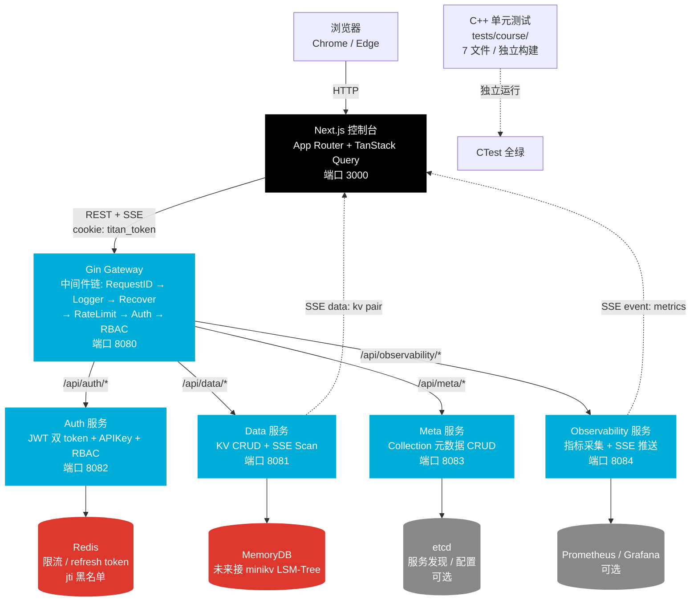
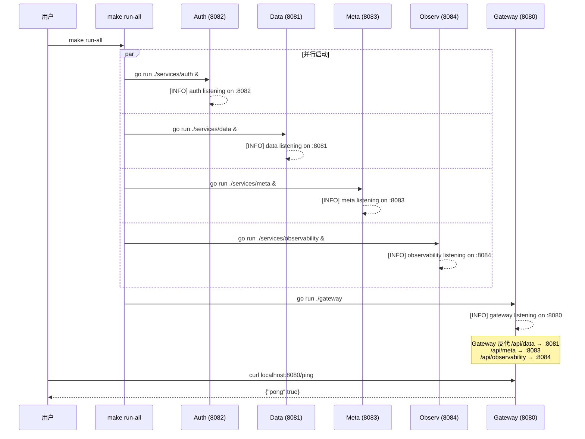
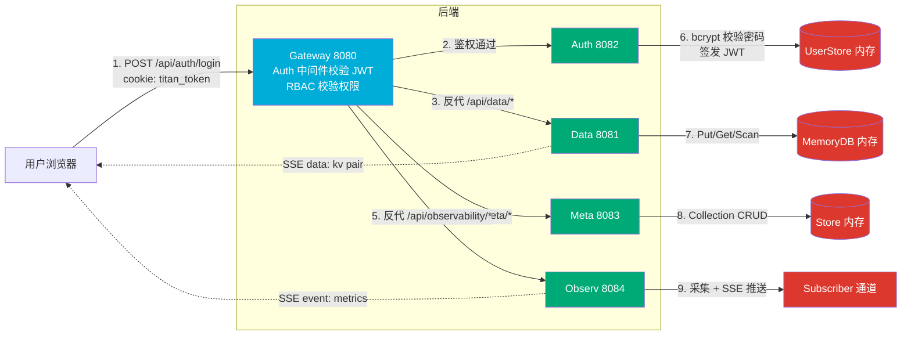

# Module 14 — 从零复现整个项目

> 对应规划：把 Module 01–13 学到的所有知识「串」起来，从 `git clone` 到端到端可用的分布式 KV 平台。
> 前置依赖：Module 01（环境搭建）、Module 12（Go 微服务 + Next.js 控制台）。
> 阅读姿势：建议打开两个窗口——左边是本教程，右边是终端，跟着敲。

---

## 1. 我们要复现什么（背景与目标）

### 1.1「复现」的含义

「复现（reproduce）」这个词在工程界有个朴素定义：**给一台干净的机器，照着说明做，最后能得到一个和作者跑起来一模一样的系统**。它不是「读懂代码」，也不是「跑通一个 demo」，而是完整地——从拉代码、装依赖、编译、启动服务、到端到端验证——把整个项目跑起来。

打个比方，这就像跟做一道菜：

- **读懂代码** ≈ 看菜谱，知道要放多少盐。
- **跑通一个 demo** ≈ 在朋友家借用厨房，做了一份尝尝。
- **复现整个项目** ≈ 回到自己家，从买菜、备料、生火、颠勺、调味到上桌，全程自己来，最后端出一桌菜。

我们这个 Module 要做的，就是后者——把 TitanKV 这道「大菜」从零端上桌。

### 1.2 复现成功的标志

我们把「成功」拆成可验证的清单，每一条都有明确的检查命令：

| # | 标志 | 验证方式 |
|---|------|----------|
| 1 | C++ 单元测试全部通过 | `ctest --test-dir build` 显示 7 个测试 PASS |
| 2 | 5 个 Go 服务全部启动 | `curl localhost:8080/ping` 返回 pong |
| 3 | Auth 注册/登录可用 | `curl POST /api/auth/register` 返回 201 |
| 4 | Meta Collection CRUD 可用 | `curl POST /api/meta/collections` 返回 201 |
| 5 | Data KV 读写可用 | `curl POST /api/data/kv` 后 `GET` 能读回 |
| 6 | Observability 指标可查 | `curl GET /api/observability/metrics` 返回 JSON |
| 7 | SSE 实时推送可用 | `curl GET /api/metrics/stream` 持续输出 `event: metrics` |
| 8 | Web 控制台可访问 | 浏览器打开 `http://localhost:3000` 能登录 |

8 条全绿，就算复现成功。

### 1.3 为什么这一步重要

前面 13 个 Module 我们是「分块学」——跳表归跳表、LSM 归 LSM、Raft 归 Raft。但真实系统是这些模块**组合**起来的：浏览器请求 → Gateway 鉴权 → Data 服务 → 存储引擎 → 响应。复现一遍，你才会真正理解「每一层在干什么、为什么这么设计、出了问题怎么排查」。这是面试时讲项目的底气，也是日后自己造轮子的脚手架。

---

## 2. 系统全貌（架构图）

先上一张全局图，心里有谱了再动手。



读图三件事：

1. **请求路径**：浏览器 → Next.js（3000）→ Gateway（8080）→ 四个业务服务。Gateway 是唯一对外暴露的入口，业务服务不直接被浏览器访问。
2. **存储层**：当前 MVP 用内存（MemoryDB）+ Redis（限流）。未来 Data 服务会接 minikv 的 LSM-Tree，Meta 会接 etcd。
3. **观测路径**：Observability 服务通过 SSE 把指标推给前端仪表盘，实时刷新。

> 坑提醒：Redis 和 etcd 都是「可选」的——服务在没有它们时会降级（限流变 no-op、refresh token 失效），不会启动失败。所以第一遍复现可以先不装 Redis，跑通主流程再补。

---

## 3. 复现路线图

整个复现分 8 个阶段，下面这张时序图标明了顺序和依赖：

```mermaid
gantt
    title TitanKV 复现路线图
    dateFormat X
    axisFormat %s

    section 环境
    阶段1 环境准备          :done, p1, 0, 1
    阶段2 拉取代码          :p2, after p1, 1

    section 依赖
    阶段3 Go 依赖整理       :p3, after p2, 1
    阶段4 Web 依赖安装       :p4, after p2, 1

    section 验证
    阶段5 C++ 单元测试(可选) :p5, after p2, 1

    section 启动
    阶段6 启动后端服务       :p6, after p3, 2
    阶段7 启动前端控制台     :p7, after p4, 1

    section 端到端
    阶段8 端到端验证         :p8, after p6 p7, 2
```



阶段说明：

1. **环境准备**：装好 Go / Node / CMake 等工具（参考 Module 01）。
2. **拉取代码**：`git clone` 仓库。
3. **Go 依赖整理**：`go mod tidy` + `go build ./...`。
4. **Web 依赖安装**：`npm install` + 配 `.env.local`。
5. **C++ 单元测试（可选）**：CMake 构建 + ctest。
6. **启动后端服务**：`make run-all` 或分终端启动 5 个服务。
7. **启动前端控制台**：`make web-dev`。
8. **端到端验证**：curl 一遍 + 浏览器点一遍。

> 为什么这个顺序？后端服务依赖 Go 编译，前端依赖 npm 包，两者可以并行准备（阶段 3、4）。C++ 测试是独立的，跑不跑都不影响后端。最后阶段 8 要前后端都起来才能做端到端。

---

## 4. 阶段一：环境准备

工具版本要求（详细安装步骤见 Module 01）：

| 工具 | 版本 | 用途 | 验证命令 |
|------|------|------|----------|
| Go | 1.23+ | 编译 5 个微服务 + SDK | `go version` |
| Node.js | 20+ | Next.js 控制台 | `node -v` |
| npm | 10+ | 装前端依赖 | `npm -v` |
| CMake | 3.20+ | 构建 C++ 测试（可选） | `cmake --version` |
| GCC / Clang | 12+ / 15+ | 编译 C++（可选） | `g++ --version` |
| Git | 2.30+ | 拉代码 | `git --version` |
| Docker | 24+ | 本地开发栈（可选） | `docker --version` |

一次性验证（复制粘贴即可）：

```bash
go version
node -v
npm -v
cmake --version
git --version
```

预期输出大致如下（版本号可以更高）：

```
go version go1.23.0 linux/amd64
v20.17.0
10.8.2
cmake version 3.28.3
git version 2.44.0
```

> 坑提醒：Windows 用户建议在 WSL2 里跑后端服务（Go + Redis），前端可以用 PowerShell。macOS 用户用 Homebrew 装即可。如果 `go version` 报「command not found」，说明 PATH 没配好，回头检查 Module 01 的安装步骤。

---

## 5. 阶段二：拉取代码

```bash
git clone https://github.com/Thezx-a/LumenDB.git
cd LumenDB
```

> 说明：GitHub 上的仓库名是 `LumenDB`（一个从零实现的分布式 KV 平台，见 `docs/REFACTORING.md`），代码内部模块名是 `titan`（Go module path 为 `github.com/titan-kv/titan`）。两者指的是同一个项目。

拉下来之后，项目根目录长这样：

```
LumenDB/
├── minikv/              # C++17 LSM-Tree 存储引擎（Module 05-08 的主角）
├── skynet/              # C++20 协程网络库（Module 09-10 的主角）
├── gateway/             # Go API 网关（Gin + 中间件链）
├── services/            # Go 微服务
│   ├── auth/            #   认证服务（JWT + APIKey + RBAC）
│   ├── data/            #   数据服务（KV CRUD + SSE Scan）
│   ├── meta/            #   元数据服务（Collection CRUD）
│   └── observability/   #   可观测性服务（指标 + SSE）
├── client-go/titan/     # Go SDK
├── web/                 # Next.js 控制台
├── tests/course/        # 课程单元测试（7 个文件，独立构建）
├── deploy/dev/          # Docker Compose 本地开发栈
├── docs/course/         # 中英双语课程（你正在看的这个）
├── CMakeLists.txt       # 顶层 CMake（聚合 minikv + 课程测试）
├── go.mod               # Go module 根
└── Makefile             # 统一构建/测试/启动入口
```

重点目录解释：

| 目录 | 是什么 | 对应 Module |
|------|--------|-------------|
| `minikv/src/core/` | LSM-Tree 核心：WAL/MemTable/SSTable/Compaction | 05、07、08 |
| `minikv/src/core/skip_list.h` | 手写跳表（MemTable 底层） | 05 |
| `minikv/src/core/bloom_filter.h` | 布隆过滤器 | 06 |
| `skynet/src/core/executor.cpp` | C++20 协程调度器 | 09 |
| `skynet/src/proxy/` | 反向代理 + 负载均衡 | 10 |
| `gateway/middleware/` | 6 个中间件（auth/rbac/ratelimit/...） | 12 |
| `services/auth/jwt.go` | JWT 双 token 实现 | 12 |
| `web/app/` | Next.js App Router 页面 | 12 |
| `tests/course/` | 7 个手撕题测试 | 05、06、03 |

> 坑提醒：如果你 `ls services/` 只看到 `auth/ meta/ observability/` 而没有 `data/`，说明 data 服务可能还在开发中。这种情况下 `make run-all` 会在启动 data 服务时报错，可以先跳过 data 服务，验证 auth/meta/observability 三条链路。详见第 13 节常见问题排查。

---

## 6. 阶段三：Go 依赖整理

### 6.1 下载依赖

```bash
go mod download
```

这一步会根据 `go.mod` 拉取所有依赖（gin、jwt、redis、etcd client 等）到本地缓存。第一次会慢一点，之后有缓存就快了。

### 6.2 整理 go.sum

```bash
go mod tidy
```

`go mod tidy` 会：①补全 `go.sum` 里缺失的哈希；②移除没用到的依赖。**为什么必须做**：`go.sum` 是依赖完整性校验文件，CI 环境会校验它，缺失或不一致会直接构建失败。

### 6.3 验证编译

```bash
go build ./...
```

`./...` 表示编译所有包。如果没报错，说明 5 个服务的 `main.go` 都能通过编译。

预期输出：**没有输出就是成功**（Go 的惯例，编译成功不打印任何东西）。

### 6.4 可能的报错

**报错 1：网络问题拉不到依赖**

```
go: github.com/gin-gonic/gin@v1.10.0: reading go.mod: Get "https://proxy.golang.org/...": dial tcp: i/o timeout
```

原因：默认 Go proxy 在国内可能访问不畅。解决：切换国内镜像。

```bash
go env -w GOPROXY=https://goproxy.cn,direct
go env -w GOSUMDB=sum.golang.google.cn
go mod download
```

**报错 2：版本冲突**

```
go: module requires go >= 1.23
```

原因：你的 Go 版本太低。解决：升级到 1.23+，参考 Module 01。

**报错 3：services/data 不存在**

```
go: no packages to build in ./services/data
```

原因：data 服务尚未实现（见第 5 节说明）。解决：先单独编译已存在的服务：

```bash
go build ./gateway ./services/auth ./services/meta ./services/observability ./client-go/...
```

### 6.5 验证 5 个服务都能编译

```bash
go build -o /tmp/gw ./gateway
go build -o /tmp/auth ./services/auth
go build -o /tmp/data ./services/data   # 若 data 未实现会报错，跳过即可
go build -o /tmp/meta ./services/meta
go build -o /tmp/observ ./services/observability
```

每条都没报错就 OK。生成的 `/tmp/*` 二进制可以 `rm` 掉，我们后面用 `go run` 直接跑。

---

## 7. 阶段四：Web 依赖安装

### 7.1 安装依赖

```bash
cd web
npm install
cd ..
```

`npm install` 会读 `web/package.json`，把 Next.js、React、TanStack Query、Tailwind 等装到 `web/node_modules/`。

> 坑提醒：如果 `npm install` 卡住或超时，换成淘宝镜像：
> ```bash
> npm config set registry https://registry.npmmirror.com
> npm install
> ```
> 装完后建议切回官方源，避免某些包同步延迟：
> ```bash
> npm config delete registry
> ```

### 7.2 验证构建

```bash
cd web
npm run build
cd ..
```

`npm run build` 会做生产构建（类型检查 + 静态生成）。如果通过，说明前端代码没问题。预期看到类似：

```
 ✓ Compiled successfully
 ✓ Linting and checking validity of types
 ✓ Generating static pages (5/5)
 Route (app)                              Size     First Load JS
 ┌ ○ /                                    1.2 kB         88 kB
 ├ ○ /dashboard                           2.1 kB         92 kB
 └ ○ /login                               1.5 kB         89 kB
```

### 7.3 配置环境变量

```bash
cd web
cat > .env.local <<'EOF'
NEXT_PUBLIC_API_BASE=http://localhost:8080
JWT_SECRET=dev-secret-change-in-production
EOF
cd ..
```

两个变量说明：

| 变量 | 作用 |
|------|------|
| `NEXT_PUBLIC_API_BASE` | 浏览器端请求 Gateway 的基础地址。`NEXT_PUBLIC_` 前缀表示会打包进客户端代码。 |
| `JWT_SECRET` | Next.js 中间件（`web/middleware.ts`）校验 cookie 中 JWT 的密钥，**必须和 Gateway 的 `JWT_SECRET` 一致**，否则中间件校验不过。 |

> 坑提醒：`.env.local` 是 Next.js 的本地环境变量文件，**不会被 git 提交**（已在 `.gitignore` 中）。生产环境要用 `.env.production` 或平台环境变量。

---

## 8. 阶段五：C++ 单元测试（可选）

这一阶段是可选的——它不影响后端服务运行，但能验证你的 C++ 工具链没问题，并且对应 Module 03/05/06 的手撕题。

### 8.1 构建

```bash
cmake -B build -DCMAKE_BUILD_TYPE=Release -DENABLE_TESTS=ON
cmake --build build -j
```

`-DENABLE_TESTS=ON` 会开启 `tests/course/` 的构建。GoogleTest 会通过 FetchContent 自动拉取（首次需要联网）。

> 坑提醒：顶层 CMake 的选项是 `ENABLE_TESTS`（不是 `ENABLE_COURSE_TESTS`）。`tests/course/CMakeLists.txt` 是独立子项目，即使 minikv 编译失败，课程测试也能单独跑。

### 8.2 运行测试

```bash
ctest --test-dir build --output-on-failure
```

预期输出（7 个测试全 PASS）：

```
Test project /path/to/build
    Start 1: course_skiplist
1/7 Test #1: course_skiplist .................   Passed   0.02 sec
    Start 2: course_lru
2/7 Test #2: course_lru ......................   Passed   0.01 sec
    Start 3: course_thread_pool
3/7 Test #3: course_thread_pool ..............   Passed   0.15 sec
    Start 4: course_unique_ptr
4/7 Test #4: course_unique_ptr ...............   Passed   0.01 sec
    Start 5: course_spsc_queue
5/7 Test #5: course_spsc_queue ................   Passed   0.03 sec
    Start 6: course_bloom_filter_math
6/7 Test #6: course_bloom_filter_math ........   Passed   0.01 sec
    Start 7: course_murmurhash
7/7 Test #7: course_murmurhash ................   Passed   0.01 sec

100% tests passed, 7/7 tests passed out of 7
```

### 8.3 7 个测试文件清单

| 文件 | 测试名 | 对应 Module | 考点 |
|------|--------|-------------|------|
| `test_skiplist_handwrite.cpp` | course_skiplist | 05 | 跳表插入/查找/随机层数 |
| `test_lru_handwrite.cpp` | course_lru | 13 | LRU 缓存淘汰 |
| `test_thread_pool_handwrite.cpp` | course_thread_pool | 03 | 线程池任务队列 |
| `test_unique_ptr_handwrite.cpp` | course_unique_ptr | 03 | 智能指针独占所有权 |
| `test_spsc_queue_handwrite.cpp` | course_spsc_queue | 03 | 无锁单生产单消费队列 |
| `test_bloom_filter_math.cpp` | course_bloom_filter_math | 06 | 布隆过滤器误判率公式 |
| `test_murmurhash.cpp` | course_murmurhash | 06 | MurmurHash 哈希函数 |

这些测试**不依赖 minikv 源码**，是纯手撕实现，所以即使你没装 C++ 编译器也不影响后端复现。

---

## 9. 阶段六：启动后端服务

### 9.1 方式 A：make run-all（推荐）

```bash
make run-all
```

Makefile 里的 `run-all` 会并行启动 5 个服务，Gateway 最后启动（因为它要反代其他服务）。启动顺序见下图：



> 坑提醒：`make run-all` 是前台阻塞的，按 `Ctrl+C` 会停掉所有服务。日志混在一起不好看，调试时建议用方式 B 分终端启动。

### 9.2 方式 B：分 5 个终端手动启动

开 5 个终端窗口，分别执行：

**终端 1 — Auth 服务（8082）**

```bash
make run-auth
# 或: go run ./services/auth
```

**终端 2 — Data 服务（8081）**

```bash
make run-data
# 或: go run ./services/data
```

**终端 3 — Meta 服务（8083）**

```bash
make run-meta
# 或: go run ./services/meta
```

**终端 4 — Observability 服务（8084）**

```bash
make run-observ
# 或: go run ./services/observability
```

**终端 5 — Gateway（8080，最后启动）**

```bash
make run-gateway
# 或: go run ./gateway
```

> 顺序很重要：Gateway 启动时会去 ping 各服务的健康检查（虽然不强依赖，但最好让业务服务先起来）。Auth/Meta/Observ 可以并行，Gateway 放最后。

### 9.3 服务端口与日志对照表

| 服务 | 端口 | 启动命令 | 健康检查 | 日志关键字 |
|------|------|----------|----------|------------|
| Gateway | 8080 | `make run-gateway` | `curl localhost:8080/ping` | `gateway listening on :8080` |
| Auth | 8082 | `make run-auth` | `curl localhost:8082/healthz` | `auth service listening on :8082` |
| Data | 8081 | `make run-data` | `curl localhost:8081/healthz` | `data service listening on :8081` |
| Meta | 8083 | `make run-meta` | `curl localhost:8083/healthz` | `meta service listening on :8083` |
| Observability | 8084 | `make run-observ` | `curl localhost:8084/healthz` | `observability listening on :8084` |

### 9.4 验证服务起来了

```bash
curl http://localhost:8080/ping
```

预期：

```json
{"pong":true}
```

再查一下 Gateway 的健康检查：

```bash
curl http://localhost:8080/healthz
```

预期：

```json
{"status":"ok","version":"0.1.0"}
```

> 坑提醒：如果看到 `[WARN] redis not available`，别慌——这是正常的。Redis 没装时限流会降级为 no-op，refresh token / jti 黑名单功能不可用，但注册/登录主流程没问题。要装 Redis 可以 `make docker-up` 或单独 `docker run -d -p 6379:6379 redis:7`。

---

## 10. 阶段七：启动前端控制台

### 10.1 启动 dev server

```bash
make web-dev
# 或: cd web && npm run dev
```

预期输出：

```
   ▲ Next.js 14.2.5
   - Local:        http://localhost:3000
   - Environments: .env.local

 ✓ Ready in 1200 ms
```

### 10.2 访问控制台

浏览器打开 http://localhost:3000 。

因为你还没登录，Next.js 中间件（`web/middleware.ts`）会拦截并 302 跳转到：

```
http://localhost:3000/login?from=/
```

看到登录表单就对了。

> 坑提醒：如果页面白屏，按 F12 看 Console。常见原因：①`.env.local` 没配 `NEXT_PUBLIC_API_BASE`，导致请求打到 `undefined`；②后端没启动，请求 8080 失败；③CORS 错误（见第 13 节）。

---

## 11. 阶段八：端到端验证

这一节是复现的核心——我们把 8 条成功标志挨个验证一遍。**所有 curl 命令都可直接复制**。

### 11.1 注册用户

```bash
curl -X POST http://localhost:8080/api/auth/register \
  -H "Content-Type: application/json" \
  -d '{"username":"admin","password":"admin123","role":"admin"}'
```

> 为什么先注册：Auth 服务的用户存在内存里（`UserStore`），重启就丢。所以每次复现都要先注册一个账号。密码至少 8 位（`binding:"min=8"`），role 必须是 `admin/writer/reader` 三选一。

预期输出（HTTP 201）：

```json
{
  "id": "a1b2c3d4-...",
  "username": "admin",
  "role": "admin"
}
```

### 11.2 登录拿 token

```bash
curl -X POST http://localhost:8080/api/auth/login \
  -H "Content-Type: application/json" \
  -d '{"username":"admin","password":"admin123"}'
```

预期输出（HTTP 200）：

```json
{
  "access_token": "eyJhbGciOiJIUzI1NiIsInR5cCI6IkpXVCJ9...",
  "refresh_token": "eyJhbGciOiJIUzI1NiIsInR5cCI6IkpXVCJ9...",
  "expires_in": 900,
  "token_type": "Bearer",
  "user_id": "a1b2c3d4-...",
  "role": "admin"
}
```

把 `access_token` 存到环境变量，后面所有需要鉴权的请求都要带上：

```bash
TOKEN="把上面 access_token 的值粘到这里"
```

> 为什么有两个 token：Access token 短期（15 分钟），refresh token 长期。Access 过期后用 refresh 换新的，避免用户反复输密码。这是 JWT 双 token 模式，详见 Module 12。

### 11.3 创建 Collection

```bash
curl -X POST http://localhost:8080/api/meta/collections \
  -H "Content-Type: application/json" \
  -H "Authorization: Bearer $TOKEN" \
  -d '{"name":"user_profile","ttl_seconds":3600,"schema":{"user_id":"string","age":"int"}}'
```

> 为什么要有 Collection：TitanKV 是「命名空间」模型——KV 都属于某个 Collection，Collection 定义 schema 和 TTL。Meta 服务管 Collection 元数据，Data 服务管 KV 数据。

预期输出（HTTP 201）：

```json
{
  "name": "user_profile",
  "ttl": 3600,
  "schema": {
    "age": "int",
    "user_id": "string"
  }
}
```

查一下列表：

```bash
curl http://localhost:8080/api/meta/collections -H "Authorization: Bearer $TOKEN"
```

预期：

```json
{
  "items": [
    {"name":"user_profile","ttl":3600,"schema":{"age":"int","user_id":"string"}}
  ],
  "count": 1
}
```

### 11.4 写入 KV

```bash
curl -X POST http://localhost:8080/api/data/kv \
  -H "Content-Type: application/json" \
  -H "Authorization: Bearer $TOKEN" \
  -d '{"key":"user:001","value":"{\"name\":\"Alice\",\"age\":30}"}'
```

> 为什么 key 用 `user:001` 这种带冒号的形式：这是 KV 存储的常见约定（RocksDB / Redis Hash 都这么用），冒号当命名空间分隔符，Scan 时按前缀范围查很方便。

预期输出（HTTP 200）：

```json
{"ok":true}
```

### 11.5 读取 KV

```bash
curl "http://localhost:8080/api/data/kv?key=user:001" \
  -H "Authorization: Bearer $TOKEN"
```

> 为什么 key 要 URL 编码：冒号在 URL 里虽然合法，但用 `url.QueryEscape` 更稳妥。curl 的 `-G --data-urlencode` 也能自动编码。

预期输出（HTTP 200，返回原始 value）：

```
{"name":"Alice","age":30}
```

### 11.6 扫描（SSE 流）

```bash
curl -N "http://localhost:8080/api/data/scan?start=user:000&end=user:999" \
  -H "Authorization: Bearer $TOKEN"
```

> 为什么用 `-N`：`curl -N` 关闭输出缓冲，否则 SSE 流会被攒一批再打出来，看不到「流」的效果。Scan 用 SSE 是因为结果集可能很大，流式返回避免阻塞和 OOM。

预期输出（每行一个 KV，`data:` 开头）：

```
data: {"key":"user:001","value":"{\"name\":\"Alice\",\"age\":30}"}

```

多写几条 key 再扫，能看到多条 `data:` 行。

### 11.7 查看指标快照

```bash
curl http://localhost:8080/api/observability/metrics \
  -H "Authorization: Bearer $TOKEN"
```

> 为什么单独有指标接口：控制台仪表盘首屏要一次性拿到当前指标（QPS / 延迟 / 存储），用 REST 拉快照；之后用 SSE 持续更新。这是「首屏 REST + 增量 SSE」的常见模式。

预期输出：

```json
{
  "qps": 12,
  "p50_ms": 3,
  "p99_ms": 18,
  "storage_gb": 0.001,
  "goroutines": 47,
  "uptime_seconds": 120
}
```

### 11.8 SSE 实时指标流

```bash
curl -N http://localhost:8080/api/metrics/stream \
  -H "Authorization: Bearer $TOKEN"
```

> 注意路径：实时流走的是 `/api/metrics/stream`（由 Observability 服务直接注册），不是 `/api/observability/metrics/stream`。Gateway 反代时 `/api/observability/*` 和 `/api/metrics/stream` 都会转发给 Observability 服务。

预期输出（每秒一条，`event: metrics` 开头）：

```
event: metrics
data: {"qps":12,"p50_ms":3,"p99_ms":18,"storage_gb":0.001,...}

event: metrics
data: {"qps":13,"p50_ms":3,"p99_ms":16,"storage_gb":0.001,...}

```

按 `Ctrl+C` 退出。

### 11.9 在 Web 控制台完成以上所有操作

回到浏览器 http://localhost:3000/login ，用刚注册的 `admin / admin123` 登录。登录成功后：

1. 页面跳转到 `/dashboard`。
2. 顶部能看到实时指标卡片（QPS / P50 / P99 / Storage），每秒刷新——这就是 SSE 在工作。
3. 进入 `/dashboard/collections` 能看到刚创建的 `user_profile` Collection。
4. 在 `/dashboard/users` 能管理用户（admin 角色）。

> 坑提醒：浏览器登录走的是 cookie（`titan_token`），不是 `Authorization` 头。`web/lib/api.ts` 里 `apiFetch` 会自动从 cookie 读 token 并塞到 `Authorization` 头里发给 Gateway。所以你看到 Network 面板里请求既有 cookie 又有 Authorization 头——这是设计如此。

到这一步，8 条成功标志全部验证完毕，复现完成！🎉

---

## 12. 架构复盘（数据流图）

我们用一个完整的数据流图把刚才走过的每一步串起来：



关键点回顾：

1. **Gateway 是唯一入口**：所有外部请求都走 8080，业务服务（8081–8084）不直接暴露。这是「BFF / API Gateway」模式。
2. **鉴权集中在 Gateway**：Auth 中间件校验 JWT / APIKey，RBAC 中间件校验权限（`kv:get` / `kv:put` / `collection:create` 等）。业务服务不需要重复鉴权。
3. **反向代理按路径分流**：`/api/data/*` → Data，`/api/meta/*` → Meta，`/api/observability/*` → Observ。Gateway 用 `httput.ReverseProxy` 实现。
4. **SSE 双通道**：Data 的 Scan 和 Observ 的 metrics 都是 SSE，但 event 类型不同（`data:` vs `event: metrics`），前端解析方式也不同。
5. **存储层是可替换的**：当前是内存，未来 Data 接 minikv（LSM-Tree），Meta 接 etcd。因为 Data 服务对存储有抽象层，换底层不影响上层 API。

---

## 13. 常见问题排查

### 13.1 端口被占用

**现象**：`make run-all` 报 `listen tcp :8080: bind: address already in use`。

**排查**：

```bash
# Linux / macOS
lsof -i :8080
# 或
netstat -tlnp | grep 8080

# Windows PowerShell
netstat -ano | findstr :8080
```

**解决**：杀掉占用进程，或换个端口启动：

```bash
GATEWAY_ADDR=:8090 make run-gateway   # 换成 8090
```

注意：换端口后前端的 `NEXT_PUBLIC_API_BASE` 也要同步改。

### 13.2 CORS 错误

**现象**：浏览器 Console 报 `Access to fetch ... has been blocked by CORS policy`。

**原因**：前端（3000）和后端（8080）不同源，Gateway 没配 CORS。

**解决**：Gateway 当前 MVP 没有专门的 CORS 中间件，但 Gin 的反代默认会透传。如果遇到问题，可以在 `gateway/router.go` 里加：

```go
r.Use(func(c *gin.Context) {
    c.Header("Access-Control-Allow-Origin", "http://localhost:3000")
    c.Header("Access-Control-Allow-Credentials", "true")
    c.Header("Access-Control-Allow-Headers", "Authorization, Content-Type")
    c.Header("Access-Control-Allow-Methods", "GET, POST, PUT, DELETE, OPTIONS")
    if c.Request.Method == "OPTIONS" {
        c.AbortWithStatus(204)
        return
    }
    c.Next()
})
```

### 13.3 Cookie 跨域问题

**现象**：登录成功但跳到 dashboard 后又被踢回 login。

**原因**：cookie 的 `SameSite=Lax` 在跨域时不会被发送。

**解决**：当前 `web/app/login/page.tsx` 设置的是 `SameSite=Lax`，适合同站（3000 → 8080 都是 localhost，算同站）。如果你用了不同域名，要改成 `SameSite=None; Secure`（需要 HTTPS）。

### 13.4 SSE 不触发

**现象**：`curl /api/metrics/stream` 一直卡住不出数据。

**排查**：

1. 确认 Observability 服务在跑（`curl localhost:8084/healthz`）。
2. 确认 `Content-Type: text/event-stream` 头有返回：

```bash
curl -i -N http://localhost:8080/api/metrics/stream -H "Authorization: Bearer $TOKEN" | head -5
```

3. 如果走 Nginx 反代，要加 `proxy_buffering off;` 和 `X-Accel-Buffering: no`（Observability 服务已经设置了后者）。

**原因**：SSE 需要长连接 + 立即 flush，任何缓冲层（Nginx、CDN、浏览器中间件）都会卡住它。

### 13.5 Go 服务启动失败

**现象**：`go run ./gateway` 报一堆错。

**排查清单**：

- 8080 是否已被占用（见 13.1）。
- `go.mod` 是否 tidy 过（`go mod tidy`）。
- Redis 没装？没关系，会降级，不报错只 warn。
- data 服务目录不存在？`make run-all` 会卡在 data 启动那行。解决：单独启动已存在的服务：

```bash
go run ./services/auth &
go run ./services/meta &
go run ./services/observability &
go run ./gateway
```

### 13.6 npm install 慢

**解决**：换淘宝镜像（见第 7.1 节）。

```bash
npm config set registry https://registry.npmmirror.com
cd web && npm install
```

### 13.7 C++ 测试编译失败

**现象**：`cmake --build build` 报 GoogleTest 拉取失败。

**原因**：FetchContent 需要联网拉 gtest，网络不通就失败。

**解决**：①配代理；②或跳过 C++ 测试（它不影响后端复现）；③或手动下载 gtest 放到 build 目录。

### 13.8 data 服务不存在

**现象**：`ls services/` 没有 `data/` 目录，或 `make run-data` 报 `no packages to build`。

**原因**：data 服务处于开发中，仓库当前可能未包含其实现。

**解决**：

1. 跳过 data 服务，单独启动其他 4 个服务（见 13.5）。
2. KV 相关 API（`/api/data/kv`、`/api/data/scan`）会返回 502（Gateway 反代找不到上游）。
3. auth / meta / observability 三条链路可正常验证。
4. 关注 `docs/REFACTORING.md` 的 Phase 4 进度，data 服务落地后即可完整复现。

> 这是「实事求是」的一步：MVP 阶段部分服务可能尚未实现，先把已有的跑通，等仓库更新再补全。

---

## 14. 进阶玩法

复现成功只是起点，下面几个方向可以让你更深入：

### 14.1 修改 minikv 源码，重新编译

`minikv/src/core/skip_list.h` 是手写跳表，试着改它的最大层数（`kMaxLevel`），重新 `cmake --build build`，跑 `minikv/tests/test_skip_list.cpp` 看结果变化。详见 Module 05。

### 14.2 给 Gateway 加新中间件

在 `gateway/middleware/` 加一个，比如请求耗时统计：

```go
// gateway/middleware/timing.go
package middleware

import (
    "log"
    "time"
    "github.com/gin-gonic/gin"
)

func Timing() gin.HandlerFunc {
    return func(c *gin.Context) {
        start := time.Now()
        c.Next()
        log.Printf("[TIMING] %s %s %dms", c.Request.Method, c.Request.URL.Path, time.Since(start).Milliseconds())
    }
}
```

然后在 `gateway/router.go` 的中间件链里挂上 `middleware.Timing()`。

### 14.3 给业务服务加新 API

比如给 Meta 服务加一个「批量删除 Collection」接口：在 `services/meta/handler.go` 加 `POST /api/meta/collections/batch-delete`，在 `RegisterRoutes` 注册。

### 14.4 改 Web 控制台 UI

`web/app/dashboard/page.tsx` 是仪表盘首页。试着加一个「最近请求」列表，调 `/api/observability/metrics` 展示。Tailwind 类名直接抄现有的 `metrics-card.tsx`。

### 14.5 用 Go SDK 写脚本

`client-go/titan/client.go` 是官方 SDK。写个脚本批量灌数据：

```go
package main

import (
    "context"
    "fmt"
    "github.com/titan-kv/titan/client-go/titan"
)

func main() {
    c := titan.New("http://localhost:8080", "")
    _, err := c.Login(context.Background(), "admin", "admin123")
    if err != nil { panic(err) }
    for i := 0; i < 1000; i++ {
        c.Put(context.Background(), fmt.Sprintf("k:%04d", i), fmt.Sprintf("v%d", i))
    }
    c.Scan(context.Background(), "k:0000", "k:9999", func(p titan.KVPair) error {
        fmt.Printf("%s = %s\n", p.Key, p.Value)
        return nil
    })
}
```

> 注意：SDK 用 API Key 鉴权（`X-API-Key` 头），用 JWT 时需要先 Login 拿 token 再手动塞 header。详见 Module 12。

---

## 15. 你已经掌握了什么

### 15.1 能力清单

走到这一步，你应该能：

- [x] 从零拉起一个「C++ 引擎 + Go 微服务 + Next.js 前端」的全栈系统。
- [x] 说清楚浏览器请求到存储引擎的完整链路（7 跳）。
- [x] 用 curl 完成注册/登录/CRUD/SSE 验证。
- [x] 排查端口/CORS/cookie/SSE 等常见运行时问题。
- [x] 看懂 Makefile / CMakeLists / go.mod / package.json 四套构建系统的协作。
- [x] 在任一层做小修改并重新部署验证。

### 15.2 面试话术

> 「我主导了 TitanKV 这个分布式 KV 平台的从零实现。整个系统分三层：底层是 C++17 的 LSM-Tree 存储引擎，我手写了跳表、WAL、SSTable、Compaction 和布隆过滤器；中间层是 Go 微服务，包括 Gin 网关（带 6 个中间件的洋葱模型）、JWT 双 token 认证、SSE 流式 Scan；上层是 Next.js 控制台，用 TanStack Query + SSE 做实时仪表盘。我能从 `git clone` 一路跑到端到端可用，包括 C++ 单元测试、5 个 Go 服务、Web 控制台的全部联调。」

要点：**有量化**（5 个服务、6 个中间件、7 个测试）、**有深度**（每层都点到具体技术）、**有闭环**（从 clone 到端到端）。

### 15.3 下一步

复现是「面」的覆盖，接下来建议挑一个「点」深挖：

| 想深入 | 看 Module | 动手 |
|--------|-----------|------|
| 存储引擎 | 07、08 | 改 Compaction 策略，跑 benchmark |
| 跳表 / 布隆过滤器 | 05、06 | 换哈希函数，测误判率 |
| 网络 / 协程 | 09、10 | 给 skynet 加个新 HTTP handler |
| 分布式一致性 | 11 | 跑 hashicorp/raft 示例 |
| 微服务架构 | 12 | 加个新服务（如 notification） |
| 面试求职 | 13 | 刷题 + 系统设计演练 |

每个 Module 都对应项目里真实可改的代码，改完能立刻验证。这是「以项目带学习」的核心——**不是看一遍就完，而是改一行、跑一次、想明白为什么**。

---

← [Module 13 — 系统设计与面试题汇总](./13-interview.md) | [返回课程大纲](./README.md) →
