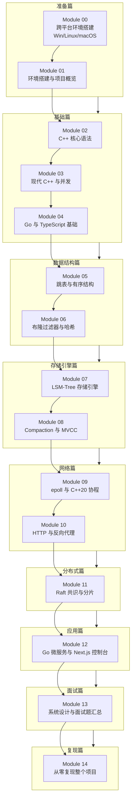

# TitanKV 实战课程 · 中文大纲

> 从零基础到能独立复现一个分布式 KV 存储系统，逐层递进，紧扣源码。

## 为什么这门课值得学

市面上的分布式存储课程很多，但大多停留在「调库 + 概念」的层面：你学会了怎么用 RocksDB、怎么部署 etcd，却没有真正写过一遍。**TitanKV 这门课不一样**——它的存储引擎、网络库、复制协议、控制台，全部是「从零写出来」的，每一行都能在源码里看到。

我们以 TitanKV 自身的 C++ / Go / TypeScript 代码为唯一教材，带你走完这样一条完整路径：先在 Module 00 把 Windows / Linux / macOS 三套环境都跑通，再用 13 个模块从 C++ 语法、跳表、布隆过滤器一路推到 LSM-Tree、epoll 协程、Raft 共识、Go 微服务、Next.js 控制台，最后在 Module 14 把整个项目从空目录开始复现一遍。

这不是速成班，是一条**真正能让你拿到 C++ 后端 / 分布式系统 Offer 的工程化路径**。

---

## 课程哲学

- **背景驱动**：每个模块都从「为什么需要这个东西」开始，而不是上来就讲 API。我们知道 MemTable 是为了什么、为什么要 Compaction、为什么 Raft 要 PreVote——理解了动机，细节才不会忘。
- **逐层递进**：基础 → 数据结构 → 存储 → 网络 → 分布式 → 应用 → 面试 → 复现。每一层只依赖上一层，不存在「跳跃式学习」。
- **源码对照**：所有概念都对应 TitanKV 真实代码。讲跳表，就读 `minikv/src/core/skip_list.h`；讲 epoll，就读 `skynet/src/net/`；讲 JWT 鉴权，就读 `services/auth/jwt.go`。
- **中英双语**：每个模块都有 `zh` + `en` 两版，技术名词保持原汁原味，方便你在简历和面试里直接用英文表述。

---

## 学习路径



---

## 模块清单

| 编号 | 模块名 | 层级 | 对应源码 | 难度 | 预计学时 | 关键概念 | 状态 |
|---|---|---|---|---|---|---|---|
| 00 | 跨平台环境搭建 | 准备 | `CMakeLists.txt` / `Makefile` / `minikv/CMakePresets.json` / `skynet/CMakePresets.json` | ⭐ | 2h | Windows MSVC / WSL2 / macOS Clang / vcpkg / 路径与编码 | 🚧 进行中 |
| 01 | 环境搭建与项目概览 | 基础 | `CMakeLists.txt` / `Makefile` / `go.mod` / `README.md` / `docs/REFACTORING.md` | ⭐ | 2h | CMake / Ninja / Go / Node / Docker / TitanKV 架构 / 重构路线 | ✅ 已完成 |
| 02 | C++ 核心语法 | 基础 | `minikv/src/utils/` | ⭐⭐ | 4h | 类型系统 / 指针引用 / 重载 / 命名空间 / 编译模型 / Slice·Status | ✅ 已完成 |
| 03 | 现代 C++ 与并发 | 基础 | `minikv/src/core/skip_list.h` / `minikv/src/utils/thread_pool.h` | ⭐⭐⭐ | 6h | 智能指针 / 移动语义 / lambda / constexpr / thread·mutex·atomic·shared_mutex | ✅ 已完成 |
| 04 | Go 与 TypeScript 基础 | 基础 | `go.mod` / `services/` / `web/` | ⭐⭐ | 4h | goroutine·channel / gRPC / TS 类型 / Next.js App Router | ✅ 已完成 |
| 05 | 跳表与有序结构 | 数据结构 | `minikv/src/core/skip_list.h` / `tests/course/test_skiplist_handwrite.cpp` | ⭐⭐⭐ | 4h | 概率平衡 / 随机层数 / 复杂度证明 / RB 树与 B+ 树对比 / 手撕跳表 | ✅ 已完成 |
| 06 | 布隆过滤器与哈希 | 数据结构 | `minikv/src/core/bloom_filter.h` / `minikv/src/utils/hash.h` | ⭐⭐⭐ | 4h | 位图 + k 哈希 / 误判率公式 / Counting BF / 一致性哈希环 / 虚拟节点 | ✅ 已完成 |
| 07 | LSM-Tree 存储引擎 | 存储引擎 | `minikv/src/core/{wal,memtable,sstable*}.cpp` | ⭐⭐⭐⭐ | 8h | WAL / MemTable / SSTable 文件格式 / 写读路径 / Block Cache | ✅ 已完成 |
| 08 | Compaction 与 MVCC | 存储引擎 | `minikv/src/core/{compaction,internal_key,manifest}.cpp` | ⭐⭐⭐⭐ | 8h | Leveled vs Tiered / 三种放大 / InternalKey 编码 / Manifest / 崩溃恢复 | ✅ 已完成 |
| 09 | epoll 与 C++20 协程 | 网络 | `skynet/src/net/` / `skynet/src/core/` | ⭐⭐⭐⭐⭐ | 10h | IO 多路复用 / LT·ET / Reactor / co_await·promise_type / 对称转移 / Executor | ✅ 已完成 |
| 10 | HTTP 与反向代理 | 网络 | `skynet/src/http/` / `skynet/src/proxy/` | ⭐⭐⭐⭐ | 6h | HTTP/1.1 状态机 / Router / 连接池 / 负载均衡 / 健康检查 | ✅ 已完成 |
| 11 | Raft 共识与分片 | 分布式 | `distributed/`（规划中）/ `services/meta/watcher.go` | ⭐⭐⭐⭐⭐ | 10h | Leader 选举 / 日志复制 / 安全性 / Snapshot / PreVote / 一致性哈希分片 | 🚧 进行中 |
| 12 | Go 微服务与 Next.js 控制台 | 应用 | `services/` / `gateway/` / `web/` | ⭐⭐⭐⭐ | 8h | Gin 网关 / JWT·RBAC·APIKey / gRPC / Next.js + TanStack Query + SSE 仪表盘 | ✅ 已完成 |
| 13 | 系统设计与面试题汇总 | 面试 | 全项目 + `tests/course/` | ⭐⭐⭐ | 6h | 设计 KV / 分布式锁 / 限流器 / LeetCode 1206·146·460 / 50+ 真题 / 手撕专题 | ✅ 已完成 |
| 14 | 从零复现整个项目 | 复现 | 全项目（端到端） | ⭐⭐⭐⭐⭐ | 20h+ | 项目脚手架 / 子系统拆分 / CI / 部署 / 全链路压测 / 简历与面试串讲 | 🚧 进行中 |

---

## 九大学习阶段

### 阶段一 · 准备篇（Module 00-01）
我们在正式写代码之前，先把三套操作系统（Windows / Linux / macOS）的开发环境跑通，并理解 TitanKV 的整体架构与 9 个 Phase 重构路线。这一阶段不讲算法，只解决「能不能在本地编译运行」这个最朴素的问题——很多同学卡在第一步不是不会 C++，而是环境配不出来。

### 阶段二 · 基础篇（Module 02-04）
我们用三个模块把 C++ / Go / TypeScript 的核心语法补齐。C++ 部分讲完类型系统、现代 C++ 与并发，对照 `skip_list.h` 的读写锁实现；Go 和 TypeScript 部分覆盖 goroutine、gRPC、Next.js App Router，为后面分布式层与控制台打地基。**强烈建议不要跳过这一篇**，否则后面看 SSTable 和 Raft 的代码会非常吃力。

### 阶段三 · 数据结构篇（Module 05-06）
跳表和布隆过滤器是 LSM-Tree 的「两大支柱」：MemTable 用跳表存有序数据，SSTable 用布隆过滤器加速点查。我们不仅要会写，还要会证——概率平衡的期望复杂度、误判率的参数推导，都是高频面试题。

### 阶段四 · 存储引擎篇（Module 07-08）
这是课程的核心硬骨头。我们深入 `minikv` 的 WAL / MemTable / SSTable 文件格式，画清楚写路径与读路径，再讲 Compaction 策略（Leveled vs Tiered）、三种放大、InternalKey 编码与 MVCC、Manifest 持久化与崩溃恢复。读完这一篇，你就能在面试里把「设计一个 KV 存储」答得有理有据。

### 阶段五 · 网络篇（Module 09-10）
我们离开存储层，进入网络层。先讲 epoll 的 LT/ET、Reactor 模式，再用 C++20 协程把它们重写一遍——`co_await` / `promise_type` / 对称转移到底是怎么工作的。Module 10 在此基础上实现 HTTP/1.1 状态机解析、Router、连接池、负载均衡与健康检查，对应 `skynet` 的完整反向代理能力。

### 阶段六 · 分布式篇（Module 11）
单机存储一旦不够用，就要进入分布式。我们讲 Raft 的 Leader 选举、日志复制、安全性、Snapshot、PreVote，再用一致性哈希做分片与在线再均衡。这一篇与 Module 12 的 Go 微服务紧密耦合——分布式层最终会以 Go 服务的形式暴露出来。

### 阶段七 · 应用篇（Module 12）
我们用 Go 微服务（gateway / auth / data / meta / observability）+ Next.js 控制台把整个系统串起来：JWT/RBAC/APIKey 鉴权、gRPC 服务间通信、TanStack Query + SSE 实时仪表盘。这是简历里最直观的项目展示部分。

### 阶段八 · 面试篇（Module 13）
我们把前面所有模块浓缩成 50+ 道真实面试题：系统设计题（设计 KV / 分布式锁 / 限流器）、LeetCode 题号题（1206 跳表 / 146 LRU / 460 LFU）、牛客面经、手撕专题（跳表 / LRU / 线程池 / 智能指针 / epoll 服务器）。求职冲刺阶段，每天刷两三道就够。

### 阶段九 · 复现篇（Module 14）
最后一篇，我们从空目录开始，重新搭一遍整个 TitanKV：项目脚手架、子系统拆分、CI 流水线、Docker/K8s 部署、全链路压测、简历与面试串讲。**只有自己复现一遍，知识才算真正内化。** 这也是这门课区别于「看一遍就忘」的最大特征。

---

## 环境要求速览

| 工具 | 版本 | 用途 | 安装教程 |
|---|---|---|---|
| Visual Studio 2022 / MSVC | 17.x | Windows 上编译 C++17/20 | https://visualstudio.microsoft.com/ |
| WSL2 + Ubuntu | 22.04+ | Windows 上跑 Linux 工具链（推荐） | `wsl --install` |
| GCC | 12+ | Linux/WSL2 编译 C++17/20 | `apt install g++-12` |
| Clang | 15+ | macOS 编译 C++17/20 | `xcode-select --install` 或 brew |
| CMake | 3.20+ | 构建系统 | https://cmake.org/download/ |
| Ninja | 1.11+ | 加速构建（推荐） | `pip install ninja` 或 `brew install ninja` |
| vcpkg | latest | Windows 下安装 C++ 依赖（可选） | https://github.com/microsoft/vcpkg |
| Go | 1.23+ | 微服务 / SDK | https://go.dev/dl/ |
| Node.js | 20+ | Next.js 控制台 | https://nodejs.org/ |
| Docker | 24+ | 本地开发栈（Postgres/Redis/etcd/Jaeger/Prometheus/Grafana） | https://docs.docker.com/get-docker/ |
| Python | 3.10+ | minikv Python 客户端（可选） | https://www.python.org/ |

> Module 00 会按 Windows / Linux / macOS 三种组合分别给出最小可运行配置。

---

## 快速开始

```bash
# 1. 克隆仓库
git clone <repo-url> titan-kv
cd titan-kv

# 2. C++ 构建与测试（任选其一）
#    Linux / macOS / WSL2
cmake -B build -DCMAKE_BUILD_TYPE=Release -DENABLE_TESTS=ON
cmake --build build -j
ctest --test-dir build --output-on-failure
#    Windows MSVC
cmake -B build -G "Visual Studio 17 2022" -DENABLE_TESTS=ON
cmake --build build --config Release
ctest --test-dir build --build-config Release --output-on-failure

# 3. 启动本地开发栈并运行所有服务
docker compose -f deploy/dev/docker-compose.yml up -d
make run-all        # 5 个 Go 微服务并行
make web-install && make web-dev   # Next.js 控制台 http://localhost:3000
```

统一入口还有这些常用目标：`make help` / `make build` / `make test` / `make lint` / `make docker-up` / `make docker-down`。

---

## 如何阅读每个模块

每个模块都遵循统一的六段式结构，方便你按节奏推进：

1. **背景与动机**：这个东西为什么存在？它解决的是什么问题？不弄清动机就学细节，等于背字典。
2. **核心知识**：本模块必须掌握的概念清单，作为「自我提问」的清单使用。
3. **内容详解**：结合 TitanKV 源码的深度讲解，含图示与代码引用，所有代码引用都是相对路径，可点击跳转。
4. **思考题**：概念辨析与原理追问，检验理解的深度，鼓励先自己想再读答案。
5. **动手题**：编码实践，对应项目源码或 LeetCode 题目。**这一节必做**——光看不做等于没学。
6. **自检**：关键词填空 / 判断题，快速检验掌握程度。**先独立作答再对照参考答案**，不要直接看答案。

---

## 面向人群

- **C++ 后端求职者**：目标公司是字节、腾讯、阿里、Meta 等做基础架构或存储的团队，需要一个能在简历上立得住的项目。
- **分布式系统学习者**：已经读过 MIT 6.824、DDIA，但没从零写过 Raft / LSM-Tree，需要一个能动手的载体。
- **想从 0 到 1 做一个完整项目的工程师**：日常工作只接触到某一块（比如只写业务 Go、只写 C++ 算法），想把整个分布式系统的全貌串起来。
- **跨端学习者**：想从纯 C++ 跨到 Go / TypeScript，或反过来，需要一个覆盖三种语言的真实工程。

---

## 学习建议

作为带过几届学员的讲师，我们把经验浓缩成几条建议：

- **不要跳过基础篇。** Module 02-04 看起来「简单」，但现代 C++ 的右值语义、Go 的 channel 调度模型，恰恰是后面存储引擎与网络层最容易踩坑的地方。基础不牢，地动山摇。
- **动手题必做，思考题必答。** 这门课的每一个手撕代码（跳表、LRU、线程池、智能指针、epoll 服务器）都对应 `tests/course/` 下的真实单测，跑通才算掌握。
- **自检先独立作答。** 别急着翻答案。哪怕答错了，你的大脑也会主动去比对差异，记忆效果远好于被动读。
- **每周回顾一次模块地图。** 学习是螺旋上升的过程，看到后面的 Compaction 时回头再看 Module 06 的布隆过滤器，会有全新的理解。
- **Module 14 不要拖到最后才看。** 边学边把当周学的模块在另一个空仓库里复现一段，到 Module 14 就只是把碎片拼起来，而不是从零开始。
- **遇到不懂的概念，先在源码里 `grep` 一遍。** TitanKV 的代码就是最好的教材，比任何博客都准确。

---

## 下一步

进入 [Module 00 — 跨平台环境搭建](./00-cross-platform-env.md) 开始学习。

如果你已经在 Linux 上跑通过项目，可以直接跳到 [Module 01 — 环境搭建与项目概览](./01-overview.md)。
